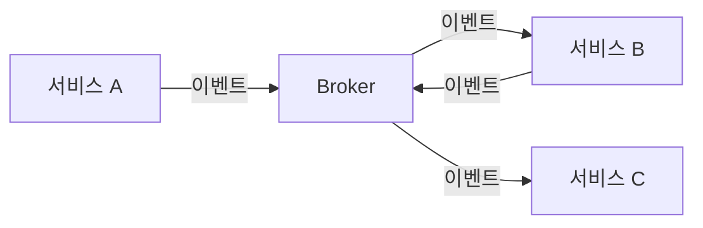
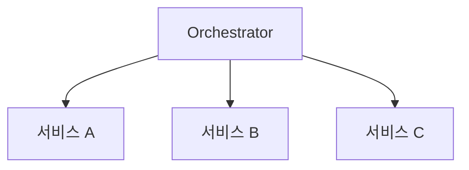

# Saga Pattern 면접 정리

---

## 1. 핵심 개념 요약

### 1.1 Saga Pattern이란?

**Saga Pattern**은 마이크로서비스 환경에서 **분산 트랜잭션**을 관리하는 패턴입니다. 여러 서비스에 걸친 트랜잭션을 **일련의 로컬 트랜잭션**으로 분해하고, 실패 시 **보상 트랜잭션**으로 롤백합니다.

### 1.2 왜 Saga가 필요한가?

| 2PC (Two-Phase Commit) | Saga |
|------------------------|------|
| 모든 참가자 응답 대기 | 비동기 진행 |
| 락 오래 유지 | 락 빠르게 해제 |
| Coordinator 단일 장애점 | 분산 |
| NoSQL/MQ 미지원 | 범용 |

### 1.3 두 가지 구현 방식

| 방식 | 설명 | 적합 |
|------|------|------|
| **Choreography** | 이벤트 기반, 분산 제어 | 단순 흐름 |
| **Orchestration** | 중앙 조율자 | 복잡한 흐름 |

---

## 2. Choreography vs Orchestration

### 2.1 Choreography



### 2.2 Orchestration



### 2.3 비교

| 기준 | Choreography | Orchestration |
|------|--------------|---------------|
| 제어 | 분산 | 중앙 집중 |
| 결합도 | 낮음 | 중간 |
| 워크플로우 파악 | 어려움 | 용이 |
| 단일 장애점 | 없음 | Orchestrator |
| 디버깅 | 어려움 | 용이 |

---

## 3. 면접 예상 질문 및 모범 답변

### Q1. Saga Pattern이란 무엇인가요?

> Saga Pattern은 마이크로서비스 환경에서 **분산 트랜잭션**을 관리하는 패턴입니다.
>
> **핵심 아이디어**:
> 1. 여러 서비스에 걸친 트랜잭션을 **로컬 트랜잭션의 시퀀스**로 분해
> 2. 각 로컬 트랜잭션이 성공하면 다음 단계 진행
> 3. 실패하면 **보상 트랜잭션**을 역순으로 실행하여 롤백
>
> 예를 들어 주문 처리 Saga는:
> - T1: 주문 생성 → T2: 재고 차감 → T3: 결제 처리
> - T3 실패 시: C2: 재고 복원 → C1: 주문 취소

### Q2. 2PC와 Saga의 차이는?

> **2PC(Two-Phase Commit)**는 전통적인 분산 트랜잭션 프로토콜입니다.
>
> | 2PC | Saga |
> |-----|------|
> | 동기, 모든 참가자 대기 | 비동기, 독립 진행 |
> | 락 오래 유지 | 락 빠르게 해제 |
> | Coordinator 단일 장애점 | 분산 제어 가능 |
> | 강한 일관성 | 최종 일관성 |
>
> 2PC는 **가용성과 성능 저하** 문제가 있고, 대부분의 NoSQL과 MQ가 지원하지 않습니다. Saga는 이런 환경에서 **높은 가용성**을 유지하면서 트랜잭션을 관리합니다.

### Q3. Choreography와 Orchestration의 차이는?

> 두 방식은 **제어권의 위치**가 다릅니다.
>
> **Choreography**:
> - 중앙 조율자 없음
> - 서비스들이 이벤트를 발행/구독하며 협력
> - 느슨한 결합, 확장성 좋음
> - 워크플로우 파악 어려움
>
> **Orchestration**:
> - 중앙 Orchestrator가 전체 흐름 관리
> - Orchestrator가 각 서비스에 명령
> - 워크플로우 명확, 디버깅 용이
> - Orchestrator가 단일 장애점
>
> **선택 기준**:
> - 단순한 흐름, 적은 서비스 → Choreography
> - 복잡한 흐름, 많은 서비스 → Orchestration

### Q4. 보상 트랜잭션이란?

> **보상 트랜잭션(Compensating Transaction)**은 이미 커밋된 로컬 트랜잭션의 **효과를 취소하는 트랜잭션**입니다.
>
> **DB ROLLBACK과의 차이**:
> - ROLLBACK: 커밋 전 변경 취소
> - 보상: 커밋 후 **새로운 트랜잭션**으로 되돌림
>
> **예시**:
> | 로컬 트랜잭션 | 보상 트랜잭션 |
> |---------------|---------------|
> | 재고 차감 | 재고 복원 |
> | 결제 처리 | 결제 환불 |
> | 포인트 적립 | 포인트 차감 |
>
> **설계 원칙**:
> - 반드시 **멱등성** 보장 (재시도해도 결과 동일)
> - 실행 순서의 **역순**으로 보상
> - 비즈니스 의미를 담은 작업

### Q5. Saga 실패 시 어떻게 처리하나요?

> Saga 실패 시 **보상 트랜잭션을 역순으로 실행**합니다.
>
> **예시 (주문 Saga)**:
> ```
> T1: 주문 생성 → T2: 재고 차감 → T3: 결제 처리 (실패!)
> 
> 보상 시작:
> C2: 재고 복원 → C1: 주문 취소
> ```
>
> **보상도 실패하면?**
> 1. **재시도**: 일시적 오류는 Retry로 해결
> 2. **Dead Letter Queue**: 재시도 실패 시 DLQ에 저장
> 3. **수동 개입**: 운영팀이 수동 처리
> 4. **알림**: 즉시 모니터링 알림
>
> 보상 트랜잭션은 **멱등해야** 재시도가 안전합니다.

### Q6. Saga 상태 관리는 어떻게 하나요?

> Saga 상태 관리는 특히 Orchestration에서 중요합니다.
>
> **상태 저장**:
> ```java
> @Entity
> public class SagaState {
>     @Id
>     private String id;
>     private SagaStatus status;    // STARTED, IN_PROGRESS, COMPLETED, COMPENSATING
>     private SagaStep currentStep; // 현재 단계
>     private String orderId;
>     private LocalDateTime createdAt;
> }
> ```
>
> **상태 관리 이유**:
> 1. Orchestrator 재시작 후 복구
> 2. 진행 상태 모니터링
> 3. 디버깅 및 감사
> 4. 타임아웃 처리

### Q7. Saga를 언제 사용해야 하나요?

> **적합한 경우**:
> - 마이크로서비스 간 트랜잭션
> - 장시간 실행 트랜잭션
> - 2PC 사용 불가능 (NoSQL, MQ)
> - 높은 가용성 필요
>
> **부적합한 경우**:
> - 강한 일관성이 반드시 필요할 때
> - 단일 DB 트랜잭션으로 가능할 때
> - 보상 설계가 불가능할 때
>
> **주의**: Saga는 **최종 일관성**을 제공합니다. 모든 단계가 완료될 때까지 중간 상태가 존재합니다.

### Q8. 보상이 불가능한 작업은 어떻게 처리하나요?

> 일부 작업은 보상이 불가능합니다.
>
> **예시**:
> - 이메일 발송 (이미 보낸 메일)
> - SMS 발송
> - 외부 API 호출
>
> **해결 전략**:
> 1. **순서 조정**: 보상 불가능한 작업을 Saga 끝에 배치
> 2. **Semantic Lock**: 임시 상태로 먼저 처리, 확정 후 완료
>    - 예: "결제 예약" → 모든 단계 완료 → "결제 확정"
> 3. **알림**: 수동 처리 필요 시 운영팀 알림

---

## 4. 핵심 개념 체크리스트

- [ ] Saga Pattern의 정의와 필요성을 설명할 수 있는가?
- [ ] 2PC와 Saga의 차이를 설명할 수 있는가?
- [ ] Choreography와 Orchestration의 차이와 선택 기준을 아는가?
- [ ] 보상 트랜잭션의 개념과 설계 원칙을 이해하는가?
- [ ] Saga 실패 시 처리 방법을 설명할 수 있는가?
- [ ] Saga 상태 관리의 중요성을 아는가?
- [ ] 보상 불가능한 작업의 처리 전략을 아는가?

---

*📅 작성일: 2025-01-25*
*📚 관련 문서: [03_Saga_Pattern.md](./03_Saga_Pattern.md)*
