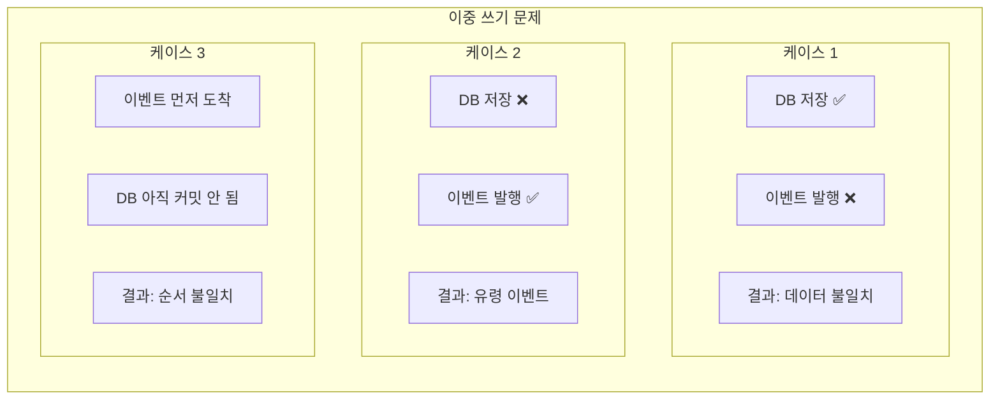
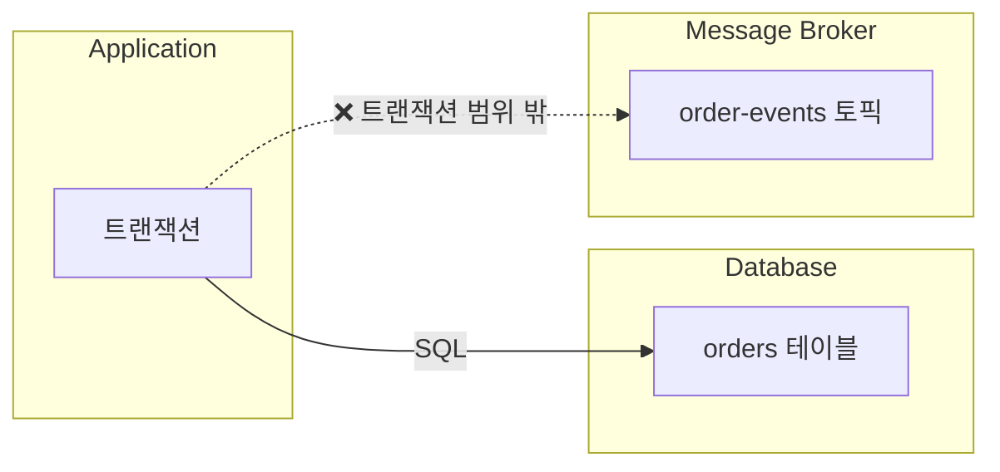
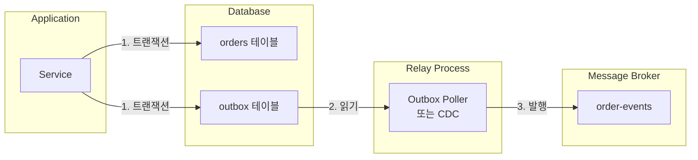
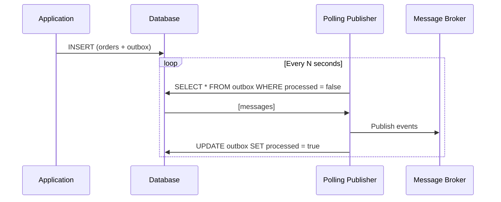
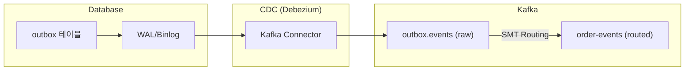
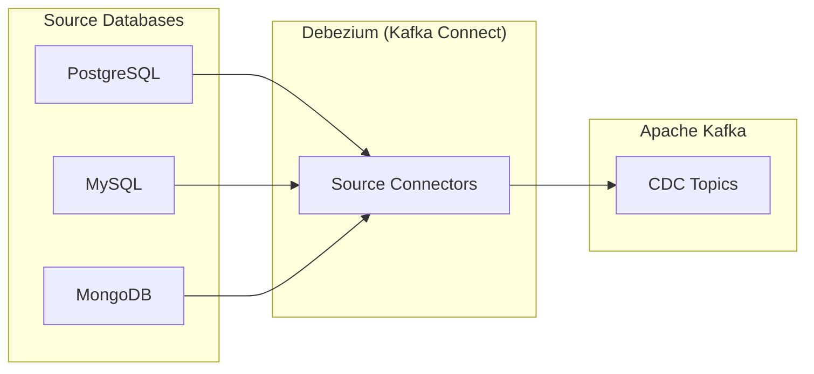
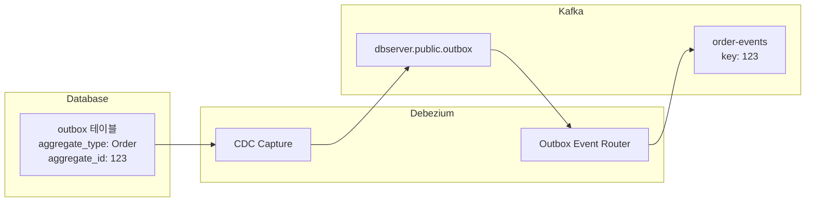
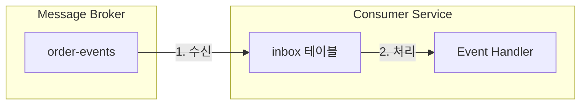
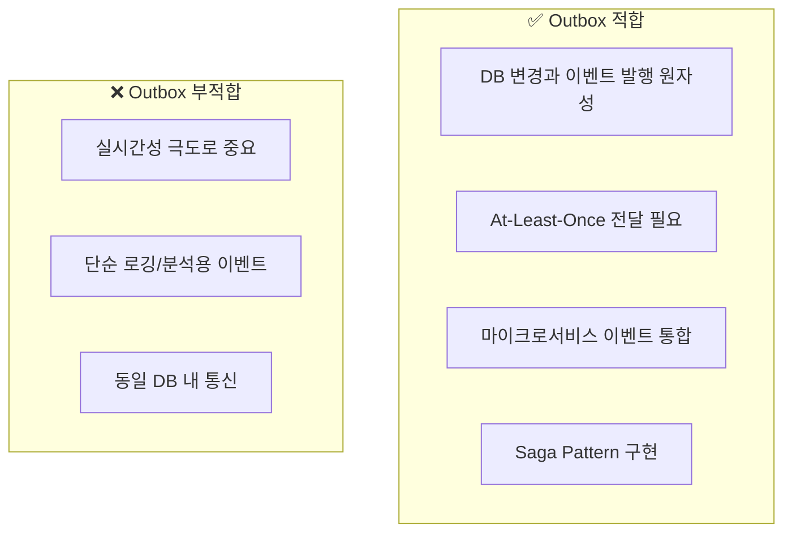

# Outbox Pattern (아웃박스 패턴)

---

## 📌 핵심 요약

> **Outbox Pattern**은 **데이터베이스 변경**과 **메시지 발행**을 **원자적으로 처리**하기 위한 패턴이다. 비즈니스 데이터와 함께 **Outbox 테이블**에 메시지를 저장하고, 별도의 프로세스가 이 메시지를 Message Broker로 전달한다. 이를 통해 **이중 쓰기(Dual Write) 문제**를 해결하고 **At-Least-Once 전달**을 보장한다.

---

## 🎯 학습 목표

이 내용을 읽고 나면:
- [ ] 이중 쓰기(Dual Write) 문제와 그 위험성을 이해할 수 있다
- [ ] Outbox Pattern의 동작 원리를 설명할 수 있다
- [ ] Polling 방식과 CDC(Change Data Capture) 방식을 비교할 수 있다
- [ ] Debezium을 활용한 CDC 구현 방법을 알 수 있다
- [ ] Outbox Pattern의 장단점과 적용 시나리오를 판단할 수 있다

---

## 📖 본문 정리

### 1. 이중 쓰기 문제 (Dual Write Problem)

#### 1.1 문제 상황

마이크로서비스에서 **DB 저장**과 **이벤트 발행**을 함께 해야 하는 경우가 많습니다.

```java
// ❌ 잘못된 예: 이중 쓰기 문제
@Service
public class OrderService {
    
    @Transactional
    public void createOrder(CreateOrderRequest request) {
        // 1. DB 저장
        Order order = orderRepository.save(new Order(request));
        
        // 2. 이벤트 발행 (트랜잭션 밖!)
        kafkaTemplate.send("order-events", new OrderCreatedEvent(order));
    }
}
```

이 코드의 문제점:
1. **DB 저장 성공, 이벤트 발행 실패**: 주문은 생성되었지만 다른 서비스는 모름
2. **DB 저장 실패, 이벤트 발행 성공**: 존재하지 않는 주문에 대한 이벤트
3. **둘 다 성공했지만 순서 불일치**: 이벤트가 먼저 도착



#### 1.2 왜 트랜잭션으로 묶을 수 없나?

DB와 Message Broker는 **별개의 시스템**입니다. 하나의 ACID 트랜잭션으로 묶을 수 없습니다.



> 💬 **비유**: 은행 송금과 문자 알림을 동시에 처리하려는 것과 같습니다. 송금은 완료됐는데 문자 서버가 죽으면 문자는 안 갑니다. 둘은 별개의 시스템입니다.

---

### 2. Outbox Pattern 개념

#### 2.1 핵심 아이디어

**이벤트를 DB에 먼저 저장**하고, 별도의 프로세스가 **DB에서 읽어서 발행**합니다.



#### 2.2 Outbox 테이블 구조

```sql
CREATE TABLE outbox (
    id BIGSERIAL PRIMARY KEY,
    aggregate_type VARCHAR(255) NOT NULL,     -- 예: "Order"
    aggregate_id VARCHAR(255) NOT NULL,       -- 예: "order-123"
    event_type VARCHAR(255) NOT NULL,         -- 예: "OrderCreated"
    payload JSONB NOT NULL,                   -- 이벤트 데이터
    created_at TIMESTAMP WITH TIME ZONE DEFAULT NOW(),
    
    -- Polling 방식용
    processed BOOLEAN DEFAULT FALSE,
    processed_at TIMESTAMP WITH TIME ZONE
);

-- 인덱스
CREATE INDEX idx_outbox_unprocessed ON outbox (created_at) WHERE processed = FALSE;
CREATE INDEX idx_outbox_aggregate ON outbox (aggregate_type, aggregate_id);
```

#### 2.3 구현 예시 (Java)

```java
@Service
public class OrderService {
    
    private final OrderRepository orderRepository;
    private final OutboxRepository outboxRepository;
    
    @Transactional  // 하나의 트랜잭션!
    public Order createOrder(CreateOrderRequest request) {
        // 1. 비즈니스 로직
        Order order = Order.create(request);
        orderRepository.save(order);
        
        // 2. Outbox에 이벤트 저장 (같은 트랜잭션)
        OutboxMessage message = new OutboxMessage();
        message.setAggregateType("Order");
        message.setAggregateId(order.getId());
        message.setEventType("OrderCreated");
        message.setPayload(toJson(new OrderCreatedEvent(order)));
        outboxRepository.save(message);
        
        return order;
    }
}
```

---

### 3. 전달 방식: Polling vs CDC

#### 3.1 Polling Publisher (폴링 방식)

주기적으로 Outbox 테이블을 조회하여 미처리 메시지를 발행합니다.



**구현**:

```java
@Component
public class OutboxPollingPublisher {
    
    private final OutboxRepository outboxRepository;
    private final KafkaTemplate<String, String> kafkaTemplate;
    
    @Scheduled(fixedDelay = 1000)  // 1초마다
    @Transactional
    public void publishOutboxMessages() {
        List<OutboxMessage> messages = outboxRepository
            .findByProcessedFalseOrderByCreatedAtAsc(100);  // 최대 100개
        
        for (OutboxMessage message : messages) {
            try {
                String topic = message.getAggregateType().toLowerCase() + "-events";
                
                kafkaTemplate.send(topic, message.getAggregateId(), message.getPayload())
                    .get();  // 동기 대기
                
                message.setProcessed(true);
                message.setProcessedAt(Instant.now());
                outboxRepository.save(message);
                
            } catch (Exception e) {
                log.error("Failed to publish message: {}", message.getId(), e);
                // 다음 폴링에서 재시도
            }
        }
    }
}
```

**Polling 방식의 장단점**:

| 장점 | 단점 |
|------|------|
| 구현 간단 | 지연 시간 (폴링 주기) |
| 추가 인프라 불필요 | DB 부하 (주기적 쿼리) |
| 디버깅 용이 | 확장성 제한 |

#### 3.2 CDC (Change Data Capture)

**CDC**는 DB의 변경 로그(WAL, Binlog)를 캡처하여 실시간으로 이벤트를 발행합니다.



**CDC 방식의 장단점**:

| 장점 | 단점 |
|------|------|
| 실시간 (수 밀리초) | 인프라 복잡도 |
| DB 부하 없음 | 학습 곡선 |
| 높은 확장성 | 운영 부담 |
| 순서 보장 | 초기 설정 어려움 |

---

### 4. Debezium을 활용한 CDC 구현

#### 4.1 Debezium이란?

**Debezium**은 오픈소스 CDC 플랫폼입니다. PostgreSQL, MySQL, MongoDB 등의 변경 사항을 캡처하여 Kafka로 스트리밍합니다.



#### 4.2 Debezium 설정 (PostgreSQL)

**1. PostgreSQL 설정 (논리적 복제 활성화)**:

```sql
-- postgresql.conf
wal_level = logical
max_replication_slots = 4
max_wal_senders = 4

-- 사용자 권한
ALTER USER debezium WITH REPLICATION;
```

**2. Kafka Connect 설정**:

```json
{
    "name": "outbox-connector",
    "config": {
        "connector.class": "io.debezium.connector.postgresql.PostgresConnector",
        "database.hostname": "postgres",
        "database.port": "5432",
        "database.user": "debezium",
        "database.password": "secret",
        "database.dbname": "orders_db",
        "database.server.name": "orders",
        
        "table.include.list": "public.outbox",
        
        "transforms": "outbox",
        "transforms.outbox.type": "io.debezium.transforms.outbox.EventRouter",
        "transforms.outbox.table.field.event.key": "aggregate_id",
        "transforms.outbox.table.field.event.type": "event_type",
        "transforms.outbox.table.field.event.payload": "payload",
        "transforms.outbox.route.by.field": "aggregate_type",
        "transforms.outbox.route.topic.replacement": "${routedByValue}-events"
    }
}
```

#### 4.3 Outbox Event Router

Debezium의 **Outbox Event Router** SMT(Single Message Transform)는 Outbox 테이블의 메시지를 적절한 토픽으로 라우팅합니다.



**라우팅 결과**:
- `aggregate_type: Order` → 토픽: `order-events`
- `aggregate_id: 123` → 메시지 키: `123`
- `payload` → 메시지 값

#### 4.4 Outbox 테이블 최적화 (CDC용)

CDC 방식에서는 `processed` 컬럼이 필요 없습니다. 대신 **삭제**로 처리 완료를 표시합니다.

```sql
-- CDC용 Outbox 테이블 (간소화)
CREATE TABLE outbox (
    id UUID PRIMARY KEY DEFAULT gen_random_uuid(),
    aggregate_type VARCHAR(255) NOT NULL,
    aggregate_id VARCHAR(255) NOT NULL,
    event_type VARCHAR(255) NOT NULL,
    payload JSONB NOT NULL,
    created_at TIMESTAMP WITH TIME ZONE DEFAULT NOW()
);

-- 주기적으로 삭제 (Debezium이 캡처한 후)
DELETE FROM outbox WHERE created_at < NOW() - INTERVAL '1 hour';
```

---

### 5. Kafka를 활용한 Outbox 구현 (Spring Boot)

#### 5.1 프로젝트 구조

```
order-service/
├── domain/
│   ├── Order.java
│   └── OrderRepository.java
├── outbox/
│   ├── OutboxMessage.java
│   ├── OutboxRepository.java
│   └── OutboxPublisher.java
├── service/
│   └── OrderService.java
└── event/
    └── OrderCreatedEvent.java
```

#### 5.2 Outbox Entity

```java
@Entity
@Table(name = "outbox")
public class OutboxMessage {
    
    @Id
    @GeneratedValue(strategy = GenerationType.UUID)
    private UUID id;
    
    @Column(nullable = false)
    private String aggregateType;
    
    @Column(nullable = false)
    private String aggregateId;
    
    @Column(nullable = false)
    private String eventType;
    
    @Type(JsonType.class)
    @Column(columnDefinition = "jsonb", nullable = false)
    private Map<String, Object> payload;
    
    @Column(nullable = false)
    private Instant createdAt = Instant.now();
    
    private boolean processed = false;
    private Instant processedAt;
}
```

#### 5.3 Transactional Outbox Service

```java
@Service
@RequiredArgsConstructor
public class TransactionalOutbox {
    
    private final OutboxRepository outboxRepository;
    private final ObjectMapper objectMapper;
    
    @Transactional(propagation = Propagation.MANDATORY)
    public void saveEvent(String aggregateType, String aggregateId, Object event) {
        OutboxMessage message = new OutboxMessage();
        message.setAggregateType(aggregateType);
        message.setAggregateId(aggregateId);
        message.setEventType(event.getClass().getSimpleName());
        message.setPayload(objectMapper.convertValue(event, Map.class));
        outboxRepository.save(message);
    }
}

// 사용
@Service
@RequiredArgsConstructor
public class OrderService {
    
    private final OrderRepository orderRepository;
    private final TransactionalOutbox outbox;
    
    @Transactional
    public Order createOrder(CreateOrderRequest request) {
        Order order = Order.create(request);
        orderRepository.save(order);
        
        outbox.saveEvent("Order", order.getId(), 
            new OrderCreatedEvent(order.getId(), order.getTotalAmount()));
        
        return order;
    }
}
```

---

## 🔍 심화 학습

### Inbox Pattern

**Inbox Pattern**은 Outbox의 반대입니다. Consumer 측에서 **수신한 이벤트를 먼저 DB에 저장**하고 처리합니다.



**목적**: 멱등성 보장, 중복 처리 방지

자세한 내용은 [06_Idempotency.md](./06_Idempotency.md) 참조.

### Kafka Connect와 Outbox

Kafka Connect와 Debezium을 함께 사용하면 강력한 CDC 파이프라인을 구축할 수 있습니다.

자세한 내용은 [../Kafka/11_Kafka_Connect.md](../Kafka/11_Kafka_Connect.md) 참조.

---

## 💡 실무 적용 포인트

### 언제 Outbox Pattern을 사용해야 하는가?



### Polling vs CDC 선택 기준

| 기준 | Polling | CDC (Debezium) |
|------|---------|----------------|
| **지연 시간** | 초 단위 | 밀리초 단위 |
| **구현 복잡도** | 낮음 | 높음 |
| **인프라 요구** | 없음 | Kafka Connect 필요 |
| **DB 부하** | 있음 | 없음 |
| **확장성** | 중간 | 높음 |
| **적합 규모** | 소~중규모 | 중~대규모 |

### 주의할 점 / 흔한 실수

- ⚠️ **Outbox 테이블 비대화**: 처리된 메시지 정리 필요
- ⚠️ **순서 보장 미고려**: 같은 aggregate는 같은 파티션으로
- ⚠️ **멱등성 미보장**: Consumer에서 중복 처리 가능
- ⚠️ **타임아웃 설정 부재**: Polling 주기, 재시도 설정
- ⚠️ **CDC 장애 대응 미비**: WAL 슬롯 모니터링

### 기존 문서 참조

| 주제 | 관련 문서 |
|------|-----------|
| Modern Architecture | [../Kafka/18_Modern_Architecture.md](../Kafka/18_Modern_Architecture.md) |
| Kafka Connect | [../Kafka/11_Kafka_Connect.md](../Kafka/11_Kafka_Connect.md) |
| Saga Pattern | [03_Saga_Pattern.md](./03_Saga_Pattern.md) |

---

## ✅ 핵심 개념 체크리스트

- [ ] 이중 쓰기(Dual Write) 문제와 그 위험성을 설명할 수 있는가?
- [ ] Outbox Pattern의 동작 원리를 설명할 수 있는가?
- [ ] Polling 방식과 CDC 방식의 장단점을 비교할 수 있는가?
- [ ] Debezium의 역할과 Outbox Event Router를 이해하는가?
- [ ] Outbox Pattern의 적용 시나리오를 판단할 수 있는가?

---

## 🔗 참고 자료

- 📄 Chris Richardson: [Transactional Outbox Pattern](https://microservices.io/patterns/data/transactional-outbox.html)
- 📄 Debezium: [Outbox Event Router](https://debezium.io/documentation/reference/transformations/outbox-event-router.html)
- 📘 책: "Microservices Patterns" (Chris Richardson)

---

*📅 작성일: 2025-01-25*
*📚 관련 문서: Saga Pattern, Kafka Connect, Idempotency*
