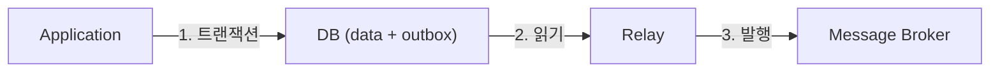

# Outbox Pattern 면접 정리

---

## 1. 핵심 개념 요약

### 1.1 이중 쓰기(Dual Write) 문제

**이중 쓰기 문제**는 DB 저장과 메시지 발행을 함께 할 때 발생하는 **원자성 문제**입니다.

| 상황 | 결과 |
|------|------|
| DB 저장 ✅, 이벤트 발행 ❌ | 데이터 불일치 |
| DB 저장 ❌, 이벤트 발행 ✅ | 유령 이벤트 |
| 순서 불일치 | 이벤트가 먼저 도착 |

### 1.2 Outbox Pattern 해결책



1. 비즈니스 데이터와 이벤트를 **같은 트랜잭션**으로 DB에 저장
2. 별도 프로세스가 Outbox 테이블에서 이벤트를 읽어 발행

### 1.3 두 가지 전달 방식

| 방식 | 특징 | 적합 |
|------|------|------|
| **Polling** | 주기적 조회, 구현 간단 | 소~중규모 |
| **CDC (Debezium)** | 실시간, DB 부하 없음 | 중~대규모 |

---

## 2. 면접 예상 질문 및 모범 답변

### Q1. 이중 쓰기(Dual Write) 문제란?

> **이중 쓰기 문제**는 DB 저장과 메시지 발행을 함께 할 때 발생하는 원자성 문제입니다.
>
> ```java
> @Transactional
> public void createOrder(Order order) {
>     orderRepository.save(order);  // DB 저장
>     kafkaTemplate.send(...);      // 이벤트 발행 (트랜잭션 밖!)
> }
> ```
>
> **문제 시나리오**:
> 1. DB 저장 성공, 이벤트 발행 실패 → 데이터 불일치
> 2. DB 저장 실패, 이벤트 발행 성공 → 유령 이벤트
> 3. 이벤트가 DB 커밋보다 먼저 도착 → 순서 불일치
>
> DB와 Message Broker는 **별개의 시스템**이므로 하나의 트랜잭션으로 묶을 수 없습니다.

### Q2. Outbox Pattern이란?

> **Outbox Pattern**은 이중 쓰기 문제를 해결하는 패턴입니다.
>
> **핵심 아이디어**:
> 1. 이벤트를 Message Broker에 직접 발행하지 않고 **DB의 Outbox 테이블에 저장**
> 2. 비즈니스 데이터와 **같은 트랜잭션**으로 저장하여 원자성 보장
> 3. **별도의 프로세스**가 Outbox 테이블을 읽어 Message Broker로 전달
>
> **장점**:
> - DB 트랜잭션으로 원자성 보장
> - At-Least-Once 전달 보장
> - 실패 시 재시도 가능

### Q3. Polling 방식과 CDC 방식의 차이는?

> 두 방식은 Outbox 테이블의 메시지를 **어떻게 감지하느냐**의 차이입니다.
>
> **Polling 방식**:
> ```java
> @Scheduled(fixedDelay = 1000)
> public void publishOutbox() {
>     List<Message> messages = outboxRepository.findUnprocessed();
>     for (Message m : messages) {
>         kafkaTemplate.send(...);
>         m.setProcessed(true);
>     }
> }
> ```
> - 장점: 구현 간단, 추가 인프라 불필요
> - 단점: 지연 시간(폴링 주기), DB 부하
>
> **CDC (Change Data Capture) 방식**:
> - DB의 변경 로그(WAL, Binlog)를 캡처
> - Debezium 같은 도구 사용
> - 장점: 실시간(밀리초), DB 부하 없음
> - 단점: 인프라 복잡도, 학습 곡선

### Q4. Debezium이란?

> **Debezium**은 오픈소스 **CDC(Change Data Capture) 플랫폼**입니다.
>
> **동작 원리**:
> 1. DB의 WAL(PostgreSQL) 또는 Binlog(MySQL) 읽기
> 2. 변경 이벤트를 Kafka로 스트리밍
> 3. Outbox Event Router로 적절한 토픽에 라우팅
>
> **Outbox Pattern에서의 역할**:
> - Outbox 테이블의 INSERT를 실시간 감지
> - aggregate_type에 따라 토픽 라우팅 (order → order-events)
> - aggregate_id를 메시지 키로 사용 (파티션 일관성)
>
> **장점**: 실시간, DB 부하 없음, 순서 보장

### Q5. Outbox 테이블 구조는?

> Outbox 테이블은 발행할 이벤트 정보를 저장합니다.
>
> ```sql
> CREATE TABLE outbox (
>     id UUID PRIMARY KEY,
>     aggregate_type VARCHAR(255),  -- "Order", "Payment"
>     aggregate_id VARCHAR(255),    -- "order-123"
>     event_type VARCHAR(255),      -- "OrderCreated"
>     payload JSONB,                -- 이벤트 데이터
>     created_at TIMESTAMP,
>     
>     -- Polling용 (CDC는 불필요)
>     processed BOOLEAN DEFAULT FALSE,
>     processed_at TIMESTAMP
> );
> ```
>
> **필드 역할**:
> - `aggregate_type`: 토픽 라우팅 (order-events)
> - `aggregate_id`: 메시지 키 (같은 aggregate → 같은 파티션)
> - `payload`: 실제 이벤트 내용

### Q6. Outbox Pattern의 장단점은?

> **장점**:
> 1. **원자성 보장**: DB 트랜잭션으로 데이터와 이벤트 일관성
> 2. **At-Least-Once 보장**: 실패 시 재시도 가능
> 3. **순서 보장**: 같은 aggregate의 이벤트 순서 유지
> 4. **디버깅 용이**: Outbox 테이블에서 이벤트 이력 확인
>
> **단점**:
> 1. **지연 시간**: Polling 방식은 폴링 주기만큼 지연
> 2. **DB 부하**: Polling 방식은 주기적 쿼리
> 3. **테이블 관리**: 처리된 메시지 정리 필요
> 4. **복잡도**: CDC 방식은 추가 인프라 필요

### Q7. Polling과 CDC 중 어떻게 선택하나요?

> **선택 기준**:
>
> | 기준 | Polling | CDC |
> |------|---------|-----|
> | 지연 시간 | 초 단위 | 밀리초 |
> | 구현 복잡도 | 낮음 | 높음 |
> | 인프라 | 없음 | Kafka Connect |
> | DB 부하 | 있음 | 없음 |
> | 확장성 | 중간 | 높음 |
>
> **Polling 선택**:
> - 소~중규모 시스템
> - 초 단위 지연 허용
> - 빠른 구현 필요
>
> **CDC 선택**:
> - 대규모 시스템
> - 실시간 필요
> - 이미 Kafka Connect 인프라 있음

### Q8. Outbox 테이블이 커지면 어떻게 하나요?

> **Polling 방식**:
> ```sql
> -- 처리된 메시지 삭제
> DELETE FROM outbox 
> WHERE processed = true 
> AND processed_at < NOW() - INTERVAL '7 days';
> ```
>
> **CDC 방식**:
> ```sql
> -- CDC가 캡처한 후 삭제
> DELETE FROM outbox 
> WHERE created_at < NOW() - INTERVAL '1 hour';
> ```
>
> **추가 고려사항**:
> - 배치 삭제로 락 최소화
> - 파티셔닝 적용 (시간 기반)
> - 아카이브 테이블로 이동 (감사용)

---

## 3. 핵심 개념 체크리스트

- [ ] 이중 쓰기(Dual Write) 문제를 설명할 수 있는가?
- [ ] Outbox Pattern의 동작 원리를 설명할 수 있는가?
- [ ] Polling 방식과 CDC 방식의 차이를 비교할 수 있는가?
- [ ] Debezium의 역할과 동작 원리를 이해하는가?
- [ ] Outbox 테이블 구조와 각 필드의 역할을 아는가?
- [ ] Outbox Pattern의 장단점을 설명할 수 있는가?

---

*📅 작성일: 2025-01-25*
*📚 관련 문서: [04_Outbox_Pattern.md](./04_Outbox_Pattern.md)*
