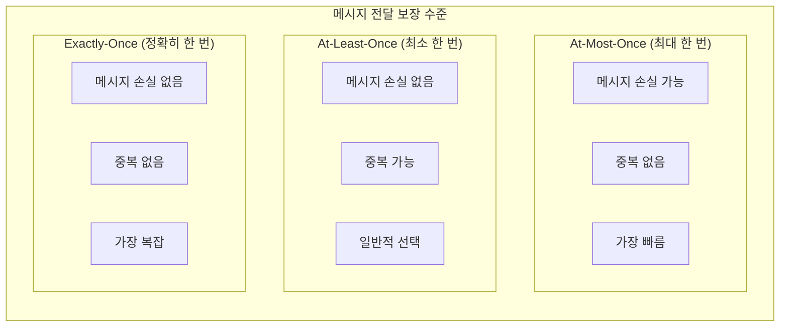
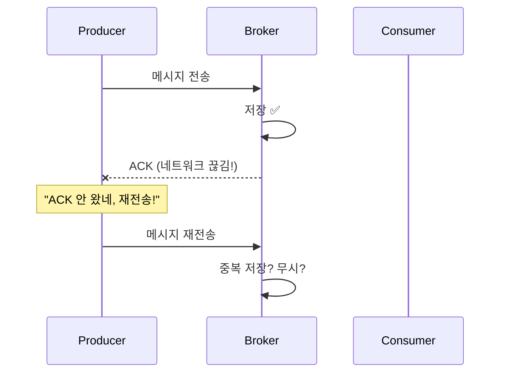
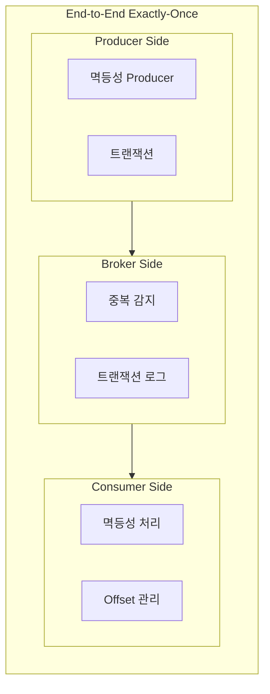
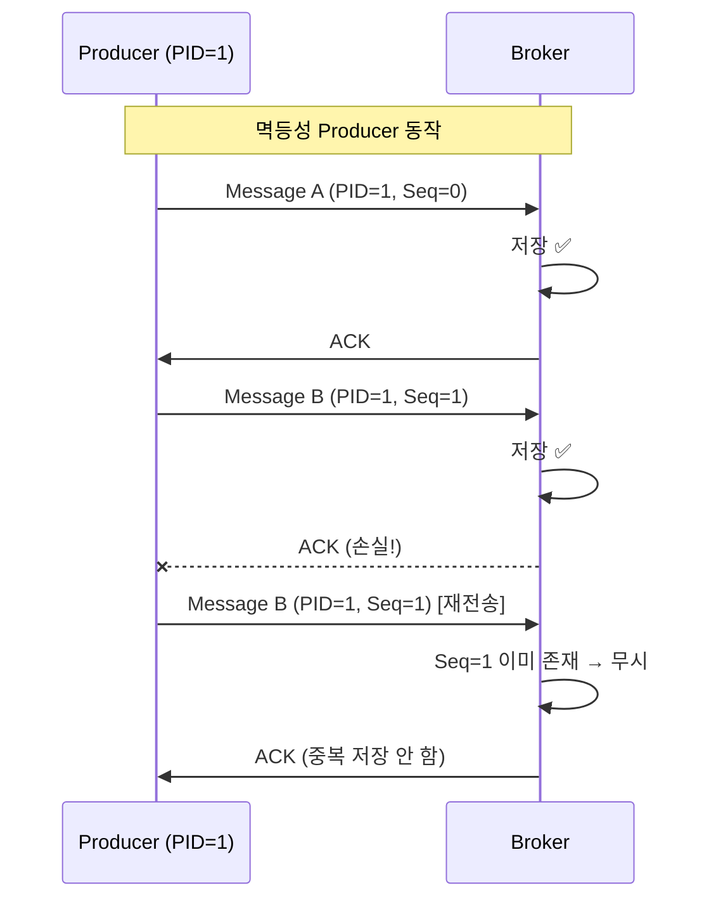
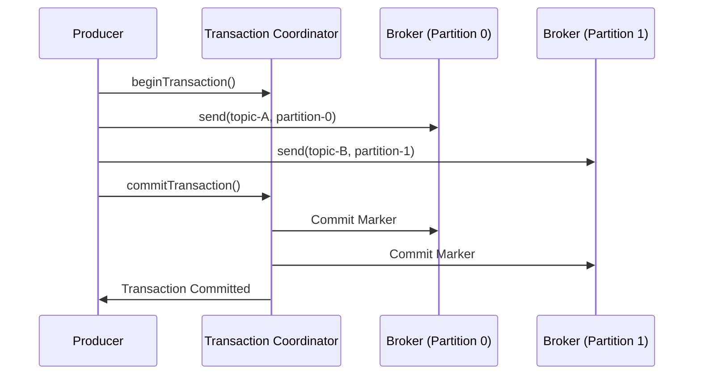
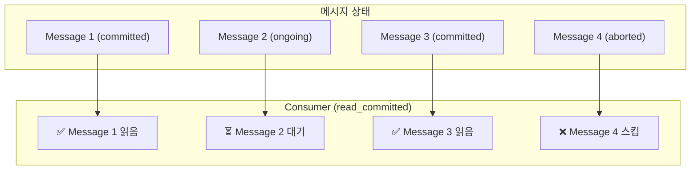
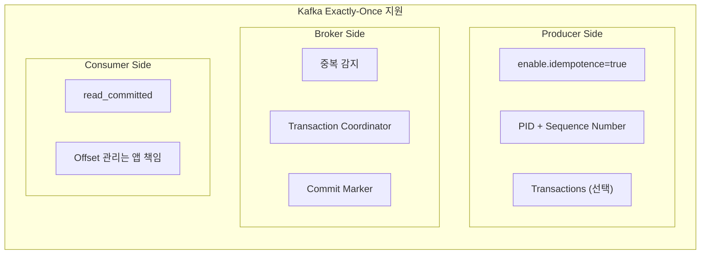
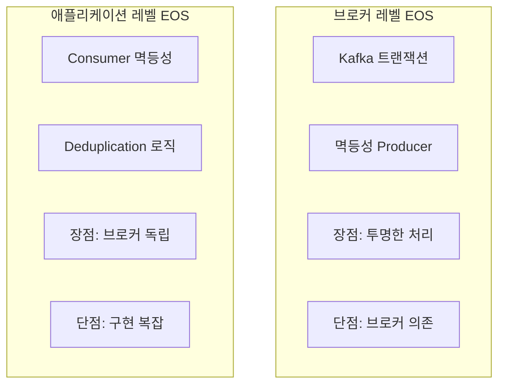
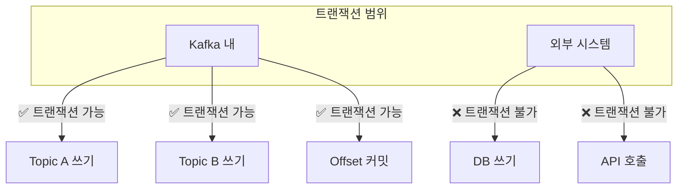
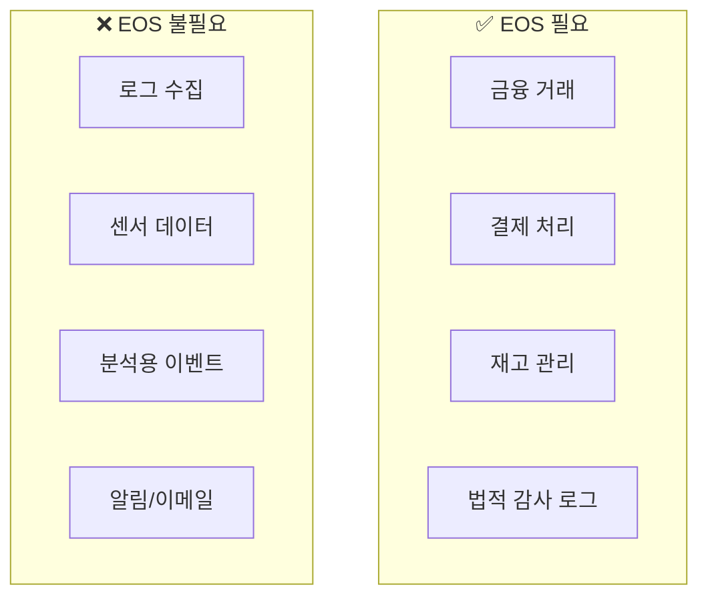

# Exactly-Once Semantics (정확히 한 번 전달)

---

## 📌 핵심 요약

> **Exactly-Once Semantics(EOS)**는 메시지가 **정확히 한 번만** 처리되는 것을 보장하는 메시징 시스템의 가장 강력한 전달 보장 수준이다. At-Most-Once(최대 한 번)와 At-Least-Once(최소 한 번) 사이의 완벽한 균형으로, 메시지 유실도 중복도 발생하지 않는다. 브로커의 지원과 함께 Producer/Consumer 양쪽의 올바른 구현이 필요하다.

---

## 🎯 학습 목표

이 내용을 읽고 나면:
- [ ] 세 가지 전달 보장 수준(At-Most-Once, At-Least-Once, Exactly-Once)을 구분할 수 있다
- [ ] End-to-End Exactly-Once의 의미와 구현 요소를 이해할 수 있다
- [ ] Kafka의 Exactly-Once 구현 방법을 설명할 수 있다
- [ ] 브로커별 Exactly-Once 지원 현황을 파악할 수 있다
- [ ] 실무에서 Exactly-Once를 달성하기 위한 전략을 적용할 수 있다

---

## 📖 본문 정리

### 1. 메시지 전달 보장 수준

#### 1.1 세 가지 수준



| 수준 | 손실 | 중복 | 성능 | 사용 사례 |
|------|------|------|------|----------|
| **At-Most-Once** | 가능 | 없음 | 최고 | 로그, 센서 데이터 |
| **At-Least-Once** | 없음 | 가능 | 중간 | 일반적인 메시징 |
| **Exactly-Once** | 없음 | 없음 | 낮음 | 금융, 결제 |

#### 1.2 왜 Exactly-Once가 어려운가?

분산 시스템에서 "정확히 한 번"을 보장하기 어려운 이유:



**문제점**:
1. **ACK 손실**: Broker가 저장했지만 ACK가 안 오면 Producer는 재전송
2. **Consumer 장애**: 메시지 처리 중 Consumer 죽으면 재처리
3. **네트워크 파티션**: 일시적 단절 후 복구 시 중복

> 💬 **비유**: 등기우편을 보냈는데 수신 확인이 안 오면, 또 보내야 할지 말아야 할지 알 수 없습니다. 이미 도착했을 수도 있고, 분실됐을 수도 있습니다.

---

### 2. End-to-End Exactly-Once

#### 2.1 구성 요소

**End-to-End Exactly-Once**는 Producer에서 Consumer까지 **전체 경로**에서 정확히 한 번 처리를 보장합니다.



| 구간 | 요구사항 | 구현 방법 |
|------|----------|----------|
| **Producer → Broker** | 중복 방지 | 멱등성 Producer, PID+SeqNum |
| **Broker** | 원자적 쓰기 | 트랜잭션, Commit Marker |
| **Broker → Consumer** | 중복 방지 | Offset 관리, 멱등성 처리 |

#### 2.2 각 구간별 책임

**Producer Side**:
- 멱등성 Producer 활성화 (`enable.idempotence=true`)
- 트랜잭션 사용 (선택적)
- 재시도 시 중복 방지

**Broker Side**:
- Producer ID + Sequence Number로 중복 감지
- 트랜잭션 로그 관리
- Commit/Abort Marker 기록

**Consumer Side**:
- `read_committed` 격리 수준
- Offset과 처리를 원자적으로 관리
- 또는 **멱등성 처리** (Consumer 로직에서)

---

### 3. Kafka의 Exactly-Once 구현

#### 3.1 멱등성 Producer (Idempotent Producer)



**설정**:

```java
Properties props = new Properties();
props.put(ProducerConfig.ENABLE_IDEMPOTENCE_CONFIG, true);
props.put(ProducerConfig.ACKS_CONFIG, "all");
props.put(ProducerConfig.RETRIES_CONFIG, Integer.MAX_VALUE);

KafkaProducer<String, String> producer = new KafkaProducer<>(props);
```

**동작 원리**:
1. Producer가 시작 시 **Producer ID (PID)** 부여받음
2. 각 메시지에 **Sequence Number** 포함
3. Broker가 PID+SeqNum으로 중복 감지
4. 이미 본 SeqNum이면 저장하지 않고 ACK

#### 3.2 트랜잭션 (Transactions)

**단일 파티션 내 Exactly-Once**는 멱등성만으로 충분하지만, **여러 파티션/토픽에 걸친 원자적 쓰기**는 트랜잭션이 필요합니다.



**설정**:

```java
Properties props = new Properties();
props.put(ProducerConfig.ENABLE_IDEMPOTENCE_CONFIG, true);
props.put(ProducerConfig.TRANSACTIONAL_ID_CONFIG, "order-producer-1");

KafkaProducer<String, String> producer = new KafkaProducer<>(props);
producer.initTransactions();

try {
    producer.beginTransaction();
    producer.send(new ProducerRecord<>("orders", order.getId(), orderJson));
    producer.send(new ProducerRecord<>("audit-log", order.getId(), auditJson));
    producer.commitTransaction();
} catch (Exception e) {
    producer.abortTransaction();
}
```

#### 3.3 Consumer의 read_committed

```java
Properties props = new Properties();
props.put(ConsumerConfig.ISOLATION_LEVEL_CONFIG, "read_committed");

KafkaConsumer<String, String> consumer = new KafkaConsumer<>(props);
```

**동작**:
- 커밋된 트랜잭션의 메시지만 읽음
- 진행 중인 트랜잭션의 메시지는 대기
- Abort된 트랜잭션의 메시지는 스킵



#### 3.4 Kafka Streams의 Exactly-Once

Kafka Streams에서는 더 쉽게 Exactly-Once를 설정할 수 있습니다.

```java
Properties props = new Properties();
props.put(StreamsConfig.PROCESSING_GUARANTEE_CONFIG, 
          StreamsConfig.EXACTLY_ONCE_V2);  // Kafka 3.0+

KafkaStreams streams = new KafkaStreams(topology, props);
```

**EXACTLY_ONCE_V2 (EOS v2)**:
- Producer 트랜잭션 사용
- Consumer Offset과 출력 메시지를 원자적으로 커밋
- 내부적으로 `read_committed` 사용

---

### 4. 브로커별 Exactly-Once 지원

#### 4.1 비교표

| 브로커 | Producer EOS | Consumer EOS | 트랜잭션 |
|--------|--------------|--------------|----------|
| **Kafka** | ✅ (idempotent) | ⚠️ (앱 레벨) | ✅ |
| **RabbitMQ** | ❌ | ⚠️ (앱 레벨) | ❌ |
| **Pulsar** | ✅ | ✅ (deduplication) | ✅ |
| **NATS JetStream** | ⚠️ (제한적) | ⚠️ (앱 레벨) | ❌ |

#### 4.2 Kafka의 EOS 상세



#### 4.3 RabbitMQ의 제한

RabbitMQ는 **기본적으로 At-Least-Once**만 지원합니다.

```
Producer → RabbitMQ: Publisher Confirms (At-Least-Once)
RabbitMQ → Consumer: Manual Ack (At-Least-Once)
```

**Exactly-Once를 위한 추가 작업**:
- Consumer에서 **멱등성 처리** 구현 필요
- 메시지 ID 기반 중복 검사
- DB와 함께 트랜잭션 처리

---

### 5. 실무에서의 Exactly-Once 전략

#### 5.1 브로커 레벨 EOS vs 애플리케이션 레벨 EOS



#### 5.2 권장 전략

**전략 1: Kafka 내부 파이프라인**

Kafka → Kafka Streams → Kafka 구조에서는 **브로커 레벨 EOS** 사용

```java
// Kafka Streams
props.put(StreamsConfig.PROCESSING_GUARANTEE_CONFIG, 
          StreamsConfig.EXACTLY_ONCE_V2);
```

**전략 2: 외부 시스템 연동**

Kafka → Consumer → DB 구조에서는 **애플리케이션 레벨 멱등성** 필요

```java
@KafkaListener(topics = "orders")
@Transactional
public void processOrder(OrderEvent event) {
    // 멱등성 체크
    if (processedEventRepository.existsById(event.eventId())) {
        log.info("Duplicate event: {}", event.eventId());
        return;
    }
    
    // 비즈니스 로직
    orderService.createOrder(event);
    
    // 처리 완료 기록
    processedEventRepository.save(new ProcessedEvent(event.eventId()));
}
```

자세한 내용은 [06_Idempotency.md](./06_Idempotency.md) 참조.

---

## 🔍 심화 학습

### Kafka 트랜잭션의 한계

Kafka 트랜잭션은 **Kafka 클러스터 내에서만** 동작합니다.



**해결**: Outbox Pattern + 멱등성 처리

자세한 내용은 [04_Outbox_Pattern.md](./04_Outbox_Pattern.md) 참조.

### 성능 고려사항

| 설정 | 처리량 | 지연 시간 |
|------|--------|----------|
| At-Most-Once | 최고 | 최저 |
| At-Least-Once | 높음 | 낮음 |
| Exactly-Once | 낮음 | 높음 |

**EOS 오버헤드**:
- 트랜잭션: 약 3% (100ms 트랜잭션 기준)
- 짧은 트랜잭션: 최대 30% (10ms 트랜잭션)

---

## 💡 실무 적용 포인트

### 언제 Exactly-Once가 필요한가?



### 주의할 점 / 흔한 실수

- ⚠️ **브로커 EOS만 의존**: Consumer에서 외부 시스템 호출 시 멱등성 필요
- ⚠️ **트랜잭션 남용**: 모든 메시지에 트랜잭션 사용 → 성능 저하
- ⚠️ **Consumer Offset 관리 소홀**: 처리 후 커밋 순서 중요
- ⚠️ **타임아웃 설정 부재**: 트랜잭션 타임아웃 설정 필요
- ⚠️ **EOS 과신**: 네트워크 파티션, 브로커 장애 시 동작 확인 필요

### 기존 문서 참조

| 주제 | 관련 문서 |
|------|-----------|
| Kafka 신뢰성 | [../Kafka/05_Reliability.md](../Kafka/05_Reliability.md) |
| Stream Processing | [../Kafka/12_Stream_Processing.md](../Kafka/12_Stream_Processing.md) |
| Idempotency | [06_Idempotency.md](./06_Idempotency.md) |

---

## ✅ 핵심 개념 체크리스트

- [ ] 세 가지 전달 보장 수준의 차이를 설명할 수 있는가?
- [ ] End-to-End Exactly-Once의 구성 요소를 이해하는가?
- [ ] Kafka 멱등성 Producer의 동작 원리를 설명할 수 있는가?
- [ ] Kafka 트랜잭션의 역할과 한계를 아는가?
- [ ] Consumer의 `read_committed`가 왜 필요한지 이해하는가?
- [ ] 브로커 레벨 EOS와 애플리케이션 레벨 EOS를 구분할 수 있는가?

---

## 🔗 참고 자료

- 📄 Confluent: [Exactly-Once Semantics in Apache Kafka](https://www.confluent.io/blog/exactly-once-semantics-are-possible-heres-how-apache-kafka-does-it/)
- 📄 KIP-98: [Exactly Once Delivery and Transactional Messaging](https://cwiki.apache.org/confluence/display/KAFKA/KIP-98)
- 📄 KIP-447: [Producer scalability for exactly once semantics](https://cwiki.apache.org/confluence/display/KAFKA/KIP-447)

---

*📅 작성일: 2025-01-25*
*📚 관련 문서: Kafka Reliability, Idempotency, Outbox Pattern*
