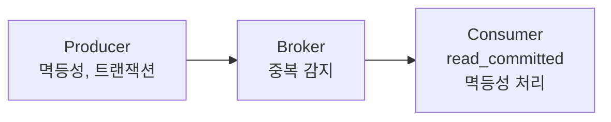

# Exactly-Once Semantics 면접 정리

---

## 1. 핵심 개념 요약

### 1.1 세 가지 전달 보장 수준

| 수준 | 손실 | 중복 | 사용 사례 |
|------|------|------|----------|
| **At-Most-Once** | 가능 | 없음 | 로그, 센서 |
| **At-Least-Once** | 없음 | 가능 | 일반 메시징 |
| **Exactly-Once** | 없음 | 없음 | 금융, 결제 |

### 1.2 End-to-End Exactly-Once 구성



### 1.3 Kafka EOS 핵심

| 컴포넌트 | 설정/기능 |
|----------|----------|
| **Producer** | `enable.idempotence=true`, 트랜잭션 |
| **Broker** | PID + SeqNum 중복 감지 |
| **Consumer** | `isolation.level=read_committed` |

---

## 2. 면접 예상 질문 및 모범 답변

### Q1. 세 가지 메시지 전달 보장 수준을 설명해주세요.

> **At-Most-Once (최대 한 번)**:
> - 메시지가 **손실될 수 있지만 중복은 없음**
> - Fire-and-forget 방식, ACK 안 기다림
> - 가장 빠르지만 안전하지 않음
> - 사용 사례: 로그, 센서 데이터
>
> **At-Least-Once (최소 한 번)**:
> - 메시지가 **반드시 전달되지만 중복 가능**
> - ACK 안 오면 재전송
> - 일반적인 선택
> - 사용 사례: 대부분의 비즈니스 메시징
>
> **Exactly-Once (정확히 한 번)**:
> - 메시지가 **정확히 한 번만 처리**
> - 손실도 중복도 없음
> - 가장 복잡하고 비용 높음
> - 사용 사례: 금융 거래, 결제

### Q2. 왜 Exactly-Once가 어려운가요?

> **분산 시스템의 본질적 한계** 때문입니다.
>
> **문제 시나리오**:
> 1. Producer가 메시지를 보냄
> 2. Broker가 저장함
> 3. **ACK가 네트워크에서 손실**됨
> 4. Producer는 "실패했나?"라고 생각하고 재전송
> 5. Broker는 같은 메시지를 또 받음 → **중복!**
>
> ACK가 오지 않으면 Producer는 메시지가 저장됐는지 알 수 없습니다. 재전송하면 중복, 안 하면 유실 위험. 이 **이중 선택의 딜레마**가 Exactly-Once를 어렵게 만듭니다.

### Q3. Kafka의 멱등성 Producer는 어떻게 동작하나요?

> **멱등성 Producer**는 **PID(Producer ID)**와 **Sequence Number**로 중복을 감지합니다.
>
> **동작**:
> 1. Producer 시작 시 Broker가 **고유 PID** 부여
> 2. 각 메시지에 **Sequence Number** 포함 (파티션별 0, 1, 2...)
> 3. 재전송해도 **같은 PID + 같은 SeqNum**
> 4. Broker가 "이미 봤음" → 저장하지 않고 ACK
>
> **설정**:
> ```java
> props.put("enable.idempotence", true);
> props.put("acks", "all");
> ```
>
> Kafka 3.0부터 **기본 활성화**입니다.

### Q4. Kafka 트랜잭션은 언제 필요한가요?

> **멱등성 Producer**는 **단일 파티션 내** 중복만 방지합니다.
>
> **트랜잭션이 필요한 경우**:
> 1. **여러 파티션/토픽에 원자적 쓰기**
>    - 주문 토픽 + 감사 로그 토픽 동시 쓰기
> 2. **Consumer Offset과 출력을 함께 커밋**
>    - 입력 읽기 → 처리 → 출력 + Offset 커밋
>
> **동작**:
> ```java
> producer.beginTransaction();
> producer.send(record1);
> producer.send(record2);
> producer.sendOffsetsToTransaction(offsets, groupMetadata);
> producer.commitTransaction();  // 모두 성공 or 모두 실패
> ```

### Q5. Consumer의 read_committed는 왜 필요한가요?

> **read_committed**는 **커밋된 트랜잭션의 메시지만** 읽습니다.
>
> **필요한 이유**:
> - 트랜잭션이 진행 중이거나 abort될 수 있음
> - 미완료 메시지를 읽으면 일관성 깨짐
>
> **동작**:
> | 메시지 상태 | read_uncommitted | read_committed |
> |------------|------------------|----------------|
> | Committed | ✅ 읽음 | ✅ 읽음 |
> | In-progress | ✅ 읽음 | ⏳ 대기 |
> | Aborted | ✅ 읽음 | ❌ 스킵 |
>
> **설정**:
> ```java
> props.put("isolation.level", "read_committed");
> ```

### Q6. End-to-End Exactly-Once란?

> **End-to-End Exactly-Once**는 **Producer부터 Consumer까지 전체 경로**에서 정확히 한 번 처리를 보장하는 것입니다.
>
> **구성**:
> ```
> Producer (멱등성/트랜잭션)
>    ↓
> Broker (중복 감지/트랜잭션 로그)
>    ↓
> Consumer (read_committed + 멱등성 처리)
> ```
>
> **핵심**: Broker의 EOS만으로는 불충분합니다. Consumer가 **외부 시스템(DB, API)**에 쓸 때는 **애플리케이션 레벨 멱등성**이 필요합니다.

### Q7. Kafka Streams의 Exactly-Once는 어떻게 설정하나요?

> Kafka Streams는 **한 줄 설정**으로 EOS를 지원합니다.
>
> ```java
> props.put(StreamsConfig.PROCESSING_GUARANTEE_CONFIG,
>           StreamsConfig.EXACTLY_ONCE_V2);
> ```
>
> **내부 동작**:
> 1. 입력 토픽에서 메시지 읽기
> 2. 처리
> 3. **출력 쓰기 + Consumer Offset 커밋**을 트랜잭션으로
> 4. Consumer는 자동으로 read_committed
>
> **EXACTLY_ONCE_V2** (Kafka 3.0+)가 권장됩니다. 이전 버전보다 효율적입니다.

### Q8. 브로커 레벨 EOS와 애플리케이션 레벨 EOS의 차이는?

> **브로커 레벨 EOS**:
> - Kafka의 멱등성 Producer, 트랜잭션
> - **Kafka 내부**에서만 동작
> - 설정만으로 활성화
>
> **애플리케이션 레벨 EOS**:
> - Consumer에서 **멱등성 처리** 구현
> - **외부 시스템 연동** 시 필요
> - 직접 구현 필요
>
> **예시**:
> ```java
> @KafkaListener(topics = "orders")
> public void process(OrderEvent event) {
>     // 애플리케이션 레벨 멱등성
>     if (alreadyProcessed(event.eventId())) {
>         return;
>     }
>     
>     orderService.create(event);
>     markAsProcessed(event.eventId());
> }
> ```
>
> Kafka → Kafka는 브로커 EOS로 충분, Kafka → DB/API는 애플리케이션 EOS 필요.

---

## 3. 핵심 개념 체크리스트

- [ ] 세 가지 전달 보장 수준의 차이를 설명할 수 있는가?
- [ ] Exactly-Once가 어려운 이유를 설명할 수 있는가?
- [ ] Kafka 멱등성 Producer의 동작 원리(PID, SeqNum)를 아는가?
- [ ] Kafka 트랜잭션이 필요한 시나리오를 설명할 수 있는가?
- [ ] read_committed의 역할을 이해하는가?
- [ ] 브로커 레벨 vs 애플리케이션 레벨 EOS를 구분할 수 있는가?

---

*📅 작성일: 2025-01-25*
*📚 관련 문서: [05_Exactly_Once_Semantics.md](./05_Exactly_Once_Semantics.md)*
