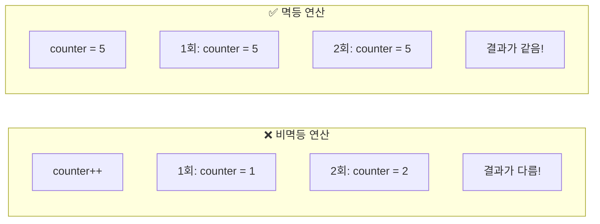
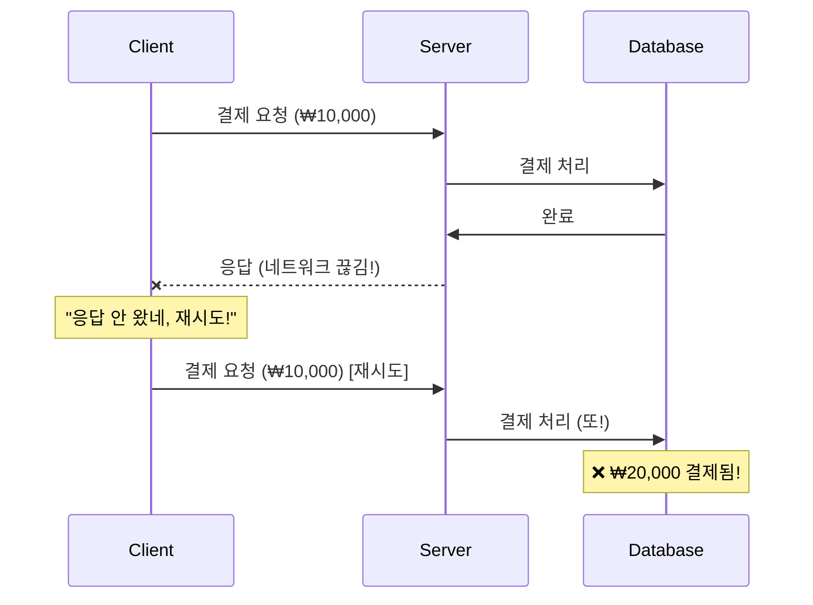
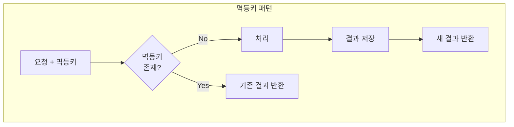
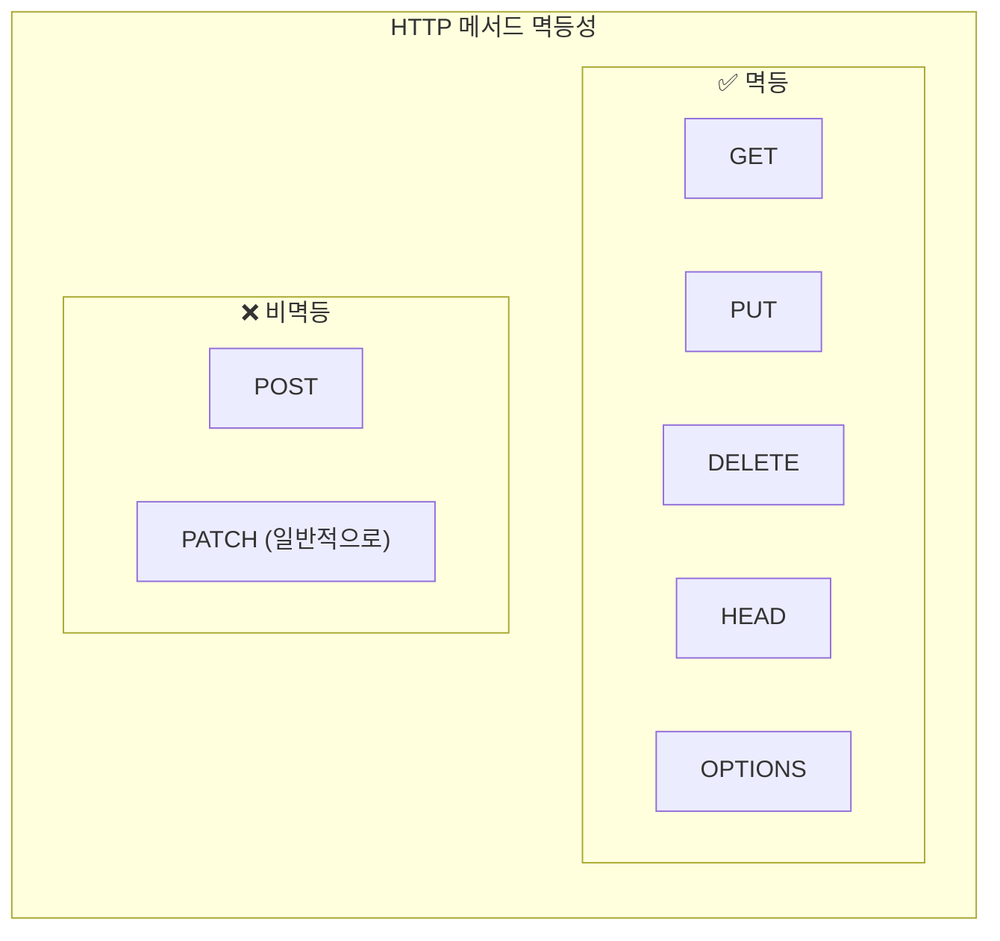
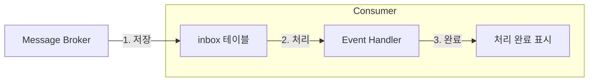
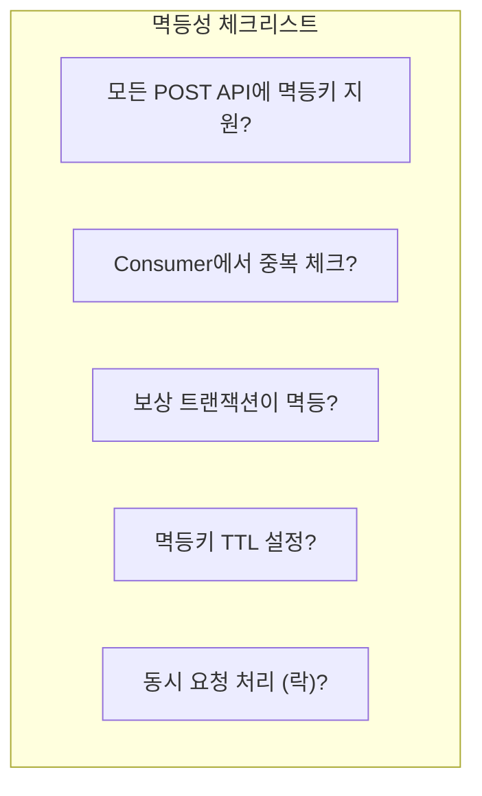

# Idempotency (멱등성)

---

## 📌 핵심 요약

> **멱등성(Idempotency)**은 **동일한 연산을 여러 번 수행해도 결과가 같은 성질**이다. 분산 시스템에서 네트워크 장애, 재시도, 중복 메시지 등으로 인해 같은 요청이 여러 번 처리될 수 있으므로, 멱등성을 보장하면 **안전하게 재시도**할 수 있고 **중복 처리를 방지**할 수 있다. API 설계, 메시지 처리, 데이터베이스 연산 등 다양한 영역에서 적용된다.

---

## 🎯 학습 목표

이 내용을 읽고 나면:
- [ ] 멱등성의 정의와 중요성을 설명할 수 있다
- [ ] 멱등키(Idempotency Key) 패턴을 구현할 수 있다
- [ ] 저장소별 멱등성 구현 방법(DB, Redis)을 알 수 있다
- [ ] REST API 멱등성 설계 원칙을 적용할 수 있다
- [ ] 메시지 소비자의 멱등성 처리 전략을 구현할 수 있다

---

## 📖 본문 정리

### 1. 멱등성이란?

#### 1.1 정의

**멱등성(Idempotency)**은 수학에서 유래한 개념으로, 연산을 여러 번 적용해도 **결과가 달라지지 않는 성질**입니다.

```
f(f(x)) = f(x)
```

**프로그래밍에서의 멱등성**:
- 같은 요청을 **1번 실행한 결과**와 **N번 실행한 결과**가 동일
- 시스템 상태가 추가로 변경되지 않음



#### 1.2 왜 멱등성이 중요한가?

**분산 시스템에서 중복 처리 발생 원인**:



**멱등성이 필요한 상황**:
- 네트워크 타임아웃 후 재시도
- Message Broker에서 중복 전달
- 클라이언트의 의도적 재시도
- 서버 장애 후 재처리

#### 1.3 멱등 vs 비멱등 연산

| 연산 | 멱등성 | 설명 |
|------|--------|------|
| `x = 5` | ✅ 멱등 | 몇 번 실행해도 x는 5 |
| `x++` | ❌ 비멱등 | 실행할 때마다 증가 |
| `DELETE WHERE id=1` | ✅ 멱등 | 이미 없으면 영향 없음 |
| `INSERT` | ❌ 비멱등 | 매번 새 행 생성 |
| `SET status='PAID'` | ✅ 멱등 | 이미 PAID면 변화 없음 |

---

### 2. 멱등키 패턴 (Idempotency Key Pattern)

#### 2.1 개념

**멱등키(Idempotency Key)**는 요청을 고유하게 식별하는 키입니다. 같은 키로 온 요청은 **한 번만 처리**하고, 재시도 시 **기존 결과를 반환**합니다.



#### 2.2 구현 (Spring Boot + Redis)

```java
@Service
@RequiredArgsConstructor
public class IdempotencyService {
    
    private final StringRedisTemplate redisTemplate;
    private final ObjectMapper objectMapper;
    
    private static final Duration TTL = Duration.ofHours(24);
    
    public <T> T executeIdempotent(
            String idempotencyKey,
            Class<T> resultType,
            Supplier<T> operation) {
        
        String key = "idempotency:" + idempotencyKey;
        
        // 1. 기존 결과 확인
        String existingResult = redisTemplate.opsForValue().get(key);
        if (existingResult != null) {
            log.info("Returning cached result for key: {}", idempotencyKey);
            return objectMapper.readValue(existingResult, resultType);
        }
        
        // 2. 락 획득 시도 (동시 요청 방지)
        String lockKey = "lock:" + idempotencyKey;
        Boolean acquired = redisTemplate.opsForValue()
            .setIfAbsent(lockKey, "1", Duration.ofSeconds(30));
        
        if (!Boolean.TRUE.equals(acquired)) {
            // 다른 요청이 처리 중 - 잠시 대기 후 재확인
            Thread.sleep(100);
            return executeIdempotent(idempotencyKey, resultType, operation);
        }
        
        try {
            // 3. 락 획득 후 다시 확인 (Double-check)
            existingResult = redisTemplate.opsForValue().get(key);
            if (existingResult != null) {
                return objectMapper.readValue(existingResult, resultType);
            }
            
            // 4. 실제 처리
            T result = operation.get();
            
            // 5. 결과 저장
            redisTemplate.opsForValue().set(
                key, 
                objectMapper.writeValueAsString(result), 
                TTL
            );
            
            return result;
            
        } finally {
            redisTemplate.delete(lockKey);
        }
    }
}

// 사용 예시
@RestController
@RequiredArgsConstructor
public class PaymentController {
    
    private final IdempotencyService idempotencyService;
    private final PaymentService paymentService;
    
    @PostMapping("/payments")
    public PaymentResult createPayment(
            @RequestHeader("Idempotency-Key") String idempotencyKey,
            @RequestBody PaymentRequest request) {
        
        return idempotencyService.executeIdempotent(
            idempotencyKey,
            PaymentResult.class,
            () -> paymentService.processPayment(request)
        );
    }
}
```

#### 2.3 멱등키 생성 전략

| 전략 | 예시 | 장점 | 단점 |
|------|------|------|------|
| **UUID** | `550e8400-e29b-41d4-a716-446655440000` | 간단, 충돌 없음 | 의미 없음 |
| **비즈니스 키** | `order:123:payment` | 의미 있음 | 충돌 가능 |
| **해시** | `SHA256(userId+timestamp+action)` | 재현 가능 | 계산 비용 |
| **타임스탬프+랜덤** | `1706180400000-abc123` | 디버깅 용이 | 길어질 수 있음 |

---

### 3. 저장소별 멱등성 구현

#### 3.1 데이터베이스 (PostgreSQL)

**방법 1: UPSERT (ON CONFLICT)**

```sql
-- 이미 처리된 이벤트는 무시
INSERT INTO processed_events (event_id, processed_at, result)
VALUES ($1, NOW(), $2)
ON CONFLICT (event_id) DO NOTHING;
```

```java
@Repository
public interface ProcessedEventRepository extends JpaRepository<ProcessedEvent, String> {
    
    @Modifying
    @Query(value = """
        INSERT INTO processed_events (event_id, processed_at, result)
        VALUES (:eventId, NOW(), :result)
        ON CONFLICT (event_id) DO NOTHING
        """, nativeQuery = true)
    int insertIfNotExists(
        @Param("eventId") String eventId,
        @Param("result") String result
    );
}
```

**방법 2: 비즈니스 로직에서 상태 확인**

```java
@Service
@RequiredArgsConstructor
public class OrderService {
    
    @Transactional
    public Order processOrder(String orderId, OrderStatus newStatus) {
        Order order = orderRepository.findById(orderId)
            .orElseThrow();
        
        // 멱등성: 이미 해당 상태면 아무것도 안 함
        if (order.getStatus() == newStatus) {
            log.info("Order {} already in status {}", orderId, newStatus);
            return order;
        }
        
        // 상태 전이 검증
        if (!order.canTransitionTo(newStatus)) {
            throw new InvalidStateTransitionException();
        }
        
        order.setStatus(newStatus);
        return orderRepository.save(order);
    }
}
```

#### 3.2 Redis

**방법 1: SETNX (Set if Not eXists)**

```java
@Service
public class RedisIdempotencyStore {
    
    private final StringRedisTemplate redisTemplate;
    
    public boolean tryMarkAsProcessed(String eventId, Duration ttl) {
        Boolean result = redisTemplate.opsForValue()
            .setIfAbsent("processed:" + eventId, "1", ttl);
        return Boolean.TRUE.equals(result);
    }
    
    public boolean isProcessed(String eventId) {
        return redisTemplate.hasKey("processed:" + eventId);
    }
}
```

**방법 2: Redis + Lua Script (원자적)**

```java
@Service
public class AtomicIdempotencyService {
    
    private final StringRedisTemplate redisTemplate;
    
    private static final String SCRIPT = """
        if redis.call('EXISTS', KEYS[1]) == 1 then
            return redis.call('GET', KEYS[1])
        else
            redis.call('SET', KEYS[1], ARGV[1], 'EX', ARGV[2])
            return nil
        end
        """;
    
    private final RedisScript<String> idempotencyScript = 
        new DefaultRedisScript<>(SCRIPT, String.class);
    
    public String executeIdempotent(String key, String result, long ttlSeconds) {
        return redisTemplate.execute(
            idempotencyScript,
            List.of(key),
            result,
            String.valueOf(ttlSeconds)
        );
    }
}
```

#### 3.3 비교

| 저장소 | 장점 | 단점 | 사용 사례 |
|--------|------|------|----------|
| **PostgreSQL** | 트랜잭션, 영구 저장 | 느림 | 감사 로그 필요 |
| **Redis** | 빠름, TTL 지원 | 휘발성 | 단기 멱등성 |
| **둘 다** | 견고함 | 복잡 | 중요 트랜잭션 |

---

### 4. REST API 멱등성

#### 4.1 HTTP 메서드별 멱등성



| 메서드 | 멱등성 | 설명 |
|--------|--------|------|
| **GET** | ✅ | 조회, 상태 변경 없음 |
| **PUT** | ✅ | 전체 교체, 같은 값으로 덮어씀 |
| **DELETE** | ✅ | 삭제, 이미 없으면 영향 없음 |
| **POST** | ❌ | 생성, 매번 새 리소스 |
| **PATCH** | ⚠️ | 부분 수정, 구현에 따라 다름 |

#### 4.2 POST를 멱등하게 만들기

**Idempotency-Key 헤더 사용**:

```http
POST /api/payments HTTP/1.1
Host: api.example.com
Idempotency-Key: 550e8400-e29b-41d4-a716-446655440000
Content-Type: application/json

{
    "amount": 10000,
    "currency": "KRW"
}
```

```java
@RestController
@RequestMapping("/api/payments")
public class PaymentController {
    
    @PostMapping
    public ResponseEntity<PaymentResponse> createPayment(
            @RequestHeader(value = "Idempotency-Key", required = false) 
            String idempotencyKey,
            @RequestBody PaymentRequest request) {
        
        if (idempotencyKey == null) {
            // 멱등키 없으면 새로 생성
            idempotencyKey = UUID.randomUUID().toString();
        }
        
        PaymentResponse response = idempotencyService.executeIdempotent(
            idempotencyKey,
            PaymentResponse.class,
            () -> paymentService.process(request)
        );
        
        return ResponseEntity.ok()
            .header("Idempotency-Key", idempotencyKey)
            .body(response);
    }
}
```

#### 4.3 Stripe API 스타일 구현

Stripe는 업계 표준의 멱등성 구현을 제공합니다.

```java
@Component
public class StripeStyleIdempotency {
    
    // 상태: PENDING, COMPLETED, FAILED
    @Entity
    public class IdempotencyRecord {
        @Id
        private String idempotencyKey;
        private String requestHash;
        private String status;
        private String responseBody;
        private int responseStatus;
        private Instant createdAt;
        private Instant lockedUntil;
    }
    
    public ResponseEntity<?> handle(
            String idempotencyKey,
            HttpServletRequest httpRequest,
            Supplier<ResponseEntity<?>> operation) {
        
        String requestHash = hashRequest(httpRequest);
        
        // 1. 기존 기록 확인
        Optional<IdempotencyRecord> existing = repository.findById(idempotencyKey);
        
        if (existing.isPresent()) {
            IdempotencyRecord record = existing.get();
            
            // 같은 요청인지 확인 (요청 내용 불일치 = 오용)
            if (!record.getRequestHash().equals(requestHash)) {
                return ResponseEntity.status(422)
                    .body("Idempotency key already used with different request");
            }
            
            // 완료된 요청이면 기존 응답 반환
            if ("COMPLETED".equals(record.getStatus())) {
                return ResponseEntity.status(record.getResponseStatus())
                    .body(record.getResponseBody());
            }
            
            // 처리 중이면 충돌 반환
            if ("PENDING".equals(record.getStatus()) && 
                record.getLockedUntil().isAfter(Instant.now())) {
                return ResponseEntity.status(409)
                    .body("Request is being processed");
            }
        }
        
        // 2. 새 요청 처리
        IdempotencyRecord record = new IdempotencyRecord();
        record.setIdempotencyKey(idempotencyKey);
        record.setRequestHash(requestHash);
        record.setStatus("PENDING");
        record.setLockedUntil(Instant.now().plusSeconds(30));
        repository.save(record);
        
        try {
            ResponseEntity<?> response = operation.get();
            
            record.setStatus("COMPLETED");
            record.setResponseStatus(response.getStatusCode().value());
            record.setResponseBody(objectMapper.writeValueAsString(response.getBody()));
            repository.save(record);
            
            return response;
            
        } catch (Exception e) {
            record.setStatus("FAILED");
            repository.save(record);
            throw e;
        }
    }
}
```

---

### 5. 메시지 Consumer 멱등성

#### 5.1 Kafka Consumer 멱등성

```java
@Component
public class OrderEventConsumer {
    
    private final ProcessedEventRepository processedEventRepository;
    private final OrderService orderService;
    
    @KafkaListener(topics = "order-events")
    @Transactional
    public void handle(OrderCreatedEvent event) {
        String eventId = event.eventId();
        
        // 1. 중복 체크
        if (processedEventRepository.existsById(eventId)) {
            log.info("Duplicate event ignored: {}", eventId);
            return;
        }
        
        // 2. 비즈니스 로직 처리
        orderService.processOrder(event);
        
        // 3. 처리 완료 기록
        processedEventRepository.save(new ProcessedEvent(
            eventId,
            Instant.now()
        ));
    }
}
```

#### 5.2 Inbox Pattern

**Inbox Pattern**은 Outbox Pattern의 반대입니다. 수신한 이벤트를 먼저 DB에 저장하고, 나중에 처리합니다.



```java
@Component
public class InboxEventConsumer {
    
    @KafkaListener(topics = "order-events")
    @Transactional
    public void receive(OrderEvent event) {
        // Inbox에 저장만 함 (멱등하게)
        inboxRepository.save(InboxMessage.of(event));
        // ACK 전송
    }
}

@Scheduled(fixedDelay = 1000)
@Transactional
public void processInbox() {
    List<InboxMessage> messages = inboxRepository
        .findByStatusOrderByCreatedAt(Status.PENDING);
    
    for (InboxMessage msg : messages) {
        try {
            eventHandler.handle(msg.getPayload());
            msg.setStatus(Status.PROCESSED);
        } catch (Exception e) {
            msg.setRetryCount(msg.getRetryCount() + 1);
            if (msg.getRetryCount() > MAX_RETRIES) {
                msg.setStatus(Status.FAILED);
            }
        }
    }
}
```

---

## 🔍 심화 학습

### 멱등성과 Saga Pattern

Saga의 **보상 트랜잭션**은 반드시 멱등해야 합니다. 네트워크 문제로 보상 명령이 여러 번 전달될 수 있기 때문입니다.

자세한 내용은 [03_Saga_Pattern.md](./03_Saga_Pattern.md) 참조.

### 멱등성과 Exactly-Once

**Exactly-Once = At-Least-Once + 멱등성**

브로커가 At-Least-Once만 보장해도, Consumer가 멱등하면 결과적으로 Exactly-Once 효과를 얻습니다.

자세한 내용은 [05_Exactly_Once_Semantics.md](./05_Exactly_Once_Semantics.md) 참조.

---

## 💡 실무 적용 포인트

### 멱등성 적용 체크리스트



### 주의할 점 / 흔한 실수

- ⚠️ **멱등키 범위 설계 오류**: 너무 좁으면 의미 없음, 너무 넓으면 충돌
- ⚠️ **TTL 설정 누락**: 멱등키가 영원히 남아 저장소 폭발
- ⚠️ **동시 요청 미처리**: 같은 키로 동시 요청 시 모두 처리됨
- ⚠️ **부분 실패 미고려**: 처리 도중 실패 시 상태 불일치
- ⚠️ **요청 내용 검증 누락**: 같은 키로 다른 요청 시 오용 가능

### 기존 문서 참조

| 주제 | 관련 문서 |
|------|-----------|
| Kafka 신뢰성 | [../Kafka/05_Reliability.md](../Kafka/05_Reliability.md) |
| Saga Pattern | [03_Saga_Pattern.md](./03_Saga_Pattern.md) |
| Exactly-Once | [05_Exactly_Once_Semantics.md](./05_Exactly_Once_Semantics.md) |

---

## ✅ 핵심 개념 체크리스트

- [ ] 멱등성의 정의와 중요성을 설명할 수 있는가?
- [ ] 멱등키 패턴을 구현할 수 있는가?
- [ ] DB와 Redis에서 멱등성을 구현하는 방법을 아는가?
- [ ] HTTP 메서드별 멱등성을 구분할 수 있는가?
- [ ] POST를 멱등하게 만드는 방법을 아는가?
- [ ] Kafka Consumer의 멱등성 처리 전략을 구현할 수 있는가?
- [ ] Inbox Pattern의 개념과 목적을 이해하는가?

---

## 🔗 참고 자료

- 📄 Stripe: [Idempotent Requests](https://stripe.com/docs/api/idempotent_requests)
- 📄 AWS: [Making retries safe with idempotent APIs](https://aws.amazon.com/builders-library/making-retries-safe-with-idempotent-APIs/)
- 📄 Microsoft: [Idempotency Patterns](https://docs.microsoft.com/en-us/azure/architecture/reference-architectures/saga/saga)

---

*📅 작성일: 2025-01-25*
*📚 관련 문서: Saga Pattern, Exactly-Once Semantics, Kafka Reliability*
