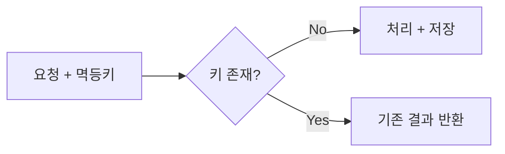

# Idempotency (멱등성) 면접 정리

---

## 1. 핵심 개념 요약

### 1.1 멱등성이란?

**멱등성(Idempotency)**은 **동일한 연산을 여러 번 수행해도 결과가 같은 성질**입니다.

```
1번 실행 결과 = N번 실행 결과
```

### 1.2 멱등 vs 비멱등 연산

| 연산 | 멱등성 | 예시 |
|------|--------|------|
| `x = 5` | ✅ 멱등 | 몇 번 해도 x는 5 |
| `x++` | ❌ 비멱등 | 매번 증가 |
| `DELETE WHERE id=1` | ✅ 멱등 | 없으면 영향 없음 |
| `INSERT` | ❌ 비멱등 | 매번 새 행 |

### 1.3 HTTP 메서드 멱등성

| 메서드 | 멱등성 |
|--------|--------|
| GET, PUT, DELETE | ✅ 멱등 |
| POST, PATCH | ❌ 비멱등 |

---

## 2. 멱등키 패턴

### 2.1 동작 흐름



### 2.2 구현 요소

| 요소 | 설명 |
|------|------|
| **멱등키** | 요청 고유 식별자 (UUID, 비즈니스키) |
| **저장소** | Redis (빠름) 또는 DB (영구) |
| **TTL** | 멱등키 유효 기간 |
| **락** | 동시 요청 방지 |

---

## 3. 면접 예상 질문 및 모범 답변

### Q1. 멱등성이란 무엇인가요?

> **멱등성**은 **동일한 연산을 여러 번 수행해도 결과가 같은 성질**입니다.
>
> 예를 들어 `x = 5`는 멱등입니다. 100번 실행해도 x는 5입니다. 반면 `x++`는 비멱등입니다. 실행할 때마다 x가 증가합니다.
>
> **왜 중요한가?**
> 분산 시스템에서는 네트워크 장애, 타임아웃 등으로 **재시도**가 빈번합니다. 멱등하지 않은 연산이 재시도되면 중복 처리가 발생합니다.
>
> 예: 결제 API가 타임아웃 후 재시도되면 ₩10,000이 두 번 결제될 수 있습니다.

### Q2. 멱등키 패턴이란?

> **멱등키 패턴**은 요청에 **고유 식별자(멱등키)**를 부여하여 중복 처리를 방지하는 패턴입니다.
>
> **동작**:
> 1. 클라이언트가 `Idempotency-Key` 헤더와 함께 요청
> 2. 서버가 해당 키로 이미 처리한 기록이 있는지 확인
> 3. 있으면: 기존 결과 반환 (재처리 안 함)
> 4. 없으면: 처리 후 결과를 키와 함께 저장
>
> **핵심**: 같은 키로 온 요청은 **한 번만 처리**됩니다.

### Q3. 멱등키를 어디에 저장하나요?

> 두 가지 옵션이 있습니다.
>
> **Redis**:
> - 장점: 빠름, TTL 자동 만료
> - 단점: 휘발성 (재시작 시 손실)
> - 적합: 단기 멱등성, 높은 처리량
>
> **Database**:
> - 장점: 영구 저장, 트랜잭션 지원
> - 단점: 상대적으로 느림
> - 적합: 감사 로그 필요, 장기 멱등성
>
> 실무에서는 **Redis + DB 조합**을 사용하기도 합니다. Redis로 빠르게 체크하고, 중요한 기록은 DB에 남깁니다.

### Q4. POST API를 멱등하게 만드는 방법은?

> HTTP POST는 기본적으로 **비멱등**입니다. 하지만 **멱등키 패턴**으로 멱등하게 만들 수 있습니다.
>
> **구현**:
> ```http
> POST /api/payments HTTP/1.1
> Idempotency-Key: 550e8400-e29b-41d4-...
> ```
>
> ```java
> @PostMapping("/payments")
> public Response createPayment(
>     @RequestHeader("Idempotency-Key") String key,
>     @RequestBody PaymentRequest request) {
>     
>     // 이미 처리된 키면 기존 결과 반환
>     if (idempotencyStore.exists(key)) {
>         return idempotencyStore.getResult(key);
>     }
>     
>     // 새 요청 처리
>     Response result = paymentService.process(request);
>     idempotencyStore.save(key, result);
>     return result;
> }
> ```

### Q5. 메시지 Consumer에서 멱등성은 어떻게 처리하나요?

> **At-Least-Once** 전달 보장에서 메시지가 중복 전달될 수 있습니다. Consumer에서 멱등성 처리가 필요합니다.
>
> **방법 1: 이벤트 ID 기반 중복 체크**
> ```java
> @KafkaListener(topics = "orders")
> @Transactional
> public void handle(OrderEvent event) {
>     if (processedEventRepository.existsById(event.eventId())) {
>         return;  // 중복 무시
>     }
>     orderService.process(event);
>     processedEventRepository.save(event.eventId());
> }
> ```
>
> **방법 2: 비즈니스 로직에서 멱등하게**
> ```java
> public void updateOrderStatus(String orderId, Status newStatus) {
>     if (order.getStatus() == newStatus) {
>         return;  // 이미 같은 상태
>     }
>     order.setStatus(newStatus);
> }
> ```

### Q6. 동시에 같은 멱등키로 요청이 오면?

> **Race Condition** 문제입니다. 두 요청이 동시에 "키 없음"을 확인하고 둘 다 처리할 수 있습니다.
>
> **해결: 분산 락**
> ```java
> String lockKey = "lock:" + idempotencyKey;
> Boolean acquired = redis.setIfAbsent(lockKey, "1", 30, SECONDS);
> 
> if (!acquired) {
>     // 다른 요청이 처리 중
>     throw new ConcurrentRequestException();
> }
> 
> try {
>     // 처리
> } finally {
>     redis.delete(lockKey);
> }
> ```
>
> 또는 **DB 유니크 제약**으로 한 번만 INSERT 되도록 합니다.

### Q7. 멱등키 TTL은 어떻게 설정하나요?

> TTL(Time To Live)은 멱등키의 **유효 기간**입니다.
>
> **고려 사항**:
> - 너무 짧으면: 재시도 시 이미 만료
> - 너무 길면: 저장소 용량 증가
>
> **권장**:
> - 결제/금융: 24시간 ~ 7일
> - 일반 API: 1시간 ~ 24시간
> - 실시간 이벤트: 5분 ~ 1시간
>
> Stripe는 24시간을 사용합니다.

### Q8. Inbox Pattern이란?

> **Inbox Pattern**은 **Outbox Pattern의 반대**입니다. 수신한 메시지를 먼저 DB에 저장하고, 나중에 처리합니다.
>
> **흐름**:
> 1. Consumer가 메시지 수신 → Inbox 테이블에 저장
> 2. 별도 프로세스가 Inbox에서 읽어 처리
> 3. 처리 완료 표시
>
> **목적**:
> - 멱등성 보장 (같은 메시지 ID는 한 번만 저장)
> - 안전한 재시도 (DB에 있으므로 복구 가능)
> - Consumer ACK와 처리 분리

---

## 4. 핵심 개념 체크리스트

- [ ] 멱등성의 정의와 중요성을 설명할 수 있는가?
- [ ] 멱등키 패턴의 동작 원리를 설명할 수 있는가?
- [ ] Redis와 DB에서 멱등성 구현 방법을 아는가?
- [ ] HTTP 메서드별 멱등성을 구분할 수 있는가?
- [ ] POST를 멱등하게 만드는 방법을 설명할 수 있는가?
- [ ] 동시 요청 처리 방법(분산 락)을 아는가?
- [ ] Inbox Pattern의 개념을 이해하는가?

---

*📅 작성일: 2025-01-25*
*📚 관련 문서: [06_Idempotency.md](./06_Idempotency.md)*
