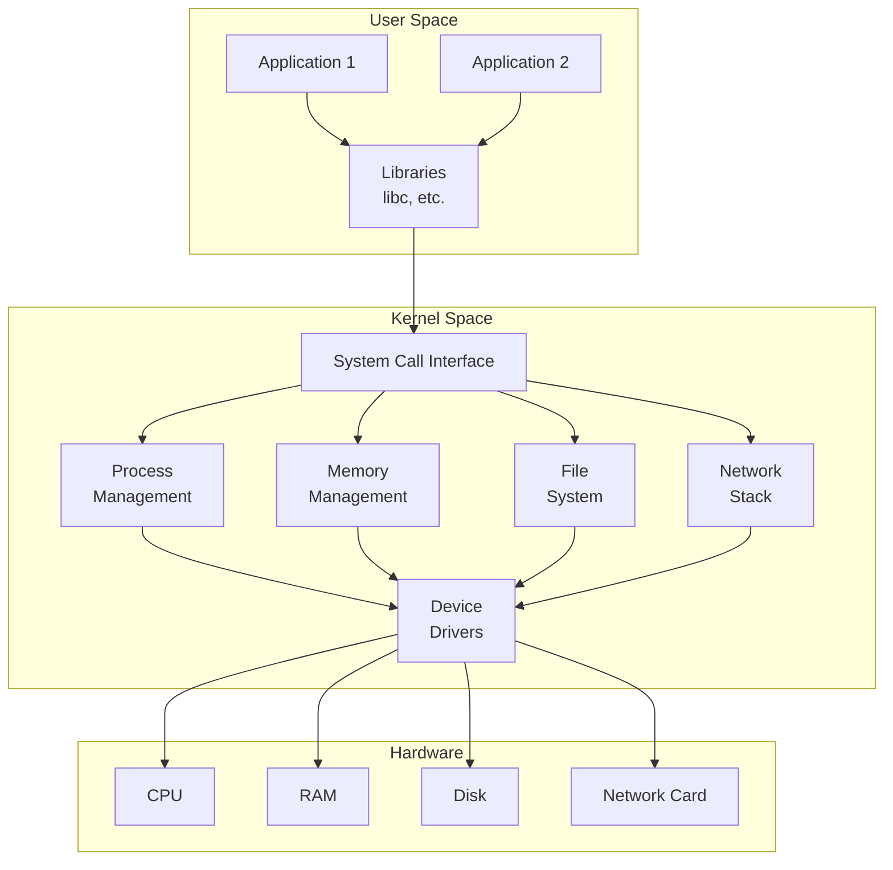
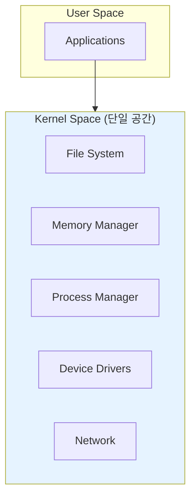
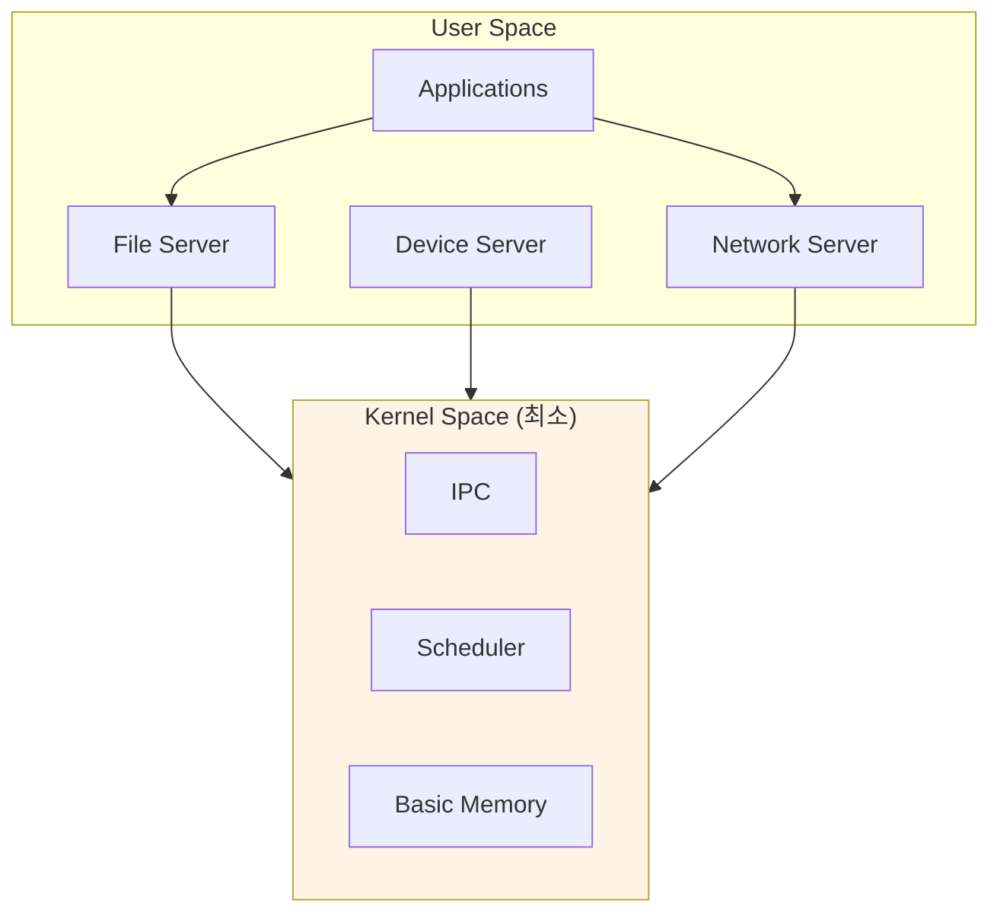

# OS Overview (운영체제 개요)

## 면접 질문
> "운영체제가 하는 일을 설명해주세요"

---

## 운영체제란?

**운영체제(Operating System)**는 하드웨어와 응용 프로그램 사이에서 동작하는 **시스템 소프트웨어**입니다. 하드웨어 자원을 관리하고, 응용 프로그램에게 일관된 인터페이스를 제공합니다.

### 왜 필요한가?

1. **하드웨어 복잡성 추상화**: 프로그래머가 디스크 컨트롤러의 레지스터를 직접 조작할 필요가 없습니다
2. **자원 공유와 보호**: 여러 프로그램이 CPU, 메모리를 안전하게 공유합니다
3. **일관된 인터페이스**: 어떤 디스크든 동일한 `read()`, `write()` 호출로 접근합니다

---

## 운영체제의 핵심 기능



### 1. 프로세스 관리 (Process Management)

프로세스의 생성, 스케줄링, 종료를 담당합니다.

| 기능 | 설명 |
|------|------|
| **프로세스 생성** | fork(), exec()으로 새 프로세스 시작 |
| **스케줄링** | CPU 시간을 프로세스에 공평하게 분배 |
| **동기화** | 프로세스 간 협력과 경쟁 조율 |
| **IPC** | 프로세스 간 통신 메커니즘 제공 |

### 2. 메모리 관리 (Memory Management)

물리 메모리를 추상화하여 프로세스에게 독립된 주소 공간을 제공합니다.

- **가상 메모리**: 각 프로세스에 독립된 주소 공간
- **페이징**: 메모리를 4KB 페이지 단위로 관리
- **스와핑**: 메모리 부족 시 디스크로 페이지 이동

### 3. 파일 시스템 (File System)

디스크 블록을 파일과 디렉토리로 추상화합니다.

```
/home/user/document.txt
     ↓
[inode 12345] → [블록 1000, 1001, 1002]
     ↓
디스크의 물리적 위치
```

### 4. 장치 드라이버 (Device Drivers)

다양한 하드웨어를 일관된 인터페이스로 접근하게 합니다.

```c
// 어떤 장치든 동일한 인터페이스
open("/dev/sda1", O_RDONLY);  // 디스크
open("/dev/ttyS0", O_RDWR);   // 시리얼 포트
open("/dev/null", O_WRONLY);  // 가상 장치
```

### 5. 네트워크 스택 (Network Stack)

TCP/IP 프로토콜을 구현하여 네트워크 통신을 제공합니다.

---

## 커널 아키텍처 비교

### 모놀리식 커널 (Monolithic Kernel)

모든 OS 서비스가 커널 공간에서 실행됩니다.



- **장점**: 컴포넌트 간 통신이 빠름 (함수 호출)
- **단점**: 하나의 버그가 전체 시스템 크래시 유발
- **예시**: Linux, Unix

### 마이크로커널 (Microkernel)

최소한의 기능만 커널에, 나머지는 유저 공간 서버로 분리합니다.



- **장점**: 안정성 높음, 서비스 충돌이 시스템에 영향 적음
- **단점**: IPC 오버헤드로 성능 저하
- **예시**: Minix, QNX, seL4

### 하이브리드 커널 (Hybrid Kernel)

모놀리식의 성능과 마이크로커널의 모듈성을 결합합니다.

- **예시**: Windows NT, macOS (XNU)

---

## 실제 OS 비교

| 특성 | Linux | Windows | macOS |
|------|-------|---------|-------|
| **커널 타입** | 모놀리식 | 하이브리드 | 하이브리드 (XNU) |
| **시스템 콜 방식** | int 0x80 / syscall | NTDLL.dll | Mach traps |
| **파일 시스템** | ext4, XFS, Btrfs | NTFS | APFS |
| **프로세스 모델** | fork + exec | CreateProcess | posix_spawn |

---

## 면접 답변 예시

> **Q: 운영체제가 하는 일을 설명해주세요**

"운영체제는 하드웨어와 응용 프로그램 사이의 중재자입니다.

첫째, **자원 관리자** 역할을 합니다. CPU 시간, 메모리, 디스크 공간 등 제한된 자원을 여러 프로그램이 효율적으로 공유할 수 있도록 관리합니다.

둘째, **추상화 계층**을 제공합니다. 프로그래머가 하드웨어 세부사항을 몰라도 파일을 읽고 쓰고, 네트워크 통신을 할 수 있게 일관된 인터페이스를 제공합니다.

셋째, **보호 메커니즘**을 구현합니다. 프로세스 간 메모리 격리, 커널/유저 모드 분리를 통해 하나의 프로그램 오류가 전체 시스템을 망가뜨리지 않도록 합니다."

---

## 핵심 정리

| 개념 | 한 줄 정의 |
|------|-----------|
| **운영체제** | 하드웨어를 관리하고 애플리케이션에 서비스를 제공하는 시스템 소프트웨어 |
| **커널** | OS의 핵심으로, 항상 메모리에 상주하며 하드웨어를 직접 제어 |
| **시스템 콜** | 유저 프로그램이 커널 서비스를 요청하는 인터페이스 |
| **모놀리식** | 모든 OS 기능이 커널 공간에서 실행되는 구조 |
| **마이크로커널** | 최소 기능만 커널에, 나머지는 유저 공간 서버로 분리 |

---

## 다음 문서

→ [02_Process_and_Thread](./02_Process_and_Thread.md): 프로세스와 스레드
