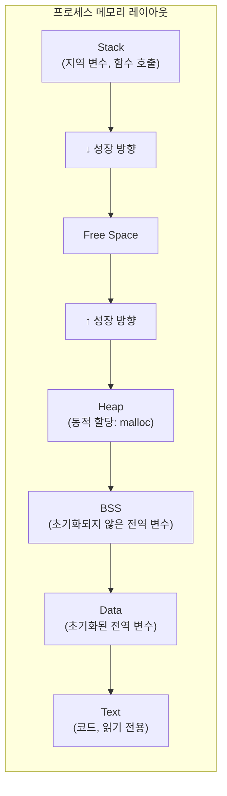
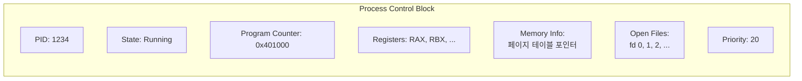
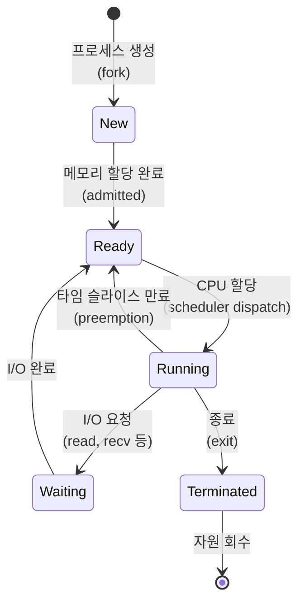
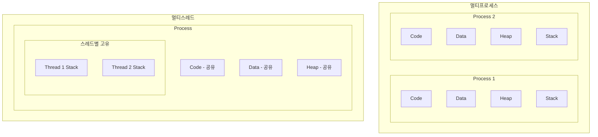
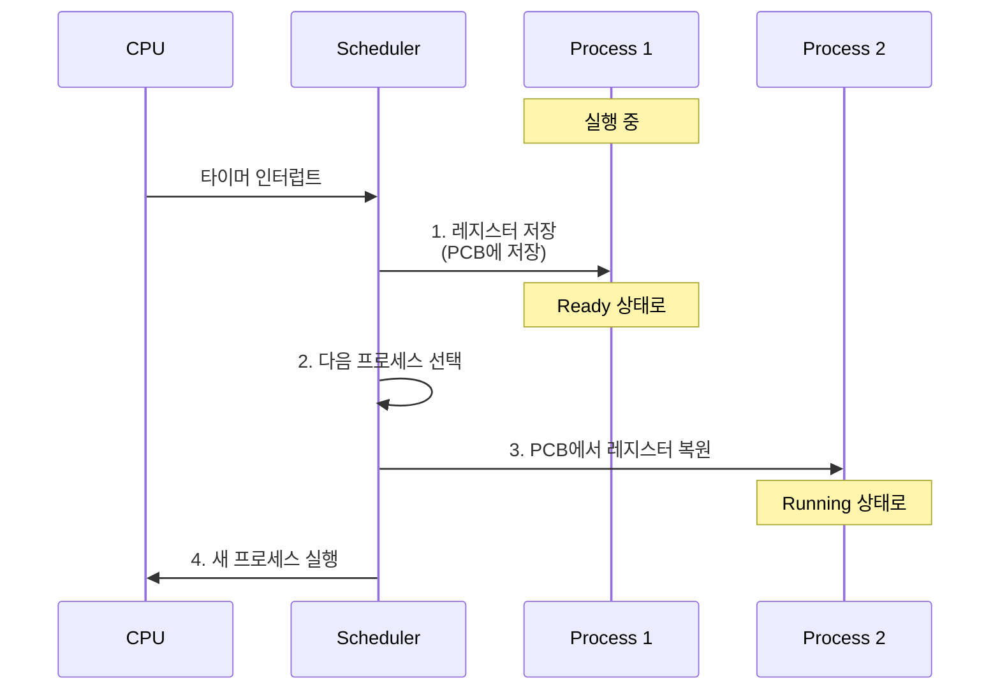
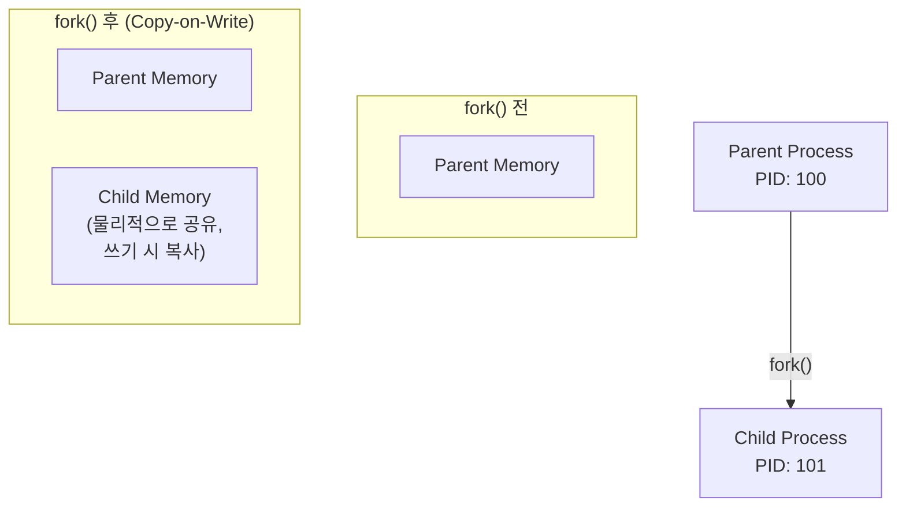

# Process and Thread (프로세스와 스레드)

## 면접 질문
> "프로세스와 스레드의 차이점은?"

---

## 프로세스란?

**프로세스(Process)**는 실행 중인 프로그램의 인스턴스입니다. 프로그램은 디스크에 저장된 정적인 코드이고, 프로세스는 메모리에 로드되어 실행되는 동적인 상태입니다.

### 프로세스의 구성 요소



| 영역 | 설명 | 예시 |
|------|------|------|
| **Text** | 실행할 코드, 읽기 전용 | 컴파일된 함수들 |
| **Data** | 초기화된 전역/정적 변수 | `int x = 10;` |
| **BSS** | 초기화되지 않은 전역 변수 | `int y;` |
| **Heap** | 동적 메모리 할당 | `malloc()`, `new` |
| **Stack** | 함수 호출 스택, 지역 변수 | 함수 매개변수, 리턴 주소 |

### PCB (Process Control Block)

커널이 프로세스를 관리하기 위해 유지하는 자료구조입니다.



| 필드 | 설명 |
|------|------|
| **PID** | 프로세스 고유 식별자 |
| **State** | 현재 상태 (Running, Ready, Waiting...) |
| **Program Counter** | 다음 실행할 명령어 주소 |
| **Registers** | CPU 레지스터 값들 |
| **Memory Info** | 페이지 테이블, 메모리 한계 |
| **Open Files** | 열린 파일 디스크립터 목록 |

---

## 프로세스 상태 전이



### 상태 설명

| 상태 | 설명 | 전환 트리거 |
|------|------|-------------|
| **New** | 프로세스 생성 중 | fork() 호출 |
| **Ready** | CPU 대기 중 | 스케줄러가 선택하면 Running |
| **Running** | CPU에서 실행 중 | 타임 슬라이스, I/O 요청 |
| **Waiting** | I/O 완료 대기 | I/O 완료 인터럽트 |
| **Terminated** | 실행 완료 | exit() 또는 시그널 |

---

## 스레드란?

**스레드(Thread)**는 프로세스 내에서 실행되는 흐름의 단위입니다. 같은 프로세스의 스레드들은 **메모리를 공유**합니다.

### 프로세스 vs 스레드



| 특성 | 프로세스 | 스레드 |
|------|----------|--------|
| **메모리 공간** | 독립 (격리됨) | 공유 (Code, Data, Heap) |
| **생성 비용** | 높음 | 낮음 |
| **통신 방식** | IPC (파이프, 소켓 등) | 직접 메모리 접근 |
| **컨텍스트 스위칭** | 비용 높음 | 비용 낮음 |
| **안정성** | 하나 죽어도 다른 것 영향 없음 | 하나 죽으면 전체 프로세스 종료 |

### 스레드가 공유하는 것 vs 고유한 것

| 공유 | 고유 |
|------|------|
| Code 영역 | Stack |
| Data 영역 | Registers |
| Heap | Program Counter |
| 열린 파일 | Thread ID |
| 신호 핸들러 | 우선순위 |

---

## 컨텍스트 스위칭 (Context Switching)

CPU가 한 프로세스/스레드에서 다른 것으로 전환하는 과정입니다.

### 왜 비용이 발생하는가?



### 컨텍스트 스위칭 비용

1. **레지스터 저장/복원**: CPU 레지스터 값을 메모리에 저장하고 새 값을 로드
2. **TLB 플러시**: 프로세스 전환 시 주소 변환 캐시 무효화 (프로세스 간)
3. **캐시 미스**: 새 프로세스의 데이터가 캐시에 없을 가능성 높음

| 전환 유형 | 비용 | 이유 |
|----------|------|------|
| **스레드 간** | 낮음 | 같은 주소 공간, TLB 유지 |
| **프로세스 간** | 높음 | TLB 플러시, 페이지 테이블 변경 |

---

## 프로세스 생성: fork()

Unix/Linux에서 새 프로세스는 `fork()` 시스템 콜로 생성됩니다.

```c
#include <unistd.h>
#include <stdio.h>

int main() {
    pid_t pid = fork();

    if (pid == 0) {
        // 자식 프로세스
        printf("I am child, PID: %d\n", getpid());
    } else if (pid > 0) {
        // 부모 프로세스
        printf("I am parent, child PID: %d\n", pid);
    } else {
        // 에러
        perror("fork failed");
    }
    return 0;
}
```

### fork()의 동작

1. 부모 프로세스의 메모리 공간을 **복사** (Copy-on-Write 최적화)
2. 새 PCB 생성
3. 부모에게는 자식 PID 반환, 자식에게는 0 반환



---

## 실제 사용 시나리오

### 멀티프로세스가 적합한 경우

1. **격리가 중요**: 한 작업의 크래시가 다른 작업에 영향 주면 안 됨
   - 예: 웹 브라우저 탭 (Chrome의 각 탭은 별도 프로세스)
2. **독립적인 작업**: 데이터 공유가 거의 없는 병렬 작업
   - 예: 멀티프로세스 웹 서버

### 멀티스레드가 적합한 경우

1. **빈번한 데이터 공유**: 메모리를 통한 빠른 통신 필요
   - 예: 데이터베이스 연결 풀
2. **빠른 생성/전환 필요**: 많은 동시 작업
   - 예: HTTP 서버의 요청 처리
3. **자원 효율성**: 메모리 사용량 최소화
   - 예: 게임 서버

---

## 면접 답변 예시

> **Q: 프로세스와 스레드의 차이점은?**

"프로세스는 실행 중인 프로그램의 인스턴스로, 독립된 메모리 공간(코드, 데이터, 힙, 스택)을 가집니다. 반면 스레드는 프로세스 내의 실행 단위로, 같은 프로세스의 스레드들은 코드, 데이터, 힙을 공유하고 스택만 별도로 가집니다.

이 차이로 인해 세 가지 특징이 나타납니다:

1. **생성 비용**: 스레드가 프로세스보다 가볍습니다. 프로세스 생성은 메모리 공간 전체를 복사해야 하지만(CoW 최적화 있음), 스레드는 스택만 새로 할당합니다.

2. **통신 방식**: 프로세스 간 통신은 IPC(파이프, 소켓 등)가 필요하지만, 스레드는 공유 메모리로 직접 통신합니다. 대신 동기화(락)가 필요합니다.

3. **안정성**: 프로세스는 격리되어 하나가 죽어도 다른 프로세스에 영향이 없습니다. 스레드는 공유 메모리 때문에 하나의 스레드 오류가 전체 프로세스를 종료시킬 수 있습니다."

---

## 핵심 정리

| 개념 | 한 줄 정의 |
|------|-----------|
| **프로세스** | 독립된 메모리 공간을 가진 실행 중인 프로그램 |
| **스레드** | 프로세스 내에서 메모리를 공유하며 실행되는 경량 실행 단위 |
| **PCB** | 커널이 프로세스를 관리하기 위한 자료구조 (PID, 상태, 레지스터 등) |
| **컨텍스트 스위칭** | CPU가 실행 중인 프로세스/스레드를 전환하는 과정 |
| **fork()** | Unix에서 새 프로세스를 생성하는 시스템 콜 |

---

## 다음 문서

→ [03_Memory_Management](./03_Memory_Management.md): 메모리 관리
