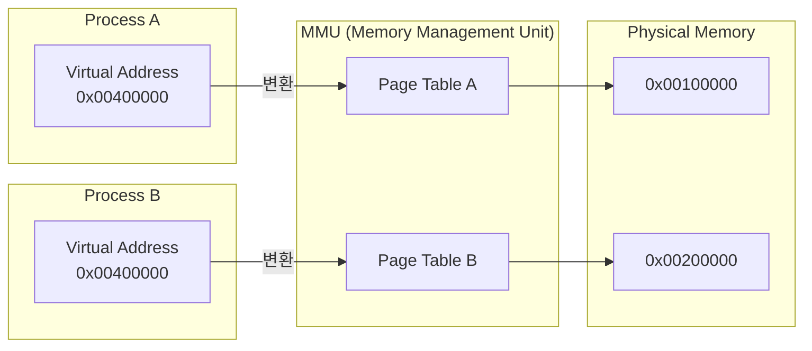
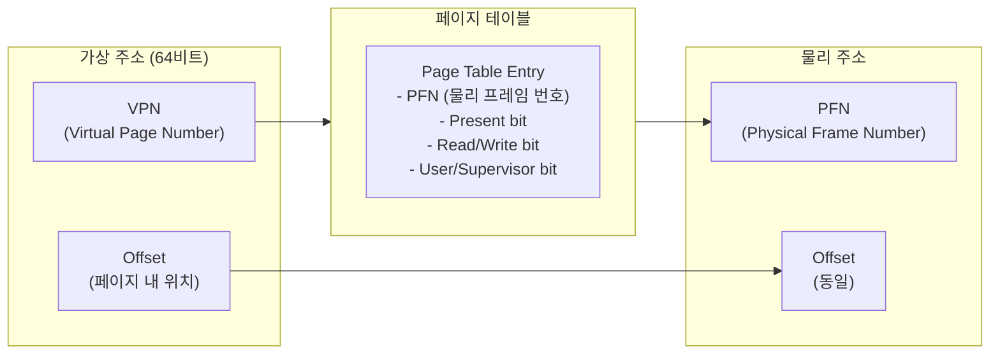
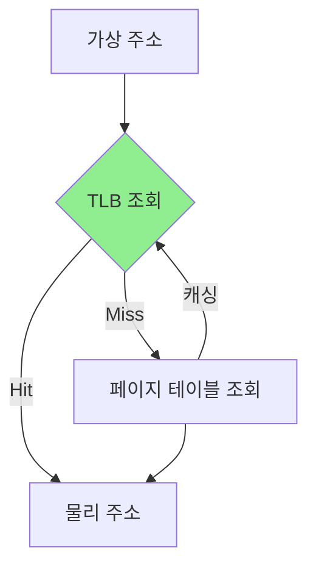
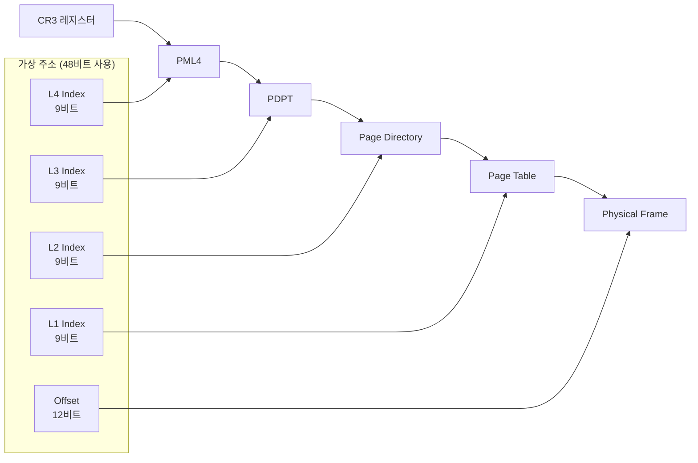
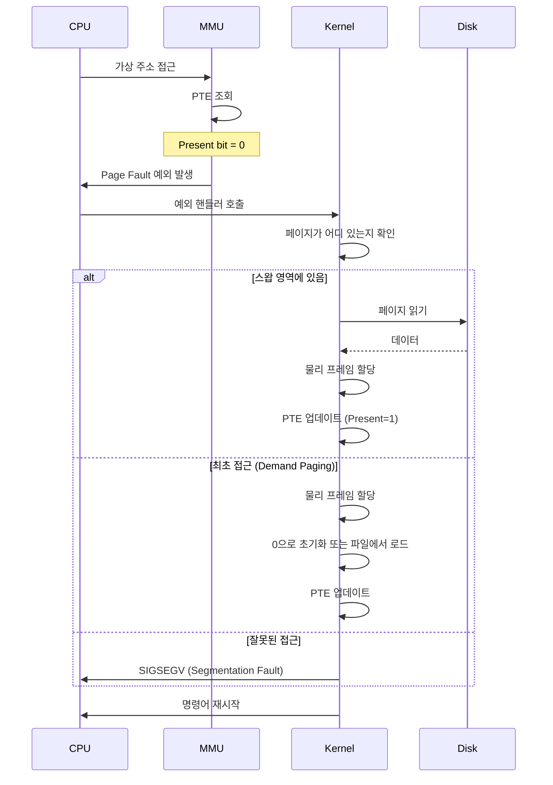
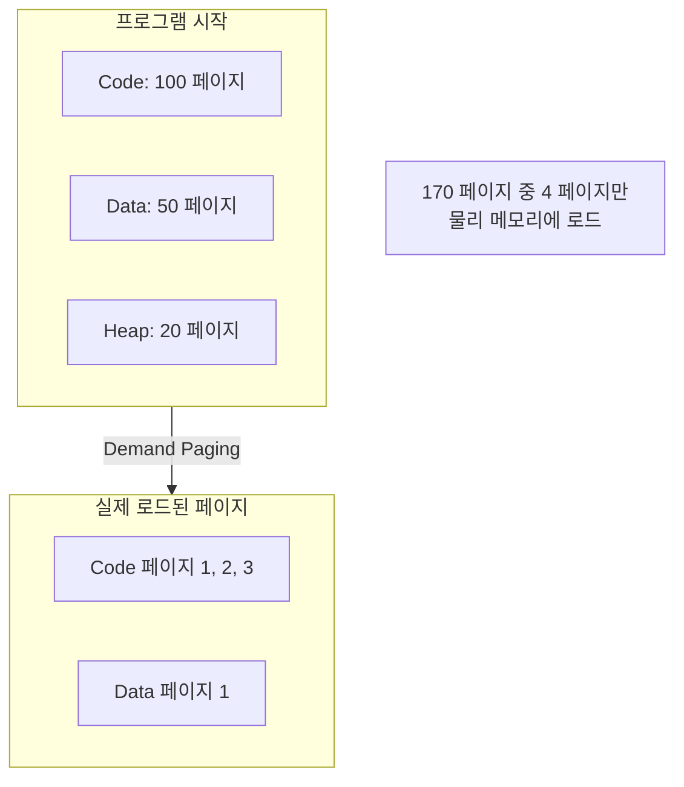
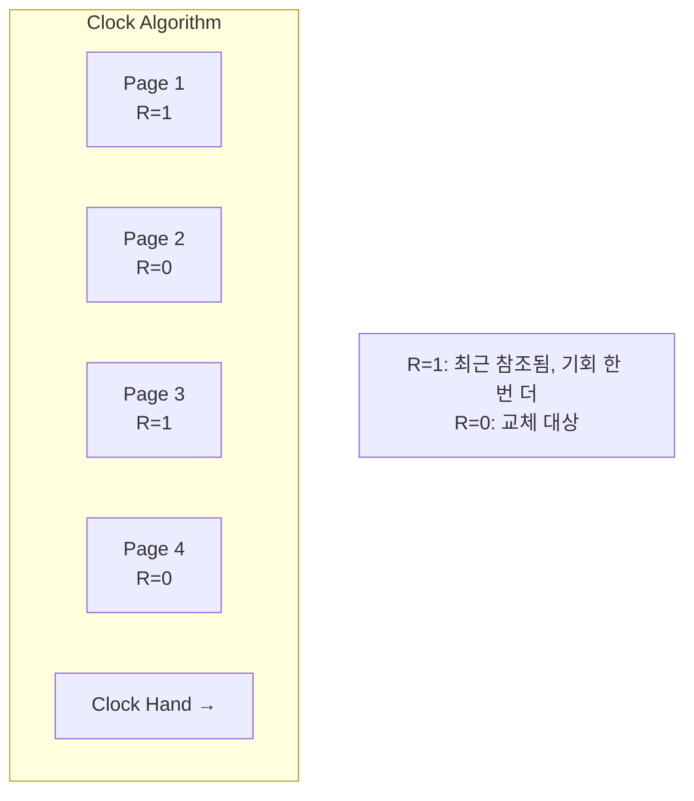

# Memory Management (메모리 관리) ⭐

## 면접 질문
> "가상 메모리가 왜 필요한가요?"

---

## 물리 메모리의 한계

가상 메모리가 없던 시절의 문제점을 먼저 이해해야 합니다.

### 문제 1: 프로그램 크기 > 물리 메모리

```
물리 메모리: 4GB
프로그램 A: 3GB
프로그램 B: 2GB

→ 동시에 실행 불가능
```

### 문제 2: 메모리 주소 충돌

```c
// 프로그램 A
int *p = (int *)0x1000;  // 주소 0x1000 사용

// 프로그램 B
int *q = (int *)0x1000;  // 같은 주소를 사용하면?
```

직접 물리 주소를 사용하면 프로그램 간 충돌이 발생합니다.

### 문제 3: 보안/격리 부재

프로그램 A가 프로그램 B의 메모리를 마음대로 읽고 쓸 수 있습니다.

---

## 가상 메모리의 해결책

**가상 메모리(Virtual Memory)**는 각 프로세스에게 독립된 가상 주소 공간을 제공합니다.



### 가상 메모리가 제공하는 것

| 기능 | 설명 |
|------|------|
| **주소 공간 격리** | 각 프로세스는 자신만의 주소 공간을 가짐 (같은 가상 주소가 다른 물리 주소로 매핑) |
| **메모리 보호** | 다른 프로세스의 메모리 접근 불가 |
| **물리 메모리보다 큰 주소 공간** | 64비트 시스템에서 프로세스당 최대 128TB |
| **효율적 메모리 사용** | 실제로 사용하는 페이지만 물리 메모리에 로드 |

---

## 페이징 (Paging)

가상 메모리를 구현하는 핵심 기법입니다.

### 페이지와 프레임

- **페이지(Page)**: 가상 메모리의 고정 크기 블록 (보통 4KB)
- **프레임(Frame)**: 물리 메모리의 고정 크기 블록 (페이지와 동일 크기)

```
가상 주소 공간          물리 메모리
┌──────────┐           ┌──────────┐
│ Page 0   │──────────→│ Frame 3  │
├──────────┤           ├──────────┤
│ Page 1   │──────────→│ Frame 7  │
├──────────┤           ├──────────┤
│ Page 2   │──(없음)   │ Frame 1  │
├──────────┤           ├──────────┤
│ Page 3   │──────────→│ Frame 0  │
└──────────┘           └──────────┘
```

### 페이지 테이블 (Page Table)

가상 페이지 번호(VPN)를 물리 프레임 번호(PFN)로 매핑하는 테이블입니다.



### 페이지 테이블 엔트리 (PTE) 구조

| 필드 | 비트 | 설명 |
|------|------|------|
| **Present** | 1 | 물리 메모리에 있는지 (없으면 Page Fault) |
| **Read/Write** | 1 | 쓰기 가능 여부 |
| **User/Supervisor** | 1 | 유저 모드 접근 가능 여부 |
| **Accessed** | 1 | 최근 접근됨 (페이지 교체 알고리즘용) |
| **Dirty** | 1 | 수정됨 (스왑 아웃 시 디스크 쓰기 필요) |
| **PFN** | ~40 | 물리 프레임 번호 |

---

## TLB (Translation Lookaside Buffer)

페이지 테이블 조회는 메모리 접근이 필요하므로 느립니다. TLB는 최근 사용된 주소 변환을 캐시합니다.



### TLB의 특성

| 특성 | 값 |
|------|-----|
| **크기** | 64~1024 엔트리 |
| **조회 시간** | 1 사이클 |
| **미스 페널티** | 10~100 사이클 |
| **히트율** | 보통 99% 이상 |

### TLB 플러시

**컨텍스트 스위칭 시 TLB를 비워야 하는 이유**: 다른 프로세스의 페이지 테이블 매핑이 유효하지 않기 때문입니다.

```
Process A: 가상 주소 0x1000 → 물리 0x5000
Process B: 가상 주소 0x1000 → 물리 0x8000

→ 프로세스 전환 시 TLB의 A 엔트리가 남아있으면 잘못된 물리 주소 접근
```

최신 CPU는 **ASID(Address Space ID)**를 사용하여 TLB 플러시를 최소화합니다.

---

## 다단계 페이지 테이블

64비트 시스템에서 단일 페이지 테이블은 너무 큽니다.

```
64비트 주소 공간: 2^64 바이트 = 16 Exabytes
페이지 크기: 4KB
필요한 PTE 수: 2^52 개
PTE 크기: 8바이트
페이지 테이블 크기: 2^55 바이트 = 32 Petabytes (!)
```

### 해결책: 다단계 (Multi-level) 페이지 테이블



**장점**: 사용하지 않는 주소 영역의 페이지 테이블은 생성하지 않음 → 메모리 절약

---

## Page Fault (페이지 폴트)

접근하려는 페이지가 물리 메모리에 없을 때 발생하는 예외입니다.

### Page Fault 처리 과정



### Page Fault의 종류

| 종류 | 원인 | 처리 |
|------|------|------|
| **Minor** | 페이지가 이미 메모리에 있음 (다른 프로세스와 공유) | PTE만 업데이트 |
| **Major** | 디스크에서 페이지 로드 필요 | 디스크 I/O 발생 |
| **Invalid** | 잘못된 주소 접근 | SIGSEGV 시그널 |

---

## Demand Paging (요청 시 페이징)

프로그램 시작 시 모든 페이지를 로드하지 않고, **실제 접근할 때 로드**합니다.

### 장점

1. **빠른 프로그램 시작**: 전체 프로그램을 로드할 필요 없음
2. **메모리 효율**: 사용하지 않는 코드/데이터는 로드하지 않음
3. **대용량 프로그램 실행**: 물리 메모리보다 큰 프로그램 실행 가능



---

## 페이지 교체 알고리즘

물리 메모리가 부족하면 어떤 페이지를 스왑 아웃할지 결정해야 합니다.

### 주요 알고리즘

| 알고리즘 | 설명 | 장단점 |
|----------|------|--------|
| **FIFO** | 가장 먼저 들어온 페이지 교체 | 단순하지만 성능 나쁨 |
| **LRU** | 가장 오래 사용하지 않은 페이지 교체 | 좋은 성능, 구현 비용 높음 |
| **Clock** | LRU 근사, 원형 리스트 순회 | 실용적, Linux 사용 |

### Clock 알고리즘 (Second Chance)



---

## 면접 답변 예시

> **Q: 가상 메모리가 왜 필요한가요?**

"가상 메모리는 세 가지 핵심 문제를 해결합니다.

첫째, **주소 공간 격리**입니다. 각 프로세스는 자신만의 가상 주소 공간을 가지므로, 같은 주소 0x1000을 사용해도 서로 다른 물리 메모리를 참조합니다. 이로써 프로세스 간 메모리 충돌과 보안 문제를 방지합니다.

둘째, **물리 메모리 한계 극복**입니다. Demand Paging으로 실제 사용하는 페이지만 물리 메모리에 로드하고, 필요하면 스왑을 통해 물리 메모리보다 큰 프로그램도 실행할 수 있습니다.

셋째, **메모리 효율성**입니다. Copy-on-Write로 fork() 시 실제 수정이 발생할 때만 메모리를 복사하고, 공유 라이브러리는 여러 프로세스가 같은 물리 프레임을 공유합니다."

---

## 핵심 정리

| 개념 | 한 줄 정의 |
|------|-----------|
| **가상 메모리** | 각 프로세스에 독립된 주소 공간을 제공하는 메모리 추상화 |
| **페이지** | 가상 메모리의 고정 크기(4KB) 블록 |
| **프레임** | 물리 메모리의 고정 크기(4KB) 블록 |
| **페이지 테이블** | 가상 페이지를 물리 프레임으로 매핑하는 자료구조 |
| **TLB** | 최근 주소 변환을 캐시하는 하드웨어 |
| **Page Fault** | 접근하려는 페이지가 물리 메모리에 없을 때 발생하는 예외 |
| **Demand Paging** | 실제 접근할 때만 페이지를 로드하는 기법 |

---

## 다음 문서

→ [04_Kernel_and_UserSpace](./04_Kernel_and_UserSpace.md): 커널과 유저 스페이스
