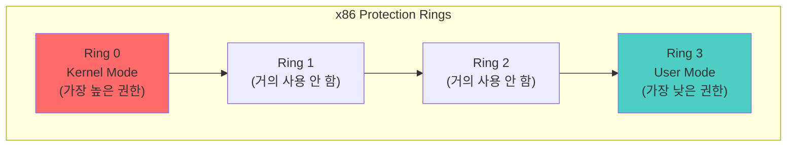
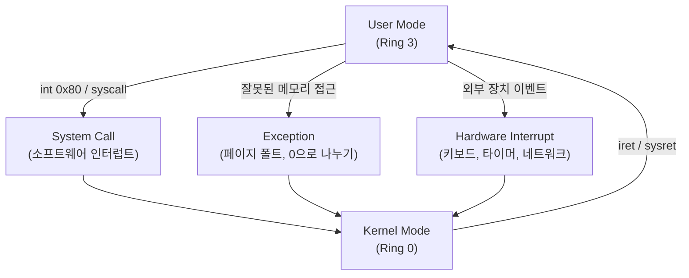
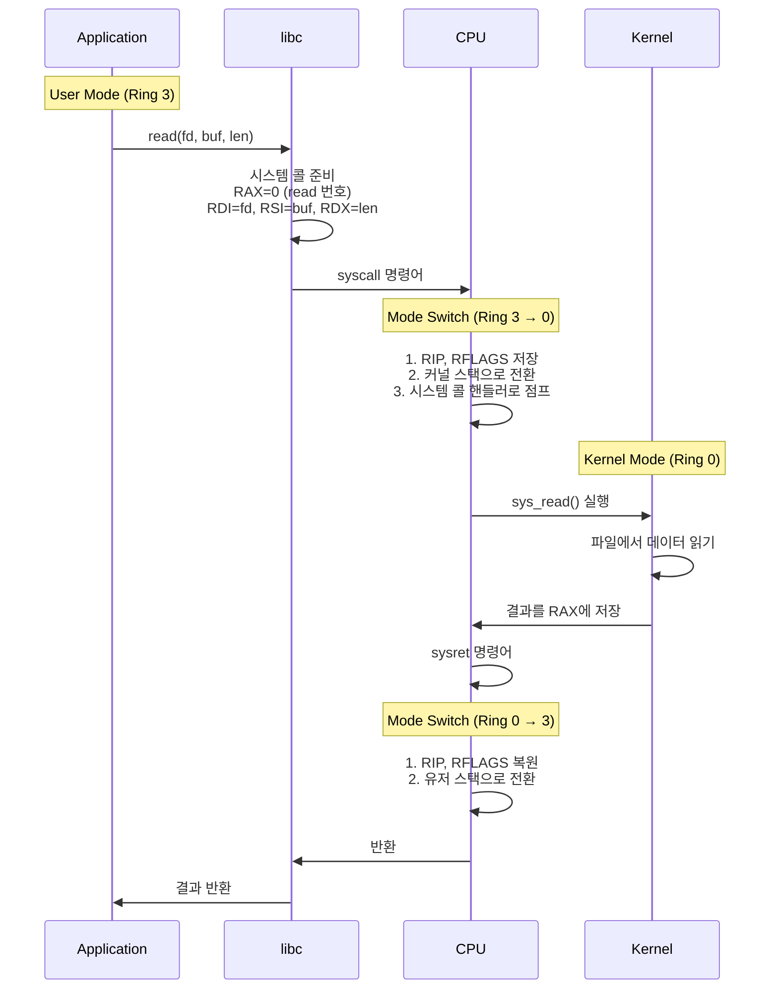
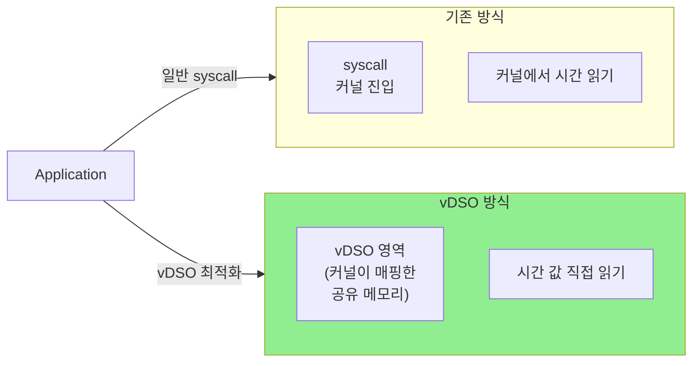
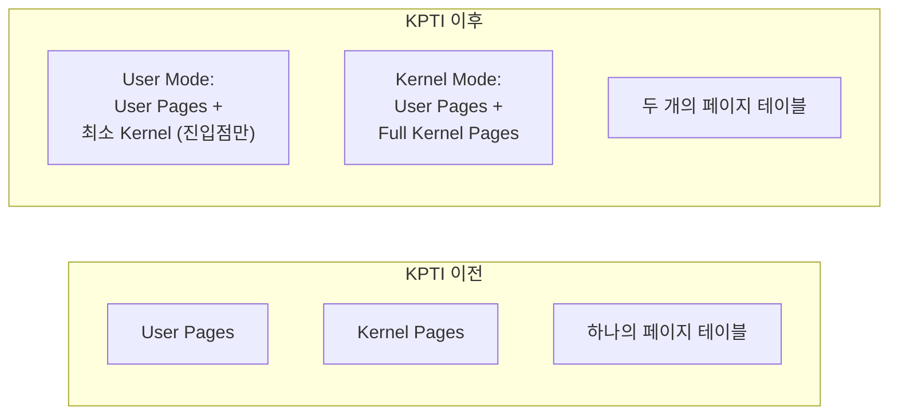

# Kernel and User Space (커널과 유저 스페이스)

## 면접 질문
> "유저 모드와 커널 모드의 차이점은?"

---

## 왜 권한을 분리하는가?

운영체제는 **안정성**과 **보안**을 위해 실행 권한을 분리합니다.

### 권한 분리가 없다면?

```c
// 악의적인 사용자 프로그램
void attack() {
    // 다른 프로세스 메모리 덮어쓰기
    memset((void*)0x0, 0, 0xFFFFFFFF);

    // 디스크 직접 접근하여 파일 시스템 파괴
    outb(0x1F7, 0x30);  // I/O 포트 직접 접근

    // 인터럽트 비활성화하여 시스템 멈춤
    asm("cli");
}
```

권한 분리 없이는 일반 프로그램이 시스템 전체를 망가뜨릴 수 있습니다.

---

## CPU 특권 레벨 (Protection Rings)

x86 CPU는 4개의 특권 레벨(Ring)을 제공합니다.



### 실제 사용

| Ring | 사용 | 설명 |
|------|------|------|
| **Ring 0** | 커널 | 모든 명령어와 하드웨어 접근 가능 |
| **Ring 1, 2** | 미사용 | 대부분의 OS가 사용하지 않음 |
| **Ring 3** | 유저 애플리케이션 | 제한된 명령어만 실행 가능 |

대부분의 현대 OS(Linux, Windows, macOS)는 Ring 0과 Ring 3만 사용합니다.

---

## 커널 모드 vs 유저 모드

### 권한 비교

| 기능 | 커널 모드 (Ring 0) | 유저 모드 (Ring 3) |
|------|-------------------|-------------------|
| **메모리 접근** | 모든 물리/가상 메모리 | 자신의 가상 주소 공간만 |
| **I/O 포트** | 직접 접근 가능 | 불가 (General Protection Fault) |
| **특권 명령어** | 모두 실행 가능 | 제한됨 |
| **인터럽트 제어** | 가능 (CLI, STI) | 불가 |
| **페이지 테이블** | 수정 가능 (CR3) | 불가 |

### 특권 명령어 (Privileged Instructions)

유저 모드에서 실행하면 예외가 발생하는 명령어들입니다.

```asm
; 커널 모드에서만 가능
cli         ; 인터럽트 비활성화
sti         ; 인터럽트 활성화
hlt         ; CPU 정지
lgdt        ; GDT 레지스터 로드
mov cr3, eax ; 페이지 테이블 변경
in al, 0x60 ; I/O 포트 읽기
out 0x60, al ; I/O 포트 쓰기
```

---

## 모드 전환 (Mode Switch)

### 유저 → 커널 전환 트리거



| 전환 원인 | 설명 | 예시 |
|----------|------|------|
| **System Call** | 유저 프로그램이 커널 서비스 요청 | read(), write(), fork() |
| **Exception** | 프로그램 오류나 특별한 상황 | Page Fault, Division by Zero |
| **Interrupt** | 하드웨어 이벤트 | 타이머, 키보드 입력, 네트워크 패킷 |

### 모드 전환 비용

모드 전환은 **비용이 발생**합니다:

1. **레지스터 저장/복원**: 유저 상태를 저장하고 커널 상태 로드
2. **스택 전환**: 유저 스택 → 커널 스택
3. **TLB 영향**: 일부 TLB 엔트리 무효화 가능
4. **파이프라인 플러시**: CPU 명령어 파이프라인 비우기

```
시스템 콜 1회 비용: 약 1,000~10,000 CPU 사이클
일반 함수 호출: 약 10~100 CPU 사이클
```

---

## 시스템 콜 호출 과정

### x86_64 Linux 시스템 콜 흐름



### 시스템 콜 명령어 비교

| 방식 | 명령어 | 특징 |
|------|--------|------|
| **Legacy** | `int 0x80` | 느림, 32비트 호환 |
| **Modern** | `syscall` / `sysret` | 빠름, 64비트 전용 |
| **vDSO** | 가상 동적 공유 객체 | 일부 시스템 콜은 커널 진입 없이 |

### vDSO (Virtual Dynamic Shared Object)

일부 시스템 콜(예: `gettimeofday`)은 커널 진입 없이 유저 공간에서 처리합니다.



커널이 주기적으로 vDSO 영역의 시간 값을 업데이트하고, 유저 프로그램은 이를 직접 읽습니다.

---

## 커널 주소 공간

### 리눅스 메모리 레이아웃 (x86_64)

```
0xFFFFFFFFFFFFFFFF ┌────────────────────┐
                   │   Kernel Space     │
                   │   (상위 128TB)      │
0xFFFF800000000000 ├────────────────────┤
                   │   Non-canonical    │
                   │   (사용 불가)       │
0x00007FFFFFFFFFFF ├────────────────────┤
                   │   User Space       │
                   │   (하위 128TB)      │
0x0000000000000000 └────────────────────┘
```

| 영역 | 범위 | 설명 |
|------|------|------|
| **User Space** | 0x0 ~ 0x7FFF... | 각 프로세스별 독립 |
| **Kernel Space** | 0xFFFF8... ~ 0xFFFF... | 모든 프로세스가 공유 (같은 매핑) |

### 왜 커널 공간이 모든 프로세스에 매핑되어 있는가?

시스템 콜 시 페이지 테이블을 교체하지 않아도 되기 때문입니다. 대신 **커널 공간은 유저 모드에서 접근 불가** (권한 비트로 보호).

---

## KPTI (Kernel Page Table Isolation)

Meltdown 취약점 대응으로 도입된 보안 기법입니다.

### 기존 방식의 문제

```
유저 모드에서 커널 메모리 주소가 매핑되어 있음
→ Speculative Execution 취약점으로 커널 메모리 읽기 가능 (Meltdown)
```

### KPTI 해결책



**단점**: 시스템 콜마다 페이지 테이블 전환 → 성능 저하 (5~30%)

---

## 면접 답변 예시

> **Q: 유저 모드와 커널 모드의 차이점은?**

"유저 모드와 커널 모드는 CPU의 권한 레벨 차이입니다.

**커널 모드(Ring 0)**에서는 모든 CPU 명령어를 실행할 수 있고, 모든 메모리와 하드웨어에 접근할 수 있습니다. 인터럽트 제어, 페이지 테이블 수정, I/O 포트 접근 같은 특권 작업이 가능합니다.

**유저 모드(Ring 3)**에서는 제한된 명령어만 실행할 수 있고, 자신의 가상 주소 공간만 접근 가능합니다. 특권 명령어를 실행하면 예외가 발생합니다.

이 분리가 필요한 이유는 **안정성과 보안** 때문입니다. 일반 프로그램이 시스템 자원에 직접 접근하면 실수나 악의적인 코드로 전체 시스템이 손상될 수 있습니다. 커널 서비스가 필요하면 시스템 콜을 통해 안전하게 요청해야 합니다.

다만 모드 전환에는 레지스터 저장/복원, 스택 전환 등의 비용이 발생하므로, 빈번한 시스템 콜은 성능에 영향을 줍니다. 이를 최적화하기 위해 vDSO나 io_uring 같은 기법이 사용됩니다."

---

## 핵심 정리

| 개념 | 한 줄 정의 |
|------|-----------|
| **커널 모드** | CPU의 최고 권한 레벨(Ring 0)로, 모든 명령어와 자원 접근 가능 |
| **유저 모드** | CPU의 제한된 권한 레벨(Ring 3)로, 안전한 명령어만 실행 가능 |
| **특권 명령어** | 커널 모드에서만 실행 가능한 CPU 명령어 (cli, hlt, mov cr3 등) |
| **모드 전환** | 시스템 콜, 인터럽트, 예외 발생 시 유저↔커널 모드 전환 |
| **vDSO** | 커널 진입 없이 일부 시스템 콜을 처리하는 최적화 기법 |

---

## 다음 문서

→ [05_Virtual_Memory](./05_Virtual_Memory.md): 가상 메모리와 mmap
