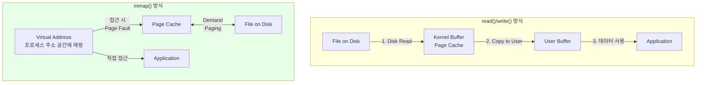
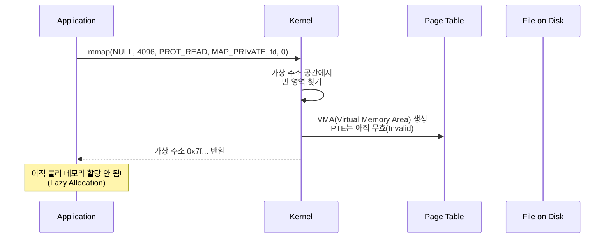
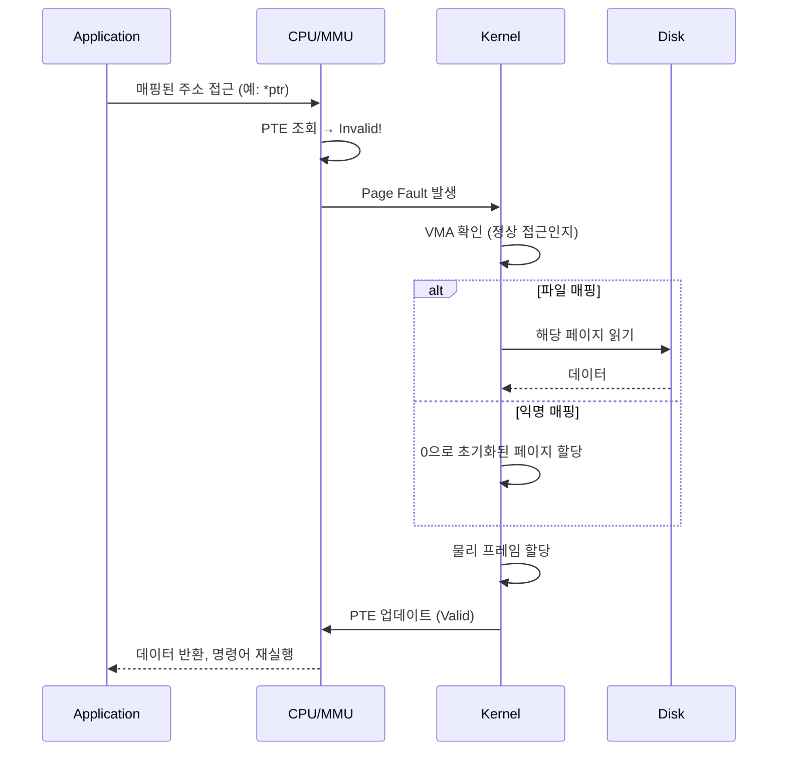
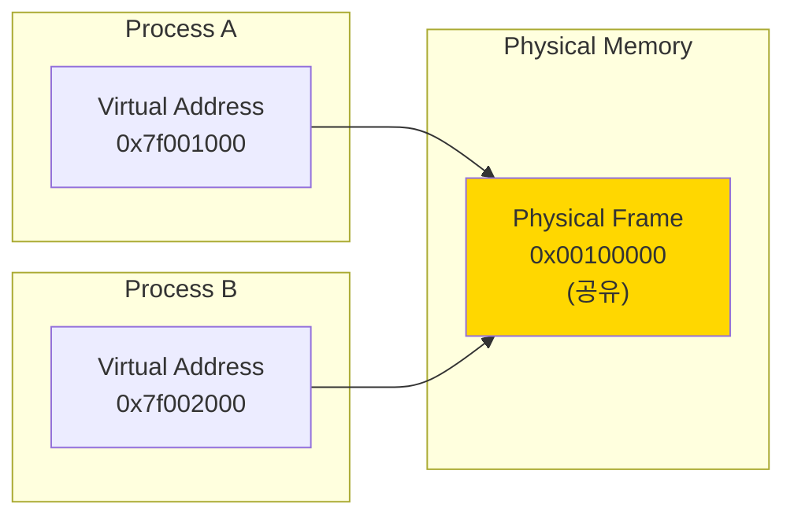
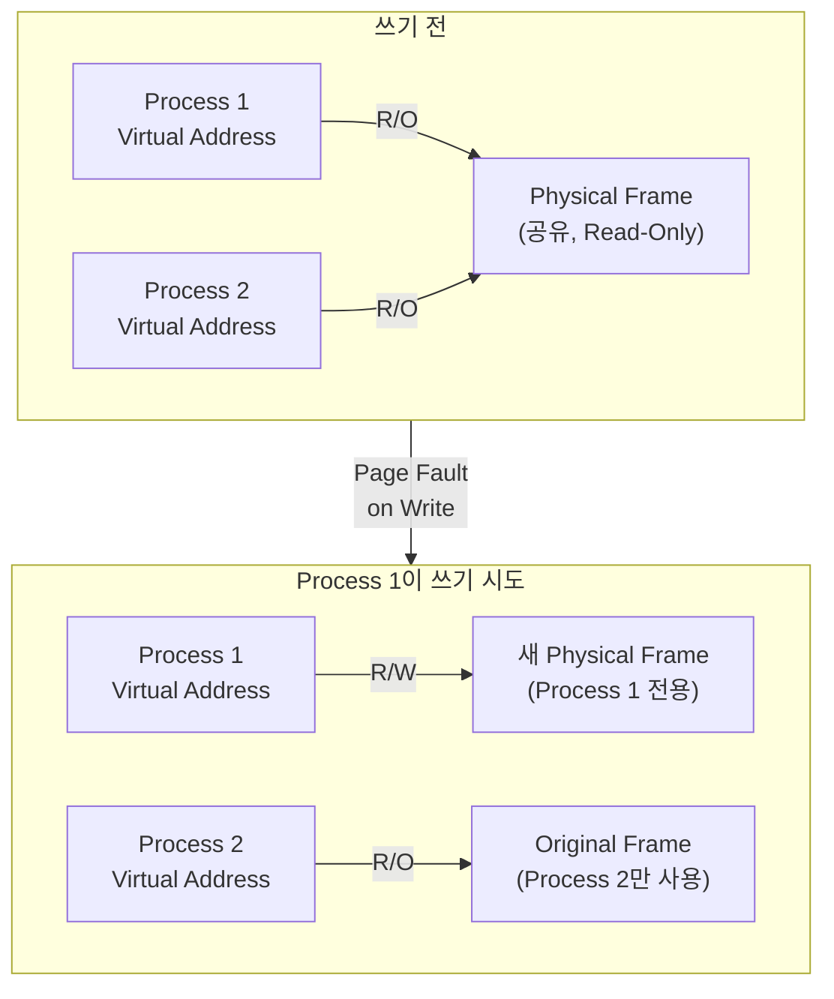

# Virtual Memory Deep Dive - mmap (가상 메모리 심층 - mmap) ⭐

## 면접 질문
> "mmap은 어떻게 동작하나요?"

---

## mmap이란?

**mmap (Memory Map)**은 파일이나 장치를 프로세스의 가상 주소 공간에 매핑하는 시스템 콜입니다.

```c
#include <sys/mman.h>

void *mmap(
    void *addr,      // 원하는 시작 주소 (NULL이면 커널이 결정)
    size_t length,   // 매핑 크기
    int prot,        // 보호 모드 (PROT_READ, PROT_WRITE, PROT_EXEC)
    int flags,       // 매핑 타입 (MAP_SHARED, MAP_PRIVATE, MAP_ANONYMOUS)
    int fd,          // 파일 디스크립터 (-1 for anonymous)
    off_t offset     // 파일 내 오프셋
);
```

### mmap vs read/write



| 특성 | read()/write() | mmap() |
|------|---------------|--------|
| **데이터 복사** | 커널→유저 복사 발생 | 복사 없음 (직접 접근) |
| **시스템 콜** | 매 읽기/쓰기마다 호출 | 초기 매핑 시 1회 |
| **적합한 경우** | 순차 읽기, 작은 파일 | 랜덤 접근, 대용량 파일 |
| **메모리 관리** | 명시적 버퍼 관리 | 커널이 페이지 관리 |

---

## mmap 동작 원리

### 1. 매핑 생성



### 2. 실제 접근 시 (Demand Paging)



---

## mmap의 주요 플래그

### prot (Protection) 플래그

| 플래그 | 설명 |
|--------|------|
| `PROT_READ` | 읽기 가능 |
| `PROT_WRITE` | 쓰기 가능 |
| `PROT_EXEC` | 실행 가능 (코드 로드 시) |
| `PROT_NONE` | 접근 불가 (Guard Page) |

### flags 플래그

| 플래그 | 설명 | 사용 사례 |
|--------|------|----------|
| `MAP_SHARED` | 여러 프로세스가 공유, 파일에 즉시 반영 | IPC, 데이터베이스 |
| `MAP_PRIVATE` | Copy-on-Write, 수정이 파일에 반영 안 됨 | 라이브러리 로딩 |
| `MAP_ANONYMOUS` | 파일 없이 메모리만 할당 | malloc 내부 |
| `MAP_FIXED` | 정확히 지정된 주소에 매핑 | 주의 필요 |

---

## 사용 사례별 예제

### 1. 대용량 파일 처리

```c
#include <sys/mman.h>
#include <fcntl.h>
#include <sys/stat.h>

// 10GB 파일을 효율적으로 처리
int process_large_file(const char *filename) {
    int fd = open(filename, O_RDONLY);
    struct stat sb;
    fstat(fd, &sb);

    // 파일 전체를 가상 주소 공간에 매핑
    char *data = mmap(NULL, sb.st_size, PROT_READ, MAP_PRIVATE, fd, 0);

    // 랜덤 접근 - 커널이 필요한 페이지만 로드
    char value = data[5000000000];  // 5GB 위치 접근
    char other = data[100];         // 처음 부분 접근

    // 커널 힌트: 순차 읽기 예정
    madvise(data, sb.st_size, MADV_SEQUENTIAL);

    munmap(data, sb.st_size);
    close(fd);
}
```

**왜 mmap이 좋은가?**
- 10GB 전체를 메모리에 로드하지 않음
- 실제 접근하는 페이지만 물리 메모리 사용
- 커널의 Page Cache 활용

### 2. 프로세스 간 공유 메모리

```c
// Process A: 공유 메모리 생성
int fd = shm_open("/myshm", O_CREAT | O_RDWR, 0666);
ftruncate(fd, 4096);
int *shared = mmap(NULL, 4096, PROT_READ | PROT_WRITE, MAP_SHARED, fd, 0);
*shared = 42;  // 값 쓰기

// Process B: 공유 메모리 접근
int fd = shm_open("/myshm", O_RDONLY, 0666);
int *shared = mmap(NULL, 4096, PROT_READ, MAP_SHARED, fd, 0);
printf("%d\n", *shared);  // 42 출력
```



### 3. 익명 매핑 (malloc 내부)

```c
// glibc의 malloc은 큰 할당에 mmap 사용
void *large_alloc = mmap(
    NULL,
    1024 * 1024,      // 1MB
    PROT_READ | PROT_WRITE,
    MAP_PRIVATE | MAP_ANONYMOUS,  // 파일 없이 메모리만
    -1,               // fd 불필요
    0
);

// 사용 후 해제
munmap(large_alloc, 1024 * 1024);
```

**malloc의 전략**:
- 작은 할당 (< 128KB): brk()/sbrk()로 힙 확장
- 큰 할당 (>= 128KB): mmap()으로 별도 영역

---

## Copy-on-Write (CoW)

`MAP_PRIVATE`로 매핑하면 Copy-on-Write가 적용됩니다.



### CoW의 장점

1. **fork() 최적화**: 자식 프로세스 생성 시 메모리 즉시 복사 불필요
2. **메모리 절약**: 읽기만 하면 물리 메모리 공유
3. **Lazy Copy**: 실제로 수정할 때만 복사

---

## mmap 성능 최적화: madvise()

커널에 메모리 사용 패턴을 알려주어 최적화할 수 있습니다.

```c
#include <sys/mman.h>

// 순차 접근 예정
madvise(addr, length, MADV_SEQUENTIAL);

// 랜덤 접근 예정
madvise(addr, length, MADV_RANDOM);

// 곧 사용할 예정 (Prefetch)
madvise(addr, length, MADV_WILLNEED);

// 더 이상 사용 안 함 (메모리 해제)
madvise(addr, length, MADV_DONTNEED);
```

| 힌트 | 효과 |
|------|------|
| `MADV_SEQUENTIAL` | Read-ahead 활성화, 읽은 페이지 빨리 해제 |
| `MADV_RANDOM` | Read-ahead 비활성화 |
| `MADV_WILLNEED` | 백그라운드에서 페이지 미리 로드 |
| `MADV_DONTNEED` | 페이지 해제, 다음 접근 시 다시 로드 |

---

## mmap vs read: 언제 무엇을 쓸까?

### mmap이 좋은 경우

1. **랜덤 접근**: 파일의 여러 위치를 자주 접근
2. **대용량 파일**: 전체를 메모리에 로드할 수 없을 때
3. **공유 메모리**: 프로세스 간 통신
4. **읽기 위주**: Copy-on-Write의 이점

### read()가 좋은 경우

1. **순차 읽기**: 처음부터 끝까지 한 번 읽기
2. **작은 파일**: 오버헤드 대비 이점 적음
3. **스트리밍**: 데이터를 읽으면서 바로 처리
4. **네트워크 I/O**: 소켓은 mmap 불가

### 성능 비교 (일반적 상황)

| 작업 | read() | mmap() |
|------|--------|--------|
| 작은 파일 순차 읽기 | ✅ 빠름 | ❌ 오버헤드 |
| 대용량 파일 순차 읽기 | 비슷 | 비슷 |
| 대용량 파일 랜덤 접근 | ❌ 느림 | ✅ 빠름 |
| 반복 접근 | ❌ 매번 시스템콜 | ✅ 메모리 접근 |

---

## 실제 활용 사례

### 데이터베이스

- **SQLite**: 데이터베이스 파일을 mmap으로 매핑
- **MongoDB**: WiredTiger 엔진에서 mmap 사용

### 로그 분석

```c
// 100GB 로그 파일에서 특정 패턴 검색
char *log = mmap(NULL, file_size, PROT_READ, MAP_PRIVATE, fd, 0);
madvise(log, file_size, MADV_SEQUENTIAL);

for (size_t i = 0; i < file_size; i++) {
    // 커널이 자동으로 페이지 로드/해제
    if (log[i] == 'E' && strncmp(&log[i], "ERROR", 5) == 0) {
        // 에러 발견
    }
}
```

### 실행 파일 로딩

프로그램 실행 시 ELF 파일의 각 섹션을 mmap으로 매핑합니다.

```
.text (코드)  → mmap(PROT_READ | PROT_EXEC)
.data (데이터) → mmap(PROT_READ | PROT_WRITE)
.rodata (상수) → mmap(PROT_READ)
```

---

## 면접 답변 예시

> **Q: mmap은 어떻게 동작하나요?**

"mmap은 파일이나 장치를 프로세스의 가상 주소 공간에 매핑하는 시스템 콜입니다.

동작 원리는 이렇습니다:
1. mmap 호출 시 커널은 가상 주소 공간에 VMA(Virtual Memory Area)를 생성하지만, **실제 물리 메모리는 할당하지 않습니다**.
2. 애플리케이션이 해당 주소에 접근하면 **Page Fault**가 발생합니다.
3. 커널의 Page Fault 핸들러가 디스크에서 해당 페이지를 읽어 물리 프레임에 로드하고, 페이지 테이블을 업데이트합니다.
4. 이후 같은 페이지 접근은 물리 메모리에서 바로 이루어집니다.

read()와 비교하면:
- read()는 커널 버퍼에서 유저 버퍼로 **데이터 복사**가 발생합니다
- mmap은 **직접 Page Cache에 접근**하므로 복사가 없습니다
- 따라서 대용량 파일의 랜덤 접근이나 반복 접근에서 mmap이 효율적입니다

MAP_PRIVATE 플래그를 사용하면 Copy-on-Write가 적용되어, 쓰기 전까지는 물리 메모리를 공유하다가 수정 시에만 복사가 발생합니다."

---

## 핵심 정리

| 개념 | 한 줄 정의 |
|------|-----------|
| **mmap** | 파일/장치를 프로세스 가상 주소 공간에 매핑하는 시스템 콜 |
| **MAP_SHARED** | 매핑을 다른 프로세스와 공유, 변경이 파일에 반영 |
| **MAP_PRIVATE** | Copy-on-Write, 변경이 파일에 반영 안 됨 |
| **MAP_ANONYMOUS** | 파일 없이 메모리만 할당 (malloc 내부 사용) |
| **Demand Paging** | 실제 접근할 때 Page Fault로 페이지 로드 |
| **madvise** | 커널에 메모리 사용 패턴을 알려 최적화 |

---

## 연관 문서

→ [04_System_Calls/06_Memory_Syscalls](../04_System_Calls/06_Memory_Syscalls.md): 메모리 관련 시스템 콜 상세
