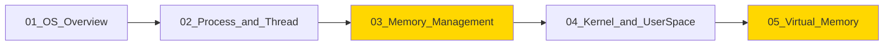

# OS Fundamentals (운영체제 기초)

운영체제의 핵심 개념을 **개발자 면접 준비 수준**으로 깊이 있게 다룹니다.

---

## 학습 목표

1. **OS의 역할 이해**: 하드웨어와 애플리케이션 사이에서 OS가 하는 일을 명확히 설명할 수 있다
2. **프로세스와 스레드 구분**: 두 개념의 차이점과 각각의 사용 시나리오를 설명할 수 있다
3. **메모리 관리 원리 파악**: 가상 메모리가 왜 필요하고 어떻게 동작하는지 설명할 수 있다
4. **커널/유저 모드 이해**: 권한 분리의 필요성과 시스템 콜의 역할을 설명할 수 있다

---

## 문서 구성

| 문서 | 주제 | 핵심 면접 질문 |
|------|------|----------------|
| [01_OS_Overview](./01_OS_Overview.md) | OS 역할과 구조 | "운영체제가 하는 일을 설명해주세요" |
| [02_Process_and_Thread](./02_Process_and_Thread.md) | 프로세스와 스레드 | "프로세스와 스레드의 차이점은?" |
| [03_Memory_Management](./03_Memory_Management.md) ⭐ | 메모리 관리 | "가상 메모리가 왜 필요한가요?" |
| [04_Kernel_and_UserSpace](./04_Kernel_and_UserSpace.md) | 커널과 유저 스페이스 | "유저 모드와 커널 모드의 차이점은?" |
| [05_Virtual_Memory](./05_Virtual_Memory.md) ⭐ | 가상 메모리와 mmap | "mmap은 어떻게 동작하나요?" |

> ⭐ 표시: 집중 학습 필요 주제

---

## 선수 지식

- 기본적인 컴퓨터 구조 (CPU, RAM, 디스크)
- C 언어 기초 (포인터, 메모리 개념)

---

## 학습 순서

1. **OS Overview**: 전체 그림 파악
2. **Process and Thread**: 실행 단위 이해
3. **Memory Management**: 메모리 추상화 개념
4. **Kernel and UserSpace**: 권한 분리 이해
5. **Virtual Memory**: mmap 등 고급 메모리 기법

---

## 연관 문서

- [04_System_Calls](../04_System_Calls/README.md): 시스템 콜 심층 학습
- [05_Go_System_Integration](../05_Go_System_Integration/README.md): Go에서의 시스템 콜 활용
