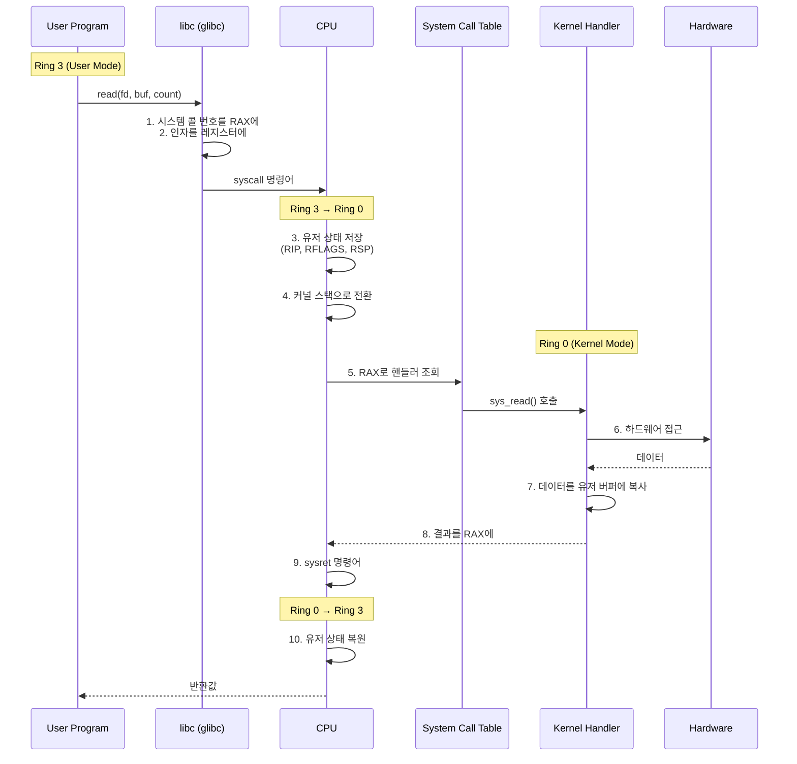
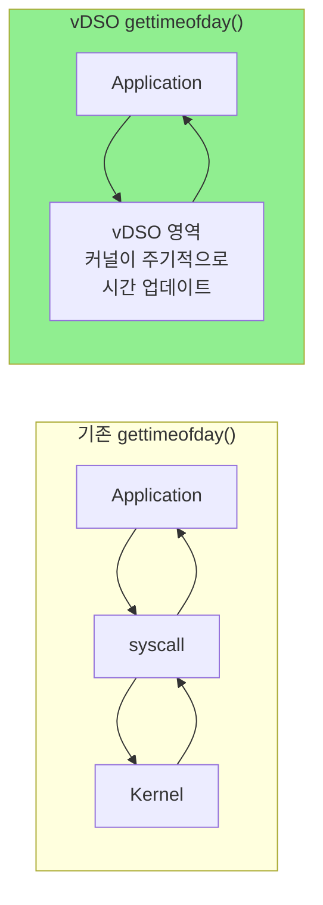

# System Call Mechanism (시스템 콜 동작 원리)

## 면접 질문
> "시스템 콜은 어떻게 동작하나요?"

---

## 시스템 콜이란?

**시스템 콜(System Call)**은 유저 프로그램이 커널 서비스를 요청하는 **인터페이스**입니다.

### 왜 필요한가?

유저 프로그램은 Ring 3에서 실행되어 직접 하드웨어에 접근할 수 없습니다.

```c
// 유저 프로그램에서 직접 할 수 없는 것들
outb(0x1F7, 0x30);         // ❌ I/O 포트 접근 - 권한 없음
*(int*)0xFFFF0000 = 1;     // ❌ 커널 메모리 접근 - Page Fault
asm("cli");                // ❌ 인터럽트 비활성화 - 권한 없음
```

대신 커널에 **요청**해야 합니다:

```c
// 시스템 콜을 통한 안전한 요청
int fd = open("/dev/sda", O_RDONLY);  // ✅ 커널이 권한 확인 후 처리
read(fd, buf, 1024);                   // ✅ 커널이 데이터 읽어서 전달
```

---

## 시스템 콜 호출 과정

### 전체 흐름



### 단계별 상세 설명

#### 1. 시스템 콜 준비 (유저 공간)

libc 래퍼 함수가 시스템 콜을 준비합니다.

```asm
; x86_64 Linux 시스템 콜 규약
; RAX: 시스템 콜 번호
; RDI: 첫 번째 인자
; RSI: 두 번째 인자
; RDX: 세 번째 인자
; R10: 네 번째 인자 (일반 함수는 RCX 사용)
; R8:  다섯 번째 인자
; R9:  여섯 번째 인자

; read(fd, buf, count) 예시
mov rax, 0      ; read의 시스템 콜 번호
mov rdi, 3      ; fd = 3
mov rsi, buf    ; 버퍼 주소
mov rdx, 1024   ; 읽을 바이트 수
syscall         ; 커널 진입
```

#### 2. 커널 진입 (syscall 명령어)

`syscall` 명령어가 실행되면 CPU가 자동으로:

1. **RIP, RFLAGS 저장**: 현재 명령어 위치와 플래그 보존
2. **권한 레벨 변경**: Ring 3 → Ring 0
3. **커널 진입점으로 점프**: MSR 레지스터에 설정된 주소로

```c
// Linux 커널의 시스템 콜 진입점 (단순화)
entry_SYSCALL_64:
    swapgs                     // GS 베이스를 커널용으로 교체
    mov [gs:cpu_tss], rsp      // 유저 스택 포인터 저장
    mov rsp, [gs:kernel_stack] // 커널 스택으로 전환

    push rcx                   // 유저 RIP (syscall이 저장한 값)
    push r11                   // 유저 RFLAGS

    call do_syscall_64         // 실제 시스템 콜 처리
```

#### 3. 시스템 콜 디스패치

RAX의 시스템 콜 번호로 핸들러를 찾습니다.

```c
// 시스템 콜 테이블 (단순화)
asmlinkage const sys_call_ptr_t sys_call_table[] = {
    [0] = sys_read,      // read
    [1] = sys_write,     // write
    [2] = sys_open,      // open
    [3] = sys_close,     // close
    // ... 약 450개의 시스템 콜
};

// 디스패치 (단순화)
long do_syscall_64(struct pt_regs *regs) {
    unsigned long nr = regs->orig_ax;  // 시스템 콜 번호

    if (nr < NR_syscalls) {
        regs->ax = sys_call_table[nr](
            regs->di, regs->si, regs->dx,
            regs->r10, regs->r8, regs->r9
        );
    }
    return regs->ax;
}
```

#### 4. 시스템 콜 핸들러 실행

```c
// sys_read 구현 (단순화)
SYSCALL_DEFINE3(read, unsigned int, fd, char __user *, buf, size_t, count)
{
    // 1. fd가 유효한지 확인
    struct file *f = fget(fd);
    if (!f)
        return -EBADF;

    // 2. 권한 확인
    if (!(f->f_mode & FMODE_READ))
        return -EBADF;

    // 3. 실제 읽기 수행
    ssize_t ret = vfs_read(f, buf, count, &f->f_pos);

    // 4. 참조 해제
    fput(f);

    return ret;
}
```

#### 5. 유저 공간 복귀

```asm
; sysret 명령어로 유저 모드 복귀
entry_SYSCALL_64_return:
    pop r11                    ; RFLAGS 복원
    pop rcx                    ; RIP 복원
    mov rsp, [gs:user_stack]   ; 유저 스택 복원
    swapgs                     ; GS 베이스 복원
    sysret                     ; Ring 0 → Ring 3
```

---

## 시스템 콜 번호 조회

```bash
# Linux에서 시스템 콜 번호 확인
$ cat /usr/include/asm/unistd_64.h | head -20
#define __NR_read 0
#define __NR_write 1
#define __NR_open 2
#define __NR_close 3
#define __NR_stat 4
...
```

### 주요 시스템 콜 번호 (x86_64 Linux)

| 번호 | 이름 | 설명 |
|------|------|------|
| 0 | read | 파일 읽기 |
| 1 | write | 파일 쓰기 |
| 2 | open | 파일 열기 |
| 3 | close | 파일 닫기 |
| 9 | mmap | 메모리 매핑 |
| 40 | sendfile | Zero-copy 파일 전송 |
| 57 | fork | 프로세스 생성 |
| 59 | execve | 프로그램 실행 |
| 60 | exit | 프로세스 종료 |

---

## 시스템 콜 호출 방식 비교

### 레거시: int 0x80

```asm
; 32비트 호환 방식
mov eax, 4      ; write 시스템 콜 번호
mov ebx, 1      ; fd = stdout
mov ecx, msg    ; 메시지 주소
mov edx, len    ; 길이
int 0x80        ; 소프트웨어 인터럽트
```

### 현대: syscall / sysret

```asm
; 64비트 최적화 방식
mov rax, 1      ; write 시스템 콜 번호
mov rdi, 1      ; fd = stdout
mov rsi, msg    ; 메시지 주소
mov rdx, len    ; 길이
syscall         ; 빠른 시스템 콜
```

| 방식 | 명령어 | 속도 | 용도 |
|------|--------|------|------|
| `int 0x80` | 소프트웨어 인터럽트 | 느림 | 32비트 호환 |
| `syscall` | 전용 명령어 | 빠름 | 64비트 표준 |
| `sysenter` | Intel 전용 | 빠름 | 32비트 최적화 |

---

## vDSO: 커널 진입 없는 시스템 콜

일부 시스템 콜은 커널 진입 없이 처리할 수 있습니다.

### vDSO (Virtual Dynamic Shared Object)

커널이 모든 프로세스에 매핑하는 특별한 공유 라이브러리입니다.



### vDSO로 제공되는 함수

| 함수 | 이유 |
|------|------|
| `gettimeofday()` | 빈번한 호출, 단순 데이터 읽기 |
| `clock_gettime()` | 시간 관련 |
| `getcpu()` | CPU 정보 |

```c
// vDSO 덕분에 실제 커널 진입 없이 빠르게 동작
struct timeval tv;
gettimeofday(&tv, NULL);  // vDSO에서 처리
```

---

## 시스템 콜 추적

### strace로 시스템 콜 확인

```bash
$ strace -c ls
% time     seconds  usecs/call     calls    errors syscall
------ ----------- ----------- --------- --------- ----------------
 25.00    0.000012           6         2           read
 18.75    0.000009           4         2           close
 18.75    0.000009           2         4           mmap
 12.50    0.000006           6         1           write
  6.25    0.000003           3         1           openat
...
```

### 특정 시스템 콜만 추적

```bash
$ strace -e read,write cat /etc/hostname
read(3, "myhost\n", 131072) = 7
write(1, "myhost\n", 7) = 7
```

---

## 시스템 콜 비용

### 오버헤드 측정

```c
#include <time.h>
#include <unistd.h>

int main() {
    struct timespec start, end;

    clock_gettime(CLOCK_MONOTONIC, &start);

    for (int i = 0; i < 1000000; i++) {
        getpid();  // 간단한 시스템 콜
    }

    clock_gettime(CLOCK_MONOTONIC, &end);

    // 약 100-500 nanoseconds per syscall
}
```

### 비용 발생 원인

| 요소 | 설명 |
|------|------|
| **모드 전환** | Ring 3 → Ring 0 → Ring 3 |
| **레지스터 저장/복원** | 유저 상태 보존 |
| **스택 전환** | 유저 스택 → 커널 스택 |
| **캐시/TLB 영향** | 잠재적 캐시 미스 |

### 최적화 전략

1. **시스템 콜 횟수 줄이기**: 버퍼링으로 한 번에 많이 처리
2. **vDSO 활용**: 가능하면 vDSO 함수 사용
3. **io_uring**: 배치 처리로 시스템 콜 횟수 감소 (Linux 5.1+)

---

## 면접 답변 예시

> **Q: 시스템 콜은 어떻게 동작하나요?**

"시스템 콜은 유저 프로그램이 커널 서비스를 요청하는 인터페이스입니다.

호출 과정은 이렇습니다:
1. 유저 프로그램이 libc 함수(예: `read()`)를 호출합니다
2. libc는 시스템 콜 번호를 RAX에, 인자를 RDI, RSI 등에 설정하고 `syscall` 명령어를 실행합니다
3. CPU가 Ring 3에서 Ring 0으로 전환하고, 유저 상태를 저장한 후 커널 진입점으로 점프합니다
4. 커널은 RAX의 번호로 시스템 콜 테이블에서 핸들러를 찾아 실행합니다
5. 핸들러가 작업을 완료하면 결과를 RAX에 저장하고 `sysret`으로 유저 모드로 복귀합니다

모드 전환에는 레지스터 저장, 스택 전환 등의 비용이 발생하므로, 시스템 콜 횟수를 줄이는 것이 성능에 중요합니다. vDSO는 일부 시스템 콜을 커널 진입 없이 처리하여 이를 최적화합니다."

---

## 핵심 정리

| 개념 | 한 줄 정의 |
|------|-----------|
| **시스템 콜** | 유저 프로그램이 커널 서비스를 요청하는 인터페이스 |
| **syscall 명령어** | x86_64에서 빠른 커널 진입을 위한 전용 명령어 |
| **시스템 콜 테이블** | 시스템 콜 번호 → 핸들러 함수 매핑 |
| **vDSO** | 커널 진입 없이 일부 시스템 콜을 처리하는 공유 라이브러리 |
| **strace** | 프로그램의 시스템 콜을 추적하는 도구 |

---

## 다음 문서

→ [02_File_IO_Syscalls](./02_File_IO_Syscalls.md): 파일 I/O 시스템 콜
