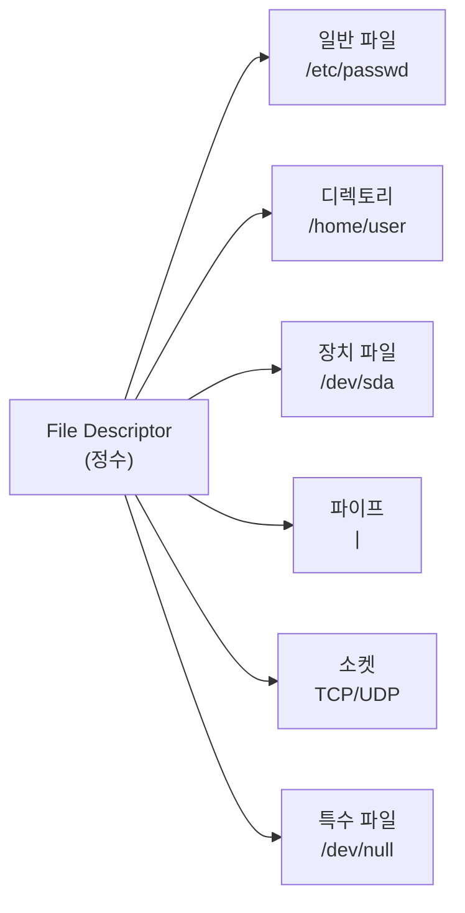
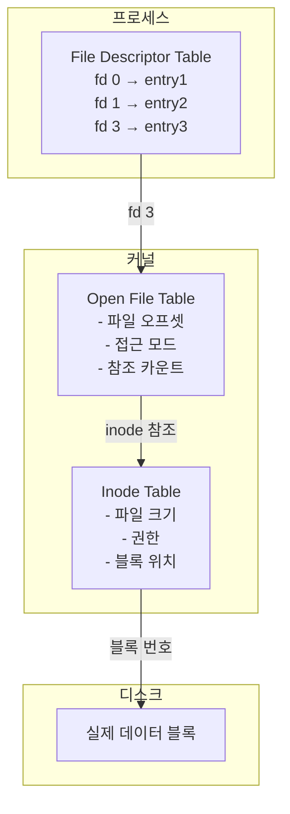
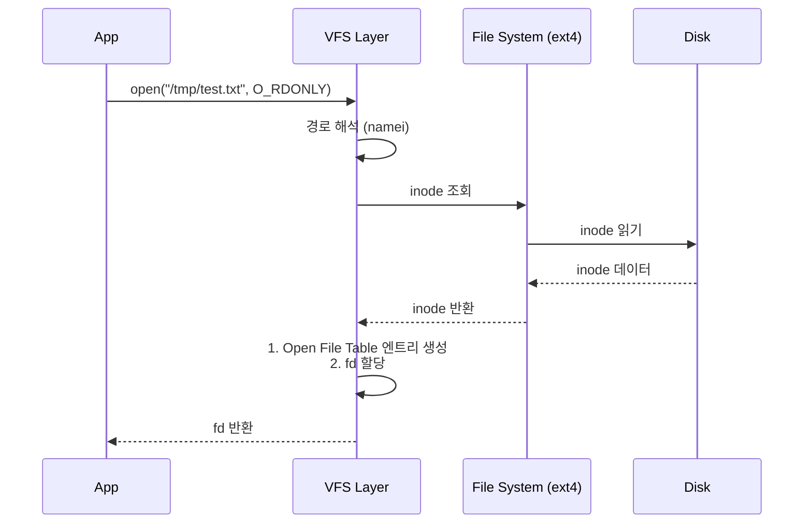
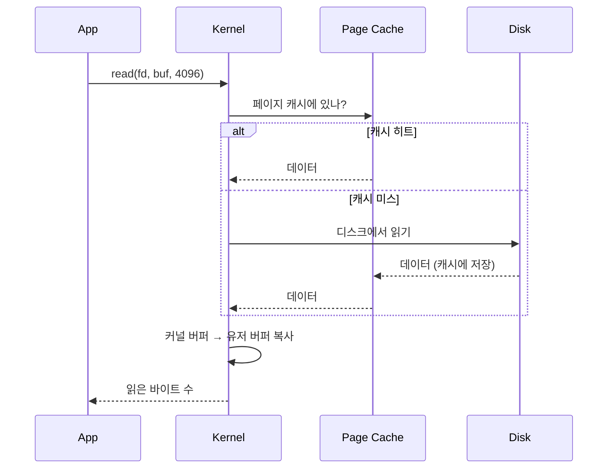
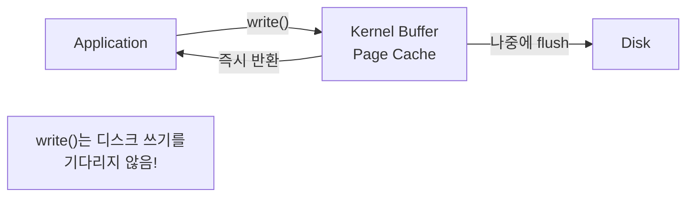
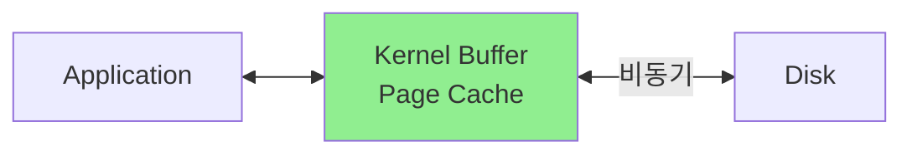

# File I/O System Calls (파일 I/O 시스템 콜)

## 면접 질문
> "파일 디스크립터란 무엇인가요?"

---

## 파일 디스크립터 (File Descriptor)

**파일 디스크립터(fd)**는 커널이 관리하는 열린 파일을 참조하는 **정수 값**입니다.

### 유닉스의 철학: "모든 것은 파일이다"



### 기본 파일 디스크립터

| fd | 이름 | 설명 |
|----|------|------|
| 0 | stdin | 표준 입력 |
| 1 | stdout | 표준 출력 |
| 2 | stderr | 표준 에러 |

```c
// 모두 같은 인터페이스로 사용
write(1, "hello", 5);  // stdout에 출력
write(2, "error", 5);  // stderr에 출력

int fd = open("/tmp/file.txt", O_WRONLY);
write(fd, "data", 4);  // 파일에 쓰기
```

---

## 파일 관련 커널 자료구조



### 세 단계 구조의 이유

1. **File Descriptor Table** (프로세스별)
   - 프로세스마다 독립적인 fd 번호 공간
   - fork() 시 자식에게 복사

2. **Open File Table** (시스템 전역)
   - 현재 파일 오프셋 관리
   - 여러 fd가 같은 엔트리를 가리킬 수 있음 (dup, fork)

3. **Inode Table** (시스템 전역)
   - 파일의 실제 메타데이터
   - 디스크 블록 위치 정보

---

## open() - 파일 열기

```c
#include <fcntl.h>

int open(const char *pathname, int flags);
int open(const char *pathname, int flags, mode_t mode);
```

### 플래그

| 플래그 | 설명 |
|--------|------|
| `O_RDONLY` | 읽기 전용 |
| `O_WRONLY` | 쓰기 전용 |
| `O_RDWR` | 읽기/쓰기 |
| `O_CREAT` | 없으면 생성 |
| `O_TRUNC` | 기존 내용 삭제 |
| `O_APPEND` | 끝에 추가 |
| `O_NONBLOCK` | 논블로킹 모드 |
| `O_SYNC` | 동기 쓰기 (fsync 효과) |
| `O_DIRECT` | 버퍼 캐시 우회 |

### 예제

```c
// 파일 생성 및 쓰기
int fd = open("/tmp/test.txt", O_WRONLY | O_CREAT | O_TRUNC, 0644);
if (fd < 0) {
    perror("open failed");
    return -1;
}
// 0644 = rw-r--r--
```

### 커널 내부 동작



---

## read() - 파일 읽기

```c
#include <unistd.h>

ssize_t read(int fd, void *buf, size_t count);
```

### 반환값

| 값 | 의미 |
|----|------|
| > 0 | 읽은 바이트 수 |
| 0 | EOF (파일 끝) |
| -1 | 에러 (errno 설정) |

### 주의사항: 부분 읽기

```c
// read()는 요청한 것보다 적게 읽을 수 있다!
char buf[1024];
ssize_t n = read(fd, buf, 1024);
// n이 1024보다 작을 수 있음

// 올바른 방법: 전체를 읽을 때까지 반복
ssize_t read_all(int fd, void *buf, size_t count) {
    size_t total = 0;
    while (total < count) {
        ssize_t n = read(fd, buf + total, count - total);
        if (n <= 0) return n;
        total += n;
    }
    return total;
}
```

### 커널 내부 동작



---

## write() - 파일 쓰기

```c
#include <unistd.h>

ssize_t write(int fd, const void *buf, size_t count);
```

### 쓰기 버퍼링



### O_SYNC vs fsync()

```c
// 방법 1: O_SYNC - 매 write마다 디스크 동기화 (느림)
int fd = open("file", O_WRONLY | O_SYNC);
write(fd, data, len);  // 디스크 쓰기 완료까지 블록

// 방법 2: fsync() - 필요할 때만 동기화 (권장)
int fd = open("file", O_WRONLY);
write(fd, data, len);  // 빠른 반환
fsync(fd);             // 명시적으로 디스크 동기화
```

---

## close() - 파일 닫기

```c
#include <unistd.h>

int close(int fd);
```

### close()가 하는 일

1. Open File Table 엔트리의 참조 카운트 감소
2. 참조 카운트가 0이면:
   - 버퍼 플러시
   - 엔트리 해제
3. File Descriptor Table에서 fd 해제

### fd 누수 문제

```c
// ❌ 잘못된 코드: fd 누수
void bad_function() {
    int fd = open("/tmp/file", O_RDONLY);
    // ... 작업 ...
    return;  // close 누락!
}

// ✅ 올바른 코드
void good_function() {
    int fd = open("/tmp/file", O_RDONLY);
    if (fd < 0) return;

    // ... 작업 ...

    close(fd);  // 항상 close
}
```

---

## lseek() - 파일 위치 이동

```c
#include <unistd.h>

off_t lseek(int fd, off_t offset, int whence);
```

### whence 값

| 값 | 의미 |
|----|------|
| `SEEK_SET` | 파일 시작 기준 |
| `SEEK_CUR` | 현재 위치 기준 |
| `SEEK_END` | 파일 끝 기준 |

### 예제

```c
// 파일 크기 구하기
off_t size = lseek(fd, 0, SEEK_END);

// 처음으로 돌아가기
lseek(fd, 0, SEEK_SET);

// 현재 위치에서 100바이트 앞으로
lseek(fd, 100, SEEK_CUR);
```

---

## pread() / pwrite() - 원자적 위치 지정 I/O

```c
ssize_t pread(int fd, void *buf, size_t count, off_t offset);
ssize_t pwrite(int fd, const void *buf, size_t count, off_t offset);
```

### lseek + read vs pread

```c
// 방법 1: lseek + read (두 시스템 콜, 레이스 조건 가능)
lseek(fd, 1000, SEEK_SET);
read(fd, buf, 100);

// 방법 2: pread (한 시스템 콜, 원자적, 파일 오프셋 변경 안 함)
pread(fd, buf, 100, 1000);
```

**pread의 장점**:
- 한 번의 시스템 콜
- 멀티스레드에서 안전 (파일 오프셋을 변경하지 않음)

---

## Buffered I/O vs Direct I/O

### Page Cache (Buffered I/O)



**장점**: 캐시 히트 시 빠름, 읽기 최적화 (Read-ahead)
**단점**: 데이터 복사 오버헤드, 메모리 사용

### Direct I/O

```c
int fd = open("file", O_RDWR | O_DIRECT);
// 버퍼는 메모리 정렬 필요 (512 또는 4096 바이트)
void *buf;
posix_memalign(&buf, 4096, 4096);
read(fd, buf, 4096);
```


**장점**: 페이지 캐시 우회, 데이터베이스처럼 자체 캐시가 있을 때 유용
**단점**: 정렬 제약, Read-ahead 없음

---

## 에러 처리

### errno 확인

```c
#include <errno.h>
#include <string.h>

int fd = open("/nonexistent", O_RDONLY);
if (fd < 0) {
    printf("Error: %s\n", strerror(errno));
    // 또는
    perror("open failed");
}
```

### 주요 errno 값

| errno | 의미 |
|-------|------|
| `ENOENT` | 파일이 존재하지 않음 |
| `EACCES` | 권한 없음 |
| `EBADF` | 잘못된 fd |
| `EINTR` | 시그널에 의해 중단됨 |
| `EIO` | I/O 에러 |
| `EAGAIN` | 리소스 일시적 불가 (논블로킹) |

---

## 면접 답변 예시

> **Q: 파일 디스크립터란 무엇인가요?**

"파일 디스크립터는 커널이 관리하는 열린 파일을 참조하는 정수 값입니다.

유닉스에서는 '모든 것이 파일'이라는 철학에 따라 일반 파일, 소켓, 파이프, 장치 등을 모두 동일한 인터페이스(read, write, close)로 다룹니다. fd는 이 추상화의 핵심입니다.

내부적으로 세 단계 구조를 가집니다:
1. **File Descriptor Table**: 프로세스별로 fd → Open File Table 엔트리 매핑
2. **Open File Table**: 현재 오프셋, 접근 모드 등 세션 정보
3. **Inode Table**: 파일의 실제 메타데이터와 블록 위치

이 구조 덕분에 fork() 시 자식이 부모의 fd를 상속받고, dup()으로 같은 파일을 여러 fd로 참조할 수 있습니다."

---

## 핵심 정리

| 개념 | 한 줄 정의 |
|------|-----------|
| **파일 디스크립터** | 열린 파일을 참조하는 정수 값 |
| **Page Cache** | 커널이 관리하는 디스크 데이터 캐시 |
| **O_DIRECT** | Page Cache를 우회하여 디스크에 직접 접근 |
| **pread/pwrite** | 파일 오프셋을 변경하지 않는 원자적 I/O |
| **fsync** | 버퍼의 데이터를 디스크에 동기화 |

---

## 다음 문서

→ [03_Sendfile_ZeroCopy](./03_Sendfile_ZeroCopy.md): sendfile과 Zero-copy
