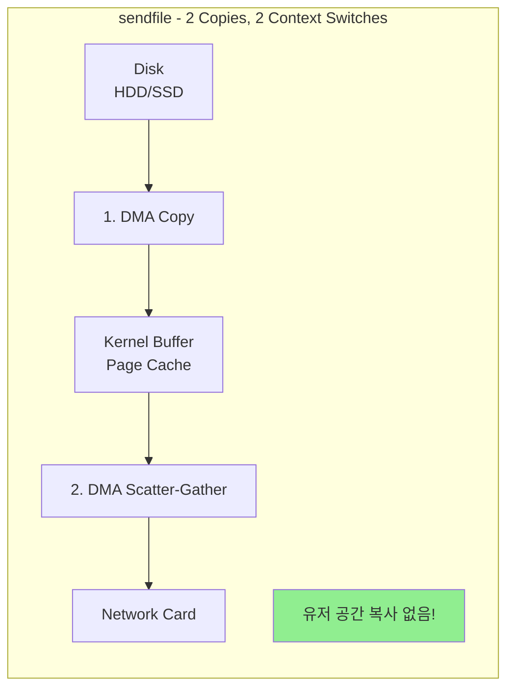
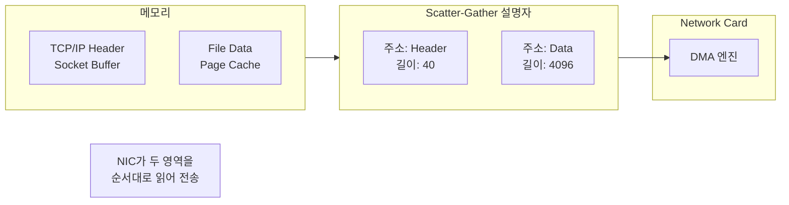
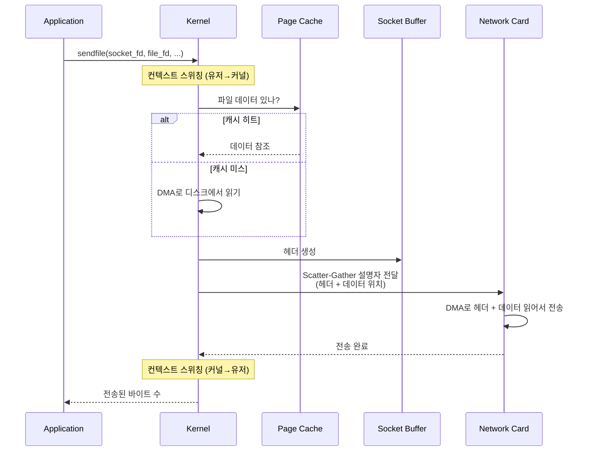
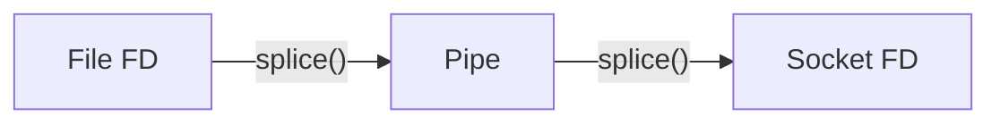
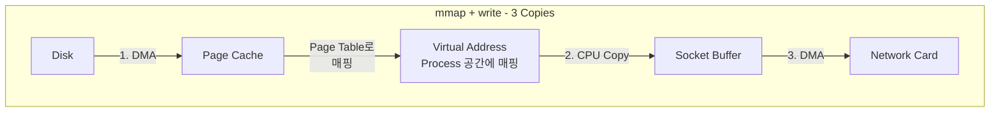

# Sendfile and Zero-Copy (sendfile과 Zero-copy) ⭐⭐

## 면접 질문
> "Zero-copy가 왜 필요하고 어떻게 동작하나요?"

---

## 전통적인 파일 전송의 문제점

웹 서버가 정적 파일(이미지, 동영상)을 클라이언트에게 전송하는 상황을 생각해봅시다.

### 전통적인 방식

```c
char buf[4096];
int file_fd = open("video.mp4", O_RDONLY);
int socket_fd = accept(server_fd, ...);

while ((n = read(file_fd, buf, sizeof(buf))) > 0) {
    write(socket_fd, buf, n);
}
```

### 문제: 4번의 데이터 복사

```mermaid
flowchart TB
    subgraph Traditional["전통적인 방식 - 4 Copies, 4 Context Switches"]
        direction TB

        Disk[Disk<br/>HDD/SSD]
        DMA1["1. DMA Copy"]
        KC[Kernel Buffer<br/>Page Cache]
        CPU1["2. CPU Copy"]
        UB[User Buffer<br/>char buf[4096]]
        CPU2["3. CPU Copy"]
        SB[Socket Buffer]
        DMA2["4. DMA Copy"]
        NIC[Network Card]

        Disk --> DMA1 --> KC
        KC --> CPU1 --> UB
        UB --> CPU2 --> SB
        SB --> DMA2 --> NIC
    end

    Note1["read(): 컨텍스트 스위칭 2회<br/>커널→유저 데이터 복사 1회"]
    Note2["write(): 컨텍스트 스위칭 2회<br/>유저→커널 데이터 복사 1회"]
```

### 비효율성 분석

| 구분 | 횟수 |
|------|------|
| **컨텍스트 스위칭** | 4회 (read 진입/복귀, write 진입/복귀) |
| **CPU 복사** | 2회 (커널→유저, 유저→커널) |
| **DMA 복사** | 2회 (디스크→커널, 커널→NIC) |

**CPU가 데이터 복사에 시간을 소비**하고, **메모리 대역폭을 낭비**합니다.

---

## Zero-Copy란?

**Zero-Copy**는 CPU가 데이터를 복사하지 않고, DMA(Direct Memory Access)만으로 데이터를 전송하는 기법입니다.

### 핵심 아이디어

```
"유저 공간을 거치지 않고, 커널 내에서 직접 전송하면 되지 않나?"
```

---

## sendfile() 시스템 콜

```c
#include <sys/sendfile.h>

ssize_t sendfile(int out_fd, int in_fd, off_t *offset, size_t count);
```

### 사용 예제

```c
int file_fd = open("video.mp4", O_RDONLY);
int socket_fd = accept(server_fd, ...);

struct stat sb;
fstat(file_fd, &sb);

// 한 번의 시스템 콜로 파일 전송
sendfile(socket_fd, file_fd, NULL, sb.st_size);
```

### sendfile의 동작



### 성능 비교

| 항목 | 전통 방식 | sendfile |
|------|----------|----------|
| **컨텍스트 스위칭** | 4회 | 2회 |
| **CPU 복사** | 2회 | 0회 (또는 1회*) |
| **DMA 복사** | 2회 | 2회 |
| **시스템 콜** | 많음 (루프) | 1회 |

> *하드웨어가 Scatter-Gather DMA를 지원하지 않으면 커널 내 1회 복사 발생

---

## 상세 동작 원리

### Scatter-Gather DMA

NIC가 불연속적인 메모리 영역의 데이터를 한 번에 전송하는 기능입니다.



### sendfile 시퀀스



---

## splice()와 tee()

sendfile보다 더 유연한 Zero-copy 시스템 콜입니다.

### splice()

파이프를 이용하여 두 파일 디스크립터 사이에서 데이터를 이동합니다.

```c
#include <fcntl.h>

ssize_t splice(int fd_in, off_t *off_in,
               int fd_out, off_t *off_out,
               size_t len, unsigned int flags);
```



### tee()

파이프의 데이터를 다른 파이프로 복사 (Zero-copy).

```c
ssize_t tee(int fd_in, int fd_out, size_t len, unsigned int flags);
```

### splice 예제: 파일 → 소켓

```c
int pipefd[2];
pipe(pipefd);

// 파일 → 파이프 (Zero-copy)
splice(file_fd, NULL, pipefd[1], NULL, 4096, SPLICE_F_MOVE);

// 파이프 → 소켓 (Zero-copy)
splice(pipefd[0], NULL, socket_fd, NULL, 4096, SPLICE_F_MOVE);
```

### sendfile vs splice

| 특성 | sendfile | splice |
|------|----------|--------|
| **대상** | 파일 → 소켓 | 아무 fd → 아무 fd |
| **유연성** | 제한적 | 높음 |
| **파이프 필요** | 아니오 | 예 |
| **사용 사례** | 정적 파일 서빙 | 프록시, 파이프라인 |

---

## mmap + write vs sendfile

### mmap + write 방식

```c
char *data = mmap(NULL, file_size, PROT_READ, MAP_PRIVATE, file_fd, 0);
write(socket_fd, data, file_size);
munmap(data, file_size);
```



### 비교

| 방식 | CPU 복사 | 장점 | 단점 |
|------|----------|------|------|
| **read + write** | 2회 | 단순 | 비효율적 |
| **mmap + write** | 1회 | 랜덤 접근 가능 | TLB 미스, Minor Page Fault |
| **sendfile** | 0회 | 최고 효율 | 파일→소켓만 가능 |

---

## 실제 사용 사례

### Nginx

```nginx
# nginx.conf
sendfile on;
tcp_nopush on;  # sendfile과 함께 사용, 헤더와 데이터를 한 패킷에
```

Nginx는 정적 파일 서빙에 sendfile을 사용하여 고성능을 달성합니다.

### Apache Kafka

Kafka는 메시지 전송에 sendfile을 사용합니다.

```
Consumer Request → Broker
Broker: sendfile(network_socket, log_segment_file, offset, length)
→ 로그 파일에서 네트워크로 Zero-copy 전송
```

### Java NIO FileChannel.transferTo()

```java
FileChannel fileChannel = FileChannel.open(path, READ);
SocketChannel socketChannel = SocketChannel.open(address);

// 내부적으로 sendfile 사용
fileChannel.transferTo(0, fileChannel.size(), socketChannel);
```

---

## 성능 측정

### 벤치마크 예제

```c
#include <time.h>

void benchmark_traditional(int file_fd, int socket_fd, size_t size) {
    char buf[4096];
    struct timespec start, end;

    clock_gettime(CLOCK_MONOTONIC, &start);

    while (size > 0) {
        ssize_t n = read(file_fd, buf, sizeof(buf));
        write(socket_fd, buf, n);
        size -= n;
    }

    clock_gettime(CLOCK_MONOTONIC, &end);
    // 시간 측정
}

void benchmark_sendfile(int file_fd, int socket_fd, size_t size) {
    struct timespec start, end;

    clock_gettime(CLOCK_MONOTONIC, &start);

    sendfile(socket_fd, file_fd, NULL, size);

    clock_gettime(CLOCK_MONOTONIC, &end);
    // 시간 측정
}
```

### 일반적인 성능 향상

| 파일 크기 | 전통 방식 | sendfile | 향상 |
|----------|----------|----------|------|
| 1 MB | 2ms | 0.8ms | 2.5x |
| 100 MB | 150ms | 60ms | 2.5x |
| 1 GB | 1500ms | 500ms | 3x |

> 실제 향상 폭은 하드웨어, 네트워크 속도, 캐시 상태에 따라 다름

---

## Linux에서의 제한 사항

### sendfile 제한

1. **out_fd는 소켓이어야 함** (Linux 2.6.33 이전)
   - Linux 2.6.33+: 아무 fd 가능
2. **in_fd는 mmap 가능해야 함** (일반 파일, 블록 장치)
   - 소켓, 파이프는 불가

### 대안: io_uring (Linux 5.1+)

```c
// io_uring을 사용한 Zero-copy (더 현대적인 방식)
struct io_uring ring;
io_uring_queue_init(32, &ring, 0);

struct io_uring_sqe *sqe = io_uring_get_sqe(&ring);
io_uring_prep_splice(sqe, file_fd, 0, socket_fd, -1, len, 0);
io_uring_submit(&ring);
```

---

## 면접 답변 예시

> **Q: Zero-copy가 왜 필요하고 어떻게 동작하나요?**

"전통적인 파일 전송(read + write)은 데이터가 **4번 복사**됩니다:
1. 디스크 → 커널 버퍼 (DMA)
2. 커널 버퍼 → 유저 버퍼 (CPU)
3. 유저 버퍼 → 소켓 버퍼 (CPU)
4. 소켓 버퍼 → NIC (DMA)

CPU가 2번 복사하고, 컨텍스트 스위칭도 4번 발생합니다. 대용량 파일 전송 시 CPU와 메모리 대역폭을 낭비하게 됩니다.

**sendfile**은 유저 공간을 거치지 않고 커널 내에서 직접 전송합니다:
1. 디스크 → Page Cache (DMA)
2. Page Cache → NIC (DMA, Scatter-Gather)

CPU 복사가 0회, 컨텍스트 스위칭도 2회로 줄어듭니다. Nginx, Kafka 같은 고성능 서버가 이 기법을 사용합니다.

Scatter-Gather DMA 덕분에 NIC가 TCP 헤더(소켓 버퍼)와 파일 데이터(Page Cache)를 불연속 메모리에서 한 번에 읽어 전송할 수 있습니다."

---

## 핵심 정리

| 개념 | 한 줄 정의 |
|------|-----------|
| **Zero-Copy** | CPU 복사 없이 DMA만으로 데이터를 전송하는 기법 |
| **sendfile** | 파일에서 소켓으로 커널 내 직접 전송하는 시스템 콜 |
| **splice** | 파이프를 통해 fd 간 Zero-copy 이동 |
| **Scatter-Gather DMA** | 불연속 메모리를 한 번에 전송하는 DMA 기능 |
| **DMA** | CPU 개입 없이 메모리↔장치 간 데이터 전송 |

---

## 다음 문서

→ [04_Network_Syscalls](./04_Network_Syscalls.md): 네트워크 시스템 콜
