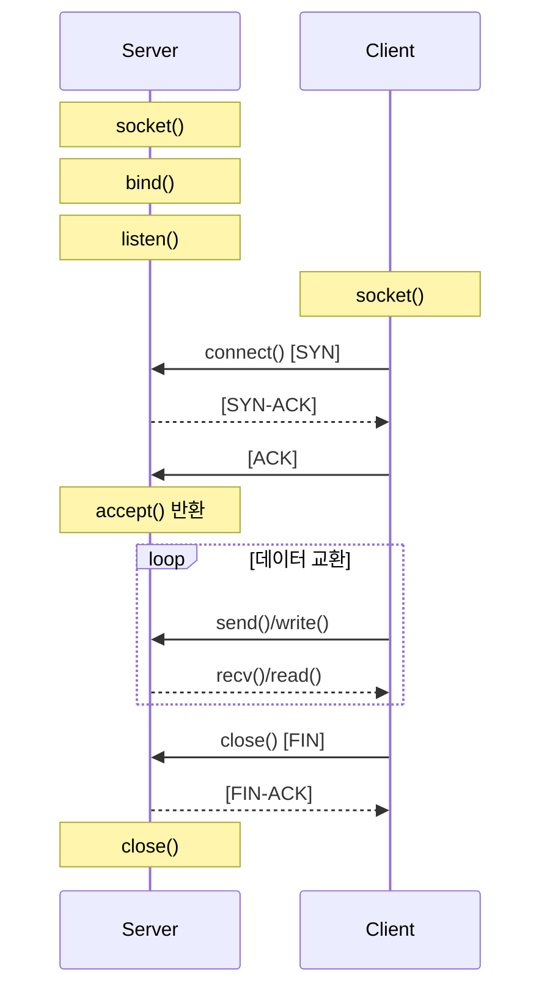
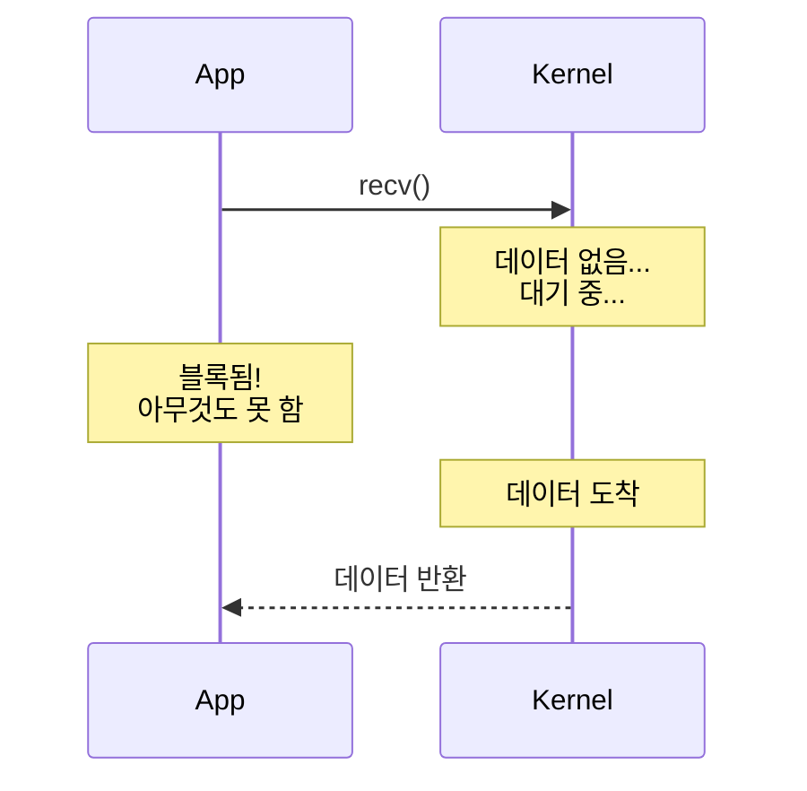
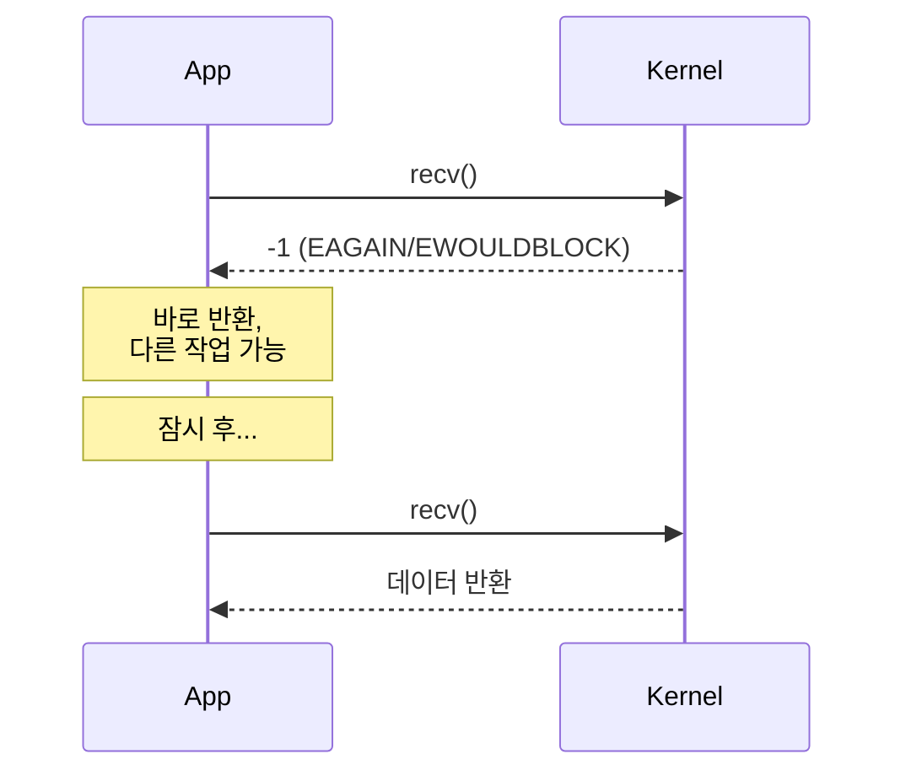
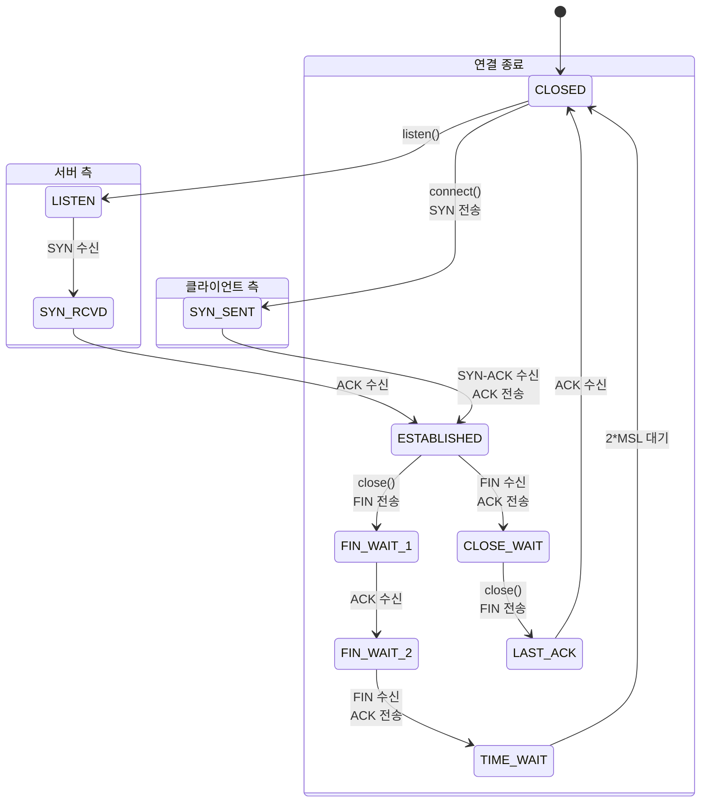
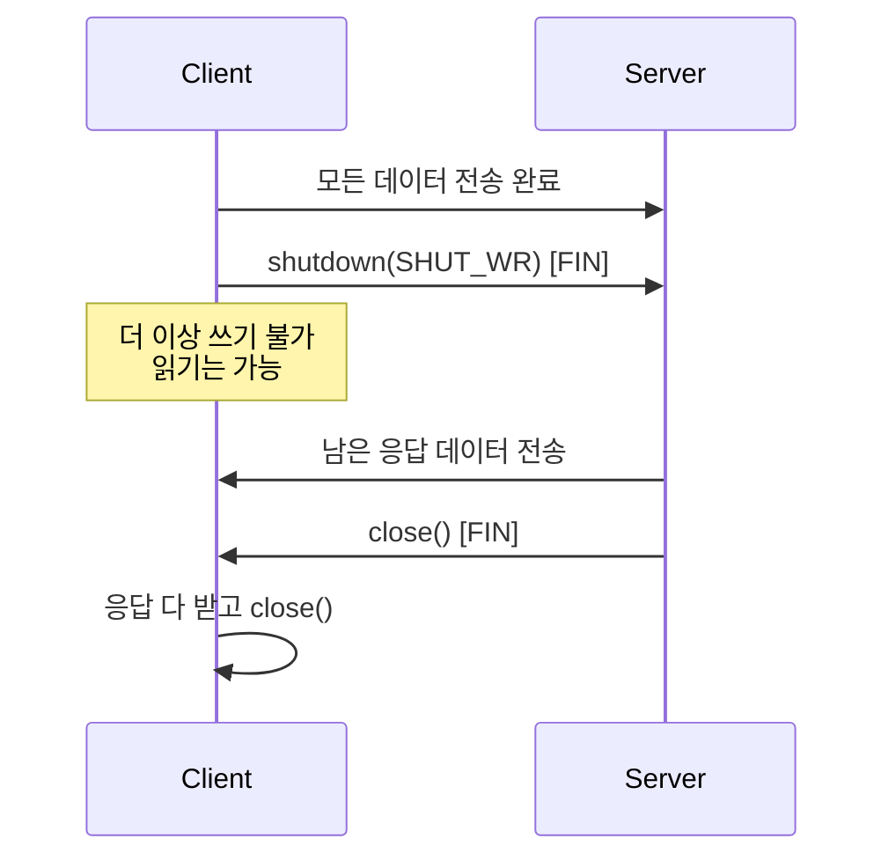

# Network System Calls (네트워크 시스템 콜)

## 면접 질문
> "TCP 소켓 통신 과정을 설명해주세요"

---

## 소켓이란?

**소켓(Socket)**은 네트워크 통신의 끝점(endpoint)을 추상화한 인터페이스입니다.

### 소켓의 특성

- 파일 디스크립터로 관리됨 (read, write, close 사용 가능)
- 프로토콜 독립적인 API 제공
- TCP, UDP, Unix Domain Socket 등 지원

---

## TCP 서버-클라이언트 통신 흐름



---

## 핵심 소켓 시스템 콜

### socket() - 소켓 생성

```c
#include <sys/socket.h>

int socket(int domain, int type, int protocol);
```

| 매개변수 | 설명 | 예시 |
|----------|------|------|
| **domain** | 프로토콜 패밀리 | AF_INET (IPv4), AF_INET6 (IPv6), AF_UNIX |
| **type** | 소켓 타입 | SOCK_STREAM (TCP), SOCK_DGRAM (UDP) |
| **protocol** | 프로토콜 | 보통 0 (자동 선택) |

```c
// TCP 소켓 생성
int sock_fd = socket(AF_INET, SOCK_STREAM, 0);

// UDP 소켓 생성
int udp_fd = socket(AF_INET, SOCK_DGRAM, 0);

// Unix Domain Socket
int unix_fd = socket(AF_UNIX, SOCK_STREAM, 0);
```

### bind() - 주소 바인딩

```c
int bind(int sockfd, const struct sockaddr *addr, socklen_t addrlen);
```

```c
struct sockaddr_in addr;
addr.sin_family = AF_INET;
addr.sin_port = htons(8080);           // 포트 8080
addr.sin_addr.s_addr = INADDR_ANY;     // 모든 인터페이스

bind(sock_fd, (struct sockaddr *)&addr, sizeof(addr));
```

### listen() - 연결 대기

```c
int listen(int sockfd, int backlog);
```

- **backlog**: 대기 큐의 최대 크기 (pending connections)

```c
listen(sock_fd, 128);  // 최대 128개의 대기 연결
```

### accept() - 연결 수락

```c
int accept(int sockfd, struct sockaddr *addr, socklen_t *addrlen);
```

- **블로킹**: 연결 요청이 올 때까지 대기
- **반환**: 새로운 소켓 fd (이 fd로 클라이언트와 통신)

```c
struct sockaddr_in client_addr;
socklen_t client_len = sizeof(client_addr);

// 블로킹: 클라이언트 연결까지 대기
int client_fd = accept(sock_fd, (struct sockaddr *)&client_addr, &client_len);
```

### connect() - 서버 연결

```c
int connect(int sockfd, const struct sockaddr *addr, socklen_t addrlen);
```

```c
struct sockaddr_in server_addr;
server_addr.sin_family = AF_INET;
server_addr.sin_port = htons(8080);
inet_pton(AF_INET, "192.168.1.1", &server_addr.sin_addr);

connect(sock_fd, (struct sockaddr *)&server_addr, sizeof(server_addr));
```

---

## 데이터 송수신

### send() / recv()

```c
ssize_t send(int sockfd, const void *buf, size_t len, int flags);
ssize_t recv(int sockfd, void *buf, size_t len, int flags);
```

### flags 옵션

| 플래그 | 설명 |
|--------|------|
| `MSG_DONTWAIT` | 논블로킹 |
| `MSG_PEEK` | 데이터를 버퍼에서 제거하지 않고 읽기 |
| `MSG_WAITALL` | 요청한 만큼 전부 받을 때까지 대기 |

### write() / read()와의 차이

```c
// 동일하게 동작
send(fd, buf, len, 0);
write(fd, buf, len);

recv(fd, buf, len, 0);
read(fd, buf, len);
```

send/recv는 소켓 전용 옵션(flags)을 지원한다는 점만 다릅니다.

---

## 완전한 TCP 서버 예제

```c
#include <sys/socket.h>
#include <netinet/in.h>
#include <unistd.h>
#include <string.h>

int main() {
    // 1. 소켓 생성
    int server_fd = socket(AF_INET, SOCK_STREAM, 0);

    // SO_REUSEADDR 설정 (재시작 시 "Address already in use" 방지)
    int opt = 1;
    setsockopt(server_fd, SOL_SOCKET, SO_REUSEADDR, &opt, sizeof(opt));

    // 2. 주소 바인딩
    struct sockaddr_in addr = {
        .sin_family = AF_INET,
        .sin_port = htons(8080),
        .sin_addr.s_addr = INADDR_ANY
    };
    bind(server_fd, (struct sockaddr *)&addr, sizeof(addr));

    // 3. 연결 대기
    listen(server_fd, 128);

    // 4. 클라이언트 처리 루프
    while (1) {
        struct sockaddr_in client_addr;
        socklen_t client_len = sizeof(client_addr);

        // 연결 수락 (블로킹)
        int client_fd = accept(server_fd,
                              (struct sockaddr *)&client_addr,
                              &client_len);

        // 데이터 읽기
        char buf[1024];
        ssize_t n = recv(client_fd, buf, sizeof(buf), 0);

        // 에코
        send(client_fd, buf, n, 0);

        close(client_fd);
    }

    close(server_fd);
    return 0;
}
```

---

## 블로킹 vs 논블로킹 I/O

### 블로킹 I/O (기본)



### 논블로킹 I/O

```c
// 소켓을 논블로킹으로 설정
int flags = fcntl(sock_fd, F_GETFL, 0);
fcntl(sock_fd, F_SETFL, flags | O_NONBLOCK);

// 또는 소켓 생성 시
int sock_fd = socket(AF_INET, SOCK_STREAM | SOCK_NONBLOCK, 0);
```



```c
ssize_t n = recv(sock_fd, buf, sizeof(buf), 0);
if (n < 0) {
    if (errno == EAGAIN || errno == EWOULDBLOCK) {
        // 데이터 없음 - 나중에 다시 시도
    } else {
        // 실제 에러
    }
}
```

---

## 소켓 옵션

### setsockopt() / getsockopt()

```c
int setsockopt(int sockfd, int level, int optname,
               const void *optval, socklen_t optlen);
```

### 주요 옵션

| 옵션 | 레벨 | 설명 |
|------|------|------|
| `SO_REUSEADDR` | SOL_SOCKET | 주소 재사용 (TIME_WAIT 무시) |
| `SO_KEEPALIVE` | SOL_SOCKET | 연결 유지 확인 |
| `SO_RCVBUF` | SOL_SOCKET | 수신 버퍼 크기 |
| `SO_SNDBUF` | SOL_SOCKET | 송신 버퍼 크기 |
| `TCP_NODELAY` | IPPROTO_TCP | Nagle 알고리즘 비활성화 |
| `TCP_CORK` | IPPROTO_TCP | 데이터 모아서 전송 |

```c
// Nagle 비활성화 (저지연 필요 시)
int flag = 1;
setsockopt(sock_fd, IPPROTO_TCP, TCP_NODELAY, &flag, sizeof(flag));

// 수신 버퍼 크기 증가
int buf_size = 1024 * 1024;  // 1MB
setsockopt(sock_fd, SOL_SOCKET, SO_RCVBUF, &buf_size, sizeof(buf_size));
```

---

## TCP 상태 전이



### TIME_WAIT

- **목적**: 지연된 패킷이 새 연결에 영향 주지 않도록
- **지속 시간**: 2 * MSL (보통 60초)
- **SO_REUSEADDR**: TIME_WAIT 상태에서도 바인딩 허용

---

## UDP 통신

### TCP와의 차이

| 특성 | TCP | UDP |
|------|-----|-----|
| 연결 | 연결 지향 | 비연결 |
| 신뢰성 | 보장 | 보장 안 함 |
| 순서 | 보장 | 보장 안 함 |
| 시스템 콜 | connect, accept | sendto, recvfrom |

### UDP 서버 예제

```c
int sock_fd = socket(AF_INET, SOCK_DGRAM, 0);

struct sockaddr_in addr = {
    .sin_family = AF_INET,
    .sin_port = htons(8080),
    .sin_addr.s_addr = INADDR_ANY
};
bind(sock_fd, (struct sockaddr *)&addr, sizeof(addr));

char buf[1024];
struct sockaddr_in client_addr;
socklen_t client_len = sizeof(client_addr);

// 데이터 수신 (발신자 주소도 받음)
ssize_t n = recvfrom(sock_fd, buf, sizeof(buf), 0,
                     (struct sockaddr *)&client_addr, &client_len);

// 응답 전송
sendto(sock_fd, buf, n, 0,
       (struct sockaddr *)&client_addr, client_len);
```

---

## shutdown() vs close()

```c
int shutdown(int sockfd, int how);
// how: SHUT_RD, SHUT_WR, SHUT_RDWR

int close(int sockfd);
```

| 함수 | 동작 |
|------|------|
| `shutdown(SHUT_WR)` | 쓰기만 종료 (FIN 전송), 읽기는 계속 가능 |
| `shutdown(SHUT_RD)` | 읽기만 종료 |
| `close()` | 완전히 닫음, fd 해제 |

### Half-close 시나리오



---

## 면접 답변 예시

> **Q: TCP 소켓 통신 과정을 설명해주세요**

"TCP 소켓 통신은 서버와 클라이언트로 나뉩니다.

**서버 측**:
1. `socket()`으로 소켓 생성
2. `bind()`로 IP:포트에 바인딩
3. `listen()`으로 연결 대기 상태로 전환
4. `accept()`로 클라이언트 연결을 수락하여 새 소켓 fd 획득

**클라이언트 측**:
1. `socket()`으로 소켓 생성
2. `connect()`로 서버에 연결 (3-way handshake 발생)

이후 양쪽 모두 `read()`/`write()` 또는 `recv()`/`send()`로 데이터를 교환하고, 종료 시 `close()`로 연결을 해제합니다 (4-way handshake).

TCP는 연결 지향적이고 신뢰성을 보장합니다. 반면 UDP는 `connect()`/`accept()` 없이 `sendto()`/`recvfrom()`으로 바로 통신하며, 신뢰성을 보장하지 않습니다."

---

## 핵심 정리

| 개념 | 한 줄 정의 |
|------|-----------|
| **socket** | 네트워크 통신의 끝점을 나타내는 파일 디스크립터 |
| **bind** | 소켓에 IP 주소와 포트를 할당 |
| **listen** | 소켓을 연결 대기(passive) 상태로 전환 |
| **accept** | 대기 중인 연결 요청을 수락하여 새 소켓 생성 |
| **connect** | 서버에 연결 요청 (TCP handshake 시작) |

---

## 다음 문서

→ [05_IO_Multiplexing](./05_IO_Multiplexing.md): I/O 멀티플렉싱 (select, poll, epoll)
