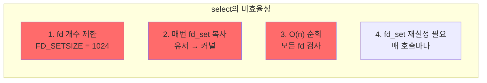
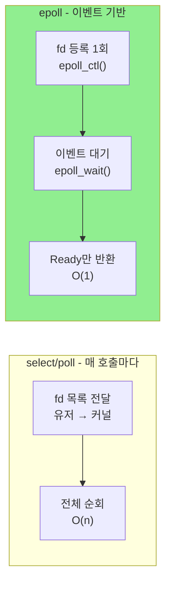
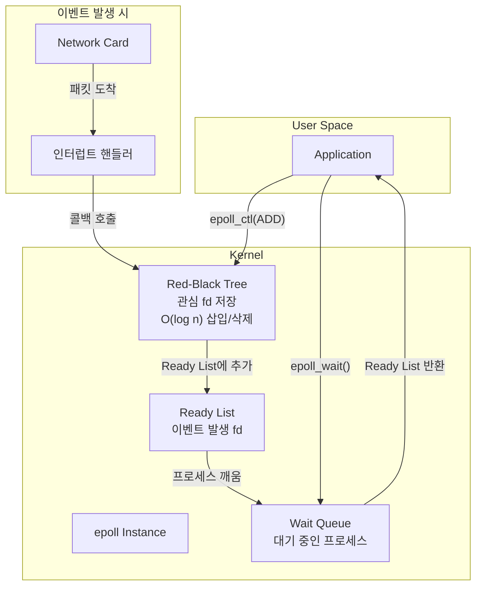
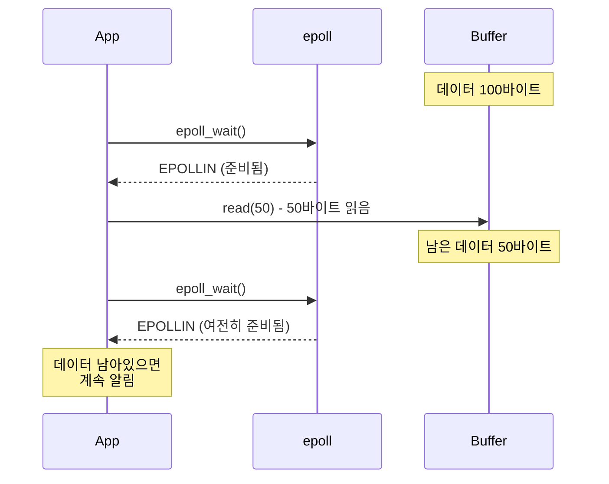
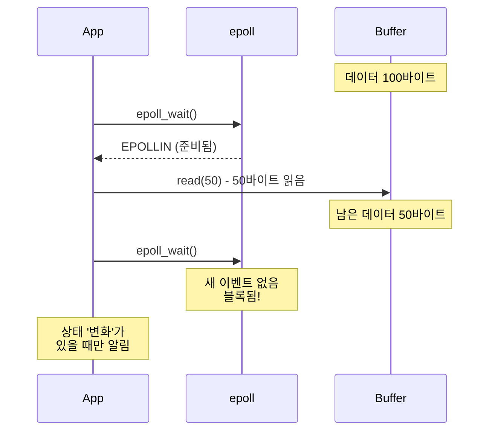

# I/O Multiplexing (I/O 멀티플렉싱) ⭐⭐

## 면접 질문
> "select, poll, epoll의 차이점은?"

---

## I/O 멀티플렉싱이 필요한 이유

### 문제: 많은 클라이언트 동시 처리

웹 서버가 10,000개의 클라이언트 연결을 처리해야 한다면?

### 방법 1: 클라이언트당 스레드 (비효율적)

```c
while (1) {
    int client_fd = accept(server_fd, ...);
    pthread_create(&thread, NULL, handle_client, client_fd);
}
```

**문제점**:
- 스레드 생성/소멸 비용
- 스레드당 스택 메모리 (기본 8MB)
- 10,000개 스레드 = 80GB 메모리!
- 컨텍스트 스위칭 오버헤드

### 방법 2: I/O 멀티플렉싱 (효율적)

```c
// 하나의 스레드에서 모든 연결 감시
while (1) {
    ready_fds = wait_for_events(all_client_fds);
    for (fd in ready_fds) {
        handle(fd);  // 논블로킹 처리
    }
}
```

**장점**:
- 하나 (또는 소수)의 스레드로 수천 연결 처리
- 메모리 효율적
- 컨텍스트 스위칭 최소화

---

## select()

가장 오래된 I/O 멀티플렉싱 API입니다 (POSIX 표준).

### API

```c
#include <sys/select.h>

int select(int nfds, fd_set *readfds, fd_set *writefds,
           fd_set *exceptfds, struct timeval *timeout);

// fd_set 조작 매크로
FD_ZERO(&set);      // 초기화
FD_SET(fd, &set);   // fd 추가
FD_CLR(fd, &set);   // fd 제거
FD_ISSET(fd, &set); // fd가 있는지 확인
```

### 예제

```c
fd_set read_fds;
FD_ZERO(&read_fds);
FD_SET(server_fd, &read_fds);
FD_SET(client_fd, &read_fds);

int max_fd = (server_fd > client_fd) ? server_fd : client_fd;

// 이벤트 대기
int ready = select(max_fd + 1, &read_fds, NULL, NULL, NULL);

// 어떤 fd가 준비됐는지 확인
if (FD_ISSET(server_fd, &read_fds)) {
    // 새 연결 도착
    accept(server_fd, ...);
}
if (FD_ISSET(client_fd, &read_fds)) {
    // 데이터 도착
    read(client_fd, ...);
}
```

### select의 문제점



| 문제 | 영향 |
|------|------|
| **FD_SETSIZE 제한** | 1024개 이상 fd 처리 불가 |
| **매번 복사** | 시스템 콜마다 O(n) 복사 비용 |
| **전체 순회** | 어떤 fd가 준비됐는지 찾으려면 모두 검사 |
| **상태 비보존** | select가 fd_set을 수정하므로 매번 재설정 |

---

## poll()

select의 일부 문제를 해결했습니다.

### API

```c
#include <poll.h>

int poll(struct pollfd *fds, nfds_t nfds, int timeout);

struct pollfd {
    int   fd;         // 파일 디스크립터
    short events;     // 관심 이벤트 (입력)
    short revents;    // 발생한 이벤트 (출력)
};
```

### 이벤트 플래그

| 플래그 | 설명 |
|--------|------|
| `POLLIN` | 읽기 가능 |
| `POLLOUT` | 쓰기 가능 |
| `POLLERR` | 에러 발생 |
| `POLLHUP` | 연결 종료 |

### 예제

```c
struct pollfd fds[100];
int nfds = 0;

// fd 등록
fds[nfds].fd = server_fd;
fds[nfds].events = POLLIN;
nfds++;

fds[nfds].fd = client_fd;
fds[nfds].events = POLLIN | POLLOUT;
nfds++;

// 이벤트 대기
int ready = poll(fds, nfds, -1);

// 이벤트 확인
for (int i = 0; i < nfds; i++) {
    if (fds[i].revents & POLLIN) {
        // 읽기 가능
    }
    if (fds[i].revents & POLLOUT) {
        // 쓰기 가능
    }
}
```

### poll vs select

| 특성 | select | poll |
|------|--------|------|
| **fd 제한** | 1024 (FD_SETSIZE) | 무제한 |
| **인터페이스** | 비트맵 (fd_set) | 배열 (pollfd) |
| **상태 보존** | 덮어씀 (재설정 필요) | revents만 수정 |
| **시간 복잡도** | O(n) | O(n) |

**여전한 문제**: 매번 전체 fd 배열을 커널에 복사, O(n) 순회

---

## epoll ⭐⭐

Linux 전용 고성능 I/O 멀티플렉싱입니다.

### epoll의 핵심 아이디어



### API

```c
#include <sys/epoll.h>

// 1. epoll 인스턴스 생성
int epoll_create1(int flags);

// 2. fd 등록/수정/삭제
int epoll_ctl(int epfd, int op, int fd, struct epoll_event *event);

// 3. 이벤트 대기
int epoll_wait(int epfd, struct epoll_event *events,
               int maxevents, int timeout);

struct epoll_event {
    uint32_t events;    // 이벤트 타입
    epoll_data_t data;  // 사용자 데이터
};
```

### 완전한 예제

```c
#include <sys/epoll.h>

#define MAX_EVENTS 100

int main() {
    // 1. epoll 인스턴스 생성
    int epfd = epoll_create1(0);

    // 2. 서버 소켓 등록
    struct epoll_event ev;
    ev.events = EPOLLIN;
    ev.data.fd = server_fd;
    epoll_ctl(epfd, EPOLL_CTL_ADD, server_fd, &ev);

    struct epoll_event events[MAX_EVENTS];

    while (1) {
        // 3. 이벤트 대기
        int nready = epoll_wait(epfd, events, MAX_EVENTS, -1);

        // 4. 준비된 fd만 처리
        for (int i = 0; i < nready; i++) {
            int fd = events[i].data.fd;

            if (fd == server_fd) {
                // 새 연결
                int client_fd = accept(server_fd, NULL, NULL);

                // 논블로킹 설정
                fcntl(client_fd, F_SETFL, O_NONBLOCK);

                // epoll에 등록
                ev.events = EPOLLIN | EPOLLET;  // Edge-triggered
                ev.data.fd = client_fd;
                epoll_ctl(epfd, EPOLL_CTL_ADD, client_fd, &ev);

            } else if (events[i].events & EPOLLIN) {
                // 데이터 수신
                char buf[1024];
                ssize_t n = read(fd, buf, sizeof(buf));
                if (n <= 0) {
                    epoll_ctl(epfd, EPOLL_CTL_DEL, fd, NULL);
                    close(fd);
                } else {
                    // 처리
                }
            }
        }
    }
}
```

---

## epoll 내부 구조



### epoll이 빠른 이유

1. **fd 등록 1회**: `epoll_ctl()`로 한 번 등록하면 계속 유효
2. **커널 내 저장**: fd 정보가 커널에 유지되어 매번 복사 불필요
3. **콜백 기반**: 이벤트 발생 시 커널이 자동으로 Ready List에 추가
4. **O(1) 반환**: Ready List만 반환하므로 준비된 fd만 받음

---

## Level-Triggered vs Edge-Triggered

### Level-Triggered (기본)



**특징**: 버퍼에 데이터가 남아있으면 계속 알림

### Edge-Triggered (EPOLLET)



**특징**: 상태가 '변할 때'만 알림 (새 데이터 도착 시)

### ET 사용 시 주의사항

```c
// Edge-Triggered에서는 EAGAIN까지 모두 읽어야 함!
while (1) {
    ssize_t n = read(fd, buf, sizeof(buf));
    if (n < 0) {
        if (errno == EAGAIN) {
            break;  // 더 이상 데이터 없음
        }
        // 에러 처리
    } else if (n == 0) {
        // 연결 종료
        break;
    }
    // 데이터 처리
}
```

### LT vs ET 비교

| 특성 | Level-Triggered | Edge-Triggered |
|------|-----------------|----------------|
| **알림 시점** | 조건 만족하면 계속 | 상태 변화 시 1회 |
| **처리 방식** | 부분 읽기 가능 | 반드시 전부 읽기 |
| **프로그래밍** | 쉬움 | 복잡 (실수 가능) |
| **효율성** | epoll_wait 호출 많음 | 호출 적음 |

---

## EPOLLONESHOT

한 번 이벤트를 받으면 자동으로 비활성화됩니다.

```c
// 등록
ev.events = EPOLLIN | EPOLLONESHOT;
epoll_ctl(epfd, EPOLL_CTL_ADD, fd, &ev);

// 이벤트 처리 후 재활성화 필요
ev.events = EPOLLIN | EPOLLONESHOT;
epoll_ctl(epfd, EPOLL_CTL_MOD, fd, &ev);
```

**용도**: 멀티스레드에서 같은 fd를 여러 스레드가 동시에 처리하지 않도록

---

## 성능 비교

### 연결 수에 따른 시스템 콜 오버헤드

| 연결 수 | select | poll | epoll |
|---------|--------|------|-------|
| 10 | O(10) | O(10) | O(1) |
| 100 | O(100) | O(100) | O(1) |
| 10,000 | O(10,000) | O(10,000) | O(1) |
| 100,000 | 불가 | O(100,000) | O(1) |

### 실제 벤치마크 (참고)

```
10,000 연결, 10% 활성:
- select: 사용 불가 (fd 제한)
- poll: ~1ms per iteration
- epoll: ~0.01ms per iteration
```

---

## 다른 OS의 대안

| OS | 메커니즘 | 특징 |
|----|----------|------|
| **Linux** | epoll | 가장 널리 사용 |
| **BSD/macOS** | kqueue | epoll과 유사, 더 다양한 이벤트 |
| **Windows** | IOCP | 비동기 완료 포트 |
| **Solaris** | /dev/poll | 구식 |

### Go의 netpoll

Go 런타임은 OS별로 적절한 메커니즘을 사용합니다:
- Linux: epoll
- macOS/BSD: kqueue
- Windows: IOCP

---

## 면접 답변 예시

> **Q: select, poll, epoll의 차이점은?**

"세 가지 모두 I/O 멀티플렉싱 시스템 콜이지만 성능 특성이 다릅니다.

**select**는 가장 오래된 방식으로 fd 개수가 1024개로 제한되고, 매번 fd_set을 커널에 복사해야 하며, 어떤 fd가 준비됐는지 찾으려면 O(n) 순회가 필요합니다.

**poll**은 fd 개수 제한을 해결했지만, 여전히 매 호출마다 fd 배열을 커널에 복사하고 O(n) 순회가 필요합니다.

**epoll**은 Linux 전용으로, fd를 한 번 등록하면 커널이 Red-Black Tree에 저장합니다. 이벤트 발생 시 콜백으로 Ready List에 추가되므로, epoll_wait는 준비된 fd만 O(1)에 반환합니다. 10,000개 연결 중 10개만 활성화되어도 10개만 반환됩니다.

또한 epoll은 Level-Triggered와 Edge-Triggered 모드를 지원합니다. ET 모드는 더 효율적이지만 반드시 EAGAIN까지 모두 처리해야 합니다."

---

## 핵심 정리

| 개념 | 한 줄 정의 |
|------|-----------|
| **I/O 멀티플렉싱** | 하나의 스레드에서 여러 fd의 이벤트를 감시하는 기법 |
| **select** | 비트맵 기반 멀티플렉싱, fd 1024개 제한 |
| **poll** | 배열 기반 멀티플렉싱, fd 제한 없음 |
| **epoll** | 이벤트 기반 고성능 멀티플렉싱, O(1) 반환 |
| **Level-Triggered** | 조건 만족하면 계속 알림 |
| **Edge-Triggered** | 상태 변화 시에만 알림 |

---

## 다음 문서

→ [06_Memory_Syscalls](./06_Memory_Syscalls.md): 메모리 시스템 콜
