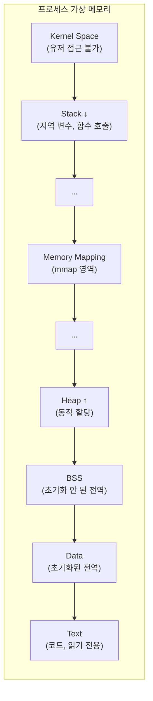
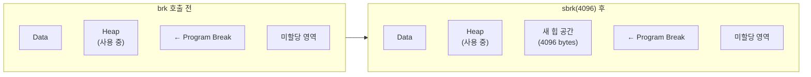
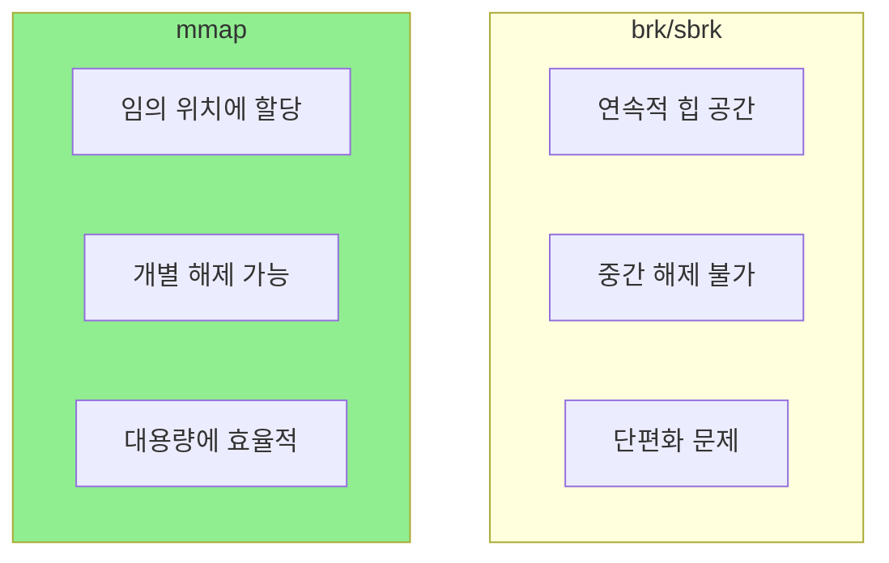
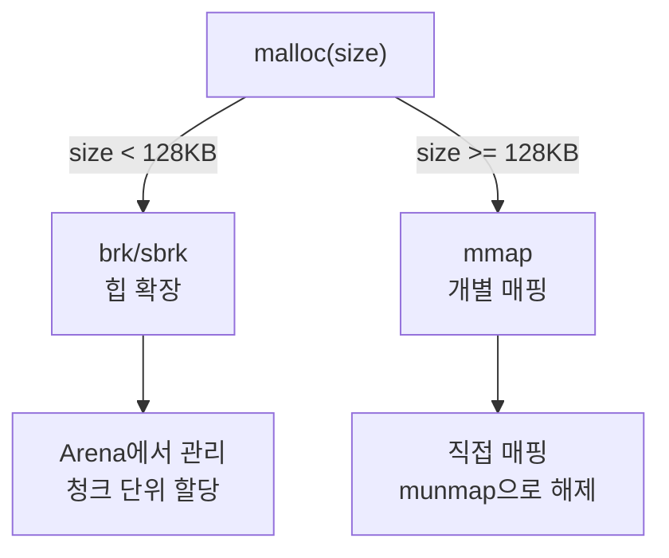

# Memory System Calls (메모리 시스템 콜) ⭐

## 면접 질문
> "mmap과 brk의 차이점은?"

---

## 프로세스 메모리 구조 복습



---

## brk() / sbrk() - 힙 확장

### 전통적인 힙 관리

```c
#include <unistd.h>

// 현재 브레이크 위치 반환
void *sbrk(intptr_t increment);

// 브레이크를 특정 위치로 설정
int brk(void *addr);
```

### 브레이크(Break)란?

**프로그램 브레이크**는 힙 영역의 끝 위치를 가리킵니다.



### 예제

```c
#include <unistd.h>
#include <stdio.h>

int main() {
    // 현재 브레이크 위치
    void *current = sbrk(0);
    printf("Current break: %p\n", current);

    // 4096 바이트 확장
    void *new_mem = sbrk(4096);
    printf("New memory at: %p\n", new_mem);

    // 현재 브레이크 위치 확인
    void *after = sbrk(0);
    printf("New break: %p\n", after);

    // 이제 new_mem ~ after 사이를 사용 가능

    return 0;
}
```

### brk의 한계

| 한계 | 설명 |
|------|------|
| **연속적** | 힙은 연속된 공간이어야 함 |
| **중간 해제 불가** | 중간 메모리만 해제할 수 없음 |
| **단방향 확장** | 주로 확장만, 축소는 드묾 |
| **단편화** | 메모리 조각화 문제 |

---

## mmap() - 메모리 매핑

### 더 유연한 메모리 할당

```c
#include <sys/mman.h>

void *mmap(void *addr, size_t length, int prot, int flags,
           int fd, off_t offset);

int munmap(void *addr, size_t length);
```

### 익명 매핑 (파일 없이 메모리만)

```c
// 4KB 메모리 할당
void *mem = mmap(NULL, 4096,
                 PROT_READ | PROT_WRITE,
                 MAP_PRIVATE | MAP_ANONYMOUS,
                 -1, 0);

if (mem == MAP_FAILED) {
    perror("mmap");
    return -1;
}

// 사용
memset(mem, 0, 4096);

// 해제
munmap(mem, 4096);
```

### mmap의 장점



| 특성 | brk/sbrk | mmap |
|------|----------|------|
| **위치** | 힙 영역 (연속) | 어디든 (불연속 가능) |
| **해제** | 끝에서만 가능 | 개별 영역 해제 가능 |
| **크기** | 작은 할당에 적합 | 큰 할당에 적합 |
| **오버헤드** | 낮음 | 약간 높음 (VMA 생성) |

---

## malloc()의 내부 동작

glibc의 malloc은 brk와 mmap을 **조합**하여 사용합니다.

### 할당 크기에 따른 선택



### 임계값 (MMAP_THRESHOLD)

```c
// 기본값: 128KB (131072 bytes)
// 환경변수로 조정 가능
// MALLOC_MMAP_THRESHOLD_=262144

void *small = malloc(1000);      // brk 사용
void *large = malloc(200000);    // mmap 사용
```

### 왜 이렇게 나누는가?

| 크기 | 방식 | 이유 |
|------|------|------|
| **작은 할당** | brk | 빈번한 할당/해제에 효율적, 재사용 용이 |
| **큰 할당** | mmap | 개별 해제로 메모리 즉시 반환, 단편화 방지 |

---

## mprotect() - 메모리 권한 변경

```c
#include <sys/mman.h>

int mprotect(void *addr, size_t len, int prot);
```

### 사용 사례

```c
// 읽기/쓰기 가능한 메모리 할당
void *mem = mmap(NULL, 4096, PROT_READ | PROT_WRITE,
                 MAP_PRIVATE | MAP_ANONYMOUS, -1, 0);

// 코드 작성 (JIT 컴파일러 시뮬레이션)
memcpy(mem, machine_code, code_size);

// 실행 권한 부여, 쓰기 권한 제거
mprotect(mem, 4096, PROT_READ | PROT_EXEC);

// 이제 실행 가능
((void (*)())mem)();  // 함수로 호출
```

### 보안 활용: Guard Page

```c
// 스택 오버플로우 감지용 Guard Page
void *guard = mmap(NULL, 4096, PROT_NONE,  // 접근 불가
                   MAP_PRIVATE | MAP_ANONYMOUS, -1, 0);

// 이 페이지에 접근하면 SIGSEGV 발생
```

---

## madvise() - 커널 힌트

```c
#include <sys/mman.h>

int madvise(void *addr, size_t length, int advice);
```

### 주요 힌트

| 힌트 | 설명 | 사용 사례 |
|------|------|----------|
| `MADV_SEQUENTIAL` | 순차 접근 예정 | 파일 스캔 |
| `MADV_RANDOM` | 랜덤 접근 예정 | 데이터베이스 |
| `MADV_WILLNEED` | 곧 사용할 예정 | 프리페칭 |
| `MADV_DONTNEED` | 더 이상 불필요 | 메모리 해제 |
| `MADV_HUGEPAGE` | Huge Page 선호 | 대용량 메모리 |

### 예제: 메모리 즉시 해제

```c
// mmap으로 할당한 메모리
void *mem = mmap(NULL, 1024*1024, PROT_READ | PROT_WRITE,
                 MAP_PRIVATE | MAP_ANONYMOUS, -1, 0);

// 사용 ...

// 물리 메모리 즉시 해제 (가상 주소는 유지)
madvise(mem, 1024*1024, MADV_DONTNEED);

// 다시 접근하면 0으로 초기화된 페이지 제공
```

---

## mremap() - 매핑 크기 변경

```c
#include <sys/mman.h>

void *mremap(void *old_address, size_t old_size,
             size_t new_size, int flags, ... /* void *new_address */);
```

### realloc의 내부

```c
// mmap으로 할당된 큰 메모리의 realloc은 mremap 사용
void *old = mmap(NULL, 1024*1024, ...);

// 크기 변경 (이동 허용)
void *new = mremap(old, 1024*1024, 2*1024*1024, MREMAP_MAYMOVE);
```

**MREMAP_MAYMOVE**: 필요시 다른 주소로 이동 허용

---

## 공유 메모리

### shm_open + mmap

```c
#include <sys/mman.h>
#include <fcntl.h>

// 공유 메모리 객체 생성/열기
int fd = shm_open("/my_shm", O_CREAT | O_RDWR, 0666);

// 크기 설정
ftruncate(fd, 4096);

// 메모리 매핑
void *shared = mmap(NULL, 4096, PROT_READ | PROT_WRITE,
                    MAP_SHARED, fd, 0);

// 다른 프로세스에서도 같은 이름으로 접근 가능
// shm_open("/my_shm", O_RDWR, 0666);

// 정리
munmap(shared, 4096);
shm_unlink("/my_shm");
```

### 익명 공유 매핑 (부모-자식 간)

```c
// MAP_SHARED | MAP_ANONYMOUS = fork()로 공유
void *shared = mmap(NULL, 4096, PROT_READ | PROT_WRITE,
                    MAP_SHARED | MAP_ANONYMOUS, -1, 0);

if (fork() == 0) {
    // 자식: 공유 메모리에 쓰기
    *(int *)shared = 42;
    exit(0);
}

wait(NULL);
printf("Parent sees: %d\n", *(int *)shared);  // 42
```

---

## 메모리 락: mlock()

```c
#include <sys/mman.h>

int mlock(const void *addr, size_t len);
int munlock(const void *addr, size_t len);
int mlockall(int flags);
```

### 페이지를 물리 메모리에 고정

```c
void *mem = malloc(4096);

// 이 메모리가 스왑되지 않도록 고정
mlock(mem, 4096);

// 암호화 키 등 민감한 데이터 저장
// (스왑 파일에 기록되면 안 됨)

munlock(mem, 4096);
```

**사용 사례**:
- 암호화 키 보호
- 실시간 시스템 (스왑 지연 방지)
- 고성능 데이터베이스

---

## 면접 답변 예시

> **Q: mmap과 brk의 차이점은?**

"brk와 mmap은 둘 다 동적 메모리 할당에 사용되지만 방식이 다릅니다.

**brk/sbrk**는 힙의 끝(program break)을 이동시켜 **연속적인 힙 공간**을 확장합니다. 작은 할당에 효율적이고 오버헤드가 낮지만, 중간 메모리만 해제할 수 없고 단편화 문제가 있습니다.

**mmap**은 가상 주소 공간의 **임의 위치에 메모리를 매핑**합니다. munmap으로 개별 영역을 해제할 수 있어 대용량 할당에 적합하고, 파일 매핑이나 프로세스 간 공유 메모리도 지원합니다. 다만 VMA(Virtual Memory Area) 생성 오버헤드가 있습니다.

glibc malloc은 이를 조합합니다: 128KB 미만은 brk로 힙에서 관리하고, 128KB 이상은 mmap으로 개별 매핑합니다. 이렇게 하면 작은 할당은 빠르게 재사용하고, 큰 할당은 해제 시 바로 메모리를 반환할 수 있습니다."

---

## 시스템 콜 정리

| 시스템 콜 | 용도 |
|----------|------|
| `brk/sbrk` | 힙 영역 확장/축소 |
| `mmap` | 메모리 매핑 (파일/익명) |
| `munmap` | 매핑 해제 |
| `mprotect` | 메모리 권한 변경 |
| `madvise` | 커널에 사용 패턴 힌트 |
| `mremap` | 매핑 크기 변경 |
| `mlock` | 페이지를 물리 메모리에 고정 |
| `shm_open` | POSIX 공유 메모리 객체 생성 |

---

## 핵심 정리

| 개념 | 한 줄 정의 |
|------|-----------|
| **brk/sbrk** | 힙의 끝(program break)을 이동시켜 메모리 할당 |
| **mmap (익명)** | 파일 없이 가상 메모리 할당 (MAP_ANONYMOUS) |
| **mmap (파일)** | 파일을 가상 주소 공간에 매핑 |
| **munmap** | mmap으로 생성한 매핑 해제 |
| **mprotect** | 매핑된 메모리의 접근 권한 변경 |
| **MMAP_THRESHOLD** | malloc이 brk와 mmap을 선택하는 기준 (기본 128KB) |

---

## 연관 문서

→ [05_Go_System_Integration](../05_Go_System_Integration/README.md): Go에서의 메모리 관리
