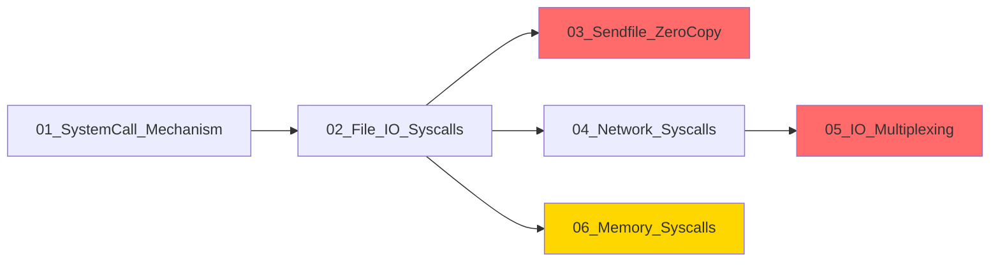

# System Calls (시스템 콜)

유저 프로그램이 커널 서비스를 요청하는 인터페이스인 **시스템 콜**을 심층적으로 다룹니다.

---

## 학습 목표

1. **시스템 콜 동작 이해**: 유저 모드에서 커널 모드로 진입하는 과정을 설명할 수 있다
2. **파일 I/O 이해**: read, write, open, close의 내부 동작을 설명할 수 있다
3. **Zero-copy 기법 이해**: sendfile이 왜 효율적인지 설명할 수 있다
4. **I/O 멀티플렉싱 이해**: select, poll, epoll의 차이와 epoll의 장점을 설명할 수 있다
5. **메모리 시스템 콜 이해**: mmap, brk의 역할과 사용 시나리오를 설명할 수 있다

---

## 문서 구성

| 문서 | 주제 | 핵심 면접 질문 |
|------|------|----------------|
| [01_SystemCall_Mechanism](./01_SystemCall_Mechanism.md) | 시스템 콜 동작 원리 | "시스템 콜은 어떻게 동작하나요?" |
| [02_File_IO_Syscalls](./02_File_IO_Syscalls.md) | 파일 I/O 시스템 콜 | "파일 디스크립터란 무엇인가요?" |
| [03_Sendfile_ZeroCopy](./03_Sendfile_ZeroCopy.md) ⭐⭐ | sendfile과 Zero-copy | "Zero-copy가 왜 필요하고 어떻게 동작하나요?" |
| [04_Network_Syscalls](./04_Network_Syscalls.md) | 네트워크 시스템 콜 | "TCP 소켓 통신 과정을 설명해주세요" |
| [05_IO_Multiplexing](./05_IO_Multiplexing.md) ⭐⭐ | I/O 멀티플렉싱 | "select, poll, epoll의 차이점은?" |
| [06_Memory_Syscalls](./06_Memory_Syscalls.md) ⭐ | 메모리 시스템 콜 | "mmap과 brk의 차이점은?" |

> ⭐⭐ 표시: 핵심 집중 학습 주제

---

## 선수 지식

- [03_OS_Fundamentals](../03_OS_Fundamentals/README.md)의 내용
  - 커널/유저 모드 구분
  - 가상 메모리와 페이징
  - 프로세스와 파일 디스크립터 개념

---

## 학습 순서

1. **SystemCall Mechanism**: 시스템 콜 호출 원리 (기초)
2. **File I/O**: 기본 파일 작업
3. **Sendfile/Zero-copy**: 고성능 파일 전송 ⭐⭐
4. **Network Syscalls**: 소켓 프로그래밍 기초
5. **I/O Multiplexing**: 대규모 동시 연결 처리 ⭐⭐
6. **Memory Syscalls**: 메모리 관리 시스템 콜 ⭐

---

## 핵심 시스템 콜 요약

### 파일 I/O

| 시스템 콜 | 기능 |
|----------|------|
| `open()` | 파일 열기, fd 반환 |
| `read()` | fd에서 데이터 읽기 |
| `write()` | fd에 데이터 쓰기 |
| `close()` | fd 닫기 |
| `lseek()` | 파일 위치 이동 |

### 고성능 I/O

| 시스템 콜 | 기능 |
|----------|------|
| `sendfile()` | Zero-copy 파일 전송 |
| `splice()` | 파이프를 통한 Zero-copy |
| `mmap()` | 파일-메모리 매핑 |

### 네트워크

| 시스템 콜 | 기능 |
|----------|------|
| `socket()` | 소켓 생성 |
| `bind()` | 주소 바인딩 |
| `listen()` | 연결 대기 |
| `accept()` | 연결 수락 |
| `connect()` | 서버 연결 |

### I/O 멀티플렉싱

| 시스템 콜 | 기능 |
|----------|------|
| `select()` | 다중 fd 감시 (레거시) |
| `poll()` | select 개선 |
| `epoll_*()` | 고성능 이벤트 기반 |

---

## 연관 문서

- [03_OS_Fundamentals](../03_OS_Fundamentals/README.md): OS 기초 (선수 과목)
- [05_Go_System_Integration](../05_Go_System_Integration/README.md): Go에서의 시스템 콜 활용
