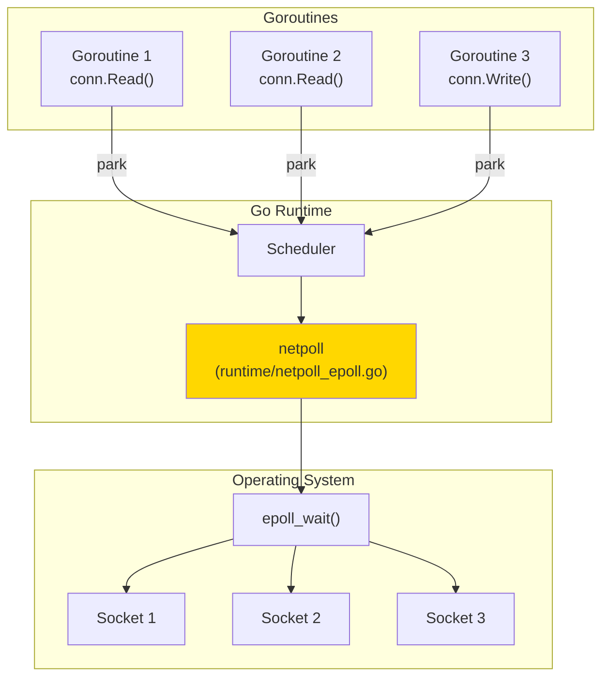
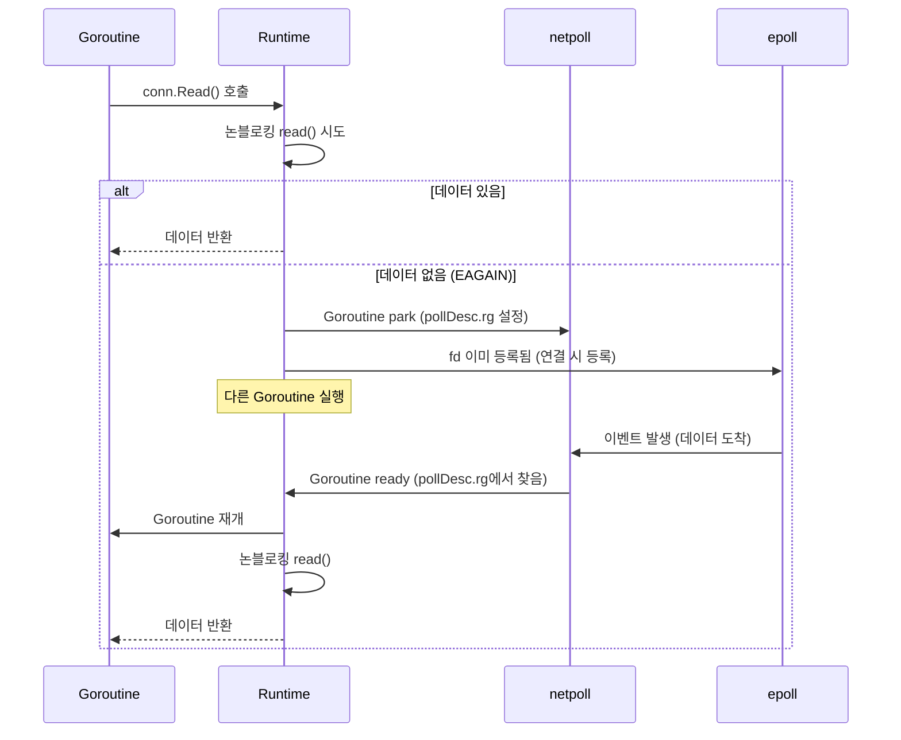
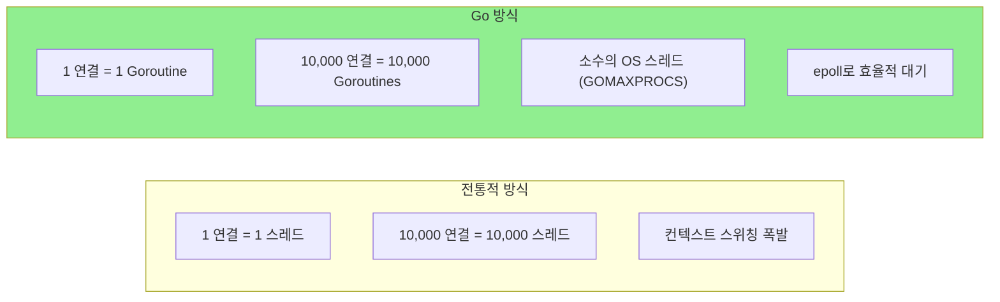
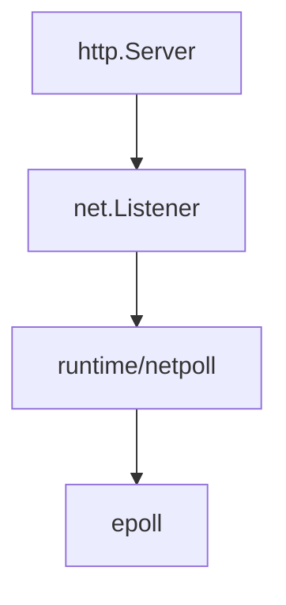

# Go Network Internals (Go 네트워크 내부 구조)

Go의 net 패키지가 내부적으로 epoll/kqueue를 어떻게 사용하는지 다룹니다.

---

## Go 네트워크의 마법

### 동기처럼 보이는 비동기

```go
// 동기처럼 보이는 코드
conn, _ := net.Dial("tcp", "example.com:80")
defer conn.Close()

// 블로킹처럼 보이지만...
n, _ := conn.Read(buf)  // Goroutine만 블록, OS 스레드는 블록 안 함

// 블로킹처럼 보이지만...
conn.Write(data)
```

**비밀**: Go 런타임의 **netpoll**이 내부적으로 epoll/kqueue를 사용합니다.

---

## netpoll 아키텍처



### 동작 흐름

1. **Goroutine이 I/O 요청**: `conn.Read()` 호출
2. **논블로킹 시스템 콜**: 내부적으로 논블로킹 read() 호출
3. **EAGAIN 처리**: 데이터 없으면 Goroutine을 park (대기 상태)
4. **epoll 등록**: fd를 epoll에 등록
5. **Scheduler 계속 실행**: 다른 Goroutine 실행
6. **이벤트 발생**: 데이터 도착 시 epoll이 감지
7. **Goroutine 깨움**: 대기 중이던 Goroutine을 ready 상태로

---

## 소스 코드 구조

Go 런타임의 네트워크 관련 파일들:

```
runtime/
├── netpoll.go           # 공통 인터페이스
├── netpoll_epoll.go     # Linux (epoll)
├── netpoll_kqueue.go    # macOS, BSD (kqueue)
├── netpoll_windows.go   # Windows (IOCP)
└── netpoll_fake.go      # 테스트용
```

### netpoll_epoll.go (단순화)

```go
// Linux에서의 netpoll 구현 (단순화)

var (
    epfd int32 = -1  // epoll fd
)

func netpollinit() {
    // epoll 인스턴스 생성
    epfd = epollcreate1(_EPOLL_CLOEXEC)
}

func netpollopen(fd uintptr, pd *pollDesc) int32 {
    // fd를 epoll에 등록
    var ev epollevent
    ev.events = _EPOLLIN | _EPOLLOUT | _EPOLLRDHUP | _EPOLLET
    ev.data = (*(*[2]int32)(unsafe.Pointer(&pd)))[0]

    return epollctl(epfd, _EPOLL_CTL_ADD, int32(fd), &ev)
}

func netpoll(delay int64) gList {
    // epoll_wait 호출
    var events [128]epollevent
    n := epollwait(epfd, &events[0], int32(len(events)), waitms)

    var toRun gList
    for i := int32(0); i < n; i++ {
        // 이벤트 발생한 fd의 Goroutine을 ready 목록에 추가
        pd := *(**pollDesc)(unsafe.Pointer(&events[i].data))
        netpollready(&toRun, pd, mode)
    }
    return toRun
}
```

---

## Goroutine Parking 메커니즘

### pollDesc 구조

각 네트워크 연결은 `pollDesc` 구조체를 가집니다.

```go
// runtime/netpoll.go (단순화)
type pollDesc struct {
    fd      uintptr         // 파일 디스크립터
    rg      uintptr         // 읽기 대기 중인 Goroutine
    wg      uintptr         // 쓰기 대기 중인 Goroutine
    // ...
}
```

### Park/Ready 흐름



---

## net.Listen / net.Dial 내부

### Listen

```go
// 사용자 코드
ln, _ := net.Listen("tcp", ":8080")

// 내부 동작 (단순화)
func Listen(network, address string) (Listener, error) {
    // 1. socket() 시스템 콜
    fd, _ := socket(AF_INET, SOCK_STREAM|SOCK_NONBLOCK, 0)  // 논블로킹!

    // 2. bind()
    bind(fd, addr)

    // 3. listen()
    listen(fd, backlog)

    // 4. epoll에 등록
    pd := &pollDesc{fd: fd}
    netpollopen(fd, pd)

    return &TCPListener{fd: fd, pd: pd}, nil
}
```

### Accept

```go
// 사용자 코드
conn, _ := ln.Accept()

// 내부 동작 (단순화)
func (l *TCPListener) Accept() (Conn, error) {
    for {
        // 1. 논블로킹 accept() 시도
        nfd, _, err := accept(l.fd)

        if err == EAGAIN {
            // 2. 대기 연결 없으면 Goroutine park
            runtime_pollWait(l.pd, 'r')
            continue
        }

        // 3. 새 연결의 fd도 논블로킹으로
        setNonblock(nfd)

        // 4. 새 연결을 epoll에 등록
        pd := &pollDesc{fd: nfd}
        netpollopen(nfd, pd)

        return &TCPConn{fd: nfd, pd: pd}, nil
    }
}
```

---

## 성능의 비밀

### 왜 Go 네트워크가 빠른가?



| 특성 | 스레드 기반 | Go |
|------|-----------|-----|
| **연결당 비용** | ~8MB (스택) | ~2KB (Goroutine 스택) |
| **10K 연결** | 80GB 메모리 | 20MB 메모리 |
| **I/O 대기** | OS 스레드 블록 | Goroutine만 블록 |
| **컨텍스트 스위칭** | 커널 레벨 (비쌈) | 유저 레벨 (저렴) |

---

## SetDeadline의 구현

```go
conn.SetReadDeadline(time.Now().Add(5 * time.Second))
```

### 내부 동작

```go
func (c *conn) SetReadDeadline(t time.Time) error {
    // pollDesc에 타이머 설정
    runtime_pollSetDeadline(c.pd, t.UnixNano(), 'r')
    return nil
}
```

타임아웃 발생 시 netpoll이 해당 Goroutine을 깨우고, `i/o timeout` 에러를 반환합니다.

---

## 실습: 커스텀 netpoll 확인

### /proc에서 epoll 확인 (Linux)

```bash
# Go 서버 실행 후
$ ls -l /proc/$(pgrep myserver)/fd | grep eventpoll
lrwx------ 1 user user 64 Jan 1 12:00 3 -> anon_inode:[eventpoll]
```

### strace로 확인

```bash
$ strace -e epoll_create1,epoll_ctl,epoll_wait go run server.go

epoll_create1(EPOLL_CLOEXEC)           = 3
epoll_ctl(3, EPOLL_CTL_ADD, 4, ...)    = 0
epoll_wait(3, [...], 128, -1)          = 1
```

---

## GOMAXPROCS와 netpoll

### 네트워크 폴링 스레드

Go 런타임은 별도의 스레드에서 주기적으로 `netpoll()`을 호출합니다.

```go
// runtime/proc.go (단순화)
func sysmon() {
    for {
        // 주기적으로 netpoll 확인
        list := netpoll(0)  // 논블로킹
        if !list.empty() {
            // ready된 Goroutine들을 run queue에 추가
            injectglist(&list)
        }
        usleep(delay)
    }
}
```

### 최적 GOMAXPROCS

```go
// CPU 코어 수에 맞춤 (기본값)
runtime.GOMAXPROCS(runtime.NumCPU())

// 네트워크 I/O 집약적이면 더 많이 설정할 수도
runtime.GOMAXPROCS(runtime.NumCPU() * 2)
```

---

## net/http의 활용

```go
// HTTP 서버 - 내부적으로 위의 모든 것을 사용
http.HandleFunc("/", handler)
http.ListenAndServe(":8080", nil)
```



---

## 핵심 정리

| 개념 | 설명 |
|------|------|
| **netpoll** | Go 런타임의 비동기 I/O 추상화 계층 |
| **pollDesc** | 네트워크 연결의 상태를 추적하는 구조체 |
| **Goroutine parking** | I/O 대기 시 Goroutine을 대기 상태로 전환 |
| **epoll 통합** | 모든 네트워크 fd가 하나의 epoll 인스턴스에 등록 |
| **Edge-Triggered** | Go는 ET 모드로 epoll 사용 |

---

## 다음 문서

→ [03_Go_File_IO](./03_Go_File_IO.md): Go 파일 I/O와 sendfile 최적화
