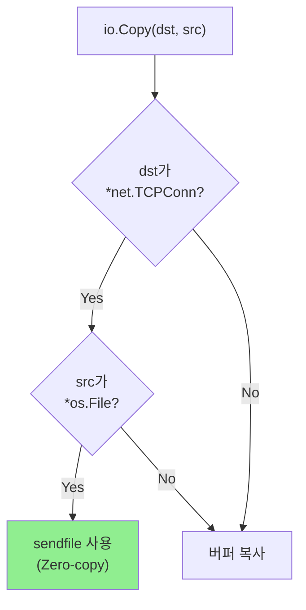
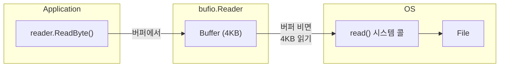

# Go File I/O (Go 파일 I/O)

Go의 os 패키지와 시스템 콜의 관계, 그리고 sendfile 최적화를 다룹니다.

---

## os.File의 구조

```go
// os/file.go (단순화)
type File struct {
    *file  // OS별 구현
}

type file struct {
    pfd         poll.FD
    name        string
    dirinfo     *dirInfo
}

// internal/poll/fd_unix.go
type FD struct {
    Sysfd       int        // 시스템 fd
    IsStream    bool
    // ...
}
```

### os 패키지와 시스템 콜 매핑

| os 패키지 | 시스템 콜 |
|----------|----------|
| `os.Open()` | `open()` |
| `os.Create()` | `open(O_CREAT\|O_TRUNC)` |
| `file.Read()` | `read()` |
| `file.Write()` | `write()` |
| `file.Close()` | `close()` |
| `file.Seek()` | `lseek()` |
| `file.Stat()` | `fstat()` |

---

## io.Copy의 최적화

### 일반적인 복사 vs sendfile

```go
// 단순한 복사 (버퍼 사용)
io.Copy(dst, src)

// 내부적으로 sendfile 사용 가능!
```

### io.Copy가 sendfile을 사용하는 조건



### 실제 코드

```go
// net/tcpsock_posix.go (단순화)
func (c *TCPConn) ReadFrom(r io.Reader) (int64, error) {
    if f, ok := r.(*os.File); ok {
        // sendfile 사용!
        return sendFile(c.fd, f)
    }
    // 일반 복사
    return genericReadFrom(c, r)
}
```

---

## sendfile 활용 예제

### HTTP 파일 서버

```go
package main

import (
    "io"
    "net"
    "os"
)

func serveFile(conn net.Conn, filename string) error {
    file, err := os.Open(filename)
    if err != nil {
        return err
    }
    defer file.Close()

    // io.Copy는 내부적으로 sendfile 사용
    // (TCPConn + os.File 조합)
    _, err = io.Copy(conn, file)
    return err
}

func main() {
    ln, _ := net.Listen("tcp", ":8080")

    for {
        conn, _ := ln.Accept()
        go func(c net.Conn) {
            defer c.Close()
            serveFile(c, "large_video.mp4")
        }(conn)
    }
}
```

### 명시적 sendfile 사용

```go
import "golang.org/x/sys/unix"

func sendfileExplicit(conn *net.TCPConn, file *os.File) (int64, error) {
    // RawConn으로 fd 접근
    rawConn, _ := conn.SyscallConn()

    var sent int64
    var sendErr error

    rawConn.Control(func(sockFd uintptr) {
        fileFd := int(file.Fd())
        fileInfo, _ := file.Stat()
        size := int(fileInfo.Size())

        var offset int64 = 0
        for size > 0 {
            n, err := unix.Sendfile(int(sockFd), fileFd, &offset, size)
            if err != nil {
                sendErr = err
                return
            }
            sent += int64(n)
            size -= n
        }
    })

    return sent, sendErr
}
```

---

## bufio 패키지

### 버퍼링의 필요성

```go
// 나쁜 예: 바이트 단위 읽기 (매번 시스템 콜)
file, _ := os.Open("data.txt")
buf := make([]byte, 1)
for {
    _, err := file.Read(buf)  // 매번 시스템 콜!
    if err == io.EOF {
        break
    }
}

// 좋은 예: bufio 사용 (버퍼링)
file, _ := os.Open("data.txt")
reader := bufio.NewReader(file)
for {
    _, err := reader.ReadByte()  // 버퍼에서 읽음
    if err == io.EOF {
        break
    }
}
```

### bufio 동작 원리



### 버퍼 크기 설정

```go
// 기본 버퍼: 4096 bytes
reader := bufio.NewReader(file)

// 커스텀 버퍼 크기
reader := bufio.NewReaderSize(file, 64*1024)  // 64KB
```

---

## O_DIRECT와 Direct I/O

### Page Cache 우회

```go
import "golang.org/x/sys/unix"

func openDirect(filename string) (*os.File, error) {
    fd, err := unix.Open(filename, unix.O_RDONLY|unix.O_DIRECT, 0)
    if err != nil {
        return nil, err
    }

    return os.NewFile(uintptr(fd), filename), nil
}

func readDirect(file *os.File) ([]byte, error) {
    // O_DIRECT는 정렬된 버퍼 필요
    buf := make([]byte, 4096)

    // 정렬 확인 (실제로는 더 복잡)
    // 보통 memalign이나 직접 mmap 사용

    _, err := file.Read(buf)
    return buf, err
}
```

### 언제 사용하나?

| 상황 | O_DIRECT 사용 |
|------|--------------|
| 데이터베이스 | ✅ 자체 캐시 사용 |
| 일반 파일 처리 | ❌ Page Cache가 유리 |
| 대용량 순차 읽기 | ⚠️ 상황에 따라 |

---

## 파일 동기화

### Sync 메서드들

```go
file, _ := os.Create("important.dat")
file.Write(data)

// 방법 1: 파일 데이터만 동기화
file.Sync()  // fsync() 시스템 콜

// 방법 2: OpenFile 플래그로
file, _ := os.OpenFile("important.dat",
    os.O_WRONLY|os.O_CREATE|os.O_SYNC, 0644)
// O_SYNC: 매 write마다 동기화 (느림)
```

### fsync vs fdatasync

```go
import "golang.org/x/sys/unix"

// fsync: 데이터 + 메타데이터 동기화
unix.Fsync(int(file.Fd()))

// fdatasync: 데이터만 동기화 (더 빠름)
unix.Fdatasync(int(file.Fd()))
```

---

## 파일 락

### flock (Advisory Lock)

```go
import "golang.org/x/sys/unix"

func lockFile(file *os.File) error {
    return unix.Flock(int(file.Fd()), unix.LOCK_EX)
}

func unlockFile(file *os.File) error {
    return unix.Flock(int(file.Fd()), unix.LOCK_UN)
}

// 사용
file, _ := os.OpenFile("data.db", os.O_RDWR, 0644)
lockFile(file)
defer unlockFile(file)

// 안전하게 파일 작업
```

### 논블로킹 락

```go
err := unix.Flock(int(file.Fd()), unix.LOCK_EX|unix.LOCK_NB)
if err == unix.EWOULDBLOCK {
    fmt.Println("파일이 이미 잠겨 있음")
}
```

---

## ReadAt / WriteAt

### 오프셋 지정 I/O (pread/pwrite)

```go
file, _ := os.Open("data.bin")

buf := make([]byte, 100)

// 특정 오프셋에서 읽기 (pread 사용)
n, _ := file.ReadAt(buf, 1000)  // 오프셋 1000에서 읽기

// 파일 포인터는 변경되지 않음!
// 멀티스레드에서 안전
```

### 병렬 파일 읽기

```go
func parallelRead(filename string) error {
    file, _ := os.Open(filename)
    defer file.Close()

    info, _ := file.Stat()
    size := info.Size()

    numWorkers := 4
    chunkSize := size / int64(numWorkers)

    var wg sync.WaitGroup

    for i := 0; i < numWorkers; i++ {
        wg.Add(1)
        go func(workerID int) {
            defer wg.Done()

            offset := int64(workerID) * chunkSize
            buf := make([]byte, chunkSize)

            // ReadAt은 병렬 안전!
            file.ReadAt(buf, offset)
            // 처리...
        }(i)
    }

    wg.Wait()
    return nil
}
```

---

## 핵심 정리

| 개념 | 설명 |
|------|------|
| **os.File** | 시스템 fd를 래핑한 Go 구조체 |
| **io.Copy + TCPConn** | 내부적으로 sendfile 사용 가능 |
| **bufio** | 시스템 콜 횟수를 줄이는 버퍼링 |
| **O_DIRECT** | Page Cache 우회 직접 I/O |
| **ReadAt/WriteAt** | 오프셋 지정 I/O (pread/pwrite) |

---

## 다음 문서

→ [04_Go_Memory_Mapping](./04_Go_Memory_Mapping.md): Go에서 mmap 활용
