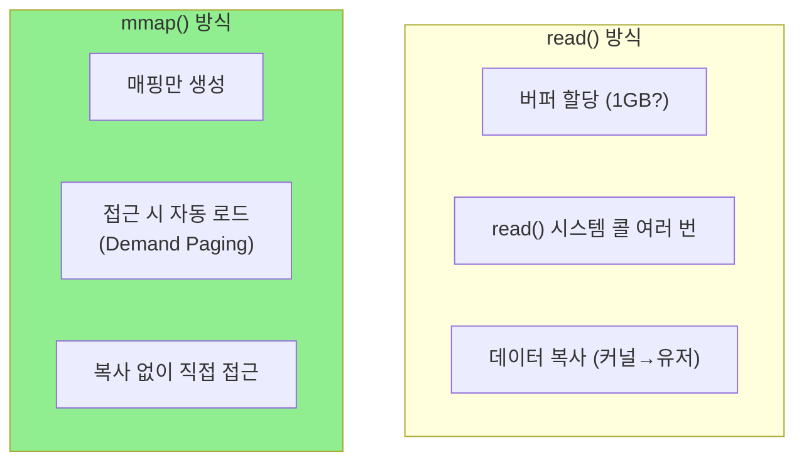

# Go Memory Mapping (Go에서 mmap 활용)

Go에서 메모리 매핑을 사용하여 대용량 파일을 효율적으로 처리하는 방법을 다룹니다.

---

## mmap 사용 방법

### golang.org/x/sys/unix 사용

```go
package main

import (
    "fmt"
    "os"

    "golang.org/x/sys/unix"
)

func main() {
    // 파일 열기
    file, err := os.Open("large_data.bin")
    if err != nil {
        panic(err)
    }
    defer file.Close()

    // 파일 크기 확인
    info, _ := file.Stat()
    size := int(info.Size())

    // mmap으로 메모리에 매핑
    data, err := unix.Mmap(
        int(file.Fd()),    // 파일 디스크립터
        0,                 // 오프셋
        size,              // 크기
        unix.PROT_READ,    // 읽기 전용
        unix.MAP_SHARED,   // 공유 매핑
    )
    if err != nil {
        panic(err)
    }
    defer unix.Munmap(data)

    // []byte로 직접 접근!
    fmt.Printf("First byte: %d\n", data[0])
    fmt.Printf("Last byte: %d\n", data[size-1])
}
```

---

## golang.org/x/exp/mmap 패키지

더 편리한 인터페이스를 제공하는 실험적 패키지입니다.

```bash
go get golang.org/x/exp/mmap
```

```go
package main

import (
    "fmt"

    "golang.org/x/exp/mmap"
)

func main() {
    // 읽기 전용 메모리 매핑
    reader, err := mmap.Open("large_file.dat")
    if err != nil {
        panic(err)
    }
    defer reader.Close()

    // io.ReaderAt 인터페이스 구현
    buf := make([]byte, 100)
    n, _ := reader.ReadAt(buf, 1000)  // 오프셋 1000에서 100바이트 읽기

    fmt.Printf("Read %d bytes\n", n)

    // 크기 확인
    fmt.Printf("File size: %d\n", reader.Len())
}
```

### 한계

- **읽기 전용**: 쓰기 매핑 미지원
- **실험적**: API 변경 가능

---

## 대용량 파일 처리 예제

### 바이너리 파일 검색

```go
package main

import (
    "bytes"
    "fmt"
    "os"

    "golang.org/x/sys/unix"
)

func searchPattern(filename string, pattern []byte) ([]int64, error) {
    file, _ := os.Open(filename)
    defer file.Close()

    info, _ := file.Stat()
    size := int(info.Size())

    // mmap으로 매핑
    data, err := unix.Mmap(int(file.Fd()), 0, size,
        unix.PROT_READ, unix.MAP_PRIVATE)
    if err != nil {
        return nil, err
    }
    defer unix.Munmap(data)

    // 커널 힌트: 순차 접근 예정
    unix.Madvise(data, unix.MADV_SEQUENTIAL)

    // 패턴 검색
    var matches []int64
    offset := 0
    for {
        idx := bytes.Index(data[offset:], pattern)
        if idx == -1 {
            break
        }
        matches = append(matches, int64(offset+idx))
        offset += idx + 1
    }

    return matches, nil
}

func main() {
    // 10GB 파일에서 패턴 검색
    matches, _ := searchPattern("huge_log.bin", []byte("ERROR"))
    fmt.Printf("Found %d matches\n", len(matches))
}
```

### 왜 mmap이 좋은가?



---

## 쓰기 가능한 매핑

```go
func createWritableMapping(filename string, size int) ([]byte, error) {
    // 파일 생성/열기
    file, err := os.OpenFile(filename, os.O_RDWR|os.O_CREATE, 0644)
    if err != nil {
        return nil, err
    }
    defer file.Close()

    // 파일 크기 설정
    if err := file.Truncate(int64(size)); err != nil {
        return nil, err
    }

    // 읽기/쓰기 가능한 매핑
    data, err := unix.Mmap(int(file.Fd()), 0, size,
        unix.PROT_READ|unix.PROT_WRITE,  // 읽기+쓰기
        unix.MAP_SHARED)                  // 변경이 파일에 반영
    if err != nil {
        return nil, err
    }

    return data, nil
}

func main() {
    data, _ := createWritableMapping("output.bin", 1024*1024)
    defer unix.Munmap(data)

    // 직접 쓰기 - 파일에 반영됨
    copy(data[0:5], []byte("Hello"))
    data[100] = 42

    // 명시적 동기화 (선택적)
    unix.Msync(data, unix.MS_SYNC)
}
```

---

## 공유 메모리 IPC

### 프로세스 간 통신

```go
// producer.go
package main

import (
    "encoding/binary"
    "os"
    "time"

    "golang.org/x/sys/unix"
)

func main() {
    // 공유 메모리 파일 생성
    file, _ := os.OpenFile("/tmp/shared_mem",
        os.O_RDWR|os.O_CREATE, 0644)
    file.Truncate(4096)
    defer file.Close()

    data, _ := unix.Mmap(int(file.Fd()), 0, 4096,
        unix.PROT_READ|unix.PROT_WRITE, unix.MAP_SHARED)
    defer unix.Munmap(data)

    // 카운터 증가
    for i := 0; ; i++ {
        binary.LittleEndian.PutUint64(data[0:8], uint64(i))
        time.Sleep(100 * time.Millisecond)
    }
}
```

```go
// consumer.go
package main

import (
    "encoding/binary"
    "fmt"
    "os"
    "time"

    "golang.org/x/sys/unix"
)

func main() {
    file, _ := os.Open("/tmp/shared_mem")
    defer file.Close()

    data, _ := unix.Mmap(int(file.Fd()), 0, 4096,
        unix.PROT_READ, unix.MAP_SHARED)
    defer unix.Munmap(data)

    // 값 읽기
    for {
        value := binary.LittleEndian.Uint64(data[0:8])
        fmt.Printf("Value: %d\n", value)
        time.Sleep(100 * time.Millisecond)
    }
}
```

---

## mmap과 GC 주의사항

### 문제: GC가 mmap 데이터를 추적하지 않음

```go
// 위험한 패턴
func dangerous() []byte {
    file, _ := os.Open("file.dat")
    info, _ := file.Stat()

    data, _ := unix.Mmap(int(file.Fd()), 0, int(info.Size()),
        unix.PROT_READ, unix.MAP_PRIVATE)

    file.Close()  // 파일 닫음

    return data  // mmap 데이터 반환 - 언제 Munmap?
}
```

### 해결: 구조체로 래핑

```go
type MappedFile struct {
    data []byte
    size int
}

func OpenMapped(filename string) (*MappedFile, error) {
    file, err := os.Open(filename)
    if err != nil {
        return nil, err
    }
    defer file.Close()

    info, _ := file.Stat()
    size := int(info.Size())

    data, err := unix.Mmap(int(file.Fd()), 0, size,
        unix.PROT_READ, unix.MAP_PRIVATE)
    if err != nil {
        return nil, err
    }

    return &MappedFile{data: data, size: size}, nil
}

func (m *MappedFile) Close() error {
    return unix.Munmap(m.data)
}

func (m *MappedFile) Bytes() []byte {
    return m.data
}

// 사용
func main() {
    mf, _ := OpenMapped("data.bin")
    defer mf.Close()  // 반드시 해제

    // 사용
    fmt.Println(mf.Bytes()[0:10])
}
```

---

## madvise로 최적화

```go
data, _ := unix.Mmap(...)

// 순차 접근 예정
unix.Madvise(data, unix.MADV_SEQUENTIAL)

// 랜덤 접근 예정
unix.Madvise(data, unix.MADV_RANDOM)

// 곧 사용할 예정 (프리페치)
unix.Madvise(data, unix.MADV_WILLNEED)

// 더 이상 필요 없음 (메모리 해제)
unix.Madvise(data, unix.MADV_DONTNEED)
```

### 실제 활용

```go
func processLargeFile(filename string) error {
    // ... mmap 생성 ...

    // 처리 전: 프리페치 힌트
    unix.Madvise(data, unix.MADV_WILLNEED)

    // 순차 처리
    unix.Madvise(data, unix.MADV_SEQUENTIAL)

    for i := 0; i < len(data); i += pageSize {
        // 처리...

        // 처리 완료된 부분은 해제 힌트
        if i > pageSize*10 {
            unix.Madvise(data[i-pageSize*10:i], unix.MADV_DONTNEED)
        }
    }

    return nil
}
```

---

## 사용 사례

### 1. 데이터베이스 인덱스

```go
// B-tree 노드를 mmap으로 매핑
type BTreeIndex struct {
    data []byte
    // 노드는 data[offset:offset+nodeSize]로 접근
}

func (idx *BTreeIndex) GetNode(nodeID int) *Node {
    offset := nodeID * nodeSize
    // 직접 메모리 접근 - 디스크 I/O 없음 (캐시되어 있으면)
    return (*Node)(unsafe.Pointer(&idx.data[offset]))
}
```

### 2. 로그 파일 분석

```go
// 대용량 로그 파일 검색
func analyzeLog(filename string) {
    mf, _ := OpenMapped(filename)
    defer mf.Close()

    data := mf.Bytes()

    // 라인 단위로 처리
    start := 0
    for i := 0; i < len(data); i++ {
        if data[i] == '\n' {
            line := data[start:i]
            processLine(line)
            start = i + 1
        }
    }
}
```

### 3. 이미지/비디오 처리

```go
// Raw 이미지 데이터 접근
func processImage(filename string, width, height int) {
    mf, _ := OpenMapped(filename)
    defer mf.Close()

    data := mf.Bytes()

    // 픽셀 직접 접근
    for y := 0; y < height; y++ {
        for x := 0; x < width; x++ {
            offset := (y*width + x) * 3  // RGB
            r := data[offset]
            g := data[offset+1]
            b := data[offset+2]
            // 처리...
        }
    }
}
```

---

## mmap vs io.ReadAll 성능 비교

| 시나리오 | mmap | io.ReadAll |
|----------|------|------------|
| **작은 파일 (< 1MB)** | 비슷/느림 | 빠름 |
| **대용량 파일 전체 읽기** | 비슷 | 비슷 |
| **대용량 파일 부분 접근** | **빠름** | 느림 (전체 로드) |
| **랜덤 접근** | **빠름** | 비효율적 |
| **메모리 사용** | **효율적** | 전체 로드 |

---

## 핵심 정리

| 개념 | 설명 |
|------|------|
| **unix.Mmap** | 파일을 메모리에 매핑하는 시스템 콜 래퍼 |
| **MAP_SHARED** | 변경이 파일에 반영, 다른 프로세스와 공유 |
| **MAP_PRIVATE** | Copy-on-Write, 변경이 파일에 반영 안 됨 |
| **madvise** | 커널에 메모리 사용 패턴 힌트 제공 |
| **Munmap** | 매핑 해제 (반드시 호출!) |

---

## 정리: 언제 mmap을 사용하나?

| 사용하면 좋은 경우 | 피해야 하는 경우 |
|-------------------|-----------------|
| 대용량 파일 랜덤 접근 | 작은 파일 |
| 파일의 일부만 필요 | 순차적으로 한 번만 읽기 |
| 프로세스 간 공유 메모리 | 네트워크 데이터 |
| 반복적인 파일 접근 | 간단한 읽기/쓰기 |
