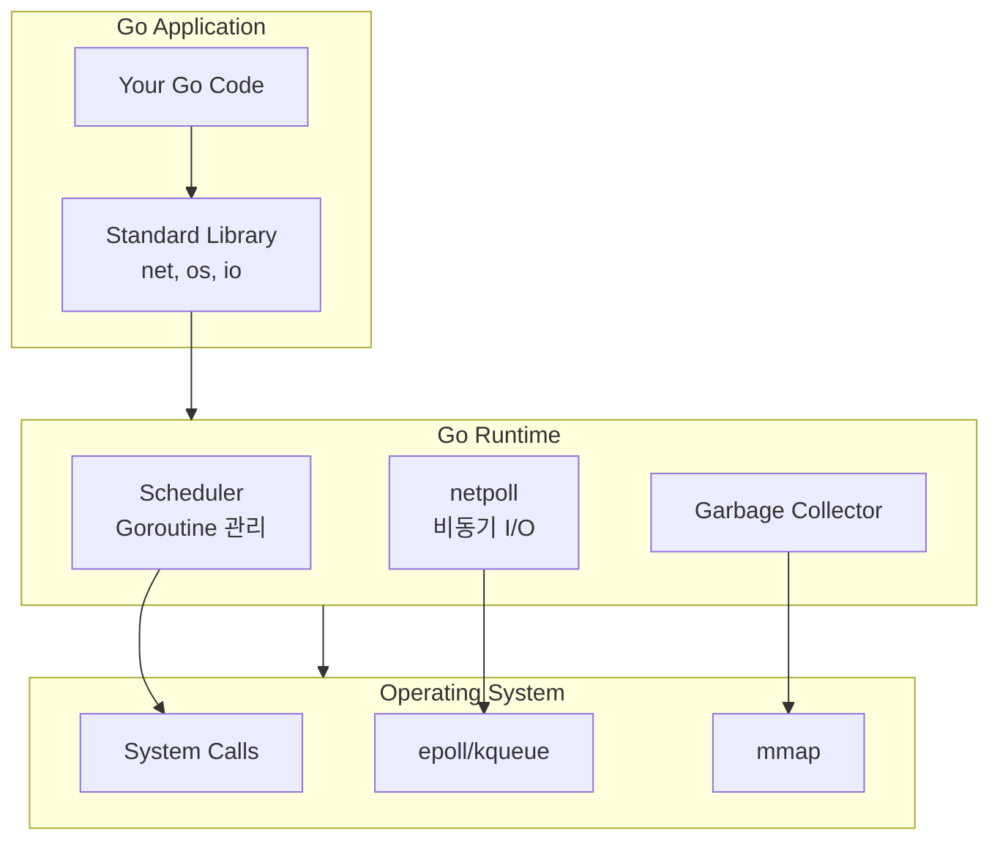
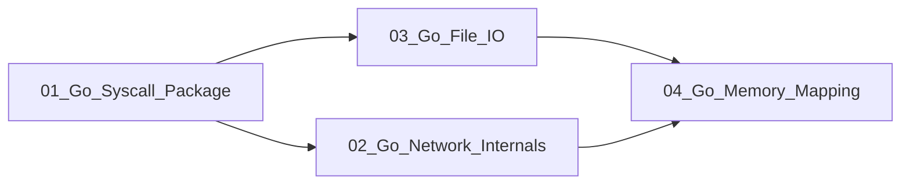

# Go System Integration (Go와 시스템 콜 통합)

Go 런타임이 OS 시스템 콜을 어떻게 활용하는지, 그리고 Go에서 저수준 시스템 프로그래밍을 어떻게 하는지 다룹니다.

---

## 학습 목표

1. **Go의 syscall 패키지 이해**: Go에서 직접 시스템 콜을 호출하는 방법
2. **Go 네트워크 내부 구조 파악**: net 패키지가 epoll/kqueue를 사용하는 방식
3. **Go 파일 I/O 이해**: os 패키지와 시스템 콜의 관계
4. **mmap 활용**: Go에서 메모리 매핑을 사용하는 방법

---

## 문서 구성

| 문서 | 주제 | 핵심 내용 |
|------|------|----------|
| [01_Go_Syscall_Package](./01_Go_Syscall_Package.md) | syscall/unix 패키지 | 직접 시스템 콜 호출 |
| [02_Go_Network_Internals](./02_Go_Network_Internals.md) | net 패키지 내부 | netpoll과 epoll 통합 |
| [03_Go_File_IO](./03_Go_File_IO.md) | os 패키지와 파일 I/O | sendfile 최적화 포함 |
| [04_Go_Memory_Mapping](./04_Go_Memory_Mapping.md) | mmap 활용 | 대용량 파일 처리 |

---

## 선수 지식

- [03_OS_Fundamentals](../03_OS_Fundamentals/README.md): OS 기초 개념
- [04_System_Calls](../04_System_Calls/README.md): 시스템 콜 원리
- Go 기초 문법

---

## Go 런타임과 OS의 관계

---

## Go의 시스템 프로그래밍 특징

### 장점

| 특징 | 설명 |
|------|------|
| **Goroutine** | 수천 개의 동시 연결을 쉽게 처리 |
| **netpoll** | epoll/kqueue를 자동으로 사용 |
| **Cross-platform** | 하나의 코드로 여러 OS 지원 |
| **메모리 안전성** | 버퍼 오버플로우 방지 |

### 주의점

| 특징 | 설명 |
|------|------|
| **GC 오버헤드** | 저지연 시스템에서 고려 필요 |
| **런타임 크기** | 바이너리에 런타임 포함 |
| **CGO 비용** | C 라이브러리 호출 시 오버헤드 |

---

## 학습 순서

1. **Syscall Package**: Go에서 시스템 콜 직접 호출 (기초)
2. **Network Internals**: net 패키지의 epoll 통합 (중요)
3. **File I/O**: os 패키지와 sendfile 최적화
4. **Memory Mapping**: mmap 활용 사례

---

## 연관 문서

- [03_OS_Fundamentals](../03_OS_Fundamentals/README.md): OS 기초
- [04_System_Calls](../04_System_Calls/README.md): 시스템 콜 심층
