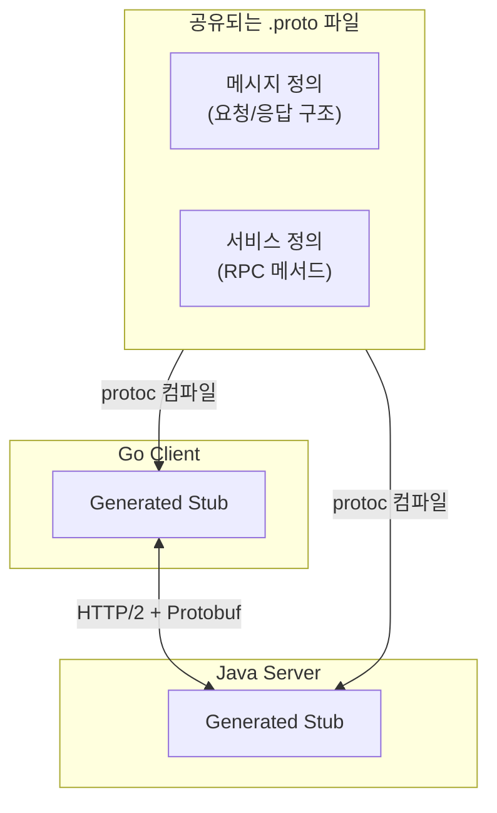
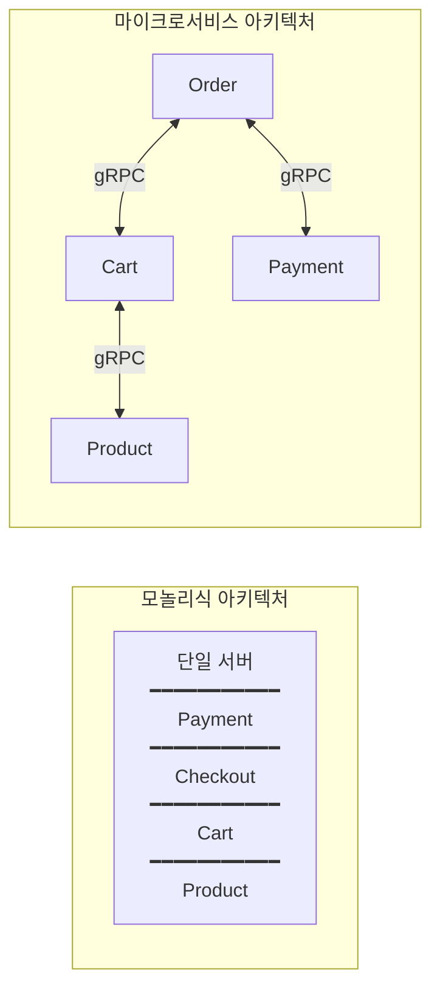
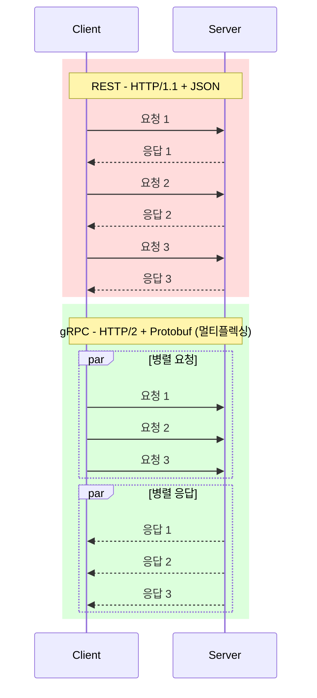
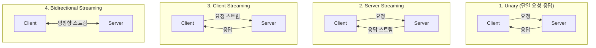
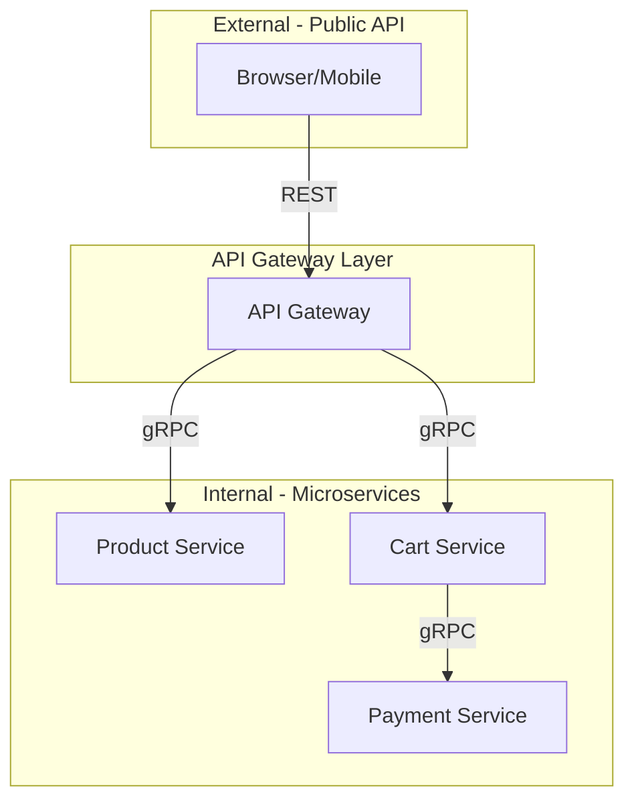

# 01. Go gRPC 마이크로서비스 소개

---

## 핵심 개념 상세 설명

### 1. gRPC란 무엇인가?

gRPC(gRPC Remote Procedure Call)는 Google이 2015년에 공개한 오픈소스 원격 프로시저 호출 프레임워크입니다. 이 프레임워크는 클라이언트 애플리케이션이 마치 로컬 객체의 메서드를 호출하듯이 다른 머신에 있는 서버 애플리케이션의 메서드를 직접 호출할 수 있게 해줍니다. 분산 애플리케이션과 서비스를 더 쉽게 만들 수 있도록 설계되었습니다.

gRPC의 핵심 특징은 **Protocol Buffers를 사용한 바이너리 직렬화**와 **HTTP/2 프로토콜 기반**이라는 점입니다. Protocol Buffers는 구조화된 데이터를 직렬화하기 위한 언어 중립적이고 플랫폼 중립적인 확장 가능한 메커니즘입니다. HTTP/2는 멀티플렉싱, 헤더 압축, 서버 푸시 등의 고급 기능을 제공합니다.

gRPC를 **"만국 공통 언어 통역사"**로 비유할 수 있습니다. Java, Go, Python 등 서로 다른 언어로 작성된 서비스들이 Protocol Buffers라는 공통 언어로 소통하고, gRPC가 이를 각 언어에 맞게 번역해주는 역할을 담당합니다. 서버와 클라이언트가 서로 다른 프로그래밍 언어로 작성되어 있어도 `.proto` 파일만 공유하면 상호 운용이 가능합니다.

### 2. 마이크로서비스 아키텍처의 이해

마이크로서비스 아키텍처는 애플리케이션을 **느슨하게 결합된 작은 서비스들의 집합**으로 구성하는 소프트웨어 개발 접근법입니다. 각 서비스는 특정 비즈니스 기능을 담당하며, 독립적으로 개발하고 배포하고 확장할 수 있습니다. 이는 하나의 큰 코드베이스에 모든 기능이 포함된 모놀리식 아키텍처와 대비됩니다.

모놀리식에서는 모든 모듈이 하나의 프로세스 내에서 클래스 메서드 호출로 통신합니다. 반면 마이크로서비스에서는 각 서비스가 **독립적인 프로세스**로 실행되며, **네트워크를 통해 통신**합니다. 이러한 구조적 차이는 배포, 확장, 장애 격리 측면에서 근본적인 차이를 만들어냅니다.

### 3. gRPC가 마이크로서비스에 적합한 이유

gRPC가 마이크로서비스 환경에서 REST보다 선호되는 이유는 크게 다섯 가지입니다.

**첫째, 성능입니다.** Protocol Buffers는 바이너리 직렬화를 사용하여 JSON보다 훨씬 작은 페이로드를 생성합니다. 또한 HTTP/2의 멀티플렉싱 기능을 활용하여 하나의 TCP 연결에서 여러 요청과 응답을 동시에 처리할 수 있어 네트워크 효율성을 극대화합니다.

**둘째, 코드 생성과 상호운용성입니다.** `.proto` 파일에서 자동으로 클라이언트와 서버 스텁이 생성되므로, 수동으로 공유 라이브러리를 만들 필요가 없습니다. 서비스 정의가 변경되면 **컴파일 타임에 오류를 감지**할 수 있어 타입 안전성이 보장됩니다.

**셋째, 내장된 장애 허용(Fault Tolerance) 기능입니다.** gRPC는 재시도 정책, Rate Limiting, Circuit Breaker, Fault Injection 등의 기능을 지원하여 분산 환경에서의 안정성을 높입니다. 특히 **멱등성(Idempotency)**을 지원하여 동일한 요청을 여러 번 호출해도 같은 결과를 보장합니다.

**넷째, 보안입니다.** gRPC는 HTTP/2 위에서 동작하며, TLS/SSL 기반의 암호화와 인증을 기본적으로 지원합니다. Google Cloud 환경에서는 ALTS(Application Layer Transport Security)도 사용할 수 있습니다.

**다섯째, 스트리밍입니다.** gRPC는 네 가지 통신 패턴을 지원하여 다양한 사용 사례에 대응할 수 있습니다.

| 패턴 | 설명 | 사용 사례 |
|------|------|----------|
| **Unary** | 단일 요청, 단일 응답 | 일반적인 API 호출, 사용자 조회 |
| **Server Streaming** | 단일 요청, 여러 응답 | 대용량 데이터 전송, 실시간 주가 정보 |
| **Client Streaming** | 여러 요청, 단일 응답 | 파일 업로드, 센서 데이터 배치 전송 |
| **Bidirectional** | 양방향 스트림 | 실시간 채팅, 멀티플레이어 게임 |

### 4. REST vs gRPC 상세 비교

두 기술의 차이를 이해하는 것은 아키텍처 결정에 매우 중요합니다. REST는 웹 표준과의 호환성이 뛰어나고 브라우저에서 직접 사용할 수 있는 반면, gRPC는 높은 성능과 강력한 타입 안전성을 제공합니다.

| 구분 | REST | gRPC |
|------|------|------|
| **프로토콜** | HTTP/1.1 (HTTP/2는 커스텀 구현 필요) | HTTP/2 내장 |
| **데이터 형식** | JSON, XML (텍스트 기반) | Protocol Buffers (바이너리) |
| **스트리밍** | 별도 구현 필요 (WebSocket 등) | 네 가지 스트리밍 패턴 내장 |
| **코드 생성** | Swagger Codegen 등 외부 도구 | 내장 코드 생성기 (protoc) |
| **브라우저 지원** | 완전 지원 | gRPC-Web 프록시 필요 |
| **가독성** | JSON 직접 확인 가능 | 바이너리라 직접 확인 어려움 |
| **스키마 변경** | 유연함 (검증 없이 변경 가능) | 엄격함 (규칙 준수 필요) |

### 5. gRPC 사용 시기 판단

gRPC가 적합한 상황과 그렇지 않은 상황을 구분하는 것이 중요합니다. 기술 선택은 항상 트레이드오프를 수반하며, 팀의 역량과 프로젝트의 특성을 고려해야 합니다.

**gRPC가 적합한 경우:**
- **Polyglot 환경**에서 다중 언어로 작성된 서비스 간 통신이 필요할 때
- **마이크로서비스 간 내부 통신**에서 높은 성능이 요구될 때
- **저지연 실시간 처리**가 필요한 시스템에서
- 여러 언어로 **클라이언트 SDK를 제공**해야 할 때

**gRPC가 부적합한 경우:**
- **브라우저에서 직접 통신**이 필요한 경우 (gRPC-Web 프록시 또는 REST 게이트웨이 필요)
- 1-2개 서비스만 있는 **단순한 스타트업 프로젝트** (오버헤드가 클 수 있음)
- Proto 파일 유지보수 경험이 부족한 팀 (학습 곡선 존재)

### 6. 하이브리드 아키텍처 패턴

실무에서는 REST와 gRPC를 함께 사용하는 하이브리드 접근법이 일반적입니다. 외부에는 REST API를 노출하고, 내부 마이크로서비스 간에는 gRPC를 사용하면 **브라우저 호환성과 내부 통신 성능**을 모두 확보할 수 있습니다.

이 패턴의 장점은 세 가지입니다. **첫째**, 브라우저와 모바일 클라이언트는 친숙한 REST API를 사용할 수 있습니다. **둘째**, 내부 서비스 간에는 gRPC의 고성능 통신을 활용합니다. **셋째**, API Gateway에서 인증, 로깅, Rate Limiting 등을 중앙 집중화할 수 있습니다.

### 7. Go 언어와 gRPC의 시너지

Go 언어가 마이크로서비스 개발에 특히 적합한 이유가 있습니다. Go는 Google에서 개발한 언어로, gRPC와 자연스럽게 통합됩니다.

**빠른 컴파일 속도**로 빠른 빌드 및 배포 사이클이 가능합니다. 대규모 코드베이스에서도 수 초 내에 컴파일이 완료됩니다.

**단일 바이너리 컴파일**로 의존성 없는 실행 파일을 생성할 수 있습니다. JVM이나 인터프리터가 필요 없어 컨테이너 이미지 크기를 최소화할 수 있습니다.

**경량 런타임**으로 메모리 사용량이 적고 시작 시간이 빠릅니다. Kubernetes 환경에서 스케일링할 때 Pod가 빠르게 시작됩니다.

**Goroutine을 통한 동시성 지원**으로 수천 개의 동시 연결을 효율적으로 처리할 수 있습니다. 각 gRPC 요청을 별도의 Goroutine에서 처리하여 높은 처리량을 달성합니다.

**풍부한 표준 라이브러리**로 HTTP, JSON, 암호화, 테스트 등 마이크로서비스 개발에 필요한 대부분의 기능이 기본 제공됩니다.

---

## 면접 예상 질문 및 모범 답안

### Q1. gRPC가 REST보다 성능이 좋은 이유를 설명해주세요.

**모범 답안:**

gRPC가 REST보다 성능이 좋은 이유는 크게 세 가지입니다.

첫째, **데이터 직렬화 방식의 차이**입니다. REST는 JSON이나 XML 같은 텍스트 기반 형식을 사용하는 반면, gRPC는 Protocol Buffers라는 바이너리 직렬화를 사용합니다. 바이너리 형식은 텍스트 형식보다 파싱 속도가 빠르고, 같은 데이터를 표현할 때 크기가 훨씬 작습니다. 예를 들어, JSON으로 100바이트인 데이터가 Protobuf로는 30-50바이트 정도로 줄어들 수 있습니다.

둘째, **HTTP/2 프로토콜의 이점**입니다. gRPC는 HTTP/2를 기본으로 사용하여 멀티플렉싱, 헤더 압축, 서버 푸시 기능을 활용합니다. 멀티플렉싱을 통해 하나의 TCP 연결에서 여러 요청과 응답을 동시에 처리할 수 있어 연결 오버헤드가 줄어듭니다. HPACK 알고리즘을 통한 헤더 압축으로 반복되는 헤더 정보의 전송량도 감소합니다.

셋째, **스트리밍 지원**입니다. gRPC는 양방향 스트리밍을 네이티브로 지원하여, 대용량 데이터 전송이나 실시간 통신에서 연결 설정 오버헤드를 최소화할 수 있습니다.

---

### Q2. gRPC의 4가지 통신 패턴을 설명하고, 각각의 사용 사례를 말씀해주세요.

**모범 답안:**
gRPC는 네 가지 통신 패턴을 지원합니다.

**첫째, Unary RPC**입니다. 클라이언트가 단일 요청을 보내고 서버가 단일 응답을 반환하는 가장 기본적인 패턴입니다. 일반적인 API 호출, 예를 들어 사용자 정보 조회나 주문 생성 같은 경우에 사용합니다.

**둘째, Server Streaming RPC**입니다. 클라이언트가 단일 요청을 보내면 서버가 스트림으로 여러 응답을 반환합니다. 대용량 데이터를 분할하여 전송하거나, 실시간 주가 정보처럼 서버에서 지속적으로 데이터를 푸시해야 하는 경우에 적합합니다.

**셋째, Client Streaming RPC**입니다. 클라이언트가 스트림으로 여러 요청을 보내고 서버가 단일 응답을 반환합니다. 파일 업로드나 센서 데이터를 배치로 전송하는 경우에 사용합니다.

**넷째, Bidirectional Streaming RPC**입니다. 클라이언트와 서버 모두 스트림으로 데이터를 주고받습니다. 실시간 채팅, 멀티플레이어 게임, 협업 도구 등 양방향 실시간 통신이 필요한 경우에 적합합니다.

---

### Q3. 멱등성(Idempotency)이란 무엇이고, 왜 분산 시스템에서 중요한가요?

**모범 답안:**

멱등성이란 **동일한 연산을 여러 번 수행해도 결과가 한 번 수행한 것과 동일한 특성**을 말합니다. 수학적으로 f(f(x)) = f(x)를 만족하는 함수가 멱등적입니다.

분산 시스템에서 멱등성이 중요한 이유는 **네트워크 불확실성** 때문입니다. 클라이언트가 서버에 요청을 보냈는데 응답을 받지 못하면, 요청이 처리되었는지 알 수 없습니다. 이 상황에서 클라이언트는 보통 요청을 재시도합니다.

만약 "사용자 삭제"와 같은 연산이 멱등적이라면, 같은 사용자 삭제 요청이 두 번 전송되어도 결과는 동일합니다. 이미 삭제된 사용자를 다시 삭제하는 것은 아무 변화를 주지 않습니다. 반면, 멱등적이지 않은 **"계좌에서 1만원 출금"** 연산은 두 번 실행되면 2만원이 출금되어 심각한 문제가 발생할 수 있습니다.

gRPC는 재시도 정책을 내장하고 있어, 멱등적으로 설계된 API와 함께 사용하면 네트워크 장애 시에도 안전하게 복구할 수 있습니다.

---

### Q4. gRPC를 브라우저에서 직접 사용할 수 없는 이유와 해결 방법을 설명해주세요.

**모범 답안:**

gRPC를 브라우저에서 직접 사용할 수 없는 이유는 gRPC가 **HTTP/2의 저수준 기능들을 필요로 하는데, 브라우저의 JavaScript API가 이러한 기능에 대한 직접적인 접근을 제공하지 않기 때문**입니다.

구체적으로, gRPC는 HTTP/2 프레이밍, 바이너리 프로토콜, 트레일러 헤더 등을 사용하는데, 브라우저의 Fetch API나 XMLHttpRequest는 이러한 기능을 지원하지 않습니다.

이 문제를 해결하는 방법은 크게 두 가지입니다.

**첫째, gRPC-Web을 사용하는 방법**입니다. gRPC-Web은 브라우저와 gRPC 서버 사이에 프록시를 두어 HTTP/1.1이나 HTTP/2로 변환해주는 솔루션입니다. Envoy 프록시나 grpc-web 프록시가 이 역할을 담당합니다.

**둘째, REST 게이트웨이를 사용하는 방법**입니다. grpc-gateway 같은 도구를 사용하여 REST API를 gRPC 서비스 앞에 노출하고, 브라우저는 REST로 통신하고 게이트웨이가 이를 gRPC로 변환합니다.

실무에서는 외부 클라이언트(브라우저, 모바일)에는 REST API를 노출하고, 내부 마이크로서비스 간에는 gRPC를 사용하는 하이브리드 아키텍처를 많이 채택합니다.

---

### Q5. Go 언어가 마이크로서비스 개발에 적합한 이유를 설명해주세요.

**모범 답안:**

Go 언어가 마이크로서비스 개발에 적합한 이유는 여러 가지가 있습니다.

**첫째, 빠른 컴파일 속도**입니다. Go는 컴파일 속도가 매우 빨라서 대규모 코드베이스에서도 빠른 빌드-테스트-배포 사이클을 유지할 수 있습니다. 이는 마이크로서비스 환경에서 빈번한 배포가 필요할 때 큰 장점입니다.

**둘째, 단일 바이너리 컴파일**입니다. Go는 정적으로 링크된 단일 실행 파일을 생성합니다. 별도의 런타임이나 의존성 라이브러리가 필요 없어서 컨테이너 이미지 크기를 최소화할 수 있습니다. scratch 베이스 이미지에 바이너리만 넣어도 실행이 가능합니다.

**셋째, 경량 런타임**입니다. Go 애플리케이션은 메모리 사용량이 적고 시작 시간이 빠릅니다. 이는 Kubernetes 환경에서 스케일링할 때 중요한 요소입니다.

**넷째, 네이티브 동시성 지원**입니다. Goroutine과 Channel을 통해 동시성 프로그래밍이 쉽습니다. 수천 개의 동시 연결을 처리하는 gRPC 서버를 효율적으로 구현할 수 있습니다.

**다섯째, 풍부한 표준 라이브러리**입니다. HTTP, JSON, 암호화, 테스트 등 마이크로서비스 개발에 필요한 대부분의 기능이 표준 라이브러리로 제공됩니다.

---

### Q6. 마이크로서비스 아키텍처에서 모놀리식 대비 장단점을 설명해주세요.

**모범 답안:**

마이크로서비스 아키텍처의 장점은 다음과 같습니다.

**첫째, 독립적인 배포**입니다. 각 서비스를 독립적으로 배포할 수 있어서 전체 시스템을 재배포하지 않고도 특정 기능을 업데이트할 수 있습니다.

**둘째, 기술 다양성**입니다. 서비스마다 최적의 기술 스택을 선택할 수 있습니다. 예를 들어, 데이터 처리 서비스는 Python으로, API 서비스는 Go로 작성할 수 있습니다.

**셋째, 개별 확장성**입니다. 부하가 집중되는 서비스만 선택적으로 스케일 아웃할 수 있어 리소스를 효율적으로 사용할 수 있습니다.

**넷째, 장애 격리**입니다. 하나의 서비스에 장애가 발생해도 전체 시스템이 다운되지 않고, 해당 기능만 영향을 받습니다.

반면 단점도 있습니다.

**첫째, 운영 복잡성**입니다. 수십 개의 서비스를 배포, 모니터링, 관리해야 하므로 DevOps 역량이 필요합니다.

**둘째, 분산 시스템의 복잡성**입니다. 네트워크 지연, 분산 트랜잭션, 데이터 일관성 등 분산 시스템 고유의 문제를 해결해야 합니다.

**셋째, 초기 설정 비용**입니다. CI/CD 파이프라인, 서비스 디스커버리, 모니터링 인프라 등을 구축하는 데 초기 투자가 필요합니다.

따라서 프로젝트 규모와 팀 역량을 고려하여 적절한 시점에 마이크로서비스로 전환하는 것이 중요합니다.

---

## 실무 체크리스트

### gRPC 도입 전 검토 사항

- [ ] 서비스 간 내부 통신이 주요 사용 케이스인가?
- [ ] 다중 언어 환경에서 클라이언트 SDK가 필요한가?
- [ ] 저지연, 고처리량이 요구되는가?
- [ ] 팀이 Protocol Buffers 학습에 투자할 의향이 있는가?
- [ ] 브라우저 직접 통신이 필요하다면 gRPC-Web 또는 REST 게이트웨이 계획이 있는가?

### gRPC 디버깅 도구

- [ ] **grpcurl** - gRPC 서비스 테스트용 CLI 도구
- [ ] **BloomRPC** - gRPC GUI 클라이언트
- [ ] **Postman** - gRPC 지원 추가됨
- [ ] **grpc-tools** - Proto 파일 검증 및 디버깅

---

## 참고 자료

- gRPC 공식 문서: https://grpc.io/docs/
- Protocol Buffers 가이드: https://developers.google.com/protocol-buffers
- gRPC-Web: https://github.com/grpc/grpc-web
- Connect RPC (차세대 RPC 프레임워크): https://connect.build
