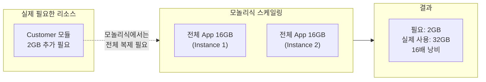
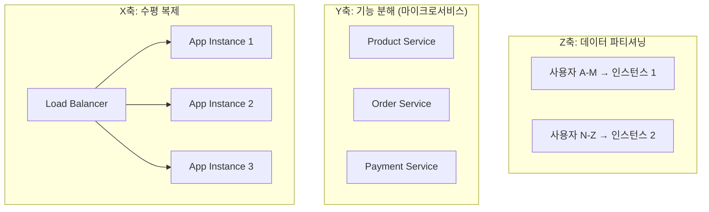
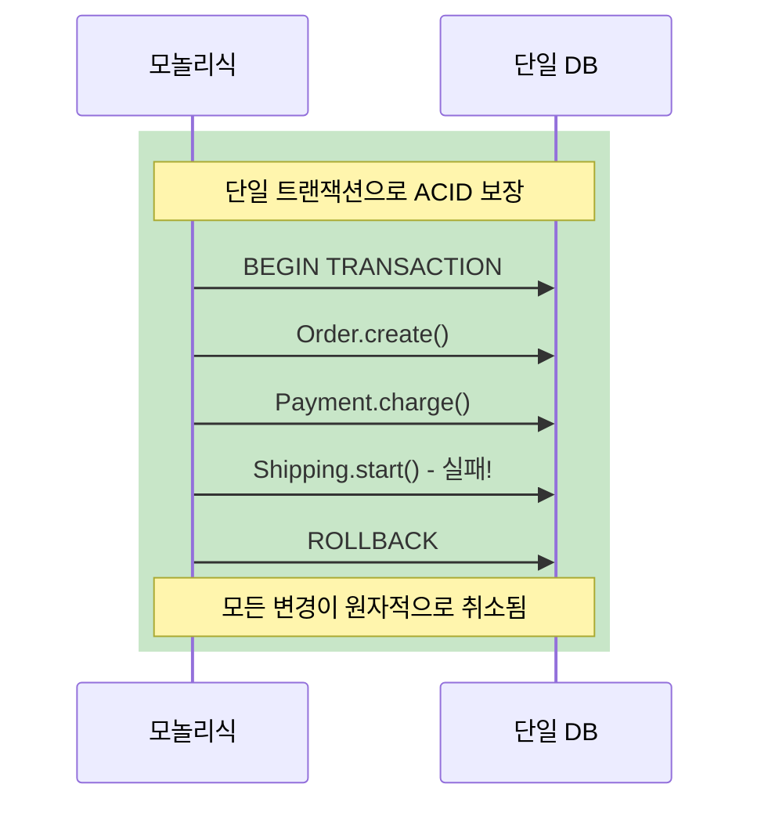
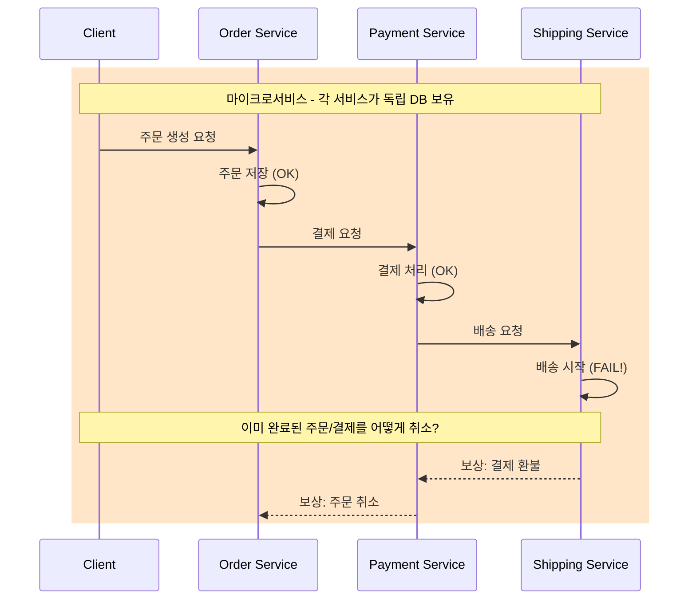
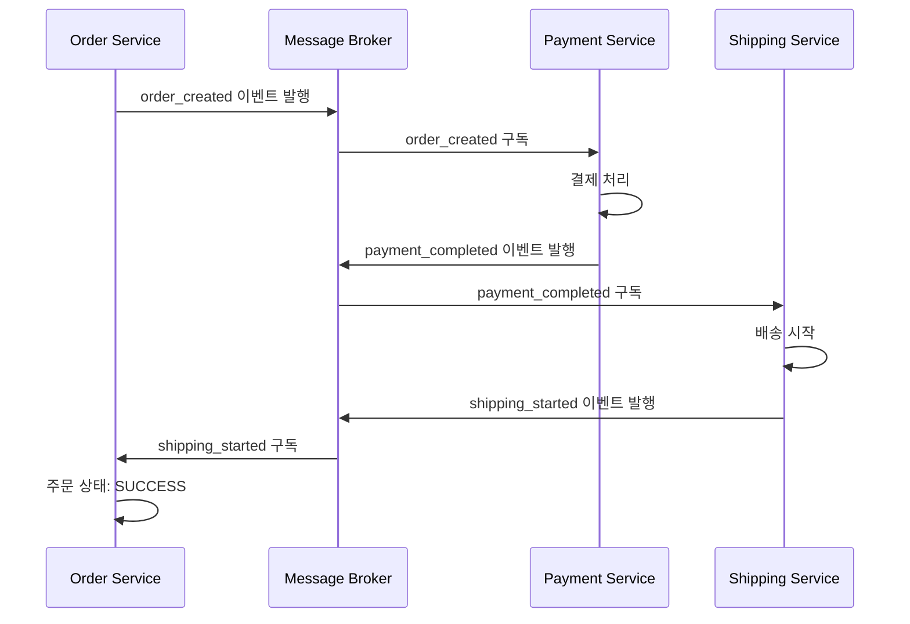
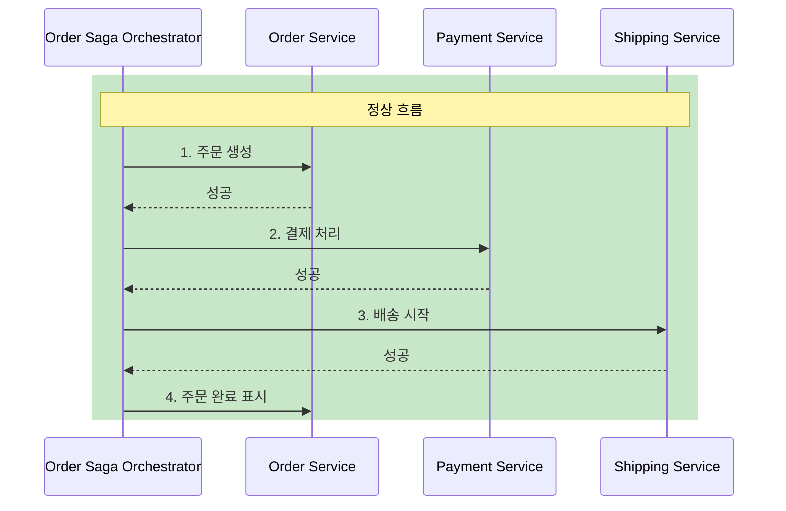
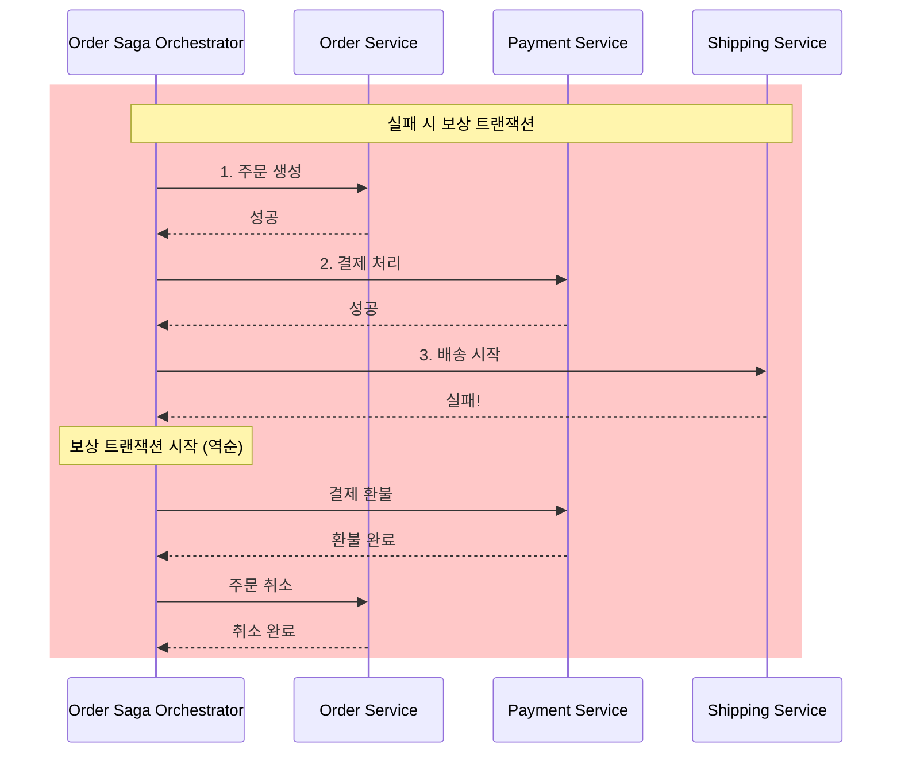
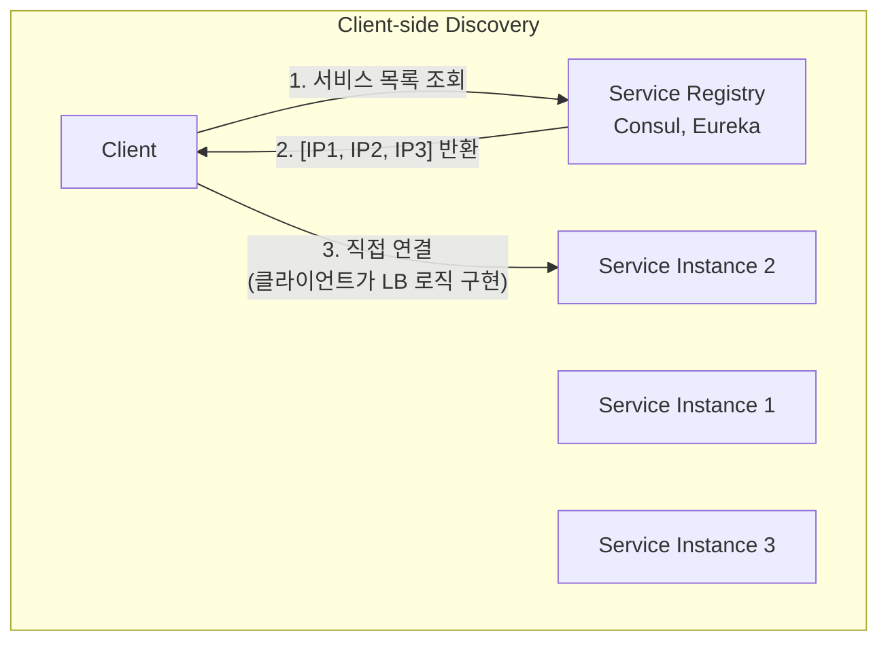
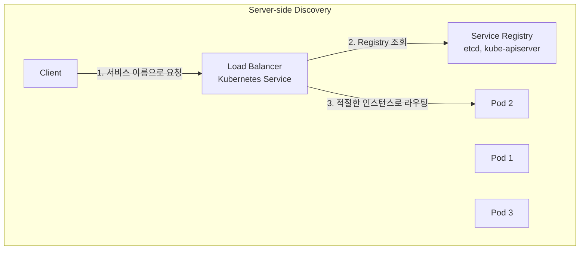

# 02. gRPC와 마이크로서비스의 만남

---

## 핵심 개념 상세 설명

### 1. 모놀리식 아키텍처의 한계

모놀리식 아키텍처는 사용자 인터페이스, 비즈니스 로직, 데이터 접근 계층이 하나의 배포 단위로 결합된 전통적인 애플리케이션 구조입니다. 초기 개발 단계에서는 단순하고 직관적이지만, 시스템이 성장함에 따라 여러 구조적 문제가 발생합니다.

**개발 측면의 한계**를 살펴보면, 코드베이스가 수십만 줄로 커지면서 IDE의 인덱싱과 빌드 시간이 기하급수적으로 증가합니다. 뉴스레터 기능 하나를 수정하더라도 전체 테스트 스위트를 실행해야 하며, 여러 팀이 동일한 코드베이스에서 작업하다 보니 merge conflict가 빈번하게 발생합니다.

**배포 측면의 한계**는 더욱 심각합니다. 결제 모듈의 버그를 수정하기 위해 주문, 배송, 고객 서비스 모듈까지 모두 재배포해야 합니다. 다른 팀의 불안정한 기능 때문에 배포 일정이 지연되는 상황도 흔히 발생합니다. 금요일 오후에 긴급 핫픽스가 필요한데, 다른 팀의 미완성 코드 때문에 배포가 불가능한 상황을 상상해보면 이 문제의 심각성을 이해할 수 있습니다.

**스케일링 측면의 비효율**은 모놀리식의 가장 치명적인 약점입니다. 다음 그림은 이 비효율을 명확하게 보여줍니다.



전체 애플리케이션이 16GB 메모리를 사용하는데 Customer 모듈만 2GB 추가가 필요한 상황을 생각해봅시다. 모놀리식에서는 전체 16GB짜리 인스턴스를 하나 더 띄워야 하므로 32GB를 사용하게 됩니다. 반면 마이크로서비스에서는 Customer 서비스만 2GB 인스턴스를 추가하면 됩니다. 이것이 바로 **필요한 부분만 확장**할 수 있는 마이크로서비스의 핵심 이점입니다.

### 2. Scale Cube 모델

Scale Cube는 애플리케이션 확장성을 세 가지 직교하는 축으로 설명하는 개념적 프레임워크입니다. 이 모델은 Martin Abbott과 Michael Fisher가 저서 "The Art of Scalability"에서 제시한 것으로, 확장성 문제를 체계적으로 분석하고 해결하는 데 널리 사용됩니다.



**X축 스케일링(수평 복제)**은 동일한 애플리케이션을 여러 인스턴스로 복제하여 로드 밸런서 뒤에 배치하는 가장 기본적인 확장 방식입니다. 각 인스턴스는 동일한 코드를 실행하고 전체 데이터에 접근할 수 있습니다. 구현이 단순하고 N개의 인스턴스가 N배의 처리량을 제공하지만, 캐시 메모리 사용이 비효율적이고 데이터베이스가 병목이 될 수 있습니다.

**Z축 스케일링(데이터 파티셔닝)**은 각 인스턴스가 데이터의 특정 서브셋만 담당하는 방식입니다. 예를 들어, 사용자 이름이 A-M으로 시작하면 인스턴스 1로, N-Z로 시작하면 인스턴스 2로 라우팅합니다. 비용 효율적이고 장애 격리(fault isolation)가 가능하지만, 파티셔닝 키를 신중하게 선택해야 하고 데이터 재파티셔닝이 복잡합니다. 파티셔닝 키의 분포가 균등하지 않으면 특정 인스턴스에 부하가 집중되는 핫스팟(hotspot) 문제가 발생합니다.

**Y축 스케일링(기능 분해)**은 비즈니스 기능별로 애플리케이션을 분리하는 방식으로, 이것이 바로 **마이크로서비스 아키텍처**입니다. Product, Order, Payment, Shipping 등 각각이 독립적인 서비스가 되어 독자적인 데이터베이스와 배포 파이프라인을 가집니다. 각 서비스를 담당 팀이 독립적으로 개발, 배포, 스케일링할 수 있으며, 기술 스택도 서비스별로 최적의 선택이 가능합니다.

### 3. 분산 트랜잭션과 Saga 패턴

마이크로서비스 아키텍처에서 가장 도전적인 문제 중 하나가 **데이터 일관성**입니다. 모놀리식에서는 단일 데이터베이스의 ACID 트랜잭션으로 일관성을 보장할 수 있었지만, 마이크로서비스에서는 각 서비스가 자체 데이터베이스를 소유하므로 서비스 경계를 넘는 트랜잭션이 필요합니다.





**Saga 패턴**은 이 문제를 해결하기 위해 분산 트랜잭션을 **로컬 트랜잭션의 시퀀스**로 분해합니다. 각 로컬 트랜잭션은 해당 서비스의 데이터베이스만 업데이트하고, 다음 서비스를 트리거하는 이벤트나 메시지를 발행합니다. 중간에 실패가 발생하면 **보상 트랜잭션(Compensating Transaction)**을 역순으로 실행하여 이전 변경사항을 되돌립니다.

Saga 패턴에는 두 가지 구현 방식이 있으며, 각각의 특성이 뚜렷합니다.

#### Choreography 방식

Choreography는 **이벤트 기반의 분산 조정** 방식입니다. 각 서비스가 작업을 완료한 후 이벤트를 발행하고, 관련 서비스가 이 이벤트를 구독하여 다음 작업을 수행합니다. 중앙 조정자 없이 서비스들이 마치 안무(choreography)처럼 협력합니다.



Choreography의 장점은 서비스 간 결합도가 낮아 각 서비스가 독립적으로 진화할 수 있다는 점입니다. 새로운 서비스를 추가해도 기존 서비스의 코드를 수정할 필요가 없습니다. 반면, 전체 트랜잭션 흐름이 여러 서비스에 분산되어 있어 디버깅과 모니터링이 어렵고, 복잡한 Saga에서는 이벤트 체인이 꼬일 수 있습니다.

#### Orchestrator 방식

Orchestrator는 **중앙 조정자가 전체 Saga를 관리**하는 방식입니다. Orchestrator가 각 서비스에 명령을 보내고 응답을 받아 다음 단계를 결정합니다.





Orchestrator의 장점은 전체 흐름이 한 곳에 정의되어 **가시성이 좋고 디버깅이 용이**하다는 점입니다. 복잡한 비즈니스 로직이나 여러 조건 분기가 있는 Saga에 적합합니다. 단점은 Orchestrator가 **단일 장애점(Single Point of Failure)**이 될 수 있고, 서비스들이 Orchestrator에 의존하게 된다는 것입니다.

| 비교 항목 | Choreography | Orchestrator |
|----------|--------------|--------------|
| 조정 방식 | 이벤트 기반 분산 | 중앙 조정자 관리 |
| 서비스 결합도 | 느슨함 (이벤트만 공유) | Orchestrator에 의존 |
| 흐름 추적 | 어려움 (분산된 로그) | 용이함 (중앙화된 상태) |
| 장애 지점 | 분산 | Orchestrator |
| 적합한 Saga 복잡도 | 단순 (3-4단계) | 복잡 (조건 분기 포함) |

### 4. 서비스 디스커버리

분산 환경에서 서비스 인스턴스의 위치(IP 주소, 포트)는 동적으로 변합니다. 오토스케일링으로 인스턴스가 추가되거나 제거되고, 장애로 인해 새로운 인스턴스가 다른 호스트에서 시작될 수 있습니다. **서비스 디스커버리**는 클라이언트가 이러한 동적 환경에서 서버의 현재 위치를 찾는 메커니즘입니다.





**Client-side Discovery**에서는 클라이언트가 Service Registry(Consul, Eureka 등)에 직접 질의하여 사용 가능한 인스턴스 목록을 가져옵니다. 클라이언트는 로드 밸런싱 알고리즘(라운드 로빈, 가중치 기반 등)을 직접 구현하여 어느 인스턴스에 요청을 보낼지 결정합니다. 로드 밸런서가 중간에 없으므로 네트워크 홉이 줄어들고 병목이 발생하지 않지만, 클라이언트 로직이 복잡해지고 각 언어별로 디스커버리 라이브러리를 구현해야 합니다.

**Server-side Discovery**에서는 클라이언트가 로드 밸런서에 요청을 보내면, 로드 밸런서가 Service Registry를 조회하여 적절한 인스턴스로 라우팅합니다. 클라이언트는 서비스 인스턴스의 존재 자체를 모르고, 단일 엔드포인트(서비스 이름 또는 VIP)만 알면 됩니다. 클라이언트 로직이 단순해지지만, 로드 밸런서가 추가적인 네트워크 홉이 되고 단일 장애점이 될 수 있습니다.

**Kubernetes**는 Server-side Discovery를 사용합니다. Kubernetes Service 리소스가 로드 밸런서 역할을 하고, kube-proxy가 서비스의 ClusterIP로 들어오는 트래픽을 적절한 Pod로 라우팅합니다. 서비스 이름이 DNS로 해결되므로 클라이언트는 `payment-service:50051`과 같이 서비스 이름만 알면 됩니다. 별도의 Service Registry 클라이언트 라이브러리가 필요 없어 언어 종속성 문제도 해결됩니다.

### 5. gRPC를 활용한 서비스 간 통신

마이크로서비스에서 gRPC를 사용하면 **.proto 파일로 서비스 계약을 명시적으로 정의**하고, **자동 생성된 스텁**을 통해 타입 안전한 통신이 가능합니다. 이는 REST API에서 OpenAPI 스펙을 별도로 관리하고 수동으로 클라이언트를 구현하는 것보다 훨씬 효율적입니다.

```protobuf
// payment.proto - 서비스 계약 정의
syntax = "proto3";

option go_package = "github.com/example/payment";

message CreatePaymentRequest {
    float price = 1;
    string order_id = 2;
    string currency = 3;
}

message CreatePaymentResponse {
    int64 bill_id = 1;
    string status = 2;
    string transaction_id = 3;
}

service Payment {
    rpc Create(CreatePaymentRequest) returns (CreatePaymentResponse) {}
}
```

이 .proto 파일에서 `protoc` 컴파일러로 Go 코드를 생성하면, 클라이언트는 자동 생성된 스텁을 사용하여 원격 서비스를 마치 **로컬 함수처럼** 호출할 수 있습니다.

```go
// gRPC 클라이언트 코드 예시
func CreatePayment(ctx context.Context) (*pb.CreatePaymentResponse, error) {
    // 연결 설정 - Kubernetes에서는 서비스 이름으로 디스커버리
    conn, err := grpc.Dial("payment-service:50051",
        grpc.WithTransportCredentials(insecure.NewCredentials()),
    )
    if err != nil {
        return nil, fmt.Errorf("failed to connect: %w", err)
    }
    defer conn.Close()  // 연결 정리 - 리소스 누수 방지

    // 자동 생성된 클라이언트 스텁 사용
    client := pb.NewPaymentClient(conn)

    // 타임아웃 설정 - 분산 환경에서 필수
    ctx, cancel := context.WithTimeout(ctx, 10*time.Second)
    defer cancel()

    // 원격 호출이 로컬 함수 호출처럼 보임
    return client.Create(ctx, &pb.CreatePaymentRequest{
        Price:    99.99,
        OrderId:  "order-123",
        Currency: "KRW",
    })
}
```

위 코드에서 주목해야 할 세 가지 중요한 패턴이 있습니다.

첫째, `context.WithTimeout`을 사용한 **타임아웃 설정**입니다. 분산 환경에서는 네트워크 장애, 서버 과부하, 무한 루프 등으로 응답이 오지 않을 수 있습니다. 타임아웃이 없으면 클라이언트 고루틴이 무한정 블로킹되어 리소스가 고갈될 수 있습니다.

둘째, `defer conn.Close()`를 통한 **연결 정리**입니다. gRPC 연결은 HTTP/2 위에서 동작하며 TCP 소켓을 점유합니다. 연결을 닫지 않으면 소켓 리소스가 누수되어 결국 "too many open files" 오류가 발생합니다.

셋째, **타임아웃 전파(Deadline Propagation)**입니다. gRPC는 Context를 통해 타임아웃이 서비스 체인 전체에 자동으로 전파됩니다. 클라이언트가 3초 타임아웃을 설정하고 Order 서비스를 호출했는데, Order 서비스 내부에서 2초가 소요되고 Payment 서비스를 호출한다면, Payment 서비스에는 1초만 남게 됩니다. 이 메커니즘 덕분에 서비스 체인 전체에서 일관된 타임아웃 정책이 적용됩니다.

---

## 면접 예상 질문 및 모범 답안

### Q1. Scale Cube의 세 가지 축을 설명하고, 마이크로서비스는 어느 축에 해당하는지 말씀해주세요.

**모범 답안:**

Scale Cube는 애플리케이션 확장성을 세 가지 직교하는 축으로 설명하는 개념적 프레임워크입니다.

X축은 수평 복제(Horizontal Duplication)로, 동일한 애플리케이션을 여러 인스턴스로 복제하여 로드 밸런서 뒤에 배치하는 방식입니다. 각 인스턴스가 전체 코드와 데이터에 접근할 수 있어 구현이 단순하지만, 특정 기능만 스케일링이 필요할 때도 전체를 복제해야 하는 비효율이 있습니다.

Z축은 데이터 파티셔닝(Data Partitioning)으로, 각 인스턴스가 데이터의 서브셋만 담당합니다. 사용자 ID나 지역 코드 등의 파티셔닝 키를 기준으로 요청을 특정 인스턴스로 라우팅합니다. 효율적이지만 파티셔닝 키 선택이 중요하고, 키 분포가 균등하지 않으면 핫스팟 문제가 발생합니다.

Y축은 기능 분해(Functional Decomposition)로, 비즈니스 기능별로 애플리케이션을 분리하는 것입니다. **마이크로서비스 아키텍처가 바로 Y축 스케일링의 구현**입니다. Product, Order, Payment 등 각 기능이 독립적인 서비스가 되어 개별적으로 개발, 배포, 스케일링이 가능합니다. 각 서비스는 자체 데이터베이스를 가지며, 담당 팀이 기술 스택도 독립적으로 선택할 수 있습니다.

실제 대규모 시스템에서는 세 축을 조합하여 사용합니다. 예를 들어, 기능별로 마이크로서비스로 분리하고(Y축), 각 서비스를 여러 인스턴스로 복제하며(X축), 대용량 데이터를 처리하는 서비스는 샤딩(Z축)을 적용합니다.

---

### Q2. Choreography와 Orchestrator Saga의 차이점을 설명하고, 각각 언제 사용하면 좋은지 말씀해주세요.

**모범 답안:**

Saga 패턴은 분산 트랜잭션을 로컬 트랜잭션의 시퀀스로 분해하는 패턴으로, Choreography와 Orchestrator 두 가지 구현 방식이 있습니다.

**Choreography Saga**는 이벤트 기반의 분산 조정 방식입니다. 각 서비스가 작업을 완료한 후 이벤트를 발행하고, 관련 서비스가 이를 구독하여 다음 작업을 수행합니다. 예를 들어, Order Service가 order_created 이벤트를 발행하면 Payment Service가 구독하여 결제를 처리하고, payment_completed 이벤트를 발행하는 식입니다. 서비스 간 결합도가 낮아 각 서비스가 독립적으로 진화할 수 있고, 새로운 서비스 추가 시 기존 코드를 수정할 필요가 없습니다. 하지만 전체 흐름이 여러 서비스에 분산되어 있어 디버깅이 어렵고, 복잡한 Saga에서는 이벤트 체인이 꼬일 수 있습니다.

**Orchestrator Saga**는 중앙 조정자가 전체 Saga를 관리하는 방식입니다. Orchestrator가 각 서비스에 순서대로 명령을 보내고, 실패 시 보상 트랜잭션을 역순으로 실행합니다. 전체 흐름이 한 곳에 정의되어 가시성이 좋고 디버깅이 용이합니다. 복잡한 비즈니스 로직이나 조건 분기가 있는 Saga에 적합합니다. 단점은 Orchestrator가 단일 장애점이 될 수 있고, 서비스들이 Orchestrator에 의존한다는 것입니다.

**사용 시나리오**를 말씀드리면, 단순한 3-4단계의 선형적인 Saga는 Choreography가 적합합니다. 이벤트 발행과 구독만으로 충분히 관리 가능하고, 결합도를 낮게 유지할 수 있습니다. 반면 조건 분기가 많거나 복잡한 보상 로직이 필요한 Saga는 Orchestrator가 적합합니다. 예를 들어, 결제 실패 시 재고 유형에 따라 다른 보상 로직을 적용해야 한다면 Orchestrator로 중앙에서 관리하는 것이 명확합니다.

---

### Q3. 분산 시스템에서 2PC와 Saga 패턴의 차이점과 각각의 적합한 사용 시나리오를 설명해주세요.

**모범 답안:**

**2PC(Two-Phase Commit)**는 분산 원자적 트랜잭션을 위한 프로토콜입니다. 코디네이터가 1단계(Prepare Phase)에서 모든 참여자에게 준비 요청을 보내고, 모두 "준비 완료"를 응답하면 2단계(Commit Phase)에서 커밋을 수행합니다. 하나라도 실패하면 전체를 롤백합니다. **강한 일관성(Strong Consistency)**을 보장하지만, Prepare 단계에서 모든 참여자가 락을 잡고 기다려야 하므로 블로킹이 발생합니다. 코디네이터 장애 시 전체 시스템이 멈출 수 있는 것도 치명적인 단점입니다.

**Saga 패턴**은 로컬 트랜잭션의 시퀀스로 분산 트랜잭션을 분해합니다. 각 단계가 독립적으로 커밋되고, 실패 시 보상 트랜잭션을 역순으로 실행합니다. **최종 일관성(Eventual Consistency)**을 보장하며, 논블로킹으로 성능이 좋습니다. 각 단계가 독립적으로 커밋되므로 중간 상태가 외부에 노출될 수 있고, 보상 트랜잭션 구현이 복잡할 수 있습니다.

**사용 시나리오**를 비교하면, 2PC는 강한 일관성이 필수이고 트랜잭션이 짧은 경우에 적합합니다. 예를 들어, 은행 간 실시간 계좌 이체에서 양쪽 잔액이 동시에 업데이트되어야 하는 경우입니다. Saga는 최종 일관성이 허용되고 트랜잭션이 긴 경우에 적합합니다. 예를 들어, 전자상거래 주문 처리에서 주문 생성, 결제, 재고 차감, 배송 예약이 각각 다른 시점에 완료되어도 되는 경우입니다.

**마이크로서비스 환경에서는 대부분 Saga 패턴을 사용합니다.** 2PC의 블로킹 특성과 코디네이터 의존성이 분산 환경의 확장성, 가용성 요구사항과 맞지 않기 때문입니다.

---

### Q4. 서비스 디스커버리의 두 가지 방식을 설명하고, Kubernetes에서는 어떤 방식을 사용하는지 말씀해주세요.

**모범 답안:**

서비스 디스커버리는 동적인 분산 환경에서 클라이언트가 서비스 인스턴스의 현재 위치를 찾는 메커니즘입니다. Client-side Discovery와 Server-side Discovery 두 가지 방식이 있습니다.

**Client-side Discovery**에서는 클라이언트가 Service Registry(Consul, Eureka 등)에 직접 질의하여 사용 가능한 인스턴스 목록을 가져옵니다. 클라이언트는 라운드 로빈, 가중치 기반 등의 로드 밸런싱 알고리즘을 직접 구현하여 어느 인스턴스에 요청을 보낼지 결정합니다. Netflix OSS의 Eureka와 Ribbon 조합이 대표적입니다. 로드 밸런서가 중간에 없으므로 네트워크 홉이 줄어들고 병목이 발생하지 않습니다. 하지만 클라이언트 로직이 복잡해지고, 각 언어별로 디스커버리 라이브러리를 구현해야 합니다.

**Server-side Discovery**에서는 클라이언트가 로드 밸런서나 API 게이트웨이에 요청을 보내면, 로드 밸런서가 Service Registry를 조회하여 적절한 인스턴스로 라우팅합니다. 클라이언트는 서비스 인스턴스의 존재 자체를 알 필요 없이 단일 엔드포인트만 알면 됩니다. 클라이언트 로직이 단순해지고 언어에 종속되지 않지만, 로드 밸런서가 추가적인 네트워크 홉이 되고 단일 장애점이 될 수 있습니다.

**Kubernetes는 Server-side Discovery**를 사용합니다. Kubernetes Service 리소스가 로드 밸런서 역할을 하고, kube-proxy가 서비스의 ClusterIP로 들어오는 트래픽을 적절한 Pod로 라우팅합니다. etcd에 저장된 Endpoints 정보를 기반으로 Pod의 추가/제거를 자동으로 감지합니다. 서비스 이름이 CoreDNS를 통해 DNS로 해결되므로, 클라이언트는 `payment-service:50051`과 같이 서비스 이름만 알면 됩니다. 별도의 디스커버리 클라이언트 라이브러리가 필요 없어 언어 종속성 문제가 해결됩니다.

---

### Q5. gRPC에서 context.WithTimeout을 사용하는 이유와, 타임아웃이 전파되는 방식을 설명해주세요.

**모범 답안:**

gRPC에서 `context.WithTimeout`을 사용하는 이유는 **네트워크 장애 시 무한 대기를 방지**하기 위해서입니다. 분산 환경에서는 서버가 응답하지 않거나, 네트워크가 단절되거나, 서버 처리가 지연되는 상황이 빈번하게 발생합니다. 타임아웃이 없으면 클라이언트 고루틴이 무한정 블로킹되어 고루틴 누수가 발생하고, 결국 메모리가 고갈되거나 "too many goroutines" 문제가 발생합니다.

gRPC의 중요한 기능 중 하나가 **타임아웃 전파(Deadline Propagation)**입니다. 클라이언트가 설정한 타임아웃이 Context를 통해 서비스 체인 전체에 자동으로 전파됩니다.

구체적인 예시를 들어보겠습니다. 클라이언트가 3초 타임아웃으로 Order 서비스를 호출합니다. Order 서비스 내부에서 1초가 소요된 후 Payment 서비스를 호출하면, gRPC는 자동으로 남은 2초만 Payment 서비스에 전달합니다. Payment 서비스 내부에서 1초가 소요된 후 Shipping 서비스를 호출하면, 1초만 남게 됩니다. 만약 Shipping 서비스가 1초 이상 소요되면, gRPC는 `DEADLINE_EXCEEDED` 에러를 반환하고 전체 호출 체인이 취소됩니다.

이 메커니즘의 핵심 이점은 **개발자가 각 서비스에서 남은 시간을 수동으로 계산할 필요 없이, Context만 전달하면 된다**는 것입니다. 서비스 체인 전체에서 일관된 타임아웃 정책이 자동으로 적용됩니다.

주의할 점은 타임아웃을 너무 짧게 설정하면 정상적인 요청도 실패하고, 너무 길게 설정하면 장애 상황에서 리소스가 오래 점유된다는 것입니다. 일반적으로 P99 응답 시간의 2-3배 정도를 타임아웃으로 설정하는 것이 좋습니다.

---

### Q6. Outbox 패턴이란 무엇이고, 언제 사용하나요?

**모범 답안:**

Outbox 패턴은 **데이터베이스 트랜잭션과 메시지 발행의 원자성을 보장**하기 위한 패턴입니다.

Saga 패턴에서 서비스가 데이터베이스를 업데이트하고 이벤트를 발행해야 할 때, 두 작업이 원자적으로 실행되지 않으면 일관성 문제가 발생합니다. 데이터베이스는 업데이트되었는데 이벤트 발행이 실패하면, 다른 서비스는 변경 사실을 알 수 없습니다. 반대로 이벤트는 발행되었는데 데이터베이스 트랜잭션이 롤백되면, 잘못된 정보가 전파됩니다. 이것이 바로 **이중 쓰기 문제(Dual Write Problem)**입니다.

Outbox 패턴의 해결 방법은 다음과 같습니다. 비즈니스 데이터와 함께 **Outbox 테이블에 발행할 이벤트를 같은 트랜잭션으로 저장**합니다. 별도의 프로세스(CDC 또는 폴링 기반)가 Outbox 테이블을 주기적으로 읽어 메시지 브로커에 발행합니다. 발행이 성공하면 Outbox 레코드를 삭제하거나 완료 표시합니다.

```sql
-- 같은 트랜잭션에서 실행
BEGIN TRANSACTION;
  INSERT INTO orders (id, status, ...) VALUES (...);
  INSERT INTO outbox (event_type, payload) VALUES ('OrderCreated', '...');
COMMIT;
```

이렇게 하면 데이터베이스 트랜잭션이 성공한 경우에만 Outbox에 이벤트가 저장되고, 결과적으로 이벤트가 발행됩니다. 메시지 브로커 발행이 일시적으로 실패해도 Outbox에 레코드가 남아있으므로 재시도가 가능합니다.

**CDC(Change Data Capture)**를 사용하면 데이터베이스의 트랜잭션 로그(binlog, WAL 등)를 실시간으로 캡처하여 폴링보다 더 빠르게 이벤트를 발행할 수 있습니다. Debezium이 대표적인 CDC 도구로, Kafka Connect와 함께 사용하여 데이터베이스 변경을 Kafka 토픽으로 스트리밍합니다.

---

## 실무 체크리스트

### 마이크로서비스 전환 시점 판단

- [ ] 특정 모듈만 독립적으로 스케일링이 필요한가?
- [ ] 코드베이스가 커져서 빌드/테스트 시간이 10분 이상 소요되는가?
- [ ] 팀 규모가 커져서 코드 소유권 분리가 필요한가?
- [ ] 서로 다른 기술 스택을 사용해야 하는 모듈이 있는가?
- [ ] 특정 모듈의 장애가 전체 시스템에 영향을 주고 있는가?

### Saga 구현 체크리스트

- [ ] 모든 단계에 보상 트랜잭션이 정의되어 있는가?
- [ ] 멱등성이 보장되는가? (동일 요청의 재시도가 안전한가?)
- [ ] 타임아웃과 재시도 정책이 설정되어 있는가?
- [ ] 실패 시 롤백 순서가 올바른가? (역순 실행)
- [ ] Outbox 패턴으로 이벤트 발행의 원자성을 보장하고 있는가?

### gRPC 클라이언트 체크리스트

- [ ] `context.WithTimeout`으로 적절한 타임아웃을 설정했는가?
- [ ] `defer conn.Close()`로 연결을 정리하고 있는가?
- [ ] 에러 코드(`codes.DeadlineExceeded`, `codes.Unavailable` 등)에 따른 처리가 있는가?
- [ ] 연결 풀링 또는 재사용을 고려했는가?

---

## 참고 자료

- [Microservices Patterns - Chris Richardson](https://microservices.io/patterns/)
- [Saga Pattern - Microsoft Azure Architecture](https://docs.microsoft.com/azure/architecture/reference-architectures/saga/saga)
- [Scale Cube Model](http://microservices.io/articles/scalecube.html)
- [Transactional Outbox Pattern](https://microservices.io/patterns/data/transactional-outbox.html)
- [The Art of Scalability - Martin Abbott, Michael Fisher](https://theartofscalability.com/)
