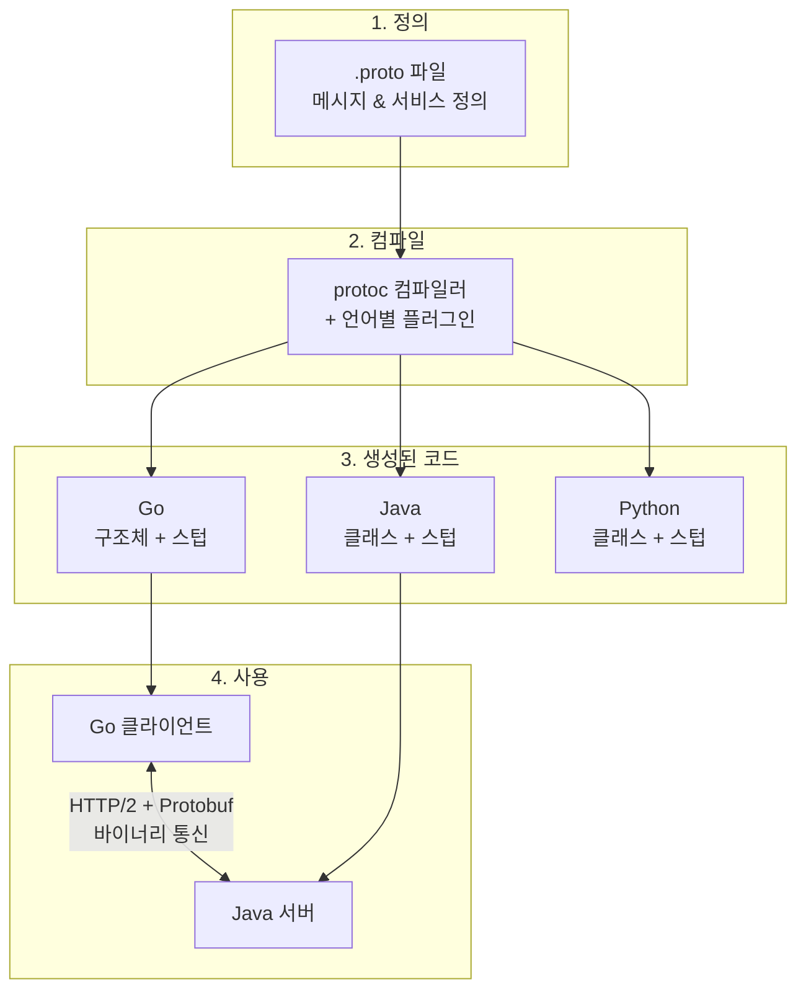
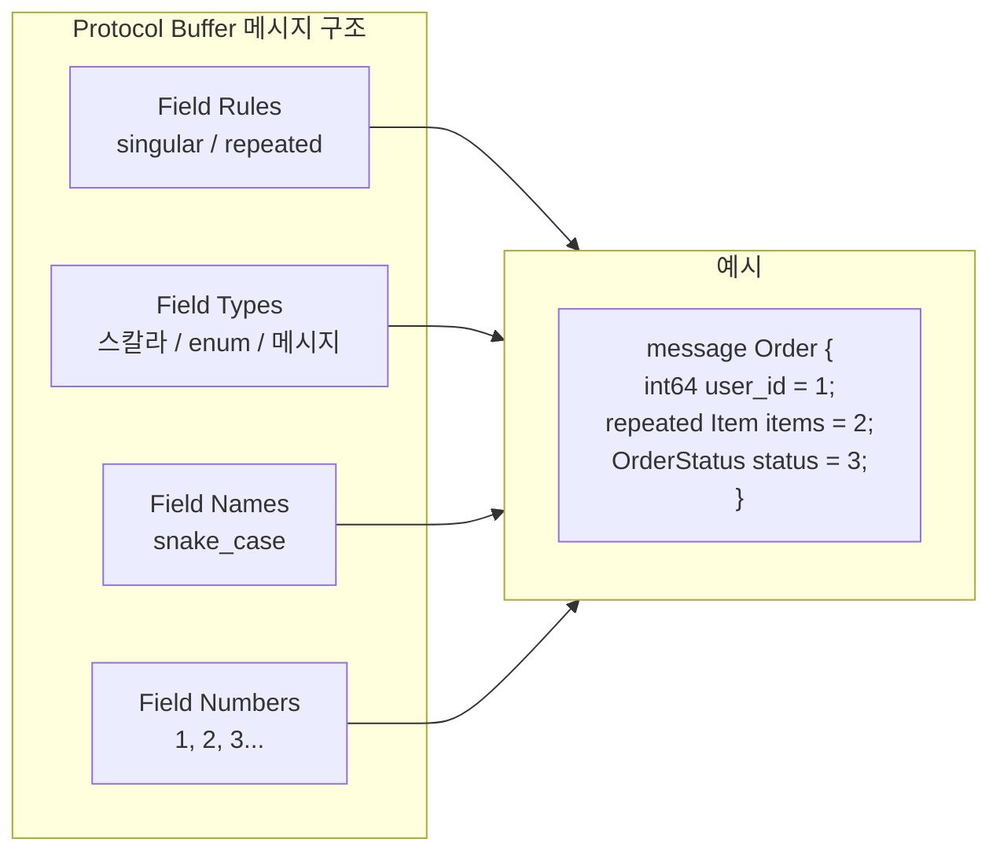
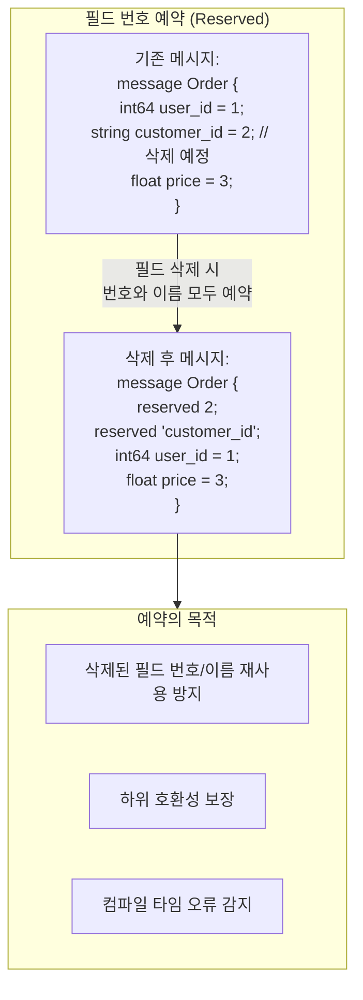
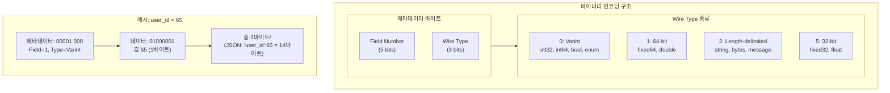
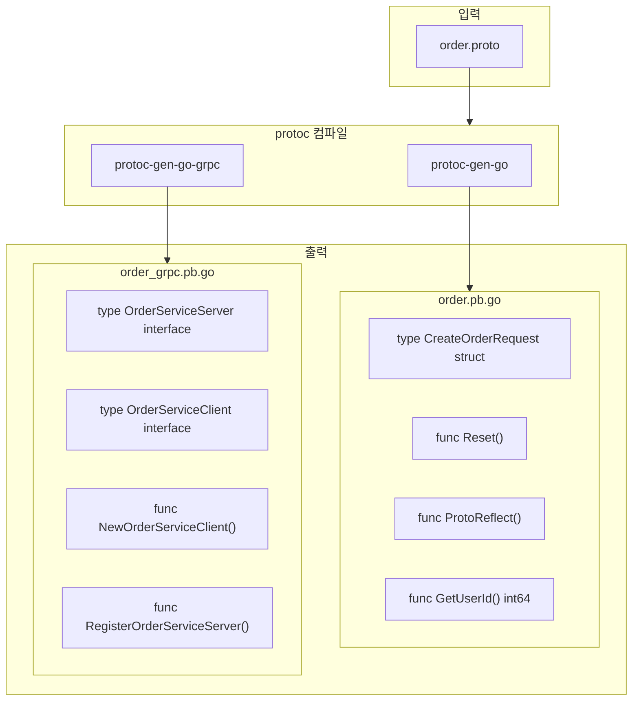
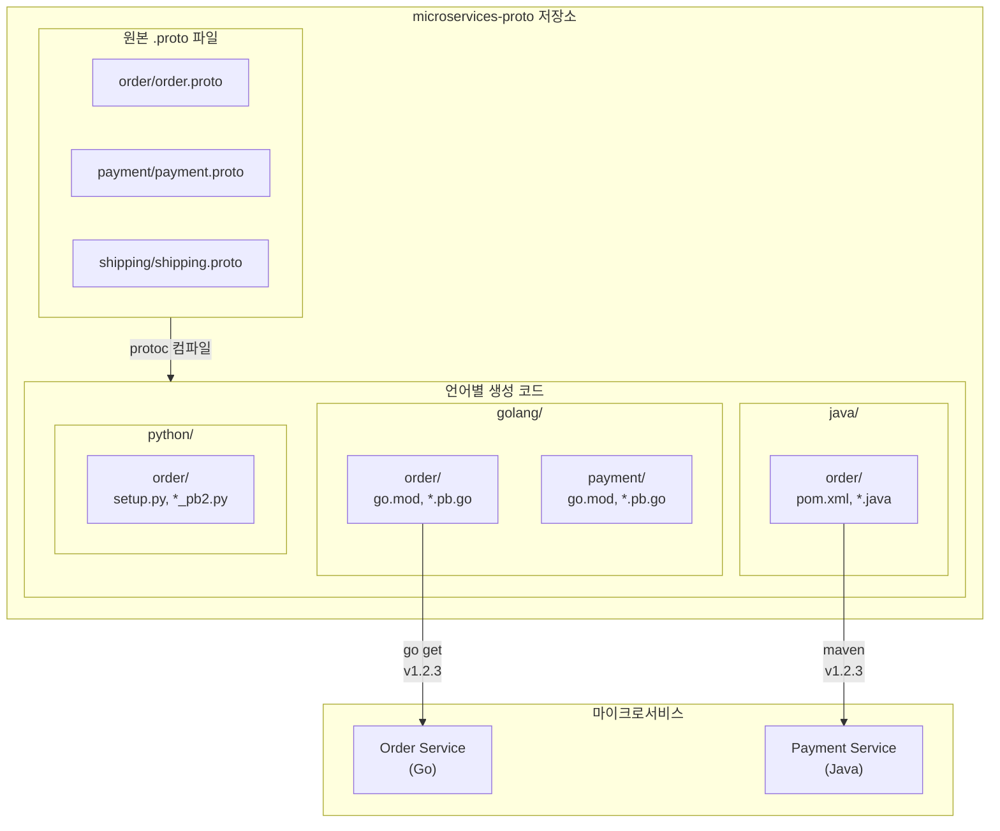
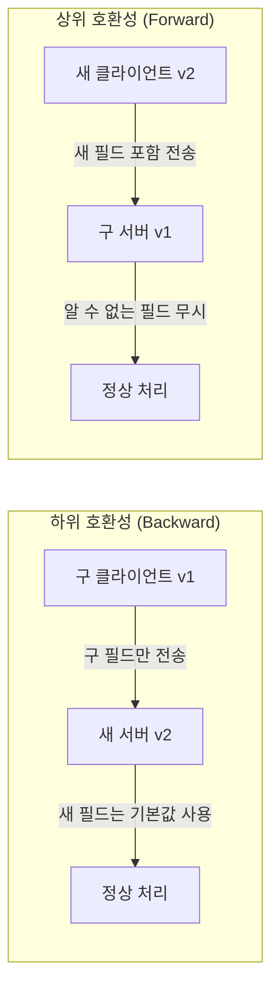

# 03. gRPC와 Golang 시작하기

---

## 핵심 개념 상세 설명

### 1. Protocol Buffers 기초

**Protocol Buffers(Protobuf)**는 Google에서 개발한 언어 중립적, 플랫폼 중립적인 직렬화 메커니즘입니다. 구조화된 데이터를 정의하고, 이를 효율적인 바이너리 형식으로 직렬화하여 네트워크로 전송하거나 파일에 저장할 수 있습니다.

.proto 파일에서 메시지와 서비스를 정의하면, **protoc 컴파일러**가 각 언어에 맞는 코드를 자동 생성합니다. 이렇게 생성된 코드는 직렬화/역직렬화 로직, 필드 접근자, 서버 인터페이스, 클라이언트 스텁을 포함하며, 이를 통해 **다양한 언어 간에 타입 안전한 통신**이 가능합니다.



이 워크플로우의 핵심 이점은 **단일 진실의 원천(Single Source of Truth)**입니다. .proto 파일 하나가 모든 언어의 코드 생성 원본이 되므로, API 정의가 항상 동기화된 상태를 유지합니다.

### 2. 메시지 타입 정의

Protocol Buffers 메시지는 네 가지 핵심 구성 요소로 이루어집니다.



**Field Rules(필드 규칙)**은 필드가 가질 수 있는 값의 개수를 정의합니다. `singular`는 기본값으로, 해당 필드가 0개 또는 1개의 값을 가질 수 있습니다. `repeated`는 0개 이상의 값을 순서를 보존하며 가질 수 있어 배열이나 리스트를 표현합니다.

**Field Types(필드 타입)**은 세 가지 범주로 나뉩니다. 스칼라 타입(int32, int64, float, double, bool, string, bytes)은 단일 값을 표현합니다. enum 타입은 미리 정의된 상수 집합을 표현합니다. 메시지 타입은 다른 메시지를 필드로 포함하여 복잡한 구조를 표현합니다.

**Field Names(필드 이름)**은 소문자와 밑줄로 구분하는 **snake_case**를 사용하는 것이 Protocol Buffers의 공식 스타일 가이드입니다. 예를 들어 `user_id`, `total_price`, `created_at`과 같이 작성합니다. 이 이름은 protoc이 각 언어의 관례에 맞게 변환합니다(Go: UserId, Java: getUserId()).

**Field Numbers(필드 번호)**는 각 필드를 고유하게 식별하는 양의 정수입니다. 바이너리 인코딩에서 필드 이름 대신 이 번호로 필드를 식별하므로, **한 번 할당된 필드 번호는 절대 변경하거나 재사용해서는 안 됩니다.**

```protobuf
syntax = "proto3";                    // Protocol Buffers 버전 3 사용

package order;                        // 패키지 네임스페이스
option go_package = "github.com/example/order";  // Go import 경로

message CreateOrderRequest {
    int64 user_id = 1;               // 스칼라 타입, 필드 번호 1
    repeated Item items = 2;         // 반복 필드 (배열/리스트)
    float amount = 3;                // 스칼라 타입
    OrderType type = 4;              // enum 타입
}

enum OrderType {
    ORDER_TYPE_UNSPECIFIED = 0;      // enum의 첫 값은 항상 0
    ORDER_TYPE_ONLINE = 1;
    ORDER_TYPE_OFFLINE = 2;
}

message Item {
    string name = 1;                 // 임베디드 메시지의 필드
    int32 quantity = 2;
    float price = 3;
}
```

### 3. 필드 번호의 중요성과 최적화

필드 번호는 Protocol Buffers의 핵심 개념입니다. 바이너리 인코딩에서 **필드 이름이 아닌 필드 번호로 각 필드를 식별**하기 때문입니다. 이로 인해 필드 이름을 변경해도 바이너리 호환성이 유지되지만, 필드 번호를 변경하면 데이터가 손상됩니다.

필드 번호 범위에 따라 인코딩에 필요한 바이트 수가 달라집니다.

| 필드 번호 범위 | 인코딩 크기 | 권장 용도 |
|---------------|-------------|-----------|
| **1 ~ 15** | **1 바이트** | 자주 사용하는 필드, repeated 필드 |
| 16 ~ 2,047 | 2 바이트 | 일반 필드 |
| 2,048 ~ 536,870,911 | 3+ 바이트 | 드물게 사용하는 필드, 확장용 예약 |

**성능 최적화 전략**은 다음과 같습니다. 자주 사용되는 필드에 1-15 범위의 번호를 할당합니다. 특히 **repeated 필드는 각 요소마다 필드 번호가 인코딩**되므로 작은 번호를 할당하는 것이 중요합니다. 예를 들어, 1000개 요소를 가진 repeated 필드의 번호가 1이면 메타데이터에 1000바이트가 사용되고, 번호가 16이면 2000바이트가 사용됩니다.



필드 번호를 예약하는 이유는 **이전 버전과의 호환성** 때문입니다. 필드를 삭제하고 그 번호를 재사용하면, 이전 버전의 데이터를 읽을 때 잘못된 타입으로 해석될 수 있습니다. `reserved` 키워드로 삭제된 필드 번호를 예약하면, 실수로 재사용하려 할 때 protoc 컴파일러가 에러를 발생시켜 문제를 사전에 방지합니다.

### 4. Protocol Buffer 바이너리 인코딩

Protocol Buffers가 JSON보다 빠르고 작은 이유는 **효율적인 바이너리 인코딩**에 있습니다. 각 필드는 메타데이터(필드 번호 + Wire Type)와 데이터로 구성됩니다.



**Varint 인코딩**은 작은 숫자에 적은 바이트를, 큰 숫자에 많은 바이트를 사용하는 가변 길이 인코딩입니다. 각 바이트의 MSB(Most Significant Bit)가 1이면 다음 바이트가 있다는 의미이고, 0이면 마지막 바이트입니다.

숫자 65의 인코딩 예시를 살펴보겠습니다. 65는 2진수로 1000001입니다. MSB가 0(마지막 바이트 표시)이므로 01000001이 됩니다. 필드 번호 1과 Wire Type 0을 결합한 메타데이터(00001000)와 합쳐서 총 2바이트만 필요합니다. 반면 JSON에서 `"user_id": 65`는 14바이트가 필요합니다.

큰 값(21567)의 인코딩 과정은 다음과 같습니다.

1. 10진수 21567을 2진수로 변환: `101010000111111`
2. 7비트 블록으로 분할: `0000001` `0101000` `0111111`
3. Little Endian 순서로 역배치: `0111111` `0101000` `0000001`
4. 각 블록에 MSB 추가: `1`0111111, `1`0101000, `0`0000001
5. 결과: 3바이트로 인코딩

이처럼 Varint는 대부분의 실제 데이터가 작은 숫자인 점을 활용하여 효율적인 인코딩을 제공합니다.

### 5. 스텁 코드 생성

**protoc 컴파일러**와 언어별 플러그인을 사용하여 .proto 파일에서 코드를 생성합니다. Go의 경우 두 개의 플러그인이 필요합니다.

```bash
# 필수 도구 설치
go install google.golang.org/protobuf/cmd/protoc-gen-go@latest       # 메시지 코드 생성
go install google.golang.org/grpc/cmd/protoc-gen-go-grpc@latest     # gRPC 서비스 코드 생성

# 코드 생성 명령어
protoc -I ./proto \
   --go_out ./golang \
   --go_opt paths=source_relative \
   --go-grpc_out ./golang \
   --go-grpc_opt paths=source_relative \
   ./proto/order.proto
```

이 명령어는 두 개의 파일을 생성합니다.

| 파일명 | 내용 | 용도 |
|--------|------|------|
| `order.pb.go` | 메시지 구조체, 직렬화/역직렬화 메서드, Getter 메서드 | 데이터 정의 |
| `order_grpc.pb.go` | 서버 인터페이스, 클라이언트 스텁, 등록 함수 | gRPC 통신 |



생성된 코드의 핵심 요소를 살펴보면, **서버 인터페이스**는 개발자가 구현해야 할 메서드를 정의하고, **클라이언트 스텁**은 원격 서비스를 로컬 함수처럼 호출할 수 있게 해줍니다. **등록 함수**는 구현체를 gRPC 서버에 연결합니다.

### 6. .proto 파일 관리 전략

마이크로서비스 환경에서 .proto 파일을 효율적으로 관리하는 모범 사례는 **별도의 저장소에서 중앙 집중 관리**하는 것입니다.



이 구조의 핵심 이점은 **독립적인 버전 관리**입니다. 각 서비스의 API를 독립적인 Git 태그로 버전 관리할 수 있습니다.

```bash
# 서비스별 독립 태깅 - 의미론적 버전 관리
git tag -a golang/order/v1.2.3 -m "Order API: 새 필드 추가"
git tag -a golang/payment/v1.2.8 -m "Payment API: 응답 타입 확장"
git push --tags

# 특정 버전 의존성 다운로드
go get -u github.com/example/microservices-proto/golang/order@v1.2.3
```

각 서비스는 필요한 API의 특정 버전만 의존성으로 가져오므로, Order API가 v2.0.0으로 Breaking Change가 있어도 아직 마이그레이션하지 않은 서비스는 v1.x.x를 계속 사용할 수 있습니다.

### 7. GitHub Actions 자동화

CI/CD 파이프라인에서 .proto 파일 변경 시 자동으로 코드를 생성하고 태깅하는 워크플로우를 구성할 수 있습니다.

```yaml
name: "Protocol Buffer Go Stubs Generation"

on:
  push:
    tags:
      - v**  # v1.0.0 형식의 태그 푸시 시 실행

jobs:
  protoc:
    name: "Generate Stubs"
    runs-on: ubuntu-latest
    strategy:
      matrix:
        service: ["order", "payment", "shipping"]  # 병렬 실행
    steps:
      - name: Install Go
        uses: actions/setup-go@v2
        with:
          go-version: 1.21

      - name: Checkout
        uses: actions/checkout@v3

      - name: Install protoc plugins
        run: |
          go install google.golang.org/protobuf/cmd/protoc-gen-go@latest
          go install google.golang.org/grpc/cmd/protoc-gen-go-grpc@latest

      - name: Extract Release Version
        run: echo "RELEASE_VERSION=${GITHUB_REF#refs/*/}" >> $GITHUB_ENV

      - name: Generate Stubs
        run: ./scripts/generate.sh ${{ matrix.service }} ${{ env.RELEASE_VERSION }}

      - name: Create Service-specific Tag
        run: |
          git tag -a golang/${{ matrix.service }}/${{ env.RELEASE_VERSION }} \
            -m "golang/${{ matrix.service }}/${{ env.RELEASE_VERSION }}"
          git push --tags
```

**Matrix 전략**을 사용하면 여러 서비스에 대해 병렬로 코드 생성 작업을 실행할 수 있어 CI 시간을 단축합니다. 이 워크플로우는 `v1.0.0` 태그를 푸시하면 자동으로 각 서비스의 코드를 생성하고 `golang/order/v1.0.0`, `golang/payment/v1.0.0` 등의 태그를 생성합니다.

### 8. 하위/상위 호환성 유지

Protocol Buffers에서 API를 발전시킬 때 **호환성 유지**는 매우 중요합니다. 분산 환경에서는 모든 클라이언트와 서버를 동시에 업데이트할 수 없기 때문입니다.



**하위 호환성(Backward Compatibility)**은 새 버전의 서버가 이전 버전의 클라이언트 요청을 처리할 수 있는 능력입니다. 새 필드를 추가해도 구 클라이언트는 해당 필드를 보내지 않으며, 서버에서 기본값 로직을 추가하면 정상 동작합니다.

**상위 호환성(Forward Compatibility)**은 이전 버전의 서버가 새 버전의 클라이언트 요청을 처리할 수 있는 능력입니다. Protocol Buffers는 알 수 없는 필드를 무시하므로, 새 클라이언트가 보낸 새 필드는 구 서버에서 단순히 무시됩니다.

호환성 규칙을 표로 정리하면 다음과 같습니다.

| 변경 유형 | 하위 호환 | 상위 호환 | 권장 조치 |
|----------|:--------:|:--------:|-----------|
| **필드 추가** | O | O | 서버에 기본값 로직 추가 |
| **필드 삭제** | △ | △ | reserved 키워드 필수 사용 |
| **필드 번호 변경** | X | X | **절대 금지** |
| **필드 타입 변경** | X | X | 새 필드로 추가 후 마이그레이션 |
| **oneof 내 필드 추가** | O | X | 구 서버가 새 필드 무시함에 주의 |
| **oneof 내 필드 삭제** | X | O | 새 서버가 삭제된 필드 무시함에 주의 |

서버 측에서 하위 호환성을 보장하는 코드 예시입니다.

```go
func (s *PaymentServer) Create(ctx context.Context, req *pb.CreatePaymentRequest) (
    *pb.CreatePaymentResponse, error) {

    // 하위 호환성: vat 필드가 없는 구 클라이언트 지원
    // proto3에서 float의 기본값은 0
    vat := DEFAULT_VAT
    if req.Vat > 0 {
        vat = req.Vat
    }

    // 비즈니스 로직...
    totalPrice := req.Price + (req.Price * vat / 100)

    return &pb.CreatePaymentResponse{
        TotalPrice: totalPrice,
    }, nil
}
```

---

## 면접 예상 질문 및 모범 답안

### Q1. Protocol Buffers가 JSON보다 빠른 이유를 설명해주세요.

**모범 답안:**

Protocol Buffers가 JSON보다 빠른 이유는 크게 세 가지입니다.

**첫째, 바이너리 인코딩**입니다. JSON은 텍스트 기반으로 필드 이름이 모든 메시지에 반복되어 포함됩니다. `{"user_id": 65}`는 14바이트가 필요합니다. 반면 Protocol Buffers는 필드 이름 대신 필드 번호만 인코딩하고, 값도 Varint 같은 효율적인 바이너리 형식으로 저장하여 같은 데이터를 2바이트로 표현합니다.

**둘째, 파싱 오버헤드 최소화**입니다. JSON은 문자열을 파싱하여 토큰을 분리하고, 키 문자열을 해시맵에서 검색하며, 숫자 문자열을 정수로 변환하는 과정이 필요합니다. Protocol Buffers는 protoc이 미리 생성한 코드가 정확한 오프셋에서 데이터를 직접 읽어오므로 파싱 비용이 거의 없습니다.

**셋째, 스키마 기반 타입 안전성**입니다. Protocol Buffers는 .proto 파일에서 타입이 컴파일 타임에 정의되므로, 런타임에 타입 검증이 필요 없습니다. JSON은 동적 타입이라 런타임에 타입을 확인하고 변환해야 합니다.

실제 벤치마크에서 Protocol Buffers는 JSON 대비 직렬화 3-10배, 역직렬화 2-5배 빠르며, 메시지 크기는 3-10배 작습니다.

---

### Q2. 필드 번호 1-15가 성능에 좋은 이유를 설명해주세요.

**모범 답안:**

Protocol Buffers의 Varint 인코딩에서 필드 번호와 Wire Type이 하나의 바이트 단위로 인코딩됩니다. 8비트 중 Wire Type에 3비트가 사용되고, 필드 번호에 나머지 비트가 사용됩니다.

필드 번호 1-15는 메타데이터가 **1바이트**로 인코딩됩니다. 필드 번호 16-2047은 **2바이트**, 2048 이상은 **3바이트 이상**이 필요합니다.

이 차이가 중요한 이유는 **repeated 필드** 때문입니다. repeated 필드는 각 요소마다 필드 번호가 인코딩됩니다. 예를 들어, 1000개 요소를 가진 repeated 필드가 있다면:
- 필드 번호 1: 메타데이터 1000바이트
- 필드 번호 16: 메타데이터 2000바이트
- 필드 번호 2048: 메타데이터 3000바이트

따라서 자주 사용되는 필드, 특히 repeated 필드에는 1-15 범위의 번호를 할당하는 것이 성능 최적화에 중요합니다. 드물게 사용되는 필드나 향후 확장을 위한 예약 공간에는 큰 번호를 할당해도 됩니다.

---

### Q3. reserved 키워드의 목적과 사용 방법을 설명해주세요.

**모범 답안:**

`reserved` 키워드는 삭제된 필드의 **번호나 이름이 실수로 재사용되는 것을 방지**하기 위한 메커니즘입니다.

Protocol Buffers에서 필드를 삭제할 때 그 번호를 다른 필드에 재사용하면 심각한 문제가 발생합니다. 이전 버전의 데이터에는 삭제된 필드 번호에 다른 타입의 데이터가 저장되어 있을 수 있기 때문입니다. 예를 들어, 필드 번호 2가 원래 string 타입이었는데, 삭제 후 int64 타입의 새 필드에 번호 2를 할당하면, 이전 데이터를 읽을 때 string 바이트를 int64로 잘못 해석하여 데이터 손상이 발생합니다.

`reserved`는 번호와 이름을 **별도의 문**으로 예약합니다.

```protobuf
message Order {
    reserved 2, 5, 9 to 11;        // 번호 예약 (단일, 범위)
    reserved "customer_id", "temp"; // 이름 예약 (별도 문)

    int64 user_id = 1;
    float price = 3;
}
```

이렇게 예약하면, 누군가 필드 번호 2나 이름 `customer_id`를 사용하려 할 때 **protoc 컴파일러가 에러를 발생**시킵니다. 이를 통해 런타임 데이터 손상이 아닌 컴파일 타임에 실수를 방지할 수 있습니다.

주의할 점은 번호와 이름을 같은 `reserved` 문에서 함께 선언할 수 없다는 것입니다. 반드시 별도의 문으로 분리해야 합니다.

---

### Q4. 하위 호환성을 유지하면서 API를 발전시키는 방법을 설명해주세요.

**모범 답안:**

Protocol Buffers에서 하위 호환성을 유지하면서 API를 발전시키는 핵심 원칙이 있습니다.

**필드 추가는 안전합니다.** 새 필드를 추가하면 구 클라이언트는 해당 필드를 보내지 않지만, 서버에서 기본값 로직을 추가하면 정상 동작합니다. proto3에서 스칼라 타입의 기본값은 0(숫자), false(bool), 빈 문자열(string)입니다. 서버 코드에서 `if req.NewField == 0 { newField = DEFAULT_VALUE }` 같은 로직을 추가하면 됩니다.

**필드 삭제 시에는 reserved 키워드가 필수입니다.** 필드 번호와 이름 모두 예약하여 미래에 실수로 재사용하는 것을 방지합니다.

**필드 번호나 타입은 절대 변경하면 안 됩니다.** 타입을 변경하고 싶다면, 새 필드를 추가하고 구 필드는 deprecated 주석으로 표시하거나 삭제 후 reserved로 예약합니다. 점진적으로 클라이언트들이 새 필드로 마이그레이션하도록 유도합니다.

**oneof 필드는 특별히 주의해야 합니다.** oneof 내 필드를 외부로 이동하거나, 외부 필드를 oneof 내로 이동하면 데이터 손실이 발생할 수 있습니다.

실무에서는 **Buf** 같은 도구를 사용하여 Breaking Change를 자동으로 감지하는 것이 좋습니다.

```bash
buf breaking --against '.git#branch=main'
```

이 명령어는 현재 변경사항이 main 브랜치 대비 Breaking Change를 포함하는지 CI에서 자동 검사합니다.

---

### Q5. oneof 필드 변경 시 주의할 점을 설명해주세요.

**모범 답안:**

`oneof`는 여러 필드 중 **최대 하나만 값을 가질 수 있는** 구조입니다. 메시지 크기를 절약하고 상호 배타적인 선택지를 표현하는 데 유용하지만, 변경 시 특별한 주의가 필요합니다.

**oneof 내에 새 필드를 추가**하는 것은 하위 호환되지만 상위 호환되지 않습니다. 새 클라이언트가 새 필드를 보내면 구 서버는 인식하지 못하고 무시합니다. oneof 값 전체가 없는 것처럼 처리될 수 있습니다.

**oneof 내 필드를 삭제**하는 것은 상위 호환되지만 하위 호환되지 않습니다. 구 클라이언트가 삭제된 필드를 보내면 새 서버는 인식하지 못합니다.

**가장 위험한 것은 필드를 oneof 내외로 이동**하는 것입니다. 예를 들어, oneof 밖에 있던 `promo_code` 필드를 oneof 안으로 이동한다고 가정합니다. 구 클라이언트는 `promo_code`와 oneof 내 다른 필드를 동시에 보낼 수 있습니다. 하지만 새 서버는 oneof 특성상 하나만 인식하여 데이터가 손실됩니다.

따라서 oneof 필드를 설계할 때는 **신중하게 결정**하고, 한 번 정해진 구조는 가능한 변경하지 않는 것이 좋습니다. 변경이 불가피하다면, 새로운 oneof를 정의하고 점진적으로 마이그레이션하는 것이 안전합니다.

---

### Q6. .proto 파일을 별도 저장소에서 관리하는 이점을 설명해주세요.

**모범 답안:**

.proto 파일을 별도 저장소에서 관리하면 마이크로서비스 환경에서 여러 이점이 있습니다.

**첫째, 중앙 집중화된 계약 관리**입니다. 모든 서비스의 API 정의가 한 곳에 있어 서비스 간 계약을 쉽게 파악하고 관리할 수 있습니다. 새로 합류한 개발자도 전체 API 구조를 빠르게 이해할 수 있습니다.

**둘째, 다중 언어 지원**입니다. 하나의 .proto 파일에서 Go, Java, Python 등 여러 언어의 코드를 생성하여 각 언어별 디렉토리에 저장합니다. 각 서비스는 자신의 언어에 맞는 스텁만 의존성으로 가져오면 됩니다.

**셋째, 독립적인 버전 관리**입니다. 각 서비스별로 독립적인 Git 태그를 사용하여 버전을 관리합니다. Order API가 v1.2.3이고 Payment API가 v1.2.8일 때, 각각 독립적으로 릴리스하고 의존성을 선언할 수 있습니다. `go get github.com/example/proto/golang/order@v1.2.3`처럼 특정 버전을 지정합니다.

**넷째, CI/CD 자동화**입니다. GitHub Actions 등으로 태그 푸시 시 자동으로 코드를 생성하고 각 언어별 패키지를 발행합니다. Matrix 전략으로 여러 서비스를 병렬 처리하여 효율을 높입니다.

**다섯째, Breaking Change 방지**입니다. Buf 같은 도구를 CI에 통합하여 PR 단계에서 호환성을 검사합니다. Breaking Change가 실수로 머지되는 것을 사전에 차단합니다.

---

## 실무 체크리스트

### Proto 파일 작성 시 체크리스트

- [ ] 자주 사용하는 필드에 1-15 범위 번호를 할당했는가?
- [ ] repeated 필드에 가능한 작은 번호를 할당했는가?
- [ ] 필드 이름이 snake_case 컨벤션을 따르는가?
- [ ] `go_package` 등 언어별 옵션이 올바르게 설정되었는가?
- [ ] 삭제된 필드에 `reserved` 키워드를 적용했는가?
- [ ] enum의 첫 번째 값이 `UNSPECIFIED = 0`으로 정의되었는가?

### 호환성 검토 체크리스트

- [ ] 필드 번호를 변경하지 않았는가?
- [ ] 필드 타입을 변경하지 않았는가?
- [ ] oneof 필드를 내외로 이동하지 않았는가?
- [ ] 새 필드에 대한 기본값 로직이 서버에 있는가?
- [ ] Breaking Change 검사 도구(Buf)를 CI에 통합했는가?

---

## 참고 자료

- [Protocol Buffers Language Guide (proto3)](https://developers.google.com/protocol-buffers/docs/proto3)
- [Protocol Buffer Encoding](https://developers.google.com/protocol-buffers/docs/encoding)
- [protoc Installation Guide](https://grpc.io/docs/protoc-installation/)
- [Buf - Modern Protobuf Tooling](https://buf.build/)
- [Semantic Versioning 2.0.0](https://semver.org/)
