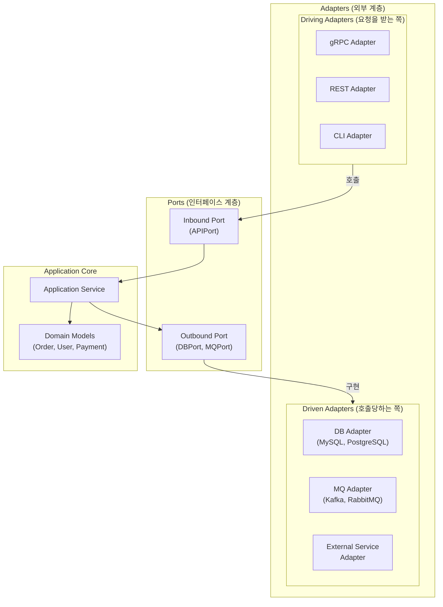
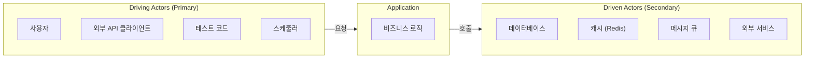
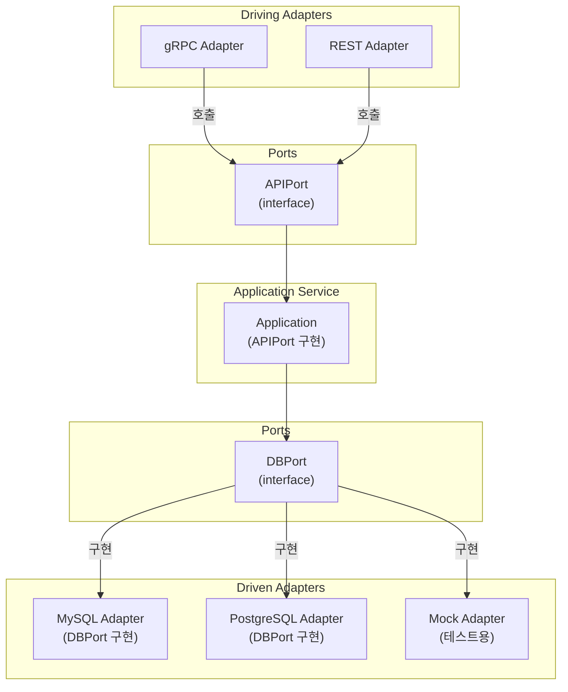
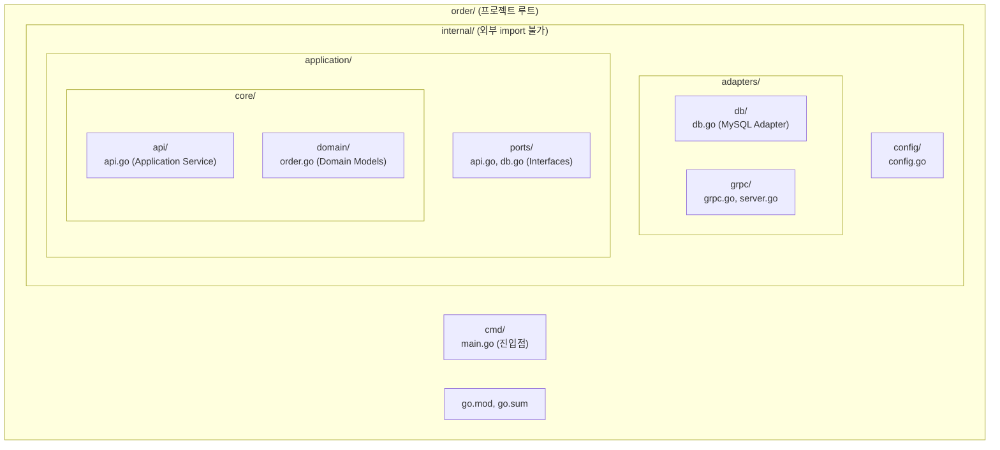
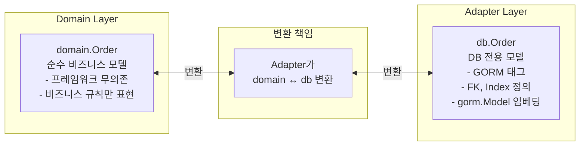
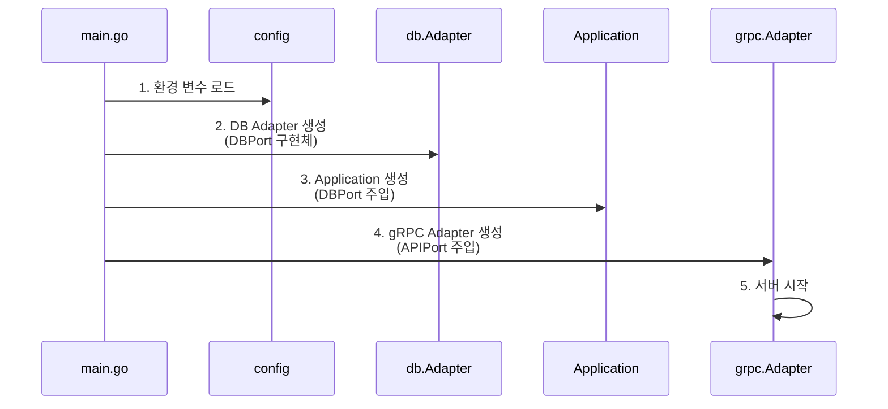
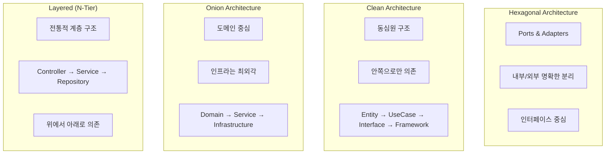

# 04. 마이크로서비스 프로젝트 셋업

---

## 핵심 개념 상세 설명

### 1. Hexagonal Architecture (육각형 아키텍처)

**Hexagonal Architecture**는 Alistair Cockburn이 2005년에 제안한 아키텍처 패턴으로, **"Ports and Adapters"** 패턴이라고도 불립니다. 이 아키텍처의 핵심 목표는 **비즈니스 로직을 외부 의존성으로부터 완전히 격리**하여 테스트 용이성과 유지보수성을 극대화하는 것입니다.

전통적인 계층형 아키텍처(Controller → Service → Repository)에서는 비즈니스 로직이 데이터베이스 기술이나 웹 프레임워크에 종속되기 쉽습니다. Hexagonal Architecture는 이 문제를 **Port(인터페이스)**와 **Adapter(구현체)**로 해결합니다.



Hexagonal Architecture를 이해하기 위해 **전기 콘센트에 비유**할 수 있습니다. 콘센트(Port)는 표준화된 규격이고, 다양한 어댑터(Adapter)를 통해 여러 전자기기(외부 시스템)를 연결할 수 있습니다. 기기가 바뀌어도 콘센트의 규격은 그대로 유지됩니다. 마찬가지로 MySQL에서 PostgreSQL로 교체해도 DBPort 인터페이스는 변하지 않고, 오직 Adapter만 교체하면 됩니다.

### 2. 핵심 구성요소 상세 설명

#### Application (애플리케이션 코어)

**Application**은 순수한 비즈니스 로직만을 포함하는 핵심 영역입니다. 이 계층은 어떤 외부 프레임워크나 라이브러리에도 의존하지 않는 **순수 Go 코드**로 작성됩니다.

Application Core가 포함하는 것:
- **Domain Models**: Order, OrderItem, User 등 비즈니스 엔티티
- **Business Rules**: 주문 생성 규칙, 할인 계산 로직, 상태 전이 규칙
- **Application Services**: 유스케이스를 조합하고 실행하는 서비스

Application Core가 포함하지 않는 것:
- 데이터베이스 연결 코드 (GORM, sqlx 등)
- 웹 프레임워크 코드 (Gin, Echo 등)
- 메시지 큐 클라이언트 코드 (Kafka, RabbitMQ 등)
- 외부 API 클라이언트 코드

#### Actors (액터)

**Actors**는 시스템과 상호작용하는 외부 엔티티를 의미합니다. 상호작용의 방향에 따라 두 가지 유형으로 구분됩니다.



**Driving Actor (Primary Actor)**는 Application을 호출하는 주체입니다. 흐름 방향이 **"외부 → Application"**입니다. 사용자, 외부 API 클라이언트, 테스트 코드, 스케줄러 등이 해당됩니다. 이들은 Application을 **"운전(Drive)"**합니다.

**Driven Actor (Secondary Actor)**는 Application이 호출하는 대상입니다. 흐름 방향이 **"Application → 외부"**입니다. 데이터베이스, 캐시, 메시지 큐, 외부 서비스 등이 해당됩니다. 이들은 Application에 의해 **"운전 당합니다(Driven)"**.

이 구분이 중요한 이유는 **의존성 방향** 때문입니다. Driving Adapter는 Application의 Port를 알아야 하고(호출하므로), Driven Adapter는 Application의 Port를 구현해야 합니다(구현을 제공하므로). 두 경우 모두 **Application은 구체적인 Adapter를 모르고 Port 인터페이스만 알면 됩니다.**

#### Ports (포트)

**Ports**는 Application과 외부 세계를 연결하는 **인터페이스**입니다. Go에서는 `interface`로 정의되며, Application이 외부와 통신하는 **계약(Contract)** 역할을 합니다.

**Inbound Port (APIPort)**는 외부에서 Application을 호출할 때 사용하는 인터페이스입니다.

```go
// ports/api.go - Inbound Port
type APIPort interface {
    CreateOrder(ctx context.Context, order domain.Order) (domain.Order, error)
    GetOrder(ctx context.Context, id int64) (domain.Order, error)
    UpdateOrderStatus(ctx context.Context, id int64, status string) error
}
```

**Outbound Port (DBPort)**는 Application이 외부 리소스를 호출할 때 사용하는 인터페이스입니다.

```go
// ports/db.go - Outbound Port
type DBPort interface {
    Save(ctx context.Context, order *domain.Order) error
    Get(ctx context.Context, id int64) (*domain.Order, error)
    Update(ctx context.Context, order *domain.Order) error
}
```

Port 인터페이스는 **비즈니스 관점에서 정의**해야 합니다. `InsertIntoOrdersTable`이 아니라 `Save`, `SelectByID`가 아니라 `Get`처럼 비즈니스 의도를 표현합니다.

#### Adapters (어댑터)

**Adapters**는 Port 인터페이스의 **구현체**로, 실제 기술을 연결하는 역할을 합니다.

**Driving Adapter**는 Inbound Port를 **호출**하는 어댑터입니다. gRPC 서버, REST 컨트롤러, CLI 등이 해당됩니다.

**Driven Adapter**는 Outbound Port를 **구현**하는 어댑터입니다. MySQL Adapter, Redis Adapter, Kafka Adapter 등이 해당됩니다.



### 3. Go 프로젝트 구조와 internal 패키지

Go에서 Hexagonal Architecture를 구현할 때 권장되는 프로젝트 구조입니다.



```
order/
├── cmd/                    # 진입점 (main 패키지)
│   └── main.go
├── internal/               # 내부 패키지 (외부 import 불가)
│   ├── adapters/          # Adapter 구현체들
│   │   ├── db/            # DB Adapter (Driven)
│   │   │   └── db.go
│   │   └── grpc/          # gRPC Adapter (Driving)
│   │       ├── grpc.go
│   │       └── server.go
│   ├── application/       # 비즈니스 로직 계층
│   │   ├── core/          # 핵심 도메인
│   │   │   ├── api/       # Application Service
│   │   │   │   └── api.go
│   │   │   └── domain/    # 도메인 모델
│   │   │       └── order.go
│   │   └── ports/         # Port 인터페이스 정의
│   │       ├── api.go     # Inbound Port
│   │       └── db.go      # Outbound Port
│   └── config/            # 설정 관리
│       └── config.go
├── go.mod
└── go.sum
```

**`internal/` 패키지**는 Go 1.4에서 도입된 특별한 규칙입니다. 해당 디렉토리 하위의 코드는 **같은 모듈 내에서만 import할 수 있고, 외부 모듈에서는 import할 수 없습니다.** 이는 컴파일러가 강제하는 규칙으로, 내부 구현을 **언어 수준에서 캡슐화**합니다.

### 4. 도메인 모델과 DB 모델의 분리

Hexagonal Architecture에서 매우 중요한 원칙 중 하나는 **도메인 모델과 DB 모델을 분리**하는 것입니다.



**도메인 모델 (domain.Order)**은 순수 비즈니스 로직을 표현하는 모델로, 어떤 프레임워크나 라이브러리에도 의존하지 않습니다. JSON 태그는 직렬화를 위한 표준 Go 기능이므로 허용됩니다.

```go
// domain/order.go - 순수 도메인 모델
type Order struct {
    ID         int64       `json:"id"`
    CustomerID int64       `json:"customer_id"`
    Status     string      `json:"status"`
    OrderItems []OrderItem `json:"order_items"`
    CreatedAt  int64       `json:"created_at"`
}

// 비즈니스 메서드 - 도메인 로직 포함
func (o *Order) CanBeCancelled() bool {
    return o.Status == "PENDING" || o.Status == "CONFIRMED"
}

func (o *Order) TotalAmount() float64 {
    var total float64
    for _, item := range o.OrderItems {
        total += item.Price * float64(item.Quantity)
    }
    return total
}
```

**DB 모델 (db.Order)**은 GORM 등 ORM 프레임워크에 종속된 모델로, 테이블 매핑, 관계 정의, 인덱스 등 DB 스키마 관련 정보를 포함합니다.

```go
// adapters/db/db.go - DB 전용 모델
type Order struct {
    gorm.Model                    // ID, CreatedAt, UpdatedAt, DeletedAt 포함
    CustomerID int64              `json:"customer_id" gorm:"index"`
    Status     string             `json:"status" gorm:"size:20"`
    OrderItems []OrderItem        `gorm:"foreignKey:OrderID;constraint:OnDelete:CASCADE"`
}

// 도메인 모델로 변환
func (o *Order) ToDomain() *domain.Order {
    items := make([]domain.OrderItem, len(o.OrderItems))
    for i, item := range o.OrderItems {
        items[i] = *item.ToDomain()
    }
    return &domain.Order{
        ID:         int64(o.ID),
        CustomerID: o.CustomerID,
        Status:     o.Status,
        OrderItems: items,
        CreatedAt:  o.CreatedAt.Unix(),
    }
}
```

이렇게 분리하면 **DB 스키마가 변경되어도 도메인 로직에 영향을 주지 않으며**, DB 기술을 교체할 때도 Adapter만 수정하면 됩니다.

### 5. 의존성 주입 (Dependency Injection) 패턴

**의존성 주입**은 Hexagonal Architecture의 핵심 구현 기법입니다. 구체적인 구현체가 아닌 **인터페이스에 의존**하게 함으로써 느슨한 결합을 달성합니다.



main.go에서의 조립 과정입니다.

```go
func main() {
    // 1. 설정 로드
    cfg := config.Load()

    // 2. DB Adapter 초기화 (DBPort 인터페이스 구현)
    dbAdapter, err := db.NewAdapter(cfg.DataSourceURL)
    if err != nil {
        log.Fatal(err)
    }

    // 3. Application 초기화 (DBPort를 인터페이스로 주입받음)
    // Application은 MySQL인지 PostgreSQL인지 모름
    application := api.NewApplication(dbAdapter)

    // 4. gRPC Adapter 초기화 (APIPort를 인터페이스로 주입받음)
    grpcAdapter := grpc.NewAdapter(application, cfg.AppPort)

    // 5. 서버 시작
    grpcAdapter.Run()
}
```

Application 생성자를 보면 인터페이스 타입을 받습니다.

```go
// application/core/api/api.go
type Application struct {
    db ports.DBPort  // 인터페이스 타입 - 구현체를 모름
}

func NewApplication(db ports.DBPort) *Application {
    return &Application{db: db}
}

func (a *Application) CreateOrder(ctx context.Context, order domain.Order) (domain.Order, error) {
    // a.db가 MySQL인지 Mock인지 전혀 알 필요 없음
    return a.db.Save(ctx, &order)
}
```

Application은 `ports.DBPort` 인터페이스만 알고 있고, **실제로 MySQL인지 PostgreSQL인지 Mock인지 전혀 알 필요가 없습니다.** 이것이 **의존성 역전 원칙(DIP)**의 구현입니다.

### 6. gRPC Reflection과 grpcurl

**gRPC Reflection**은 런타임에 서버가 제공하는 서비스 정보를 동적으로 조회할 수 있게 해주는 기능입니다. 개발 및 디버깅 단계에서 유용하며, **grpcurl** 같은 CLI 도구로 .proto 파일 없이도 서비스를 테스트할 수 있습니다.

```go
// gRPC 서버에 Reflection 등록
import "google.golang.org/grpc/reflection"

func main() {
    grpcServer := grpc.NewServer()
    pb.RegisterOrderServiceServer(grpcServer, orderServer)

    // 개발 환경에서만 활성화 권장
    if config.IsDevelopment() {
        reflection.Register(grpcServer)
    }

    grpcServer.Serve(listener)
}
```

grpcurl 사용 예시입니다.

```bash
# 사용 가능한 서비스 목록 조회
grpcurl -plaintext localhost:8080 list
# 출력: Order, grpc.reflection.v1alpha.ServerReflection

# 특정 서비스의 메서드 조회
grpcurl -plaintext localhost:8080 list Order
# 출력: Order.Create, Order.Get, Order.Update

# 메서드 상세 정보 (입출력 타입)
grpcurl -plaintext localhost:8080 describe Order.Create

# RPC 호출
grpcurl -plaintext -d '{
  "customer_id": 1,
  "order_items": [
    {"product_id": 101, "quantity": 2, "price": 29.99}
  ]
}' localhost:8080 Order.Create
```

---

## 아키텍처 패턴 비교



| 패턴 | 핵심 개념 | 장점 | 단점 | 적합한 상황 |
|-----|----------|-----|------|-----------|
| **Hexagonal** | Ports & Adapters로 내부/외부 분리 | 테스트 용이, 기술 교체 유연 | 초기 설정 복잡, 보일러플레이트 | 장기 운영 서비스, 멀티 프로토콜 |
| **Clean Architecture** | 동심원 구조, 안쪽으로 의존성 | 명확한 계층 분리, 의존성 규칙 | 과도한 추상화 가능 | 대규모 엔터프라이즈 |
| **Onion Architecture** | 도메인 중심, 인프라는 최외각 | 도메인 모델 보호 | 복잡한 의존성 관리 | 복잡한 도메인 로직 |
| **Layered (N-Tier)** | 전통적 계층 구조 | 단순함, 익숙함 | 계층 간 강한 결합 | 작은 프로젝트, MVP |

세 가지 아키텍처(Hexagonal, Clean, Onion)는 **본질적으로 같은 원칙**을 다른 방식으로 표현한 것입니다. 모두 **비즈니스 로직을 중앙에 두고, 외부 의존성을 주변으로 밀어낸다**는 공통점을 가집니다.

---

## 면접 예상 질문 및 모범 답안

### Q1. Hexagonal Architecture에서 Port와 Adapter의 차이점과 역할을 설명해주세요.

**모범 답안:**

Port와 Adapter는 Hexagonal Architecture에서 Application Core를 외부 세계와 연결하는 핵심 요소입니다.

**Port**는 Application이 외부와 통신하기 위한 **인터페이스(Contract)**입니다. Go에서는 `interface`로 정의되며, Application이 **"어떤 기능이 필요한지"**만 명시하고 **"어떻게 구현되는지"**는 알지 못합니다. Inbound Port(APIPort)는 외부에서 Application을 호출할 때 사용하는 인터페이스이고, Outbound Port(DBPort)는 Application이 외부 리소스를 사용할 때 정의하는 인터페이스입니다.

**Adapter**는 Port 인터페이스의 **실제 구현체**입니다. 특정 기술이나 프레임워크를 사용하여 Port가 요구하는 기능을 구현합니다. Driving Adapter(gRPC, REST)는 Inbound Port를 호출하고, Driven Adapter(MySQL, Redis)는 Outbound Port를 구현합니다.

예를 들어 DBPort가 `Save(order)` 메서드를 정의하면, MySQL Adapter는 GORM을 사용해 이를 구현하고, 테스트 시에는 Mock Adapter를 주입할 수 있습니다. **Application은 데이터베이스 구현에 전혀 의존하지 않게 됩니다.**

---

### Q2. Driving Actor와 Driven Actor를 구분하는 기준은 무엇인가요?

**모범 답안:**

Actor를 구분하는 핵심 기준은 **"누가 상호작용을 시작하느냐"**입니다.

**Driving Actor(Primary Actor)**는 Application에 요청을 보내는 주체로, 흐름의 방향이 **"Actor → Application"**입니다. 사용자가 API를 호출하거나, 다른 마이크로서비스가 gRPC로 호출하거나, 테스트 코드가 메서드를 호출하는 것이 해당됩니다. 이들은 Application을 **"운전(Drive)"**합니다.

**Driven Actor(Secondary Actor)**는 Application에 의해 호출되는 대상으로, 흐름의 방향이 **"Application → Actor"**입니다. 데이터베이스에 저장하거나, 메시지 큐에 이벤트를 발행하거나, 외부 API를 호출하는 것이 해당됩니다. 이들은 Application에 의해 **"운전 당합니다(Driven)"**.

이 구분이 중요한 이유는 **의존성 방향** 때문입니다. Driving Adapter는 Application의 Port를 알아야 하고(호출하므로), Driven Adapter는 Application의 Port를 구현해야 합니다(구현을 제공하므로). 두 경우 모두 **Application은 구체적인 Adapter를 모르고 Port 인터페이스만 알면 됩니다.**

---

### Q3. Go의 internal 패키지가 Hexagonal Architecture에서 어떤 역할을 하나요?

**모범 답안:**

Go의 `internal` 패키지는 Hexagonal Architecture의 **캡슐화 원칙을 언어 수준에서 강제**하는 역할을 합니다.

`internal` 디렉토리 하위에 있는 패키지는 같은 모듈 내에서만 import할 수 있고, **외부 모듈에서는 절대 import할 수 없습니다.** 이는 Go 1.4부터 도입된 규칙으로, 컴파일러가 강제합니다.

Hexagonal Architecture에서 이것이 중요한 이유는 세 가지입니다.

**첫째, Domain 모델 보호**입니다. `internal/application/core/domain` 패키지에 정의된 도메인 모델을 외부에서 직접 접근할 수 없어 **우회 사용을 방지**합니다.

**둘째, Adapter 구현 은닉**입니다. `internal/adapters` 패키지의 구체적인 구현이 외부로 노출되지 않아 **내부 리팩토링이 자유롭습니다.**

**셋째, API 경계 명확화**입니다. 외부에 노출할 API만 `cmd`나 `pkg` 패키지에 두고, 나머지는 `internal`로 보호합니다.

결과적으로 `internal` 패키지는 **"Public API는 의도적으로 설계하고, 나머지는 숨긴다"**는 원칙을 컴파일 타임에 강제합니다.

---

### Q4. 도메인 모델과 DB 모델을 왜 분리해야 하나요?

**모범 답안:**

도메인 모델과 DB 모델을 분리하는 이유는 **관심사 분리와 변경 격리**입니다.

**도메인 모델**은 순수한 비즈니스 개념을 표현합니다. Order가 어떤 상태를 가지고, OrderItem과 어떤 관계인지 등 비즈니스 규칙만 담습니다. **DB 모델**은 저장소 기술에 종속된 정보를 담습니다. GORM의 `gorm.Model` 임베딩, `foreignKey` 태그, 인덱스 정의, 제약조건 등이 해당됩니다.

분리하지 않으면 문제가 발생합니다.

**첫째, DB 스키마 변경이 비즈니스 로직에 영향을 줍니다.** 컬럼명 변경, 테이블 분리, 인덱스 추가 등이 도메인 모델을 사용하는 모든 코드에 파급됩니다.

**둘째, 테스트가 어려워집니다.** `gorm.Model`을 포함한 구조체를 테스트하려면 실제 DB나 복잡한 Mock이 필요합니다.

**셋째, ORM 교체가 사실상 불가능합니다.** GORM에서 Ent나 sqlc로 전환하려면 전체 코드를 수정해야 합니다.

분리하면 **Adapter 계층에서 DB 모델 ↔ 도메인 모델 변환을 담당**하고, 변경이 해당 계층에서 격리됩니다. DB를 MySQL에서 PostgreSQL로 교체해도 Application Core는 전혀 수정하지 않아도 됩니다.

---

### Q5. 의존성 주입 없이 Hexagonal Architecture를 구현할 수 있나요?

**모범 답안:**

기술적으로는 가능하지만, **Hexagonal Architecture의 핵심 이점을 잃게 됩니다.**

의존성 주입은 **"인터페이스에 의존하고, 구현은 외부에서 주입받는"** 패턴입니다. 이것 없이 구현하면 Application이 구체적인 Adapter를 직접 생성해야 합니다.

```go
// 의존성 주입 없이 - 안티패턴
func NewApplication() *Application {
    db := mysql.NewAdapter("connection-string")  // 구체적인 구현에 의존!
    return &Application{db: db}
}
```

이 경우 세 가지 문제가 발생합니다.

**첫째, 테스트가 어렵습니다.** Application을 테스트하려면 실제 MySQL이 필요하거나, Application 코드를 수정해야 Mock을 끼워넣을 수 있습니다.

**둘째, 기술 교체가 어렵습니다.** PostgreSQL로 전환하려면 Application 코드를 수정해야 합니다.

**셋째, 의존성 방향이 역전되지 않습니다.** Application이 Adapter를 알게 되어 결합도가 높아집니다.

결론적으로 의존성 주입은 Hexagonal Architecture의 **선택사항이 아니라 필수 구현 기법**입니다. Go에서는 인터페이스를 매개변수로 받는 생성자 패턴으로 간단히 구현할 수 있습니다.

---

### Q6. GORM의 AutoMigrate가 프로덕션 환경에서 위험한 이유는 무엇인가요?

**모범 답안:**

**AutoMigrate**는 Go 구조체를 기반으로 데이터베이스 스키마를 자동으로 생성하고 업데이트하는 GORM 기능입니다. 개발 환경에서는 편리하지만 **프로덕션에서는 여러 위험**이 있습니다.

**첫째, 예측 불가능한 스키마 변경**입니다. 구조체 필드를 수정하면 애플리케이션 시작 시 자동으로 테이블이 변경됩니다. 의도치 않은 컬럼 추가나 타입 변경이 발생할 수 있습니다.

**둘째, 데이터 손실 위험**입니다. AutoMigrate는 컬럼 삭제는 하지 않지만, 필드 타입이 변경되면 기존 데이터가 손상될 수 있습니다.

**셋째, 마이그레이션 히스토리 부재**입니다. 어떤 변경이 언제 적용되었는지 추적할 수 없어, 문제 발생 시 롤백이 어렵습니다.

**넷째, 다운타임 발생 가능성**입니다. 대용량 테이블에 컬럼을 추가하면 테이블 락이 발생해 서비스 중단이 생길 수 있습니다.

프로덕션에서는 **golang-migrate, Atlas, Flyway** 같은 마이그레이션 도구를 사용해 버전 관리된 마이그레이션 스크립트를 적용하고, AutoMigrate는 개발/테스트 환경에서만 사용해야 합니다.

---

### Q7. gRPC Reflection을 프로덕션에서 비활성화해야 하는 이유는 무엇인가요?

**모범 답안:**

**gRPC Reflection**은 서버가 제공하는 모든 서비스와 메서드 정보를 런타임에 조회할 수 있게 해주는 기능입니다. 개발 시 grpcurl 같은 도구로 테스트할 때 유용하지만, **프로덕션에서는 보안 위험**이 있습니다.

**첫째, API 노출**입니다. 인증 없이 어떤 서비스와 메서드가 존재하는지 알 수 있어 **공격 표면이 늘어납니다.** 내부 전용 메서드나 관리자 API의 존재가 드러납니다.

**둘째, 스키마 노출**입니다. 요청/응답 메시지 구조를 완전히 알 수 있어, **입력 검증 우회나 퍼징 공격**에 활용될 수 있습니다.

**셋째, 서비스 검색**입니다. 마이크로서비스 환경에서 내부 서비스들의 존재와 구조를 파악하는 **정찰 수단**이 됩니다.

프로덕션에서는 Reflection을 비활성화하고, API 문서는 별도의 인증된 경로로 제공해야 합니다. 혹은 **내부 네트워크에서만 접근 가능하도록** 네트워크 정책으로 제한할 수 있습니다.

---

### Q8. Hexagonal Architecture에서 비즈니스 로직이 Adapter에 누출되면 어떤 문제가 발생하나요?

**모범 답안:**

비즈니스 로직의 Adapter 누출은 Hexagonal Architecture의 핵심 원칙을 위반하는 것으로, **여러 심각한 문제를 초래**합니다.

**첫째, 로직 중복**입니다. gRPC Adapter와 REST Adapter가 모두 같은 검증 로직을 구현하게 되어 코드 중복이 발생합니다. 규칙이 변경되면 모든 Adapter를 수정해야 합니다.

**둘째, 테스트 복잡도 증가**입니다. 비즈니스 로직을 테스트하려면 HTTP 서버나 gRPC 서버를 띄워야 하므로 단위 테스트가 **통합 테스트 수준으로 복잡**해집니다.

**셋째, 기술 종속성 발생**입니다. 비즈니스 규칙이 특정 프로토콜이나 프레임워크에 종속되어, 프로토콜 추가나 변경이 어려워집니다.

**넷째, 도메인 모델 희석**입니다. 핵심 비즈니스 개념이 여러 곳에 흩어져 있어 도메인 이해가 어려워지고, 새로운 개발자의 온보딩이 힘들어집니다.

**Adapter는 오직 "변환(Transform)" 역할만 담당**해야 합니다. gRPC 메시지를 도메인 모델로, 도메인 모델을 DB 엔티티로 변환하는 것입니다. 검증, 계산, 상태 전이 등 **모든 비즈니스 로직은 Application Core에 있어야 합니다.**

---

## 실무 체크리스트

### 프로젝트 셋업 시

- [ ] `internal` 패키지를 사용하여 내부 구현을 캡슐화했는가?
- [ ] 도메인 모델이 어떤 프레임워크에도 의존하지 않는가?
- [ ] Port 인터페이스가 비즈니스 관점에서 정의되어 있는가?
- [ ] Adapter가 Port 인터페이스를 구현하고 있는가?
- [ ] main.go에서 의존성 주입으로 컴포넌트를 조립하는가?

### DB Adapter 구현 시

- [ ] DB 모델과 도메인 모델을 분리했는가?
- [ ] 모델 변환 로직이 Adapter에만 존재하는가?
- [ ] 트랜잭션 처리가 Adapter 계층에서 이루어지는가?
- [ ] Connection pool 설정이 적절한가?
- [ ] `parseTime=true` 같은 드라이버 옵션을 확인했는가?

### gRPC Adapter 구현 시

- [ ] gRPC 메시지 ↔ 도메인 모델 변환이 Adapter에서만 이루어지는가?
- [ ] `UnimplementedXxxServer`를 임베딩했는가? (forward compatibility)
- [ ] 개발 환경에서만 Reflection을 활성화했는가?
- [ ] 에러 처리가 gRPC status code로 적절히 변환되는가?

### 테스트 관점

- [ ] Application 테스트 시 Mock Adapter를 주입할 수 있는가?
- [ ] Port 인터페이스에 대한 Mock을 쉽게 생성할 수 있는가?
- [ ] Adapter 테스트와 Application 테스트가 분리되어 있는가?

---

## 참고 자료

- [Hexagonal Architecture 원문 - Alistair Cockburn](https://alistair.cockburn.us/hexagonal-architecture/)
- [GORM 공식 문서](https://gorm.io/docs/)
- [grpcurl GitHub](https://github.com/fullstorydev/grpcurl)
- [Go internal packages](https://go.dev/doc/go1.4#internalpackages)
- [Google Wire - DI 코드 생성 도구](https://github.com/google/wire)
- [Uber Fx - DI 프레임워크](https://github.com/uber-go/fx)
