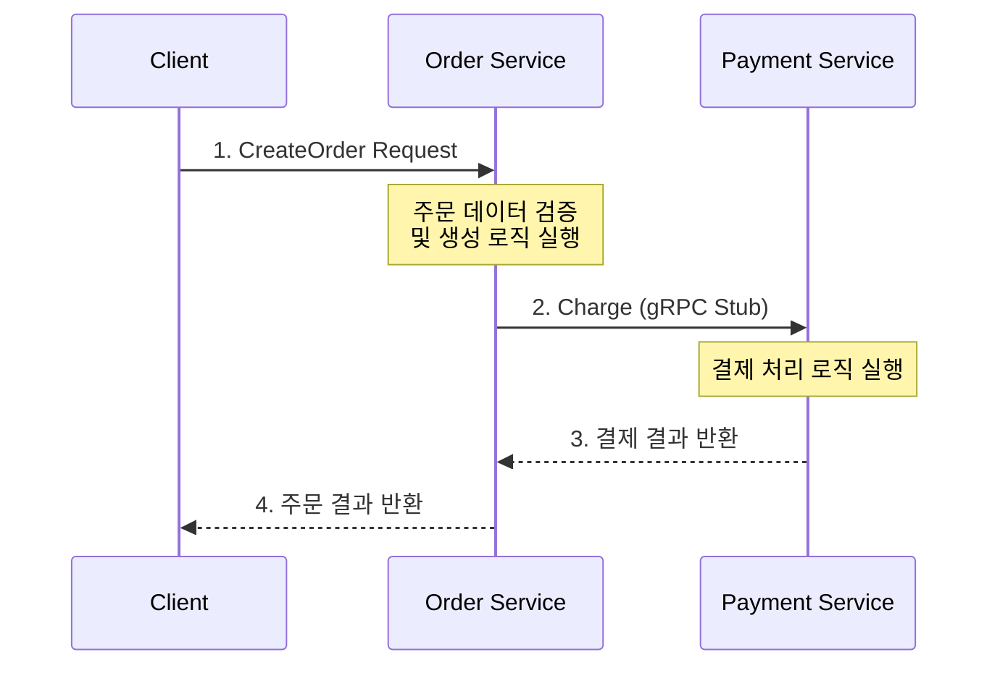
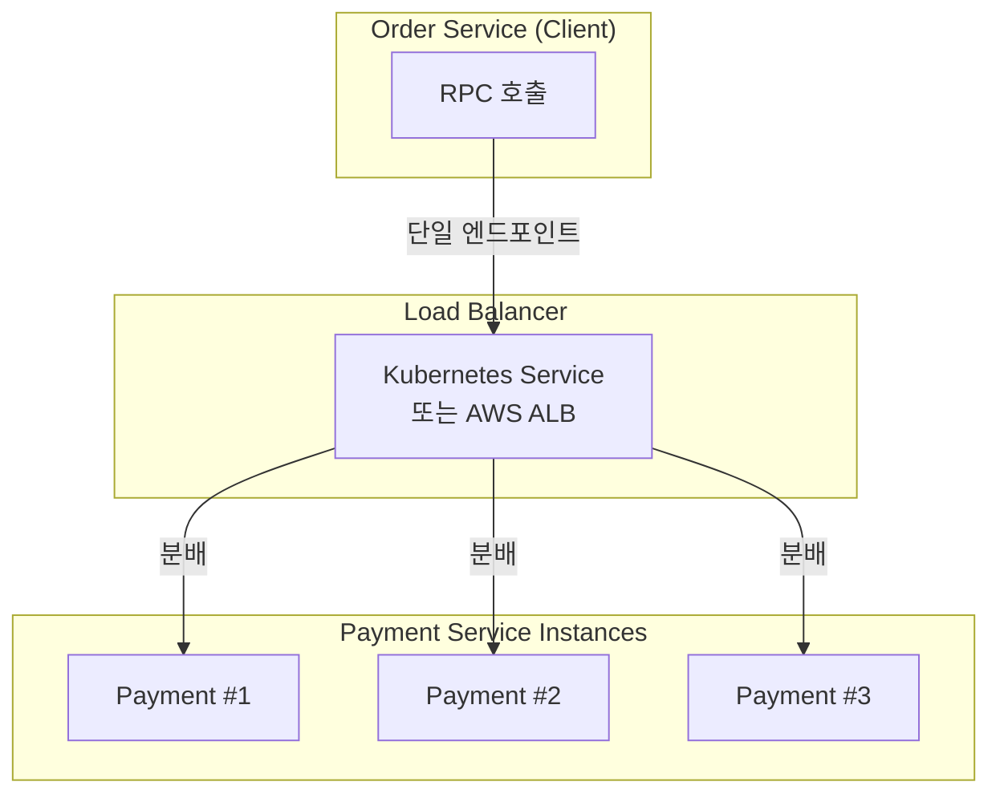
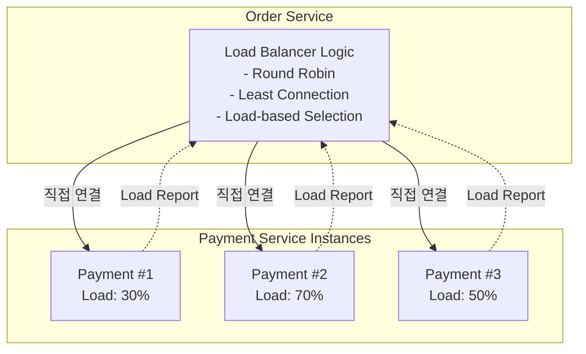
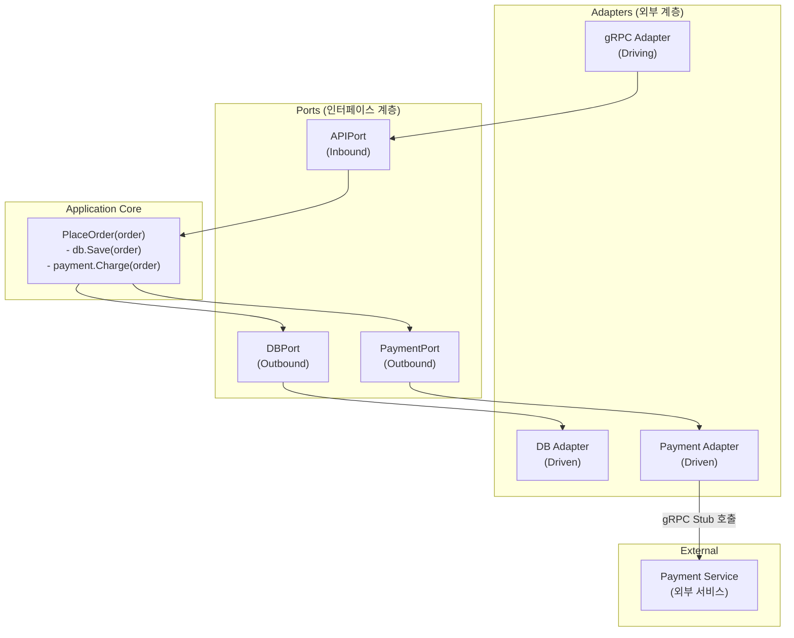
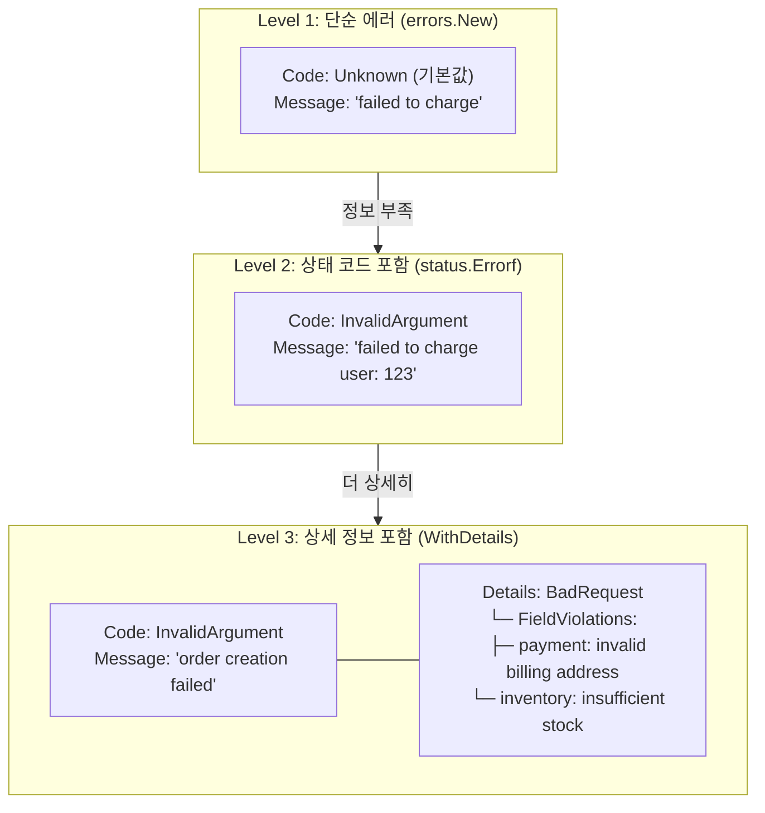
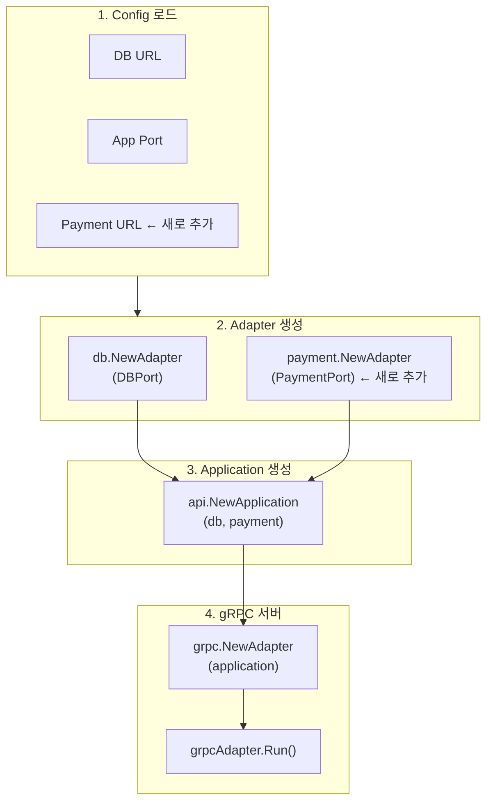

# 5장: 서비스 간 통신 (Interservice Communication) - 면접 정리

## 핵심 개념 상세 설명

### 1. 마이크로서비스 간 통신의 본질

마이크로서비스 아키텍처에서 각 서비스는 독립적으로 배포되고 운영됩니다. 그러나 비즈니스 로직을 완성하려면 서비스들이 서로 협력해야 합니다. 예를 들어 Order 서비스가 주문을 생성할 때, Payment 서비스를 호출하여 결제를 처리하는 것이 대표적인 서비스 간 통신입니다.

gRPC 기반 통신에서 Order 서비스는 Payment 서비스의 **gRPC 스텁(Stub)**을 사용합니다. 스텁은 원격 서비스를 마치 로컬 함수처럼 호출할 수 있게 해주는 클라이언트 코드입니다. 이 코드는 protoc 컴파일러가 `.proto` 파일로부터 자동으로 생성하며, 네트워크 통신의 복잡성을 감추고 타입 안전한 API를 제공합니다.

---

### 2. Load Balancing 전략

분산 환경에서 서비스는 가용성과 성능을 위해 여러 인스턴스로 실행됩니다. 클라이언트가 어떤 인스턴스에 요청을 보낼지 결정하는 방식에 따라 **Server-side**와 **Client-side** Load Balancing으로 구분됩니다.

#### Server-side Load Balancing

Server-side Load Balancing에서는 클라이언트가 단일 엔드포인트(Load Balancer)에만 연결합니다. Load Balancer가 백엔드 인스턴스로 요청을 분배하므로, 클라이언트는 백엔드 인스턴스의 존재 자체를 알지 못합니다.

**장점**: 설정이 간단합니다. 클라이언트가 백엔드 구조를 몰라도 되며, 백엔드 변경이 클라이언트에 영향을 주지 않습니다.

**단점**: Load Balancer를 거치므로 추가 레이턴시가 발생합니다. Load Balancer가 단일 장애점(SPOF)이 될 수 있으며, 처리량 제한으로 확장성에 영향을 줄 수 있습니다.

#### Client-side Load Balancing

Client-side Load Balancing에서는 클라이언트가 모든 백엔드 인스턴스의 주소를 알고 있습니다. 각 인스턴스의 부하 상태(Load Report)를 수집하여 직접 어떤 인스턴스에 연결할지 선택합니다.

**장점**: 중간 계층이 없어 레이턴시가 최소화됩니다. 단일 장애점이 없으므로 고가용성을 확보할 수 있습니다.

**단점**: 클라이언트가 모든 인스턴스 상태를 추적해야 하므로 설정이 복잡합니다. 언어별로 Load Balancer 로직을 구현해야 하는 부담도 있습니다.

---

### 3. Hexagonal Architecture에서 외부 서비스 통합

Hexagonal Architecture에서 외부 서비스와의 통신은 **Port**와 **Adapter** 패턴으로 추상화됩니다. Payment 서비스와의 통신을 예로 들면, `PaymentPort`(Outbound Port)가 인터페이스를 정의하고, `PaymentAdapter`가 실제 gRPC 통신을 구현합니다.

이 구조의 핵심은 **Application Core가 PaymentPort 인터페이스만 알고, 실제 gRPC 통신 방법은 전혀 모른다**는 것입니다. 이를 통해 테스트 시에는 Mock Adapter를 주입하고, 프로덕션에서는 실제 gRPC Adapter를 주입할 수 있습니다.

---

### 4. gRPC 에러 핸들링 체계

gRPC는 표준화된 에러 핸들링 체계를 제공합니다. 단순한 에러 메시지 대신 **상태 코드(Status Code)**와 **상세 에러 정보(Error Details)**를 통해 구조화된 에러를 전달할 수 있습니다.

#### 상태 코드 (Status Codes)

gRPC 상태 코드는 HTTP 상태 코드와 유사하게 에러의 유형을 분류합니다.

| 상태 코드 | 설명 | 사용 사례 |
|----------|------|----------|
| OK | 성공 | 정상적인 응답 |
| CANCELLED | 클라이언트가 요청 취소 | 타임아웃 전 사용자가 취소, 여러 요청 중 하나만 필요할 때 |
| INVALID_ARGUMENT | 잘못된 입력값 | 빈 주문 ID, 음수 가격, 잘못된 형식 |
| DEADLINE_EXCEEDED | 타임아웃 초과 | 설정된 deadline 시간 내 응답 실패 |
| NOT_FOUND | 리소스 없음 | 존재하지 않는 주문 ID 조회 |
| ALREADY_EXISTS | 중복 리소스 | 이미 존재하는 이메일로 회원가입 |
| PERMISSION_DENIED | 권한 없음 | 접근 권한이 부족한 리소스 요청 |
| RESOURCE_EXHAUSTED | 할당량 초과 | API Rate Limit 초과, 디스크 공간 부족 |
| INTERNAL | 서버 내부 오류 | 예상치 못한 서버 에러, 복구 불가능한 상태 |
| UNAVAILABLE | 서비스 불가 | 서버가 일시적으로 요청을 처리할 수 없음 |

#### 에러 구조: 세 가지 수준

gRPC 에러는 세 가지 수준으로 구성됩니다. 상황에 따라 적절한 수준을 선택해야 합니다.

**Level 1**은 단순 에러로, gRPC가 자동으로 `codes.Unknown`을 부여합니다. **Level 2**는 `status.Errorf`를 사용하여 적절한 상태 코드를 명시합니다. **Level 3**는 `WithDetails`로 필드별 에러 정보를 구조화하여 클라이언트가 어떤 필드에서 문제가 발생했는지 정확히 알 수 있게 합니다.

---

### 5. 의존성 주입과 서비스 조립

main.go에서 모든 컴포넌트를 조립하는 과정은 의존성 주입의 핵심입니다. 새로운 외부 서비스(Payment)가 추가되면 해당 Adapter를 초기화하고 Application에 주입합니다.

이 패턴의 핵심은 **모든 의존성이 main.go에서 조립**된다는 것입니다. Application Core는 인터페이스만 알고, 구체적인 구현체는 main.go에서 결정됩니다. 이를 통해 테스트 용이성과 유연성을 확보할 수 있습니다.

---

## Load Balancing 전략 비교

| 항목 | Server-side LB | Client-side LB |
|-----|---------------|----------------|
| **아키텍처** | 클라이언트 → LB → 백엔드 | 클라이언트 → 백엔드 (직접) |
| **클라이언트 복잡도** | 낮음 (단일 엔드포인트) | 높음 (모든 인스턴스 관리) |
| **레이턴시** | 추가 홉으로 증가 | 직접 연결로 최소화 |
| **장애점** | LB가 SPOF 가능 | 없음 |
| **확장성** | LB 처리량에 제한 | 클라이언트 수에 비례 |
| **설정** | 간단 | 복잡 (언어별 구현 필요) |
| **대표 사례** | Kubernetes Service, AWS ALB | gRPC 내장 LB, Envoy |
| **권장 환경** | 일반적인 마이크로서비스 | 초저지연 요구 시스템 |

---

## 면접 예상 질문 및 모범 답안

### Q1. Server-side와 Client-side Load Balancing의 차이점과 각각의 장단점을 설명해주세요.

**모범 답안:**

두 방식의 핵심 차이는 "**누가 백엔드 인스턴스를 선택하느냐**"입니다.

**Server-side Load Balancing**에서는 클라이언트가 단일 엔드포인트(Load Balancer)에만 연결하고, LB가 백엔드 인스턴스로 요청을 분배합니다. 장점은 클라이언트 구현이 단순하고, 백엔드 구조 변경이 클라이언트에 영향을 주지 않는다는 것입니다. 단점은 LB를 거치므로 추가 레이턴시가 발생하고, LB가 단일 장애점이 될 수 있으며, LB의 처리량이 전체 시스템의 병목이 될 수 있습니다. Kubernetes Service나 AWS ALB가 대표적입니다.

**Client-side Load Balancing**에서는 클라이언트가 모든 백엔드 인스턴스 주소를 알고 직접 선택합니다. 장점은 중간 계층이 없어 레이턴시가 최소화되고, 단일 장애점이 없다는 것입니다. 단점은 클라이언트가 인스턴스 목록을 관리해야 하고, 언어별로 로드밸런싱 로직을 구현해야 합니다. gRPC 내장 Load Balancer나 Envoy Sidecar가 대표적입니다.

실무에서는 Kubernetes 환경에서 Server-side LB를 기본으로 사용하고, 극도로 낮은 레이턴시가 필요한 경우에만 Client-side LB를 고려합니다.

---

### Q2. gRPC에서 DEADLINE_EXCEEDED와 CANCELLED의 차이는 무엇인가요?

**모범 답안:**

두 코드 모두 요청이 완료되지 않았음을 나타내지만, **발생 원인**이 다릅니다.

**DEADLINE_EXCEEDED**는 설정된 타임아웃(deadline) 시간 내에 서버가 응답을 반환하지 못했을 때 발생합니다. 클라이언트가 `context.WithTimeout(ctx, 5*time.Second)`로 5초 타임아웃을 설정했는데 서버가 7초 후에 응답하면 DEADLINE_EXCEEDED가 반환됩니다. 이는 **시스템이 자동으로 발생**시키는 에러입니다.

**CANCELLED**는 **클라이언트가 명시적으로 요청을 취소**했을 때 발생합니다. 예를 들어 여러 서버에 동시에 요청을 보내고 가장 먼저 응답한 결과만 사용할 때, 나머지 요청을 `cancel()` 함수로 취소하면 CANCELLED가 반환됩니다. 또는 사용자가 UI에서 "취소" 버튼을 눌렀을 때도 해당됩니다.

에러 처리 관점에서, DEADLINE_EXCEEDED는 서버 과부하나 네트워크 문제를 의심해야 하고 재시도 정책을 적용할 수 있습니다. CANCELLED는 정상적인 클라이언트 동작의 결과이므로 일반적으로 에러 로깅이나 재시도가 필요하지 않습니다.

---

### Q3. gRPC 에러에 상세 정보를 포함하는 방법과 그 필요성을 설명해주세요.

**모범 답안:**

gRPC 에러에 상세 정보를 포함하려면 `google.golang.org/genproto/googleapis/rpc/errdetails` 패키지를 사용합니다.

구현 방법은 다음과 같습니다. 먼저 `status.New(codes.InvalidArgument, "message")`로 기본 상태를 생성합니다. 그다음 `errdetails.BadRequest_FieldViolation`으로 필드별 에러 정보를 생성합니다. 이를 `BadRequest` 구조에 담고, `status.WithDetails(badReq)`로 상태에 첨부합니다. 마지막으로 `statusWithDetails.Err()`로 에러를 반환합니다.

**이것이 필요한 이유**는 마이크로서비스 환경에서 하나의 요청이 여러 서비스를 호출할 수 있기 때문입니다. Order 서비스가 Payment, Inventory, Notification 서비스를 모두 호출할 때, 에러가 발생하면 "어느 서비스에서, 어떤 필드가, 왜 문제인지" 알아야 디버깅과 사용자 피드백이 가능합니다.

상세 에러 정보 없이 단순히 "order creation failed"만 반환하면, 클라이언트는 결제 문제인지 재고 문제인지 알 수 없습니다. `FieldViolations`를 사용하면 `[{field: "payment", description: "invalid card"}, {field: "inventory", description: "out of stock"}]`처럼 구조화된 정보를 전달할 수 있습니다.

---

### Q4. status.FromError와 status.Convert의 차이점은 무엇인가요?

**모범 답안:**

두 함수 모두 에러를 gRPC Status로 변환하지만, **반환 방식과 사용 시나리오**가 다릅니다.

**`status.FromError(err)`**는 `(status *Status, ok bool)` 두 개의 값을 반환합니다. `ok`가 true이면 에러가 gRPC Status를 포함하고 있어 성공적으로 추출된 것이고, false이면 일반 Go 에러여서 Status 추출이 실패한 것입니다. 이 함수는 **에러의 출처를 구분해야 할 때** 사용합니다.

**`status.Convert(err)`**는 `*Status` 하나만 반환합니다. 에러가 gRPC Status를 포함하면 그것을 추출하고, 그렇지 않으면 `codes.Unknown`과 `err.Error()` 메시지로 새 Status를 생성합니다. 항상 유효한 Status를 반환하므로, nil 체크 없이 바로 `Details()`나 `Code()`를 호출할 수 있습니다.

실무에서는 대부분 `status.Convert`를 사용합니다. 에러가 어디서 왔는지 구분할 필요가 있을 때만 `status.FromError`를 사용합니다. 예를 들어 외부 서비스 에러와 내부 에러를 다르게 처리해야 할 때 `FromError`로 구분합니다.

---

### Q5. Hexagonal Architecture에서 외부 서비스를 어떻게 통합하나요?

**모범 답안:**

Hexagonal Architecture에서 외부 서비스 통합은 **Port와 Adapter 패턴**을 통해 이루어집니다.

**첫 번째 단계는 Port 인터페이스 정의**입니다. `ports/payment.go`에 `PaymentPort interface { Charge(order *domain.Order) error }`처럼 Application이 필요로 하는 기능을 추상화합니다. 이 인터페이스는 비즈니스 관점에서 정의되며, gRPC나 REST 같은 구체적인 기술에 대한 언급이 없습니다.

**두 번째 단계는 Adapter 구현**입니다. `adapters/payment/adapter.go`에서 PaymentPort를 구현합니다. 여기서 gRPC 클라이언트 스텁을 사용하여 실제 통신을 수행합니다. 도메인 모델을 gRPC 메시지로 변환하고, 응답을 다시 도메인 모델이나 에러로 변환합니다.

**세 번째 단계는 의존성 주입**입니다. main.go에서 `payment.NewAdapter(url)`로 Adapter를 생성하고, `api.NewApplication(db, payment)`로 Application에 주입합니다. Application은 PaymentPort 인터페이스만 알고, 구체적인 Adapter 구현은 모릅니다.

이 구조의 장점은 세 가지입니다. **테스트 시 Mock Adapter를 주입**하여 외부 서비스 없이 테스트할 수 있습니다. 통신 방식이 gRPC에서 REST로 바뀌어도 **Adapter만 교체**하면 됩니다. Application Core는 순수한 비즈니스 로직만 포함하여 **이해와 유지보수가 쉽습니다**.

---

### Q6. gRPC 클라이언트에서 Connection을 재사용해야 하는 이유는 무엇인가요?

**모범 답안:**

gRPC 클라이언트에서 Connection 재사용이 중요한 이유는 **`grpc.Dial`(또는 `grpc.NewClient`)이 비용이 높은 연산**이기 때문입니다.

gRPC Connection 생성 시 내부적으로 **TCP 핸드셰이크**가 수행되고, TLS를 사용하면 **TLS 핸드셰이크**도 추가됩니다. **HTTP/2 연결 설정** 과정도 필요합니다. 이 모든 과정은 수백 밀리초가 걸릴 수 있으며, 매 요청마다 이를 반복하면 성능이 크게 저하됩니다.

반면 한 번 생성된 Connection은 **HTTP/2의 멀티플렉싱**을 활용하여 단일 TCP 연결로 수천 개의 동시 스트림을 처리할 수 있습니다. 따라서 Connection 하나를 애플리케이션 전체에서 공유해도 충분합니다.

실무 패턴은 다음과 같습니다. Adapter 생성 시점에 `grpc.Dial`을 한 번 호출하고, Connection을 Adapter 구조체에 저장합니다. 이후 모든 RPC 호출에서 동일한 Connection을 사용합니다. 애플리케이션 종료 시 `conn.Close()`로 정리합니다.

gRPC는 Connection 상태를 자동으로 관리하고, 일시적인 네트워크 문제 시 재연결도 처리합니다. 따라서 개발자가 수동으로 Connection Pool을 관리할 필요가 없습니다.

---

### Q7. gRPC 호출에 Deadline을 항상 설정해야 하는 이유는 무엇인가요?

**모범 답안:**

Deadline 없이 gRPC 호출을 하면 클라이언트가 무한히 응답을 기다릴 수 있어 심각한 문제가 발생합니다.

**첫째, 리소스 고갈**입니다. 응답이 오지 않는 요청들이 쌓이면 고루틴, 메모리, Connection이 소진되어 결국 클라이언트 서비스 전체가 다운될 수 있습니다.

**둘째, 연쇄 장애(Cascading Failure)**입니다. A 서비스가 B 서비스를 호출하고, B가 C를 호출할 때, C가 느려지면 B가 멈추고, B가 멈추면 A도 멈춥니다. Deadline이 없으면 이 연쇄 반응을 끊을 수 없습니다.

**셋째, 사용자 경험 저하**입니다. 사용자가 10초 이상 로딩 화면을 보고 있다면, 차라리 에러를 반환하고 재시도하게 하는 것이 낫습니다.

올바른 패턴은 **모든 외부 호출에 적절한 Deadline을 설정**하는 것입니다. `ctx, cancel := context.WithTimeout(ctx, 5*time.Second)`로 컨텍스트를 생성하고, `defer cancel()`로 정리합니다. Deadline은 비즈니스 요구사항에 따라 설정하며, 일반적으로 P99 레이턴시의 2-3배 정도를 권장합니다.

추가로 **Deadline은 전파**됩니다. A가 5초 Deadline으로 B를 호출하고, 2초 후 B가 C를 호출하면, C에 전파되는 Deadline은 3초입니다. 이를 통해 전체 체인의 타임아웃을 일관되게 관리할 수 있습니다.

---

### Q8. gRPC 스텁을 모듈 의존성으로 관리할 때의 장단점은 무엇인가요?

**모범 답안:**

gRPC 스텁을 별도 모듈로 관리하고 Go 의존성으로 추가하는 방식은 여러 장단점이 있습니다.

**장점**으로는 첫째, **버전 관리가 가능**합니다. `go get package@v1.0.38`처럼 특정 버전을 고정하여 호환성 문제를 방지할 수 있습니다. 둘째, **중앙 집중화**입니다. 스텁 코드가 한 곳(Proto Repository)에서 관리되어 중복이 없고, 변경 이력 추적이 쉽습니다. 셋째, **CI/CD 통합이 용이**합니다. Proto 변경 시 자동으로 스텁을 생성하고 배포하는 파이프라인을 구축할 수 있습니다. 넷째, **다중 언어 지원**입니다. 같은 Proto에서 Go, Java, Python 스텁을 모두 생성하여 각 언어별 패키지로 배포할 수 있습니다.

**단점**으로는 첫째, **추가 저장소 관리 부담**입니다. Proto Repository를 별도로 관리해야 하고, 릴리즈 프로세스가 필요합니다. 둘째, **의존성 동기화 문제**입니다. 서버가 새 버전 스텁을 사용하는데 클라이언트가 구 버전을 사용하면 호환성 문제가 발생할 수 있습니다. 셋째, **초기 설정 복잡도**입니다. GitHub Actions 등으로 자동화 파이프라인을 구축하는 초기 비용이 있습니다.

실무에서는 마이크로서비스 규모가 작을 때는 각 서비스에 Proto를 포함하고, 규모가 커지면 중앙 관리 방식으로 전환하는 것이 일반적입니다.

---

## 실무 체크리스트

### 서비스 간 통신 구현 시

- [ ] PaymentPort 같은 외부 서비스 Port를 인터페이스로 정의했는가
- [ ] Adapter에서 Port 인터페이스를 구현하고 gRPC 스텁을 사용하는가
- [ ] main.go에서 Adapter를 생성하고 Application에 주입하는가
- [ ] gRPC Connection을 Adapter 내에서 재사용하는가
- [ ] 환경 변수로 외부 서비스 URL을 관리하는가

### 에러 핸들링 시

- [ ] 단순 error 대신 status.Errorf로 상태 코드를 포함하는가
- [ ] 여러 서비스 호출 시 errdetails로 필드별 에러를 구분하는가
- [ ] 클라이언트에서 status.Convert로 에러를 파싱하는가
- [ ] DEADLINE_EXCEEDED와 UNAVAILABLE에 대한 재시도 정책이 있는가
- [ ] 프로덕션 로그에 상태 코드와 상세 정보를 기록하는가

### 안정성 확보 시

- [ ] 모든 외부 호출에 Deadline/Timeout을 설정했는가
- [ ] Connection 실패 시 적절한 에러 처리가 있는가
- [ ] TLS 설정이 프로덕션 요구사항에 맞는가
- [ ] Load Balancing 전략이 시스템 요구사항에 적합한가

---

## 참고 자료

- gRPC Go Quick Start: https://grpc.io/docs/languages/go/quickstart/
- gRPC Status Codes: https://grpc.io/docs/guides/status-codes/
- gRPC Error Handling: https://grpc.io/docs/guides/error/
- gRPC Load Balancing: https://grpc.io/blog/grpc-load-balancing/
- Google APIs Error Model: https://cloud.google.com/apis/design/errors
