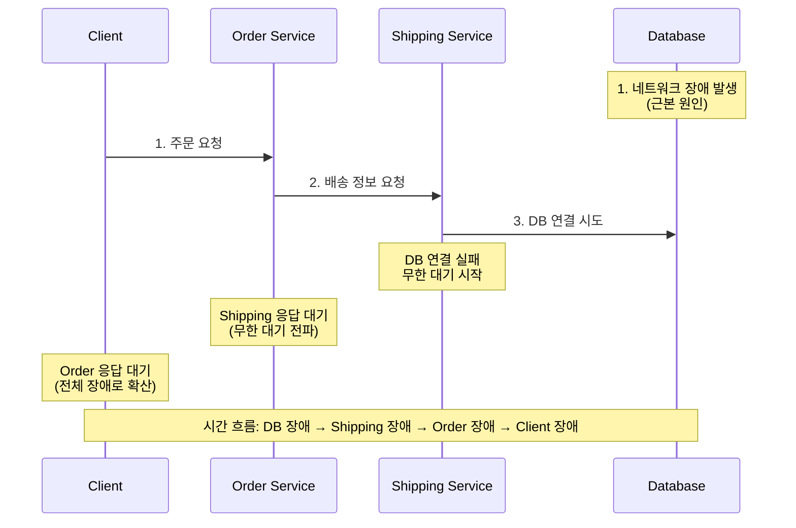
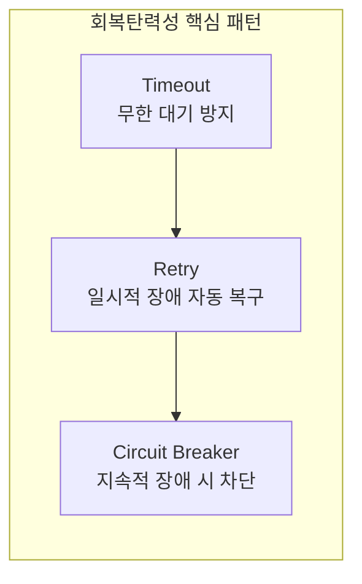
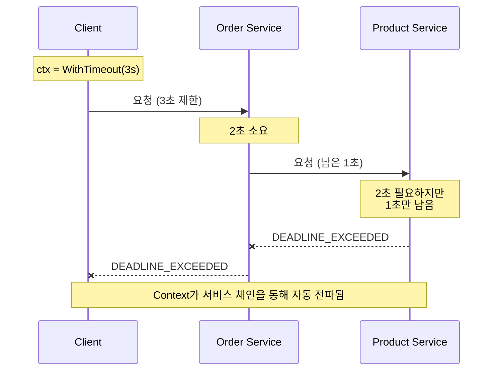
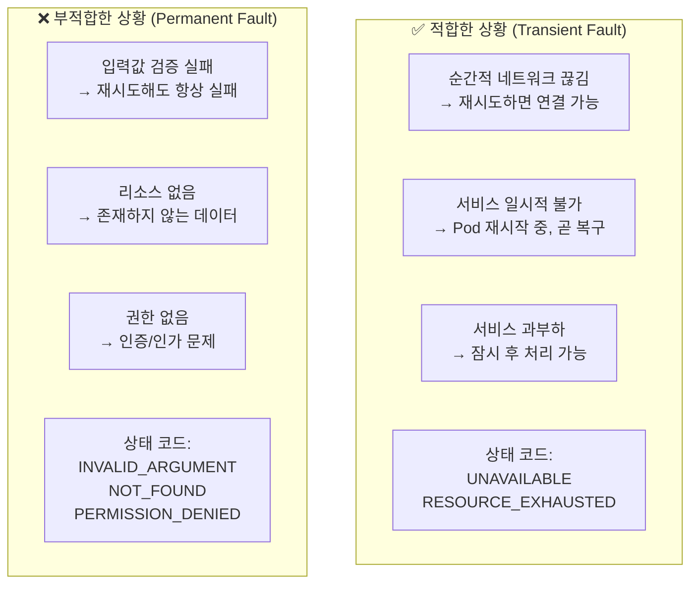
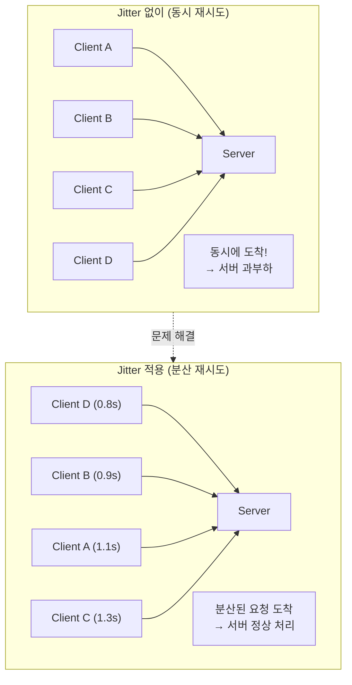
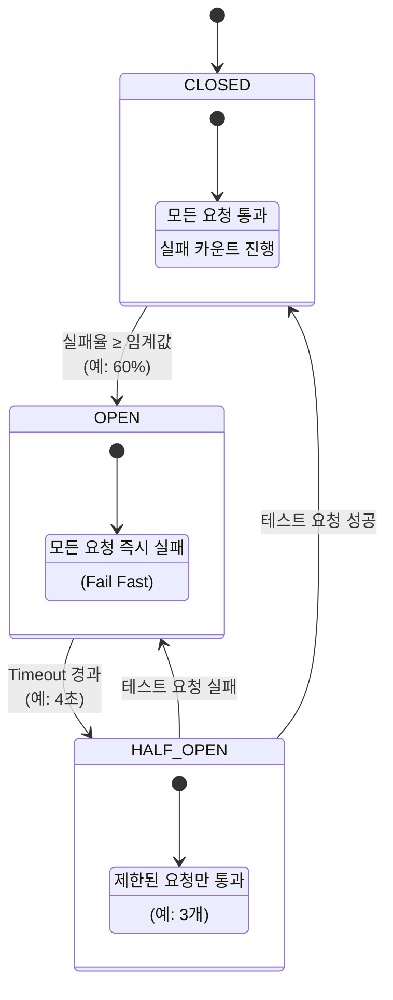
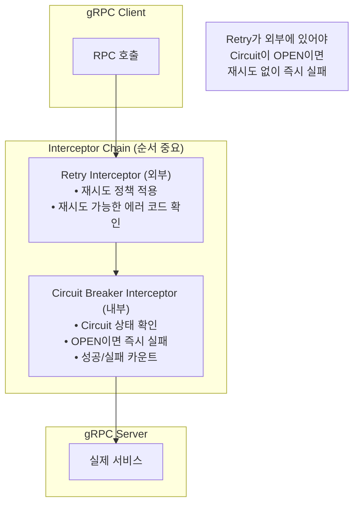
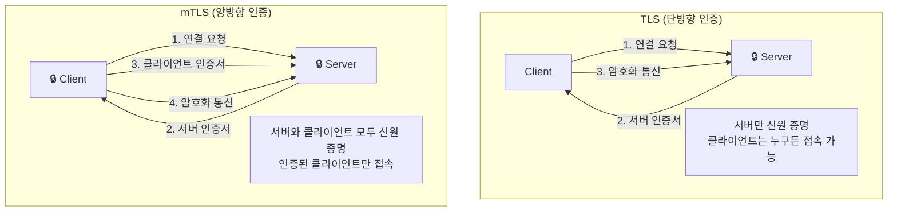

# 6장: 회복탄력적 통신 (Resilient Communication) - 면접 정리

## 핵심 개념 상세 설명

### 1. 회복탄력성의 필요성과 Cascading Failure

마이크로서비스 환경에서는 서비스 간 의존성으로 인해 **장애 전파(Cascading Failure)**가 발생할 수 있습니다. 하나의 서비스 장애가 연쇄적으로 다른 서비스들로 퍼져 전체 시스템이 다운되는 현상입니다.

문제 상황을 구체적으로 살펴보겠습니다. Shipping 서비스가 Database에 연결을 시도하지만 네트워크 장애로 실패합니다. Order 서비스는 Shipping 서비스의 응답을 무한히 대기합니다. 그 결과 Order 서비스도 응답 불가 상태가 되어 전체 시스템이 장애 상태에 빠집니다.

이러한 Cascading Failure를 방지하기 위한 세 가지 핵심 패턴이 있습니다.

---

### 2. Timeout 패턴

Timeout 패턴은 외부 호출에 시간 제한을 설정하여 무한 대기를 방지하는 패턴입니다. Go에서는 `context` 패키지를 사용하여 구현합니다.

#### context.WithDeadline vs context.WithTimeout

두 함수는 동일한 기능을 제공하지만 **시간 지정 방식**이 다릅니다.

| 함수 | 시간 지정 방식 | 사용 예 |
|-----|--------------|--------|
| `WithDeadline` | 절대 시간 | "2025년 1월 22일 15시 30분까지" |
| `WithTimeout` | 상대 시간 | "지금부터 5초 후까지" |

`context.WithDeadline`은 여러 서비스 체인에서 전체 작업의 마감 시간이 정해져 있을 때 유용합니다. `context.WithTimeout`은 대부분의 상황에서 더 직관적이고 널리 사용됩니다.

중요한 점은 **Context가 서비스 체인을 통해 자동으로 전파**된다는 것입니다. Client가 3초 타임아웃을 설정하면, Order 서비스에서 2초를 사용한 후 Product 서비스에는 1초만 남게 됩니다. Product 서비스가 2초를 필요로 하면 `DEADLINE_EXCEEDED` 에러가 발생합니다.

---

### 3. Retry 패턴

Retry 패턴은 **일시적 장애(Transient Fault)**에 대응하기 위해 자동으로 재시도하는 패턴입니다. 모든 에러에 재시도하는 것이 아니라, 재시도로 해결될 가능성이 있는 에러에만 적용해야 합니다.

#### Retry가 적합한 상황과 부적합한 상황

#### Backoff 전략

재시도 간격을 결정하는 전략은 여러 가지가 있습니다.

**Linear Backoff**는 고정 간격으로 재시도합니다. 예를 들어 1초, 1초, 1초로 일정하게 대기합니다. 구현이 단순하지만, 서버 복구에 시간이 필요한 경우 초기 재시도가 모두 실패할 수 있습니다.

**Exponential Backoff**는 지수적으로 간격을 늘립니다. 예를 들어 1초, 2초, 4초, 8초로 증가합니다. 서버에 복구 시간을 주면서 점진적으로 재시도하여 효율적입니다.

**Jitter 추가**는 재시도 간격에 무작위성을 더합니다. 예를 들어 1.1초, 1.8초, 4.2초처럼 변동을 줍니다. 이것이 중요한 이유는 **Thundering Herd 문제**를 방지하기 때문입니다.

여러 클라이언트가 동시에 장애를 겪고 동일한 간격으로 재시도하면, 재시도 요청들이 한꺼번에 서버에 도착하여 다시 과부하를 일으킵니다. Jitter를 추가하면 요청이 분산되어 이 문제를 완화합니다.

---

### 4. Circuit Breaker 패턴

Circuit Breaker는 연속적인 실패가 발생할 때 호출을 차단하여 시스템을 보호하는 패턴입니다. 전기 회로의 차단기(Circuit Breaker)에서 이름을 따왔습니다.

#### 상태 전이 다이어그램

**CLOSED 상태**: 정상 동작 상태입니다. 모든 요청이 실제 서비스로 전달되고, 성공/실패를 카운트합니다. 실패율이 임계값(예: 60%)에 도달하면 OPEN으로 전환합니다.

**OPEN 상태**: 차단 상태입니다. 모든 요청이 실제 서비스를 호출하지 않고 즉시 실패를 반환합니다(Fail Fast). 설정된 Timeout(예: 4초) 후 HALF-OPEN으로 전환합니다.

**HALF-OPEN 상태**: 테스트 상태입니다. 제한된 수의 요청(예: 3개)만 실제 서비스로 전달합니다. 요청이 성공하면 CLOSED로 복귀하고, 실패하면 다시 OPEN으로 전환합니다.

---

### 5. gRPC Interceptor를 통한 중앙 집중화

회복탄력성 패턴들을 개별 호출마다 적용하면 코드 중복이 발생합니다. gRPC Interceptor를 사용하면 모든 호출에 자동으로 적용할 수 있습니다.

**Interceptor 순서가 중요합니다.** Retry가 외부에 있어야 Circuit Breaker가 OPEN이면 재시도 없이 즉시 실패하고, Circuit Breaker가 CLOSED일 때만 실제 재시도가 발생합니다.

---

### 6. TLS와 mTLS (mutual TLS)

마이크로서비스 간 통신 보안을 위해 TLS를 사용합니다. **TLS는 서버만 인증**하고, **mTLS는 클라이언트와 서버 모두를 인증**합니다.

**mTLS가 마이크로서비스에서 중요한 이유**는 Zero-Trust 네트워크 모델 때문입니다. 내부 네트워크라도 신뢰하지 않고, 모든 서비스가 자신의 신원을 증명해야 합니다. 이를 통해 서비스 스푸핑(가장 공격)을 방지하고, 규제 준수(금융, 의료 등)를 달성합니다.

---

## 회복탄력성 패턴 조합

| 패턴 | 목적 | 적용 위치 | 설정 예시 |
|-----|------|----------|----------|
| **Timeout** | 무한 대기 방지 | 모든 외부 호출 | 3-5초 (비즈니스에 따라) |
| **Retry** | 일시적 장애 복구 | Transient Fault에만 | 3-5회, Exponential + Jitter |
| **Circuit Breaker** | 지속적 장애 차단 | 서비스 단위 | 60% 실패율, 4초 Timeout |

### 조합 시 주의사항

**총 대기 시간 계산**이 중요합니다. Timeout(3초) × Retry(5회) = 최대 15초 대기가 발생할 수 있습니다. 이 시간이 사용자 경험에 영향을 주지 않도록 설계해야 합니다.

**Circuit Breaker는 Retry 외부에 위치**해야 합니다. Circuit이 OPEN이면 재시도 없이 즉시 실패해야 하기 때문입니다.

---

## 면접 예상 질문 및 모범 답안

### Q1. Circuit Breaker의 세 가지 상태(Closed, Open, Half-Open)와 전이 조건을 설명해주세요.

**모범 답안:**

Circuit Breaker는 전기 회로의 차단기처럼 **연속적인 실패 시 호출을 차단**하여 시스템을 보호하는 패턴입니다.

**CLOSED 상태**는 정상 동작 상태입니다. 모든 요청이 실제 서비스로 전달되며, 성공과 실패를 카운트합니다. 실패율이 설정된 임계값(예: 60%)에 도달하면 OPEN 상태로 전환됩니다.

**OPEN 상태**는 차단 상태입니다. 실제 서비스를 호출하지 않고 모든 요청에 즉시 에러를 반환합니다. 이를 **Fail Fast**라고 합니다. 설정된 Timeout(예: 4초)이 경과하면 HALF-OPEN 상태로 전환됩니다. OPEN 상태의 목적은 장애가 발생한 서비스에 추가 부하를 주지 않고, 복구할 시간을 주는 것입니다.

**HALF-OPEN 상태**는 테스트 상태입니다. 제한된 수의 요청(예: 3개)만 실제 서비스로 전달하여 복구 여부를 확인합니다. 요청이 성공하면 서비스가 복구되었다고 판단하고 CLOSED로 돌아갑니다. 요청이 실패하면 아직 복구되지 않았다고 판단하고 다시 OPEN으로 전환합니다.

실무에서는 gobreaker(Sony) 라이브러리를 사용하여 구현하며, `ReadyToTrip` 함수로 OPEN 전환 조건을 커스터마이징합니다.

---

### Q2. Retry 패턴이 오히려 문제가 될 수 있는 상황은 무엇인가요?

**모범 답안:**

Retry 패턴은 일시적 장애에 효과적이지만, 잘못 적용하면 문제를 악화시킬 수 있습니다.

**첫째, 비멱등성(Non-Idempotent) 작업에 적용하면 문제가 됩니다.** 결제 처리 같은 작업에서 요청이 성공했는데 응답만 실패한 경우, 재시도하면 중복 결제가 발생합니다. 재시도는 반드시 멱등성이 보장된 작업에만 적용해야 합니다.

**둘째, 영구적 장애(Permanent Fault)에 적용하면 낭비입니다.** `INVALID_ARGUMENT`(입력값 오류), `NOT_FOUND`(리소스 없음), `PERMISSION_DENIED`(권한 없음) 같은 에러는 재시도해도 항상 실패합니다. 재시도 가능한 상태 코드(`UNAVAILABLE`, `RESOURCE_EXHAUSTED`)만 타겟팅해야 합니다.

**셋째, Thundering Herd 현상을 일으킬 수 있습니다.** 장애 발생 시 모든 클라이언트가 동시에 재시도하면, 복구 중인 서비스에 갑자기 폭탄 같은 요청이 들어와 다시 장애가 발생합니다. Exponential Backoff with Jitter로 요청을 분산해야 합니다.

**넷째, 총 대기 시간이 길어집니다.** Timeout 3초 × Retry 5회 = 15초 대기가 발생할 수 있어, 사용자 경험이 크게 저하될 수 있습니다.

결론적으로 Retry는 "언제 재시도할지"보다 **"언제 재시도하지 않을지"**를 명확히 정의하는 것이 중요합니다.

---

### Q3. TLS와 mTLS의 차이점과 마이크로서비스에서 mTLS를 사용하는 이유를 설명해주세요.

**모범 답안:**

**TLS(Transport Layer Security)**는 서버만 인증서로 신원을 증명합니다. 클라이언트는 서버 인증서를 검증하여 "내가 연결한 서버가 진짜 맞는지" 확인합니다. 일반 웹 브라우저에서 HTTPS로 은행 사이트에 접속할 때 이 방식을 사용합니다.

**mTLS(mutual TLS)**는 서버와 클라이언트 모두 인증서로 신원을 증명합니다. 서버도 클라이언트 인증서를 검증하여 "접속한 클라이언트가 인가된 서비스인지" 확인합니다.

마이크로서비스에서 mTLS를 사용하는 이유는 **Zero-Trust 보안 모델** 때문입니다. 전통적인 경계 보안 모델에서는 "내부 네트워크는 안전하다"고 가정했습니다. 하지만 클라우드, 컨테이너 환경에서는 네트워크 경계가 모호하고, 내부 침입자나 잘못 설정된 서비스의 위험이 있습니다.

mTLS를 적용하면 세 가지 이점이 있습니다. **첫째, 서비스 스푸핑 방지**입니다. 악성 서비스가 Payment 서비스를 가장해도 인증서가 없으면 통신할 수 없습니다. **둘째, 통신 암호화**입니다. 서비스 간 모든 트래픽이 암호화되어 도청이 불가능합니다. **셋째, 규제 준수**입니다. 금융, 의료 등 산업에서 요구하는 보안 기준을 충족합니다.

프로덕션에서는 Istio 같은 서비스 메시를 사용하여 애플리케이션 코드 수정 없이 mTLS를 자동 적용하는 것이 일반적입니다.

---

### Q4. context.WithTimeout과 context.WithDeadline의 차이는 무엇인가요?

**모범 답안:**

두 함수는 동일하게 타임아웃이 있는 Context를 생성하지만, **시간을 지정하는 방식**이 다릅니다.

**`context.WithDeadline`**은 절대 시간(특정 시점)을 지정합니다. `context.WithDeadline(ctx, time.Now().Add(5*time.Second))`처럼 사용하며, "2025년 1월 22일 15:30:00까지"라는 의미입니다.

**`context.WithTimeout`**은 상대 시간(지속 기간)을 지정합니다. `context.WithTimeout(ctx, 5*time.Second)`처럼 사용하며, "지금부터 5초 동안"이라는 의미입니다.

실제로 `WithTimeout`은 내부적으로 `WithDeadline(ctx, time.Now().Add(timeout))`을 호출합니다. 즉, 기능적으로는 동일하고 시간 표현 방식만 다릅니다.

사용 시나리오를 보면, 대부분의 경우 `WithTimeout`이 더 직관적이고 널리 사용됩니다. "이 호출은 3초 안에 완료되어야 한다"를 표현하기 쉽습니다.

`WithDeadline`은 여러 서비스를 거치는 요청에서 전체 작업의 마감 시간이 정해져 있을 때 유용합니다. 예를 들어 "15:30:00까지 모든 작업이 완료되어야 한다"는 요구사항이 있으면, 각 서비스에서 동일한 Deadline을 사용하여 일관된 마감 시간을 유지할 수 있습니다.

중요한 점은 두 함수 모두 반환하는 `cancel` 함수를 반드시 호출해야 리소스 누수를 방지할 수 있다는 것입니다. `defer cancel()`로 항상 정리합니다.

---

### Q5. Exponential Backoff에 Jitter를 추가하는 이유는 무엇인가요?

**모범 답안:**

Jitter(무작위 변동)를 추가하는 주된 이유는 **Thundering Herd 문제를 방지**하기 위함입니다.

Thundering Herd는 많은 클라이언트가 동시에 동일한 리소스에 접근하여 과부하를 일으키는 현상입니다. 장애 발생 시 100개의 클라이언트가 모두 동일한 Exponential Backoff(1초, 2초, 4초)를 사용하면, 모든 재시도 요청이 정확히 같은 시점에 도착합니다.

- 1차 재시도: 100개 동시 요청 (1초 후)
- 2차 재시도: 100개 동시 요청 (2초 후)
- 3차 재시도: 100개 동시 요청 (4초 후)

서버가 복구되더라도 이 집중된 요청으로 다시 과부하가 발생합니다.

**Jitter를 추가하면 각 클라이언트의 재시도 시점이 분산됩니다.** 예를 들어 기본 1초에 ±20% Jitter를 적용하면 0.8초~1.2초 사이에 분포됩니다.

- 1차 재시도: 0.8초~1.2초 사이에 분산
- 2차 재시도: 1.6초~2.4초 사이에 분산
- 3차 재시도: 3.2초~4.8초 사이에 분산

이렇게 하면 서버에 점진적으로 요청이 도착하여 복구 기회를 주면서도 클라이언트들이 결국 성공적으로 재시도할 수 있습니다.

go-grpc-middleware 라이브러리에서는 `BackoffLinearWithJitter`나 `BackoffExponentialWithJitter` 함수로 쉽게 적용할 수 있습니다.

---

### Q6. gRPC 에러에 상세 정보(errdetails)를 포함해야 하는 이유는 무엇인가요?

**모범 답안:**

단순히 상태 코드와 메시지만으로는 충분한 에러 정보를 전달하기 어려운 상황이 있습니다.

**첫째, 다중 필드 검증 실패 시**입니다. 주문 요청에서 user_id, product_id, quantity 세 필드가 모두 잘못되었을 때, 단일 메시지로는 모든 에러를 표현하기 어렵습니다. `errdetails.BadRequest`의 `FieldViolations`를 사용하면 필드별로 에러를 구조화할 수 있습니다.

**둘째, 클라이언트 UI 표시를 위해서**입니다. 구조화된 에러 정보가 있으면 클라이언트가 각 필드 옆에 해당 에러 메시지를 표시할 수 있습니다. 단순 문자열 파싱보다 훨씬 안정적입니다.

**셋째, 디버깅과 로깅을 위해서**입니다. 에러가 어떤 서비스의 어떤 필드에서 발생했는지 명확히 알 수 있어 문제 추적이 쉬워집니다.

**넷째, 국제화(i18n) 지원을 위해서**입니다. 에러 코드와 필드 정보가 구조화되어 있으면, 클라이언트에서 사용자 언어에 맞는 메시지로 변환하기 쉽습니다.

Google의 API 설계 가이드라인에서도 `errdetails` 패키지의 표준 에러 타입(BadRequest, PreconditionFailure, ResourceInfo 등)을 사용할 것을 권장합니다. 이렇게 하면 다양한 언어의 gRPC 클라이언트에서 일관되게 에러를 처리할 수 있습니다.

---

### Q7. Circuit Breaker의 ReadyToTrip 함수는 어떤 역할을 하나요?

**모범 답안:**

`ReadyToTrip`은 gobreaker 라이브러리에서 **CLOSED 상태에서 OPEN 상태로 전환할 조건을 정의**하는 콜백 함수입니다.

기본 시그니처는 `func(counts gobreaker.Counts) bool`이며, true를 반환하면 Circuit이 OPEN됩니다. Counts 구조체에는 `TotalRequests`, `TotalSuccesses`, `TotalFailures`, `ConsecutiveSuccesses`, `ConsecutiveFailures` 등의 통계 정보가 포함됩니다.

일반적인 구현 예시는 다음과 같습니다.

- **실패율 기반**: `failureRatio := float64(counts.TotalFailures) / float64(counts.Requests); return failureRatio >= 0.6` (60% 이상 실패 시 Open)
- **연속 실패 기반**: `return counts.ConsecutiveFailures >= 5` (5번 연속 실패 시 Open)
- **복합 조건**: `return counts.Requests >= 10 && failureRatio >= 0.5` (최소 10개 요청 후 50% 이상 실패 시 Open)

`ReadyToTrip`을 커스터마이징하는 이유는 비즈니스 요구사항에 따라 Circuit 전환 기준이 다르기 때문입니다. 중요도가 높은 서비스는 보수적으로(낮은 실패율에서도 Open), 중요도가 낮은 서비스는 공격적으로(높은 실패율에서만 Open) 설정할 수 있습니다.

---

### Q8. mTLS에서 CA(Certificate Authority)의 역할은 무엇인가요?

**모범 답안:**

CA(Certificate Authority)는 인증서를 발급하고 서명하는 신뢰할 수 있는 기관으로, **mTLS 신뢰 체인의 핵심**입니다.

CA의 역할은 세 가지입니다. **첫째, 인증서 발급**입니다. 서버와 클라이언트의 인증서 요청(CSR)을 받아 서명하여 유효한 인증서를 발급합니다. **둘째, 신뢰 앵커(Trust Anchor)**입니다. 모든 서비스가 동일한 CA를 신뢰하면, 그 CA가 서명한 인증서도 자동으로 신뢰합니다. **셋째, 인증서 검증**입니다. 통신 상대방이 제시한 인증서가 신뢰하는 CA에 의해 서명되었는지 확인합니다.

마이크로서비스에서 CA 운영 방식은 환경에 따라 다릅니다. **개발/테스트 환경**에서는 OpenSSL로 자체 CA를 생성하여 사용합니다. **프로덕션 환경**에서는 cert-manager(Kubernetes), HashiCorp Vault, AWS Certificate Manager 같은 도구를 사용하여 자동화합니다. **서비스 메시 환경**에서는 Istio의 Citadel, Linkerd의 Identity 컨트롤러가 자동으로 CA 역할을 수행합니다.

**CA 인증서의 보안이 매우 중요합니다.** CA 개인키가 유출되면 공격자가 임의의 인증서를 발급할 수 있어 전체 신뢰 체계가 무너집니다. 따라서 CA 개인키는 HSM(Hardware Security Module)이나 Vault 같은 안전한 저장소에 보관합니다.

---

## 실무 체크리스트

### Timeout 적용 시

- [ ] 모든 외부 호출에 context.WithTimeout을 적용했는가
- [ ] 타임아웃 값이 비즈니스 요구사항에 적합한가
- [ ] defer cancel()로 리소스 정리를 보장했는가
- [ ] 타임아웃 시 적절한 에러 처리와 로깅이 있는가

### Retry 적용 시

- [ ] 재시도 가능한 상태 코드만 타겟팅했는가 (UNAVAILABLE, RESOURCE_EXHAUSTED)
- [ ] 멱등성이 보장된 작업에만 적용했는가
- [ ] Exponential Backoff with Jitter를 사용했는가
- [ ] 최대 재시도 횟수와 총 대기 시간을 계산했는가

### Circuit Breaker 적용 시

- [ ] ReadyToTrip 조건이 비즈니스에 적합한가
- [ ] Half-Open에서 허용할 요청 수가 적절한가
- [ ] Open → Half-Open 전환 Timeout이 적절한가
- [ ] 상태 변경 시 로깅/알림이 구성되어 있는가

### mTLS 적용 시

- [ ] CA 인증서가 안전하게 저장되어 있는가
- [ ] 서버와 클라이언트 인증서의 만료일을 모니터링하는가
- [ ] 인증서 갱신 자동화가 구성되어 있는가
- [ ] ServerName이 인증서의 CN/SAN과 일치하는가

---

## 참고 자료

- go-grpc-middleware: https://github.com/grpc-ecosystem/go-grpc-middleware
- gobreaker (Sony): https://github.com/sony/gobreaker
- gRPC Error Handling: https://grpc.io/docs/guides/error/
- Google API Design Guide - Errors: https://cloud.google.com/apis/design/errors
- Release It! (Michael Nygard): Circuit Breaker 패턴의 원서
