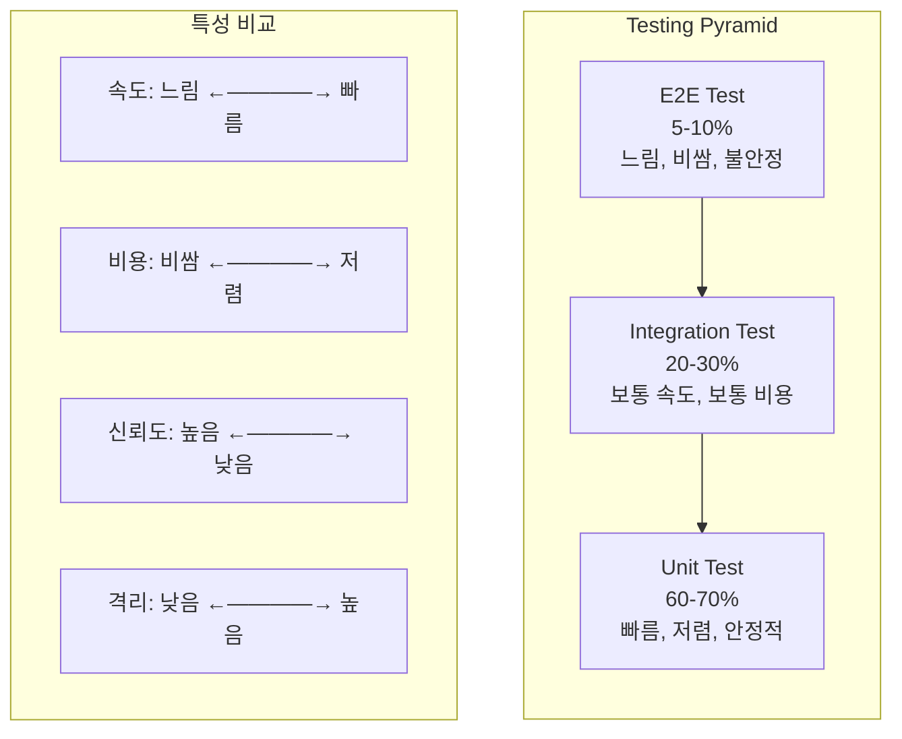
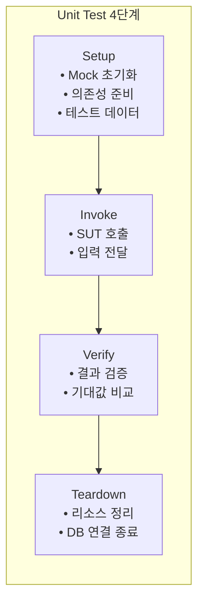
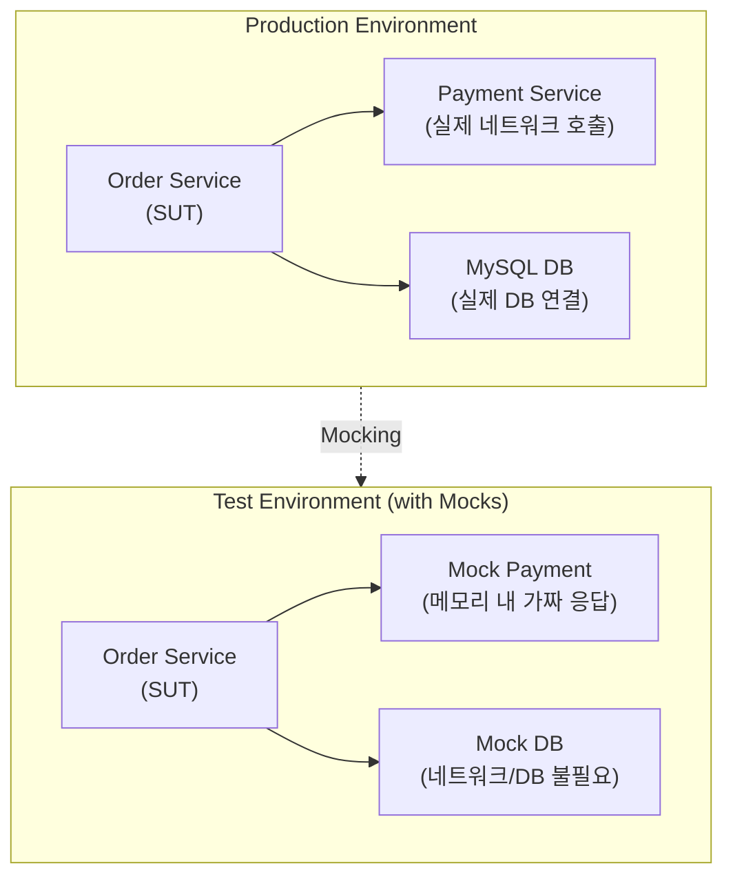
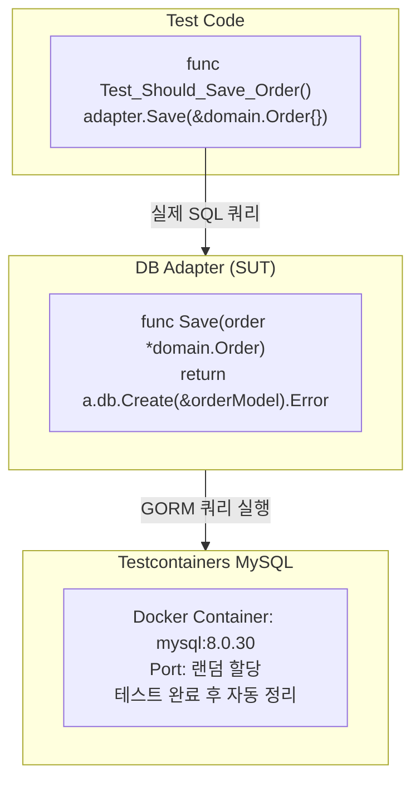
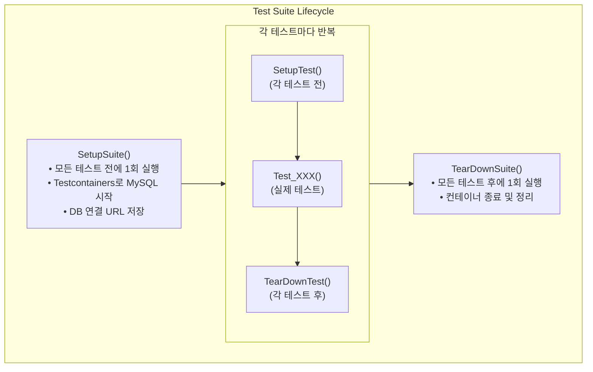
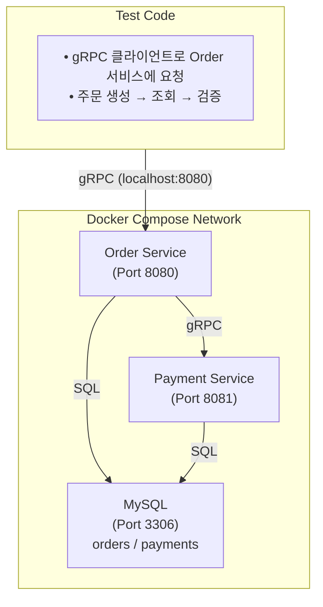
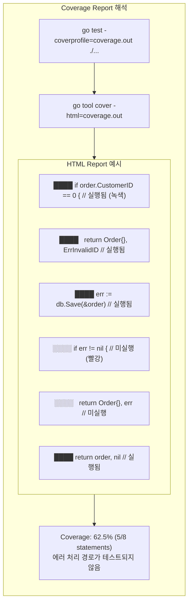

# 7장: 마이크로서비스 테스팅 (Testing Microservices) - 면접 정리

## 핵심 개념 상세 설명

### 1. Testing Pyramid (테스트 피라미드)

테스트 피라미드는 소프트웨어 테스트를 세 가지 범주로 구분하고, 각 범주의 적정 비율을 시각적으로 제시하는 개념입니다. Mike Cohn이 제안한 이 모델은 효율적인 테스트 전략의 기본 원칙을 제공합니다.

피라미드의 핵심 원칙은 **아래로 갈수록 테스트가 더 빠르고 저렴하다**는 것입니다. 따라서 Unit Test를 가장 많이 작성하고, E2E Test는 핵심 흐름만 검증합니다. 이 비율을 역전시키면(Ice Cream Cone Anti-pattern) 테스트 실행 시간이 길어지고 유지보수가 어려워집니다.

---

### 2. Unit Testing

Unit Test는 개별 컴포넌트를 격리하여 테스트하는 방법입니다. 테스트 대상을 **SUT(System Under Test)**라고 하며, 이는 함수, 메서드, 클래스 등이 될 수 있습니다.

#### 테스트 워크플로우 (4단계)

**Setup** 단계에서는 테스트에 필요한 환경과 의존성을 준비합니다. Mock 객체를 초기화하고 기대하는 동작을 정의합니다.

**Invoke** 단계에서는 SUT를 실제로 호출합니다. 테스트하려는 함수나 메서드에 입력값을 전달합니다.

**Verify** 단계에서는 실제 결과와 기대 결과를 비교합니다. assert 함수들을 사용하여 검증합니다.

**Teardown** 단계에서는 테스트에서 사용한 리소스를 정리합니다. 데이터베이스 연결 종료, 임시 파일 삭제 등이 해당됩니다.

---

### 3. Mocking

Mocking은 테스트에서 실제 의존성을 가짜 객체로 대체하는 기법입니다. 이를 통해 SUT를 외부 의존성으로부터 완전히 격리할 수 있습니다.

**Mock을 사용하면 세 가지 이점이 있습니다.** 첫째, 테스트 속도가 빨라집니다. 네트워크 호출이나 DB 접근 없이 메모리에서 즉시 응답합니다. 둘째, 테스트가 결정적(Deterministic)이 됩니다. 외부 시스템 상태에 관계없이 항상 동일한 결과를 얻습니다. 셋째, 에러 시나리오 테스트가 쉬워집니다. "DB 연결 실패", "결제 거부" 같은 상황을 쉽게 시뮬레이션할 수 있습니다.

---

### 4. Integration Testing

Integration Test는 두 개 이상의 모듈이 함께 올바르게 동작하는지 검증합니다. Unit Test와 달리 **실제 의존성(데이터베이스 등)**을 사용합니다.

**Testcontainers**는 Docker를 활용하여 테스트 시 실제 의존성(MySQL, Redis, Kafka 등)을 프로그래밍 방식으로 생성하고 관리합니다. 테스트 시작 시 컨테이너를 자동으로 생성하고, 테스트 종료 후 자동으로 정리합니다.

---

### 5. Test Suite Lifecycle

testify/suite 패키지는 관련된 테스트들을 그룹화하고 공통 설정/정리 로직을 공유할 수 있게 합니다.

이 구조를 통해 **무거운 초기화 작업(컨테이너 시작)을 한 번만 수행**하고 여러 테스트에서 재사용할 수 있습니다. 각 테스트 간 데이터 격리는 SetupTest/TearDownTest에서 처리합니다.

---

### 6. End-to-End Testing

E2E Test는 전체 애플리케이션 스택을 실행하고 실제 사용자 흐름을 테스트합니다. 실제 프로덕션 환경과 가장 유사한 조건에서 테스트합니다.

**Docker Compose를 사용하면** 여러 서비스를 정의하고 의존성 순서(depends_on)와 헬스체크(healthcheck)를 설정할 수 있습니다. 테스트 코드는 `docker-compose up`으로 스택을 시작하고, 테스트 후 `docker-compose down`으로 정리합니다.

---

### 7. Test Coverage

Test Coverage는 테스트가 소스 코드의 얼마나 많은 부분을 실행했는지 측정하는 지표입니다. 일반적으로 Statement Coverage(라인 커버리지)를 사용합니다.

**Coverage는 유용한 지표이지만 한계가 있습니다.** 100% 커버리지가 버그 없음을 보장하지 않습니다. 코드가 "실행"되었다고 해서 "올바르게 검증"된 것은 아니기 때문입니다. 중요한 것은 의미 있는 테스트를 작성하는 것이며, 커버리지는 참고 지표로 활용해야 합니다.

---

## 테스트 전략 비교

| 항목 | Unit Test | Integration Test | E2E Test |
|-----|-----------|-----------------|----------|
| **속도** | 매우 빠름 (ms) | 보통 (s) | 느림 (min) |
| **격리 수준** | 완전 격리 | 부분 격리 | 격리 없음 |
| **신뢰도** | 낮음 (단일 컴포넌트) | 중간 (모듈 통합) | 높음 (전체 흐름) |
| **유지보수** | 쉬움 | 보통 | 어려움 |
| **디버깅** | 쉬움 (명확한 범위) | 보통 | 어려움 (복잡한 스택) |
| **비용** | 저렴 | 보통 | 비쌈 (인프라 필요) |
| **실패 원인** | 명확 | 보통 | 불명확 |
| **권장 비율** | 60-70% | 20-30% | 5-10% |

---

## 면접 예상 질문 및 모범 답안

### Q1. Testing Pyramid에서 Unit Test 비율이 가장 높은 이유는 무엇인가요?

**모범 답안:**

Testing Pyramid에서 Unit Test 비율이 가장 높은 이유는 **비용 대비 효과가 가장 좋기 때문**입니다.

**첫째, 속도가 빠릅니다.** 외부 의존성 없이 메모리에서 실행되므로 밀리초 단위로 완료됩니다. 수천 개의 Unit Test도 몇 초 만에 실행할 수 있어 개발자 피드백 루프가 짧습니다.

**둘째, 비용이 저렴합니다.** 데이터베이스, 컨테이너, 네트워크 인프라가 필요 없습니다. CI/CD 파이프라인에서도 빠르게 실행되어 컴퓨팅 비용이 낮습니다.

**셋째, 디버깅이 쉽습니다.** 테스트가 실패하면 범위가 좁아서(단일 함수/메서드) 원인 파악이 명확합니다. 반면 E2E 테스트가 실패하면 여러 서비스 중 어디가 문제인지 찾기 어렵습니다.

**넷째, 안정적입니다.** 외부 시스템 상태에 의존하지 않아 Flaky Test(불안정한 테스트)가 적습니다. 네트워크 타임아웃, DB 연결 실패 같은 환경 문제가 없습니다.

다만 Unit Test만으로는 모듈 간 통합 문제나 전체 시스템 흐름을 검증할 수 없어, Integration Test와 E2E Test로 보완해야 합니다.

---

### Q2. Mock과 Stub의 차이점은 무엇인가요?

**모범 답안:**

Mock과 Stub은 모두 **테스트 더블(Test Double)**의 종류이지만, 목적과 검증 방식이 다릅니다.

**Stub**은 미리 정의된 응답을 반환하는 가짜 객체입니다. "이 입력이 들어오면 이 출력을 반환해라"만 정의합니다. **상태 기반(State-based) 테스트**에 사용되며, 테스트 대상의 반환값이나 상태 변화를 검증합니다. 예를 들어 "GetUser(1)이 호출되면 User{Name: 'John'}을 반환"처럼 사용합니다.

**Mock**은 Stub의 기능에 더해 **행동 검증(Behavior Verification)**을 수행합니다. 특정 메서드가 호출되었는지, 몇 번 호출되었는지, 어떤 인자로 호출되었는지를 검증합니다. 예를 들어 "Charge 메서드가 정확히 1번, order 객체와 함께 호출되었는지" 확인합니다.

testify/mock 라이브러리에서 `mock.On("Charge", mock.Anything).Return(nil)`은 Stub 역할을 하고, `mock.AssertCalled(t, "Charge", expectedOrder)`은 Mock의 행동 검증 역할을 합니다.

실무에서는 구분 없이 Mock이라는 용어를 광범위하게 사용하는 경우가 많지만, 면접에서는 이론적 차이를 알고 있는 것이 좋습니다.

---

### Q3. Integration Test와 E2E Test를 구분하는 기준은 무엇인가요?

**모범 답안:**

Integration Test와 E2E Test는 **테스트 범위와 목적**에서 차이가 있습니다.

**Integration Test**는 두세 개 모듈의 통합을 검증합니다. 예를 들어 DB Adapter가 실제 MySQL과 올바르게 동작하는지, 또는 Payment Adapter가 실제 gRPC 호출을 올바르게 수행하는지 테스트합니다. 테스트 범위가 좁고, 특정 통합 지점에 집중합니다. Testcontainers로 단일 의존성(MySQL)만 실행하는 것이 일반적입니다.

**E2E Test**는 전체 시스템 흐름을 검증합니다. 실제 사용자 시나리오(주문 생성 → 결제 → 조회)를 처음부터 끝까지 테스트합니다. 모든 서비스가 함께 실행되어야 하며, Docker Compose로 전체 스택을 구성합니다. 테스트 범위가 넓고, 시스템 전체의 동작을 확인합니다.

구분 기준을 정리하면, **Integration Test는 "이 어댑터가 실제 DB와 잘 동작하는가?"**를 묻고, **E2E Test는 "사용자가 주문을 완료할 수 있는가?"**를 묻습니다. Integration Test에서 실패하면 특정 모듈 통합 문제이고, E2E Test에서 실패하면 서비스 간 상호작용이나 데이터 흐름 문제일 수 있습니다.

---

### Q4. Test Coverage 80%의 의미와 한계는 무엇인가요?

**모범 답안:**

Test Coverage 80%는 **테스트가 소스 코드의 80%를 실행**했다는 의미입니다. 일반적으로 Statement Coverage(라인 커버리지)를 사용하며, 전체 실행 가능한 문장 중 80%가 테스트에 의해 실행되었음을 나타냅니다.

하지만 Coverage에는 중요한 한계가 있습니다. **첫째, 실행과 검증은 다릅니다.** 코드가 실행되었다고 해서 올바르게 검증된 것은 아닙니다. assert 없이 함수만 호출해도 커버리지는 올라갑니다.

**둘째, 모든 경로를 테스트하지 않습니다.** 조건문의 한 분기만 실행해도 라인은 커버됩니다. if-else에서 if만 테스트하면 else 분기는 검증되지 않지만 전체 라인 수에서 비율만 보면 놓치기 쉽습니다.

**셋째, 로직의 복잡성을 반영하지 않습니다.** 단순한 getter 함수와 복잡한 비즈니스 로직이 동일한 가중치를 갖습니다.

**넷째, 100% 커버리지가 버그 없음을 보장하지 않습니다.** 엣지 케이스, 동시성 문제, 통합 문제 등은 커버리지로 측정되지 않습니다.

실무에서는 커버리지를 **"테스트되지 않은 코드를 찾는 도구"**로 활용하고, 절대적인 품질 지표로 삼지 않아야 합니다. 80% 이상을 목표로 하되, 의미 있는 테스트를 작성하는 것이 더 중요합니다.

---

### Q5. Testcontainers를 사용하는 이유와 장점은 무엇인가요?

**모범 답안:**

Testcontainers는 Docker 컨테이너를 프로그래밍 방식으로 관리하여 **테스트에서 실제 의존성을 사용**할 수 있게 해주는 라이브러리입니다.

사용하는 이유는 **실제 의존성 테스트의 필요성** 때문입니다. Unit Test에서 Mock을 사용하면 DB Adapter의 SQL 문법 오류, GORM 설정 문제 등을 발견할 수 없습니다. 실제 MySQL을 대상으로 테스트해야 이런 문제를 조기에 발견합니다.

장점으로는 **첫째, 환경 일관성**입니다. 개발자 로컬, CI 서버 모두에서 동일한 버전의 MySQL을 사용합니다. "내 컴퓨터에서는 되는데" 문제가 줄어듭니다.

**둘째, 자동 생명주기 관리**입니다. 테스트 시작 시 컨테이너를 자동 생성하고, 종료 시 자동 정리합니다. 개발자가 수동으로 Docker를 관리할 필요가 없습니다.

**셋째, 포트 충돌 방지**입니다. 랜덤 포트를 할당하므로 여러 테스트가 병렬로 실행되어도 충돌이 없습니다.

**넷째, 격리된 테스트 환경**입니다. 각 테스트 스위트가 독립적인 컨테이너를 사용하므로 데이터 오염이 없습니다.

단점은 Docker가 필요하고 컨테이너 시작 시간(보통 몇 초)이 있어 Unit Test보다 느리다는 것입니다.

---

### Q6. Flaky Test란 무엇이고 어떻게 방지하나요?

**모범 답안:**

Flaky Test는 **코드 변경 없이도 때로는 성공하고 때로는 실패하는 불안정한 테스트**입니다. 신뢰할 수 없는 테스트는 개발자가 테스트 결과를 무시하게 만들어 테스트의 가치를 떨어뜨립니다.

주요 원인으로는 **첫째, 타이밍 의존성**이 있습니다. `time.Sleep(1*time.Second)` 후 검증하는 테스트는 시스템 부하에 따라 실패할 수 있습니다.

**둘째, 테스트 간 데이터 공유**입니다. 이전 테스트가 남긴 데이터가 다음 테스트에 영향을 줍니다.

**셋째, 외부 시스템 의존성**입니다. 실제 외부 API를 호출하면 네트워크 상태에 따라 실패합니다.

**넷째, 랜덤 데이터 사용**입니다. 테스트에서 난수를 사용하면 특정 값에서만 실패할 수 있습니다.

방지 방법으로는 **타이밍 대신 이벤트 기반 대기**(wait.ForSQL처럼 조건 충족까지 대기)를 사용합니다. 각 테스트 전후로 데이터를 정리하거나 트랜잭션 롤백을 사용합니다. 외부 시스템은 Mock이나 Testcontainers로 대체합니다. 랜덤 대신 고정된 테스트 데이터를 사용합니다.

Flaky Test가 발견되면 즉시 수정하거나 임시로 비활성화하는 것이 좋습니다.

---

### Q7. mockery를 사용한 자동 Mock 생성의 장단점은 무엇인가요?

**모범 답안:**

mockery는 Go 인터페이스로부터 **Mock 코드를 자동 생성**하는 도구입니다. `mockery --all --keeptree` 명령으로 프로젝트의 모든 인터페이스에 대한 Mock을 생성합니다.

장점으로는 **첫째, 시간 절약**입니다. 인터페이스가 많으면 수동으로 Mock을 작성하는 것이 번거롭습니다. 자동 생성으로 보일러플레이트 코드를 줄입니다.

**둘째, 동기화 보장**입니다. 인터페이스가 변경되면 Mock도 재생성해야 하는데, CI 파이프라인에서 자동 생성을 포함시키면 항상 최신 상태를 유지합니다.

**셋째, 일관된 Mock 구조**입니다. 모든 Mock이 동일한 패턴으로 생성되어 팀 내 코드 일관성이 높아집니다.

단점으로는 **첫째, 생성된 코드 관리**입니다. mocks/ 디렉토리를 버전 관리에 포함할지 결정해야 합니다. 포함하면 PR 리뷰 시 노이즈가 되고, 제외하면 빌드 시 생성해야 합니다.

**둘째, 커스터마이징 제한**입니다. 특수한 Mock 동작이 필요하면 수동으로 작성해야 할 수 있습니다.

**셋째, 외부 의존성**입니다. mockery 도구 버전 관리와 CI 환경 설정이 추가로 필요합니다.

---

### Q8. Test Suite의 SetupSuite와 SetupTest의 차이는 무엇인가요?

**모범 답안:**

SetupSuite와 SetupTest는 testify/suite 패키지에서 제공하는 생명주기 메서드로, **실행 시점과 용도**가 다릅니다.

**SetupSuite**는 모든 테스트가 실행되기 전에 **딱 한 번** 실행됩니다. 무거운 초기화 작업에 사용합니다. 예를 들어 Testcontainers로 MySQL 컨테이너를 시작하거나, 공통 테스트 픽스처를 생성하는 작업입니다. 컨테이너 시작은 몇 초가 걸리므로 매 테스트마다 하면 비효율적입니다.

**SetupTest**는 각 개별 테스트 전에 **매번** 실행됩니다. 테스트 간 격리를 위한 작업에 사용합니다. 예를 들어 Mock 객체를 초기화하거나, 테이블 데이터를 정리하거나, 트랜잭션을 시작하는 작업입니다.

대응되는 정리 메서드도 있습니다. TearDownTest는 각 테스트 후 실행되고, TearDownSuite는 모든 테스트 후 한 번 실행됩니다. TearDownSuite에서 컨테이너를 종료합니다.

**실행 순서**를 정리하면: SetupSuite → (SetupTest → Test1 → TearDownTest) → (SetupTest → Test2 → TearDownTest) → ... → TearDownSuite 순서입니다.

---

## 실무 체크리스트

### Unit Test 작성 시

- [ ] Mock으로 외부 의존성을 격리했는가
- [ ] Happy Path뿐 아니라 에러 케이스도 테스트했는가
- [ ] 테스트 이름이 테스트하는 내용을 명확히 설명하는가
- [ ] assert로 의미 있는 검증을 하고 있는가 (단순 실행이 아닌)
- [ ] 테스트가 서로 독립적인가 (순서 의존성 없음)

### Integration Test 작성 시

- [ ] Testcontainers로 실제 의존성을 사용하고 있는가
- [ ] SetupSuite에서 무거운 초기화를 한 번만 수행하는가
- [ ] 각 테스트 후 데이터를 정리하는가
- [ ] 타임아웃을 적절히 설정했는가 (컨테이너 시작 대기)

### E2E Test 작성 시

- [ ] Docker Compose로 전체 스택을 정의했는가
- [ ] 서비스 간 의존성(depends_on)과 헬스체크를 설정했는가
- [ ] 핵심 사용자 시나리오만 테스트하는가 (과도한 E2E 지양)
- [ ] TearDownSuite에서 스택을 정리하는가

### Coverage 관련

- [ ] CI에서 Coverage를 측정하고 있는가
- [ ] Coverage가 낮은 영역을 파악하고 있는가
- [ ] Coverage 수치보다 테스트 품질에 집중하는가

---

## 참고 자료

- Go Testing: https://go.dev/doc/tutorial/add-a-test
- testify: https://github.com/stretchr/testify
- Testcontainers for Go: https://golang.testcontainers.org/
- mockery: https://github.com/vektra/mockery
- Testing Pyramid (Martin Fowler): https://martinfowler.com/articles/practical-test-pyramid.html
