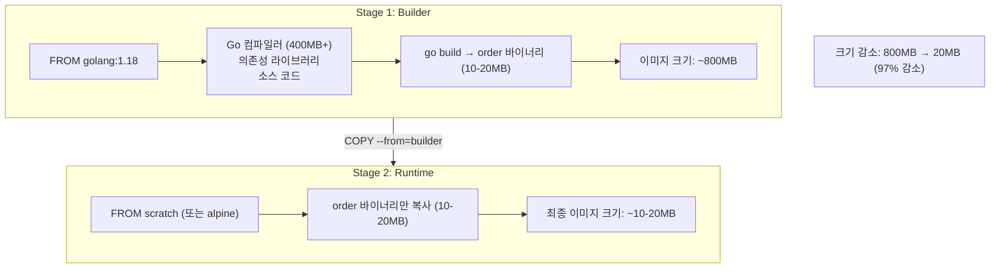
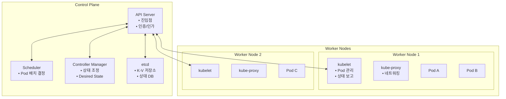
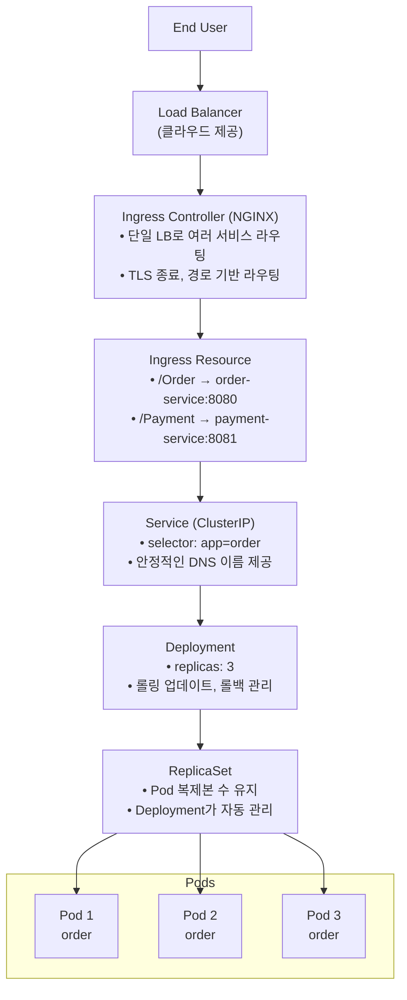
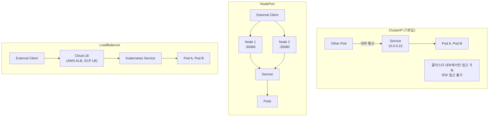
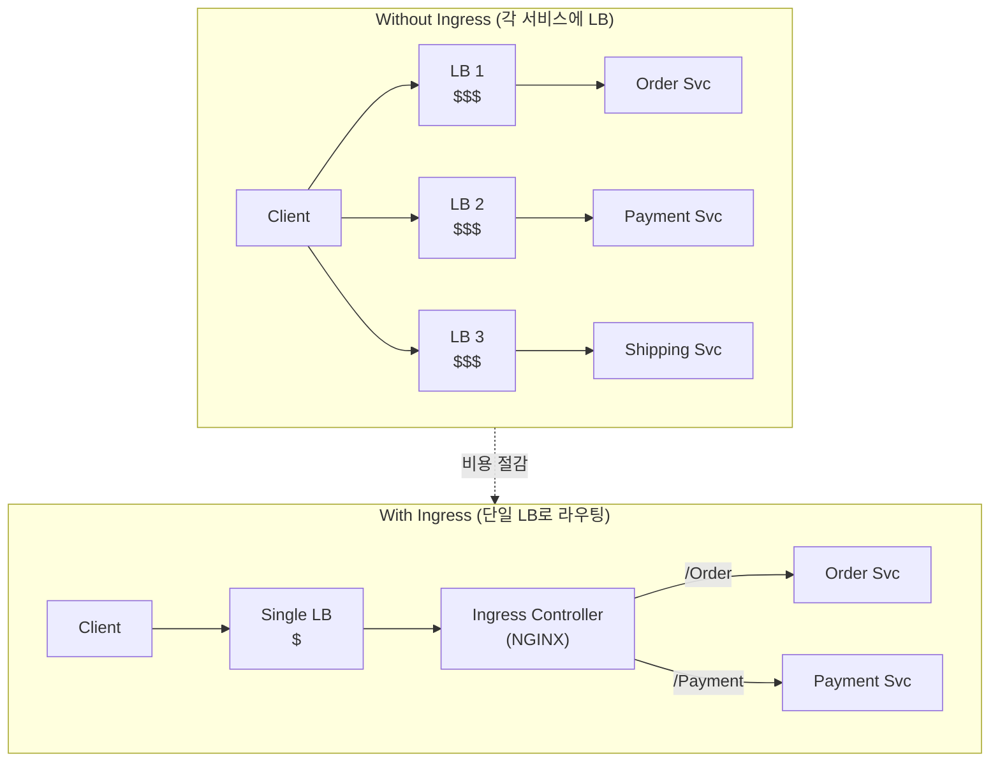
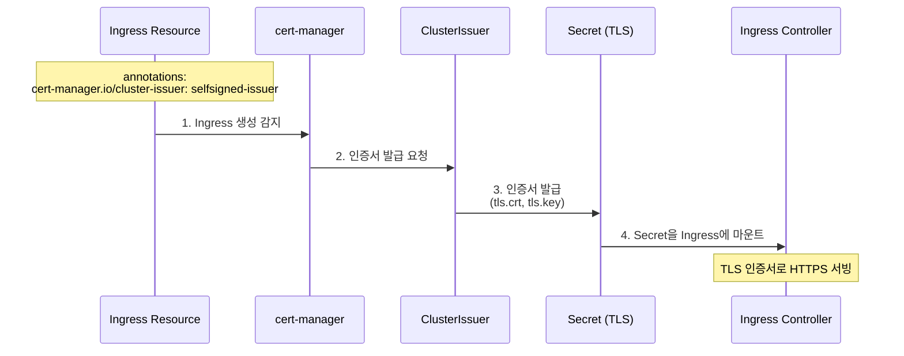
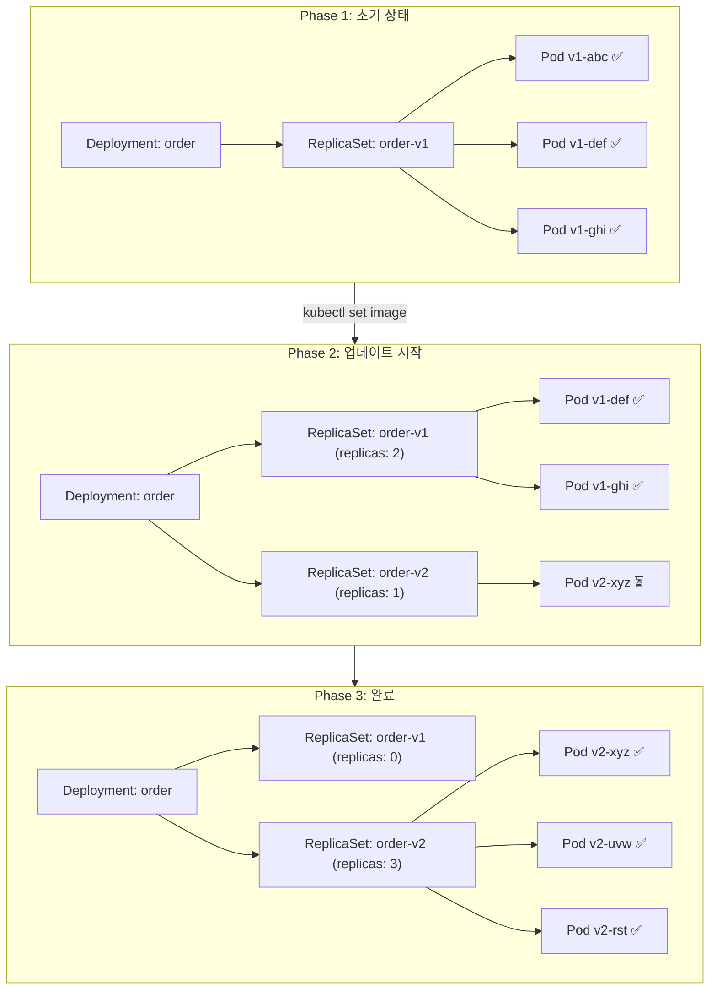
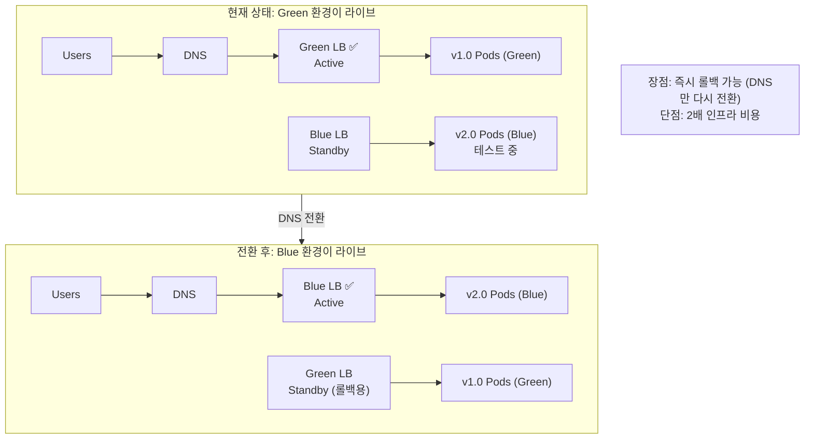
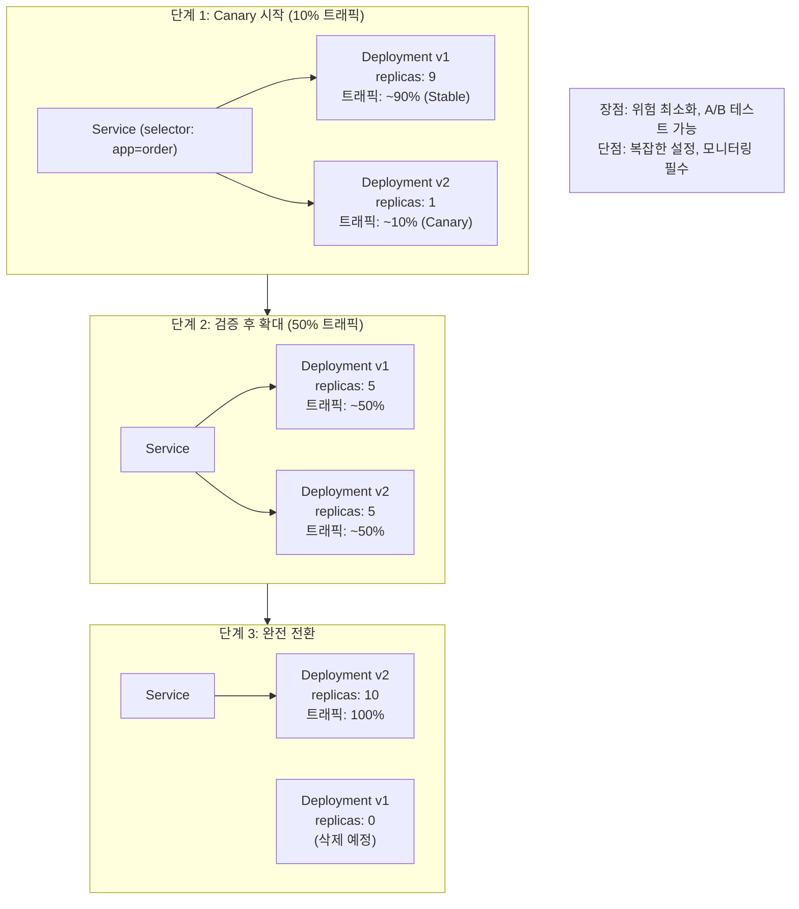

# 8장: Deployment - 면접 정리

## 핵심 개념 상세 설명

### 1. Docker 멀티스테이지 빌드 (Multistage Build)

Go 애플리케이션은 컴파일 타임과 런타임에 필요한 의존성이 다릅니다. 컴파일 시에는 Go 컴파일러, SDK, 의존성 라이브러리가 필요하지만, 런타임에는 컴파일된 바이너리만 있으면 됩니다. 멀티스테이지 빌드는 이 차이를 활용하여 **최종 이미지 크기를 최소화**합니다.

멀티스테이지 빌드를 집을 짓는 것에 비유할 수 있습니다. 건설 현장(Builder Stage)에서 집을 완성한 후, 완성된 집만 새 땅(Runtime Stage)으로 옮깁니다. 건설 장비(Go 컴파일러)는 최종 결과물에 포함되지 않습니다.

**`CGO_ENABLED=0`**은 C 라이브러리 의존성을 제거하여 완전한 정적 바이너리를 생성합니다. 이를 통해 `scratch`(빈 이미지)에서도 실행할 수 있습니다.

---

### 2. Kubernetes 아키텍처

Kubernetes 클러스터는 **Control Plane**과 **Worker Node**로 구성됩니다. Control Plane은 클러스터의 "두뇌" 역할을 하고, Worker Node는 실제 워크로드를 실행합니다.

**API Server**는 모든 요청의 진입점입니다. kubectl 명령, 다른 컴포넌트들의 요청이 모두 API Server를 통해 처리됩니다. 인증, 인가, 어드미션 컨트롤을 수행합니다.

**Scheduler**는 새로 생성된 Pod를 어떤 Worker Node에 배치할지 결정합니다. 리소스 요구사항, 제약 조건, 어피니티 규칙 등을 고려합니다.

**Controller Manager**는 클러스터의 실제 상태를 원하는 상태(Desired State)로 유지합니다. Deployment Controller, ReplicaSet Controller 등 여러 컨트롤러가 포함됩니다.

**etcd**는 클러스터의 모든 상태 정보를 저장하는 분산 Key-Value 저장소입니다. 클러스터의 "진실의 원천(Source of Truth)"입니다.

**kubelet**은 각 Worker Node에서 실행되며, Pod의 생명주기를 관리하고 컨테이너 상태를 API Server에 보고합니다.

**kube-proxy**는 Service 네트워킹을 담당하며, iptables 규칙을 통해 Pod로 트래픽을 라우팅합니다.

---

### 3. Kubernetes 리소스 계층 구조

Kubernetes 리소스들은 계층적 관계를 가지며, 상위 리소스가 하위 리소스를 관리합니다.

**Pod**는 Kubernetes의 최소 배포 단위입니다. 하나 이상의 컨테이너를 포함하며, 같은 Pod 내 컨테이너들은 네트워크와 스토리지를 공유합니다.

**ReplicaSet**은 지정된 수의 Pod 복제본을 유지합니다. Pod가 삭제되면 자동으로 새 Pod를 생성합니다. 직접 생성하기보다는 Deployment를 통해 관리합니다.

**Deployment**는 ReplicaSet을 관리하고 선언적 업데이트를 가능하게 합니다. 롤링 업데이트, 롤백, 스케일링 등을 자동화합니다.

**Service**는 Pod 집합에 대한 안정적인 네트워크 엔드포인트를 제공합니다. Pod의 IP는 변경될 수 있지만, Service의 DNS 이름은 고정됩니다.

---

### 4. Service 타입 비교

Kubernetes Service는 세 가지 주요 타입을 제공합니다.

**ClusterIP**는 기본 타입으로 클러스터 내부에서만 접근할 수 있습니다. 마이크로서비스 간 내부 통신에 사용합니다.

**NodePort**는 모든 Worker Node의 특정 포트(30000-32767)를 통해 외부에서 접근할 수 있습니다. 개발/테스트 환경에서 간단히 사용합니다.

**LoadBalancer**는 클라우드 제공자의 Load Balancer를 자동으로 프로비저닝합니다. 프로덕션 환경에서 외부 트래픽을 받을 때 사용합니다. 단, 서비스마다 별도의 LB가 생성되어 비용이 증가할 수 있습니다.

---

### 5. Ingress Controller

Ingress Controller는 **하나의 Load Balancer로 여러 서비스에 대한 라우팅을 처리**합니다. 각 마이크로서비스마다 LoadBalancer Service를 만드는 것은 비용적으로 비효율적입니다.

**Ingress Controller를 사용하면** 경로 기반 라우팅(/Order, /Payment), 호스트 기반 라우팅(order.example.com), TLS 종료, 인증 등을 중앙에서 처리할 수 있습니다.

gRPC 서비스를 Ingress로 노출할 때는 `nginx.ingress.kubernetes.io/backend-protocol: GRPC` 어노테이션이 필요합니다. gRPC는 HTTP/2를 사용하므로 이를 명시해야 합니다.

---

### 6. cert-manager와 인증서 자동화

cert-manager는 Kubernetes에서 TLS 인증서를 자동으로 발급하고 갱신하는 도구입니다.

**ClusterIssuer**는 클러스터 전체에서 인증서를 발급할 수 있는 리소스입니다. Issuer는 특정 네임스페이스에서만 사용 가능합니다. 프로덕션에서는 Let's Encrypt 같은 ACME 발급자를 설정하여 무료 공인 인증서를 자동 발급받을 수 있습니다.

---

### 7. 배포 전략 상세 비교

#### RollingUpdate

RollingUpdate는 Kubernetes의 기본 배포 전략입니다. 새 ReplicaSet을 생성하고 기존 ReplicaSet을 점진적으로 축소합니다.

**RollingUpdate의 주의점**은 업데이트 중 v1과 v2 Pod가 공존한다는 것입니다. 따라서 **API 후방 호환성이 필수**입니다. 새 버전이 이전 버전의 데이터를 처리할 수 있어야 합니다.

#### Blue-Green Deployment

Blue-Green은 두 개의 독립적인 환경(Blue, Green)을 운영하고 트래픽을 전환하는 방식입니다.

**Blue-Green의 장점**은 롤백이 즉각적이라는 것입니다. 문제 발생 시 DNS만 이전 환경으로 전환하면 됩니다. **단점**은 두 환경을 동시에 운영해야 하므로 인프라 비용이 2배입니다.

#### Canary Deployment

Canary는 새 버전으로 트래픽을 점진적으로 이동합니다.

**Canary의 핵심 원리**는 동일한 Service selector(app=order)를 사용하는 두 개의 Deployment를 만드는 것입니다. 트래픽은 Pod 수에 비례하여 자연스럽게 분산됩니다.

---

## 배포 전략 비교

| 항목 | RollingUpdate | Blue-Green | Canary |
|-----|--------------|------------|--------|
| **구현 복잡도** | 낮음 (기본값) | 중간 | 높음 |
| **인프라 비용** | 동일 | 2배 | 약간 증가 |
| **롤백 시간** | 느림 (역방향 롤링) | 즉시 | 중간 |
| **위험도** | 중간 (v1/v2 공존) | 낮음 | 매우 낮음 |
| **다운타임** | 없음 | 없음 | 없음 |
| **A/B 테스트** | 불가 | 가능 | 최적 |
| **적합한 상황** | 일반 업데이트 | 중요 릴리스 | 신규 기능 검증 |

---

## 면접 예상 질문 및 모범 답안

### Q1. Pod, Deployment, ReplicaSet의 관계를 설명해주세요.

**모범 답안:**

Pod, ReplicaSet, Deployment는 Kubernetes에서 **계층적 관계**를 가지는 리소스입니다.

**Pod**는 Kubernetes의 최소 배포 단위로, 하나 이상의 컨테이너를 포함합니다. 컨테이너를 직접 배포하지 않고 Pod로 감싸서 배포합니다. 같은 Pod 내 컨테이너들은 네트워크 네임스페이스와 스토리지를 공유합니다.

**ReplicaSet**은 지정된 수의 Pod 복제본을 유지하는 역할을 합니다. Pod가 장애로 종료되면 자동으로 새 Pod를 생성하여 원하는 복제본 수를 유지합니다. 하지만 ReplicaSet을 직접 관리하는 것은 권장되지 않습니다.

**Deployment**는 ReplicaSet을 관리하는 상위 리소스입니다. 선언적 업데이트(declarative update)를 가능하게 하여 이미지 버전 변경, 롤링 업데이트, 롤백 등을 자동화합니다. 새 버전 배포 시 새 ReplicaSet을 생성하고, 이전 ReplicaSet은 롤백을 위해 유지합니다.

실제 배포 흐름은 다음과 같습니다. 개발자가 Deployment를 생성하면 Deployment Controller가 ReplicaSet을 생성하고, ReplicaSet Controller가 지정된 수의 Pod를 생성합니다.

---

### Q2. Service의 ClusterIP, NodePort, LoadBalancer 타입의 차이점을 설명해주세요.

**모범 답안:**

세 가지 Service 타입은 **Pod를 어떻게 노출하느냐**에 따라 구분됩니다.

**ClusterIP**는 기본 타입으로 클러스터 내부에서만 접근 가능한 가상 IP를 할당합니다. 외부에서는 접근할 수 없으며, 마이크로서비스 간 내부 통신에 사용합니다. 예를 들어 Order 서비스가 Payment 서비스를 호출할 때 ClusterIP Service를 통해 통신합니다.

**NodePort**는 ClusterIP의 기능에 더해, 모든 Worker Node의 특정 포트(기본 30000-32767)를 통해 외부에서 접근할 수 있게 합니다. 노드 IP와 포트를 알아야 접근할 수 있어 개발/테스트 환경에서 주로 사용합니다.

**LoadBalancer**는 NodePort의 기능에 더해, 클라우드 제공자의 Load Balancer를 자동으로 프로비저닝합니다. 외부 트래픽을 받는 프로덕션 환경에서 사용합니다. AWS의 ELB, GCP의 Cloud Load Balancer 등이 자동으로 생성됩니다.

**선택 기준**은 내부 통신만 필요하면 ClusterIP, 외부 노출이 필요하고 단일 서비스면 LoadBalancer, 여러 서비스를 하나의 진입점으로 노출하려면 Ingress Controller를 사용합니다.

---

### Q3. RollingUpdate와 Blue-Green 배포의 트레이드오프는 무엇인가요?

**모범 답안:**

RollingUpdate와 Blue-Green은 각각 다른 상황에 적합한 트레이드오프가 있습니다.

**RollingUpdate의 장점**은 구현이 간단하고(Kubernetes 기본값), 추가 인프라 비용이 없다는 것입니다. **단점**은 업데이트 중 v1과 v2 Pod가 공존하므로 API 후방 호환성이 필수이고, 롤백 시 다시 역방향으로 롤링해야 해서 시간이 걸린다는 것입니다.

**Blue-Green의 장점**은 롤백이 즉각적이라는 것입니다. 문제 발생 시 트래픽을 이전 환경으로 전환하면 즉시 복구됩니다. 또한 새 버전을 완전히 테스트한 후 트래픽을 전환하므로 안전합니다. **단점**은 두 환경을 동시에 운영해야 하므로 인프라 비용이 2배라는 것입니다.

**선택 기준**을 말씀드리면, 일반적인 업데이트는 RollingUpdate를, 중요한 릴리스나 데이터베이스 마이그레이션이 포함된 배포는 Blue-Green을, 신규 기능 검증이나 A/B 테스트가 필요하면 Canary를 권장합니다.

---

### Q4. Ingress Controller를 사용하는 이유는 무엇인가요?

**모범 답안:**

Ingress Controller를 사용하는 주된 이유는 **비용 효율성**과 **중앙 집중식 트래픽 관리**입니다.

**비용 측면**에서, 마이크로서비스마다 LoadBalancer Service를 생성하면 서비스 수만큼 클라우드 Load Balancer가 프로비저닝됩니다. 10개 서비스면 10개의 LB 비용이 발생합니다. Ingress Controller를 사용하면 하나의 Load Balancer로 모든 서비스에 대한 라우팅을 처리할 수 있습니다.

**기능 측면**에서, Ingress Controller는 경로 기반 라우팅(/api, /web), 호스트 기반 라우팅(api.example.com, web.example.com), TLS 종료(인증서 관리), Rate Limiting, 인증/인가 등을 중앙에서 처리합니다.

gRPC 서비스의 경우, `nginx.ingress.kubernetes.io/backend-protocol: GRPC` 어노테이션으로 HTTP/2 백엔드를 명시해야 합니다. NGINX Ingress Controller가 가장 널리 사용되며, Traefik, Kong, Istio Ingress Gateway 등 다양한 선택지가 있습니다.

---

### Q5. cert-manager가 해결하는 문제는 무엇인가요?

**모범 답안:**

cert-manager는 Kubernetes에서 **TLS 인증서 관리의 수동성과 복잡성 문제**를 해결합니다.

수동 인증서 관리의 문제점은 세 가지입니다. **첫째, 인증서 만료 관리**입니다. 인증서는 보통 90일(Let's Encrypt)~1년 유효하며, 만료 전 갱신을 잊으면 서비스 장애가 발생합니다. **둘째, 확장성**입니다. 마이크로서비스가 많아지면 각각의 인증서를 관리하는 것이 부담됩니다. **셋째, Secret 관리**입니다. 인증서를 Kubernetes Secret으로 수동 생성하고 업데이트해야 합니다.

**cert-manager는 이를 자동화합니다.** Ingress 리소스에 어노테이션 하나만 추가하면 인증서를 자동 발급합니다. 만료 전 자동 갱신하여 장애를 예방합니다. Let's Encrypt(무료 공인 인증서), HashiCorp Vault(사내 PKI), Self-signed(개발용) 등 다양한 발급자를 지원합니다.

ClusterIssuer는 클러스터 전체에서 인증서를 발급할 수 있고, Issuer는 특정 네임스페이스에서만 사용 가능합니다.

---

### Q6. 멀티스테이지 Docker 빌드의 이점은 무엇인가요?

**모범 답안:**

멀티스테이지 빌드의 주된 이점은 **최종 이미지 크기 최소화**와 **보안 향상**입니다.

**이미지 크기 최소화**를 구체적으로 설명하면, Go 애플리케이션의 경우 빌드 시에는 Go SDK(수백 MB)가 필요하지만 런타임에는 컴파일된 바이너리(수십 MB)만 필요합니다. 멀티스테이지 빌드로 800MB 이미지를 20MB로 줄일 수 있습니다.

**작은 이미지의 이점**은 여러 가지입니다. 레지스트리 저장 비용 감소, 이미지 Pull 시간 단축(배포 속도 향상), 네트워크 대역폭 절약 등입니다.

**보안 향상 측면**에서, 최종 이미지에 컴파일러, 소스 코드, 개발 도구가 포함되지 않아 공격 표면(Attack Surface)이 줄어듭니다. `scratch`(빈 이미지)를 사용하면 셸도 없어서 컨테이너에 exec로 접속하는 것 자체가 불가능합니다.

`CGO_ENABLED=0`으로 C 라이브러리 의존성을 제거하면 완전한 정적 바이너리가 생성되어 `scratch` 이미지에서도 실행할 수 있습니다.

---

### Q7. Kubernetes에서 readinessProbe와 livenessProbe의 차이는 무엇인가요?

**모범 답안:**

readinessProbe와 livenessProbe는 모두 컨테이너 상태를 확인하지만 **목적과 결과**가 다릅니다.

**readinessProbe**는 컨테이너가 트래픽을 받을 준비가 되었는지 확인합니다. 실패하면 Service의 엔드포인트에서 해당 Pod를 제거하여 트래픽을 받지 않게 합니다. Pod는 계속 실행되며 재시작되지 않습니다. 애플리케이션 시작 중 DB 연결 확립, 캐시 워밍업 등이 완료될 때까지 트래픽을 받지 않도록 할 때 사용합니다.

**livenessProbe**는 컨테이너가 정상적으로 동작하고 있는지 확인합니다. 실패하면 kubelet이 컨테이너를 재시작합니다. 데드락에 빠지거나 응답하지 않는 애플리케이션을 자동으로 복구할 때 사용합니다.

**실무 권장사항**으로는, 두 Probe 모두 설정하되 livenessProbe의 실패 임계값을 더 높게 설정합니다. readinessProbe가 일시적으로 실패해도 트래픽만 차단되지만, livenessProbe가 실패하면 컨테이너가 재시작되어 더 큰 영향을 줄 수 있습니다.

---

### Q8. Kubernetes에서 리소스(requests/limits)를 설정해야 하는 이유는 무엇인가요?

**모범 답안:**

리소스 설정은 **안정적인 클러스터 운영을 위해 필수**입니다. requests와 limits는 다른 목적으로 사용됩니다.

**requests**는 Pod 스케줄링에 사용됩니다. Scheduler는 requests만큼의 리소스가 있는 Node에 Pod를 배치합니다. 100m CPU, 256Mi 메모리를 requests로 설정하면 최소 그만큼의 여유가 있는 Node에 스케줄링됩니다.

**limits**는 런타임 제한입니다. 컨테이너가 limits를 초과하면 CPU는 스로틀링되고, 메모리는 OOMKilled로 종료됩니다.

설정하지 않으면 여러 문제가 발생합니다. **첫째, 노이지 네이버(Noisy Neighbor) 문제**입니다. 하나의 Pod가 Node의 모든 리소스를 사용하여 다른 Pod에 영향을 줍니다. **둘째, OOM 문제**입니다. 메모리 제한 없이 메모리 누수가 있으면 Node 전체가 영향받을 수 있습니다. **셋째, 예측 불가능한 스케줄링**입니다. Scheduler가 실제 사용량을 알 수 없어 비효율적인 배치가 됩니다.

**권장사항**은 프로덕션에서 항상 requests와 limits를 설정하고, 모니터링을 통해 실제 사용량에 맞게 조정하는 것입니다.

---

## 실무 체크리스트

### Docker 이미지 빌드 시

- [ ] 멀티스테이지 빌드로 이미지 크기를 최소화했는가
- [ ] CGO_ENABLED=0으로 정적 바이너리를 생성했는가
- [ ] 의미 있는 버전 태그를 사용했는가 (latest 지양)
- [ ] 보안 스캔을 수행했는가

### Kubernetes 배포 시

- [ ] Deployment를 사용하여 Pod를 관리하는가
- [ ] resources.requests/limits를 설정했는가
- [ ] readinessProbe와 livenessProbe를 설정했는가
- [ ] 환경 변수에 민감 정보를 하드코딩하지 않았는가 (Secrets 사용)

### 서비스 노출 시

- [ ] 내부 통신은 ClusterIP, 외부 노출은 Ingress를 사용하는가
- [ ] TLS 인증서가 설정되어 있는가 (cert-manager)
- [ ] gRPC 서비스는 backend-protocol: GRPC 어노테이션이 있는가

### 배포 전략 선택 시

- [ ] 일반 업데이트는 RollingUpdate를 사용하는가
- [ ] RollingUpdate 시 API 후방 호환성을 확보했는가
- [ ] 중요 릴리스는 Blue-Green 또는 Canary를 고려했는가

---

## 참고 자료

- Kubernetes Documentation: https://kubernetes.io/docs/
- cert-manager: https://cert-manager.io/docs/
- Docker Multistage Build: https://docs.docker.com/develop/develop-images/multistage-build/
- NGINX Ingress Controller: https://kubernetes.github.io/ingress-nginx/
- Helm: https://helm.sh/
