# 09. Observability 면접 정리

---

## 1. 핵심 개념 상세 설명

### 1.1 Observability 개요

Observability(관측 가능성)는 시스템의 내부 상태를 외부 출력을 통해 이해할 수 있는 능력을 의미합니다. 모놀리식 아키텍처에서는 단일 애플리케이션의 로그와 스택 트레이스만으로 문제를 파악할 수 있었지만, 마이크로서비스 환경에서는 하나의 요청이 여러 서비스를 거치기 때문에 전통적인 모니터링만으로는 문제의 근본 원인을 찾기 어렵습니다. Observability는 "어떤 질문을 해야 할지 미리 알 수 없는 상황"에서도 시스템을 이해할 수 있게 해주는 핵심 역량입니다.

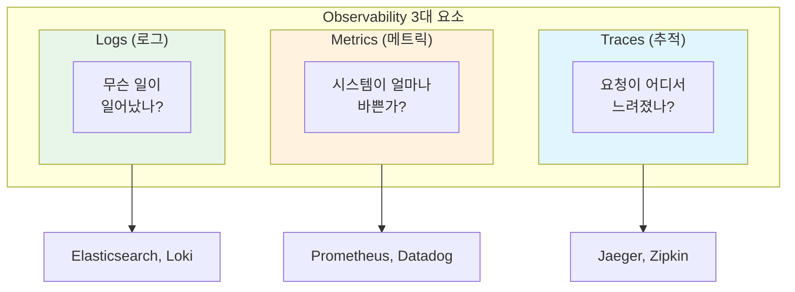

**Traces**는 분산 시스템에서 요청의 전체 여정을 추적하며, "주문 API 호출이 왜 3초나 걸렸는지"와 같은 질문에 답합니다. **Metrics**는 시스템의 수치적 상태를 시계열 데이터로 수집하여 "현재 CPU 사용률이 얼마인지, 초당 요청 수가 몇 건인지"를 알려줍니다. **Logs**는 개별 이벤트의 상세한 기록으로, "특정 주문에서 발생한 에러의 정확한 메시지"를 확인할 수 있게 합니다.

### 1.2 Trace와 Span

분산 트레이싱의 핵심 개념은 **Trace**와 **Span**입니다. Trace는 단일 요청이 시스템을 통과하는 전체 경로를 나타내며, 고유한 Trace ID로 식별됩니다. Span은 Trace 내에서 하나의 작업 단위를 나타내며, 각 서비스 호출이나 데이터베이스 쿼리가 개별 Span이 됩니다. Span은 부모-자식 관계를 가져서 호출 계층 구조를 표현합니다.

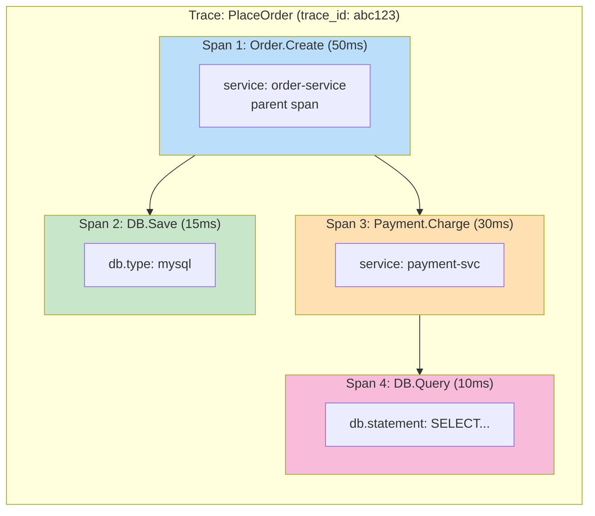

각 Span에는 시작 시간, 종료 시간, 상태 코드, 태그(Attributes), 이벤트(Events) 등의 메타데이터가 포함됩니다. 이를 통해 어느 서비스에서 얼마나 시간이 걸렸는지, 어디서 에러가 발생했는지를 정확히 파악할 수 있습니다.

### 1.3 SLA, SLI, SLO

서비스 품질을 정의하고 측정하기 위해 **SLA**, **SLI**, **SLO**라는 세 가지 개념이 사용됩니다. 이들은 서로 연관되어 있으며, 올바른 운영을 위해 반드시 이해해야 합니다.

- **SLA(Service Level Agreement)**: 서비스 제공자와 고객 간의 공식적인 계약으로, 서비스 품질에 대한 약속을 명시합니다. 예를 들어 "월간 가용성 99.9% 미만 시 다음 달 요금 10% 할인"과 같이 법적 구속력이 있는 약속입니다.
- **SLI(Service Level Indicator)**: 서비스 품질을 측정하는 구체적인 지표로, "요청 성공률", "응답 시간 P99", "에러율" 등이 해당됩니다.
- **SLO(Service Level Objective)**: 내부적으로 설정하는 목표 수준으로, SLA보다 엄격하게 설정하여 여유를 확보합니다. 예를 들어 SLA가 99.9%라면 SLO는 99.95%로 설정하여 버퍼를 둡니다.

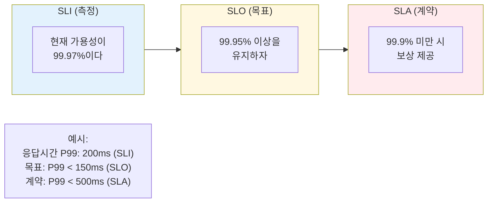

### 1.4 Percentile과 평균값의 차이

응답 시간과 같은 성능 지표를 측정할 때 **평균값은 심각한 함정**이 될 수 있습니다. 예를 들어 1,000건의 요청이 1ms에 처리되고 10건의 요청이 4,000ms(4초)에 처리되었다면, 평균 응답 시간은 약 5ms가 됩니다. 평균만 보면 서비스가 정상적으로 보이지만, 실제로 10명의 사용자는 4초를 기다려야 했습니다.

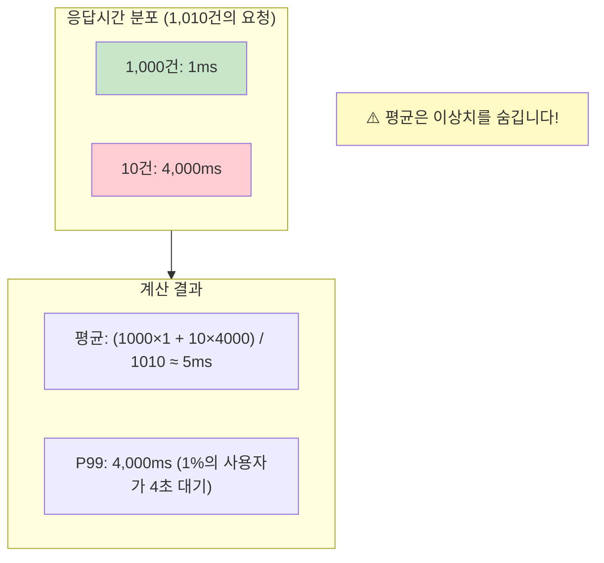

**Percentile(백분위수)**은 데이터를 정렬했을 때 해당 백분위에 위치하는 값입니다. P50(중앙값)은 50%의 요청이 이 값 이하로 처리됨을 의미하고, P95는 95%의 요청이 이 값 이하임을 의미합니다. **P99**는 특히 중요한데, 이는 "가장 느린 1%의 사용자 경험"을 나타내기 때문입니다. 대규모 서비스에서 P99가 나쁘면 수천 명의 사용자가 불편을 겪게 됩니다.

### 1.5 OpenTelemetry

**OpenTelemetry(OTel)**는 Observability 데이터를 생성, 수집, 내보내기 위한 표준화된 프레임워크입니다. 이전에는 OpenTracing과 OpenCensus라는 두 개의 경쟁 프로젝트가 있었는데, 2019년에 이 둘이 합쳐져 OpenTelemetry가 되었습니다. CNCF(Cloud Native Computing Foundation)의 인큐베이팅 프로젝트로, 사실상의 표준(de facto standard)이 되었습니다.

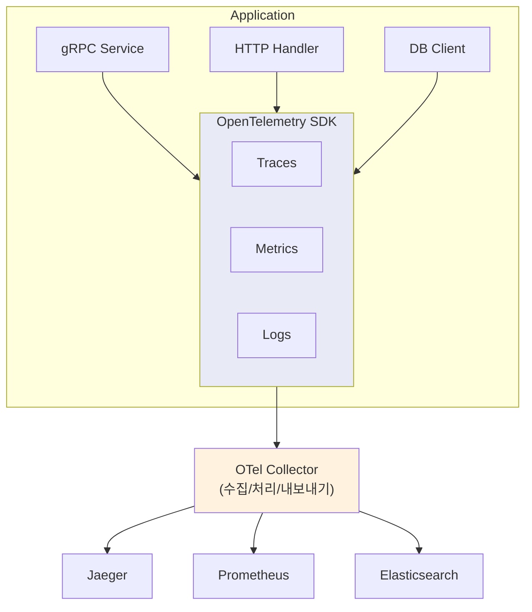

OpenTelemetry의 핵심 장점은 **Vendor-Agnostic(벤더 독립적)**이라는 점입니다. 계측 코드는 한 번만 작성하고, 백엔드는 자유롭게 선택할 수 있습니다. Jaeger에서 Zipkin으로, 또는 상용 솔루션으로 변경해도 애플리케이션 코드는 수정할 필요가 없습니다.

### 1.6 EFK Stack

**EFK Stack**은 Elasticsearch, Fluent Bit, Kibana의 조합으로, 분산 환경에서 로그를 수집하고 검색하기 위한 표준적인 솔루션입니다. 기존의 ELK Stack(Elasticsearch, Logstash, Kibana)에서 Logstash 대신 경량화된 Fluent Bit를 사용하는 구성입니다.

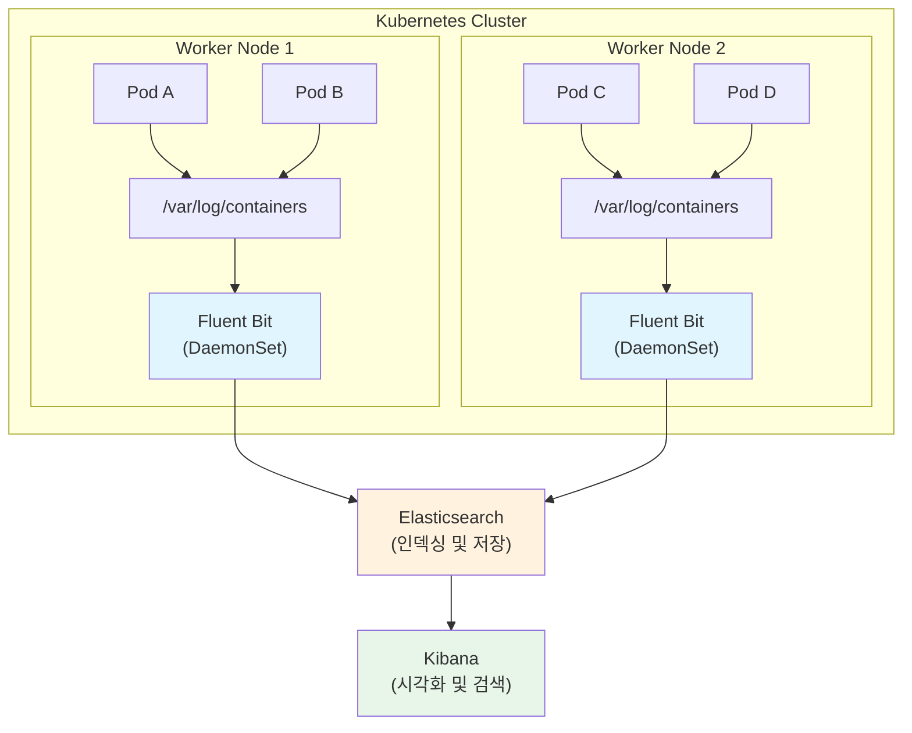

**Fluent Bit**는 DaemonSet으로 배포되어 각 노드에서 컨테이너 로그를 수집합니다. 수집된 로그는 Elasticsearch로 전송되어 인덱싱되며, Kibana를 통해 검색하고 시각화할 수 있습니다. Trace ID를 로그에 주입하면 Kibana에서 특정 요청과 관련된 모든 로그를 한 번에 검색할 수 있어 디버깅이 크게 용이해집니다.

---

## 2. 비교표

### 2.1 Observability 3대 요소 비교

| 구분 | Traces | Metrics | Logs |
|------|--------|---------|------|
| **목적** | 요청 흐름 추적 | 수치적 상태 측정 | 이벤트 상세 기록 |
| **데이터 형태** | 분산 컨텍스트 (Trace ID, Span ID) | 시계열 데이터 (숫자) | 텍스트/구조화된 이벤트 |
| **주요 질문** | "어디서 느려졌나?" | "얼마나 바쁜가?" | "무슨 일이 일어났나?" |
| **대표 도구** | Jaeger, Zipkin, X-Ray | Prometheus, Datadog | Elasticsearch, Loki |
| **저장 비용** | 높음 (샘플링 필요) | 낮음 | 매우 높음 |
| **분석 방식** | 단일 요청 심층 분석 | 집계 및 트렌드 분석 | 패턴 검색 |

### 2.2 로깅 아키텍처 비교

| 구분 | Node-level Logging | Cluster-level Logging |
|------|-------------------|----------------------|
| **저장 위치** | 각 노드의 로컬 파일시스템 | 중앙 집중형 저장소 (ES 등) |
| **구성 복잡도** | 간단함 | 복잡함 (에이전트, 저장소 필요) |
| **검색 용이성** | 어려움 (노드별 접속 필요) | 쉬움 (통합 검색) |
| **확장성** | 제한적 | 우수함 |
| **장애 시 로그 유실** | 노드 장애 시 유실 | 중앙 저장소로 보존 |
| **적합한 환경** | 개발/테스트 | 프로덕션 |

### 2.3 주요 Observability 도구 비교

| 영역 | 오픈소스 | 상용 솔루션 | 특징 |
|------|---------|-----------|------|
| **Tracing** | Jaeger, Zipkin | AWS X-Ray, Datadog APM | Jaeger: 스케일링 용이, Zipkin: 간단한 설정 |
| **Metrics** | Prometheus, Cortex | Datadog, New Relic | Prometheus: Pull 기반, 강력한 쿼리 언어 |
| **Logs** | Elasticsearch, Loki | Splunk, Sumo Logic | ES: 전문 검색 강력, Loki: 저비용 |
| **계측** | OpenTelemetry | 벤더별 SDK | OTel: 표준화, 벤더 독립적 |

### 2.4 Percentile 지표 비교

| Percentile | 의미 | 사용 시나리오 |
|-----------|------|--------------|
| **P50 (Median)** | 절반의 요청이 이 값 이하 | 일반적인 사용자 경험 |
| **P90** | 90%의 요청이 이 값 이하 | 대부분의 사용자 경험 |
| **P95** | 95%의 요청이 이 값 이하 | SLO 일반적 기준 |
| **P99** | 99%의 요청이 이 값 이하 | 엄격한 SLA 기준 |
| **P99.9** | 99.9%의 요청이 이 값 이하 | 매우 엄격한 기준 (대규모 서비스) |

---

## 3. 면접 예상 질문 및 모범 답안

### Q1. Observability의 세 가지 핵심 요소를 설명하고, 각각 언제 사용하는지 말해주세요.

**모범 답안:**

Observability의 세 가지 핵심 요소는 **Traces**, **Metrics**, **Logs**입니다. 이 세 가지는 각각 다른 관점에서 시스템 상태를 파악하게 해주며, 함께 사용할 때 완전한 가시성을 제공합니다.

**Traces**는 분산 시스템에서 단일 요청이 여러 서비스를 거치는 전체 경로를 추적합니다. 각 서비스에서의 처리 시간, 호출 관계, 에러 발생 지점 등을 파악할 수 있습니다. "특정 API 호출이 왜 느린지", "어느 서비스에서 에러가 발생했는지" 등 특정 요청에 대한 심층 분석이 필요할 때 사용합니다. Jaeger나 Zipkin 같은 도구를 사용합니다.

**Metrics**는 시스템의 수치적 상태를 시계열 데이터로 수집합니다. CPU 사용률, 메모리 사용량, 요청 처리량, 에러율, 응답 시간 percentile 등이 대표적입니다. "시스템이 현재 얼마나 바쁜지", "지난 한 시간 동안 에러율이 어떻게 변했는지"와 같은 집계된 정보를 파악할 때 사용합니다. Prometheus가 대표적인 도구입니다.

**Logs**는 개별 이벤트의 상세한 기록입니다. 에러 메시지, 스택 트레이스, 비즈니스 이벤트 등 구체적인 정보가 담깁니다. "특정 주문에서 발생한 정확한 에러 메시지가 무엇인지", "특정 사용자의 행동 기록"을 확인할 때 사용합니다. Elasticsearch와 Kibana 조합이 대표적입니다.

실무에서는 이 세 가지를 함께 사용합니다. 먼저 Metrics 대시보드에서 이상 징후를 발견하고, Traces로 문제가 되는 요청의 흐름을 추적한 다음, Logs에서 상세한 에러 내용을 확인하는 방식으로 문제를 진단합니다.

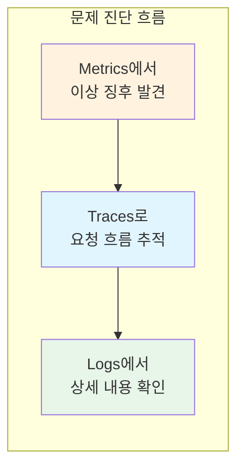

---

### Q2. P95 Latency와 평균 Latency의 차이를 설명하고, 왜 Percentile을 사용해야 하는지 말해주세요.

**모범 답안:**

**평균 Latency**는 모든 응답 시간의 합을 요청 수로 나눈 값이고, **P95 Latency**는 모든 응답 시간을 정렬했을 때 95번째 백분위에 해당하는 값입니다.

평균값의 문제점은 **이상치(outlier)를 숨긴다**는 것입니다. 예를 들어 1,000건의 요청이 1ms에 처리되고 50건의 요청이 10,000ms(10초)에 처리되었다면, 평균은 약 480ms입니다. 하지만 이 평균값은 대부분의 요청이 1ms에 처리된다는 사실과, 일부 사용자가 10초를 기다려야 한다는 사실을 모두 숨깁니다.

반면 P95는 "95%의 요청이 이 값 이하로 처리됨"을 의미합니다. 위 예시에서 P95는 1ms일 것이고, P99는 10,000ms일 것입니다. 이를 통해 대부분의 사용자 경험(P95: 1ms)과 최악의 경우(P99: 10초)를 모두 파악할 수 있습니다.

**Percentile을 사용해야 하는 이유**는 세 가지입니다:

1. **사용자 경험을 정확히 반영합니다.** 하루 100만 요청이 있는 서비스에서 P99가 5초라면 매일 1만 명의 사용자가 5초 이상 기다린다는 의미입니다.

2. **SLA/SLO를 정의할 때 명확한 기준이 됩니다.** "P95 응답 시간 500ms 이하"처럼 구체적인 목표를 설정할 수 있습니다.

3. **성능 저하를 조기에 감지할 수 있습니다.** 평균은 변하지 않아도 P99가 급격히 증가하면 특정 조건에서 문제가 발생하고 있음을 알 수 있습니다.

---

### Q3. 분산 시스템에서 Trace ID가 필요한 이유와 로그에 Trace ID를 주입하는 방법을 설명해주세요.

**모범 답안:**

**Trace ID가 필요한 이유**는 분산 시스템에서 하나의 요청이 여러 서비스를 거치면서 생성되는 로그들을 연결하기 위해서입니다.

예를 들어 주문 요청이 Order Service → Payment Service → Notification Service를 거친다고 가정합니다. 각 서비스에서 로그가 생성되는데, 동시에 수천 개의 요청이 처리되고 있다면 특정 주문과 관련된 로그만 찾아내기가 매우 어렵습니다. 모든 로그에 동일한 Trace ID가 포함되어 있다면, 해당 ID로 필터링하여 관련 로그만 볼 수 있습니다.

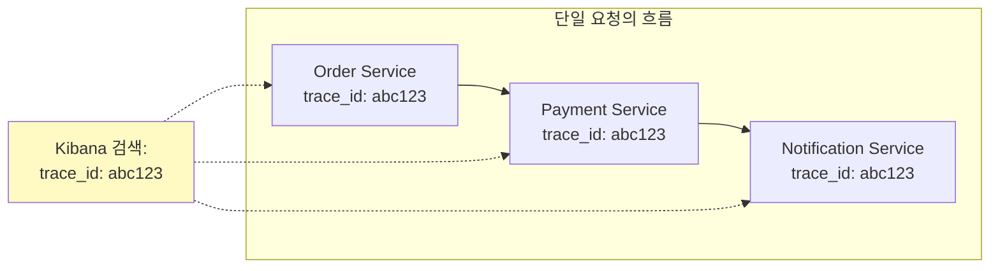

**Go에서 OpenTelemetry를 사용하여 Trace ID를 로그에 주입하는 방법**은 다음과 같습니다:

1. 커스텀 로그 포맷터를 만들어서 Context에서 Span 정보를 추출합니다.
2. Trace ID와 Span ID를 로그 필드에 추가합니다.
3. logrus를 사용하는 경우 Format 메서드를 구현하여 `trace.SpanFromContext(entry.Context)`로 현재 Span을 가져옵니다.
4. `span.SpanContext().TraceID().String()`으로 Trace ID를 추출합니다.
5. 로그 출력 시에는 반드시 `log.WithContext(ctx).Info("message")`처럼 Context를 함께 전달해야 합니다.

이렇게 하면 로그가 `{"trace_id": "abc123...", "span_id": "def456...", "message": "Creating order..."}`와 같은 형태로 출력됩니다. Kibana에서 `trace_id: "abc123..."`으로 검색하면 해당 요청과 관련된 모든 서비스의 로그를 한 번에 볼 수 있습니다.

**주의할 점**은 서비스 간 호출 시 Context가 올바르게 전파되어야 한다는 것입니다. gRPC에서는 OpenTelemetry의 인터셉터가 자동으로 메타데이터를 통해 Trace Context를 전파합니다.

---

### Q4. OpenTelemetry와 OpenTracing의 관계를 설명해주세요.

**모범 답안:**

**OpenTelemetry**는 OpenTracing과 OpenCensus라는 두 개의 프로젝트가 합쳐져서 탄생한 것입니다.

**OpenTracing**은 분산 트레이싱을 위한 벤더 중립적인 API 표준이었습니다. 개발자가 특정 트레이싱 백엔드(Jaeger, Zipkin 등)에 종속되지 않고 코드를 작성할 수 있게 해주었습니다. **OpenCensus**는 Google이 주도한 프로젝트로, 트레이싱뿐만 아니라 메트릭 수집까지 포함했습니다. 두 프로젝트 모두 CNCF에서 관리되었는데, 비슷한 목표를 가진 두 프로젝트가 공존하면서 커뮤니티에 혼란을 야기했습니다.

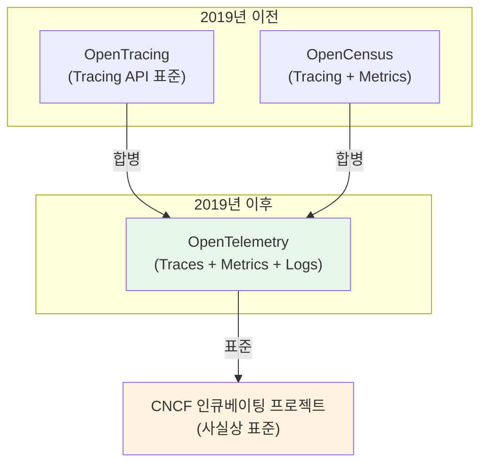

2019년에 두 프로젝트가 합쳐져 **OpenTelemetry(OTel)**가 탄생했습니다. OpenTelemetry는 Traces, Metrics, Logs를 모두 아우르는 통합된 Observability 프레임워크가 되었습니다. 현재 OpenTracing과 OpenCensus는 더 이상 개발되지 않으며, 기존 사용자들은 OpenTelemetry로 마이그레이션이 권장됩니다.

**OpenTelemetry의 장점**:
1. **벤더 독립적**: 계측 코드는 한 번만 작성하고 백엔드는 자유롭게 선택할 수 있습니다.
2. **표준화된 시맨틱 컨벤션**: 다양한 도구 간 상호 운용성이 보장됩니다.
3. **자동 계측(Auto-instrumentation)**: gRPC, HTTP, 데이터베이스 클라이언트 등에 대한 인터셉터가 이미 제공되어 있어 최소한의 코드 변경으로 계측을 적용할 수 있습니다.

---

### Q5. gRPC 서비스에 OpenTelemetry 트레이싱을 추가하는 방법을 설명해주세요.

**모범 답안:**

gRPC 서비스에 OpenTelemetry 트레이싱을 추가하려면 크게 **세 단계**가 필요합니다.

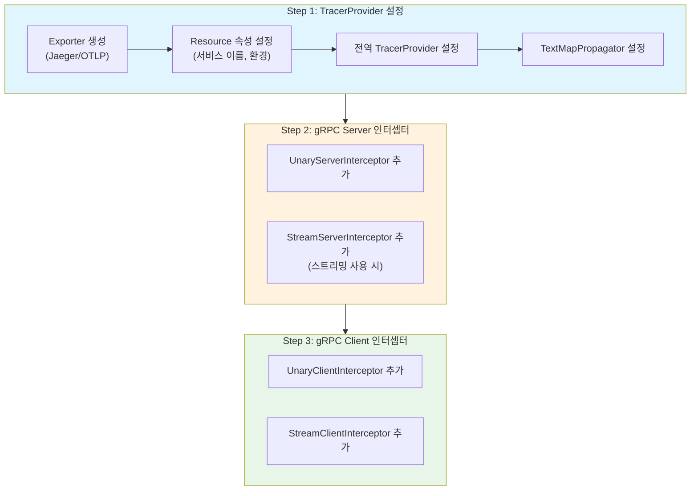

**첫째, TracerProvider를 설정합니다.** Jaeger나 OTLP 익스포터를 생성하고, 서비스 이름, 환경 등의 리소스 속성을 설정한 TracerProvider를 만듭니다. 그리고 `otel.SetTracerProvider(tp)`로 전역 TracerProvider를 설정하고, `otel.SetTextMapPropagator()`로 Trace Context 전파 방식을 설정합니다. **전파 설정이 없으면 서비스 간 Trace가 연결되지 않습니다.**

**둘째, gRPC 서버에 인터셉터를 추가합니다.** `grpc.NewServer(grpc.UnaryInterceptor(otelgrpc.UnaryServerInterceptor()))`와 같이 OpenTelemetry의 gRPC 서버 인터셉터를 추가합니다. 스트리밍을 사용한다면 `StreamServerInterceptor`도 함께 추가해야 합니다.

**셋째, gRPC 클라이언트에도 인터셉터를 추가합니다.** `grpc.Dial(address, grpc.WithUnaryInterceptor(otelgrpc.UnaryClientInterceptor()))`와 같이 클라이언트 인터셉터를 추가합니다. 이렇게 하면 클라이언트가 서버를 호출할 때 Trace Context가 gRPC 메타데이터를 통해 전파됩니다.

인터셉터가 추가되면 자동으로 각 RPC 호출에 대한 Span이 생성되고, `rpc.service`, `rpc.method`, `rpc.system` 등의 태그가 자동으로 추가됩니다. 에러가 발생하면 Span의 상태가 Error로 설정되고, gRPC 상태 코드가 태그로 기록됩니다.

추가로 비즈니스 로직 내에서 커스텀 Span을 생성하려면 `tracer.Start(ctx, "operation-name")`으로 새 Span을 시작하고, defer로 `span.End()`를 호출하면 됩니다.

---

### Q6. SLA, SLI, SLO의 차이점과 관계를 설명해주세요.

**모범 답안:**

SLA, SLI, SLO는 서비스 품질을 정의하고 관리하기 위한 **계층적 개념**입니다.

**SLI(Service Level Indicator)**는 서비스 품질을 측정하는 구체적인 지표입니다. "무엇을 측정할 것인가"에 해당합니다. 예를 들어 요청 성공률, P99 응답 시간, 에러율, 가용성 등이 SLI입니다. SLI는 객관적으로 측정 가능해야 하며, 사용자 경험과 직접 연관되어야 합니다. "서버의 CPU 사용률"보다는 "사용자가 느끼는 응답 시간"이 더 좋은 SLI입니다.

**SLO(Service Level Objective)**는 SLI에 대한 내부 목표치입니다. "얼마나 좋아야 하는가"에 해당합니다. 예를 들어 "P99 응답 시간 200ms 이하", "월간 가용성 99.95% 이상" 등이 SLO입니다. SLO는 팀 내부에서 설정하는 목표로, 달성하지 못하면 개선 작업을 진행해야 합니다. **Error Budget** 개념과 함께 사용되어, SLO를 초과 달성하면 그 여유분(Error Budget)을 새로운 기능 개발에 사용할 수 있습니다.

**SLA(Service Level Agreement)**는 고객과의 공식적인 서비스 수준 계약입니다. "약속을 지키지 못하면 어떤 결과가 있는가"가 포함됩니다. 예를 들어 "월간 가용성 99.9% 미만 시 다음 달 요금 10% 환불" 같은 형태입니다. SLA는 법적 구속력이 있으며, 위반 시 금전적 보상이나 계약 해지 등의 결과가 따릅니다.

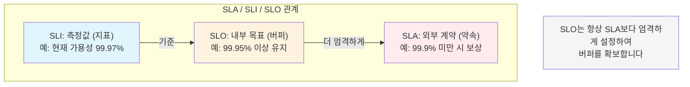

**관계를 보면**, SLO는 항상 SLA보다 엄격하게 설정합니다. SLA가 99.9%라면 SLO는 99.95%로 설정하여 버퍼를 확보합니다. SLO를 달성하지 못하더라도 SLA는 여전히 지킬 수 있도록 하는 것입니다. SLI는 SLO와 SLA 모두의 측정 기준이 됩니다.

---

### Q7. Fluent Bit와 Logstash의 차이점, 그리고 EFK Stack을 선택하는 이유를 설명해주세요.

**모범 답안:**

Fluent Bit와 Logstash는 모두 로그 수집 및 전송 도구이지만 **설계 철학이 다릅니다**.

**Logstash**는 기능이 풍부한 데이터 처리 파이프라인입니다. 다양한 입력/필터/출력 플러그인을 지원하고, 복잡한 로그 변환과 강화 작업이 가능합니다. 하지만 JVM 기반으로 메모리 사용량이 크고(최소 1GB 이상), 시작 시간이 깁니다.

**Fluent Bit**는 경량화된 로그 수집기입니다. C로 작성되어 메모리 사용량이 매우 작고(수십 MB), 시작 시간이 짧습니다. 컨테이너 환경에 최적화되어 있어 Kubernetes의 DaemonSet으로 각 노드에 배포하기 적합합니다. 기본적인 로그 처리 기능은 모두 지원하면서도 리소스 효율성이 뛰어납니다.

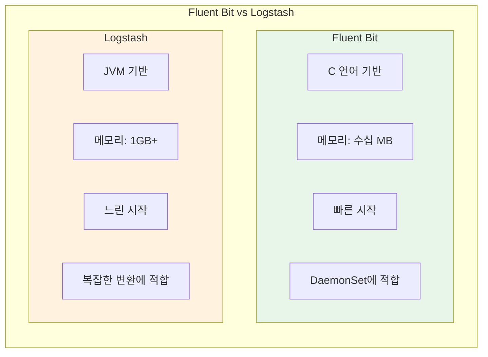

**EFK Stack(Elasticsearch, Fluent Bit, Kibana)을 선택하는 이유**:

1. **컨테이너/Kubernetes 환경에서의 리소스 효율성**: 모든 노드에 Logstash를 배포하면 리소스 낭비가 심하지만, Fluent Bit는 최소한의 리소스로 동작합니다.

2. **Kubernetes 메타데이터 자동 추가**: Fluent Bit는 Pod 이름, Namespace, 레이블 등을 자동으로 추가하는 필터가 내장되어 있습니다.

3. **클라우드 네이티브 생태계 통합**: Fluent Bit는 CNCF 프로젝트로 클라우드 네이티브 생태계와의 통합이 잘 되어 있습니다.

복잡한 로그 변환이 필요한 경우에는 Fluent Bit로 수집하고 Logstash로 처리하는 하이브리드 구성도 가능합니다. 하지만 대부분의 경우 Fluent Bit만으로 충분합니다.

---

### Q8. 프로덕션 환경에서 트레이싱 샘플링이 필요한 이유와 샘플링 전략을 설명해주세요.

**모범 답안:**

프로덕션 환경에서 **100% 트레이싱은 세 가지 문제**를 야기합니다.

1. **성능 오버헤드**: 모든 요청에 대해 Span을 생성하고, 메타데이터를 수집하고, 백엔드로 전송하는 작업은 CPU와 네트워크 리소스를 소모합니다. 초당 수천 건의 요청을 처리하는 서비스에서 이 오버헤드는 무시할 수 없습니다.

2. **저장 비용**: 트레이싱 데이터는 요청당 여러 Span을 생성하며, 각 Span에는 태그, 로그, 타임스탬프 등이 포함됩니다. 모든 데이터를 저장하면 비용이 급격히 증가합니다.

3. **분석 효율성**: 수억 개의 트레이스 중에서 문제가 되는 트레이스를 찾는 것은 어렵습니다. 샘플링을 통해 데이터를 줄이면 오히려 분석이 용이해질 수 있습니다.

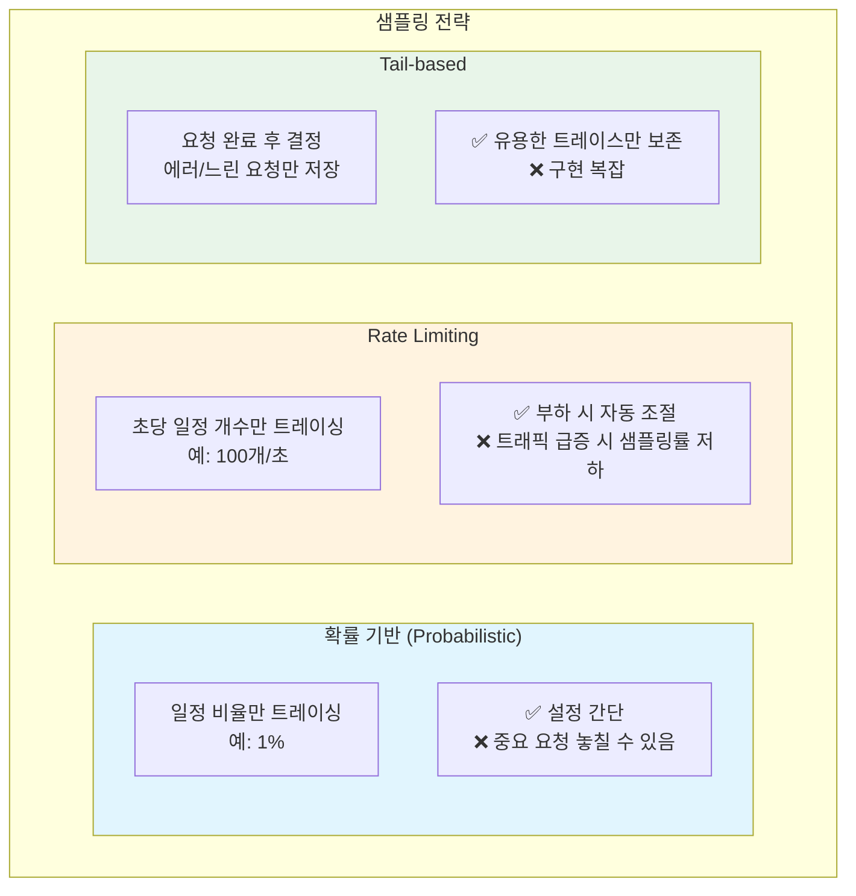

**샘플링 전략**에는 여러 가지가 있습니다:

- **확률 기반 샘플링(Probabilistic Sampling)**: 일정 비율(예: 1%)의 요청만 트레이싱합니다. 설정이 간단하지만 중요한 요청을 놓칠 수 있습니다.

- **Rate Limiting 샘플링**: 초당 일정 개수(예: 100개)만 트레이싱합니다. 부하가 높을 때 샘플링 비율이 자동으로 낮아집니다.

- **Tail-based 샘플링**: 요청이 완료된 후 에러가 발생했거나 응답 시간이 긴 요청만 저장합니다. 가장 유용한 트레이스를 보존할 수 있지만 구현이 복잡합니다.

OpenTelemetry에서는 TracerProvider 생성 시 Sampler를 설정할 수 있습니다. `tracesdk.WithSampler(tracesdk.TraceIDRatioBased(0.01))`과 같이 설정하면 1%의 요청만 트레이싱됩니다. **ParentBased Sampler**를 사용하면 부모 Span의 샘플링 결정을 따르므로, 하나의 Trace 내에서 일관된 샘플링이 보장됩니다.

---

## 4. 실무 체크리스트

### Observability 구축 체크리스트

- [ ] Traces, Metrics, Logs 3가지 요소가 모두 수집되고 있는가?
- [ ] 서비스 간 Trace Context가 올바르게 전파되고 있는가?
- [ ] 로그에 Trace ID가 포함되어 Trace와 연계 검색이 가능한가?
- [ ] SLA/SLO가 정의되어 있고, SLI로 측정되고 있는가?
- [ ] Percentile 기반 메트릭(P95, P99)을 사용하고 있는가?
- [ ] 프로덕션 환경에서 적절한 샘플링 전략이 적용되어 있는가?
- [ ] 대시보드뿐만 아니라 알람도 설정되어 있는가?
- [ ] 로그가 구조화된 형식(JSON)으로 출력되고 있는가?

### OpenTelemetry 설정 체크리스트

- [ ] TracerProvider가 올바르게 초기화되어 있는가?
- [ ] TextMapPropagator가 설정되어 서비스 간 Context 전파가 가능한가?
- [ ] gRPC 서버/클라이언트에 인터셉터가 추가되어 있는가?
- [ ] 서비스 이름, 환경 등의 리소스 속성이 설정되어 있는가?
- [ ] graceful shutdown 시 TracerProvider가 정상적으로 종료되는가?

### EFK Stack 설정 체크리스트

- [ ] Fluent Bit DaemonSet이 모든 노드에서 실행 중인가?
- [ ] Kubernetes 메타데이터 필터가 활성화되어 있는가?
- [ ] Elasticsearch 인덱스 수명 주기 정책(ILM)이 설정되어 있는가?
- [ ] Kibana에서 Index Pattern이 생성되어 있는가?
- [ ] TLS/인증이 올바르게 설정되어 있는가?

---

## 5. 참고 자료

- [OpenTelemetry 공식 문서](https://opentelemetry.io/docs/)
- [Jaeger 공식 문서](https://www.jaegertracing.io/docs/)
- [Prometheus 공식 문서](https://prometheus.io/docs/)
- [Elasticsearch 공식 문서](https://www.elastic.co/guide/)
- [Fluent Bit 공식 문서](https://docs.fluentbit.io/)
- [Google SRE Book](https://sre.google/sre-book/table-of-contents/)
- [OpenTelemetry Registry - Go 계측 라이브러리](https://opentelemetry.io/registry/?language=go)
