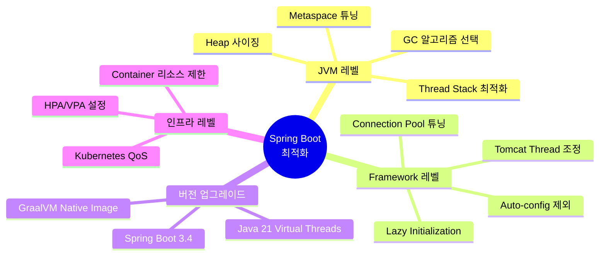
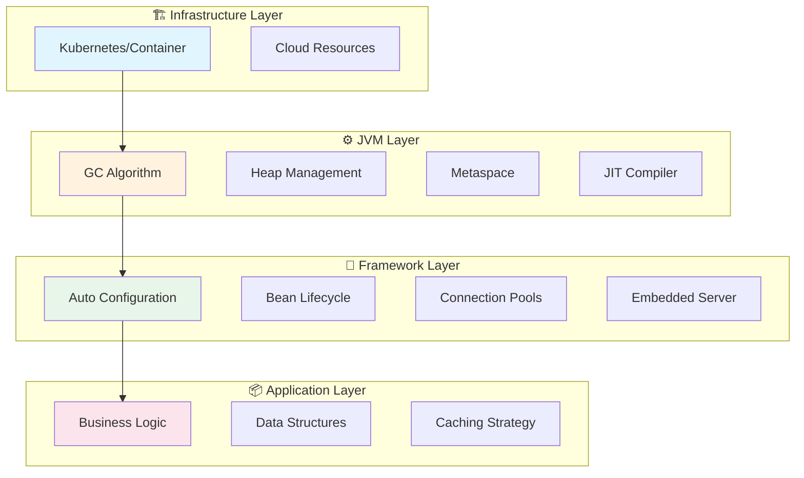
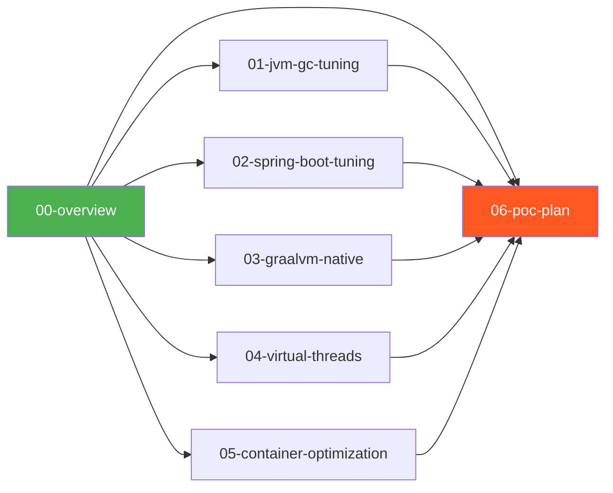
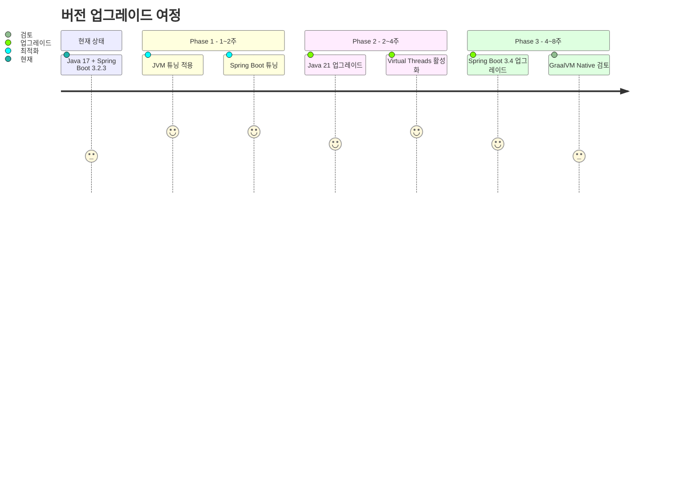

# Spring Boot CPU/RAM 최적화 완벽 가이드

> **대상 환경**: Java 17 → Java 21, Spring Boot 3.2.3 → 3.4.x  
> **모듈 구성**: 8개 마이크로서비스 모듈  
> **작성 기준**: 2026년 1월  
> **목적**: 운영 환경에서의 리소스 효율화 및 비용 절감

---

## 1. Executive Summary

### 1.1 왜 최적화가 필요한가?

현대의 마이크로서비스 아키텍처에서 리소스 최적화는 단순한 성능 개선을 넘어 **운영 비용과 직결되는 핵심 과제**입니다. 특히 8개의 Spring Boot 모듈을 운영하는 환경에서는 개별 모듈의 작은 비효율이 전체 시스템에서는 큰 리소스 낭비로 이어집니다.

예를 들어, 각 모듈이 불필요하게 100MB의 메모리를 더 사용한다면, 8개 모듈 전체로는 800MB의 메모리가 낭비됩니다. 클라우드 환경에서 이는 **월 수십만 원의 추가 비용**으로 이어질 수 있습니다.

### 1.2 최적화 전략 개요



### 1.3 예상 효과 요약

| 최적화 기법 | 메모리 절감 | CPU 절감 | 시작시간 개선 | 적용 난이도 | 코드 변경 |
|------------|:----------:|:--------:|:------------:|:-----------:|:---------:|
| JVM GC 튜닝 | 20-40% | 10-20% | - | ⭐⭐ | 없음 |
| Spring Boot 튜닝 | 15-30% | 5-15% | 30-50% | ⭐⭐ | 최소 |
| Virtual Threads (Java 21) | 30-40% | 15-20% | - | ⭐⭐⭐ | 없음 |
| GraalVM Native Image | 70-80% | 30-50% | 95%+ | ⭐⭐⭐⭐⭐ | 중간 |
| 컨테이너 최적화 | 10-20% | 10-15% | - | ⭐⭐ | 없음 |

---

## 2. 최적화 계층 구조



---

## 3. 문서 구성



| 문서 번호 | 제목 | 핵심 내용 | 예상 읽기 시간 |
|:---------:|------|----------|:-------------:|
| **01** | JVM GC 튜닝 심층 분석 | Serial/G1/ZGC/Shenandoah 비교, Heap 사이징 전략 | 25분 |
| **02** | Spring Boot 애플리케이션 최적화 | Lazy Init, Auto-config, Tomcat 튜닝 | 20분 |
| **03** | GraalVM Native Image | AOT 컴파일, 빌드 설정, 제약사항 | 30분 |
| **04** | Virtual Threads (Java 21) | Project Loom, 동시성 모델 혁신 | 25분 |
| **05** | 컨테이너 환경 최적화 | Docker/K8s 리소스 설정, JVM 컨테이너 인식 | 15분 |
| **06** | POC 계획 및 벤치마크 | 단계별 검증 계획, 측정 방법론 | 20분 |

---

## 4. 버전 업그레이드 로드맵

### 4.1 현재 상태 → 목표 상태



### 4.2 버전별 주요 이점

```mermaid
timeline
    title Java & Spring Boot 버전별 최적화 기능
    
    section Java 17 현재
        : Sealed Classes
        : Pattern Matching instanceof
        : G1 GC 개선
    
    section Java 21 권장
        : Virtual Threads ⭐
        : Generational ZGC
        : Pattern Matching switch
    
    section Spring Boot 3.2 현재
        : Virtual Threads 지원
        : GraalVM Native 개선
    
    section Spring Boot 3.4 권장
        : Virtual Threads 안정화
        : 더 나은 Native Image
```

---

## 5. 빠른 시작 가이드

### 5.1 즉시 적용 가능한 설정

```yaml
# application.yml
spring:
  main:
    lazy-initialization: true

server:
  tomcat:
    threads:
      max: 50
      min-spare: 5
    max-connections: 100
    accept-count: 10
```

```bash
# JVM 옵션 - 컨테이너 환경 권장
JAVA_OPTS="-XX:+UseG1GC \
           -XX:MaxRAMPercentage=75.0 \
           -XX:InitialRAMPercentage=50.0 \
           -Xss512k \
           -XX:MaxMetaspaceSize=128m"
```

---

## 6. 용어 정리

| 용어 | 설명 |
|------|------|
| **GC** | JVM이 사용하지 않는 메모리를 자동으로 회수하는 프로세스 |
| **Heap** | 객체가 할당되는 JVM 메모리 영역 |
| **Metaspace** | 클래스 메타데이터가 저장되는 Native 메모리 영역 |
| **AOT** | 실행 전에 미리 기계어로 컴파일하는 방식 |
| **JIT** | 실행 시점에 동적으로 최적화 컴파일하는 방식 |
| **Virtual Threads** | JVM이 관리하는 경량 스레드 (Project Loom) |
| **Native Image** | GraalVM으로 생성한 독립 실행 바이너리 |
| **STW** | GC 수행 시 애플리케이션이 일시 정지되는 현상 |
