# 01. JVM Garbage Collection 튜닝 심층 분석

> **핵심 목표**: 애플리케이션 특성에 맞는 GC 알고리즘 선택과 최적 힙 사이징을 통한 메모리 효율화

---

## 1. Garbage Collection의 본질적 이해

### 1.1 GC가 왜 필요한가?

Java는 개발자가 직접 메모리를 해제하지 않는 **자동 메모리 관리(Automatic Memory Management)** 언어입니다. 이는 개발 생산성을 크게 높여주지만, 대가로 **Garbage Collection이라는 런타임 오버헤드**를 수반합니다.

면접에서 "GC가 무엇인가요?"라는 질문을 받는다면, 단순히 "사용하지 않는 메모리를 정리하는 것"이라고 답하는 것보다 다음과 같이 설명하는 것이 좋습니다:

> "Garbage Collection은 JVM이 **도달 불가능한(Unreachable) 객체**를 식별하고 해당 메모리를 회수하는 과정입니다. 여기서 '도달 가능성'은 **GC Root로부터의 참조 체인**으로 판단합니다. GC Root에는 스레드 스택의 지역 변수, Static 변수, JNI 참조 등이 포함됩니다."

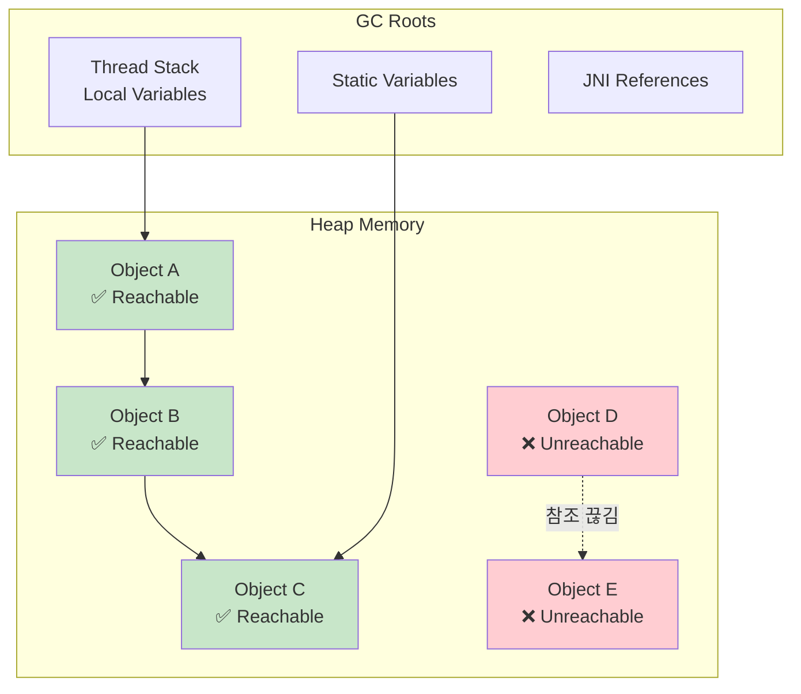

### 1.2 세대별 가설 (Generational Hypothesis)

현대의 대부분의 GC 알고리즘은 **세대별 가설(Generational Hypothesis)** 을 기반으로 합니다. 이 가설의 핵심은 두 가지입니다:

1. **대부분의 객체는 금방 죽는다 (Infant Mortality)**: 생성된 객체의 대다수는 짧은 시간 내에 더 이상 참조되지 않습니다.
2. **오래 살아남은 객체는 계속 살아남을 가능성이 높다**: 일정 시간 이상 살아남은 객체는 애플리케이션의 핵심 데이터일 가능성이 높습니다.

이러한 가설에 기반하여 JVM은 힙을 **Young Generation**과 **Old Generation**으로 분리합니다:

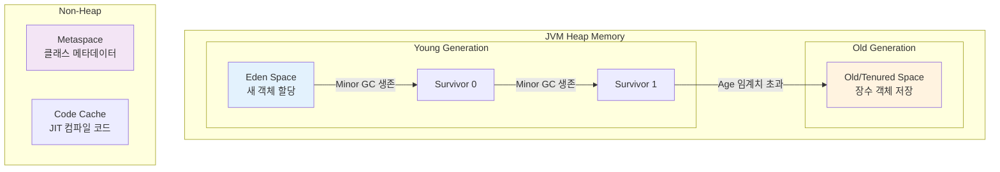

### 1.3 Stop-The-World (STW)의 이해

GC 과정에서 가장 중요한 개념 중 하나가 **Stop-The-World (STW)** 입니다. STW는 GC가 수행될 때 **모든 애플리케이션 스레드가 일시 정지**되는 현상을 말합니다.

왜 STW가 필요할까요? GC는 객체 그래프를 탐색하면서 살아있는 객체를 식별해야 합니다. 만약 이 과정에서 애플리케이션이 계속 객체를 생성하거나 참조를 변경한다면, **일관성 없는 상태**가 발생할 수 있습니다. 마치 움직이는 표적에 화살을 쏘는 것과 같습니다.

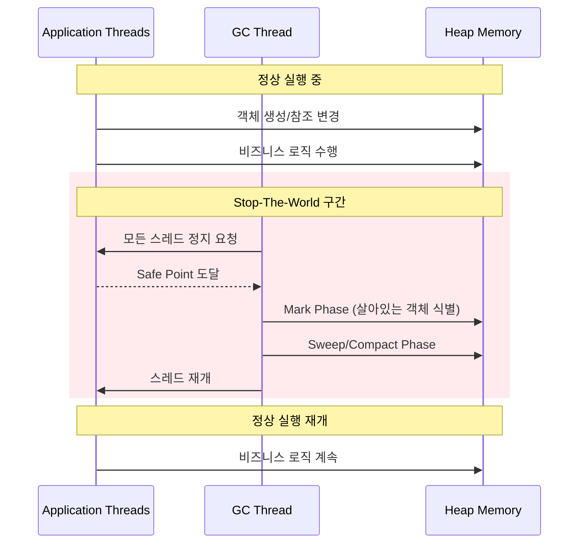

**면접 Tip**: "STW 시간을 줄이는 것이 GC 튜닝의 핵심 목표 중 하나입니다. 이를 위해 현대의 GC들은 Mark 단계를 애플리케이션과 동시에(Concurrent) 수행하거나, 힙을 작은 Region으로 나누어 점진적으로 처리하는 전략을 사용합니다."

---

## 2. GC 알고리즘 심층 비교

### 2.1 알고리즘별 특성 개요

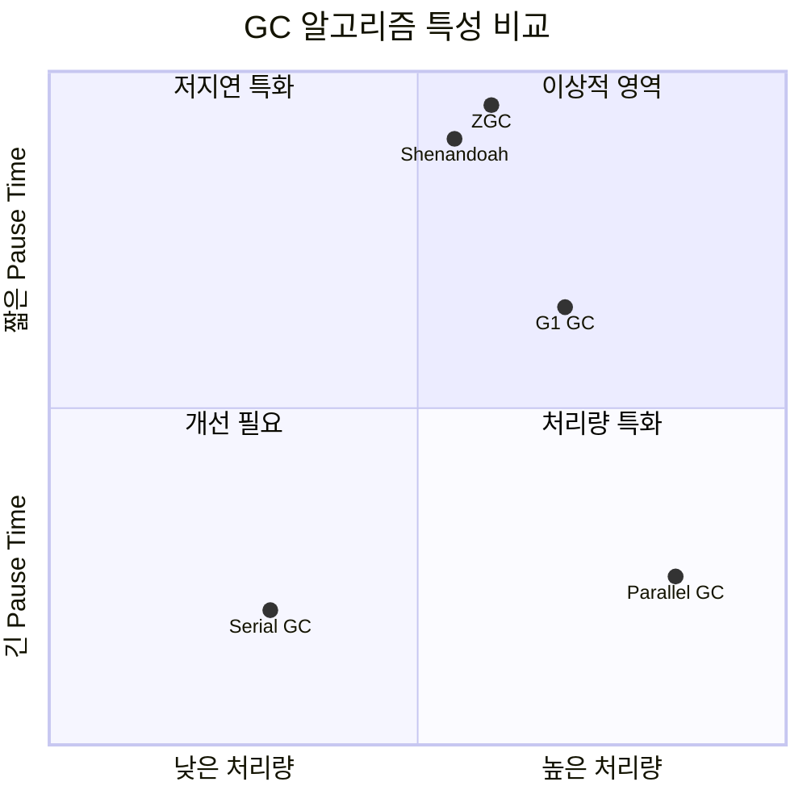

### 2.2 Serial GC - 단순함의 미학

**Serial GC**는 가장 오래되고 단순한 GC 알고리즘입니다. 이름에서 알 수 있듯이 **단일 스레드**로 모든 GC 작업을 수행합니다.

#### 동작 원리

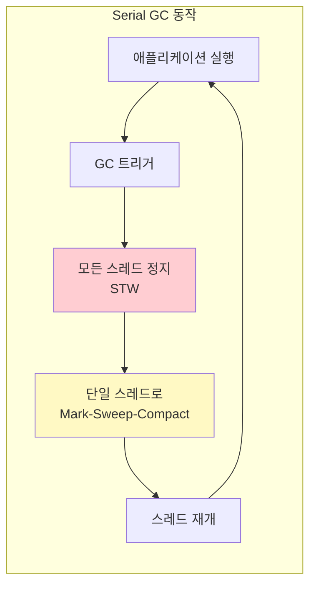

#### 언제 사용하는가?

Serial GC는 다음과 같은 상황에서 유용합니다:

1. **힙 크기가 100MB 이하**인 소규모 애플리케이션
2. **단일 CPU 환경** 또는 CPU 코어가 매우 제한적인 컨테이너
3. **개발/테스트 환경**에서 메모리 사용량 최소화가 필요한 경우

#### 설정 방법

```bash
# Serial GC 활성화
java -XX:+UseSerialGC \
     -Xms128m -Xmx128m \
     -Xss512k \
     -jar application.jar
```

**중요**: Serial GC는 다른 GC 대비 **가장 적은 메모리 오버헤드**를 가집니다. GC 자체를 위한 추가 자료구조가 최소화되어 있기 때문입니다. 8개의 모듈을 운영하는 환경에서 각 모듈의 힙이 256MB 이하라면, Serial GC가 전체 메모리 사용량을 줄이는 데 도움이 될 수 있습니다.

---

### 2.3 G1 GC - 균형잡힌 범용 선택

**G1 (Garbage First) GC**는 Java 9부터 기본 GC로 채택된 알고리즘으로, **처리량(Throughput)과 지연시간(Latency)의 균형**을 목표로 설계되었습니다.

#### 핵심 개념: Region 기반 힙 관리

G1의 가장 큰 혁신은 힙을 **고정 크기의 Region**으로 나누어 관리한다는 점입니다. 전통적인 GC가 Young/Old를 물리적으로 연속된 영역으로 관리했다면, G1은 각 Region을 동적으로 Eden, Survivor, Old 등의 역할로 할당합니다.

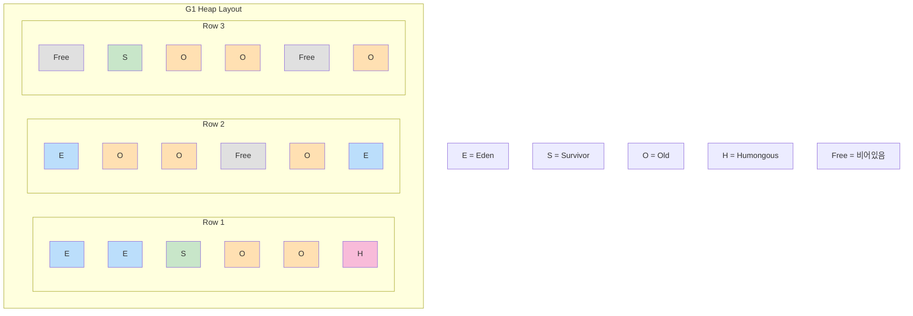

#### G1 GC 동작 사이클

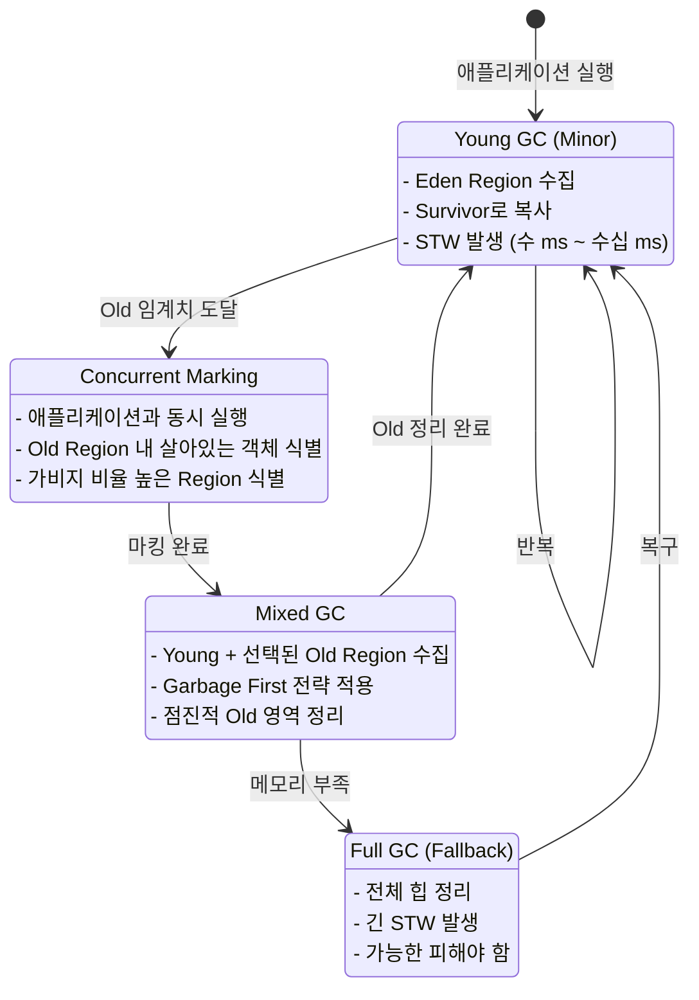

#### 핵심 튜닝 파라미터

```bash
java -XX:+UseG1GC \
     -XX:MaxGCPauseMillis=200 \        # 목표 최대 Pause Time (기본값 200ms)
     -XX:G1HeapRegionSize=4m \         # Region 크기 (1~32MB, 힙의 2048개 Region 권장)
     -XX:InitiatingHeapOccupancyPercent=45 \  # Concurrent Marking 시작 임계치
     -XX:G1ReservePercent=10 \         # 예비 영역 비율
     -Xms2g -Xmx2g \
     -jar application.jar
```

#### G1 선택 기준

| 상황 | G1 적합도 | 이유 |
|------|:---------:|------|
| 힙 크기 4GB 이상 | ⭐⭐⭐⭐⭐ | Region 기반 관리의 이점 극대화 |
| Pause Time 200ms 이하 요구 | ⭐⭐⭐⭐ | MaxGCPauseMillis로 목표 설정 가능 |
| 범용 웹 애플리케이션 | ⭐⭐⭐⭐⭐ | 균형잡힌 성능 |
| 힙 크기 1GB 미만 | ⭐⭐ | 오버헤드 대비 이점 적음 |

---

### 2.4 ZGC - 극한의 저지연

**ZGC (Z Garbage Collector)** 는 Oracle에서 개발한 **저지연(Low-Latency) GC**로, **Pause Time을 10ms 이하**로 유지하는 것을 목표로 합니다.

#### ZGC의 핵심 혁신: Colored Pointers

ZGC의 가장 독특한 특징은 **Colored Pointers (색상 포인터)** 기술입니다. 64비트 포인터의 일부 비트를 메타데이터 저장에 활용하여, 객체 이동 중에도 애플리케이션이 계속 실행될 수 있게 합니다.

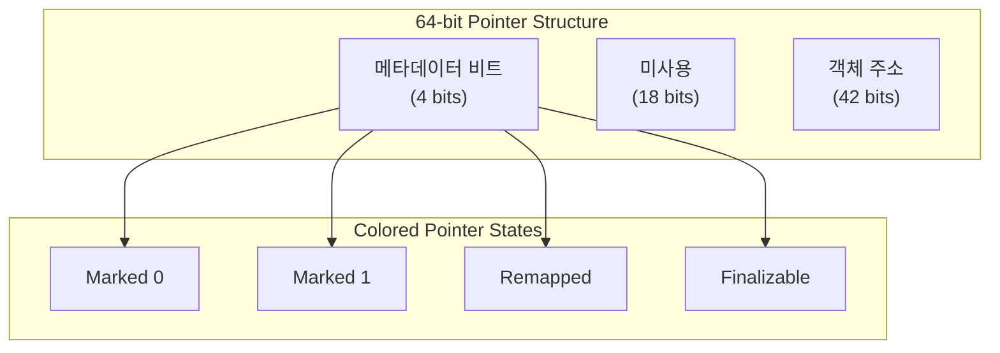

#### ZGC vs G1 동작 비교

```mermaid
gantt
    title GC 동작 시간 비교 (100GB 힙 기준)
    dateFormat X
    axisFormat %s
    
    section G1 GC
    애플리케이션 실행    :a1, 0, 800
    STW Pause (200ms)    :crit, a2, 800, 200
    애플리케이션 실행    :a3, 1000, 500
    STW Pause (180ms)    :crit, a4, 1500, 180
    
    section ZGC
    애플리케이션 실행    :b1, 0, 990
    STW Pause (2ms)      :crit, b2, 990, 2
    Concurrent GC        :active, b3, 992, 300
    애플리케이션 실행    :b4, 992, 690
```

#### Java 21의 Generational ZGC

Java 21에서 도입된 **Generational ZGC**는 기존 ZGC에 세대별 수집을 추가하여 성능을 더욱 개선했습니다:

```bash
# Java 21+ Generational ZGC 활성화
java -XX:+UseZGC -XX:+ZGenerational \
     -Xms4g -Xmx4g \
     -jar application.jar
```

#### ZGC 특성 요약

| 특성 | 값/설명 |
|------|---------|
| Pause Time | < 10ms (힙 크기와 무관) |
| 지원 힙 크기 | 8MB ~ 16TB |
| CPU 오버헤드 | G1 대비 10-15% 추가 |
| 메모리 오버헤드 | 추가 메타데이터로 인해 ~3% 추가 |
| 권장 Java 버전 | Java 17+ (Production Ready), Java 21+ (Generational) |

---

### 2.5 Shenandoah - Red Hat의 저지연 대안

**Shenandoah GC**는 Red Hat에서 개발한 저지연 GC로, ZGC와 유사한 목표를 가지지만 **다른 기술적 접근**을 사용합니다.

#### Brooks Pointer 방식

Shenandoah는 **Brooks Pointer (또는 Forwarding Pointer)** 를 사용합니다. 각 객체 헤더에 자기 자신을 가리키는 포인터를 추가하고, 객체 이동 시 이 포인터만 새 위치를 가리키도록 업데이트합니다.

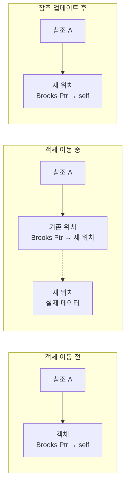

#### ZGC vs Shenandoah 비교

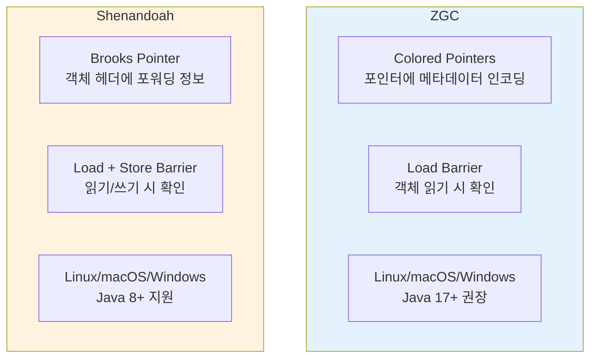

| 비교 항목 | ZGC | Shenandoah |
|----------|-----|------------|
| 메타데이터 저장 | 포인터 비트 활용 | 객체 헤더 확장 |
| Barrier 유형 | Load Barrier | Load + Store Barrier |
| CPU 오버헤드 | 약간 낮음 | 약간 높음 |
| Java 지원 버전 | Java 11+ | Java 8+ (백포트 존재) |
| 개발 주체 | Oracle | Red Hat |
| 최적 힙 크기 | 대용량 (GB~TB) | 중~대용량 (MB~100GB) |

---

## 3. 힙 메모리 사이징 전략

### 3.1 메모리 구성 요소 이해

JVM이 사용하는 메모리는 힙만이 아닙니다. 전체 메모리 구성을 이해해야 올바른 사이징이 가능합니다:

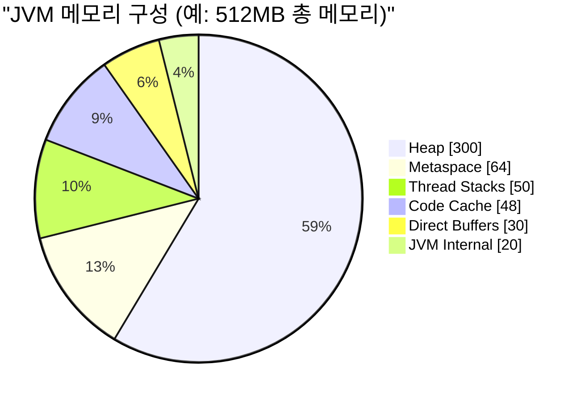

### 3.2 컨테이너 환경에서의 메모리 설정

컨테이너 환경에서는 **절대값보다 비율 기반 설정**이 권장됩니다:

```bash
# 권장: 비율 기반 설정
java -XX:MaxRAMPercentage=75.0 \      # 컨테이너 메모리의 75%를 최대 힙으로
     -XX:InitialRAMPercentage=50.0 \  # 시작 시 50%로 시작
     -XX:MinRAMPercentage=50.0 \      # 최소 힙도 50%
     -jar application.jar

# 비권장: 절대값 설정 (컨테이너 리사이즈에 취약)
java -Xms512m -Xmx512m -jar application.jar
```

#### 왜 75%인가?

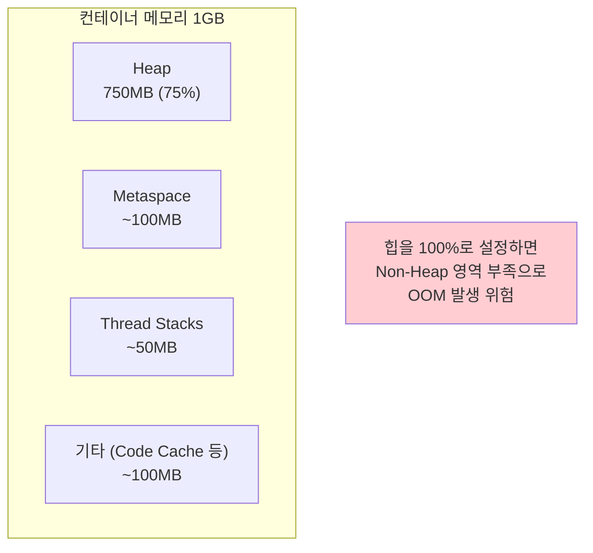

### 3.3 8개 모듈 환경에서의 권장 설정

| 모듈 유형 | 권장 힙 크기 | GC 선택 | 이유 |
|----------|:------------:|:-------:|------|
| API Gateway | 512MB~1GB | G1/ZGC | 동시 연결 많음, 지연시간 중요 |
| 인증 서비스 | 256MB~512MB | G1 | 세션 데이터, 중간 처리량 |
| 비즈니스 API | 512MB~1GB | G1 | 범용 워크로드 |
| 배치 처리 | 1GB~2GB | G1/Parallel | 처리량 중요, 지연 덜 중요 |
| 알림 서비스 | 256MB~512MB | Serial/G1 | 단순 로직, 저부하 |

---

## 4. 모니터링 및 진단

### 4.1 GC 로그 활성화

```bash
# Java 17+ 통합 로깅
java -Xlog:gc*:file=gc.log:time,uptime,level,tags:filecount=5,filesize=10m \
     -jar application.jar

# 상세 GC 로그
java -Xlog:gc*=debug:file=gc-debug.log:time,uptime,level,tags \
     -jar application.jar
```

### 4.2 핵심 모니터링 지표

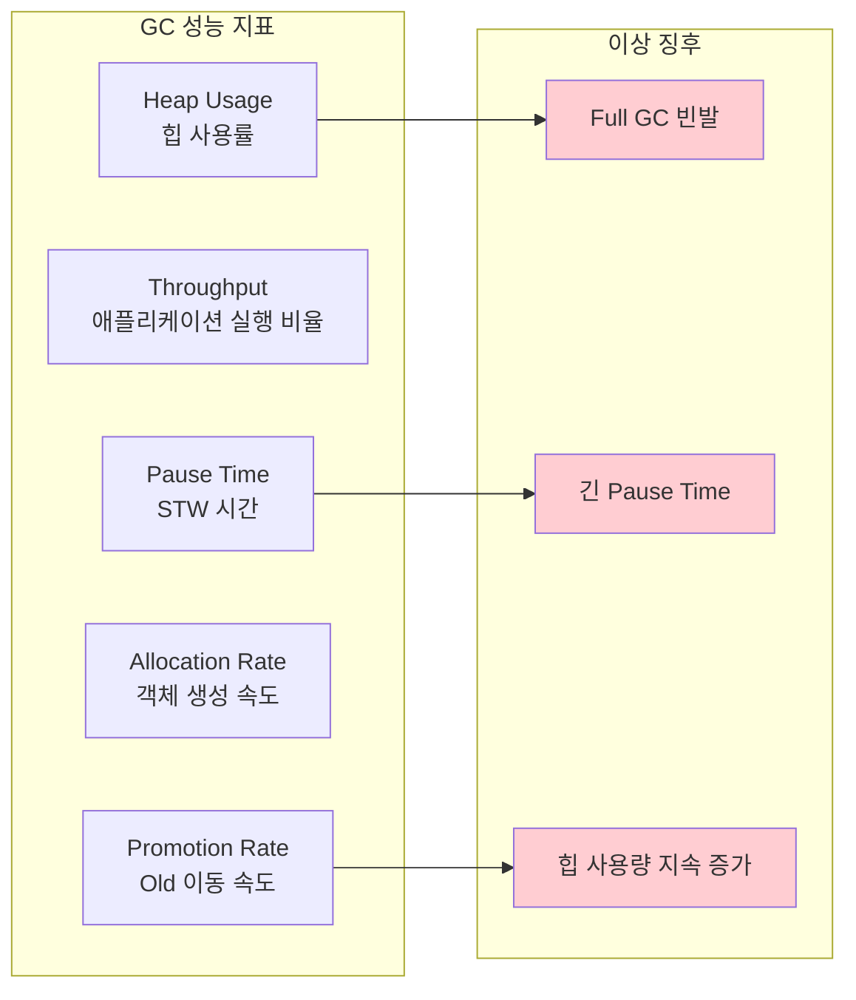

### 4.3 GC 분석 도구

| 도구 | 용도 | 특징 |
|------|------|------|
| **GCeasy** | GC 로그 분석 | 웹 기반, 무료, 시각화 우수 |
| **GCViewer** | GC 로그 분석 | 오픈소스, 로컬 실행 |
| **JFR (Flight Recorder)** | 런타임 프로파일링 | JDK 내장, 저오버헤드 |
| **Async Profiler** | CPU/메모리 프로파일링 | 오픈소스, 낮은 오버헤드 |
| **VisualVM** | 종합 모니터링 | GUI 기반, 실시간 모니터링 |

---

## 5. 실전 설정 가이드

### 5.1 시나리오별 권장 설정

#### 시나리오 A: 개발/테스트 환경 (메모리 최소화)

```bash
JAVA_OPTS="-XX:+UseSerialGC \
           -Xms128m -Xmx256m \
           -Xss512k \
           -XX:MaxMetaspaceSize=64m \
           -XX:+UseStringDeduplication"
```

#### 시나리오 B: 운영 환경 - 범용 API 서버

```bash
JAVA_OPTS="-XX:+UseG1GC \
           -XX:MaxGCPauseMillis=200 \
           -XX:MaxRAMPercentage=75.0 \
           -XX:InitialRAMPercentage=50.0 \
           -Xss512k \
           -XX:+UseStringDeduplication \
           -Xlog:gc*:file=/var/log/gc.log:time,uptime:filecount=5,filesize=10m"
```

#### 시나리오 C: 운영 환경 - 저지연 필수 (Java 21+)

```bash
JAVA_OPTS="-XX:+UseZGC \
           -XX:+ZGenerational \
           -XX:MaxRAMPercentage=75.0 \
           -Xss512k \
           -Xlog:gc*:file=/var/log/gc.log:time,uptime:filecount=5,filesize=10m"
```

### 5.2 GC 선택 의사결정 플로우

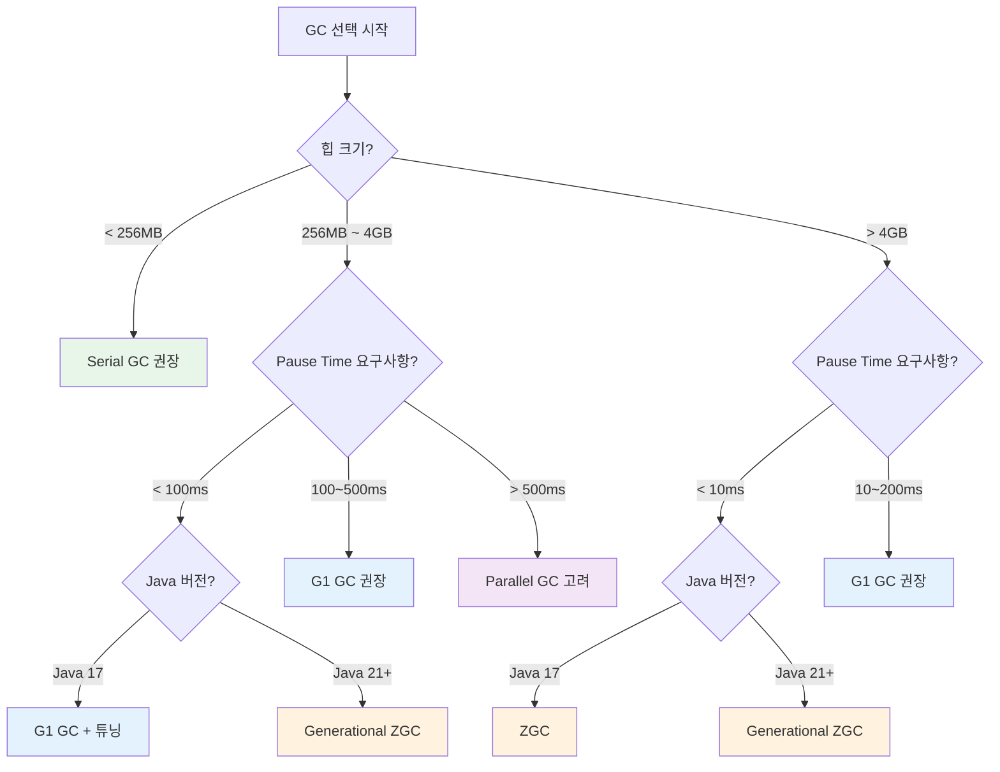

---

## 6. 면접 대비 핵심 포인트

### Q1: "G1 GC와 ZGC의 차이점은?"

> "G1과 ZGC는 모두 현대적인 GC 알고리즘이지만 설계 목표가 다릅니다. G1은 **처리량과 지연시간의 균형**을 목표로 하여 대부분의 워크로드에 적합한 범용 GC입니다. MaxGCPauseMillis 파라미터로 목표 지연시간을 설정할 수 있지만, 보장은 아닙니다.
>
> 반면 ZGC는 **극한의 저지연**을 목표로 설계되어, 힙 크기가 수 테라바이트에 달해도 Pause Time을 10ms 이하로 유지합니다. 이를 위해 Colored Pointer라는 기술로 객체 이동 중에도 애플리케이션이 계속 실행될 수 있게 합니다. 다만 CPU 오버헤드가 10-15% 정도 추가됩니다."

### Q2: "컨테이너 환경에서 JVM 힙을 어떻게 설정하나요?"

> "컨테이너 환경에서는 **비율 기반 설정**을 권장합니다. -Xmx로 절대값을 설정하면 컨테이너 리사이즈 시 문제가 발생할 수 있기 때문입니다.
>
> `MaxRAMPercentage=75.0`으로 설정하면 컨테이너 메모리의 75%를 최대 힙으로 사용합니다. 100%로 설정하면 안 되는 이유는 JVM이 힙 외에도 Metaspace, Thread Stack, Code Cache 등 Non-Heap 메모리를 사용하기 때문입니다. 약 25% 정도를 여유분으로 두어야 OOM을 방지할 수 있습니다."

### Q3: "GC 튜닝 시 가장 먼저 해야 할 일은?"

> "GC 튜닝에서 가장 중요한 첫 단계는 **현재 상태를 측정**하는 것입니다. GC 로그를 활성화하고 최소 며칠간의 운영 데이터를 수집해야 합니다. 평균 Pause Time, P99 Pause Time, Full GC 빈도, 처리량(Throughput) 등의 지표를 파악한 후에야 올바른 튜닝 방향을 결정할 수 있습니다.
>
> 측정 없이 파라미터를 변경하는 것은 눈 감고 운전하는 것과 같습니다."

---

## 7. 다음 단계

- **[02-spring-boot-tuning.md](02-spring-boot-tuning.md)**: Spring Boot 애플리케이션 레벨 최적화
- **[06-poc-plan.md](06-poc-plan.md)**: GC 벤치마크 POC 계획
