# 02. Spring Boot 애플리케이션 레벨 최적화

> **핵심 목표**: 코드 변경 최소화하면서 Spring Boot의 기본 설정을 조정하여 리소스 효율성 극대화

---

## 1. Spring Boot의 메모리 사용 패턴 이해

### 1.1 시작 시점의 메모리 할당

Spring Boot 애플리케이션이 시작될 때, 다양한 컴포넌트들이 메모리를 할당받습니다. 이 과정을 이해하면 어디서 최적화가 가능한지 파악할 수 있습니다.

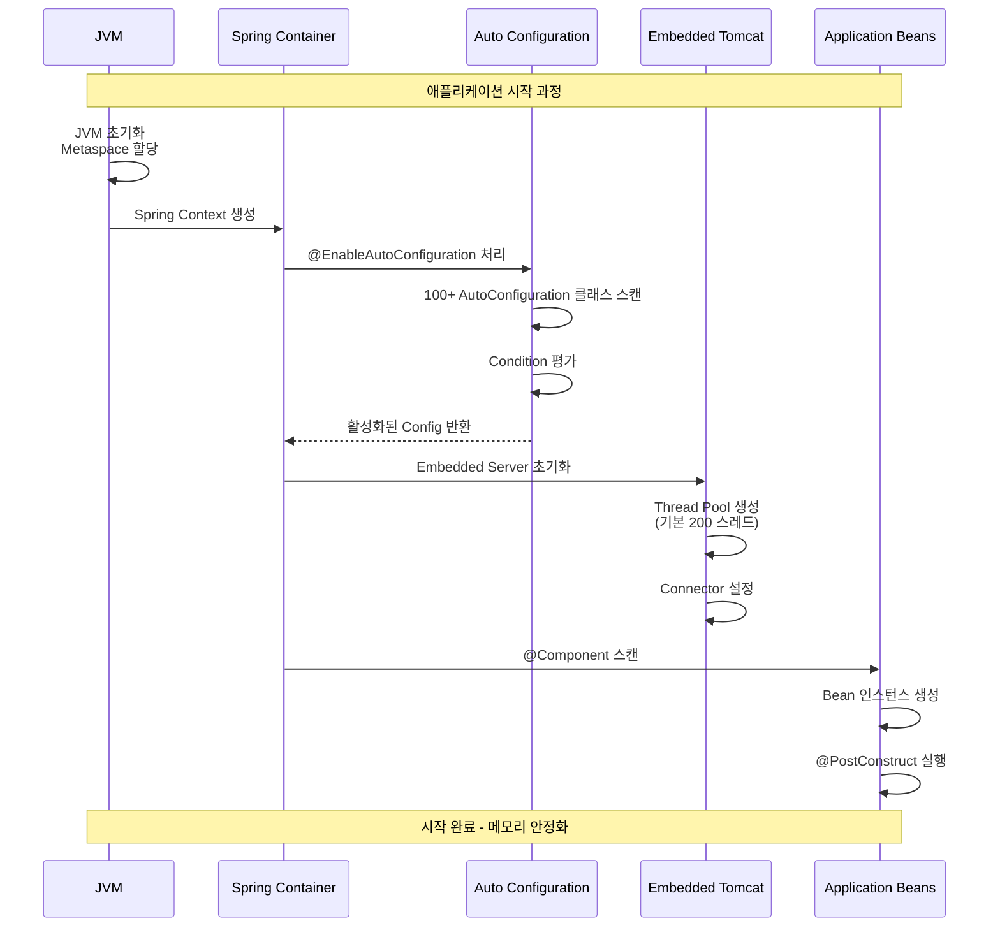

### 1.2 메모리 소비 원인 분석

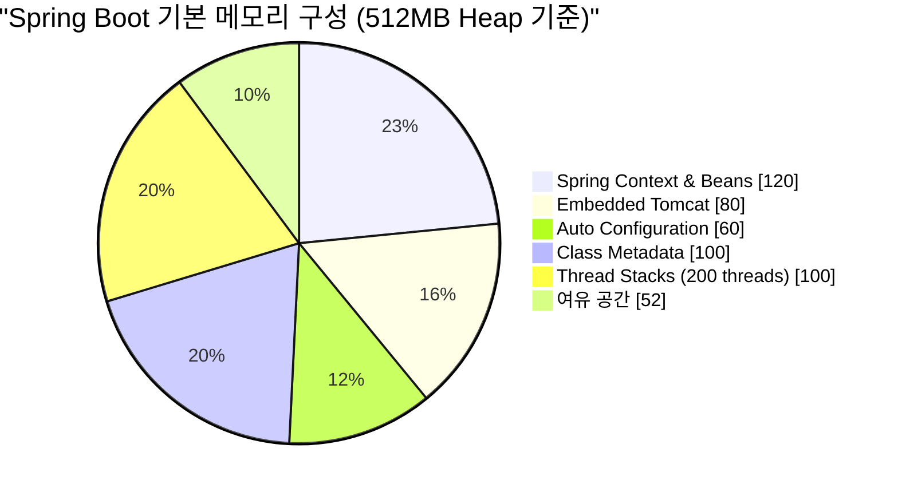

핵심 인사이트:
- **Auto Configuration**: 실제 사용 여부와 관계없이 조건 평가를 위한 클래스 로딩 발생
- **Embedded Server**: 기본 스레드 풀 크기가 과도하게 설정되어 있음
- **Lazy Initialization 미적용**: 모든 Bean이 시작 시점에 생성됨

---

## 2. Lazy Initialization (지연 초기화)

### 2.1 개념 설명

면접에서 "Lazy Initialization이 무엇인가요?"라는 질문을 받는다면:

> "Lazy Initialization은 **Bean의 생성 시점을 애플리케이션 시작 시점이 아닌 실제 사용 시점으로 지연**시키는 전략입니다. Spring Boot에서는 기본적으로 모든 Singleton Bean이 애플리케이션 시작 시 생성되는데(Eager Initialization), Lazy Initialization을 활성화하면 해당 Bean이 처음 요청될 때 비로소 생성됩니다.
>
> 이를 통해 **시작 시간을 단축**하고 **초기 메모리 사용량을 줄일** 수 있습니다. 다만, 첫 요청 시 Bean 생성이 발생하므로 **첫 요청의 지연(Cold Start)** 이 발생할 수 있다는 트레이드오프가 있습니다."

### 2.2 Eager vs Lazy 비교


### 2.3 적용 방법

#### 전역 활성화 (application.yml)

```yaml
spring:
  main:
    lazy-initialization: true
```

#### 특정 Bean만 Lazy 처리

```java
@Configuration
public class MyConfig {
    
    @Bean
    @Lazy  // 이 Bean만 Lazy
    public HeavyService heavyService() {
        return new HeavyService();
    }
    
    @Bean  // 기본값: Eager
    public LightService lightService() {
        return new LightService();
    }
}
```

#### 특정 Bean은 Eager 유지 (전역 Lazy 모드에서)

```java
@Component
@Lazy(false)  // 전역 Lazy 모드에서도 이 Bean은 즉시 초기화
public class CriticalService {
    // 항상 준비되어 있어야 하는 서비스
}
```

### 2.4 주의사항 및 베스트 프랙티스

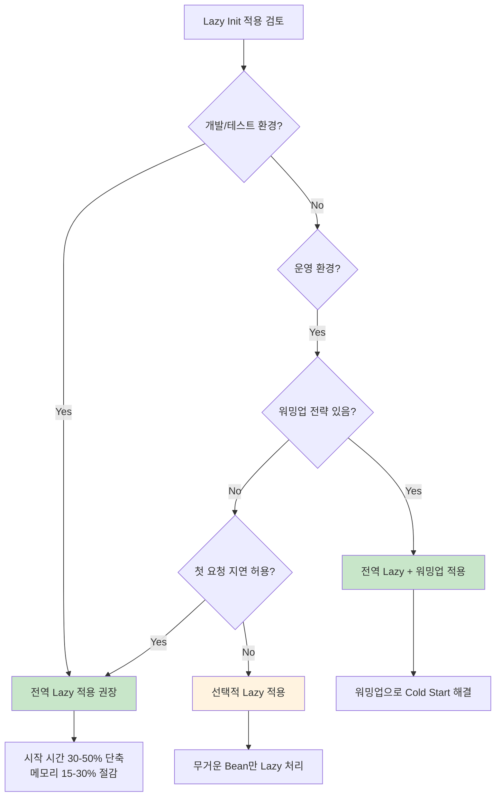

**워밍업 전략 예시**:

```java
@Component
public class WarmupRunner implements ApplicationRunner {
    
    private final List<WarmupTarget> warmupTargets;
    
    @Override
    public void run(ApplicationArguments args) {
        log.info("Starting warmup...");
        warmupTargets.forEach(target -> {
            try {
                target.warmup();
            } catch (Exception e) {
                log.warn("Warmup failed for {}", target.getClass().getName(), e);
            }
        });
        log.info("Warmup completed");
    }
}
```

---

## 3. Auto Configuration 최적화

### 3.1 Auto Configuration의 동작 원리

Spring Boot의 마법 같은 "자동 설정"은 내부적으로 상당한 비용을 수반합니다. 이해를 돕기 위해 동작 과정을 살펴보겠습니다:

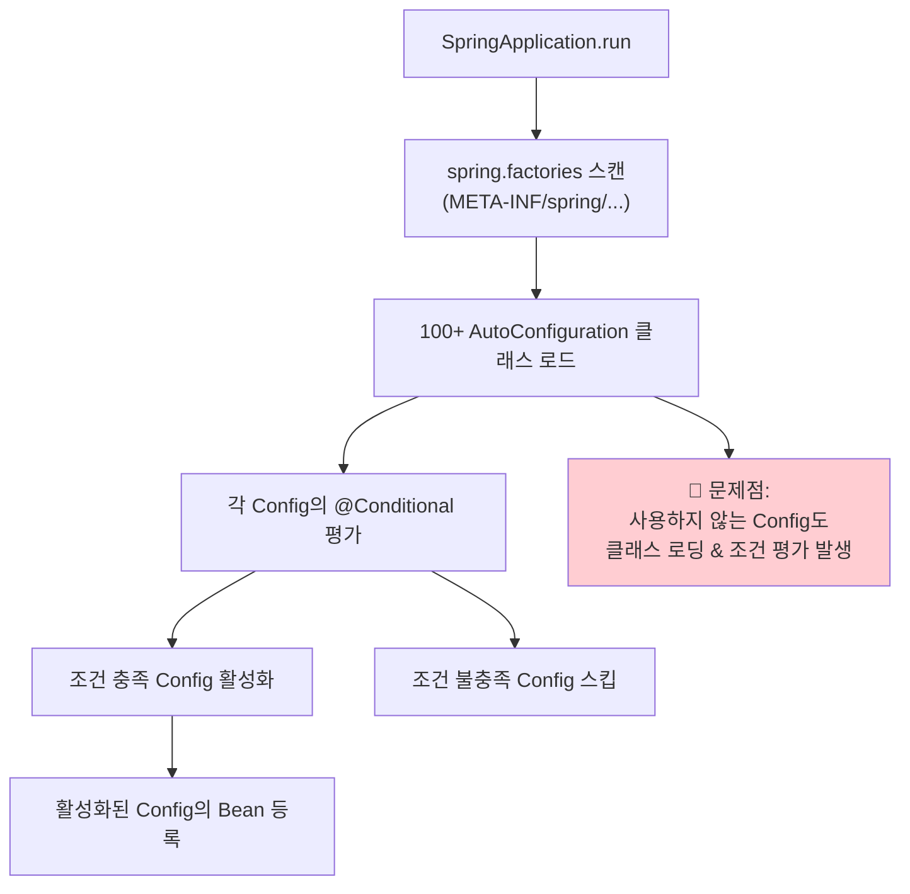

### 3.2 불필요한 Auto Configuration 제외

#### 방법 1: @SpringBootApplication의 exclude 속성

```java
@SpringBootApplication(exclude = {
    // 데이터베이스 관련 (사용하지 않는 경우)
    DataSourceAutoConfiguration.class,
    HibernateJpaAutoConfiguration.class,
    JpaRepositoriesAutoConfiguration.class,
    
    // 보안 관련 (자체 구현 사용 시)
    SecurityAutoConfiguration.class,
    UserDetailsServiceAutoConfiguration.class,
    
    // 캐시 관련 (사용하지 않는 경우)
    CacheAutoConfiguration.class,
    
    // 메시징 관련 (사용하지 않는 경우)
    RabbitAutoConfiguration.class,
    KafkaAutoConfiguration.class,
    
    // 기타
    MailSenderAutoConfiguration.class,
    QuartzAutoConfiguration.class,
    FlywayAutoConfiguration.class
})
public class MyApplication {
    public static void main(String[] args) {
        SpringApplication.run(MyApplication.class, args);
    }
}
```

#### 방법 2: application.yml 설정

```yaml
spring:
  autoconfigure:
    exclude:
      - org.springframework.boot.autoconfigure.jdbc.DataSourceAutoConfiguration
      - org.springframework.boot.autoconfigure.orm.jpa.HibernateJpaAutoConfiguration
      - org.springframework.boot.autoconfigure.security.servlet.SecurityAutoConfiguration
      - org.springframework.boot.autoconfigure.mail.MailSenderAutoConfiguration
```

### 3.3 현재 활성화된 Auto Configuration 확인

디버그 모드로 어떤 Configuration이 활성화되었는지 확인할 수 있습니다:

```yaml
# application.yml
debug: true

# 또는 조건 평가 리포트만 보기
logging:
  level:
    org.springframework.boot.autoconfigure: DEBUG
```

출력 예시:
```
============================
CONDITIONS EVALUATION REPORT
============================

Positive matches:
-----------------
   DataSourceAutoConfiguration matched:
      - @ConditionalOnClass found required classes 'javax.sql.DataSource'

Negative matches:
-----------------
   RabbitAutoConfiguration:
      Did not match:
         - @ConditionalOnClass did not find required class 'com.rabbitmq.client.Channel'
```

### 3.4 모듈별 Auto Configuration 제외 가이드

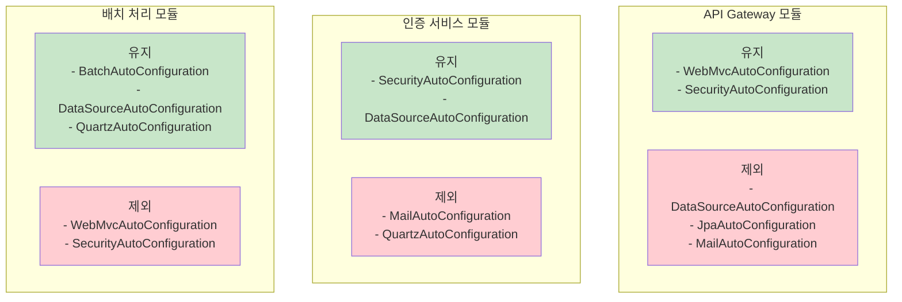

---

## 4. Embedded Server (Tomcat) 최적화

### 4.1 기본 Thread Pool의 문제점

Spring Boot의 Embedded Tomcat은 기본적으로 **200개의 최대 스레드**를 설정합니다. 이는 대부분의 마이크로서비스에서 **과도한 설정**입니다.

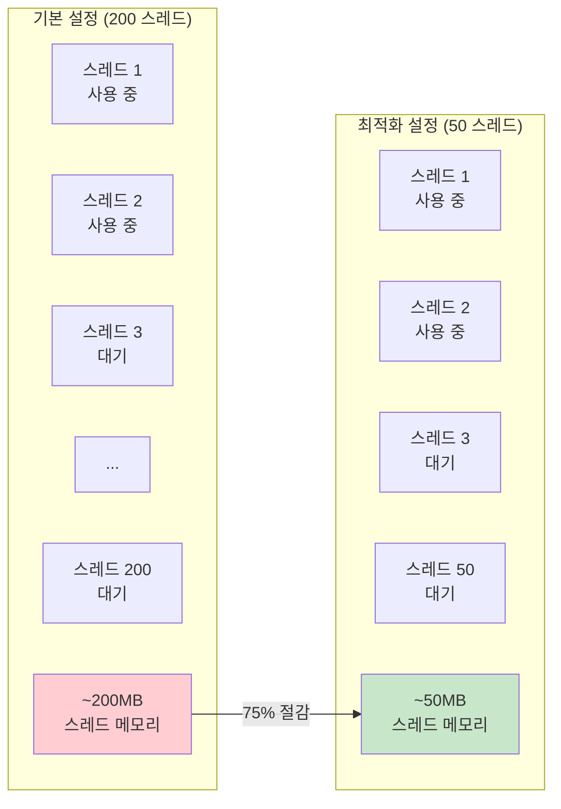

### 4.2 Tomcat Thread Pool 설정

```yaml
server:
  tomcat:
    # 스레드 풀 설정
    threads:
      max: 50          # 최대 스레드 수 (기본값: 200)
      min-spare: 10    # 최소 유지 스레드 (기본값: 10)
    
    # 연결 설정
    max-connections: 200    # 최대 동시 연결 (기본값: 8192)
    accept-count: 100       # 대기열 크기 (기본값: 100)
    
    # 연결 타임아웃
    connection-timeout: 20000  # 연결 타임아웃 (ms)
    
    # Keep-Alive 설정
    keep-alive-timeout: 30000  # Keep-Alive 타임아웃 (ms)
    max-keep-alive-requests: 100  # Keep-Alive 요청 수
```

### 4.3 스레드 풀 사이징 공식

적절한 스레드 풀 크기를 결정하는 공식:

```
최적 스레드 수 = CPU 코어 수 × (1 + 대기 시간 / 서비스 시간)
```

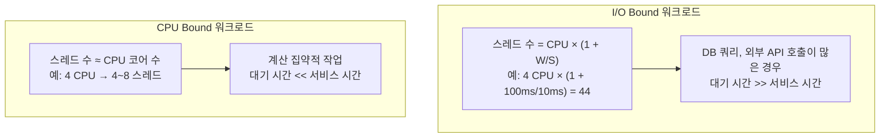

### 4.4 모듈별 권장 설정

| 모듈 유형 | max-threads | min-spare | max-connections | 이유 |
|----------|:-----------:|:---------:|:---------------:|------|
| API Gateway | 100-200 | 20 | 500 | 많은 동시 연결 처리 |
| 인증 서비스 | 30-50 | 10 | 100 | 세션 관리, 중간 부하 |
| 비즈니스 API | 50-100 | 10 | 200 | 범용 워크로드 |
| 배치 처리 | 10-20 | 5 | 50 | 동시성 낮음, 처리량 중요 |
| 알림 서비스 | 20-30 | 5 | 100 | 비동기 처리 위주 |

### 4.5 Undertow로 전환 (선택사항)

Undertow는 Tomcat보다 **더 적은 메모리**를 사용하는 것으로 알려져 있습니다:

```xml
<!-- pom.xml -->
<dependency>
    <groupId>org.springframework.boot</groupId>
    <artifactId>spring-boot-starter-web</artifactId>
    <exclusions>
        <exclusion>
            <groupId>org.springframework.boot</groupId>
            <artifactId>spring-boot-starter-tomcat</artifactId>
        </exclusion>
    </exclusions>
</dependency>
<dependency>
    <groupId>org.springframework.boot</groupId>
    <artifactId>spring-boot-starter-undertow</artifactId>
</dependency>
```

```yaml
# application.yml - Undertow 설정
server:
  undertow:
    threads:
      io: 4          # I/O 스레드 (CPU 코어 수 권장)
      worker: 32     # Worker 스레드
    buffer-size: 1024
    direct-buffers: true
```

---

## 5. 데이터베이스 Connection Pool 최적화

### 5.1 HikariCP 기본 이해

Spring Boot 2.x 이후 기본 Connection Pool은 **HikariCP**입니다. 올바른 설정은 메모리와 성능 모두에 영향을 미칩니다.

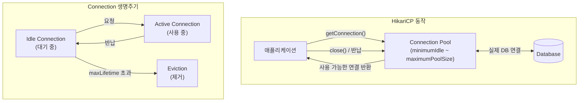

### 5.2 HikariCP 최적화 설정

```yaml
spring:
  datasource:
    hikari:
      # 풀 크기 설정
      maximum-pool-size: 10        # 최대 연결 수 (기본값: 10)
      minimum-idle: 5              # 최소 유지 Idle 연결
      
      # 연결 생명주기
      max-lifetime: 1800000        # 연결 최대 수명 (30분, ms)
      idle-timeout: 600000         # Idle 연결 유지 시간 (10분, ms)
      connection-timeout: 30000    # 연결 획득 대기 시간 (30초, ms)
      
      # 검증 및 유지
      validation-timeout: 5000     # 연결 검증 타임아웃
      leak-detection-threshold: 60000  # 연결 누수 감지 (60초)
      
      # 성능 최적화
      auto-commit: true
      pool-name: HikariPool-Main
```

### 5.3 Connection Pool 사이징 공식

```
최적 Pool 크기 = (CPU 코어 수 × 2) + 유효 디스크 수
```

실제로는 대부분의 경우 **10~20개**가 적절합니다:

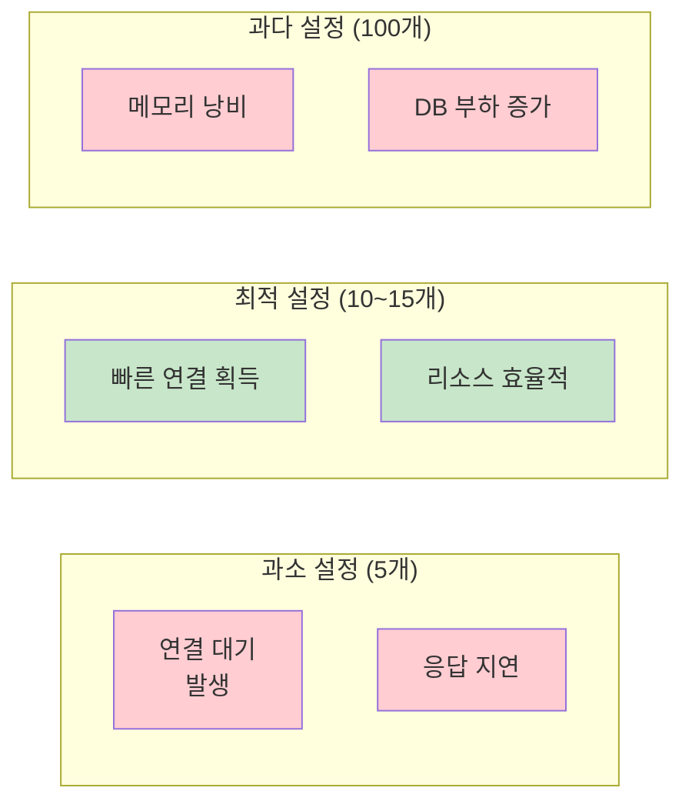

---

## 6. Actuator 최적화

### 6.1 필요한 엔드포인트만 활성화

Actuator는 유용하지만, 모든 엔드포인트를 활성화하면 **추가 메모리와 CPU**를 소비합니다:

```yaml
management:
  # 기본적으로 모든 엔드포인트 비활성화
  endpoints:
    enabled-by-default: false
    web:
      exposure:
        include: health,info,metrics,prometheus
  
  # 필요한 엔드포인트만 활성화
  endpoint:
    health:
      enabled: true
      show-details: when-authorized
    info:
      enabled: true
    metrics:
      enabled: true
    prometheus:
      enabled: true
```

### 6.2 Health Check 최적화

```yaml
management:
  endpoint:
    health:
      # 상세 정보 조회 시에만 전체 체크
      show-details: when-authorized
      
      # 그룹별 health check
      group:
        liveness:
          include: livenessState
        readiness:
          include: readinessState,db
  
  health:
    # 무거운 health indicator 비활성화
    diskspace:
      enabled: false
    mail:
      enabled: false
```

---

## 7. 캐싱 전략 최적화

### 7.1 적절한 캐시 선택

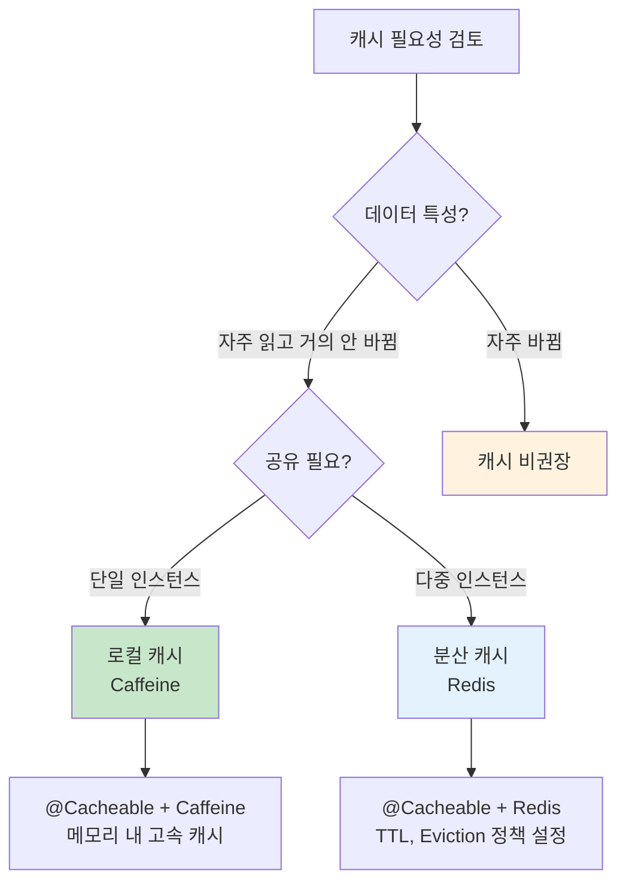

### 7.2 Caffeine 캐시 설정 (메모리 효율적)

```yaml
spring:
  cache:
    type: caffeine
    caffeine:
      spec: maximumSize=1000,expireAfterWrite=10m,recordStats
```

```java
@Configuration
@EnableCaching
public class CacheConfig {
    
    @Bean
    public CacheManager cacheManager() {
        CaffeineCacheManager manager = new CaffeineCacheManager();
        manager.setCaffeine(Caffeine.newBuilder()
            .maximumSize(1000)              // 최대 항목 수
            .expireAfterWrite(10, TimeUnit.MINUTES)  // 쓰기 후 만료
            .recordStats());                // 통계 수집
        return manager;
    }
}
```

---

## 8. 종합 설정 예시

### 8.1 개발 환경 (최소 메모리)

```yaml
# application-dev.yml
spring:
  main:
    lazy-initialization: true
  
  datasource:
    hikari:
      maximum-pool-size: 3
      minimum-idle: 1

server:
  tomcat:
    threads:
      max: 10
      min-spare: 2

management:
  endpoints:
    enabled-by-default: false
  endpoint:
    health:
      enabled: true

logging:
  level:
    root: INFO
```

### 8.2 운영 환경 (균형잡힌 설정)

```yaml
# application-prod.yml
spring:
  main:
    lazy-initialization: false  # 운영은 Eager 권장
  
  datasource:
    hikari:
      maximum-pool-size: 10
      minimum-idle: 5
      max-lifetime: 1800000
      connection-timeout: 30000

server:
  tomcat:
    threads:
      max: 50
      min-spare: 10
    max-connections: 200
    accept-count: 100

management:
  endpoints:
    enabled-by-default: false
    web:
      exposure:
        include: health,info,metrics,prometheus
  endpoint:
    health:
      enabled: true
      show-details: when-authorized
    metrics:
      enabled: true
    prometheus:
      enabled: true
```

---

## 9. 체크리스트

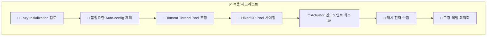

---

## 10. 면접 대비 핵심 포인트

### Q1: "Spring Boot 애플리케이션의 메모리 사용량을 줄이는 방법은?"

> "여러 계층에서 접근할 수 있습니다.
>
> 첫째, **Lazy Initialization**을 활성화하여 시작 시점의 Bean 생성을 지연시킬 수 있습니다. 이는 특히 많은 Bean을 가진 애플리케이션에서 효과적입니다.
>
> 둘째, **불필요한 Auto Configuration을 제외**합니다. Spring Boot는 classpath에 있는 라이브러리를 기반으로 많은 자동 설정을 수행하는데, 사용하지 않는 기능의 Configuration을 명시적으로 제외하면 클래스 로딩과 Bean 생성을 줄일 수 있습니다.
>
> 셋째, **Embedded Server의 Thread Pool 크기를 조정**합니다. 기본 200개의 스레드는 대부분의 마이크로서비스에서 과도하며, 실제 워크로드에 맞게 50개 이하로 줄이면 상당한 메모리를 절약할 수 있습니다."

### Q2: "Lazy Initialization의 단점은?"

> "Lazy Initialization의 주요 단점은 **첫 요청 시 지연(Cold Start)** 입니다. Bean이 처음 요청될 때 비로소 생성되므로, 해당 요청의 응답 시간이 길어질 수 있습니다.
>
> 또한, **시작 시점에 발견되어야 할 설정 오류가 런타임에 발견**될 수 있습니다. Eager 모드에서는 시작 시 모든 Bean이 생성되므로 의존성 문제나 설정 오류가 즉시 발견되지만, Lazy 모드에서는 해당 Bean이 처음 사용될 때까지 오류가 숨겨질 수 있습니다.
>
> 운영 환경에서는 **워밍업 전략**을 함께 사용하여 첫 요청 지연을 완화하는 것이 좋습니다."

---

## 11. 다음 단계

- **[03-graalvm-native.md](03-graalvm-native.md)**: GraalVM Native Image로 극적인 최적화
- **[04-virtual-threads.md](04-virtual-threads.md)**: Java 21 Virtual Threads 활용
