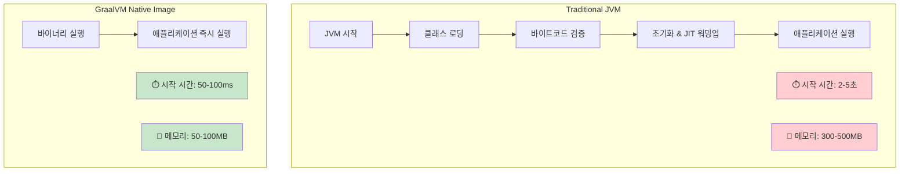
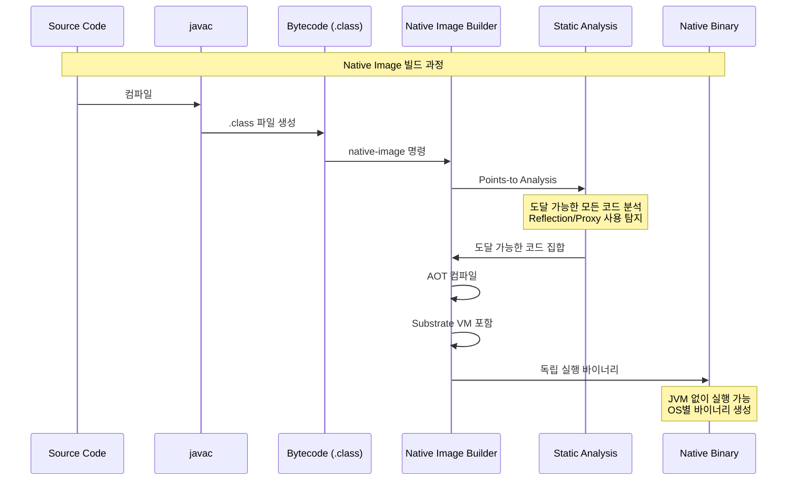
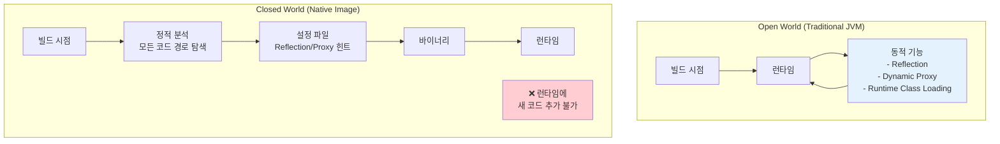
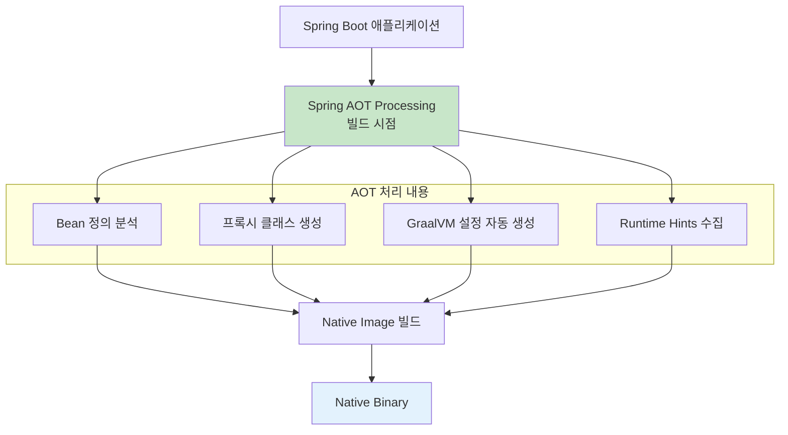
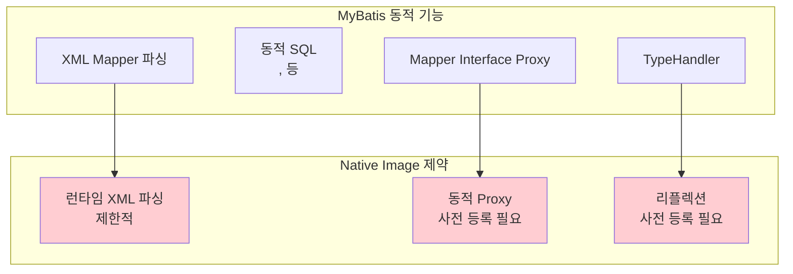
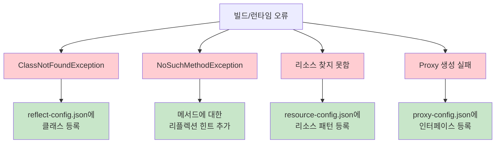
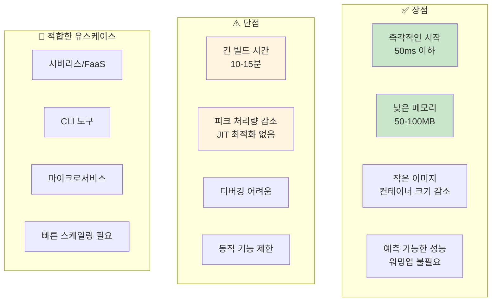
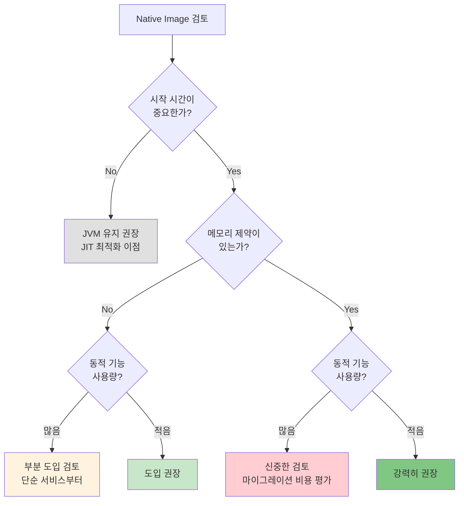

# 03. GraalVM Native Image - 극한의 최적화

> **핵심 목표**: AOT 컴파일을 통한 시작 시간 95% 단축 및 메모리 70-80% 절감

---

## 1. GraalVM Native Image란?

### 1.1 개념 이해

면접에서 "GraalVM Native Image가 무엇인가요?"라는 질문을 받는다면:

> "GraalVM Native Image는 Java 애플리케이션을 **Ahead-of-Time(AOT) 컴파일**하여 **독립 실행 가능한 네이티브 바이너리**로 변환하는 기술입니다.
>
> 전통적인 Java 애플리케이션은 JVM 위에서 바이트코드를 해석하고, JIT(Just-In-Time) 컴파일러가 런타임에 최적화합니다. 반면 Native Image는 빌드 시점에 **모든 코드를 기계어로 컴파일**하고, 필요한 런타임 컴포넌트만 포함시킵니다.
>
> 그 결과 **밀리초 단위의 시작 시간**과 **수십 MB 수준의 메모리 사용량**을 달성할 수 있어, 서버리스 환경이나 컨테이너 기반 마이크로서비스에 이상적입니다."

### 1.2 JVM vs Native Image 비교



### 1.3 빌드 과정 이해



---

## 2. Closed World Assumption

### 2.1 핵심 제약 이해

Native Image의 가장 중요한 개념은 **Closed World Assumption (폐쇄 세계 가정)** 입니다:

> "Native Image는 빌드 시점에 **모든 코드가 알려져 있다**고 가정합니다. 런타임에 새로운 클래스를 로드하거나 동적으로 코드를 생성하는 것이 불가능합니다."



### 2.2 영향받는 Java 기능

| 기능 | 제약 사항 | 해결 방법 |
|------|----------|-----------|
| **Reflection** | 빌드 시점에 알 수 없는 리플렉션 실패 | reflect-config.json 설정 |
| **Dynamic Proxy** | 런타임 프록시 생성 불가 | proxy-config.json 설정 |
| **Class Loading** | ClassLoader 동적 로딩 불가 | 정적 초기화로 전환 |
| **Serialization** | 기본 직렬화 제한적 | serialization-config.json |
| **JNI** | 네이티브 메서드 힌트 필요 | jni-config.json |

---

## 3. Spring Boot 3.x와 Native Image

### 3.1 Spring Boot의 AOT 엔진

Spring Boot 3.0부터 **First-class Native Image 지원**이 추가되었습니다. Spring의 AOT 엔진이 대부분의 설정을 자동으로 처리합니다:



### 3.2 프로젝트 설정

#### Maven 설정

```xml
<!-- pom.xml -->
<parent>
    <groupId>org.springframework.boot</groupId>
    <artifactId>spring-boot-starter-parent</artifactId>
    <version>3.2.3</version>
</parent>

<dependencies>
    <dependency>
        <groupId>org.springframework.boot</groupId>
        <artifactId>spring-boot-starter-web</artifactId>
    </dependency>
</dependencies>

<build>
    <plugins>
        <plugin>
            <groupId>org.graalvm.buildtools</groupId>
            <artifactId>native-maven-plugin</artifactId>
            <configuration>
                <imageName>my-app</imageName>
                <buildArgs>
                    <buildArg>-O2</buildArg>
                    <buildArg>-H:+ReportExceptionStackTraces</buildArg>
                </buildArgs>
            </configuration>
        </plugin>
        <plugin>
            <groupId>org.springframework.boot</groupId>
            <artifactId>spring-boot-maven-plugin</artifactId>
        </plugin>
    </plugins>
</build>

<profiles>
    <profile>
        <id>native</id>
        <build>
            <plugins>
                <plugin>
                    <groupId>org.graalvm.buildtools</groupId>
                    <artifactId>native-maven-plugin</artifactId>
                    <executions>
                        <execution>
                            <id>build-native</id>
                            <goals>
                                <goal>compile-no-fork</goal>
                            </goals>
                            <phase>package</phase>
                        </execution>
                    </executions>
                </plugin>
            </plugins>
        </build>
    </profile>
</profiles>
```

#### Gradle 설정

```groovy
// build.gradle
plugins {
    id 'org.springframework.boot' version '3.2.3'
    id 'io.spring.dependency-management' version '1.1.4'
    id 'org.graalvm.buildtools.native' version '0.10.0'
    id 'java'
}

graalvmNative {
    binaries {
        main {
            imageName = 'my-app'
            buildArgs.add('-O2')
            buildArgs.add('-H:+ReportExceptionStackTraces')
        }
    }
}
```

### 3.3 빌드 및 실행

```bash
# Maven
./mvnw -Pnative native:compile

# Gradle
./gradlew nativeCompile

# 실행
./target/my-app  # Maven
./build/native/nativeCompile/my-app  # Gradle
```

---

## 4. 리플렉션 처리

### 4.1 문제 상황

Spring과 많은 Java 라이브러리는 리플렉션을 광범위하게 사용합니다:

```java
// 이런 코드는 Native Image에서 실패할 수 있음
Class<?> clazz = Class.forName("com.example.MyService");
Object instance = clazz.getDeclaredConstructor().newInstance();
```

### 4.2 해결 방법: RuntimeHints

Spring Boot 3.x에서는 `RuntimeHintsRegistrar`를 사용하여 힌트를 제공합니다:

```java
@Configuration
@ImportRuntimeHints(MyRuntimeHints.class)
public class MyConfiguration {
}

public class MyRuntimeHints implements RuntimeHintsRegistrar {
    
    @Override
    public void registerHints(RuntimeHints hints, ClassLoader classLoader) {
        // Reflection 힌트
        hints.reflection()
            .registerType(MyService.class, 
                MemberCategory.INVOKE_DECLARED_CONSTRUCTORS,
                MemberCategory.INVOKE_DECLARED_METHODS);
        
        // 리소스 힌트
        hints.resources()
            .registerPattern("config/*.properties");
        
        // Serialization 힌트
        hints.serialization()
            .registerType(MyDto.class);
    }
}
```

### 4.3 @RegisterReflectionForBinding

DTO나 엔티티 클래스에 대한 간단한 힌트:

```java
@Configuration
@RegisterReflectionForBinding({
    UserDto.class,
    OrderDto.class,
    ProductDto.class
})
public class ReflectionConfig {
}
```

---

## 5. MyBatis와 Native Image

### 5.1 MyBatis의 도전과제

MyBatis는 Native Image와 함께 사용할 때 특별한 주의가 필요합니다:



### 5.2 MyBatis Native 지원 설정

MyBatis Spring Boot Starter 3.0.3+에서 Native 지원:

```xml
<dependency>
    <groupId>org.mybatis.spring.boot</groupId>
    <artifactId>mybatis-spring-boot-starter</artifactId>
    <version>3.0.3</version>
</dependency>
```

```java
// RuntimeHints 등록
public class MyBatisRuntimeHints implements RuntimeHintsRegistrar {
    
    @Override
    public void registerHints(RuntimeHints hints, ClassLoader classLoader) {
        // Mapper 인터페이스 등록
        hints.proxies()
            .registerJdkProxy(UserMapper.class);
        
        // 엔티티 클래스 등록
        hints.reflection()
            .registerType(User.class,
                MemberCategory.DECLARED_FIELDS,
                MemberCategory.INVOKE_DECLARED_CONSTRUCTORS);
        
        // XML 리소스 등록
        hints.resources()
            .registerPattern("mapper/*.xml");
    }
}
```

### 5.3 대안: MyBatis Annotation 방식

XML 대신 어노테이션 기반 매핑은 Native Image와 더 잘 호환됩니다:

```java
@Mapper
public interface UserMapper {
    
    @Select("SELECT * FROM users WHERE id = #{id}")
    User findById(Long id);
    
    @Insert("INSERT INTO users (name, email) VALUES (#{name}, #{email})")
    @Options(useGeneratedKeys = true, keyProperty = "id")
    int insert(User user);
    
    @Update("UPDATE users SET name = #{name} WHERE id = #{id}")
    int update(User user);
    
    @Delete("DELETE FROM users WHERE id = #{id}")
    int delete(Long id);
}
```

---

## 6. 빌드 최적화

### 6.1 빌드 시간 단축

Native Image 빌드는 시간이 오래 걸립니다 (10-15분). 최적화 방법:

```bash
# 병렬 처리 활성화
native-image -J-Xmx8g \
             -H:NumberOfThreads=8 \
             -jar app.jar

# Quick Build (개발용)
native-image -Ob -jar app.jar  # -Ob: 빠른 빌드 (최적화 최소)
```

### 6.2 바이너리 크기 최적화

```bash
# 디버그 정보 제거
native-image -H:+StripDebugInfo -jar app.jar

# 크기 최적화
native-image -Os -jar app.jar  # 크기 우선 최적화

# UPX 압축 (선택사항)
upx --best ./my-app
# 140MB -> 35MB 가능
```

### 6.3 Docker 멀티스테이지 빌드

```dockerfile
# 빌드 스테이지
FROM ghcr.io/graalvm/native-image:21 AS builder
WORKDIR /app
COPY ../../../../../../../../Downloads .
RUN ./mvnw -Pnative native:compile -DskipTests

# 런타임 스테이지
FROM ubuntu:22.04
WORKDIR /app
COPY --from=builder /app/target/my-app /app/my-app

# 비-root 사용자 실행
RUN useradd -r -u 1001 appuser
USER appuser

EXPOSE 8080
ENTRYPOINT ["/app/my-app"]
```

최종 이미지 크기: **~80MB** (JVM 기반 대비 1/3)

---

## 7. 트러블슈팅

### 7.1 일반적인 오류와 해결



### 7.2 Tracing Agent 활용

GraalVM의 Tracing Agent로 필요한 설정을 자동 수집:

```bash
# 1. Tracing Agent로 애플리케이션 실행
java -agentlib:native-image-agent=config-output-dir=./native-config \
     -jar target/my-app.jar

# 2. 모든 기능을 테스트 (수동 또는 자동화)

# 3. 생성된 설정 파일 확인
ls ./native-config/
# reflect-config.json
# proxy-config.json
# resource-config.json
# serialization-config.json

# 4. 설정 파일을 src/main/resources/META-INF/native-image/에 복사
```

### 7.3 디버깅 팁

```bash
# 상세 빌드 로그
native-image --verbose -jar app.jar

# 예외 스택트레이스 활성화
native-image -H:+ReportExceptionStackTraces -jar app.jar

# 빌드 리포트 생성
native-image -H:+BuildReport -jar app.jar
```

---

## 8. 성능 특성 이해

### 8.1 장점과 단점



### 8.2 JVM vs Native Image 성능 비교

| 지표 | JVM (G1 GC) | Native Image | 비고 |
|------|:-----------:|:------------:|------|
| 시작 시간 | 2-5초 | 50-100ms | Native 95% 빠름 |
| 메모리 (Idle) | 300-500MB | 50-100MB | Native 70-80% 절감 |
| 피크 처리량 | 100% (기준) | 70-90% | JIT 최적화 없음 |
| 워밍업 시간 | 30초-2분 | 불필요 | Native 즉시 피크 |
| 빌드 시간 | 10-30초 | 10-15분 | JVM 빠름 |
| 디버깅 | 용이 | 어려움 | JVM 유리 |

---

## 9. 도입 판단 가이드

### 9.1 의사결정 플로우



### 9.2 8개 모듈 환경에서의 전략

| 모듈 유형 | Native 적합도 | 권장 사항 |
|----------|:-------------:|----------|
| API Gateway | ⭐⭐⭐⭐ | 높음 - 빠른 스케일링 필요 |
| 인증 서비스 | ⭐⭐⭐ | 중간 - 세션 관리 복잡도 고려 |
| 비즈니스 API | ⭐⭐⭐ | 중간 - MyBatis 사용 시 주의 |
| 배치 처리 | ⭐⭐ | 낮음 - 장시간 실행, JIT 이점 |
| 알림 서비스 | ⭐⭐⭐⭐⭐ | 높음 - 단순 로직, 빠른 시작 |

---

## 10. 면접 대비 핵심 포인트

### Q1: "GraalVM Native Image의 장단점은?"

> "Native Image의 가장 큰 장점은 **밀리초 단위의 시작 시간**과 **대폭 줄어든 메모리 사용량**입니다. 서버리스 환경에서 Cold Start 문제를 해결하고, 컨테이너 환경에서 리소스 효율성을 높일 수 있습니다.
>
> 반면 주요 단점은 **Closed World Assumption**으로 인한 동적 기능 제한입니다. Reflection, Dynamic Proxy 등은 빌드 시점에 명시적으로 등록해야 합니다. 또한 **JIT 최적화가 없어 피크 처리량이 10-30% 정도 낮을 수 있습니다**. 빌드 시간도 10-15분으로 길어 개발 사이클에 영향을 줄 수 있습니다."

### Q2: "Spring Boot에서 Native Image를 사용하려면?"

> "Spring Boot 3.0부터 **First-class Native Image 지원**이 추가되었습니다. Spring의 AOT 엔진이 빌드 시점에 Bean 정의를 분석하고, 필요한 GraalVM 설정을 자동 생성합니다.
>
> 프로젝트에 native-maven-plugin 또는 org.graalvm.buildtools.native 플러그인을 추가하고, `mvn -Pnative native:compile` 또는 `gradle nativeCompile` 명령으로 빌드합니다.
>
> 다만 모든 라이브러리가 Native를 지원하는 것은 아니므로, **의존성 호환성 확인**이 중요합니다. 특히 리플렉션을 많이 사용하는 라이브러리는 추가 설정이 필요할 수 있습니다."

---

## 11. 다음 단계

- **[04-virtual-threads.md](./04-virtual-threads.md)**: Java 21 Virtual Threads로 동시성 혁신
- **[06-poc-plan.md](./06-poc-plan.md)**: Native Image POC 계획
