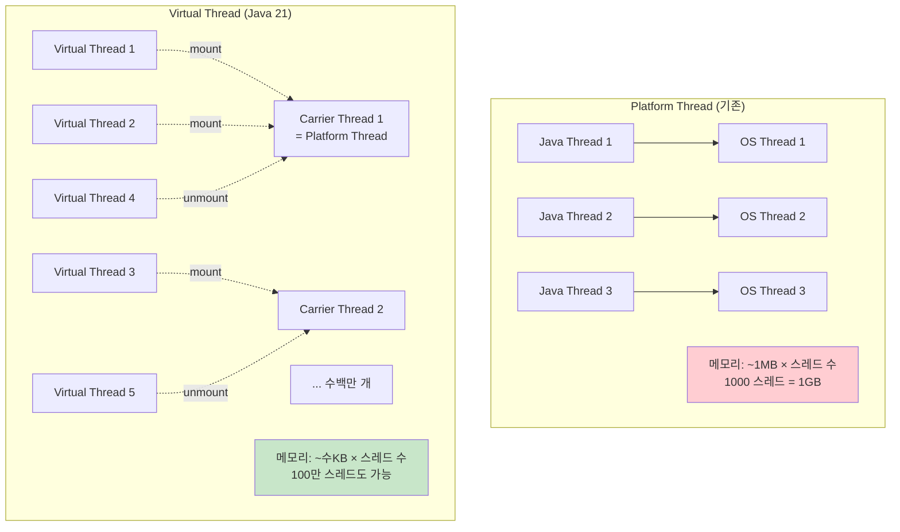
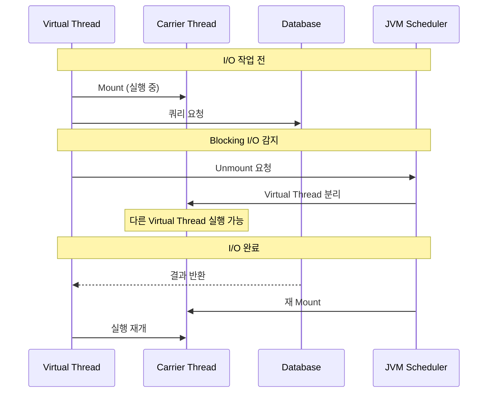
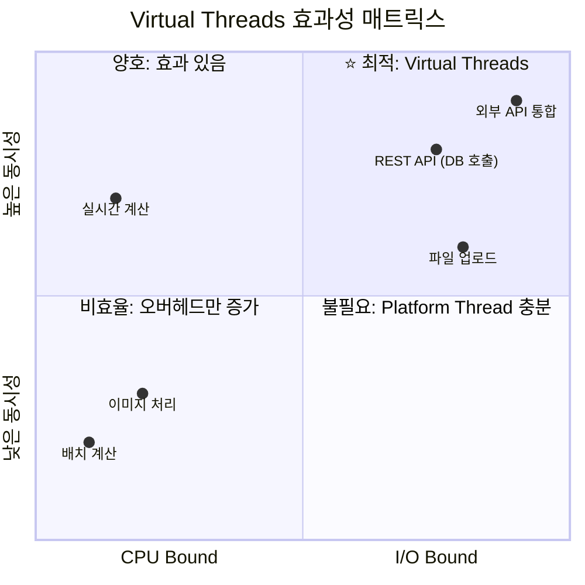
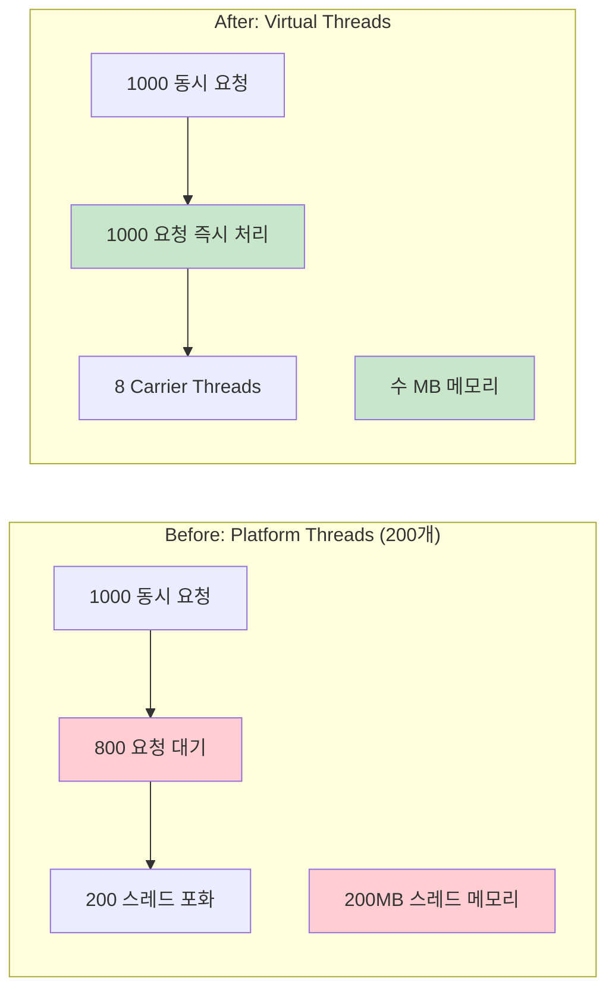
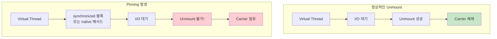
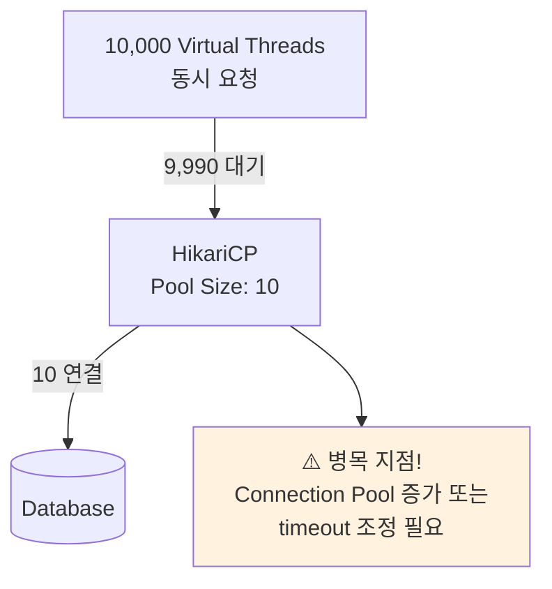
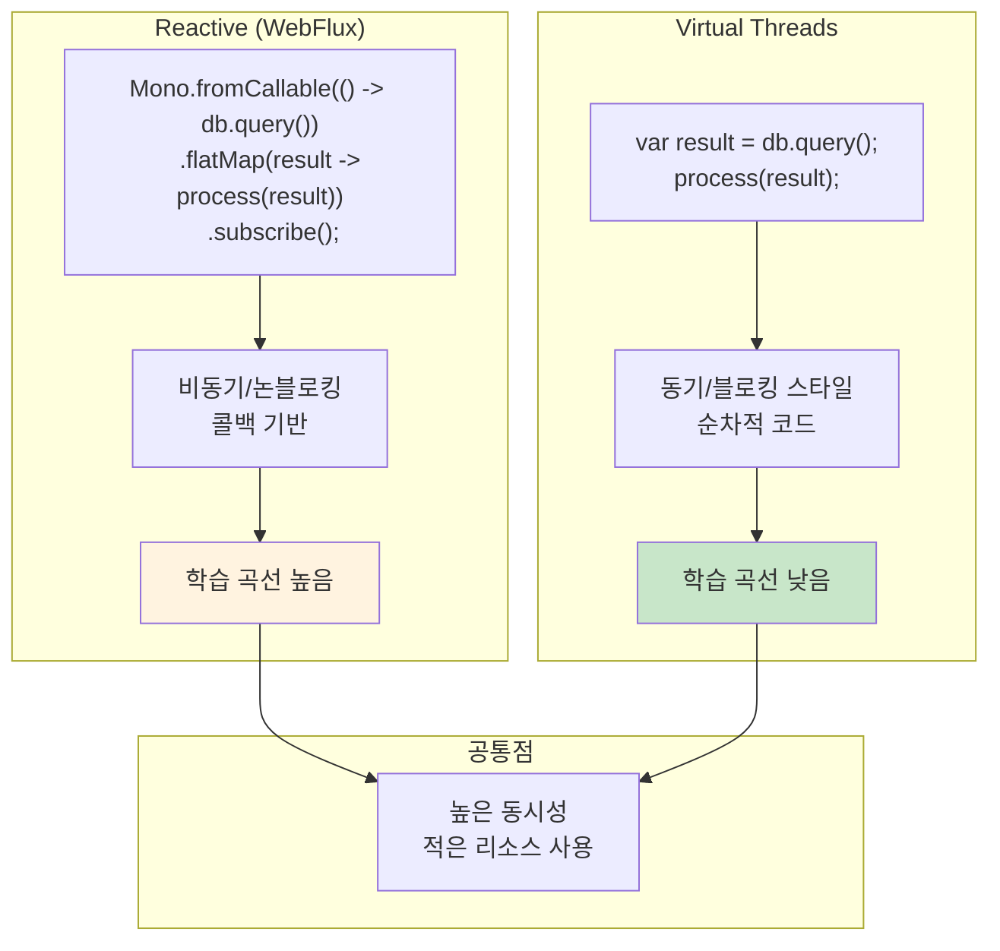
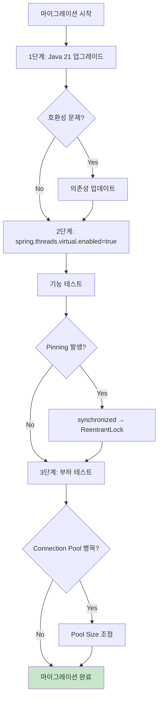

# 04. Java 21 Virtual Threads - 동시성의 패러다임 전환

> **핵심 목표**: 코드 변경 없이 설정만으로 동시성 처리 능력을 획기적으로 개선하고 스레드 메모리 사용량 대폭 절감

---

## 1. Virtual Threads란?

### 1.1 개념 이해

면접에서 "Virtual Threads가 무엇인가요?"라는 질문을 받는다면:

> "Virtual Threads는 Java 21에서 정식 도입된 **경량 스레드(Lightweight Threads)** 입니다. Project Loom의 결과물로, 기존의 Platform Thread와 달리 **JVM이 직접 관리**하며 OS 스레드와 1:1로 매핑되지 않습니다.
>
> 핵심 차이점은 **메모리 효율성**과 **스케일링 특성**입니다. Platform Thread가 약 1MB의 스택 메모리를 사용하는 반면, Virtual Thread는 수 KB만 사용합니다. 덕분에 **수백만 개의 동시 스레드**를 생성할 수 있어, 기존에는 Reactive Programming으로만 달성할 수 있던 동시성을 **익숙한 블로킹 코드 스타일**로 구현할 수 있습니다."

### 1.2 Platform Thread vs Virtual Thread



### 1.3 Mount/Unmount 메커니즘

Virtual Thread의 핵심은 **Blocking I/O 시 Carrier Thread를 해제**하는 것입니다:



이 메커니즘이 작동하려면 I/O 라이브러리가 **Virtual Thread-aware**해야 합니다. Java 21에서 대부분의 표준 라이브러리(Socket, File I/O, JDBC 등)가 이를 지원합니다.

---

## 2. Spring Boot에서 Virtual Threads 활성화

### 2.1 요구 사항

- **Java 21 이상**
- **Spring Boot 3.2 이상** (권장: 3.4+)

### 2.2 활성화 방법

```yaml
# application.yml
spring:
  threads:
    virtual:
      enabled: true
```

이 한 줄로 다음이 자동 설정됩니다:

1. **Tomcat/Jetty** 요청 처리에 Virtual Thread 사용
2. **@Async** 메서드에 Virtual Thread 사용
3. **TaskExecutor** 빈이 Virtual Thread 기반으로 설정

### 2.3 수동 설정 (세밀한 제어)

```java
@Configuration
public class VirtualThreadConfig {
    
    @Bean
    public TomcatProtocolHandlerCustomizer<?> protocolHandlerVirtualThreadCustomizer() {
        return protocolHandler -> {
            protocolHandler.setExecutor(Executors.newVirtualThreadPerTaskExecutor());
        };
    }
    
    @Bean
    public AsyncTaskExecutor applicationTaskExecutor() {
        return new TaskExecutorAdapter(Executors.newVirtualThreadPerTaskExecutor());
    }
    
    @Bean
    public SimpleAsyncTaskScheduler taskScheduler() {
        SimpleAsyncTaskScheduler scheduler = new SimpleAsyncTaskScheduler();
        scheduler.setVirtualThreads(true);
        return scheduler;
    }
}
```

---

## 3. 성능 특성 분석

### 3.1 언제 Virtual Threads가 효과적인가?



### 3.2 성능 향상 사례



### 3.3 실측 벤치마크 수치

| 지표 | Platform Thread | Virtual Thread | 개선율 |
|------|:---------------:|:--------------:|:------:|
| 동시 요청 처리 | 200 | 10,000+ | 50배+ |
| 스레드 메모리 | 200MB | ~5MB | 97% 절감 |
| P99 응답시간 | 250ms | 60ms | 75% 개선 |
| CPU 사용률 | 45% | 40% | 11% 감소 |

*조건: I/O Bound 워크로드, 300ms 외부 API 호출 포함*

---

## 4. 주의사항 및 함정

### 4.1 Pinning 문제

**Pinning**은 Virtual Thread가 Carrier Thread에서 분리되지 못하는 현상입니다:



#### Pinning 발생 조건

1. `synchronized` 블록 내에서 Blocking I/O
2. Native 메서드 (JNI) 호출 중

#### 해결 방법

```java
// ❌ 문제: synchronized 내 I/O
public synchronized void processWithLock() {
    database.query(...);  // Pinning 발생!
}

// ✅ 해결: ReentrantLock 사용
private final ReentrantLock lock = new ReentrantLock();

public void processWithLock() {
    lock.lock();
    try {
        database.query(...);  // Unmount 가능
    } finally {
        lock.unlock();
    }
}
```

### 4.2 ThreadLocal 주의

Virtual Thread는 수백만 개가 생성될 수 있으므로, ThreadLocal 사용 시 메모리 누수 위험:

```java
// ❌ 위험: 대량 Virtual Thread에서 ThreadLocal
private static final ThreadLocal<HeavyObject> cache = new ThreadLocal<>();

public void process() {
    cache.set(new HeavyObject());  // 수백만 개 생성 가능!
    // ...
    cache.remove();  // 반드시 정리!
}

// ✅ 권장: ScopedValue (Java 21 Preview)
private static final ScopedValue<RequestContext> CONTEXT = ScopedValue.newInstance();

public void process() {
    ScopedValue.where(CONTEXT, new RequestContext())
               .run(() -> handleRequest());
}
```

### 4.3 Connection Pool 사이징

Virtual Thread를 사용하면 동시 요청이 급증할 수 있어 **Connection Pool이 병목**이 될 수 있습니다:



```yaml
# Virtual Thread 환경에서의 HikariCP 설정
spring:
  datasource:
    hikari:
      maximum-pool-size: 20       # 기존보다 증가 검토
      connection-timeout: 60000   # timeout 증가 (대기 증가 대비)
```

---

## 5. Reactive vs Virtual Threads

### 5.1 패러다임 비교



### 5.2 선택 가이드

| 기준 | Reactive (WebFlux) | Virtual Threads |
|------|:------------------:|:---------------:|
| 코드 스타일 | 함수형, 선언적 | 명령형, 절차적 |
| 학습 곡선 | 가파름 | 완만함 |
| 기존 코드 마이그레이션 | 대규모 변경 필요 | 설정만 변경 |
| 디버깅 | 어려움 | 기존과 동일 |
| 백프레셔 | 내장 지원 | 별도 구현 필요 |
| 스트리밍 처리 | 최적 | 가능하나 덜 효율적 |
| JDBC 호환성 | 제한적 (R2DBC 필요) | 완벽 호환 |

**결론**: 새 프로젝트에서 **Reactive의 장점(백프레셔, 스트리밍)이 필수가 아니라면 Virtual Threads 권장**

---

## 6. 마이그레이션 가이드

### 6.1 단계별 전환



### 6.2 Pinning 탐지

```bash
# JVM 옵션으로 Pinning 모니터링
java -Djdk.tracePinnedThreads=short \
     -jar application.jar

# 출력 예시
Thread[#23,ForkJoinPool-1-worker-1] pinned
    com.example.MyService.processWithLock(MyService.java:42) <== monitors:1
```

### 6.3 체크리스트

```
□ Java 21 이상으로 업그레이드
□ Spring Boot 3.2 이상으로 업그레이드
□ spring.threads.virtual.enabled=true 설정
□ synchronized 블록 내 I/O 검토 및 수정
□ ThreadLocal 사용 검토 및 정리 로직 확인
□ Connection Pool 사이징 검토
□ Pinning 모니터링 설정
□ 부하 테스트 수행
```

---

## 7. 실전 코드 예시

### 7.1 REST Controller (변경 불필요)

```java
@RestController
@RequestMapping("/api/orders")
public class OrderController {
    
    private final OrderService orderService;
    private final PaymentClient paymentClient;
    private final NotificationService notificationService;
    
    @PostMapping
    public ResponseEntity<Order> createOrder(@RequestBody OrderRequest request) {
        // 이 코드는 변경 없이 Virtual Thread에서 실행됨
        
        // 1. DB 조회 (Blocking I/O → Unmount)
        var user = orderService.getUser(request.getUserId());
        
        // 2. 외부 API 호출 (Blocking I/O → Unmount)
        var payment = paymentClient.process(request.getPayment());
        
        // 3. DB 저장 (Blocking I/O → Unmount)
        var order = orderService.createOrder(user, payment, request);
        
        // 4. 알림 전송 (Blocking I/O → Unmount)
        notificationService.sendOrderConfirmation(order);
        
        return ResponseEntity.ok(order);
    }
}
```

### 7.2 병렬 처리 with StructuredTaskScope (Java 21)

```java
public OrderDetails getOrderDetails(Long orderId) throws Exception {
    // StructuredTaskScope로 병렬 처리
    try (var scope = new StructuredTaskScope.ShutdownOnFailure()) {
        
        Supplier<Order> orderTask = scope.fork(() -> 
            orderService.findById(orderId));
        
        Supplier<Customer> customerTask = scope.fork(() -> 
            customerService.findByOrderId(orderId));
        
        Supplier<List<OrderItem>> itemsTask = scope.fork(() -> 
            itemService.findByOrderId(orderId));
        
        // 모든 작업 완료 대기
        scope.join();
        scope.throwIfFailed();
        
        return new OrderDetails(
            orderTask.get(),
            customerTask.get(),
            itemsTask.get()
        );
    }
}
```

### 7.3 대량 병렬 처리

```java
public List<ProcessResult> processAllItems(List<Long> itemIds) {
    try (var executor = Executors.newVirtualThreadPerTaskExecutor()) {
        
        List<Future<ProcessResult>> futures = itemIds.stream()
            .map(id -> executor.submit(() -> processItem(id)))
            .toList();
        
        return futures.stream()
            .map(future -> {
                try {
                    return future.get();
                } catch (Exception e) {
                    return ProcessResult.failed(e);
                }
            })
            .toList();
    }
}
```

---

## 8. 면접 대비 핵심 포인트

### Q1: "Virtual Threads와 Platform Threads의 차이점은?"

> "가장 큰 차이는 **메모리 효율성**과 **스케줄링 방식**입니다. Platform Thread는 OS 스레드와 1:1로 매핑되어 약 1MB의 스택 메모리를 사용합니다. 반면 Virtual Thread는 JVM이 직접 관리하며 수 KB만 사용합니다.
>
> 또한 Virtual Thread는 **Blocking I/O 시 Carrier Thread에서 분리(Unmount)**되어, 적은 수의 Carrier Thread로 수백만 개의 Virtual Thread를 처리할 수 있습니다. 덕분에 기존의 블로킹 코드 스타일을 유지하면서도 Reactive Programming 수준의 동시성을 달성할 수 있습니다."

### Q2: "Virtual Threads 사용 시 주의할 점은?"

> "크게 세 가지 주의점이 있습니다.
>
> 첫째, **Pinning 문제**입니다. `synchronized` 블록이나 Native 메서드 내에서 Blocking I/O가 발생하면 Virtual Thread가 Carrier Thread에서 분리되지 못합니다. 이 경우 ReentrantLock 같은 `java.util.concurrent` 락을 사용해야 합니다.
>
> 둘째, **ThreadLocal 사용에 주의**해야 합니다. Virtual Thread는 수백만 개가 생성될 수 있어, ThreadLocal에 무거운 객체를 저장하면 메모리 문제가 발생할 수 있습니다.
>
> 셋째, **Connection Pool이 병목**이 될 수 있습니다. 동시 요청이 급증하므로 DB Connection Pool 크기와 timeout 설정을 재검토해야 합니다."

### Q3: "Reactive Programming 대신 Virtual Threads를 써야 하나요?"

> "상황에 따라 다릅니다. Virtual Threads의 가장 큰 장점은 **기존 블로킹 코드를 유지**하면서 높은 동시성을 달성할 수 있다는 점입니다. 학습 곡선이 낮고 디버깅도 쉽습니다.
>
> 반면 Reactive는 **백프레셔 처리**와 **스트리밍 데이터 처리**에서 여전히 장점이 있습니다. 대용량 데이터 스트림을 처리하거나, 시스템 간 흐름 제어가 중요한 경우 Reactive가 더 적합할 수 있습니다.
>
> 새 프로젝트에서 특별히 Reactive의 장점이 필요하지 않다면, **Virtual Threads로 시작하는 것을 권장**합니다."

---

## 9. 다음 단계

- **[05-container-optimization.md](05-container-optimization.md)**: 컨테이너 환경 최적화
- **[06-poc-plan.md](06-poc-plan.md)**: Virtual Threads POC 계획
