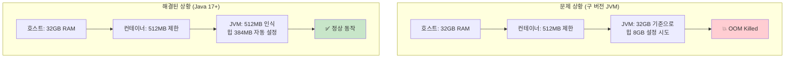
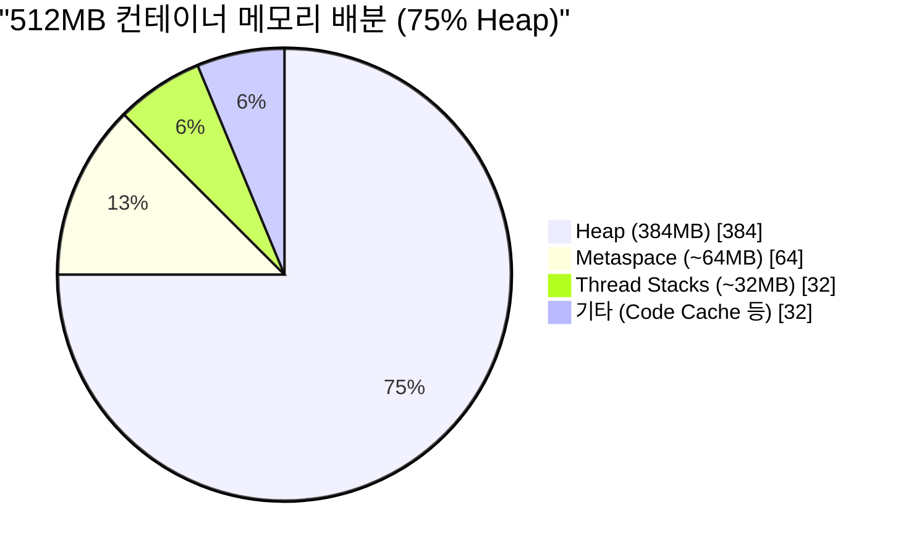
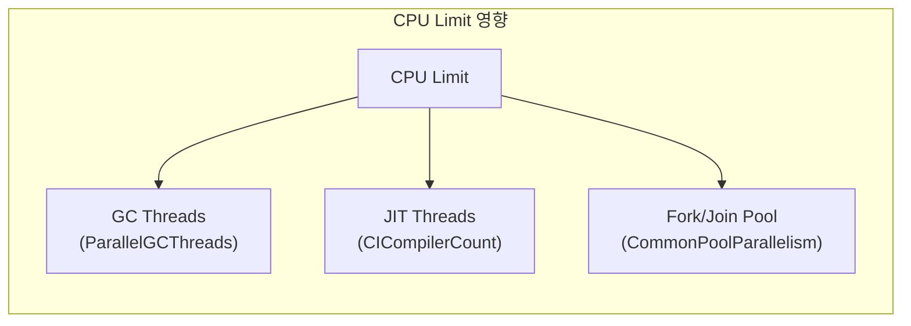
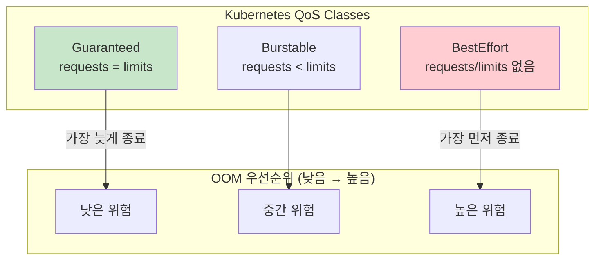
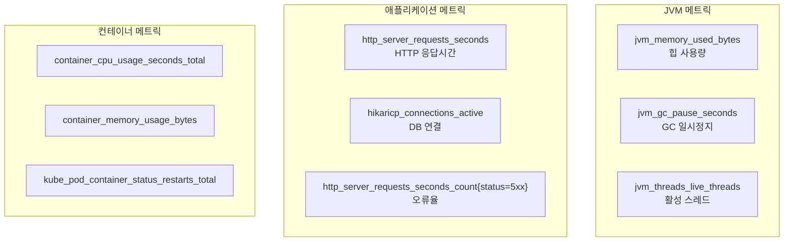
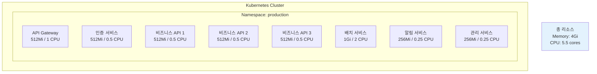
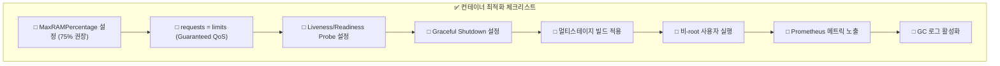

# 05. 컨테이너 환경 최적화

> **핵심 목표**: Docker/Kubernetes 환경에서 JVM이 컨테이너 리소스를 올바르게 인식하고 효율적으로 사용하도록 설정

---

## 1. JVM의 컨테이너 인식

### 1.1 문제 상황 이해

과거 JVM은 컨테이너의 리소스 제한을 인식하지 못하고 **호스트 전체 리소스**를 기준으로 동작했습니다. 예를 들어, 32GB 메모리 호스트에서 512MB 제한 컨테이너를 실행하면:



### 1.2 Java 17+에서의 컨테이너 지원

Java 10부터 컨테이너 인식이 기본 활성화되었고, Java 17에서 더욱 개선되었습니다:

```bash
# 컨테이너 인식 확인 (기본 활성화)
java -XX:+PrintFlagsFinal -version | grep -i container

# 컨테이너가 인식한 리소스 확인
java -XshowSettings:system -version
```

출력 예시:
```
Operating System Metrics:
    Provider: cgroupv2
    Memory Limit: 512.00M
    CPU Shares: 1024
    CPU Quota: 100000
    CPU Period: 100000
```

---

## 2. 메모리 설정 전략

### 2.1 비율 기반 설정 (권장)

절대값 대신 **컨테이너 메모리의 비율**로 설정하면 컨테이너 리사이즈에 자동 적응합니다:

```bash
# 권장 설정
java -XX:MaxRAMPercentage=75.0 \
     -XX:InitialRAMPercentage=50.0 \
     -XX:MinRAMPercentage=50.0 \
     -jar application.jar
```



### 2.2 메모리 구성 요소별 설정

```yaml
# Dockerfile 또는 K8s 환경변수
JAVA_OPTS: >-
  -XX:MaxRAMPercentage=75.0
  -XX:InitialRAMPercentage=50.0
  -XX:MaxMetaspaceSize=128m
  -Xss512k
  -XX:ReservedCodeCacheSize=64m
  -XX:+UseStringDeduplication
```

### 2.3 메모리 계산 가이드

| 컨테이너 메모리 | MaxRAMPercentage | 예상 힙 | Non-Heap 여유 |
|:--------------:|:----------------:|:-------:|:-------------:|
| 256MB | 60% | 153MB | 103MB |
| 512MB | 70% | 358MB | 154MB |
| 1GB | 75% | 768MB | 256MB |
| 2GB | 75% | 1.5GB | 512MB |
| 4GB | 80% | 3.2GB | 800MB |

---

## 3. CPU 설정 전략

### 3.1 CPU 제한과 JVM

JVM은 CPU 제한을 **GC 스레드 수**와 **JIT 컴파일러 스레드 수** 결정에 사용합니다:



### 3.2 CPU 관련 JVM 옵션

```bash
# CPU 제한 환경에서의 권장 설정
java -XX:ActiveProcessorCount=2 \         # 명시적 CPU 수 지정
     -XX:ParallelGCThreads=2 \            # GC 스레드 수
     -XX:ConcGCThreads=1 \                # 동시 GC 스레드 수
     -XX:CICompilerCount=2 \              # JIT 컴파일러 스레드
     -jar application.jar
```

### 3.3 CPU 할당 권장사항

| 모듈 유형 | 권장 CPU | 이유 |
|----------|:--------:|------|
| API Gateway | 1-2 core | I/O 위주, 동시성 필요 |
| 비즈니스 API | 0.5-1 core | 일반 워크로드 |
| 배치 처리 | 2-4 core | CPU 집약적 |
| 알림 서비스 | 0.5 core | 저부하 |

---

## 4. Kubernetes 설정

### 4.1 리소스 요청과 제한

```yaml
apiVersion: apps/v1
kind: Deployment
metadata:
  name: my-spring-app
spec:
  template:
    spec:
      containers:
      - name: app
        image: my-spring-app:latest
        resources:
          requests:
            memory: "512Mi"    # 최소 보장
            cpu: "250m"        # 0.25 core
          limits:
            memory: "512Mi"    # 최대 제한 (requests와 동일 권장)
            cpu: "1000m"       # 1 core
        env:
        - name: JAVA_OPTS
          value: >-
            -XX:MaxRAMPercentage=75.0
            -XX:InitialRAMPercentage=50.0
            -XX:+UseG1GC
            -Xss512k
```

### 4.2 QoS 클래스 이해



**권장**: 프로덕션에서는 **Guaranteed QoS** (requests = limits) 사용

### 4.3 Liveness & Readiness Probe

```yaml
containers:
- name: app
  livenessProbe:
    httpGet:
      path: /actuator/health/liveness
      port: 8080
    initialDelaySeconds: 60      # Spring Boot 시작 시간 고려
    periodSeconds: 10
    failureThreshold: 3
    
  readinessProbe:
    httpGet:
      path: /actuator/health/readiness
      port: 8080
    initialDelaySeconds: 30
    periodSeconds: 5
    failureThreshold: 3
```

### 4.4 Graceful Shutdown

```yaml
# application.yml
server:
  shutdown: graceful

spring:
  lifecycle:
    timeout-per-shutdown-phase: 30s
```

```yaml
# Kubernetes Deployment
spec:
  template:
    spec:
      terminationGracePeriodSeconds: 60
      containers:
      - name: app
        lifecycle:
          preStop:
            exec:
              command: ["sh", "-c", "sleep 10"]  # 트래픽 중단 대기
```

---

## 5. Docker 이미지 최적화

### 5.1 멀티스테이지 빌드

```dockerfile
# Stage 1: 빌드
FROM eclipse-temurin:17-jdk-jammy AS builder
WORKDIR /app
COPY ../../../../../../../../Downloads .
RUN ./mvnw package -DskipTests

# Stage 2: 런타임 (JRE만)
FROM eclipse-temurin:17-jre-jammy
WORKDIR /app

# 비-root 사용자
RUN useradd -r -u 1001 -g root appuser
USER appuser

COPY --from=builder /app/target/*.jar app.jar

# JVM 옵션
ENV JAVA_OPTS="-XX:MaxRAMPercentage=75.0 -XX:+UseG1GC -Xss512k"

EXPOSE 8080
ENTRYPOINT ["sh", "-c", "java $JAVA_OPTS -jar app.jar"]
```

### 5.2 레이어 캐싱 최적화

```dockerfile
FROM eclipse-temurin:17-jre-jammy AS builder
WORKDIR /app
COPY target/*.jar app.jar

# Spring Boot 레이어 추출
RUN java -Djarmode=layertools -jar app.jar extract

FROM eclipse-temurin:17-jre-jammy
WORKDIR /app
RUN useradd -r -u 1001 -g root appuser
USER appuser

# 레이어별 복사 (변경 빈도 순)
COPY --from=builder /app/dependencies/ ./
COPY --from=builder /app/spring-boot-loader/ ./
COPY --from=builder /app/snapshot-dependencies/ ./
COPY --from=builder /app/application/ ./

ENV JAVA_OPTS="-XX:MaxRAMPercentage=75.0 -XX:+UseG1GC"
EXPOSE 8080
ENTRYPOINT ["sh", "-c", "java $JAVA_OPTS org.springframework.boot.loader.JarLauncher"]
```

### 5.3 이미지 크기 비교

```mermaid
bar chart
    title "Docker 이미지 크기 비교"
    x-axis "이미지 유형"
    y-axis "크기 (MB)" 0 --> 500
    bar "JDK + Fat JAR" 450
    bar "JRE + Fat JAR" 280
    bar "JRE + Layered" 280
    bar "Distroless + JAR" 220
    bar "Native Image" 80
```

---

## 6. 모니터링 설정

### 6.1 Prometheus + Micrometer

```yaml
# application.yml
management:
  endpoints:
    web:
      exposure:
        include: health,info,prometheus,metrics
  metrics:
    tags:
      application: ${spring.application.name}
    export:
      prometheus:
        enabled: true
```

### 6.2 핵심 메트릭



### 6.3 Grafana 대시보드 쿼리 예시

```promql
# 힙 사용률
(jvm_memory_used_bytes{area="heap"} / jvm_memory_max_bytes{area="heap"}) * 100

# GC Pause Time P99
histogram_quantile(0.99, rate(jvm_gc_pause_seconds_bucket[5m]))

# HTTP 요청 처리량
rate(http_server_requests_seconds_count[1m])

# 오류율
rate(http_server_requests_seconds_count{status=~"5.."}[5m]) 
/ rate(http_server_requests_seconds_count[5m]) * 100
```

---

## 7. 8개 모듈 배포 구성 예시

### 7.1 전체 아키텍처



### 7.2 모듈별 리소스 설정

| 모듈 | Memory | CPU Request | CPU Limit | Replicas |
|------|:------:|:-----------:|:---------:|:--------:|
| API Gateway | 512Mi | 500m | 1000m | 2 |
| 인증 서비스 | 512Mi | 250m | 500m | 2 |
| 비즈니스 API (×3) | 512Mi | 250m | 500m | 각 2 |
| 배치 서비스 | 1Gi | 1000m | 2000m | 1 |
| 알림 서비스 | 256Mi | 100m | 250m | 2 |
| 관리 서비스 | 256Mi | 100m | 250m | 1 |

---

## 8. 체크리스트



---

## 9. 면접 대비 핵심 포인트

### Q1: "컨테이너에서 JVM 힙을 어떻게 설정하나요?"

> "컨테이너 환경에서는 **비율 기반 설정**을 권장합니다. `-XX:MaxRAMPercentage=75.0`으로 설정하면 JVM이 컨테이너 메모리 제한을 자동으로 인식하고 그 75%를 최대 힙으로 사용합니다.
>
> 절대값 `-Xmx`를 사용하면 컨테이너 리소스가 변경될 때마다 설정을 수정해야 합니다. 또한 100%로 설정하면 안 되는 이유는 JVM이 힙 외에도 **Metaspace, Thread Stack, Code Cache** 등 Non-Heap 메모리를 사용하기 때문입니다. 약 20-25%의 여유를 두어 OOMKilled를 방지해야 합니다."

### Q2: "Kubernetes QoS 클래스와 JVM의 관계는?"

> "Kubernetes의 QoS 클래스는 노드의 메모리 압박 시 **어떤 Pod을 먼저 종료할지** 결정합니다. **Guaranteed 클래스**(requests = limits)가 가장 안전하고, **BestEffort**(설정 없음)가 가장 먼저 종료됩니다.
>
> JVM 애플리케이션은 메모리 사용량이 상대적으로 예측 가능하므로, **requests와 limits를 동일하게 설정**하여 Guaranteed QoS를 얻는 것을 권장합니다. 이렇게 하면 OOMKilled 위험이 줄어들고, JVM도 정확한 리소스 제한을 인식하여 적절한 힙 크기를 설정할 수 있습니다."

---

## 10. 다음 단계

- **[06-poc-plan.md](./06-poc-plan.md)**: 전체 최적화 POC 계획 및 벤치마크
