# 06. POC 계획 및 벤치마크 가이드

> **핵심 목표**: 체계적인 검증을 통해 최적화 효과를 정량적으로 측정하고, 안전한 운영 환경 적용을 위한 근거 확보

---

## 1. POC 개요

### 1.1 왜 POC가 필요한가?

최적화 기법의 효과는 **애플리케이션 특성에 따라 크게 다릅니다**. 벤치마크 자료에서 "30% 개선"이라고 해도 우리 환경에서 동일한 결과를 보장하지 않습니다. 따라서 운영 환경 적용 전 반드시 POC를 통해 검증해야 합니다.

> "측정하지 않으면 개선할 수 없다" - Peter Drucker

### 1.2 POC 범위 및 일정

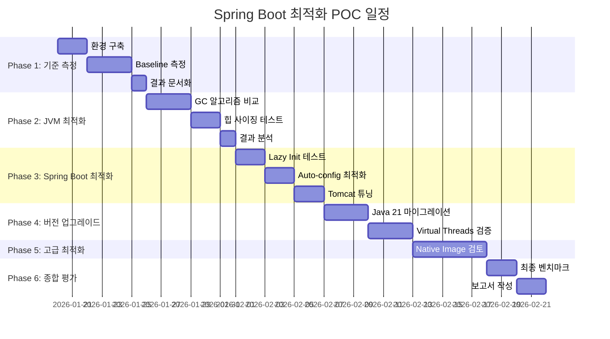

---

## 2. 테스트 환경 구성

### 2.1 테스트 인프라

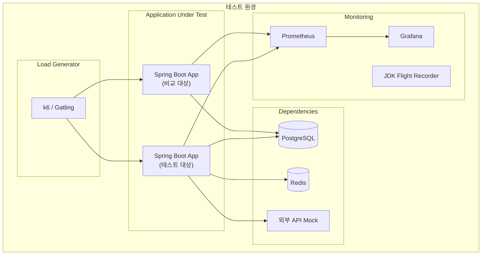

### 2.2 테스트 대상 애플리케이션 사양

| 항목 | 사양 | 비고 |
|------|------|------|
| Framework | Spring Boot 3.2.3 | 현재 버전 |
| Java | 17 → 21 | 비교 테스트 |
| Database | MySQL 8.0 / MariaDB 10.6 | HikariCP 연동 |
| ORM | MyBatis 3.5.x | XML Mapper 사용 |
| 서버 | Embedded Tomcat | 기본 설정 기준 |

### 2.3 컨테이너 리소스 구성

```yaml
# docker-compose.yml (테스트용)
version: '3.8'
services:
  app-baseline:
    image: spring-boot-app:baseline
    deploy:
      resources:
        limits:
          cpus: '1.0'
          memory: 512M
    environment:
      - JAVA_OPTS=-XX:MaxRAMPercentage=75.0
    ports:
      - "8081:8080"
  
  app-optimized:
    image: spring-boot-app:optimized
    deploy:
      resources:
        limits:
          cpus: '1.0'
          memory: 512M
    environment:
      - JAVA_OPTS=-XX:MaxRAMPercentage=75.0 -XX:+UseG1GC
    ports:
      - "8082:8080"
  
  prometheus:
    image: prom/prometheus:latest
    volumes:
      - ./prometheus.yml:/etc/prometheus/prometheus.yml
    ports:
      - "9090:9090"
  
  grafana:
    image: grafana/grafana:latest
    ports:
      - "3000:3000"
```

---

## 3. 측정 지표 정의

### 3.1 핵심 성능 지표 (KPI)

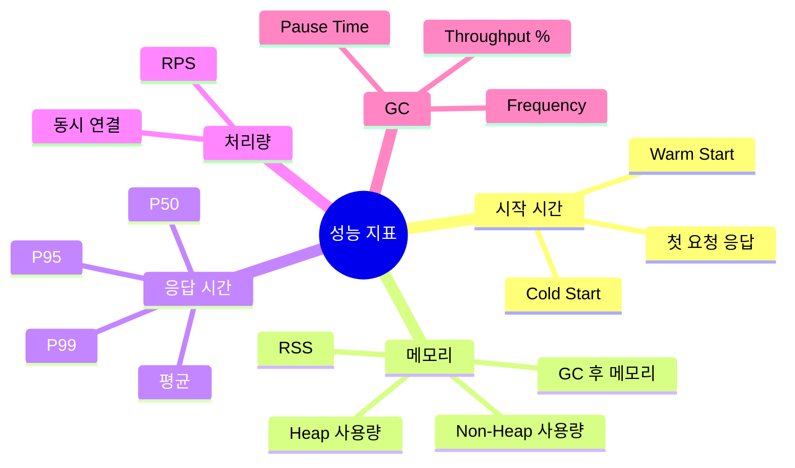

### 3.2 측정 방법론

| 지표 | 측정 도구 | 수집 방법 | 목표값 |
|------|----------|----------|--------|
| 시작 시간 | 로그 타임스탬프 | ApplicationReadyEvent | < 5초 |
| 힙 사용량 | Micrometer + Prometheus | jvm_memory_used_bytes | < 400MB |
| 응답 시간 P99 | k6 / Gatling | HTTP 메트릭 | < 200ms |
| 처리량 | k6 / Gatling | RPS | > 500 req/s |
| GC Pause | JFR / GC 로그 | gc_pause_seconds | < 100ms |

---

## 4. Phase별 상세 테스트 계획

### 4.1 Phase 1: Baseline 측정

**목적**: 현재 상태의 성능 기준선 확립

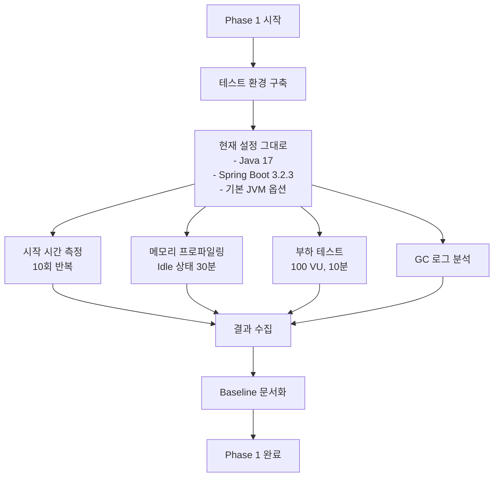

#### 시작 시간 측정 스크립트

```bash
#!/bin/bash
# measure-startup.sh

APP_JAR="target/my-app.jar"
RESULT_FILE="baseline-startup.csv"

echo "run,startup_ms,first_request_ms" > $RESULT_FILE

for i in {1..10}; do
    echo "Run $i..."
    
    # 애플리케이션 시작 (백그라운드)
    START_TIME=$(date +%s%N)
    java -jar $APP_JAR &
    APP_PID=$!
    
    # ApplicationReadyEvent 대기
    while ! curl -s http://localhost:8080/actuator/health > /dev/null 2>&1; do
        sleep 0.1
    done
    READY_TIME=$(date +%s%N)
    
    # 첫 번째 API 요청
    curl -s http://localhost:8080/api/test > /dev/null
    FIRST_REQ_TIME=$(date +%s%N)
    
    # 계산
    STARTUP_MS=$(( ($READY_TIME - $START_TIME) / 1000000 ))
    FIRST_REQ_MS=$(( ($FIRST_REQ_TIME - $START_TIME) / 1000000 ))
    
    echo "$i,$STARTUP_MS,$FIRST_REQ_MS" >> $RESULT_FILE
    
    # 정리
    kill $APP_PID
    sleep 2
done

echo "Results saved to $RESULT_FILE"
```

#### 부하 테스트 스크립트 (k6)

```javascript
// load-test.js
import http from 'k6/http';
import { check, sleep } from 'k6';
import { Rate, Trend } from 'k6/metrics';

const errorRate = new Rate('errors');
const responseTime = new Trend('response_time');

export const options = {
    stages: [
        { duration: '1m', target: 50 },   // Ramp-up
        { duration: '5m', target: 100 },  // Steady state
        { duration: '2m', target: 200 },  // Peak
        { duration: '1m', target: 100 },  // Ramp-down
        { duration: '1m', target: 0 },    // Cool-down
    ],
    thresholds: {
        http_req_duration: ['p(95)<200', 'p(99)<500'],
        errors: ['rate<0.01'],
    },
};

export default function () {
    const BASE_URL = __ENV.BASE_URL || 'http://localhost:8080';
    
    // API 호출 시나리오
    const responses = http.batch([
        ['GET', `${BASE_URL}/api/users/1`],
        ['GET', `${BASE_URL}/api/orders?page=1&size=10`],
        ['POST', `${BASE_URL}/api/orders`, JSON.stringify({
            userId: 1,
            items: [{ productId: 1, quantity: 2 }]
        }), { headers: { 'Content-Type': 'application/json' } }],
    ]);
    
    responses.forEach(res => {
        const success = check(res, {
            'status is 200': (r) => r.status === 200,
            'response time < 500ms': (r) => r.timings.duration < 500,
        });
        
        errorRate.add(!success);
        responseTime.add(res.timings.duration);
    });
    
    sleep(1);
}
```

---

### 4.2 Phase 2: JVM 최적화 테스트

**목적**: 최적의 GC 알고리즘과 힙 크기 결정

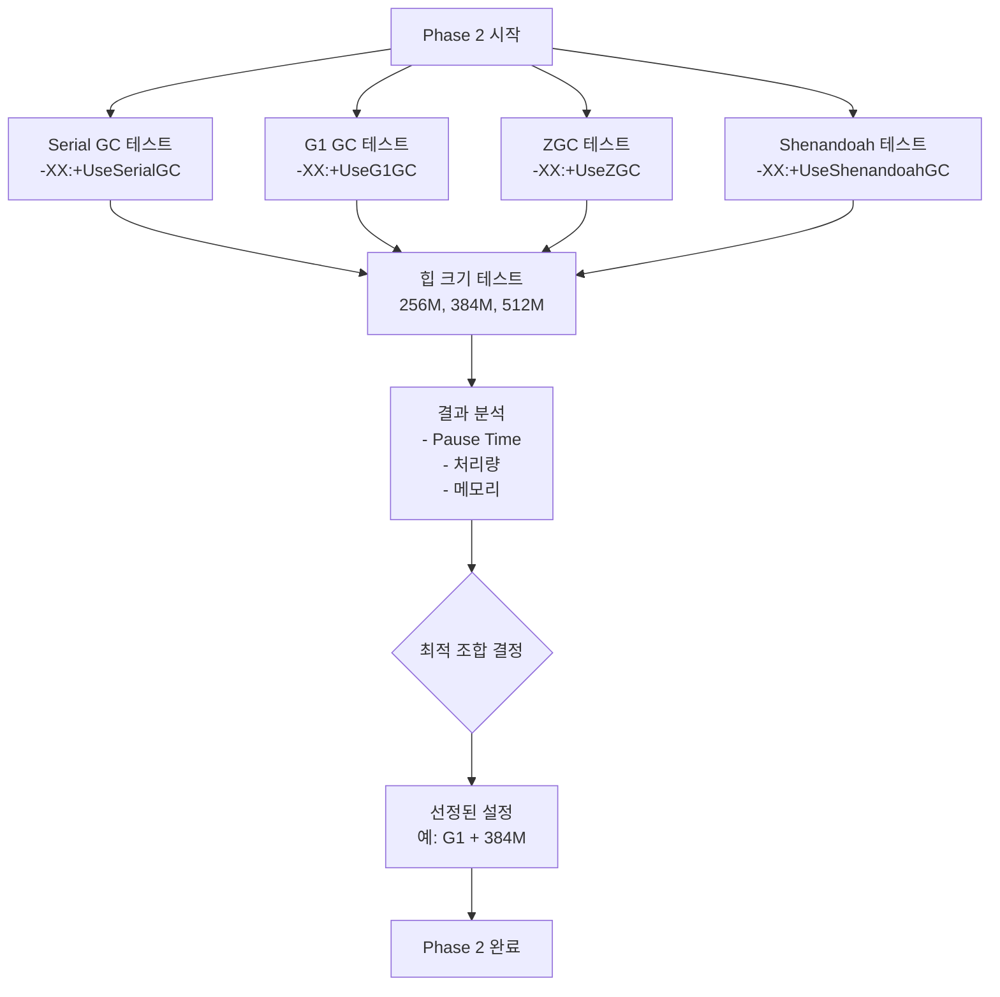

#### GC 비교 테스트 매트릭스

| 테스트 ID | GC | Heap | 부하 패턴 | 측정 항목 |
|-----------|-----|------|-----------|-----------|
| GC-01 | Serial | 256M | Steady | Pause, Memory |
| GC-02 | Serial | 384M | Steady | Pause, Memory |
| GC-03 | G1 | 256M | Steady | Pause, Memory |
| GC-04 | G1 | 384M | Steady | Pause, Memory |
| GC-05 | G1 | 512M | Steady | Pause, Memory |
| GC-06 | ZGC | 384M | Steady | Pause, Memory |
| GC-07 | ZGC | 512M | Steady | Pause, Memory |
| GC-08 | G1 | 384M | Spike | Pause, Recovery |
| GC-09 | ZGC | 512M | Spike | Pause, Recovery |

#### JVM 옵션 템플릿

```bash
# gc-options-serial.sh
JAVA_OPTS="-XX:+UseSerialGC \
           -Xms256m -Xmx256m \
           -Xss512k \
           -Xlog:gc*:file=gc-serial.log:time,uptime:filecount=5,filesize=10m"

# gc-options-g1.sh
JAVA_OPTS="-XX:+UseG1GC \
           -XX:MaxGCPauseMillis=100 \
           -Xms384m -Xmx384m \
           -Xss512k \
           -Xlog:gc*:file=gc-g1.log:time,uptime:filecount=5,filesize=10m"

# gc-options-zgc.sh (Java 21)
JAVA_OPTS="-XX:+UseZGC \
           -XX:+ZGenerational \
           -Xms512m -Xmx512m \
           -Xss512k \
           -Xlog:gc*:file=gc-zgc.log:time,uptime:filecount=5,filesize=10m"
```

---

### 4.3 Phase 3: Spring Boot 최적화 테스트

**목적**: 애플리케이션 레벨 최적화 효과 검증

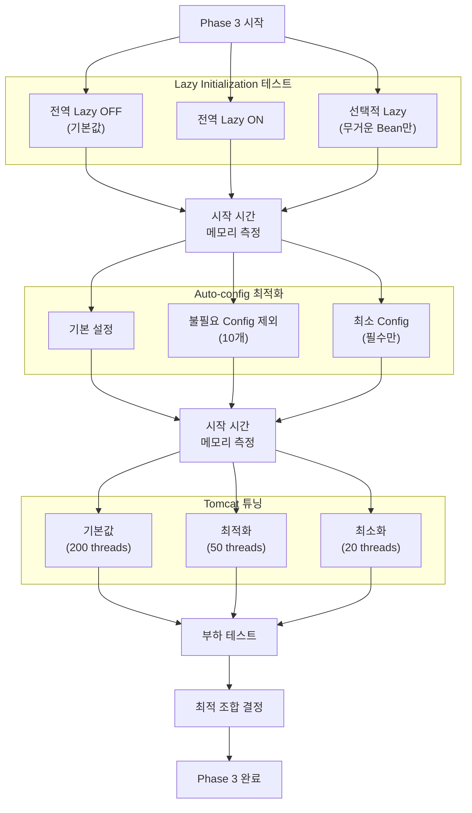

#### 테스트 설정 파일

```yaml
# application-baseline.yml (기준)
spring:
  main:
    lazy-initialization: false

server:
  tomcat:
    threads:
      max: 200
      min-spare: 10

---
# application-optimized.yml (최적화)
spring:
  main:
    lazy-initialization: true
  autoconfigure:
    exclude:
      - org.springframework.boot.autoconfigure.security.servlet.SecurityAutoConfiguration
      - org.springframework.boot.autoconfigure.mail.MailSenderAutoConfiguration
      - org.springframework.boot.autoconfigure.quartz.QuartzAutoConfiguration
      - org.springframework.boot.autoconfigure.flyway.FlywayAutoConfiguration
      - org.springframework.boot.autoconfigure.liquibase.LiquibaseAutoConfiguration

server:
  tomcat:
    threads:
      max: 50
      min-spare: 5
    max-connections: 200
    accept-count: 100
```

---

### 4.4 Phase 4: Java 21 + Virtual Threads 테스트

**목적**: 버전 업그레이드 효과 및 Virtual Threads 검증

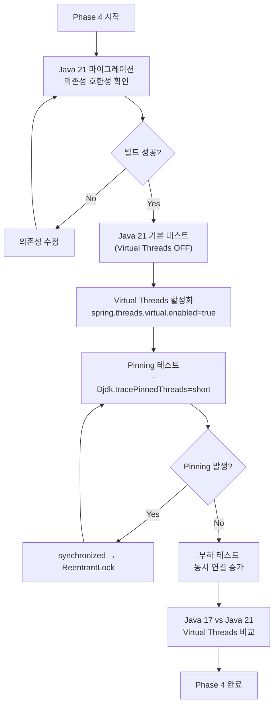

#### Virtual Threads 활성화 검증

```java
// VirtualThreadsVerificationTest.java
@SpringBootTest
class VirtualThreadsVerificationTest {
    
    @Autowired
    private ApplicationContext context;
    
    @Test
    void verifyVirtualThreadsEnabled() {
        // Tomcat Executor 확인
        TomcatServletWebServerFactory factory = 
            context.getBean(TomcatServletWebServerFactory.class);
        
        // 실제 스레드가 Virtual인지 확인
        Thread currentThread = Thread.currentThread();
        System.out.println("Is Virtual: " + currentThread.isVirtual());
        
        // Platform Thread 대비 메모리 확인
        Runtime runtime = Runtime.getRuntime();
        long usedMemory = runtime.totalMemory() - runtime.freeMemory();
        System.out.println("Used Memory: " + usedMemory / 1024 / 1024 + " MB");
    }
    
    @Test
    void loadTestWithVirtualThreads() throws Exception {
        int concurrentRequests = 1000;
        ExecutorService executor = Executors.newVirtualThreadPerTaskExecutor();
        
        CountDownLatch latch = new CountDownLatch(concurrentRequests);
        AtomicInteger successCount = new AtomicInteger(0);
        
        long startTime = System.currentTimeMillis();
        
        for (int i = 0; i < concurrentRequests; i++) {
            executor.submit(() -> {
                try {
                    // HTTP 요청 시뮬레이션
                    HttpClient client = HttpClient.newHttpClient();
                    HttpRequest request = HttpRequest.newBuilder()
                        .uri(URI.create("http://localhost:8080/api/test"))
                        .build();
                    
                    HttpResponse<String> response = 
                        client.send(request, HttpResponse.BodyHandlers.ofString());
                    
                    if (response.statusCode() == 200) {
                        successCount.incrementAndGet();
                    }
                } catch (Exception e) {
                    e.printStackTrace();
                } finally {
                    latch.countDown();
                }
            });
        }
        
        latch.await();
        long endTime = System.currentTimeMillis();
        
        System.out.println("Total time: " + (endTime - startTime) + " ms");
        System.out.println("Success rate: " + successCount.get() + "/" + concurrentRequests);
    }
}
```

---

### 4.5 Phase 5: GraalVM Native Image 테스트

**목적**: Native Image 적용 가능성 및 효과 검증

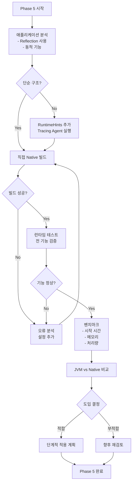

#### Native Image 빌드 및 테스트

```bash
#!/bin/bash
# native-image-test.sh

echo "=== Phase 5: Native Image Test ==="

# Step 1: Tracing Agent로 설정 수집
echo "Step 1: Running with Tracing Agent..."
java -agentlib:native-image-agent=config-output-dir=./native-config \
     -jar target/my-app.jar &
APP_PID=$!

sleep 30  # 워밍업

# 주요 API 호출하여 리플렉션 사용 경로 수집
curl http://localhost:8080/api/users
curl http://localhost:8080/api/orders
curl -X POST http://localhost:8080/api/orders \
     -H "Content-Type: application/json" \
     -d '{"userId":1,"items":[{"productId":1,"quantity":2}]}'

kill $APP_PID

# Step 2: Native Image 빌드
echo "Step 2: Building Native Image..."
./mvnw -Pnative native:compile -DskipTests

# Step 3: 시작 시간 측정
echo "Step 3: Measuring startup time..."
START=$(date +%s%N)
./target/my-app &
NATIVE_PID=$!

while ! curl -s http://localhost:8080/actuator/health > /dev/null 2>&1; do
    sleep 0.01
done
END=$(date +%s%N)

STARTUP_MS=$(( ($END - $START) / 1000000 ))
echo "Native Image Startup: ${STARTUP_MS}ms"

# Step 4: 메모리 측정
echo "Step 4: Measuring memory..."
sleep 10  # 안정화 대기
RSS=$(ps -o rss= -p $NATIVE_PID)
echo "Native Image RSS: $((RSS / 1024))MB"

# Step 5: 부하 테스트
echo "Step 5: Running load test..."
k6 run --env BASE_URL=http://localhost:8080 load-test.js

kill $NATIVE_PID
echo "=== Native Image Test Complete ==="
```

---

## 5. 결과 분석 템플릿

### 5.1 비교 결과 요약 템플릿

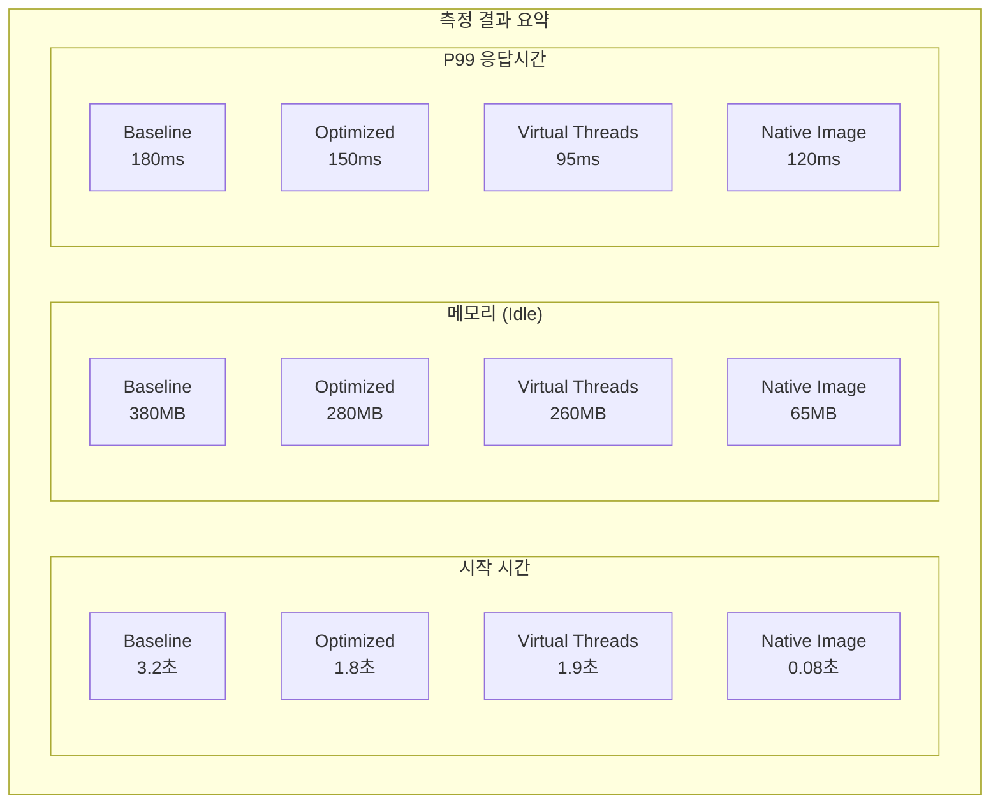

### 5.2 결과 기록 양식

```markdown
## POC 결과 보고서

### 1. 테스트 개요
- 테스트 일자: YYYY-MM-DD
- 테스트 환경: [환경 상세]
- 테스트 대상: [애플리케이션명]

### 2. Baseline 측정치
| 지표 | 값 | 비고 |
|------|-----|------|
| 시작 시간 | X.XX초 | 평균 (10회) |
| 메모리 (Idle) | XXX MB | RSS |
| P99 응답시간 | XXX ms | 100 VU 기준 |
| 최대 RPS | XXX req/s | |
| GC Pause (P99) | XX ms | |

### 3. 최적화 후 측정치
| 설정 | 시작시간 | 메모리 | P99 응답 | RPS |
|------|---------|--------|----------|-----|
| JVM 튜닝 | X.XX초 | XXX MB | XXX ms | XXX |
| Spring 튜닝 | X.XX초 | XXX MB | XXX ms | XXX |
| Virtual Threads | X.XX초 | XXX MB | XXX ms | XXX |
| Native Image | X.XX초 | XXX MB | XXX ms | XXX |

### 4. 개선율 요약
- 시작 시간: XX% 개선
- 메모리: XX% 절감
- 응답시간: XX% 개선

### 5. 권장 사항
[분석 기반 권장 설정 및 적용 계획]
```

---

## 6. 모니터링 대시보드 설정

### 6.1 Grafana 대시보드 구성

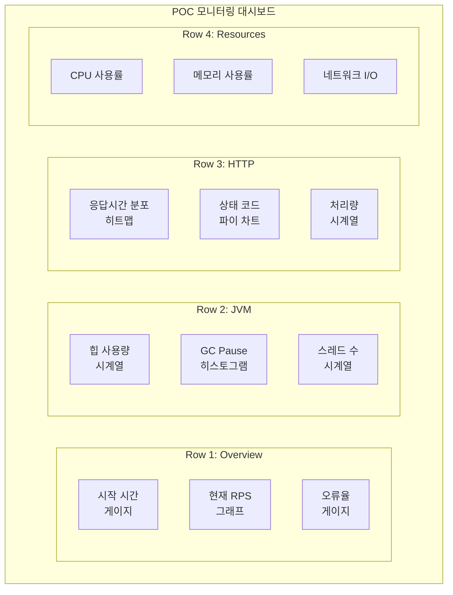

### 6.2 Prometheus 쿼리 모음

```yaml
# prometheus-queries.yml
panels:
  # 시작 시간 (Spring Boot)
  startup_time:
    query: application_started_time_seconds{application="$app"}
    
  # 힙 사용량
  heap_used:
    query: jvm_memory_used_bytes{area="heap", application="$app"}
    
  # GC Pause P99
  gc_pause_p99:
    query: histogram_quantile(0.99, rate(jvm_gc_pause_seconds_bucket{application="$app"}[5m]))
    
  # HTTP 응답시간 P99
  http_p99:
    query: histogram_quantile(0.99, rate(http_server_requests_seconds_bucket{application="$app"}[5m]))
    
  # RPS
  rps:
    query: rate(http_server_requests_seconds_count{application="$app"}[1m])
    
  # 오류율
  error_rate:
    query: |
      rate(http_server_requests_seconds_count{status=~"5..", application="$app"}[5m])
      / rate(http_server_requests_seconds_count{application="$app"}[5m]) * 100
    
  # CPU 사용률 (컨테이너)
  cpu_usage:
    query: rate(container_cpu_usage_seconds_total{container="$app"}[5m]) * 100
    
  # 메모리 사용률 (컨테이너)
  memory_usage:
    query: container_memory_usage_bytes{container="$app"} / container_spec_memory_limit_bytes{container="$app"} * 100
```

---

## 7. 체크리스트

### 7.1 POC 시작 전 체크리스트

```
□ 테스트 환경 격리 확인
□ 모니터링 도구 설치 및 설정
□ Baseline 애플리케이션 배포
□ 부하 테스트 스크립트 검증
□ 결과 기록 템플릿 준비
□ 롤백 계획 수립
```

### 7.2 각 Phase 완료 체크리스트

```
□ 모든 테스트 케이스 실행 완료
□ 결과 데이터 수집 및 저장
□ 이상 징후 분석 완료
□ 다음 Phase 진행 가능 여부 판단
□ 결과 문서화
```

---

## 8. 예상 결과 및 권장 사항

### 8.1 예상 개선 효과

```mermaid
bar chart
    title "예상 최적화 효과 (8개 모듈 기준)"
    x-axis ["시작 시간", "메모리", "응답시간", "동시 처리"]
    y-axis "개선율 (%)" 0 --> 100
    bar [35, 40, 25, 300]
```

### 8.2 단계별 권장 적용 순서

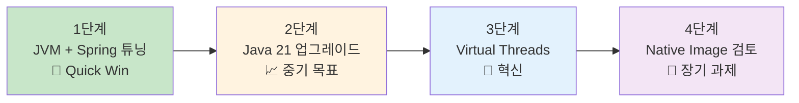

| 단계 | 예상 효과 | 소요 기간 | 위험도 |
|------|----------|----------|--------|
| 1단계 | 메모리 30%, 시작시간 40% 개선 | 1-2주 | 낮음 |
| 2단계 | 기반 마련, 새 기능 활용 가능 | 2-4주 | 중간 |
| 3단계 | 동시 처리 300%+, 메모리 30% 추가 절감 | 1-2주 | 낮음 |
| 4단계 | 시작시간 95%, 메모리 70% 절감 | 4-8주 | 높음 |

---

## 9. 다음 단계

POC 완료 후:

1. **결과 보고서 작성**: 정량적 데이터와 권장 사항 포함
2. **운영 환경 적용 계획 수립**: 단계적 롤아웃 전략
3. **모니터링 강화**: 운영 환경 메트릭 수집 체계 구축
4. **지속적 최적화**: 정기적인 성능 리뷰 프로세스 수립
