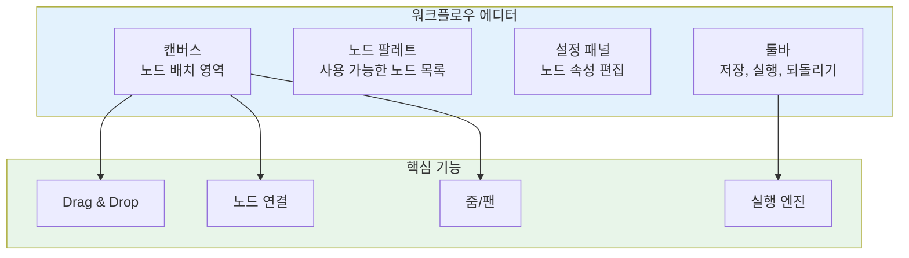
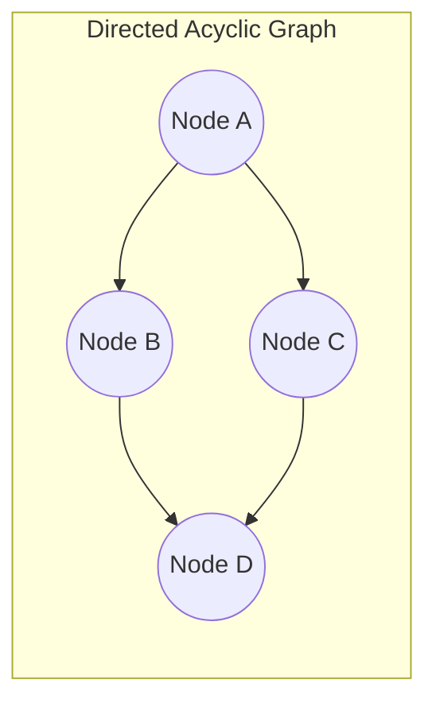
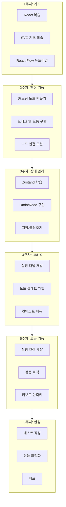

# React 워크플로우 에디터 구현 가이드

> n8n, Zapier 스타일의 노드 기반 비주얼 워크플로우 에디터를 React로 구현하기 위한 종합 학습 가이드

## 📚 목차

1. [개요](#1-개요)
2. [핵심 개념](#2-핵심-개념)
3. [React Flow 라이브러리](#3-react-flow-라이브러리)
4. [Drag & Drop 구현](#4-drag--drop-구현)
5. [상태 관리](#5-상태-관리)
6. [커스텀 노드 개발](#6-커스텀-노드-개발)
7. [고급 기능 구현](#7-고급-기능-구현)
8. [실전 프로젝트 구조](#8-실전-프로젝트-구조)
9. [학습 로드맵](#9-학습-로드맵)
10. [참고 자료](#10-참고-자료)

---

## 1. 개요

### 1.1 워크플로우 에디터란?

워크플로우 에디터는 사용자가 **시각적으로 프로세스를 설계**할 수 있는 도구입니다. 코드 없이 노드를 연결하여 복잡한 자동화 로직을 구성합니다.

```
┌─────────────────────────────────────────────────────────────────┐
│                    워크플로우 에디터 구성                         │
│  ┌──────────┐    ┌──────────┐    ┌──────────┐    ┌──────────┐  │
│  │ Trigger  │───▶│ Process  │───▶│ Decision │───▶│  Action  │  │
│  │  (시작)   │    │  (처리)   │    │  (분기)   │    │  (실행)   │  │
│  └──────────┘    └──────────┘    └──────────┘    └──────────┘  │
│       │                              │                          │
│       │                              ▼                          │
│       │                         ┌──────────┐                    │
│       │                         │  Output  │                    │
│       │                         │  (출력)   │                    │
│       │                         └──────────┘                    │
└─────────────────────────────────────────────────────────────────┘
```

### 1.2 대표적인 워크플로우 에디터

| 서비스 | 특징 | 기술 스택 |
|--------|------|----------|
| **n8n** | 오픈소스, 셀프호스팅 | Vue.js, TypeScript |
| **Zapier** | SaaS, 5000+ 앱 연동 | React |
| **Node-RED** | IoT 특화 | jQuery, D3.js |
| **Retool Workflows** | 내부 도구 특화 | React |
| **Activepieces** | n8n 대안, 오픈소스 | React, React Flow |

### 1.3 핵심 구성 요소



---

## 2. 핵심 개념

### 2.1 그래프 자료구조

워크플로우는 본질적으로 **방향성 비순환 그래프(DAG: Directed Acyclic Graph)**입니다.



#### 기본 데이터 구조

```typescript
// 노드 정의
interface Node {
  id: string;
  type: string;           // 'trigger' | 'action' | 'condition' 등
  position: {
    x: number;
    y: number;
  };
  data: {
    label: string;
    config: Record<string, any>;  // 노드별 설정
  };
}

// 엣지(연결선) 정의
interface Edge {
  id: string;
  source: string;         // 시작 노드 ID
  target: string;         // 도착 노드 ID
  sourceHandle?: string;  // 시작 포트 ID
  targetHandle?: string;  // 도착 포트 ID
}

// 워크플로우 전체 상태
interface Workflow {
  id: string;
  name: string;
  nodes: Node[];
  edges: Edge[];
  viewport: {
    x: number;
    y: number;
    zoom: number;
  };
}
```

#### 그래프 순회 알고리즘

```typescript
// 위상 정렬 (Topological Sort)
// 워크플로우 실행 순서를 결정하는 핵심 알고리즘
function topologicalSort(nodes: Node[], edges: Edge[]): Node[] {
  const inDegree = new Map<string, number>();
  const adjacency = new Map<string, string[]>();

  // 초기화
  nodes.forEach(node => {
    inDegree.set(node.id, 0);
    adjacency.set(node.id, []);
  });

  // 진입 차수 계산
  edges.forEach(edge => {
    inDegree.set(edge.target, (inDegree.get(edge.target) || 0) + 1);
    adjacency.get(edge.source)?.push(edge.target);
  });

  // 진입 차수가 0인 노드부터 시작
  const queue = nodes.filter(n => inDegree.get(n.id) === 0);
  const result: Node[] = [];

  while (queue.length > 0) {
    const node = queue.shift()!;
    result.push(node);

    adjacency.get(node.id)?.forEach(targetId => {
      inDegree.set(targetId, (inDegree.get(targetId) || 0) - 1);
      if (inDegree.get(targetId) === 0) {
        const targetNode = nodes.find(n => n.id === targetId);
        if (targetNode) queue.push(targetNode);
      }
    });
  }

  // 사이클 검사
  if (result.length !== nodes.length) {
    throw new Error('워크플로우에 순환 참조가 있습니다');
  }

  return result;
}
```

### 2.2 좌표계와 뷰포트

```
┌─────────────────────────────────────────────────────────────┐
│                     Screen Coordinates                       │
│   (0,0) ────────────────────────────────────────────────▶   │
│     │                                                        │
│     │    ┌─────────────────────────────────────┐            │
│     │    │         Viewport (보이는 영역)        │            │
│     │    │   ┌───────────────────────────┐     │            │
│     │    │   │                           │     │            │
│     │    │   │    Canvas Coordinates     │     │            │
│     │    │   │    (무한한 작업 공간)        │     │            │
│     │    │   │                           │     │            │
│     │    │   └───────────────────────────┘     │            │
│     │    │                                     │            │
│     │    └─────────────────────────────────────┘            │
│     ▼                                                        │
└─────────────────────────────────────────────────────────────┘
```

```typescript
// 화면 좌표 → 캔버스 좌표 변환
function screenToCanvas(
  screenX: number,
  screenY: number,
  viewport: { x: number; y: number; zoom: number }
): { x: number; y: number } {
  return {
    x: (screenX - viewport.x) / viewport.zoom,
    y: (screenY - viewport.y) / viewport.zoom,
  };
}

// 캔버스 좌표 → 화면 좌표 변환
function canvasToScreen(
  canvasX: number,
  canvasY: number,
  viewport: { x: number; y: number; zoom: number }
): { x: number; y: number } {
  return {
    x: canvasX * viewport.zoom + viewport.x,
    y: canvasY * viewport.zoom + viewport.y,
  };
}
```

### 2.3 SVG vs Canvas

| 특성 | SVG | Canvas |
|------|-----|--------|
| **렌더링 방식** | DOM 기반 벡터 | 비트맵 픽셀 |
| **이벤트 처리** | 요소별 이벤트 가능 | 전체 캔버스에서 계산 필요 |
| **성능 (소규모)** | 우수 | 우수 |
| **성능 (대규모)** | DOM 수 증가시 저하 | 우수 |
| **확대/축소** | 품질 유지 | 흐려짐 (재렌더링 필요) |
| **적합한 용도** | 노드 100개 이하 | 대규모 데이터 시각화 |

**React Flow는 SVG 기반**이며, 대부분의 워크플로우 에디터에 적합합니다.

---

## 3. React Flow 라이브러리

### 3.1 설치 및 기본 설정

```bash
# 설치
npm install reactflow

# TypeScript 프로젝트
npm install reactflow @types/react
```

### 3.2 기본 사용법

```tsx
// BasicFlow.tsx
import { useCallback } from 'react';
import ReactFlow, {
  Node,
  Edge,
  Controls,
  Background,
  MiniMap,
  Connection,
  addEdge,
  useNodesState,
  useEdgesState,
  BackgroundVariant,
} from 'reactflow';
import 'reactflow/dist/style.css';

// 초기 노드
const initialNodes: Node[] = [
  {
    id: '1',
    type: 'input',
    position: { x: 250, y: 0 },
    data: { label: 'Start' },
  },
  {
    id: '2',
    position: { x: 100, y: 100 },
    data: { label: 'Process A' },
  },
  {
    id: '3',
    position: { x: 400, y: 100 },
    data: { label: 'Process B' },
  },
  {
    id: '4',
    type: 'output',
    position: { x: 250, y: 200 },
    data: { label: 'End' },
  },
];

// 초기 엣지
const initialEdges: Edge[] = [
  { id: 'e1-2', source: '1', target: '2' },
  { id: 'e1-3', source: '1', target: '3' },
  { id: 'e2-4', source: '2', target: '4' },
  { id: 'e3-4', source: '3', target: '4' },
];

export default function BasicFlow() {
  const [nodes, setNodes, onNodesChange] = useNodesState(initialNodes);
  const [edges, setEdges, onEdgesChange] = useEdgesState(initialEdges);

  // 새로운 연결이 생성될 때
  const onConnect = useCallback(
    (connection: Connection) => {
      setEdges((eds) => addEdge(connection, eds));
    },
    [setEdges]
  );

  return (
    <div style={{ width: '100%', height: '600px' }}>
      <ReactFlow
        nodes={nodes}
        edges={edges}
        onNodesChange={onNodesChange}
        onEdgesChange={onEdgesChange}
        onConnect={onConnect}
        fitView
      >
        {/* 배경 그리드 */}
        <Background variant={BackgroundVariant.Dots} gap={12} size={1} />

        {/* 줌/이동 컨트롤 */}
        <Controls />

        {/* 미니맵 */}
        <MiniMap
          nodeStrokeColor={(n) => '#0041d0'}
          nodeColor={(n) => '#fff'}
          nodeBorderRadius={2}
        />
      </ReactFlow>
    </div>
  );
}
```

### 3.3 핵심 Hooks

```typescript
import {
  useNodesState,      // 노드 상태 관리
  useEdgesState,      // 엣지 상태 관리
  useReactFlow,       // React Flow 인스턴스 접근
  useNodes,           // 현재 노드 읽기 전용
  useEdges,           // 현재 엣지 읽기 전용
  useViewport,        // 뷰포트 상태
  useOnSelectionChange, // 선택 변경 감지
} from 'reactflow';

// useReactFlow 활용 예시
function FlowControls() {
  const {
    zoomIn,
    zoomOut,
    fitView,
    getNodes,
    getEdges,
    setCenter,
    project,  // 화면 좌표 → 캔버스 좌표
  } = useReactFlow();

  const handleExport = () => {
    const workflow = {
      nodes: getNodes(),
      edges: getEdges(),
    };
    console.log(JSON.stringify(workflow, null, 2));
  };

  return (
    <div className="controls">
      <button onClick={() => zoomIn()}>확대</button>
      <button onClick={() => zoomOut()}>축소</button>
      <button onClick={() => fitView()}>전체 보기</button>
      <button onClick={handleExport}>내보내기</button>
    </div>
  );
}
```

### 3.4 이벤트 핸들링

```tsx
<ReactFlow
  nodes={nodes}
  edges={edges}
  onNodesChange={onNodesChange}
  onEdgesChange={onEdgesChange}
  onConnect={onConnect}

  // 노드 이벤트
  onNodeClick={(event, node) => {
    console.log('노드 클릭:', node);
    setSelectedNode(node);
  }}
  onNodeDoubleClick={(event, node) => {
    console.log('노드 더블클릭:', node);
    openNodeEditor(node);
  }}
  onNodeDragStart={(event, node) => {
    console.log('드래그 시작:', node);
  }}
  onNodeDragStop={(event, node) => {
    console.log('드래그 종료:', node);
    saveNodePosition(node);
  }}
  onNodeContextMenu={(event, node) => {
    event.preventDefault();
    showContextMenu(event, node);
  }}

  // 엣지 이벤트
  onEdgeClick={(event, edge) => {
    console.log('엣지 클릭:', edge);
  }}
  onEdgeDoubleClick={(event, edge) => {
    deleteEdge(edge.id);
  }}

  // 패널(빈 공간) 이벤트
  onPaneClick={(event) => {
    setSelectedNode(null);
    closeContextMenu();
  }}

  // 연결 이벤트
  onConnectStart={(event, { nodeId, handleType }) => {
    console.log('연결 시작:', nodeId, handleType);
  }}
  onConnectEnd={(event) => {
    console.log('연결 종료');
  }}

  // 선택 이벤트
  onSelectionChange={({ nodes, edges }) => {
    console.log('선택 변경:', nodes, edges);
  }}
/>
```

---

## 4. Drag & Drop 구현

### 4.1 노드 팔레트에서 캔버스로 드래그

```tsx
// NodePalette.tsx - 노드 팔레트
const nodeTypes = [
  { type: 'trigger', label: '트리거', icon: '⚡' },
  { type: 'action', label: '액션', icon: '▶️' },
  { type: 'condition', label: '조건', icon: '🔀' },
  { type: 'delay', label: '지연', icon: '⏰' },
  { type: 'output', label: '출력', icon: '📤' },
];

function NodePalette() {
  const onDragStart = (event: React.DragEvent, nodeType: string) => {
    event.dataTransfer.setData('application/reactflow', nodeType);
    event.dataTransfer.effectAllowed = 'move';
  };

  return (
    <aside className="node-palette">
      <h3>노드</h3>
      <div className="node-list">
        {nodeTypes.map((node) => (
          <div
            key={node.type}
            className="palette-node"
            draggable
            onDragStart={(e) => onDragStart(e, node.type)}
          >
            <span className="icon">{node.icon}</span>
            <span className="label">{node.label}</span>
          </div>
        ))}
      </div>
    </aside>
  );
}
```

```tsx
// WorkflowCanvas.tsx - 캔버스에서 드롭 처리
import { useCallback, useRef } from 'react';
import ReactFlow, { useReactFlow } from 'reactflow';

function WorkflowCanvas() {
  const reactFlowWrapper = useRef<HTMLDivElement>(null);
  const { project } = useReactFlow();
  const [nodes, setNodes, onNodesChange] = useNodesState([]);
  const [edges, setEdges, onEdgesChange] = useEdgesState([]);

  // 드래그 오버 허용
  const onDragOver = useCallback((event: React.DragEvent) => {
    event.preventDefault();
    event.dataTransfer.dropEffect = 'move';
  }, []);

  // 드롭 처리
  const onDrop = useCallback(
    (event: React.DragEvent) => {
      event.preventDefault();

      const type = event.dataTransfer.getData('application/reactflow');
      if (!type || !reactFlowWrapper.current) return;

      // 화면 좌표를 캔버스 좌표로 변환
      const reactFlowBounds = reactFlowWrapper.current.getBoundingClientRect();
      const position = project({
        x: event.clientX - reactFlowBounds.left,
        y: event.clientY - reactFlowBounds.top,
      });

      // 새 노드 생성
      const newNode = {
        id: `${type}-${Date.now()}`,
        type,
        position,
        data: {
          label: `${type} node`,
          config: getDefaultConfig(type),
        },
      };

      setNodes((nds) => [...nds, newNode]);
    },
    [project, setNodes]
  );

  return (
    <div ref={reactFlowWrapper} style={{ width: '100%', height: '100%' }}>
      <ReactFlow
        nodes={nodes}
        edges={edges}
        onNodesChange={onNodesChange}
        onEdgesChange={onEdgesChange}
        onDragOver={onDragOver}
        onDrop={onDrop}
      >
        <Background />
        <Controls />
      </ReactFlow>
    </div>
  );
}
```

### 4.2 dnd-kit 통합 (고급)

더 세밀한 제어가 필요한 경우:

```bash
npm install @dnd-kit/core @dnd-kit/sortable @dnd-kit/utilities
```

```tsx
import {
  DndContext,
  DragOverlay,
  useSensor,
  useSensors,
  PointerSensor,
  KeyboardSensor,
} from '@dnd-kit/core';

function WorkflowEditor() {
  const [activeId, setActiveId] = useState<string | null>(null);

  const sensors = useSensors(
    useSensor(PointerSensor, {
      activationConstraint: {
        distance: 8, // 8px 이동 후 드래그 시작
      },
    }),
    useSensor(KeyboardSensor)
  );

  return (
    <DndContext
      sensors={sensors}
      onDragStart={({ active }) => setActiveId(active.id as string)}
      onDragEnd={handleDragEnd}
      onDragCancel={() => setActiveId(null)}
    >
      <div className="editor-layout">
        <NodePalette />
        <WorkflowCanvas />
        <SettingsPanel />
      </div>

      {/* 드래그 중 표시되는 오버레이 */}
      <DragOverlay>
        {activeId ? <NodePreview type={activeId} /> : null}
      </DragOverlay>
    </DndContext>
  );
}
```

---

## 5. 상태 관리

### 5.1 Zustand를 이용한 상태 관리

```bash
npm install zustand immer
```

```typescript
// stores/workflowStore.ts
import { create } from 'zustand';
import { immer } from 'zustand/middleware/immer';
import {
  Node,
  Edge,
  OnNodesChange,
  OnEdgesChange,
  applyNodeChanges,
  applyEdgeChanges,
} from 'reactflow';

interface WorkflowState {
  // 상태
  nodes: Node[];
  edges: Edge[];
  selectedNodeId: string | null;

  // 히스토리 (Undo/Redo)
  past: { nodes: Node[]; edges: Edge[] }[];
  future: { nodes: Node[]; edges: Edge[] }[];

  // 액션
  onNodesChange: OnNodesChange;
  onEdgesChange: OnEdgesChange;
  addNode: (node: Node) => void;
  updateNodeData: (nodeId: string, data: any) => void;
  deleteNode: (nodeId: string) => void;
  addEdge: (edge: Edge) => void;
  deleteEdge: (edgeId: string) => void;
  setSelectedNode: (nodeId: string | null) => void;

  // 히스토리 액션
  undo: () => void;
  redo: () => void;
  saveToHistory: () => void;

  // 직렬화
  exportWorkflow: () => string;
  importWorkflow: (json: string) => void;
}

export const useWorkflowStore = create<WorkflowState>()(
  immer((set, get) => ({
    nodes: [],
    edges: [],
    selectedNodeId: null,
    past: [],
    future: [],

    onNodesChange: (changes) => {
      set((state) => {
        state.nodes = applyNodeChanges(changes, state.nodes);
      });
    },

    onEdgesChange: (changes) => {
      set((state) => {
        state.edges = applyEdgeChanges(changes, state.edges);
      });
    },

    addNode: (node) => {
      get().saveToHistory();
      set((state) => {
        state.nodes.push(node);
      });
    },

    updateNodeData: (nodeId, data) => {
      get().saveToHistory();
      set((state) => {
        const node = state.nodes.find((n) => n.id === nodeId);
        if (node) {
          node.data = { ...node.data, ...data };
        }
      });
    },

    deleteNode: (nodeId) => {
      get().saveToHistory();
      set((state) => {
        state.nodes = state.nodes.filter((n) => n.id !== nodeId);
        // 연결된 엣지도 삭제
        state.edges = state.edges.filter(
          (e) => e.source !== nodeId && e.target !== nodeId
        );
        if (state.selectedNodeId === nodeId) {
          state.selectedNodeId = null;
        }
      });
    },

    addEdge: (edge) => {
      get().saveToHistory();
      set((state) => {
        // 중복 엣지 방지
        const exists = state.edges.some(
          (e) => e.source === edge.source && e.target === edge.target
        );
        if (!exists) {
          state.edges.push(edge);
        }
      });
    },

    deleteEdge: (edgeId) => {
      get().saveToHistory();
      set((state) => {
        state.edges = state.edges.filter((e) => e.id !== edgeId);
      });
    },

    setSelectedNode: (nodeId) => {
      set((state) => {
        state.selectedNodeId = nodeId;
      });
    },

    saveToHistory: () => {
      set((state) => {
        state.past.push({
          nodes: JSON.parse(JSON.stringify(state.nodes)),
          edges: JSON.parse(JSON.stringify(state.edges)),
        });
        state.future = []; // Redo 히스토리 초기화

        // 히스토리 제한 (최대 50개)
        if (state.past.length > 50) {
          state.past.shift();
        }
      });
    },

    undo: () => {
      const { past, nodes, edges } = get();
      if (past.length === 0) return;

      set((state) => {
        const previous = state.past.pop()!;
        state.future.push({
          nodes: JSON.parse(JSON.stringify(nodes)),
          edges: JSON.parse(JSON.stringify(edges)),
        });
        state.nodes = previous.nodes;
        state.edges = previous.edges;
      });
    },

    redo: () => {
      const { future } = get();
      if (future.length === 0) return;

      set((state) => {
        const next = state.future.pop()!;
        state.past.push({
          nodes: JSON.parse(JSON.stringify(state.nodes)),
          edges: JSON.parse(JSON.stringify(state.edges)),
        });
        state.nodes = next.nodes;
        state.edges = next.edges;
      });
    },

    exportWorkflow: () => {
      const { nodes, edges } = get();
      return JSON.stringify({ nodes, edges }, null, 2);
    },

    importWorkflow: (json) => {
      try {
        const { nodes, edges } = JSON.parse(json);
        get().saveToHistory();
        set((state) => {
          state.nodes = nodes;
          state.edges = edges;
        });
      } catch (error) {
        console.error('워크플로우 가져오기 실패:', error);
      }
    },
  }))
);
```

### 5.2 스토어 사용

```tsx
// 컴포넌트에서 사용
function WorkflowCanvas() {
  const {
    nodes,
    edges,
    onNodesChange,
    onEdgesChange,
    addEdge,
    setSelectedNode,
  } = useWorkflowStore();

  const onConnect = useCallback((connection: Connection) => {
    addEdge({
      ...connection,
      id: `e-${connection.source}-${connection.target}`,
    } as Edge);
  }, [addEdge]);

  const onNodeClick = useCallback((_: React.MouseEvent, node: Node) => {
    setSelectedNode(node.id);
  }, [setSelectedNode]);

  return (
    <ReactFlow
      nodes={nodes}
      edges={edges}
      onNodesChange={onNodesChange}
      onEdgesChange={onEdgesChange}
      onConnect={onConnect}
      onNodeClick={onNodeClick}
    />
  );
}

// 툴바에서 사용
function Toolbar() {
  const { undo, redo, past, future, exportWorkflow } = useWorkflowStore();

  return (
    <div className="toolbar">
      <button onClick={undo} disabled={past.length === 0}>
        ↩️ 실행 취소
      </button>
      <button onClick={redo} disabled={future.length === 0}>
        ↪️ 다시 실행
      </button>
      <button onClick={() => {
        const json = exportWorkflow();
        downloadFile(json, 'workflow.json');
      }}>
        💾 저장
      </button>
    </div>
  );
}
```

---

## 6. 커스텀 노드 개발

### 6.1 기본 커스텀 노드

```tsx
// nodes/TriggerNode.tsx
import { memo } from 'react';
import { Handle, Position, NodeProps } from 'reactflow';

interface TriggerNodeData {
  label: string;
  triggerType: 'webhook' | 'schedule' | 'manual';
  config: Record<string, any>;
}

function TriggerNode({ data, selected }: NodeProps<TriggerNodeData>) {
  return (
    <div className={`custom-node trigger-node ${selected ? 'selected' : ''}`}>
      {/* 노드 헤더 */}
      <div className="node-header">
        <span className="node-icon">⚡</span>
        <span className="node-title">{data.label}</span>
      </div>

      {/* 노드 본문 */}
      <div className="node-body">
        <span className="trigger-type">{data.triggerType}</span>
      </div>

      {/* 출력 핸들 (연결점) */}
      <Handle
        type="source"
        position={Position.Bottom}
        id="output"
        style={{ background: '#555' }}
      />
    </div>
  );
}

export default memo(TriggerNode);
```

```tsx
// nodes/ActionNode.tsx
import { memo, useState } from 'react';
import { Handle, Position, NodeProps } from 'reactflow';

interface ActionNodeData {
  label: string;
  actionType: string;
  status?: 'idle' | 'running' | 'success' | 'error';
}

function ActionNode({ data, selected }: NodeProps<ActionNodeData>) {
  const statusColors = {
    idle: '#gray',
    running: '#2196f3',
    success: '#4caf50',
    error: '#f44336',
  };

  return (
    <div
      className={`custom-node action-node ${selected ? 'selected' : ''}`}
      style={{ borderColor: statusColors[data.status || 'idle'] }}
    >
      {/* 입력 핸들 */}
      <Handle
        type="target"
        position={Position.Top}
        id="input"
      />

      <div className="node-header">
        <span className="node-icon">▶️</span>
        <span className="node-title">{data.label}</span>
        {data.status === 'running' && <span className="spinner">🔄</span>}
      </div>

      <div className="node-body">
        <span className="action-type">{data.actionType}</span>
      </div>

      {/* 출력 핸들 */}
      <Handle
        type="source"
        position={Position.Bottom}
        id="output"
      />
    </div>
  );
}

export default memo(ActionNode);
```

```tsx
// nodes/ConditionNode.tsx - 분기 노드
import { memo } from 'react';
import { Handle, Position, NodeProps } from 'reactflow';

function ConditionNode({ data, selected }: NodeProps) {
  return (
    <div className={`custom-node condition-node ${selected ? 'selected' : ''}`}>
      <Handle type="target" position={Position.Top} id="input" />

      <div className="node-header">
        <span className="node-icon">🔀</span>
        <span className="node-title">{data.label}</span>
      </div>

      <div className="node-body">
        <code>{data.condition || 'value > 10'}</code>
      </div>

      {/* 다중 출력 핸들 */}
      <div className="handles-container">
        <Handle
          type="source"
          position={Position.Bottom}
          id="true"
          style={{ left: '25%', background: '#4caf50' }}
        />
        <Handle
          type="source"
          position={Position.Bottom}
          id="false"
          style={{ left: '75%', background: '#f44336' }}
        />
      </div>

      <div className="handle-labels">
        <span style={{ color: '#4caf50' }}>True</span>
        <span style={{ color: '#f44336' }}>False</span>
      </div>
    </div>
  );
}

export default memo(ConditionNode);
```

### 6.2 노드 타입 등록

```tsx
// nodeTypes.ts
import TriggerNode from './nodes/TriggerNode';
import ActionNode from './nodes/ActionNode';
import ConditionNode from './nodes/ConditionNode';
import DelayNode from './nodes/DelayNode';
import OutputNode from './nodes/OutputNode';

// 노드 타입 매핑 (React Flow에 등록)
export const nodeTypes = {
  trigger: TriggerNode,
  action: ActionNode,
  condition: ConditionNode,
  delay: DelayNode,
  output: OutputNode,
};

// 노드 기본 설정
export const nodeDefaults: Record<string, Partial<Node>> = {
  trigger: {
    data: {
      label: '트리거',
      triggerType: 'manual',
      config: {},
    },
  },
  action: {
    data: {
      label: '액션',
      actionType: 'http_request',
      config: {},
    },
  },
  condition: {
    data: {
      label: '조건',
      condition: '',
      config: {},
    },
  },
};
```

```tsx
// App.tsx
import ReactFlow from 'reactflow';
import { nodeTypes } from './nodeTypes';

function App() {
  return (
    <ReactFlow
      nodes={nodes}
      edges={edges}
      nodeTypes={nodeTypes}  // 커스텀 노드 등록
      // ...
    />
  );
}
```

### 6.3 노드 스타일링

```css
/* nodes.css */
.custom-node {
  padding: 10px;
  border-radius: 8px;
  border: 2px solid #ddd;
  background: white;
  min-width: 150px;
  box-shadow: 0 2px 4px rgba(0, 0, 0, 0.1);
  transition: all 0.2s ease;
}

.custom-node.selected {
  border-color: #2196f3;
  box-shadow: 0 0 0 2px rgba(33, 150, 243, 0.3);
}

.custom-node:hover {
  box-shadow: 0 4px 8px rgba(0, 0, 0, 0.15);
}

.node-header {
  display: flex;
  align-items: center;
  gap: 8px;
  padding-bottom: 8px;
  border-bottom: 1px solid #eee;
  margin-bottom: 8px;
}

.node-icon {
  font-size: 16px;
}

.node-title {
  font-weight: 600;
  font-size: 14px;
}

.node-body {
  font-size: 12px;
  color: #666;
}

/* 노드 타입별 색상 */
.trigger-node {
  border-left: 4px solid #ff9800;
}

.action-node {
  border-left: 4px solid #2196f3;
}

.condition-node {
  border-left: 4px solid #9c27b0;
}

/* 핸들 스타일 */
.react-flow__handle {
  width: 12px;
  height: 12px;
  border-radius: 50%;
  background: #555;
  border: 2px solid white;
}

.react-flow__handle:hover {
  background: #2196f3;
}
```

---

## 7. 고급 기능 구현

### 7.1 설정 패널 (노드 편집)

```tsx
// components/SettingsPanel.tsx
import { useWorkflowStore } from '../stores/workflowStore';

function SettingsPanel() {
  const { nodes, selectedNodeId, updateNodeData } = useWorkflowStore();

  const selectedNode = nodes.find((n) => n.id === selectedNodeId);

  if (!selectedNode) {
    return (
      <aside className="settings-panel empty">
        <p>노드를 선택하세요</p>
      </aside>
    );
  }

  const handleChange = (key: string, value: any) => {
    updateNodeData(selectedNodeId!, { [key]: value });
  };

  return (
    <aside className="settings-panel">
      <h3>노드 설정</h3>

      <div className="form-group">
        <label>이름</label>
        <input
          type="text"
          value={selectedNode.data.label}
          onChange={(e) => handleChange('label', e.target.value)}
        />
      </div>

      {/* 노드 타입별 설정 렌더링 */}
      {selectedNode.type === 'trigger' && (
        <TriggerSettings
          data={selectedNode.data}
          onChange={handleChange}
        />
      )}

      {selectedNode.type === 'action' && (
        <ActionSettings
          data={selectedNode.data}
          onChange={handleChange}
        />
      )}

      {selectedNode.type === 'condition' && (
        <ConditionSettings
          data={selectedNode.data}
          onChange={handleChange}
        />
      )}
    </aside>
  );
}

// 트리거 설정 컴포넌트
function TriggerSettings({ data, onChange }) {
  return (
    <>
      <div className="form-group">
        <label>트리거 유형</label>
        <select
          value={data.triggerType}
          onChange={(e) => onChange('triggerType', e.target.value)}
        >
          <option value="manual">수동 실행</option>
          <option value="webhook">웹훅</option>
          <option value="schedule">스케줄</option>
        </select>
      </div>

      {data.triggerType === 'schedule' && (
        <div className="form-group">
          <label>Cron 표현식</label>
          <input
            type="text"
            value={data.config?.cron || ''}
            onChange={(e) => onChange('config', { ...data.config, cron: e.target.value })}
            placeholder="0 * * * *"
          />
        </div>
      )}

      {data.triggerType === 'webhook' && (
        <div className="form-group">
          <label>웹훅 URL</label>
          <input
            type="text"
            value={data.config?.webhookUrl || ''}
            readOnly
            placeholder="저장 후 URL이 생성됩니다"
          />
        </div>
      )}
    </>
  );
}
```

### 7.2 컨텍스트 메뉴

```tsx
// components/ContextMenu.tsx
import { useCallback, useState } from 'react';
import { useWorkflowStore } from '../stores/workflowStore';

interface ContextMenuProps {
  x: number;
  y: number;
  nodeId?: string;
  edgeId?: string;
  onClose: () => void;
}

function ContextMenu({ x, y, nodeId, edgeId, onClose }: ContextMenuProps) {
  const { deleteNode, deleteEdge, duplicateNode } = useWorkflowStore();

  const handleDelete = () => {
    if (nodeId) deleteNode(nodeId);
    if (edgeId) deleteEdge(edgeId);
    onClose();
  };

  const handleDuplicate = () => {
    if (nodeId) duplicateNode(nodeId);
    onClose();
  };

  return (
    <div
      className="context-menu"
      style={{ top: y, left: x }}
      onClick={(e) => e.stopPropagation()}
    >
      {nodeId && (
        <>
          <button onClick={handleDuplicate}>
            📋 복제
          </button>
          <button onClick={() => { /* 복사 로직 */ }}>
            📄 복사
          </button>
          <hr />
        </>
      )}
      <button onClick={handleDelete} className="danger">
        🗑️ 삭제
      </button>
    </div>
  );
}

// 사용
function WorkflowCanvas() {
  const [contextMenu, setContextMenu] = useState<{
    x: number;
    y: number;
    nodeId?: string;
    edgeId?: string;
  } | null>(null);

  const onNodeContextMenu = useCallback(
    (event: React.MouseEvent, node: Node) => {
      event.preventDefault();
      setContextMenu({
        x: event.clientX,
        y: event.clientY,
        nodeId: node.id,
      });
    },
    []
  );

  return (
    <>
      <ReactFlow
        onNodeContextMenu={onNodeContextMenu}
        onPaneClick={() => setContextMenu(null)}
      />
      {contextMenu && (
        <ContextMenu
          {...contextMenu}
          onClose={() => setContextMenu(null)}
        />
      )}
    </>
  );
}
```

### 7.3 워크플로우 실행 엔진

```typescript
// engine/WorkflowEngine.ts
interface ExecutionContext {
  nodeId: string;
  input: any;
  output?: any;
  error?: Error;
}

class WorkflowEngine {
  private nodes: Node[];
  private edges: Edge[];
  private executionOrder: Node[];
  private context: Map<string, ExecutionContext>;

  constructor(workflow: { nodes: Node[]; edges: Edge[] }) {
    this.nodes = workflow.nodes;
    this.edges = workflow.edges;
    this.executionOrder = this.topologicalSort();
    this.context = new Map();
  }

  private topologicalSort(): Node[] {
    // 위상 정렬 구현 (앞서 설명한 코드)
    return topologicalSort(this.nodes, this.edges);
  }

  private getInputForNode(nodeId: string): any {
    // 이전 노드들의 출력을 수집
    const incomingEdges = this.edges.filter((e) => e.target === nodeId);

    if (incomingEdges.length === 0) {
      return null; // 트리거 노드
    }

    if (incomingEdges.length === 1) {
      return this.context.get(incomingEdges[0].source)?.output;
    }

    // 여러 입력인 경우 배열로
    return incomingEdges.map((e) => this.context.get(e.source)?.output);
  }

  async execute(onNodeStart?: (nodeId: string) => void, onNodeComplete?: (nodeId: string, result: any) => void): Promise<void> {
    for (const node of this.executionOrder) {
      onNodeStart?.(node.id);

      const input = this.getInputForNode(node.id);

      try {
        const output = await this.executeNode(node, input);

        this.context.set(node.id, {
          nodeId: node.id,
          input,
          output,
        });

        onNodeComplete?.(node.id, { success: true, output });
      } catch (error) {
        this.context.set(node.id, {
          nodeId: node.id,
          input,
          error: error as Error,
        });

        onNodeComplete?.(node.id, { success: false, error });
        throw error; // 실행 중단
      }
    }
  }

  private async executeNode(node: Node, input: any): Promise<any> {
    const { type, data } = node;

    switch (type) {
      case 'trigger':
        return this.executeTrigger(data, input);
      case 'action':
        return this.executeAction(data, input);
      case 'condition':
        return this.executeCondition(data, input);
      case 'delay':
        return this.executeDelay(data, input);
      default:
        return input;
    }
  }

  private async executeTrigger(data: any, input: any): Promise<any> {
    // 트리거 실행 로직
    return { triggered: true, timestamp: new Date().toISOString() };
  }

  private async executeAction(data: any, input: any): Promise<any> {
    const { actionType, config } = data;

    switch (actionType) {
      case 'http_request':
        const response = await fetch(config.url, {
          method: config.method || 'GET',
          headers: config.headers,
          body: config.body,
        });
        return response.json();

      case 'transform':
        // 데이터 변환 로직
        return eval(config.expression)(input);

      default:
        return input;
    }
  }

  private async executeCondition(data: any, input: any): Promise<any> {
    const { condition } = data;
    const result = eval(condition)(input);
    return { result, branch: result ? 'true' : 'false' };
  }

  private async executeDelay(data: any, input: any): Promise<any> {
    const { duration } = data.config;
    await new Promise((resolve) => setTimeout(resolve, duration));
    return input;
  }
}

// 사용 예시
const engine = new WorkflowEngine({ nodes, edges });

await engine.execute(
  (nodeId) => {
    // 노드 실행 시작 - UI 업데이트
    updateNodeData(nodeId, { status: 'running' });
  },
  (nodeId, result) => {
    // 노드 실행 완료 - UI 업데이트
    updateNodeData(nodeId, {
      status: result.success ? 'success' : 'error',
      lastOutput: result.output,
      lastError: result.error?.message,
    });
  }
);
```

### 7.4 키보드 단축키

```tsx
// hooks/useKeyboardShortcuts.ts
import { useEffect, useCallback } from 'react';
import { useWorkflowStore } from '../stores/workflowStore';

export function useKeyboardShortcuts() {
  const {
    undo,
    redo,
    deleteNode,
    selectedNodeId,
    copyNode,
    pasteNode,
  } = useWorkflowStore();

  const handleKeyDown = useCallback((event: KeyboardEvent) => {
    const isCtrlOrCmd = event.ctrlKey || event.metaKey;

    // 입력 필드에서는 무시
    if (event.target instanceof HTMLInputElement ||
        event.target instanceof HTMLTextAreaElement) {
      return;
    }

    // Ctrl/Cmd + Z: 실행 취소
    if (isCtrlOrCmd && event.key === 'z' && !event.shiftKey) {
      event.preventDefault();
      undo();
    }

    // Ctrl/Cmd + Shift + Z 또는 Ctrl/Cmd + Y: 다시 실행
    if ((isCtrlOrCmd && event.shiftKey && event.key === 'z') ||
        (isCtrlOrCmd && event.key === 'y')) {
      event.preventDefault();
      redo();
    }

    // Delete 또는 Backspace: 삭제
    if ((event.key === 'Delete' || event.key === 'Backspace') && selectedNodeId) {
      event.preventDefault();
      deleteNode(selectedNodeId);
    }

    // Ctrl/Cmd + C: 복사
    if (isCtrlOrCmd && event.key === 'c' && selectedNodeId) {
      event.preventDefault();
      copyNode(selectedNodeId);
    }

    // Ctrl/Cmd + V: 붙여넣기
    if (isCtrlOrCmd && event.key === 'v') {
      event.preventDefault();
      pasteNode();
    }

    // Ctrl/Cmd + D: 복제
    if (isCtrlOrCmd && event.key === 'd' && selectedNodeId) {
      event.preventDefault();
      duplicateNode(selectedNodeId);
    }
  }, [undo, redo, deleteNode, selectedNodeId, copyNode, pasteNode]);

  useEffect(() => {
    document.addEventListener('keydown', handleKeyDown);
    return () => document.removeEventListener('keydown', handleKeyDown);
  }, [handleKeyDown]);
}
```

---

## 8. 실전 프로젝트 구조

### 8.1 권장 폴더 구조

```
📁 workflow-editor/
├── 📁 src/
│   ├── 📁 components/
│   │   ├── 📁 Canvas/
│   │   │   ├── WorkflowCanvas.tsx
│   │   │   ├── CanvasControls.tsx
│   │   │   └── index.ts
│   │   ├── 📁 NodePalette/
│   │   │   ├── NodePalette.tsx
│   │   │   ├── PaletteItem.tsx
│   │   │   └── index.ts
│   │   ├── 📁 SettingsPanel/
│   │   │   ├── SettingsPanel.tsx
│   │   │   ├── 📁 NodeSettings/
│   │   │   │   ├── TriggerSettings.tsx
│   │   │   │   ├── ActionSettings.tsx
│   │   │   │   └── ConditionSettings.tsx
│   │   │   └── index.ts
│   │   ├── 📁 Toolbar/
│   │   │   ├── Toolbar.tsx
│   │   │   └── index.ts
│   │   └── 📁 common/
│   │       ├── ContextMenu.tsx
│   │       ├── Modal.tsx
│   │       └── index.ts
│   │
│   ├── 📁 nodes/
│   │   ├── TriggerNode.tsx
│   │   ├── ActionNode.tsx
│   │   ├── ConditionNode.tsx
│   │   ├── DelayNode.tsx
│   │   ├── OutputNode.tsx
│   │   ├── nodeTypes.ts          # 노드 타입 등록
│   │   └── nodeDefaults.ts       # 노드 기본값
│   │
│   ├── 📁 edges/
│   │   ├── CustomEdge.tsx
│   │   ├── AnimatedEdge.tsx
│   │   └── edgeTypes.ts
│   │
│   ├── 📁 stores/
│   │   ├── workflowStore.ts      # Zustand 스토어
│   │   ├── uiStore.ts            # UI 상태
│   │   └── index.ts
│   │
│   ├── 📁 hooks/
│   │   ├── useKeyboardShortcuts.ts
│   │   ├── useWorkflowExecution.ts
│   │   ├── useAutoSave.ts
│   │   └── index.ts
│   │
│   ├── 📁 engine/
│   │   ├── WorkflowEngine.ts
│   │   ├── NodeExecutors.ts
│   │   └── index.ts
│   │
│   ├── 📁 utils/
│   │   ├── graphUtils.ts         # 그래프 유틸리티
│   │   ├── validationUtils.ts    # 워크플로우 검증
│   │   └── index.ts
│   │
│   ├── 📁 types/
│   │   ├── node.types.ts
│   │   ├── edge.types.ts
│   │   ├── workflow.types.ts
│   │   └── index.ts
│   │
│   ├── 📁 styles/
│   │   ├── nodes.css
│   │   ├── canvas.css
│   │   ├── palette.css
│   │   └── index.css
│   │
│   ├── App.tsx
│   └── main.tsx
│
├── package.json
├── tsconfig.json
└── vite.config.ts
```

### 8.2 핵심 의존성

```json
{
  "dependencies": {
    "react": "^18.2.0",
    "reactflow": "^11.10.0",
    "zustand": "^4.4.0",
    "immer": "^10.0.0",
    "@dnd-kit/core": "^6.1.0",
    "uuid": "^9.0.0"
  },
  "devDependencies": {
    "typescript": "^5.0.0",
    "@types/react": "^18.2.0",
    "vite": "^5.0.0"
  }
}
```

---

## 9. 학습 로드맵

### 9.1 단계별 학습 계획



### 9.2 마일스톤별 목표

| 마일스톤 | 목표 | 완료 기준 |
|---------|------|----------|
| **M1: 기본 캔버스** | 노드 표시, 이동, 연결 | React Flow 기본 예제 동작 |
| **M2: 커스텀 노드** | 3개 이상 커스텀 노드 | 트리거, 액션, 조건 노드 완성 |
| **M3: 드래그 추가** | 팔레트에서 캔버스로 | 노드 드래그 앤 드롭 동작 |
| **M4: 상태 관리** | Zustand 통합 | Undo/Redo 동작 |
| **M5: 설정 패널** | 노드 편집 기능 | 노드별 설정 변경 가능 |
| **M6: 실행 엔진** | 워크플로우 실행 | 간단한 워크플로우 실행 |
| **M7: 완성** | 전체 기능 통합 | 데모 워크플로우 생성 및 실행 |

### 9.3 실습 과제

#### 과제 1: Hello World 워크플로우 에디터
- React Flow 설치 및 기본 설정
- 3개의 노드 표시
- 노드 간 연결

#### 과제 2: 커스텀 노드 만들기
- 트리거 노드 (시작점)
- 로그 출력 노드
- 조건 분기 노드

#### 과제 3: 드래그 앤 드롭
- 노드 팔레트 UI 구현
- 팔레트 → 캔버스 드래그
- 노드 위치 저장

#### 과제 4: 설정 패널
- 선택된 노드 감지
- 노드별 설정 폼
- 실시간 노드 업데이트

#### 과제 5: 실행 엔진
- 위상 정렬 구현
- 순차 실행 로직
- 실행 상태 시각화

---

## 10. 참고 자료

### 10.1 공식 문서

| 자료 | URL |
|------|-----|
| React Flow 공식 문서 | https://reactflow.dev/docs |
| React Flow 예제 | https://reactflow.dev/examples |
| dnd-kit 문서 | https://docs.dndkit.com |
| Zustand 문서 | https://zustand-demo.pmnd.rs |

### 10.2 오픈소스 참고 프로젝트

| 프로젝트 | 설명 | GitHub |
|---------|------|--------|
| **n8n** | 워크플로우 자동화 | https://github.com/n8n-io/n8n |
| **Activepieces** | n8n 대안 (React Flow) | https://github.com/activepieces/activepieces |
| **Flowise** | LLM 워크플로우 | https://github.com/FlowiseAI/Flowise |
| **React Flow Examples** | 공식 예제 모음 | https://github.com/xyflow/xyflow |

### 10.3 추가 학습 자료

- **YouTube**: "Build a Node-Based Editor with React Flow"
- **Blog**: React Flow 공식 블로그
- **Discord**: React Flow 커뮤니티

### 10.4 관련 기술 스택

| 기술 | 용도 |
|------|------|
| **React** | UI 프레임워크 |
| **TypeScript** | 타입 안전성 |
| **Zustand** | 상태 관리 |
| **React Flow** | 노드 기반 UI |
| **dnd-kit** | 드래그 앤 드롭 |
| **Tailwind CSS** | 스타일링 |
| **Vite** | 빌드 도구 |

---

## 📝 마무리 체크리스트

학습 완료 후 확인할 항목:

- [ ] React Flow 기본 사용법 숙지
- [ ] 커스텀 노드 생성 가능
- [ ] 드래그 앤 드롭 구현 가능
- [ ] Zustand로 상태 관리 가능
- [ ] Undo/Redo 기능 구현 가능
- [ ] 워크플로우 저장/불러오기 가능
- [ ] 간단한 실행 엔진 구현 가능
- [ ] 키보드 단축키 구현 가능

---

*이 문서는 n8n 스타일의 워크플로우 에디터를 React로 구현하기 위한 종합 가이드입니다.*
*학습 진행 상황에 따라 내용을 업데이트하세요.*
