# Ch01. Container Fundamentals & Standards

> 📌 **핵심 요약**
> 컨테이너는 VM의 한계(OS 오버헤드, 느린 부팅, 낮은 밀도)를 극복하기 위해 등장했다. 핵심은 **호스트 OS 커널 공유**로, 이를 통해 컨테이너는 MB 단위 크기와 초 단위 부팅 속도를 달성한다. Docker는 복잡한 Linux 컨테이너 기술을 단순한 CLI로 대중화했으며, 현재는 OCI(표준), CNCF(프로젝트 호스팅), Moby(빌딩 도구)라는 3대 거버넌스 체계로 생태계가 운영된다.

---

## 🎯 학습 목표

1. 물리 서버 → VM → 컨테이너로 이어지는 인프라 진화 과정과 각 단계의 문제점을 설명할 수 있다
2. VM과 컨테이너의 핵심 차이점(커널 공유, 부팅 속도, 이미지 크기)을 비교할 수 있다
3. Linux 컨테이너의 3대 핵심 기술(Namespaces, Cgroups, Capabilities)의 역할을 이해한다
4. Docker가 컨테이너 대중화에 기여한 방식과 OCI/CNCF/Moby의 역할을 설명할 수 있다
5. Windows, Linux, Mac에서의 컨테이너 동작 방식 차이를 이해하고 커널 공유 원칙을 설명할 수 있다
6. Wasm과 컨테이너의 관계 및 미래 클라우드 생태계 전망을 논할 수 있다

---

## 1. 인프라 진화의 역사: 왜 컨테이너인가?

### 1.1 The Bad Old Days: 물리 서버 시대

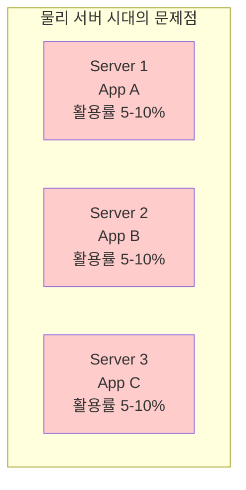

**왜 이런 낭비가 발생했을까?**

물리 서버 시대에는 "1개 애플리케이션 = 1개 서버"라는 강제 규칙이 있었다. 이유는 간단하다. 여러 앱을 한 서버에 실행하면 라이브러리 충돌, 포트 경합, 리소스 경쟁이 발생하여 시스템이 불안정해졌기 때문이다. 하지만 이는 심각한 문제를 야기했다.

**핵심 문제점**:
1. **과잉 프로비저닝**: 성능 예측이 어려워 과도한 스펙의 서버 구매
2. **낮은 활용률**: 대부분의 서버가 5-10%만 사용됨
3. **자원 낭비**: 자본 낭비와 동시에 환경(전력, 냉각) 자원 낭비

> 💬 **비유**: 10명이 탈 수 있는 버스에 1명만 태우고 다니는 것과 같다. 나머지 9개 좌석은 항상 비어있다.

---

### 1.2 Hello VMware: 가상화 시대

VMware가 제시한 해결책은 **하이퍼바이저(Hypervisor)** 기술이었다. 하나의 물리 서버 위에 여러 개의 가상 서버(VM)를 실행하는 것이다.

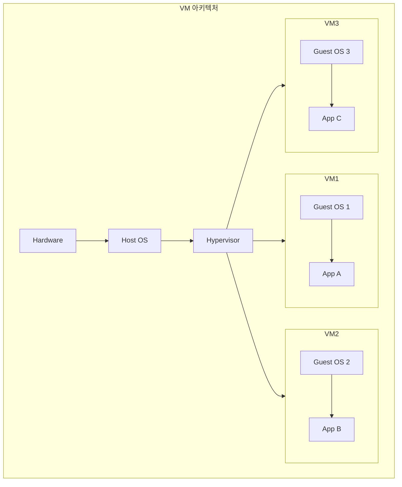

**VMware의 기여**:
- 서버 통합(Consolidation): 여러 앱을 하나의 물리 서버에서 안전하게 실행
- 자원 효율성 향상: 물리 서버 활용률 증가
- 격리 보장: 각 VM은 완전히 독립적

**그러나 VMwarts(VM의 한계)가 드러났다**:

| 문제 | 설명 | 왜 중요한가? |
|------|------|-------------|
| **OS 오버헤드** | 각 VM마다 완전한 Guest OS 필요 | CPU, RAM, 디스크 공간 낭비 |
| **패치 부담** | 모든 VM의 OS를 개별 패치 | 운영 복잡도 증가 |
| **느린 부팅** | 전체 OS 부팅 필요 | 분 단위 시간 소요 |
| **큰 이미지** | GB 단위 VM 이미지 | 이동, 백업 어려움 |
| **낮은 밀도** | 호스트당 ~10개 VM | 여전히 제한적 |

> 💬 **비유**: VM은 아파트를 통째로 빌리는 것. 주방, 화장실, 거실이 다 필요 없어도 다 포함된다.

**왜 이런 한계가 생겼을까?** VM은 **하드웨어 가상화**를 통해 물리 서버를 논리적으로 나누지만, 각 VM이 독립된 OS를 실행하기 때문이다. 즉, 격리는 달성했지만 효율성에서는 여전히 아쉬움이 남았다.

---

### 1.3 Hello Containers: 컨테이너 시대

컨테이너는 VM의 한계를 극복하기 위해 **OS 수준 가상화** 방식을 채택했다. 핵심 아이디어는 간단하다: "왜 모든 앱이 각자의 OS를 가져야 하는가? 호스트 OS 커널을 공유하면 되지 않을까?"

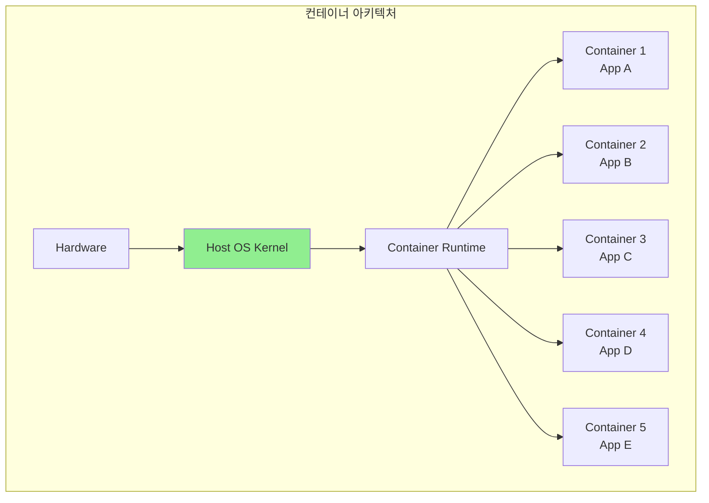

**컨테이너의 핵심 특징**:
1. **커널 공유**: 모든 컨테이너가 호스트 OS 커널을 공유
2. **경량화**: Guest OS 없음 → MB 단위 이미지
3. **빠른 시작**: OS 부팅 불필요 → 초 단위 시작
4. **높은 밀도**: VM 10개 실행 가능한 호스트 → 컨테이너 50+개

> 💬 **비유**: 컨테이너는 호텔 방을 빌리는 것. 로비, 수영장, 레스토랑은 공유하면서 내 방만 독립적으로 사용.

**어떻게 격리를 보장하는가?** Linux 컨테이너는 3가지 핵심 기술로 격리를 구현한다:

| 기술 | 역할 | 예시 |
|------|------|------|
| **Namespaces** | 프로세스 격리 | PID, Network, Mount, User, IPC, UTS 네임스페이스 |
| **Cgroups** | 리소스 제한 | CPU 30%, Memory 512MB, I/O 100MB/s |
| **Capabilities** | 권한 세분화 | NET_ADMIN(네트워크 설정), SYS_TIME(시간 변경) 등 |

**Namespaces의 마법**:
- **PID Namespace**: 컨테이너 A의 프로세스 100은 컨테이너 B에서 보이지 않음
- **Network Namespace**: 각 컨테이너가 독립된 네트워크 스택(IP, 포트) 보유
- **Mount Namespace**: 파일시스템 격리, 컨테이너마다 다른 루트(/)

**Cgroups의 제약**:
```bash
# 컨테이너에 리소스 제한 적용 예시
docker run --cpus=0.5 --memory=512m myapp
# → CPU 50%, RAM 512MB로 제한
```

---

### 1.4 VM vs Container 비교

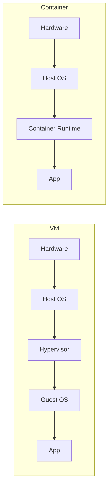

| 항목 | VM | Container | 왜 차이가 나는가? |
|------|-----|-----------|------------------|
| **격리 수준** | 하드웨어 가상화 | OS 수준 가상화 | VM은 하이퍼바이저 위, 컨테이너는 커널 위 |
| **OS** | 각 VM에 완전한 Guest OS | 호스트 커널 공유 | VM은 독립 OS, 컨테이너는 프로세스 |
| **이미지 크기** | GB 단위 | MB 단위 | Guest OS 유무 |
| **부팅 시간** | 분 단위 | 초 단위 | OS 부팅 vs 프로세스 시작 |
| **밀도** | 호스트당 ~10개 | 호스트당 ~50+개 | 리소스 오버헤드 차이 |
| **이식성** | 낮음 (VM 이미지 크고 무거움) | 높음 (이미지 작고 표준화) | 이미지 크기와 표준화 |
| **보안** | 강한 격리 | 상대적으로 약한 격리 | 커널 공유로 인한 공격 표면 |

**핵심 트레이드오프**:
- VM은 **강한 격리**가 필요한 멀티테넌트 환경에 적합
- 컨테이너는 **빠른 배포와 높은 밀도**가 필요한 마이크로서비스에 적합

---

## 2. Docker의 등장: 컨테이너 대중화

### 2.1 Docker 이전: Linux 컨테이너의 복잡성

Linux 컨테이너 기술은 Docker 이전에도 존재했다(LXC, cgroups v1 등). 하지만 이는 전문가 전용이었다.

**왜 어려웠을까?**
```bash
# Docker 이전: 컨테이너 수동 생성 (개념적 예시)
# 1. Namespace 생성
unshare --pid --net --mount --uts --ipc --fork

# 2. Cgroup 설정
cgcreate -g cpu,memory:mycontainer
echo 50000 > /sys/fs/cgroup/cpu/mycontainer/cpu.cfs_quota_us

# 3. 파일시스템 격리
chroot /containers/myapp

# 4. 네트워크 설정
ip netns add mycontainer
ip link add veth0 type veth peer name veth1
...
# 😵 너무 복잡하다!
```

---

### 2.2 Docker의 마법: 추상화

Docker는 이 모든 복잡성을 **단 하나의 명령어**로 추상화했다.

```bash
# Docker 이후: 동일한 작업
docker run nginx
# ✅ 끝!
```

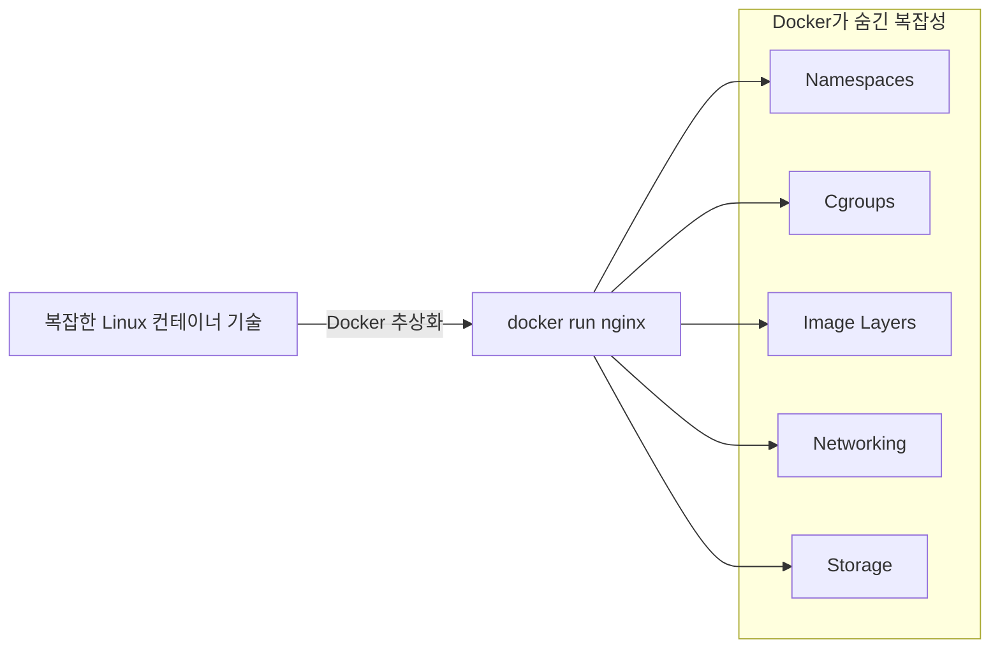

**Docker의 3대 기여**:
1. **단순한 CLI**: 복잡한 기술을 `docker run`, `docker build` 등으로 추상화
2. **이미지 표준화**: Dockerfile을 통한 재현 가능한 빌드
3. **생태계 구축**: Docker Hub(이미지 공유), Docker Compose(멀티 컨테이너)

> 💬 **비유**: Docker는 복잡한 자동차 엔진을 운전대, 페달, 기어로 추상화한 것. 엔진 작동 원리를 몰라도 운전할 수 있다.

---

## 3. 컨테이너 생태계 거버넌스: OCI, CNCF, Moby

Docker가 컨테이너를 대중화했지만, 독점 우려가 생겼다. 이를 해결하기 위해 3개의 거버넌스 조직이 설립되었다.

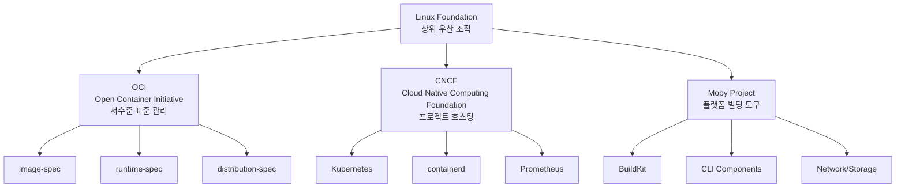

### 3.1 OCI (Open Container Initiative)

**설립 배경**: CoreOS가 Docker 독점에 반발하여 appc 표준을 만들면서 경쟁 표준이 생겼다. 이는 생태계에 혼란을 야기했고, 2015년 주요 플레이어들이 모여 OCI를 설립했다.

> 💬 **철도 궤간 비유**: 19세기 철도 회사마다 궤간(레일 간격)이 달라 기차를 옮겨 탈 수 없었다. 표준화 후 모든 기차가 모든 레일에서 달릴 수 있게 되었다. OCI가 컨테이너에 같은 역할을 했다.

**OCI 3대 표준**:

| 표준 | 정의 내용 | 왜 필요한가? |
|------|----------|-------------|
| **image-spec** | 컨테이너 이미지 포맷 | Docker/Podman/containerd가 같은 이미지 사용 가능 |
| **runtime-spec** | 컨테이너 실행 방식 | runc, crun, kata 등 다양한 런타임 호환 |
| **distribution-spec** | 이미지 레지스트리 API | Docker Hub, Harbor, ECR이 같은 API 사용 |

**Docker의 OCI 구현**:


---

### 3.2 CNCF (Cloud Native Computing Foundation)

**역할**: 표준 제정이 아닌 **프로젝트 호스팅 및 성숙화 지원**

**프로젝트 성숙도 단계**:


**주요 CNCF 프로젝트**:
- **Graduated**: Kubernetes, containerd, Prometheus, Envoy, Cilium
- **Incubating**: Argo, Flux, Notary
- **Sandbox**: 수백 개의 혁신적 프로젝트

> 💬 **스타트업 인큐베이터 비유**: CNCF는 좋은 아이디어를 가진 프로젝트가 성장하고 성숙해질 수 있도록 공간, 구조, 지원을 제공한다.

---

### 3.3 Moby Project

**목적**: 컨테이너 플랫폼을 직접 빌드하려는 기업/개발자를 위한 모듈화된 컴포넌트 제공

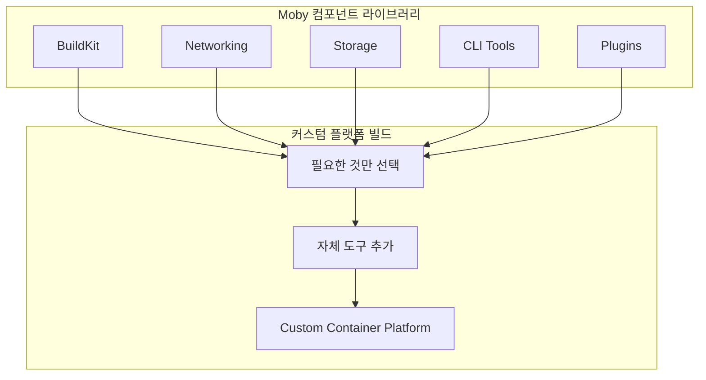

**참여 기업**: Docker, Microsoft, Mirantis, Nvidia

---

### 3.4 Docker 플랫폼 = 다양한 출처의 조합

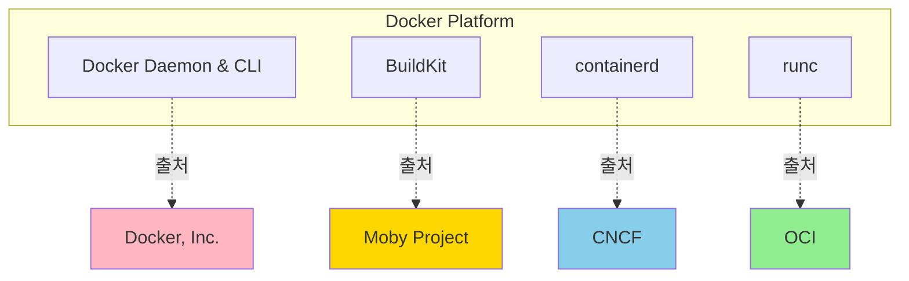

**왜 이렇게 분산되었을까?** Docker, Inc.가 커뮤니티 신뢰를 얻고 벤더 중립성을 확보하기 위해 핵심 컴포넌트를 오픈소스 재단에 기부했다. 이는 생태계 전체의 건강성을 높였다.

---

## 4. 플랫폼별 컨테이너 지원

### 4.1 핵심 원칙: 커널 공유

> **컨테이너는 호스트 OS 커널을 공유한다!**

이 원칙이 모든 것을 결정한다:
- Linux 앱 → Linux 커널 필요
- Windows 앱 → Windows 커널 필요

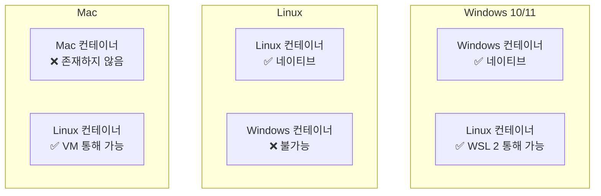

**플랫폼별 지원 현황**:

| 플랫폼 | Windows 컨테이너 | Linux 컨테이너 | 방식 |
|--------|-----------------|---------------|------|
| **Windows** | ✅ 네이티브 | ✅ WSL 2 | WSL 2 = 경량 Linux VM |
| **Linux** | ❌ | ✅ 네이티브 | 기본 환경 |
| **Mac** | ❌ | ✅ VM | Docker Desktop = Linux VM |

**현실**:
- 거의 모든 컨테이너는 **Linux 컨테이너**
- Linux 컨테이너가 더 작고, 빠르고, 도구가 풍부함
- Windows 컨테이너는 레거시 .NET Framework 앱에 주로 사용

---

## 5. Wasm (WebAssembly)과 컨테이너

### 5.1 Wasm vs Container

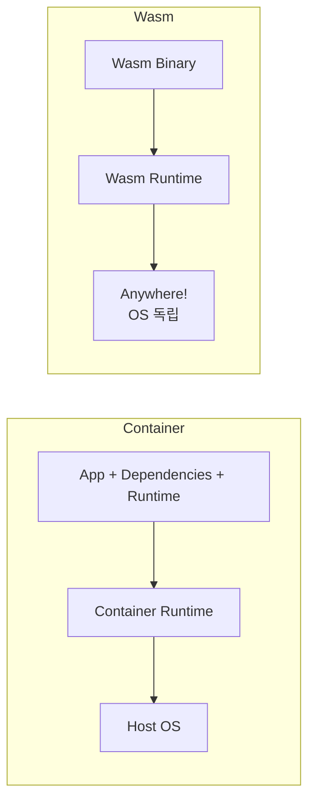

| 특성 | Container | Wasm | 왜 차이가 나는가? |
|------|-----------|------|------------------|
| **크기** | MB 단위 | KB 단위 | Wasm은 바이너리만, 컨테이너는 OS 파일 포함 |
| **시작 속도** | 초 단위 | 밀리초 단위 | Wasm은 런타임 로딩만, 컨테이너는 프로세스 격리 |
| **OS 의존성** | 있음 (커널 공유) | 없음 | Wasm은 추상화된 가상 머신 |
| **격리** | 프로세스 격리 | 샌드박스 격리 | Wasm은 메모리 안전 보장 |
| **생태계** | 성숙 | 발전 중 | 컨테이너 10년+, Wasm 5년 |

**Wasm의 현재 한계**:
- 파일 I/O, 네트워킹 등 시스템 API 제한적 (WASI 표준 개발 중)
- 도구 생태계 미성숙
- 멀티스레딩 지원 제한적

**미래 전망**:

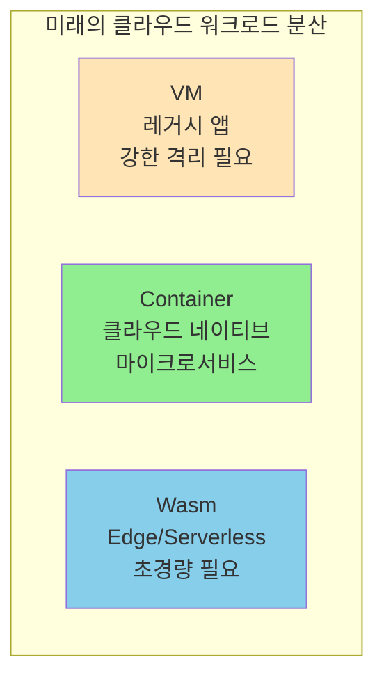

**Docker의 Wasm 통합**:
```bash
# Docker Desktop에서 Wasm 컨테이너 실행 (실험적)
docker run --runtime=io.containerd.wasmedge.v1 myapp.wasm
```

---

## 6. Docker와 AI

### 6.1 문제: GPU 접근의 어려움

컨테이너 내부에서 GPU/AI 가속 하드웨어를 사용하기 어렵다. 왜냐하면:
- 각 하드웨어마다 고유한 드라이버 + SDK 필요 (CUDA, ROCm 등)
- 호스트와 컨테이너 간 디바이스 공유가 복잡

### 6.2 해결책: Docker Model Runner

Docker는 **Model Runner**라는 기능을 도입했다.

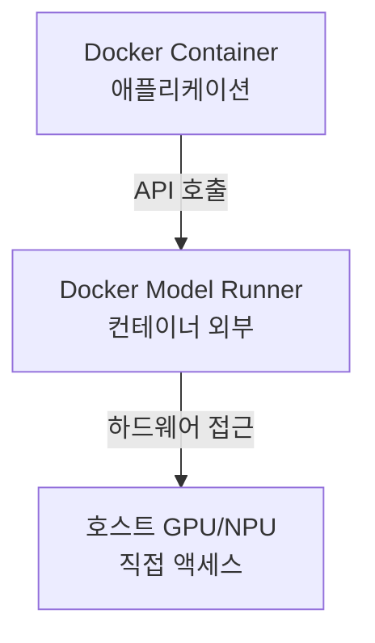

**핵심 아이디어**:
- LLM 모델을 **컨테이너 외부**에서 실행
- 호스트 하드웨어에 직접 액세스
- 컨테이너 앱은 API로 모델 호출

**Stack Overflow 통계**: Docker는 개발자가 **가장 원하는** 도구이자 **가장 많이 사용하는** 도구 1위

---

## 7. Docker와 Kubernetes

### 7.1 Kubernetes의 런타임 변경

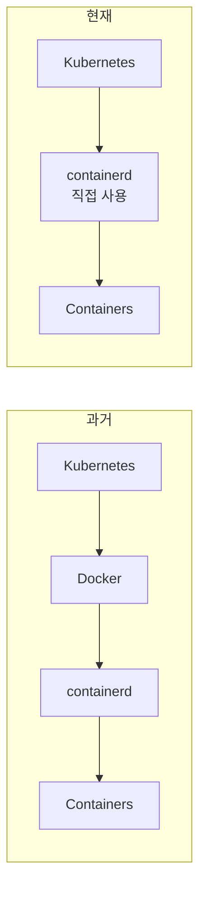

**왜 변경했을까?**
- Docker는 Kubernetes에 비해 너무 무거움 (Docker Daemon, CLI 등 불필요)
- containerd는 경량화된 순수 런타임
- Kubernetes는 CRI(Container Runtime Interface) 표준 사용

**핵심**: 모든 Docker 컨테이너는 Kubernetes에서 그대로 동작한다. 왜냐하면 둘 다 OCI 표준을 따르기 때문이다.

---

## 정리

### 핵심 포인트

1. **인프라 진화**: 물리 서버(낭비) → VM(OS 오버헤드) → 컨테이너(커널 공유)
2. **컨테이너 핵심**: Namespaces(격리) + Cgroups(제한) + Capabilities(권한)
3. **Docker의 기여**: 복잡한 Linux 컨테이너를 단순한 CLI로 대중화
4. **생태계 거버넌스**: OCI(표준) + CNCF(프로젝트) + Moby(빌딩 도구)
5. **플랫폼 차이**: 커널 공유 원칙으로 인해 Linux 컨테이너가 지배적
6. **미래**: VM, Container, Wasm이 각자의 영역에서 공존

### 다음 챕터 연결

Ch02에서는 Docker를 실제로 설치하고 첫 컨테이너를 실행해본다. Docker Desktop, Multipass, Linux 직접 설치 중 어떤 방법을 선택할지, 그리고 `docker run`으로 무엇을 할 수 있는지 배운다.

---

## 🔍 심화 학습

### 추천 자료

| 주제 | 자료 | 난이도 |
|------|------|--------|
| Linux Namespaces | `man namespaces` | 중급 |
| Cgroups v2 | kernel.org documentation | 고급 |
| OCI 스펙 | opencontainers.org | 중급 |
| CNCF Landscape | landscape.cncf.io | 초급 |

### 실습 과제

1. **VM vs Container 벤치마크**: 동일한 앱을 VM과 컨테이너로 실행하여 부팅 시간, 메모리 사용량 비교
2. **Namespace 탐험**: `lsns` 명령으로 호스트의 네임스페이스 확인
3. **Cgroup 제한 테스트**: `docker run --cpus=0.5 --memory=256m` 으로 제한 확인

---

## ✅ 체크리스트

### 개념 이해
- [ ] 물리 서버 시대의 낭비(5-10% 활용률)를 설명할 수 있다
- [ ] VM의 5가지 한계(VMwarts)를 나열할 수 있다
- [ ] 컨테이너가 VM보다 효율적인 이유를 "커널 공유"로 설명할 수 있다
- [ ] Namespaces, Cgroups, Capabilities의 역할을 구분할 수 있다

### Docker 생태계
- [ ] Docker가 컨테이너를 대중화한 3가지 방식을 설명할 수 있다
- [ ] OCI 3대 표준을 나열할 수 있다
- [ ] CNCF의 성숙도 3단계를 설명할 수 있다
- [ ] Docker 플랫폼이 여러 프로젝트의 조합임을 이해한다

### 플랫폼 지식
- [ ] Windows에서 Linux 컨테이너 실행 방법(WSL 2)을 안다
- [ ] Mac에서 "Mac 컨테이너"가 존재하지 않는 이유를 설명할 수 있다
- [ ] Wasm과 컨테이너의 차이를 크기, 속도, OS 의존성으로 비교할 수 있다

---

## 📚 참고 자료

- 📘 [OCI Specifications](https://opencontainers.org/)
- 📘 [CNCF Projects](https://www.cncf.io/projects/)
- 📘 [Moby Project](https://mobyproject.org/)
- 📘 [Linux Namespaces](https://man7.org/linux/man-pages/man7/namespaces.7.html)
- 📘 [Docker + Wasm](https://docs.docker.com/desktop/wasm/)
