# Ch02. Docker Setup & First Run

> 📌 **핵심 요약**
> Docker 설치 방법은 Docker Desktop(권장), Multipass(Desktop 불가 시), Linux 직접 설치(서버용) 3가지다. Docker Desktop은 완전한 기능(UI, scout, debug, Kubernetes)을 제공하지만 대기업은 유료다. Mac에서 Docker는 경량 Linux VM 내부에서 실행되며, 이것이 Linux 컨테이너만 지원되는 이유다. Docker의 핵심 워크플로우는 **build-ship-run**: Dockerfile로 이미지 빌드 → 레지스트리에 push → 어디서든 컨테이너로 실행이다.

---

## 🎯 학습 목표

1. Docker 설치의 3가지 방법(Desktop, Multipass, Linux)을 비교하고 상황에 맞게 선택할 수 있다
2. Docker Desktop의 구성 요소와 라이선스 정책을 이해하고 설치할 수 있다
3. Mac/Windows/Linux 플랫폼별 Docker 아키텍처 차이를 이해한다
4. `docker version` 출력에서 Client와 Server의 OS/Arch 차이를 해석할 수 있다
5. Ops 관점의 워크플로우(pull → run → exec → stop → rm)를 실행할 수 있다
6. Dev 관점의 워크플로우(clone → build → run → test)를 실행할 수 있다

---

## 1. Docker 설치 방법 비교

### 1.1 3가지 설치 방법 개요

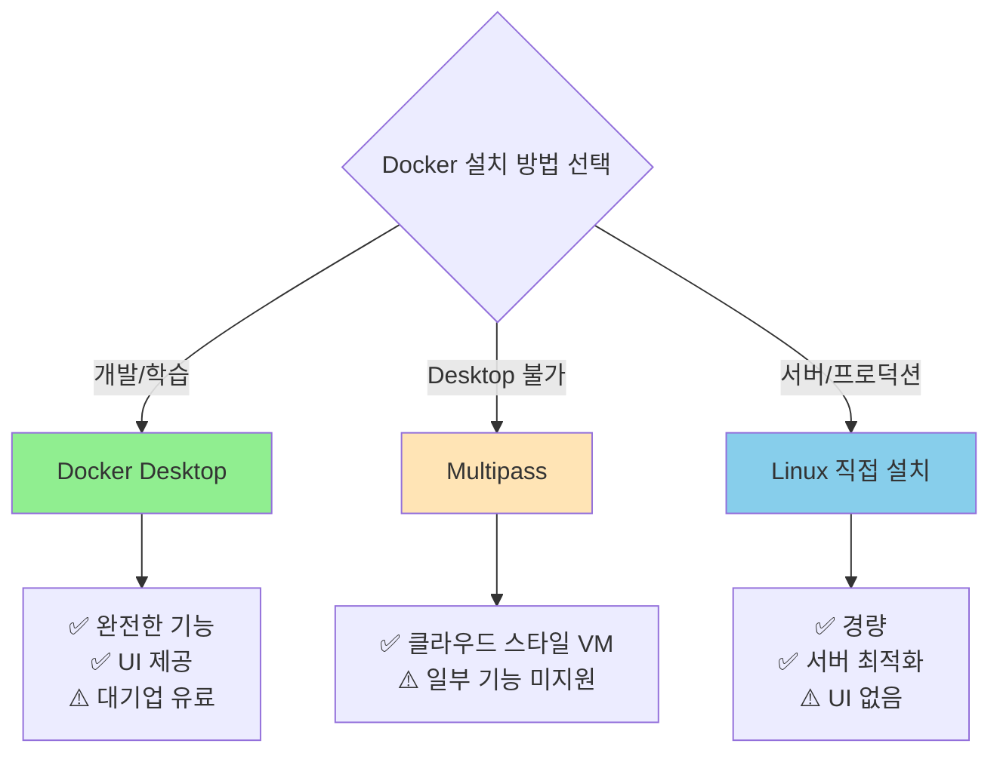

**상황별 권장 방법**:

| 상황 | 선택 | 이유 |
|------|------|------|
| 로컬 개발 (개인/소기업) | Docker Desktop | 완전한 기능, 간편함, 무료 |
| 로컬 개발 (대기업, 250명 이상) | Multipass 또는 VM | 라이선스 비용 회피 |
| 학습/실험 | Docker Desktop | 최신 기능 체험 가능 |
| CI/CD 서버 | Linux 직접 설치 | 경량, 안정성 |
| 프로덕션 서버 | Linux 직접 설치 | UI 불필요, 최적화 |

---

### 1.2 기능 비교표

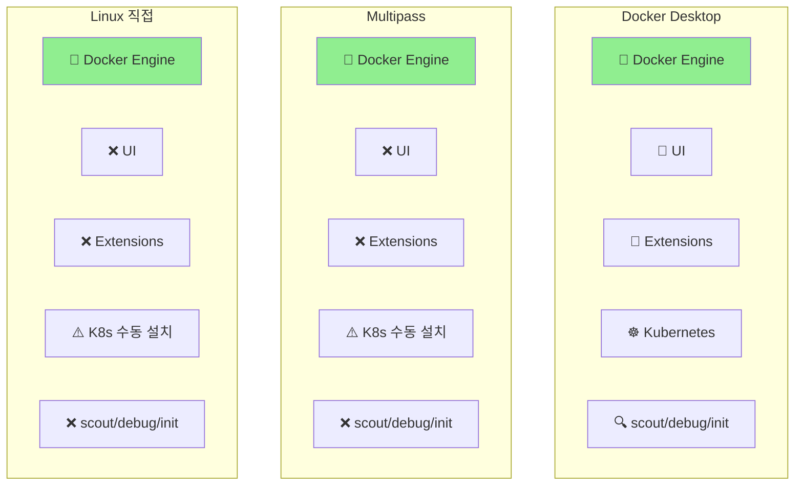

| 기능 | Docker Desktop | Multipass | Linux 직접 | 중요도 |
|------|----------------|-----------|-----------|--------|
| **Docker Engine** | ✅ | ✅ | ✅ | 필수 |
| **docker scout** | ✅ | ❌ | ❌ | 보안 중요 |
| **docker debug** | ✅ | ❌ | ❌ | 디버깅 편의 |
| **docker init** | ✅ | ❌ | ❌ | 프로젝트 초기화 |
| **UI/Dashboard** | ✅ | ❌ | ❌ | 시각화 편의 |
| **Extensions** | ✅ | ❌ | ❌ | 확장성 |
| **Kubernetes** | ✅ 내장 | ⚠️ 수동 | ⚠️ 수동 | 로컬 K8s |
| **다중 노드** | ❌ | ✅ | ✅ | 클러스터 학습 |

**핵심 차이점**:
- **docker scout**: 이미지 취약점 스캔 (CVE 분석)
- **docker debug**: 최소 이미지에 디버깅 도구 주입 (`ps`, `vim` 등)
- **docker init**: 프로젝트 타입 감지 후 Dockerfile/compose.yml 자동 생성

---

## 2. Docker Desktop

### 2.1 구성 요소

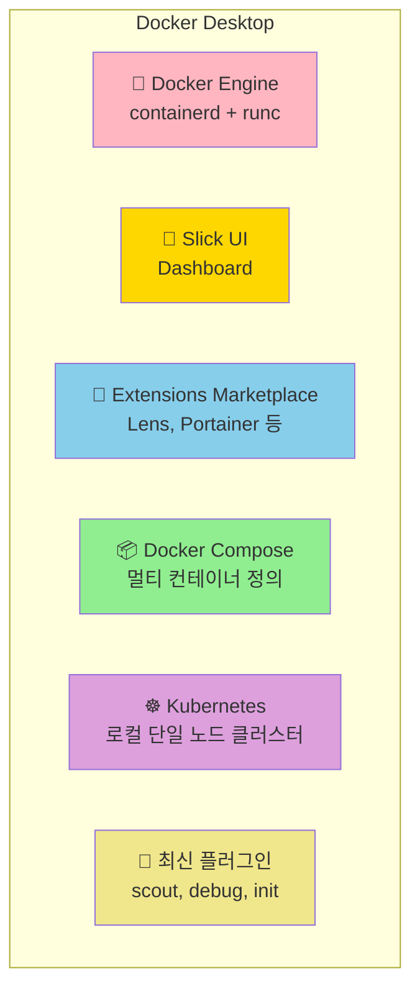

**각 컴포넌트 설명**:

| 컴포넌트 | 역할 | 실무 활용 |
|----------|------|----------|
| **Docker Engine** | 컨테이너 실행 엔진 | 모든 `docker` 명령어의 백엔드 |
| **UI** | 시각적 관리 도구 | 컨테이너/이미지/볼륨 한눈에 확인 |
| **Extensions** | 기능 확장 | Disk Cleaner, Resource Saver 등 |
| **Compose** | 멀티 컨테이너 정의 | 로컬 개발 환경 구성 |
| **Kubernetes** | 오케스트레이션 | 로컬에서 K8s 매니페스트 테스트 |

---

### 2.2 라이선스 정책

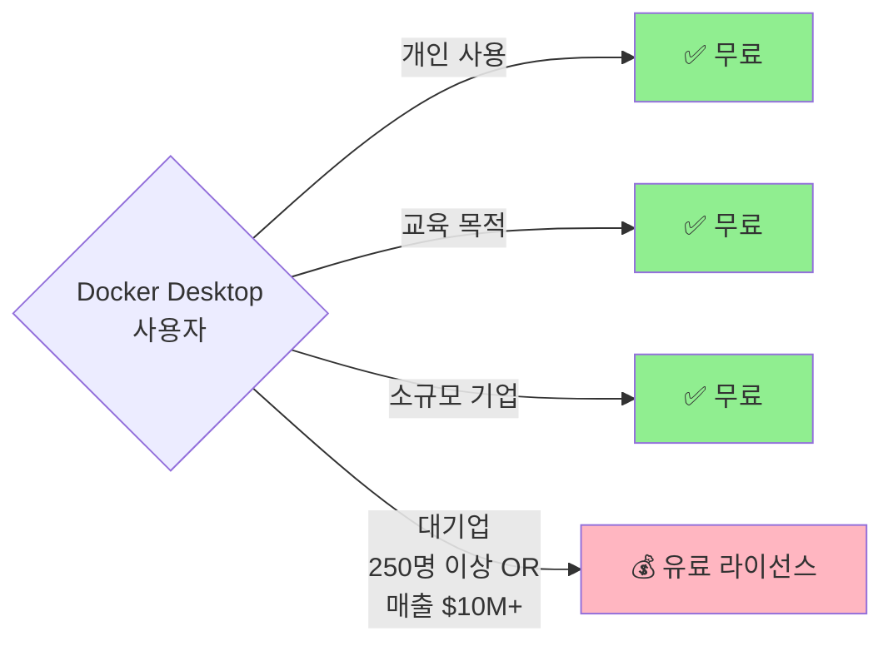

**정확한 기준**:
- **무료**: 개인 사용 + 교육 + 소규모 기업
- **유료 필요**: 업무용 사용 AND (직원 250명 이상 **OR** 연 매출 $10M 이상)

**왜 이런 정책을 만들었을까?**
Docker, Inc.는 오픈소스 기여와 수익 창출 사이에서 균형을 찾아야 했다. 개인/소기업은 무료로 생태계에 기여하고, 대기업은 비용을 지불하여 지속 가능성을 확보하는 모델이다.

---

### 2.3 플랫폼별 컨테이너 지원

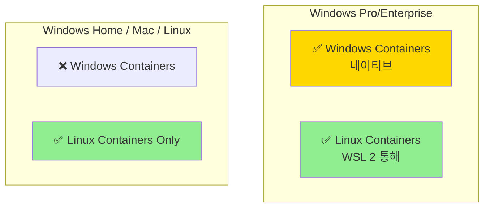

**Windows에서 모드 전환**:
```bash
# Windows Pro/Enterprise에서만 가능
# 시스템 트레이 Docker 아이콘 우클릭
# "Switch to Windows containers..." 또는 "Switch to Linux containers..."
```

**현실적 조언**:
- 99%의 컨테이너는 Linux 컨테이너
- Windows 컨테이너는 레거시 .NET Framework 앱에만 사용
- 신규 프로젝트는 Linux 컨테이너로 시작 권장

---

## 3. Mac에서 Docker Desktop

### 3.1 아키텍처: 숨겨진 Linux VM

Mac에서 Docker가 동작하는 방식은 특별하다. **경량 Linux VM**을 백그라운드에서 실행하고, 사용자는 Mac 네이티브 CLI를 사용한다.

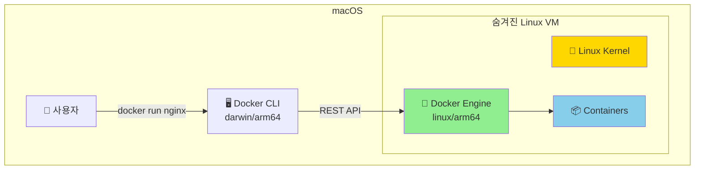

**왜 VM이 필요한가?**
- 컨테이너는 호스트 **커널을 공유**해야 한다 (Ch01에서 배운 핵심 원칙)
- macOS 커널 ≠ Linux 커널
- 따라서 Linux 컨테이너를 실행하려면 Linux 커널이 필요 → VM!

**사용자 경험**:
- VM 존재를 인식하지 못함 (Seamless)
- 파일 공유, 네트워크, 포트 포워딩 모두 자동
- `docker version`에서 Client와 Server OS/Arch 차이로 확인 가능

---

### 3.2 설치 및 확인

```bash
# 1. Docker Desktop 다운로드
# https://www.docker.com/products/docker-desktop
# Mac with Apple Silicon → ARM64 버전
# Mac with Intel → AMD64 버전

# 2. 설치 후 버전 확인
$ docker version

Client:
 Version:           28.1.1
 API version:       1.49
 Go version:        go1.23.8
 OS/Arch:           darwin/arm64        # ← Mac 네이티브!
 Context:           desktop-linux

Server: Docker Desktop 4.42.0 (192140)
 Engine:
  Version:          28.1.1
  API version:      1.49 (minimum version 1.24)
  Go version:       go1.23.8
  OS/Arch:          linux/arm64         # ← Linux VM 내부!
 containerd:
  Version:          1.7.21
 runc:
  Version:          1.2.5
 docker-init:
  Version:          0.19.0
```

**출력 해석**:

| 항목 | Client | Server | 의미 |
|------|--------|--------|------|
| **OS/Arch** | darwin/arm64 | linux/arm64 | Mac CLI → Linux VM |
| **Version** | 28.1.1 | 28.1.1 | 버전 일치 (정상) |
| **API version** | 1.49 | 1.49 | API 호환 (정상) |

> 💬 **비유**: Mac에서 Docker는 번역기와 같다. 사용자는 한국어(Mac 명령)로 말하고, 숨겨진 번역기(Linux VM)가 영어(Linux 명령)로 변환하여 실행한다.

---

## 4. Multipass로 Docker 설치

### 4.1 Multipass란?

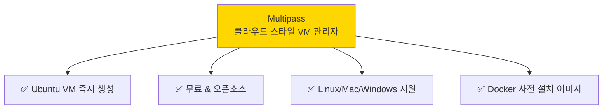

**Docker Desktop 대비 장점**:
- 다중 노드 클러스터 구성 가능 (Swarm, K8s 학습)
- 라이선스 제약 없음
- 클라우드 VM과 유사한 경험

**단점**:
- UI 없음
- scout/debug/init 미지원
- Extensions 없음

---

### 4.2 설치 및 사용

```bash
# 1. Multipass 설치
# https://multipass.run/install

# 2. Docker 사전 설치된 VM 생성
$ multipass launch docker --name docker-node
Launched: docker-node

# 3. VM 목록 확인
$ multipass list
Name           State      IPv4             Image
docker-node    Running    192.168.64.37    Ubuntu 24.04 LTS
                          172.17.0.1
                          172.18.0.1

# 4. VM 접속
$ multipass shell docker-node

# 5. Docker 확인 (VM 내부)
ubuntu@docker-node:~$ docker --version
Docker version 27.3.1, build ce12230

ubuntu@docker-node:~$ docker run hello-world
...
Hello from Docker!
...

# 6. VM에서 나가기
ubuntu@docker-node:~$ exit

# 7. VM 삭제 (필요 시)
$ multipass delete docker-node
$ multipass purge
```

**Multipass 핵심 명령어**:

| 명령어 | 설명 | 예시 |
|--------|------|------|
| `launch` | VM 생성 | `multipass launch docker --name node1` |
| `list` | VM 목록 | `multipass list` |
| `shell` | VM 접속 | `multipass shell node1` |
| `delete` | VM 삭제 (휴지통) | `multipass delete node1` |
| `purge` | 완전 삭제 | `multipass purge` |
| `info` | VM 상세 정보 | `multipass info node1` |

---

## 5. Linux에서 Docker 직접 설치

### 5.1 Ubuntu에서 Snap 설치

```bash
# 1. Docker 설치 (snap 사용)
$ sudo snap install docker
docker 27.2.0 from Canonical✓ installed

# 2. 버전 확인
$ sudo docker --version
Docker version 27.2.0, build 3ab4256

# 3. 상세 정보
$ sudo docker info
Server:
 Containers: 0
  Running: 0
  Paused: 0
  Stopped: 0
 Images: 0
 Server Version: 27.2.0
 Storage Driver: overlay2
 ...
```

---

### 5.2 sudo 없이 Docker 사용

기본적으로 Docker는 root 권한이 필요하다. 매번 `sudo`를 입력하는 것을 피하려면:

```bash
# 1. docker 그룹 생성 (이미 있을 수 있음)
$ sudo groupadd docker

# 2. 현재 사용자를 docker 그룹에 추가
$ sudo usermod -aG docker $USER

# 3. 새 세션 시작 (로그아웃 후 재로그인 또는)
$ newgrp docker

# 4. Docker 서비스 재시작
$ sudo systemctl restart docker

# 5. 이제 sudo 없이 사용 가능
$ docker --version
Docker version 27.2.0, build 3ab4256

$ docker run hello-world
...
Hello from Docker!
...
```

**왜 이렇게 해야 할까?**
Docker Daemon은 Unix 소켓(`/var/run/docker.sock`)을 통해 통신한다. 이 소켓은 기본적으로 root와 docker 그룹만 접근 가능하다. 사용자를 docker 그룹에 추가하면 root 권한 없이도 소켓에 접근할 수 있다.

**보안 주의사항**:
- docker 그룹 멤버 = 사실상 root 권한
- 신뢰할 수 있는 사용자만 추가
- 프로덕션 환경에서는 RBAC(Role-Based Access Control) 사용 권장

---

## 6. Ops 관점: 컨테이너 실행 워크플로우

### 6.1 전체 흐름

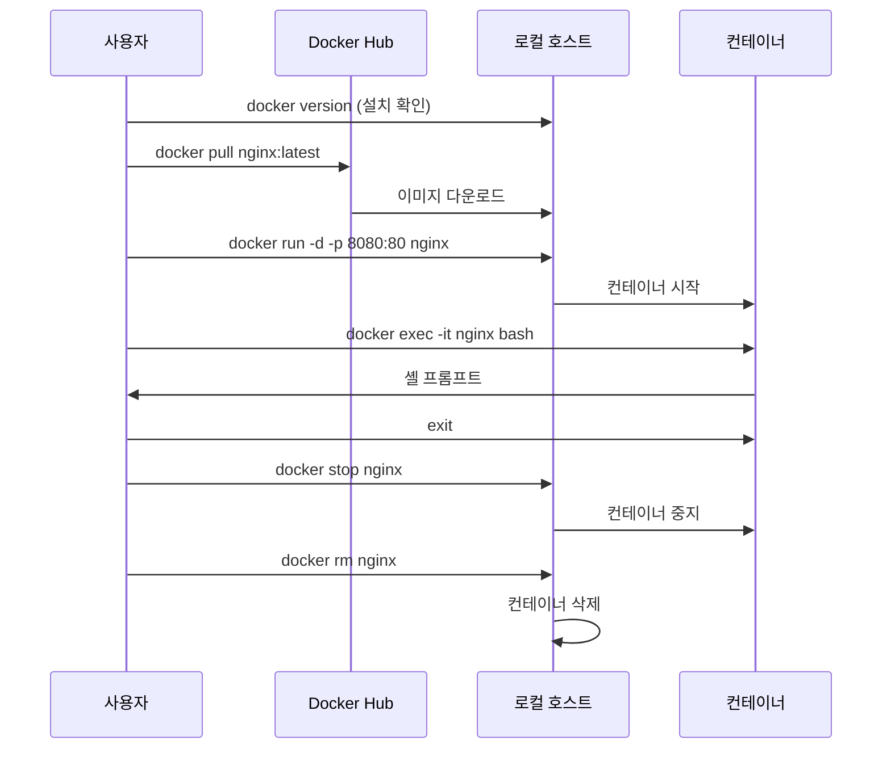

---

### 6.2 단계별 실습

**Step 1: 설치 확인**
```bash
$ docker version
# Client와 Server 둘 다 응답 오면 정상
```

**Step 2: 이미지 다운로드**
```bash
# 현재 이미지 목록 (처음엔 비어있음)
$ docker images
REPOSITORY    TAG    IMAGE ID    CREATED    SIZE

# nginx:latest 다운로드
$ docker pull nginx:latest
latest: Pulling from library/nginx
ad5932596f78: Pull complete
e4bc5c1a6721: Pull complete
...
Status: Downloaded newer image for nginx:latest
docker.io/library/nginx:latest

# 다시 확인
$ docker images
REPOSITORY    TAG       IMAGE ID        CREATED        SIZE
nginx         latest    fb197595ebe7    10 days ago    280MB
```

**이미지란?**
- 앱 실행에 필요한 모든 것을 포함한 패키지
- OS 파일시스템 + 앱 바이너리 + 의존성 + 설정
- Ops 관점: VM 템플릿과 유사
- Dev 관점: 클래스와 유사 (컨테이너 = 인스턴스)

**Step 3: 컨테이너 시작**
```bash
$ docker run --name web1 -d -p 8080:80 nginx:latest
e08c3535...30557225

# 실행 중인 컨테이너 확인
$ docker ps
CONTAINER ID   IMAGE          COMMAND                  CREATED         STATUS         PORTS                  NAMES
e08c35352ff3   nginx:latest   "/docker-entrypoint.…"   3 seconds ago   Up 2 seconds   0.0.0.0:8080->80/tcp   web1
```

**플래그 설명**:

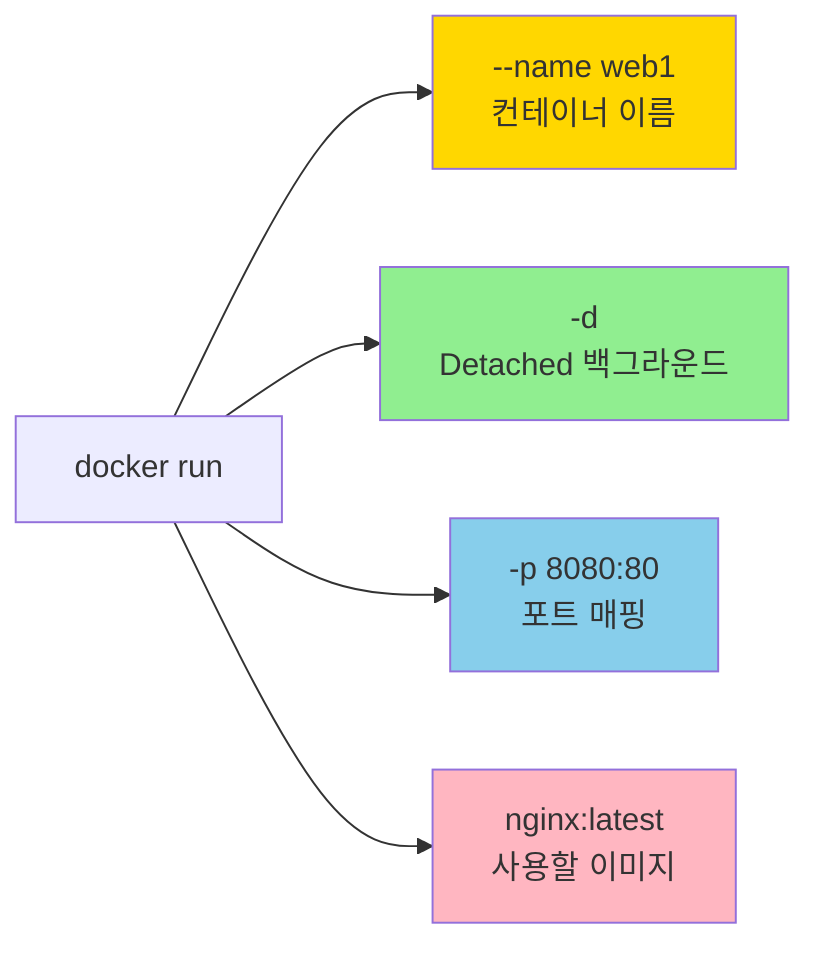

| 플래그 | 의미 | 왜 필요한가? |
|--------|------|-------------|
| `--name web1` | 컨테이너 이름 지정 | ID 대신 이름으로 관리 |
| `-d` | Detached (백그라운드) | 터미널을 점유하지 않음 |
| `-p 8080:80` | 호스트:컨테이너 포트 매핑 | 외부에서 접근 가능 |

**포트 매핑 시각화**:
```
브라우저: http://localhost:8080
    ↓
Docker 호스트: 포트 8080
    ↓ (매핑)
컨테이너: 포트 80 (nginx)
```

**Step 4: 브라우저 확인**
```bash
# Docker Desktop: http://localhost:8080
# Multipass: http://192.168.x.x:8080 (VM IP 확인)

# curl로 확인
$ curl http://localhost:8080
<!DOCTYPE html>
<html>
<head>
<title>Welcome to nginx!</title>
...
```

**Step 5: 컨테이너 내부 접속**
```bash
$ docker exec -it web1 bash
root@e08c35352ff3:/#

# 파일 시스템 확인
root@e08c35352ff3:/# ls -l
total 64
lrwxrwxrwx   1 root root    7 Jan  2 00:00 bin -> usr/bin
drwxr-xr-x   2 root root 4096 Oct 31 11:04 boot
...

# ps 명령 시도 (실패!)
root@e08c35352ff3:/# ps -elf
bash: ps: command not found

# 나가기
root@e08c35352ff3:/# exit
```

**왜 `ps`가 없을까?**
컨테이너 이미지는 **최소한의 구성**만 포함한다:
- **크기 최소화**: 불필요한 도구 제외
- **보안 강화**: 공격 표면(attack surface) 감소
- **해결책**: Docker Desktop의 `docker debug` 사용

**Step 6: 정리**
```bash
# 컨테이너 중지
$ docker stop web1
web1

# 컨테이너 삭제
$ docker rm web1
web1

# 확인
$ docker ps -a
CONTAINER ID   IMAGE   COMMAND   CREATED   STATUS   PORTS   NAMES
```

---

## 7. Dev 관점: 앱 컨테이너화 워크플로우

### 7.1 전체 흐름: build-ship-run


**핵심 아이디어**:
1. **Build**: Dockerfile로 이미지 빌드
2. **Ship**: 레지스트리에 push (공유)
3. **Run**: 어디서든 pull하여 실행

---

### 7.2 단계별 실습

**Step 1: 소스 코드 가져오기**
```bash
# GitHub에서 샘플 앱 클론
$ git clone https://github.com/nigelpoulton/psweb.git
Cloning into 'psweb'...
...

$ cd psweb

$ ls -l
-rw-r--r--  1 user  staff  324  Dockerfile      # ← 핵심!
-rw-r--r--  1 user  staff  378  README.md
-rw-r--r--  1 user  staff  341  app.js
-rw-r--r--  1 user  staff  355  package.json
drwxr-xr-x  3 user  staff   96  views
```

**Step 2: Dockerfile 이해**
```dockerfile
FROM alpine
LABEL maintainer="nigelpoulton@hotmail.com"
RUN apk add --update nodejs npm curl
COPY . /src
WORKDIR /src
RUN  npm install
EXPOSE 8080
ENTRYPOINT ["node", "./app.js"]
```

**각 명령어 해부**:

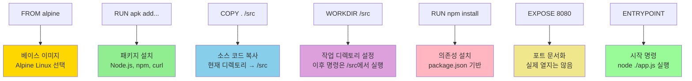

| 명령어 | 역할 | 왜 필요한가? |
|--------|------|-------------|
| `FROM alpine` | 베이스 이미지 | 모든 이미지는 기반이 필요 (Alpine은 5MB 경량) |
| `LABEL` | 메타데이터 | 관리자 정보, 버전 등 |
| `RUN` | 빌드 시 실행 | 패키지 설치, 설정 등 |
| `COPY` | 파일 복사 | 호스트 파일 → 이미지 |
| `WORKDIR` | 작업 디렉토리 | 이후 명령의 기준 경로 |
| `EXPOSE` | 포트 문서화 | 어떤 포트를 사용하는지 명시 |
| `ENTRYPOINT` | 시작 명령 | 컨테이너 시작 시 실행할 프로세스 |

> 💬 **비유**: Dockerfile은 요리 레시피. 재료(FROM), 준비(RUN), 담기(COPY), 서빙(ENTRYPOINT)까지 모든 단계를 정의한다.

**Step 3: 이미지 빌드**
```bash
$ docker build -t psweb:latest .
[+] Building 36.2s (11/11) FINISHED
 => [internal] load build definition from Dockerfile
 => [internal] load metadata for docker.io/library/alpine:latest
 => [1/5] FROM docker.io/library/alpine:latest
 => [2/5] RUN apk add --update nodejs npm curl
 => [3/5] COPY . /src
 => [4/5] WORKDIR /src
 => [5/5] RUN npm install
 => exporting to image
 => => naming to docker.io/library/psweb:latest

# 생성된 이미지 확인
$ docker images
REPOSITORY    TAG       IMAGE ID        CREATED          SIZE
psweb         latest    0435f2738cf6    21 seconds ago   160MB
```

**빌드 플래그**:
- `-t psweb:latest`: 이미지 이름(psweb)과 태그(latest)
- `.`: 빌드 컨텍스트 (Dockerfile이 있는 현재 디렉토리)

**빌드 과정 시각화**:
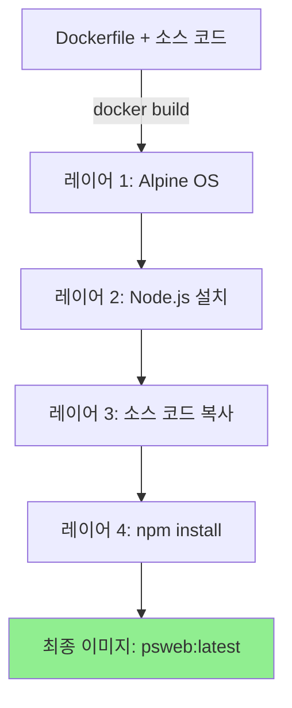

**Step 4: 컨테이너 실행**
```bash
$ docker run -d --name webapp -p 8080:8080 psweb:latest
5a3c...d891

# 확인
$ docker ps
CONTAINER ID   IMAGE           COMMAND                  PORTS
5a3c...d891    psweb:latest    "node ./app.js"          0.0.0.0:8080->8080/tcp

# 브라우저 또는 curl로 테스트
$ curl http://localhost:8080
<!DOCTYPE html>
<html>
...
Hello from Docker!
...
```

**Step 5: 정리**
```bash
# 컨테이너 강제 삭제 (중지 + 삭제)
$ docker rm webapp -f
webapp

# 이미지 삭제
$ docker rmi psweb:latest
Untagged: psweb:latest
Deleted: sha256:0435f27...cac8e2b
```

---

## 8. Dev 워크플로우 정리

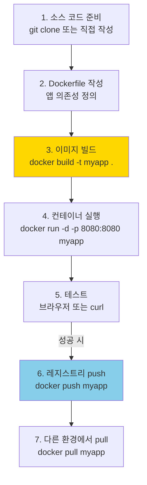

**핵심 용어**:
- **Containerizing**: 앱을 컨테이너 이미지로 만드는 과정 (Dockerfile 작성 + 빌드)
- **Build Context**: `docker build .`에서 `.`이 가리키는 디렉토리 (Dockerfile + 소스 코드)
- **Image Tag**: 이미지 버전 구분 (예: `myapp:v1.0`, `myapp:latest`)

---

## 정리

### 핵심 포인트

1. **설치 방법**: Docker Desktop(권장) > Multipass(Desktop 불가) > Linux 직접(서버)
2. **Mac 아키텍처**: CLI는 darwin, Engine은 linux → 숨겨진 VM
3. **Ops 워크플로우**: pull → run → exec → stop → rm
4. **Dev 워크플로우**: Dockerfile 작성 → build → run → test
5. **build-ship-run**: Docker의 핵심 철학 (어디서나 동일하게 실행)

### 다음 챕터 연결

Ch03에서는 Docker Engine 내부 구조를 깊이 파고든다. containerd와 runc가 무엇인지, Dockerfile의 각 명령어가 어떻게 레이어로 변환되는지, 그리고 Namespace/Cgroup이 실제로 어떻게 격리를 구현하는지 배운다.

---

## ✅ 체크리스트

### 설치 및 확인
- [ ] Docker Desktop을 설치하고 버전을 확인할 수 있다
- [ ] `docker version`에서 Client/Server OS/Arch 차이를 해석할 수 있다
- [ ] Mac에서 Docker가 Linux VM 내부에서 실행됨을 이해한다
- [ ] Multipass로 Docker VM을 생성하고 접속할 수 있다

### Ops 워크플로우
- [ ] `docker pull`로 이미지를 다운로드할 수 있다
- [ ] `docker run -d -p 8080:80 nginx`의 각 플래그를 설명할 수 있다
- [ ] `docker exec -it <name> bash`로 컨테이너에 접속할 수 있다
- [ ] `docker stop`과 `docker rm`으로 컨테이너를 정리할 수 있다

### Dev 워크플로우
- [ ] Dockerfile의 각 명령어(FROM, RUN, COPY, WORKDIR, EXPOSE, ENTRYPOINT)를 이해한다
- [ ] `docker build -t <name> .`로 이미지를 빌드할 수 있다
- [ ] "Containerizing"이 무엇을 의미하는지 설명할 수 있다
- [ ] build-ship-run 워크플로우를 설명할 수 있다

---

## 📚 참고 자료

- 📘 [Docker Desktop 다운로드](https://www.docker.com/products/docker-desktop)
- 📘 [Multipass 설치 가이드](https://multipass.run/install)
- 📘 [Dockerfile Reference](https://docs.docker.com/engine/reference/builder/)
- 📘 [샘플 앱 저장소](https://github.com/nigelpoulton/psweb)
