# Ch03. Docker Engine Internals

> 📌 **핵심 요약**
> Docker Engine은 모놀리식 구조에서 모듈화된 아키텍처로 진화했다. 핵심 컴포넌트는 dockerd(API/네트워킹), containerd(고수준 런타임), shim(부모 프로세스), runc(저수준 런타임)이며, 이들이 협력하여 컨테이너를 생성한다. shim 덕분에 데몬 재시작 시에도 컨테이너가 영향받지 않는 Daemonless Containers가 가능하다.

## 🎯 학습 목표
1. Docker Engine의 모듈화된 아키텍처를 설명할 수 있다
2. containerd와 runc의 역할 차이를 구분할 수 있다
3. 컨테이너 생성 시 각 컴포넌트의 동작 흐름을 설명할 수 있다
4. shim의 역할과 Daemonless Containers 이점을 이해할 수 있다
5. OCI 표준이 Docker Engine에 미친 영향을 설명할 수 있다
6. docker run 실행 시 전체 프로세스를 추적할 수 있다

---

## 1. Docker Engine이란?

### 1.1 핵심 정의

Docker Engine은 **컨테이너를 실행하고 관리하는 서버 측 컴포넌트**다. VMware ESXi가 VM을 관리하듯이, Docker Engine은 컨테이너를 관리한다. 초기에는 모든 기능이 하나의 바이너리에 포함된 모놀리식 구조였으나, 현재는 **작은 전문화된 도구들의 조합**으로 분리되었다.

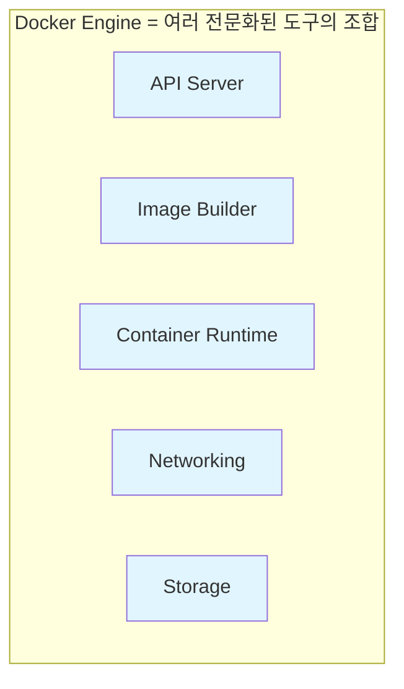

**왜 모듈화했는가?** 초기 모놀리식 구조는 빠르게 혁신하기 어렵고, 다른 프로젝트(Kubernetes 등)가 특정 컴포넌트만 재사용하기 불가능했다. 모듈화로 각 도구가 독립적으로 발전하고, 커뮤니티가 재사용할 수 있게 되었다.

### 1.2 진화 역사

Docker Engine은 LXC 의존성 문제를 시작으로 지속적으로 모듈화되었다.

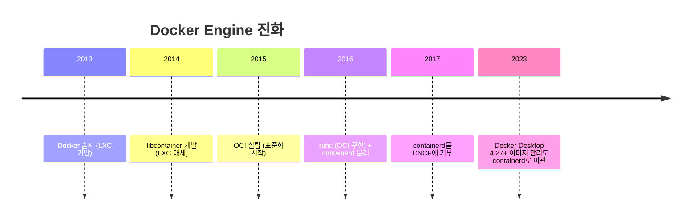

**LXC에서 libcontainer로 전환한 이유는?** LXC는 Linux 전용이어서 멀티플랫폼 지원이 불가능했고, LXC 프로젝트 발전 방향을 Docker가 제어할 수 없었다. libcontainer는 플랫폼 독립적이고 Docker가 직접 관리할 수 있는 도구였다.

---

## 2. 모듈화된 아키텍처

### 2.1 전체 구조

Docker Engine은 4개의 핵심 레이어로 구성된다.

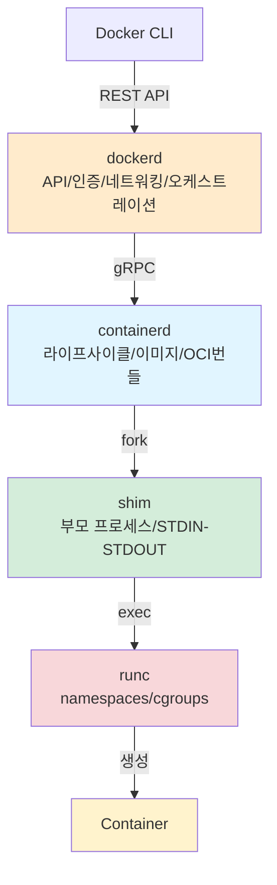

| 컴포넌트 | 역할 | 통신 방식 |
|---------|------|----------|
| **dockerd** | API 서버, 인증, 네트워킹, 오케스트레이션 | REST API (CLI ↔ dockerd) |
| **containerd** | 컨테이너 라이프사이클, 이미지 관리 | gRPC (dockerd ↔ containerd) |
| **shim** | 컨테이너 부모 프로세스, 상태 보고 | Process fork |
| **runc** | 커널 인터페이스, namespaces/cgroups 생성 | 컨테이너 생성 후 종료 |

**왜 이렇게 많은 레이어가 필요한가?** 각 레이어는 명확한 책임을 가진다. dockerd는 네트워킹 같은 고수준 기능을, containerd는 컨테이너 관리를, runc는 저수준 커널 작업을 담당한다. 이로 인해 Docker 데몬 재시작 시에도 컨테이너가 영향받지 않는다.

### 2.2 OCI 표준의 영향

2015년 설립된 OCI(Open Container Initiative)는 컨테이너 표준을 정의했고, Docker는 이를 준수하도록 엔진을 재구성했다.

| OCI 표준 | 현재 버전 | Docker 구현 | 역할 |
|---------|----------|------------|------|
| **runtime-spec** | v1.2.0 | runc | 컨테이너 생성/실행 표준 |
| **image-spec** | v1.1.0 | BuildKit | 이미지 형식 표준 |
| **distribution-spec** | v1.1.0 | Docker Hub | 이미지 배포 표준 |

**OCI 표준이 Docker에 준 이점은?** 표준 준수로 Kubernetes, Podman, CRI-O 등 다른 도구와 호환성을 보장하고, 생태계 전체가 동일한 이미지와 런타임을 공유할 수 있게 되었다.

---

## 3. containerd (고수준 런타임)

### 3.1 핵심 역할

containerd는 **컨테이너 라이프사이클 전체를 관리**하는 고수준 런타임이다.

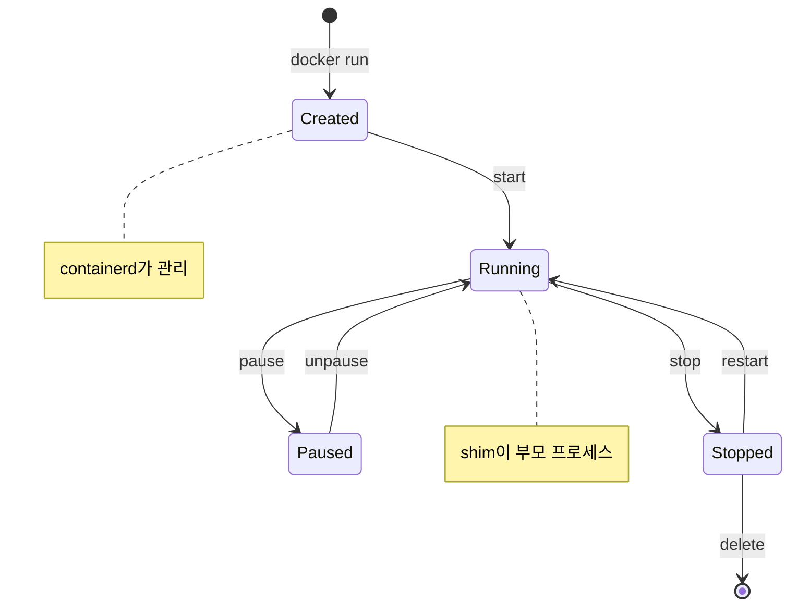

**containerd가 관리하는 것들:**
1. **컨테이너 라이프사이클**: 생성, 시작, 일시정지, 중지, 삭제
2. **이미지 관리**: Pull, Push, 로컬 저장소 관리
3. **OCI 번들 생성**: Docker 이미지 → OCI 표준 번들 변환
4. **네트워크/볼륨**: 플러그인 시스템으로 확장 가능

### 3.2 Docker와의 관계

containerd는 원래 Docker의 일부였으나, 2017년 CNCF에 기부되어 Graduated 프로젝트가 되었다. 현재는 **Docker, Kubernetes, AWS Fargate, Firecracker** 등 다양한 프로젝트에서 사용된다.

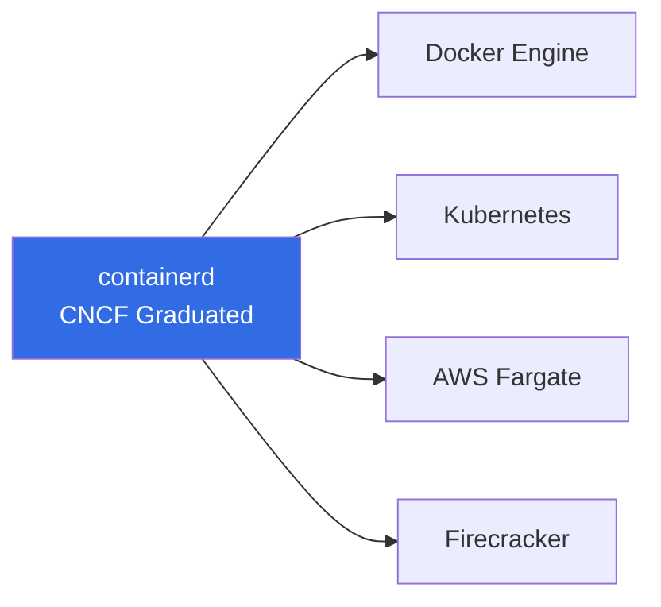

**왜 CNCF에 기부했는가?** Docker가 독점하는 것보다 중립적인 재단에서 관리되면 더 많은 기여자가 참여하고, 커뮤니티 신뢰를 얻을 수 있다. 실제로 Kubernetes는 containerd를 공식 런타임으로 채택했다.

### 3.3 바이너리 위치 및 실행

```bash
# Linux에서 containerd 바이너리
$ which containerd
/usr/bin/containerd

# containerd 프로세스 확인
$ ps aux | grep containerd
root      1234  0.2  1.5  containerd

# containerd 버전 확인
$ containerd --version
containerd github.com/containerd/containerd v1.7.13
```

---

## 4. runc (저수준 런타임)

### 4.1 핵심 역할

runc는 **OCI runtime-spec의 참조 구현**으로, OS 커널과 직접 인터페이스하여 컨테이너를 생성한다.

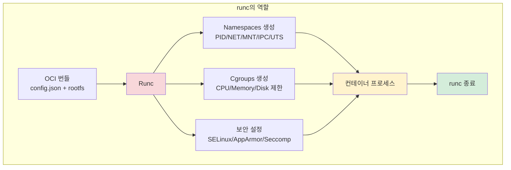

**runc가 컨테이너 생성 후 종료되는 이유는?** 컨테이너는 runc의 자식 프로세스로 시작되지만, runc가 계속 실행될 필요는 없다. 생성 완료 후 shim이 부모 프로세스가 되고, runc는 리소스 절약을 위해 종료된다.

### 4.2 OCI 번들 구조

runc는 **OCI 번들**(config.json + rootfs)을 받아 컨테이너를 생성한다.

```
OCI Bundle/
├── config.json          # 컨테이너 설정
│   ├── process          # 실행할 명령어
│   ├── root             # rootfs 경로
│   ├── mounts           # 마운트 포인트
│   ├── linux            # namespaces, cgroups
│   └── ...
└── rootfs/              # 컨테이너 파일시스템
    ├── bin/
    ├── etc/
    ├── lib/
    └── ...
```

**containerd가 OCI 번들을 만드는 이유는?** runc는 Docker 이미지 형식을 모른다. containerd가 Docker 이미지를 OCI 표준 번들로 변환해야 runc가 처리할 수 있다.

### 4.3 단독 사용 가능

runc는 CLI 도구로 단독 사용할 수 있지만, 이미지 관리, 네트워킹 등은 직접 구성해야 한다.

```bash
# runc 버전 확인
$ runc --version
runc version 1.1.12

# OCI 번들로 컨테이너 생성
$ runc run mycontainer
```

---

## 5. shim (중간 계층)

### 5.1 핵심 역할

shim은 **containerd와 runc 사이의 중간 프로세스**로, 컨테이너의 부모 프로세스 역할을 한다.

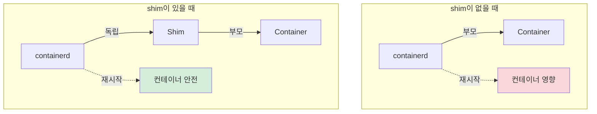

**shim의 3대 역할:**

| 역할 | 설명 | 이점 |
|------|------|------|
| **부모 프로세스** | runc 종료 후 컨테이너의 새 부모가 됨 | runc를 계속 실행할 필요 없음 |
| **STDIN/STDOUT 유지** | 컨테이너 입출력 스트림 관리 | docker logs 등에서 출력 확인 가능 |
| **상태 보고** | 컨테이너 종료 코드를 containerd에 전달 | restart policy 등에서 활용 |

### 5.2 Daemonless Containers

shim 덕분에 **Docker 데몬을 재시작해도 컨테이너가 영향받지 않는다**.

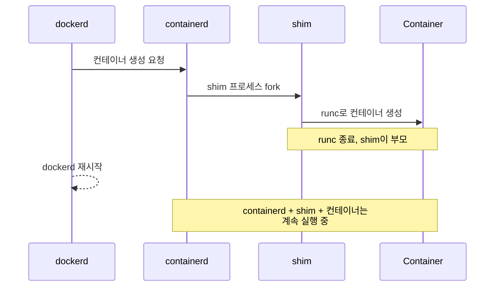

**Daemonless Containers의 이점은?** 운영 환경에서 Docker 데몬 업데이트 시 다운타임이 없고, 실행 중인 컨테이너에 영향을 주지 않는다. 이는 고가용성 시스템에서 필수적이다.

### 5.3 플러그인 가능한 저수준 런타임

shim은 **런타임 인터페이스**를 제공하여 runc 대신 다른 저수준 런타임을 사용할 수 있다.

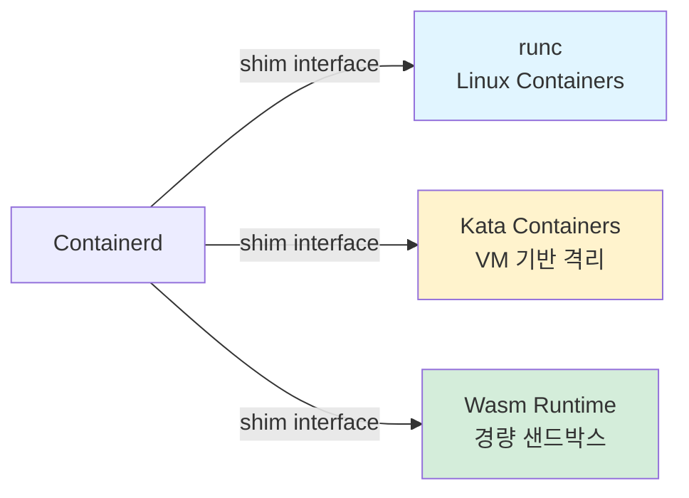

---

## 6. docker run 전체 흐름

### 6.1 단계별 프로세스

```bash
$ docker run -d --name webserver -p 8080:80 nginx:latest
```

위 명령어가 실행되면 다음 단계를 거친다.

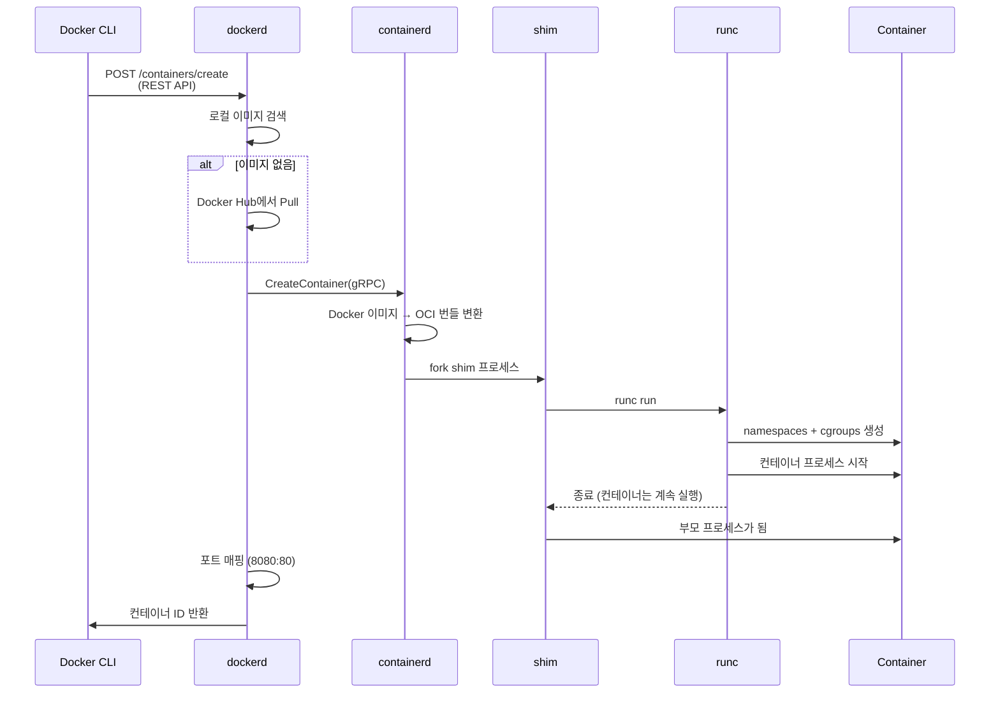

### 6.2 각 단계 상세

| 단계 | 컴포넌트 | 동작 | 비고 |
|-----|---------|------|------|
| 1 | Docker CLI | API 요청 변환 | `/var/run/docker.sock` (Linux) |
| 2 | dockerd | 이미지 검색/Pull | Docker Hub = 기본 레지스트리 |
| 3 | dockerd → containerd | gRPC 호출 | CRUD 스타일 API |
| 4 | containerd | OCI 번들 생성 | config.json + rootfs |
| 5 | shim | fork 및 runc 실행 | 컨테이너마다 shim 프로세스 1개 |
| 6 | runc | namespaces/cgroups 생성 | 커널과 직접 통신 |
| 7 | runc | 컨테이너 시작 후 종료 | **runc는 더 이상 실행되지 않음** |
| 8 | shim | 부모 프로세스 역할 | STDIN/STDOUT 유지 |
| 9 | dockerd | 네트워크 설정 | 포트 매핑, 브릿지 네트워크 |

**runc가 종료된 후 컨테이너는 어떻게 실행되는가?** 컨테이너는 runc의 자식 프로세스로 시작되지만, runc 종료 시 shim이 새 부모가 된다(프로세스 re-parenting). 컨테이너는 독립적인 namespaces 안에서 계속 실행된다.

### 6.3 프로세스 트리 확인

```bash
# Linux에서 프로세스 트리 확인
$ ps aux | grep -E 'dockerd|containerd|shim|nginx'

root      1234  dockerd
root      1235  containerd
root      5678  containerd-shim-runc-v2 -id webserver
root      5690  nginx: master process
www-data  5691  nginx: worker process

# runc는 실행되지 않음 (이미 종료)
```

---

## 7. 모놀리식에서 모듈화로

### 7.1 초기 아키텍처의 문제점

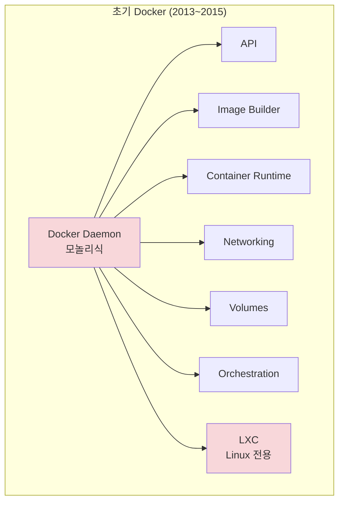

**모놀리식의 3대 문제:**

| 문제 | 원인 | 결과 |
|------|------|------|
| **느린 성능** | 모든 기능이 하나의 바이너리 | 부팅 느림, 메모리 과다 사용 |
| **혁신 어려움** | 한 부분 수정이 전체에 영향 | 빠른 개발/배포 불가 |
| **재사용 불가** | 특정 기능만 분리 불가 | Kubernetes 등에서 사용 불가 |

### 7.2 모듈화의 이점

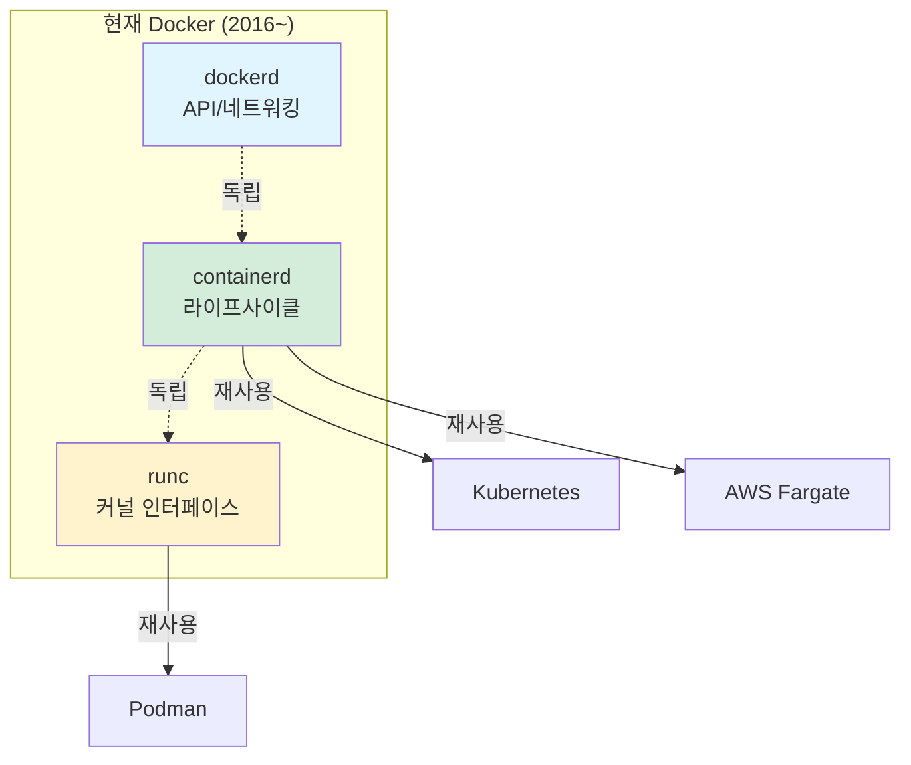

**모듈화가 준 이점:**
1. **독립 개발**: 각 컴포넌트가 독립적으로 발전
2. **재사용성**: Kubernetes가 containerd를 런타임으로 채택
3. **안정성**: shim 덕분에 데몬 재시작 시에도 컨테이너 안전
4. **표준화**: OCI 준수로 생태계 호환성 보장

---

## 8. Linux 바이너리 및 실행

### 8.1 바이너리 위치

```bash
# Docker 컴포넌트 바이너리 위치
$ which dockerd
/usr/bin/dockerd

$ which containerd
/usr/bin/containerd

$ which runc
/usr/bin/runc

$ ls /usr/bin/containerd-shim*
/usr/bin/containerd-shim-runc-v2
```

### 8.2 프로세스 구조 확인

```bash
# 컨테이너 실행
$ docker run -d --name test nginx

# 프로세스 트리
$ pstree -p | grep -A 5 dockerd
dockerd(1234)─┬─containerd(1235)─┬─containerd-shim(5678)─┬─nginx(5690)
              │                   │                        └─nginx(5691)
              │                   └─containerd-shim(5700)─┬─redis(5710)
              └─...

# runc는 표시되지 않음 (이미 종료)
```

**Docker Desktop (Mac/Windows)에서는?** VM 내부에서 Docker Engine이 실행되므로, 호스트에서 직접 프로세스를 확인할 수 없다. `docker context` 명령으로 내부 VM에 접근해야 한다.

---

## 9. 정리

### 9.1 핵심 포인트

| 컴포넌트 | 레벨 | 역할 | 라이프타임 |
|---------|------|------|----------|
| **dockerd** | 최상위 | API, 인증, 네트워킹 | Docker 데몬과 동일 |
| **containerd** | 고수준 런타임 | 라이프사이클, 이미지 | 독립적 (데몬 재시작 무관) |
| **shim** | 중간 계층 | 부모 프로세스, 상태 보고 | 컨테이너와 동일 |
| **runc** | 저수준 런타임 | namespaces, cgroups | 컨테이너 생성 후 종료 |

### 9.2 아키텍처 다이어그램

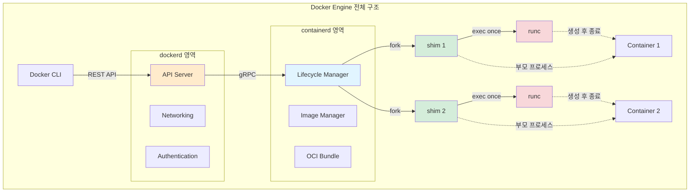

### 9.3 다음 챕터 연결

Ch04에서는 **Docker 이미지**를 다룬다. 이미지는 레이어 시스템으로 구성되며, containerd가 이를 OCI 번들로 변환하여 runc에 전달한다. 이미지 Pull/Push, 레이어 공유, 멀티 아키텍처 지원 등을 학습한다.

---

## 💡 면접 대비 질문

**Q1: docker run 실행 시 각 컴포넌트가 하는 일은?**

```
A:
1. Docker CLI: REST API 요청으로 변환
2. dockerd: 이미지 검색/Pull, containerd에 gRPC 요청
3. containerd: 이미지를 OCI 번들로 변환, shim fork
4. shim: runc 실행 및 부모 프로세스 역할
5. runc: namespaces + cgroups 생성 후 종료
6. dockerd: 네트워크/포트 매핑 설정
```

**Q2: shim이 없으면 어떤 문제가 발생하는가?**

```
A:
1. Daemonless Containers 불가
   - containerd 재시작 시 모든 컨테이너 종료
2. runc를 계속 실행해야 함
   - 컨테이너당 runc 프로세스 유지 (리소스 낭비)
3. 런타임 교체 불가
   - runc 대신 Kata, Wasm 사용 어려움
```

**Q3: OCI 표준이 Docker Engine에 미친 영향은?**

```
A:
1. 모듈화 촉진
   - runc = runtime-spec 참조 구현
   - containerd가 OCI 번들 생성
2. 생태계 호환성
   - Kubernetes, Podman, CRI-O와 호환
3. 안정성 우선
   - 저수준 표준은 천천히 신중하게 발전
```

**Q4: containerd와 runc의 차이는?**

| 구분 | containerd | runc |
|------|-----------|------|
| **레벨** | 고수준 런타임 | 저수준 런타임 |
| **역할** | 라이프사이클 관리 | 커널 인터페이스 |
| **입력** | Docker 이미지 | OCI 번들 |
| **출력** | OCI 번들 | 실행 중인 컨테이너 |
| **라이프타임** | 항상 실행 | 생성 후 종료 |

---

## ✅ 체크리스트

- [ ] Docker Engine = dockerd + containerd + shim + runc
- [ ] containerd는 고수준 런타임 (라이프사이클 관리)
- [ ] runc는 저수준 런타임 (커널 인터페이스)
- [ ] shim은 부모 프로세스 역할 (Daemonless 지원)
- [ ] runc는 컨테이너 생성 후 종료된다
- [ ] OCI 표준 준수로 생태계 호환성 확보
- [ ] 모놀리식 → 모듈화로 진화 (성능/혁신/재사용)
- [ ] docker run의 전체 흐름을 설명할 수 있다

---

## 🔗 참고 자료

- [containerd 공식 문서](https://containerd.io/docs/)
- [runc GitHub](https://github.com/opencontainers/runc)
- [OCI Runtime Spec](https://github.com/opencontainers/runtime-spec)
- [Docker Engine Architecture](https://docs.docker.com/get-started/docker-overview/#docker-architecture)
