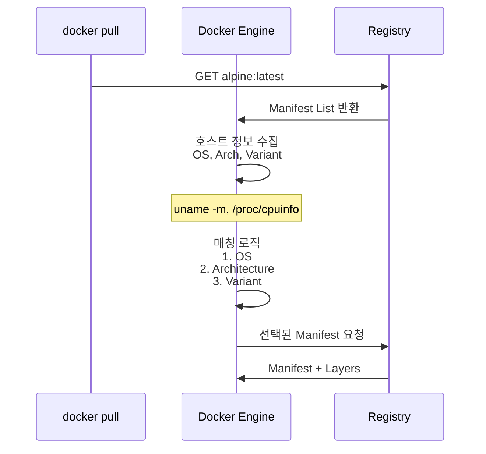
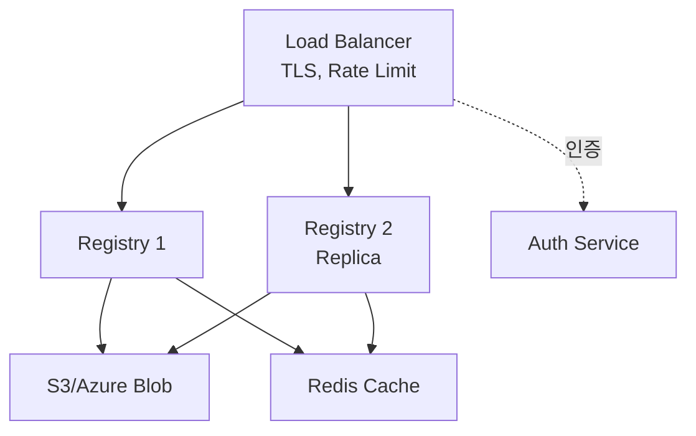
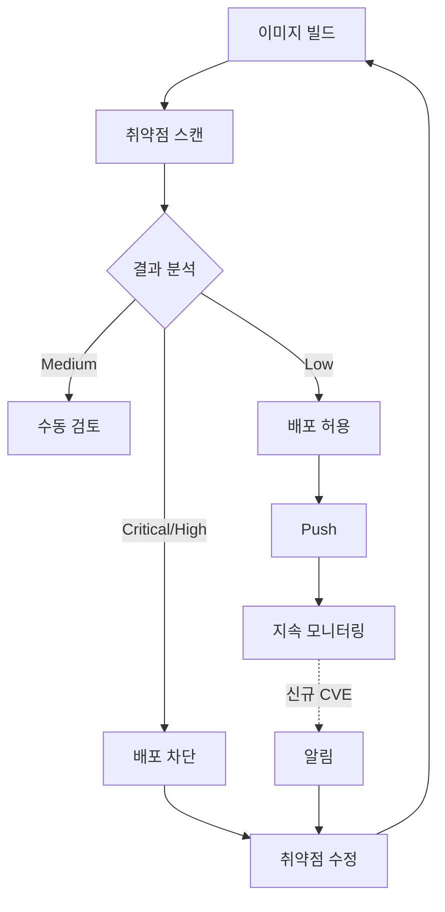
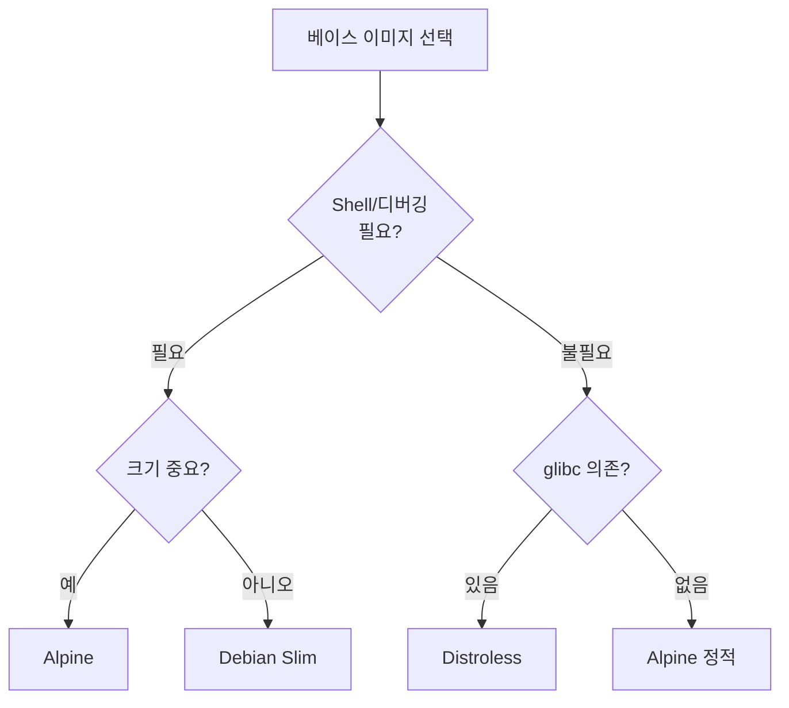

# Ch04. Working with Images - 심화 탐구

> LEARN.md를 학습한 뒤, 더 깊이 파고들어야 할 질문들

---

## Q1. 레이어 공유와 Copy-on-Write의 성능 영향은?

### 왜 이 질문이 중요한가

레이어 시스템의 핵심 메커니즘인 Copy-on-Write(CoW)는 공간 효율성을 제공하지만, 파일 수정 시 복사 오버헤드가 발생한다. 대용량 파일을 다루는 애플리케이션(데이터베이스, 로그 파일, 미디어 처리)에서 CoW의 성능 특성을 이해하지 못하면 예상치 못한 지연이 발생할 수 있다.

### 답변

**Copy-on-Write 동작 방식**

Storage Driver(overlay2)는 파일을 처음 수정할 때 전체 파일을 이미지 레이어에서 R/W 레이어로 복사한 후 수정한다.

```bash
# 1GB 파일 수정 시 CoW 오버헤드 시뮬레이션
$ docker run -it ubuntu bash

# 이미지 레이어에 1GB 파일이 있다고 가정
root@container:/# time echo "modify" >> /bigfile
# 첫 수정: 1GB 전체 복사 → 1-2초 지연
real    0m1.523s

root@container:/# time echo "modify2" >> /bigfile
# 두 번째 수정: R/W 레이어에 이미 있음 → 즉시
real    0m0.003s
```

**Storage Driver별 CoW 성능**

| Driver | CoW 방식 | 파일 단위 | 성능 특성 |
|--------|---------|---------|----------|
| **overlay2** | 파일 레벨 | 전체 파일 복사 | 대용량 파일 불리 |
| **zfs** | 블록 레벨 | 변경된 블록만 | 대용량 파일 유리 |
| **btrfs** | 블록 레벨 | 변경된 블록만 | 대용량 파일 유리 |

**최적화 전략**

1. **Volume 사용 - CoW 우회**:
```bash
# 대용량 데이터는 Volume에 저장
$ docker run -v /data:/app/data myapp
# /app/data는 Volume → CoW 미적용 → 성능 저하 없음
```

2. **Dockerfile 레이어 순서 최적화**:
```dockerfile
# 나쁜 예: 대용량 데이터를 하위 레이어에
FROM ubuntu
COPY ./large-dataset /data    # 100GB
COPY ./app /app               # 앱 수정 시 dataset도 재빌드

# 좋은 예: 자주 변경되는 것을 상위 레이어에
FROM ubuntu
COPY ./app /app               # 상위 레이어
COPY ./large-dataset /data    # 하위 레이어, 캐시 유지
```

3. **tmpfs 사용 - 임시 파일은 메모리에**:
```bash
# 로그 파일을 tmpfs에 저장 → CoW 없음
$ docker run --tmpfs /tmp:rw,size=1g myapp
```

4. **데이터베이스 최적화**:
```yaml
# PostgreSQL은 반드시 Volume 사용
services:
  db:
    image: postgres
    volumes:
      - pgdata:/var/lib/postgresql/data
    # Volume 없으면 모든 DB 쓰기가 CoW 대상 → 성능 급감
volumes:
  pgdata:
```

### 실무 적용

**시나리오 1: 로그 파일 쓰기가 많은 애플리케이션**

문제: 매 로그 쓰기마다 CoW 발생 → 디스크 I/O 급증

해결:
```bash
# tmpfs로 로그를 메모리에 저장
$ docker run --tmpfs /var/log:rw,size=512m myapp

# 또는 Volume으로 로그를 호스트에 저장
$ docker run -v /host/logs:/var/log myapp
```

**시나리오 2: ML 모델 파일(10GB)을 로드하는 애플리케이션**

문제: 모델 파일 수정 시 10GB 전체 복사 → 1-2초 지연

해결:
```bash
# 모델 파일을 별도 Volume으로 마운트
$ docker run -v /host/models:/models myapp
# 이미지에 포함하지 않음
```

---

## Q2. 멀티 아키텍처 이미지의 Manifest List 동작 원리는?

### 왜 이 질문이 중요한가

Docker가 Manifest List에서 자동으로 아키텍처를 선택하는 과정은 대부분 투명하지만, 특정 상황에서 예상과 다른 이미지를 Pull할 수 있다. Apple Silicon Mac에서 Rosetta 2가 활성화된 경우 amd64 이미지가 선택될 수 있고, ARM 서버에서 v7/v8 변형 중 잘못된 것을 선택할 수 있다.

### 답변

**Manifest List 선택 프로세스**



**매칭 기준**

1. **OS 필터링**: linux, windows, darwin
2. **Architecture 매칭**: amd64, arm64, arm, 386
3. **Variant 우선순위** (ARM):
   - arm64/v8 > arm64 (기본값)
   - arm/v7 > arm/v6 > arm

**실제 선택 예시**

```bash
# Manifest List 확인
$ docker buildx imagetools inspect golang:latest
Manifests:
  Platform:  linux/amd64
  Platform:  linux/arm/v7
  Platform:  linux/arm64/v8
  Platform:  windows/amd64

# Apple Silicon Mac (M1/M2)
$ uname -m
arm64
# → Docker가 linux/arm64/v8 자동 선택
```

**특수 케이스**

1. **Rosetta 2 활성화 시**:
```bash
# amd64 이미지 명시적 선택
$ docker pull --platform=linux/amd64 mysql
# arm64 이미지가 있어도 amd64 강제 선택 → Rosetta 2로 실행
```

2. **ARM Variant 충돌**:
```bash
# Raspberry Pi 3 (ARMv7)
$ uname -m
armv7l
# → arm/v7 우선 선택

# 명시적 선택도 가능
$ docker pull --platform=linux/arm/v6 alpine
```

3. **Windows 버전 매칭**:
```json
{
  "platform": {
    "architecture": "amd64",
    "os": "windows",
    "os.version": "10.0.20348"  // 정확히 일치해야 함
  }
}
```

### 실무 적용

**시나리오 1: AWS Graviton(ARM) 서버에 배포**

```bash
# 멀티 아키텍처 빌드
$ docker buildx build \
  --platform=linux/amd64,linux/arm64 \
  -t myapp:latest --push .

# Graviton 서버에서 Pull 시 arm64 자동 선택
```

**시나리오 2: CI/CD에서 일관된 빌드 보장**

```yaml
# GitHub Actions - 아키텍처 고정
- name: Build
  run: |
    docker buildx build \
      --platform=linux/amd64 \
      -t myapp:${{ github.sha }} .
```

**시나리오 3: Kubernetes 혼합 노드**

```yaml
# Manifest List 지원 이미지 사용
spec:
  containers:
  - image: nginx:latest
# amd64 노드 → amd64 이미지
# arm64 노드 → arm64 이미지
```

---

## Q3. 프라이빗 레지스트리 운영 시 보안과 성능 고려사항은?

### 왜 이 질문이 중요한가

Docker Hub 같은 퍼블릭 레지스트리는 Rate Limit, 보안 정책, 네트워크 레이턴시 제약이 있다. 엔터프라이즈 환경에서는 프라이빗 레지스트리를 운영하여 통제력을 확보하는데, 레지스트리 자체의 보안(인증, 인가), 성능(캐싱, 복제), 가용성(백업, 재해복구)을 제대로 설계하지 않으면 CI/CD 파이프라인이 마비될 수 있다.

### 답변

**프라이빗 레지스트리 아키텍처**



**보안 고려사항**

1. **인증 및 인가**:
```yaml
# Docker Registry v2 인증
auth:
  token:
    realm: https://auth.example.com/token
    service: registry.example.com
    issuer: Acme auth server
    rootcertbundle: /certs/auth.crt
```

2. **TLS/SSL 암호화**:
```bash
# Let's Encrypt 인증서
$ certbot certonly --standalone -d registry.example.com

# Registry TLS 설정
docker run -d \
  -v /etc/letsencrypt/live/registry.example.com:/certs \
  -e REGISTRY_HTTP_TLS_CERTIFICATE=/certs/fullchain.pem \
  -e REGISTRY_HTTP_TLS_KEY=/certs/privkey.pem \
  registry:2
```

3. **Vulnerability Scanning**:
```bash
# Harbor 자동 스캔
# Push 시 Trivy 스캔 실행
# Critical 취약점 발견 시 배포 차단
```

**성능 최적화**

1. **Pull-Through Cache**:
```yaml
# Docker Hub 이미지 캐싱
proxy:
  remoteurl: https://registry-1.docker.io
  username: dockerhub-user
  password: dockerhub-password

# 첫 Pull: Docker Hub → Cache
# 이후: Cache에서 직접 제공 → 빠름
```

2. **스토리지 백엔드**:

| 백엔드 | 지연 | 처리량 | 사용 시나리오 |
|--------|-----|--------|--------------|
| **로컬 디스크** | 매우 낮음 | 높음 | 단일 인스턴스 |
| **S3/GCS** | 중간 | 높음 | 멀티 인스턴스 |
| **NFS** | 높음 | 낮음 | 비권장 |

3. **CDN 활용**:
```yaml
# CloudFront + S3
# 글로벌 엣지에서 레이어 캐싱
Cache:
  - /v2/*/blobs/*: TTL 86400 (불변)
  - /v2/*/manifests/*: TTL 300 (단기)
```

4. **가비지 컬렉션**:
```bash
# 오래된 레이어 정리
$ docker exec registry bin/registry garbage-collect \
  /etc/docker/registry/config.yml

# Cron 자동화
0 2 * * 0 docker exec registry bin/registry garbage-collect ...
```

### 실무 적용

**시나리오 1: Harbor로 엔터프라이즈 레지스트리**

- RBAC: 프로젝트별 권한 관리
- Replication: 멀티 리전 복제
- Retention: 90일 이상 태그 자동 삭제
- Webhook: Push 시 Slack 알림

**시나리오 2: Pull-Through Cache로 Rate Limit 우회**

문제: Docker Hub Free는 6시간당 100 Pull 제한

해결:
```yaml
# Registry를 Pull-Through Cache로
proxy:
  remoteurl: https://registry-1.docker.io

# 이후 Pull은 모두 로컬 캐시 → Rate Limit 무관
```

**시나리오 3: 멀티 리전 복제**

```yaml
# Harbor Replication
Source: registry-us.example.com/myapp/*
Destination: registry-asia.example.com/myapp/*
Trigger: Push
# US에 Push → Asia 자동 복제 → 아시아 서버 빠른 Pull
```

---

## Q4. 이미지 취약점 스캐닝 전략과 SBOM 활용법은?

### 왜 이 질문이 중요한가

컨테이너 이미지는 수백 개의 패키지를 포함하며, 각 패키지는 알려진 취약점(CVE)을 가질 수 있다. 취약점 스캐닝을 CI/CD 파이프라인에 통합하지 않으면 프로덕션에 취약한 이미지가 배포되고, 공격자가 이를 악용할 수 있다. SBOM(Software Bill of Materials)을 생성하여 신규 CVE 발표 시 영향받는 이미지를 신속히 식별해야 한다.

### 답변

**취약점 스캐닝 워크플로우**



**주요 스캐닝 도구 비교**

| 도구 | 특징 | SBOM | 속도 | 정확도 |
|------|------|------|------|--------|
| **Trivy** | 오픈소스, 다양한 언어 | ✅ | 빠름 | 높음 |
| **Grype** | Anchore 오픈소스 | ✅ | 매우 빠름 | 높음 |
| **Docker Scout** | Docker 공식, GUI | ✅ | 빠름 | 높음 |
| **Snyk** | 상용, 자동 수정 제안 | ✅ | 중간 | 매우 높음 |

**Trivy 실전 사용**

```bash
# 이미지 스캔
$ trivy image myapp:latest
Total: 45 (CRITICAL: 2, HIGH: 10, MEDIUM: 20, LOW: 13)

# 심각도별 필터링
$ trivy image --severity CRITICAL,HIGH myapp:latest

# JSON 출력 (CI/CD 통합)
$ trivy image -f json -o results.json myapp:latest

# 특정 취약점 무시
$ trivy image --ignorefile .trivyignore myapp:latest

# SBOM 생성
$ trivy image --format spdx-json -o sbom.json myapp:latest
```

**SBOM 활용**

```json
// SPDX 형식 SBOM
{
  "spdxVersion": "SPDX-2.3",
  "packages": [
    {
      "name": "openssl",
      "versionInfo": "3.0.2",
      "supplier": "Organization: OpenSSL"
    }
  ]
}
```

**SBOM 활용 시나리오**

1. **신규 CVE 영향 분석**:
```bash
# CVE-2024-12345가 openssl 3.0.2에 영향
$ grep -r "openssl.*3.0.2" sbom-archive/
# 영향받는 이미지 즉시 식별
```

2. **라이선스 컴플라이언스**:
```bash
# GPL 라이선스 검색 (상용 제품 포함 금지)
$ jq '.packages[] | select(.licenseConcluded | contains("GPL"))' sbom.json
```

**CI/CD 통합**

```yaml
# GitHub Actions
- name: Run Trivy
  uses: aquasecurity/trivy-action@master
  with:
    image-ref: myapp:${{ github.sha }}
    format: 'sarif'
    severity: 'CRITICAL,HIGH'
    exit-code: '1'  # 취약점 발견 시 빌드 실패

- name: Upload to GitHub Security
  uses: github/codeql-action/upload-sarif@v2
  with:
    sarif_file: 'trivy-results.sarif'
```

### 실무 적용

**시나리오 1: 베이스 이미지 선택 시 취약점 비교**

```bash
$ trivy image ubuntu:24.04 | grep Total
Total: 78 (CRITICAL: 0, HIGH: 5, MEDIUM: 30, LOW: 43)

$ trivy image alpine:3.19 | grep Total
Total: 0 (CRITICAL: 0, HIGH: 0, MEDIUM: 0, LOW: 0)

# 결론: Alpine이 가장 적은 취약점
```

**시나리오 2: 자동 패치 워크플로우**

```json
// Renovate Bot으로 베이스 이미지 자동 업데이트
{
  "dockerfile": { "enabled": true },
  "vulnerabilityAlerts": { "enabled": true }
}
// Renovate가 업데이트 PR 생성 → CI 스캔 → 자동 머지
```

**시나리오 3: 프로덕션 이미지 지속 모니터링**

```bash
# 매일 프로덕션 이미지 재스캔
0 2 * * * trivy image --severity CRITICAL,HIGH \
  registry.example.com/myapp:production \
  | mail -s "Daily Vuln Scan" security@example.com
```

---

## Q5. Distroless vs Alpine 이미지 선택 기준은?

### 왜 이 질문이 중요한가

이미지 크기 최적화를 위해 Slim 베이스 이미지를 사용하는 것이 모범 사례지만, Alpine과 Distroless는 서로 다른 철학과 트레이드오프를 가진다. Alpine은 musl libc를 사용하여 호환성 문제가 발생할 수 있고, Distroless는 쉘조차 없어 디버깅이 어렵다.

### 답변

**이미지 철학 비교**

| 특성 | Ubuntu/Debian | Alpine | Distroless |
|------|---------------|--------|------------|
| **철학** | 완전한 OS | 최소 배포판 | 런타임만 |
| **크기** | 78MB | 7MB | 2-50MB |
| **C 라이브러리** | glibc | musl libc | glibc |
| **Shell** | bash, sh | sh | ❌ |
| **패키지 매니저** | apt | apk | ❌ |
| **취약점** | 많음 | 매우 적음 | 매우 적음 |

**Alpine의 호환성 문제**

```dockerfile
FROM alpine:3.19
RUN apk add python3

# 문제 1: musl libc 바이너리 호환성
COPY ./prebuilt-binary /app/binary
# glibc 빌드 바이너리는 작동 안함

# 문제 2: DNS 해석 차이
# musl libc DNS 구현이 다름

# 문제 3: Timezone 데이터 누락
RUN apk add --no-cache tzdata
```

**Distroless의 특징**

```dockerfile
# Shell 없음 → 멀티 스테이지 빌드 필수
FROM python:3.11-slim AS builder
WORKDIR /app
RUN pip install --target=/app/deps -r requirements.txt

FROM gcr.io/distroless/python3-debian12
COPY --from=builder /app/deps /app/deps
COPY ./src /app/src
ENV PYTHONPATH=/app/deps
CMD ["app/src/main.py"]
```

**선택 기준**



**언어별 권장 베이스**

| 언어 | 권장 | 이유 |
|------|------|------|
| **Go** | Distroless Static | 정적 빌드, Shell 불필요 |
| **Node.js** | Alpine | npm 패키지 대부분 호환 |
| **Python** | Distroless | C 확장이 glibc 요구 |
| **Java** | Distroless | JVM은 glibc 필요 |

### 실무 적용

**시나리오 1: Go 애플리케이션**

```dockerfile
FROM golang:1.21-alpine AS builder
WORKDIR /app
COPY . .
RUN go build -ldflags="-w -s" -o /app/binary .

FROM gcr.io/distroless/static-debian12
COPY --from=builder /app/binary /
CMD ["/binary"]
# 크기: 15MB, 취약점: 0개
```

**시나리오 2: Node.js API**

```dockerfile
FROM node:20-alpine
RUN apk add --no-cache tzdata
WORKDIR /app
COPY package*.json ./
RUN npm ci --only=production
COPY . .
CMD ["node", "server.js"]
# 크기: 200MB, 호환성 우수
```

**시나리오 3: Python ML 앱 (glibc 필수)**

```dockerfile
FROM python:3.11-slim AS builder
WORKDIR /app
RUN pip install --target=/app/deps -r requirements.txt

FROM gcr.io/distroless/python3-debian12
COPY --from=builder /app/deps /app/deps
COPY ./src /app/src
ENV PYTHONPATH=/app/deps
CMD ["app/src/main.py"]
# Alpine 사용 불가: numpy, scipy는 glibc 기반
```

---

## Q6. 이미지 태깅 전략과 Immutable Tag 구현은?

### 왜 이 질문이 중요한가

태그는 기본적으로 Mutable하여 같은 태그가 다른 이미지를 가리킬 수 있다. 프로덕션에서 `latest` 태그를 사용하면 롤백 시 어떤 버전으로 돌아갈지 알 수 없고, 재현 불가능한 버그가 발생할 수 있다.

### 답변

**태그 전략 유형**

| 전략 | 예시 | 장점 | 단점 |
|------|------|------|------|
| **latest** | `myapp:latest` | 간단 | 추적 불가 |
| **SemVer** | `myapp:v1.2.3` | 명확 | 수동 관리 |
| **Git SHA** | `myapp:a3f7b2c` | 재현 가능 | 가독성 낮음 |
| **하이브리드** | `myapp:v1.2.3-a3f7b2c` | 버전+재현성 | 긴 태그 |

**Semantic Versioning 전략**

```bash
# 릴리스 빌드
$ docker build -t myapp:v1.2.3 .
$ docker tag myapp:v1.2.3 myapp:v1.2
$ docker tag myapp:v1.2.3 myapp:v1
$ docker push myapp:v1.2.3

# 사용자 선택:
# myapp:v1.2.3 → 정확한 버전 (프로덕션)
# myapp:v1.2 → 패치 업데이트 자동
# myapp:v1 → Minor 업데이트 자동
```

**Git SHA 기반 (CI/CD)**

```yaml
# GitHub Actions
- name: Build
  run: |
    SHORT_SHA=$(git rev-parse --short HEAD)
    docker build -t myapp:${SHORT_SHA} .
    # 태그: myapp:a3f7b2c
```

**Immutable Tag 구현**

```yaml
# Harbor Immutable Rule
Project: myapp
Tag Pattern: v*.*.*
Action: Immutable

# 효과:
# docker push myapp:v1.0.0 (첫 Push) ✅
# docker push myapp:v1.0.0 (재Push) ❌
# "Tag is immutable"
```

**다이제스트 기반 배포**

```yaml
# Kubernetes
spec:
  containers:
  - image: myapp@sha256:a3f7b2c...
# 절대 변경되지 않음

metadata:
  annotations:
    image-tag: v1.2.3  # 가독성
```

### 실무 적용

**시나리오 1: 하이브리드 태깅**

```bash
VERSION=v1.2.3
SHA=$(git rev-parse --short HEAD)

docker build \
  -t myapp:${VERSION} \
  -t myapp:${VERSION}-${SHA} \
  -t myapp:latest \
  .
```

**시나리오 2: 다이제스트 추출**

```bash
$ docker push myapp:v1.2.3
sha256:a3f7b2c...

# Kubernetes에 다이제스트 전달
$ kubectl set image deployment/myapp \
  app=myapp@sha256:a3f7b2c...
```

**시나리오 3: 태그 정책 자동화**

```yaml
# OPA 정책
deny[msg] {
  image := input.request.object.spec.containers[_].image
  endswith(image, ":latest")
  msg := "latest tag not allowed"
}
# latest 태그 프로덕션 배포 차단
```

---

## Q7. 이미지 사이즈 최적화 기법과 레이어 캐싱 전략은?

### 왜 이 질문이 중요한가

이미지 크기가 크면 Pull 시간이 길어져 배포 속도가 느려지고 네트워크 비용이 증가한다. 하지만 무조건 크기만 줄이면 빌드 시간이 증가하거나 캐싱 효율이 떨어질 수 있다. 레이어 순서, 멀티 스테이지 빌드, .dockerignore 활용 등 종합적인 최적화 전략이 필요하다.

### 답변

**이미지 크기 구성**

```bash
$ docker history myapp:latest
IMAGE     CREATED BY                     SIZE
abc123    CMD ["node" "server.js"]       0B
def456    COPY . /app                    150MB
ghi789    RUN npm install                300MB
jkl012    FROM node:20                   1.1GB
# 총: 1.55GB
```

**최적화 기법 1: 베이스 이미지 선택**

```dockerfile
FROM node:20            # 1.1GB
FROM node:20-slim       # 220MB
FROM node:20-alpine     # 135MB
```

**최적화 기법 2: 멀티 스테이지 빌드**

```dockerfile
# 단일 스테이지 (나쁨)
FROM golang:1.21
COPY . .
RUN go build -o binary .
# 결과: 1.2GB

# 멀티 스테이지 (좋음)
FROM golang:1.21 AS builder
COPY . .
RUN go build -o binary .

FROM alpine:3.19
COPY --from=builder /app/binary /binary
# 결과: 15MB
```

**최적화 기법 3: 레이어 순서**

```dockerfile
# 나쁜 예
COPY . .              # 자주 변경
RUN npm install       # 재실행 5분

# 좋은 예
COPY package*.json ./
RUN npm install       # 캐시
COPY . .              # 빌드 5초
```

**최적화 기법 4: RUN 병합**

```dockerfile
# 나쁜 예 (48MB)
RUN apt-get update
RUN apt-get install curl
RUN apt-get install wget
RUN apt-get clean  # 정리해도 이전 레이어 유지

# 좋은 예 (8MB)
RUN apt-get update && \
    apt-get install -y curl wget && \
    apt-get clean && \
    rm -rf /var/lib/apt/lists/*
```

**최적화 기법 5: .dockerignore**

```bash
# .dockerignore
node_modules
.git
*.log
__pycache__

# COPY . . 시 불필요한 파일 제외
# 빌드 컨텍스트 크기 감소 → 전송 빠름
```

**BuildKit 캐시 마운트**

```dockerfile
# syntax=docker/dockerfile:1

FROM node:18
WORKDIR /app
COPY package*.json ./

# npm 캐시 영구 저장
RUN --mount=type=cache,target=/root/.npm \
    npm install

COPY . .
# npm 캐시 재사용 → 빌드 50% 단축
```

### 실무 적용

**시나리오 1: Node.js 앱 (1.5GB → 150MB)**

```dockerfile
# Before: 1.5GB
FROM node:20
COPY . .
RUN npm install

# After: 150MB
FROM node:20-alpine AS builder
WORKDIR /app
COPY package*.json ./
RUN npm ci --only=production

FROM node:20-alpine
COPY --from=builder /app/node_modules ./node_modules
COPY ./src ./src
USER node
CMD ["node", "src/server.js"]
```

**시나리오 2: Python ML (3GB → 800MB)**

```dockerfile
FROM python:3.11-slim AS builder
RUN apt-get update && \
    apt-get install -y gcc && \
    rm -rf /var/lib/apt/lists/*
COPY requirements.txt .
RUN pip install --user --no-cache-dir -r requirements.txt

FROM python:3.11-slim
COPY --from=builder /root/.local /root/.local
COPY ./src /app/src
ENV PATH=/root/.local/bin:$PATH
CMD ["python", "src/main.py"]
```

**시나리오 3: 캐싱 효율 극대화**

```dockerfile
# 의존성 레이어 분리
FROM node:20-alpine

# 1. 시스템 패키지 (거의 변경 안됨)
RUN apk add --no-cache python3 make g++

# 2. 애플리케이션 의존성 (가끔 변경)
COPY package*.json ./
RUN npm ci

# 3. 공통 라이브러리 (가끔 변경)
COPY ./lib ./lib

# 4. 소스 코드 (자주 변경)
COPY ./src ./src

# src 수정 → 1-3 캐시 유지 (5초)
```
