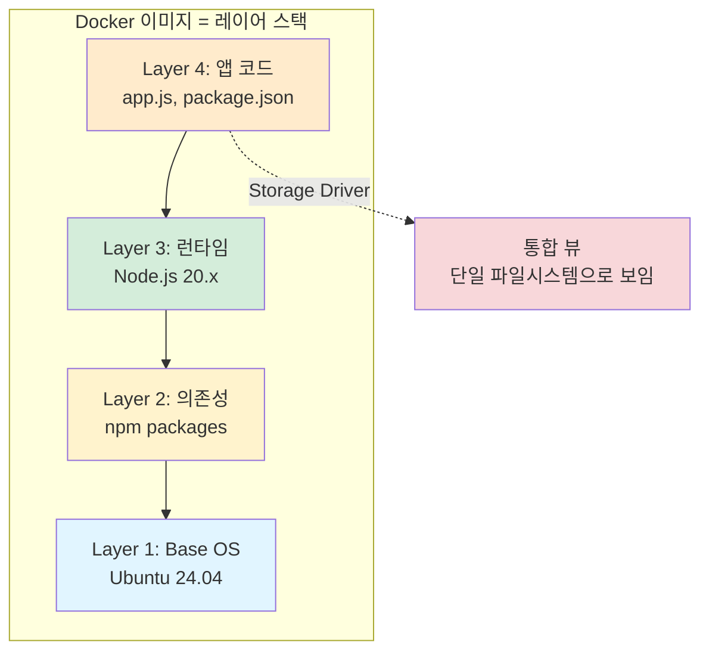
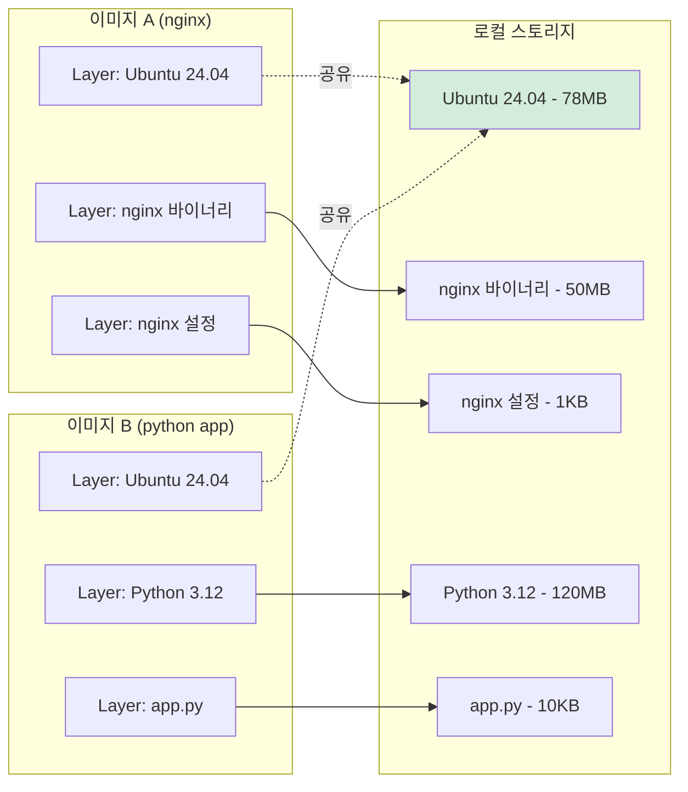
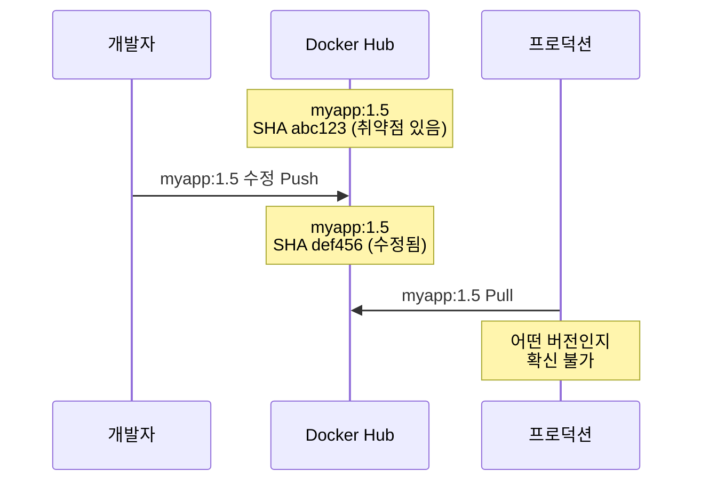
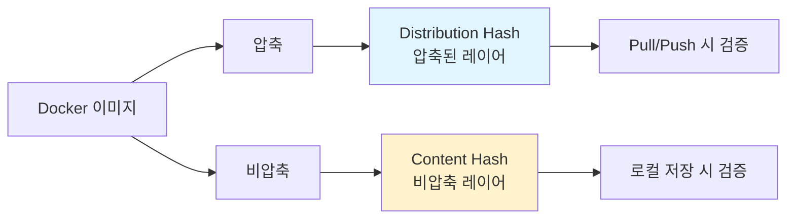
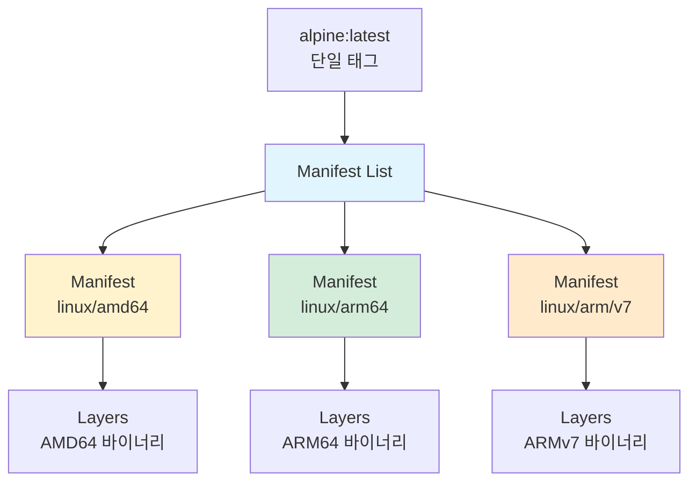
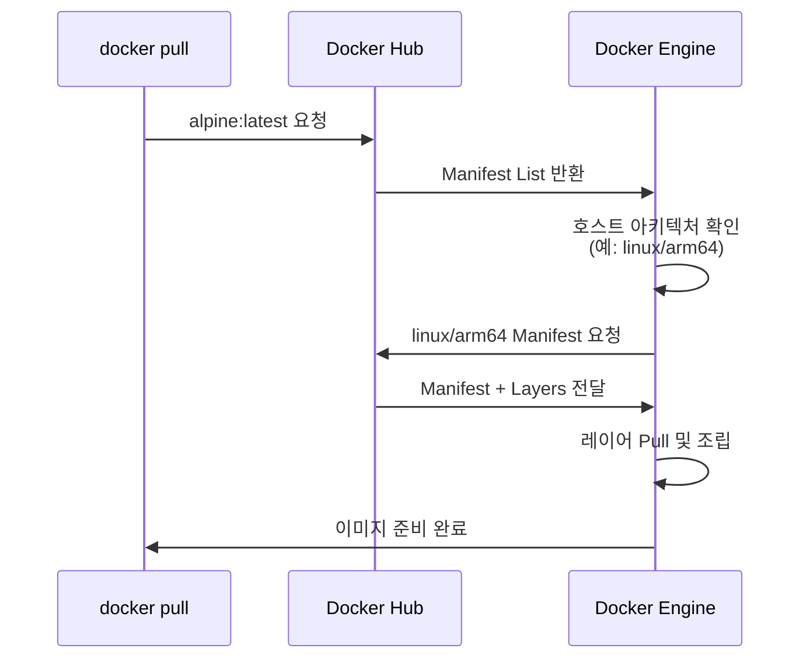
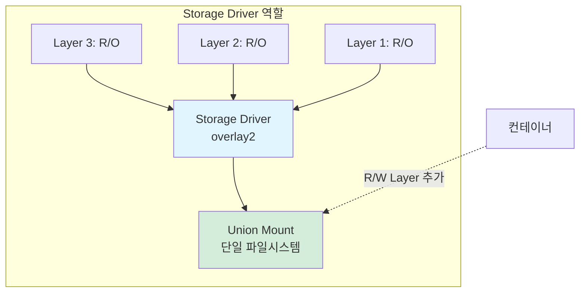
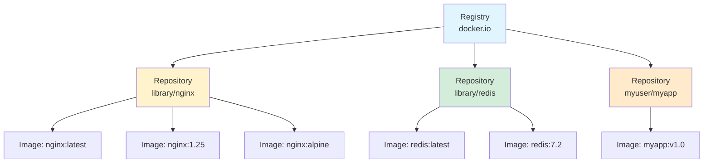
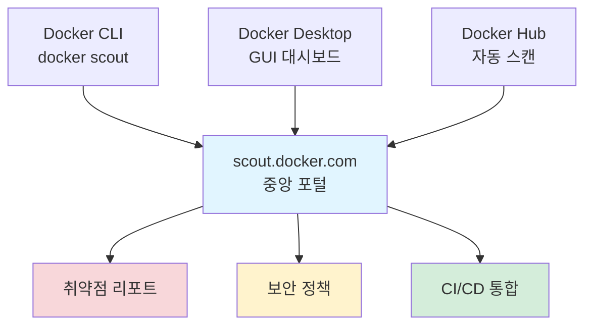
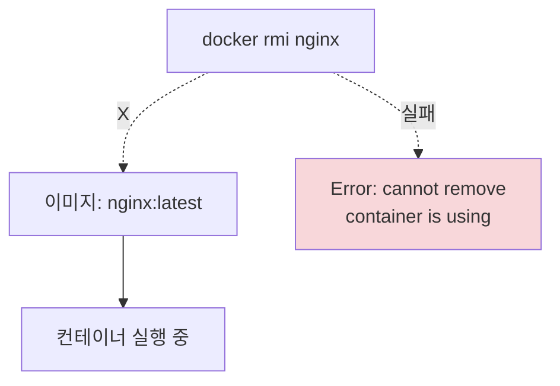

# Ch04. Working with Images

> 📌 **핵심 요약**
> Docker 이미지는 레이어 스택으로 구성된 읽기 전용 패키지다. 레이어 공유로 스토리지와 네트워크를 절약하며, 태그는 변경 가능하지만 다이제스트(SHA256 해시)는 불변이다. Manifest List 구조로 멀티 아키텍처를 지원하고, Docker Scout로 취약점을 스캔할 수 있다.

## 🎯 학습 목표
1. 이미지 레이어 시스템이 효율적인 이유를 설명할 수 있다
2. 태그와 다이제스트의 차이점을 이해하고 용도를 구분할 수 있다
3. 멀티 아키텍처 이미지의 동작 원리를 설명할 수 있다
4. 레이어 공유 메커니즘과 Storage Driver 역할을 이해할 수 있다
5. Official 이미지와 Unofficial 이미지를 구분할 수 있다
6. Docker Scout로 이미지 취약점을 스캔할 수 있다

---

## 1. 이미지 레이어 시스템

### 1.1 레이어 스택 구조

Docker 이미지는 **독립적인 읽기 전용 레이어들의 스택**이다. 각 레이어는 파일시스템의 변경사항을 나타낸다.



**왜 레이어로 나누는가?** 레이어 공유로 스토리지를 절약하고, 변경사항만 전송하여 네트워크 효율을 높인다. 예를 들어, Ubuntu 레이어는 수백 개의 이미지가 공유할 수 있다.

### 1.2 레이어 확인 방법

```bash
# 이미지 Pull 시 레이어 다운로드
$ docker pull redis:latest
08df40659127: Pull complete    # Layer 1
4f4fb700ef54: Already exists    # 공유 레이어 (재다운로드 안함)
c8e2819a981a: Pull complete    # Layer 2
...

# docker inspect로 레이어 SHA 확인
$ docker inspect redis:latest
"RootFS": {
    "Type": "layers",
    "Layers": [
        "sha256:c8a75145...",
        "sha256:c6f2b330...",
        "sha256:055757a1...",
        "sha256:48373480...",
        "sha256:0cad5e07..."
    ]
}

# docker history로 빌드 히스토리 확인
$ docker history redis:latest
IMAGE          CREATED BY                                      SIZE
11c3e418c296   /bin/sh -c #(nop)  CMD ["redis-server"]         0B
<missing>      /bin/sh -c #(nop)  EXPOSE 6379                  0B
<missing>      /bin/sh -c apt-get update && apt-get install    50.8MB
```

### 1.3 레이어 파일 오버레이

상위 레이어의 파일이 하위 레이어의 같은 경로 파일을 **가린다** (오버레이).

```mermaid
graph TB
    subgraph "레이어 오버레이 예시"
        L3[Layer 3<br/>config.json v2.0<br/>새 로그 설정]
        L2[Layer 2<br/>app.js<br/>config.json v1.0]
        L1[Layer 1<br/>lib.so<br/>base files]
    end

    L3 --> L2
    L2 --> L1

    View[통합 뷰<br/>lib.so, base files,<br/>app.js, config.json v2.0]

    L3 -.v1.0 가려짐.-> View

    style L3 fill:#ffebcc
    style View fill:#d4edda
```

**왜 오버레이 방식인가?** 하위 레이어를 수정하지 않고도 파일을 업데이트할 수 있다. 예를 들어, 설정 파일 변경 시 전체 이미지를 재빌드하지 않고 최상위 레이어만 추가한다.

### 1.4 레이어 공유 메커니즘

여러 이미지가 **동일한 레이어를 공유**하여 스토리지를 절약한다.



**레이어 공유의 3대 이점:**

| 이점 | 설명 | 예시 |
|------|------|------|
| **스토리지 절약** | 동일 레이어를 한 번만 저장 | Ubuntu 레이어를 100개 이미지가 공유 → 78MB만 차지 |
| **네트워크 절약** | 이미 있는 레이어는 Pull 스킵 | `Already exists` 메시지 |
| **빌드/Pull 속도** | 캐시된 레이어 재사용 | Dockerfile 변경 시 변경된 레이어만 재빌드 |

---

## 2. 태그 vs 다이제스트

### 2.1 태그의 한계

태그는 **Mutable**(변경 가능)하여 같은 태그가 다른 이미지를 가리킬 수 있다.



**태그의 문제점:**
1. **불확실성**: `latest` 태그가 항상 최신이 아닐 수 있음
2. **변경 추적 불가**: 같은 태그 Pull 시 다른 이미지일 수 있음
3. **보안 위험**: 취약점 수정 후 어느 컨테이너가 구버전인지 불명확

### 2.2 다이제스트 (Content Hash)

다이제스트는 **Immutable**(불변)한 SHA256 해시로 이미지를 정확히 식별한다.

```bash
# 다이제스트 확인
$ docker images --digests alpine
REPOSITORY   TAG     DIGEST                                              IMAGE ID
alpine       latest  sha256:c5b1261d6d3e43071626931fc004f70149...8e1ad6b  c5b1261d6d3e

# 다이제스트로 Pull (@ 사용)
$ docker pull alpine@sha256:c5b1261d6d3e43071626931fc004f70149...8e1ad6b

# 리모트 이미지 다이제스트 확인 (Pull 전)
$ docker buildx imagetools inspect nginx:latest
Digest: sha256:13dd59a0c74e9a147800039b1ff4d612...e2e14b
```

**다이제스트의 이점:**

| 특징 | 설명 | 사용 시점 |
|------|------|----------|
| **불변성** | 내용이 바뀌면 해시도 바뀜 | 프로덕션 배포 |
| **고유성** | 같은 다이제스트 = 같은 이미지 | 컴플라이언스 요구사항 |
| **변조 감지** | 해시 불일치 시 경고 | 보안 감사 |

### 2.3 Content Hash vs Distribution Hash



**왜 두 가지 해시가 있는가?** 네트워크 전송 시에는 압축된 상태로 전송하므로 Distribution Hash를 사용하고, 로컬 저장 시에는 비압축 상태로 저장하므로 Content Hash를 사용한다.

---

## 3. 멀티 아키텍처 이미지

### 3.1 Manifest List 구조

하나의 태그로 **여러 아키텍처 이미지**를 지원한다.



**Manifest List의 이점은?** 개발자는 `docker pull alpine:latest`만 실행하면, Docker가 자동으로 호스트 아키텍처에 맞는 이미지를 선택한다. 동일한 Dockerfile로 멀티 아키텍처 지원이 가능하다.

### 3.2 지원 아키텍처 확인

```bash
# Manifest List 조회
$ docker buildx imagetools inspect alpine
Name:      docker.io/library/alpine:latest
MediaType: application/vnd.docker.distribution.manifest.list.v2+json
Digest:    sha256:c5b1261d...

Manifests:
  Platform:  linux/amd64      # Intel/AMD CPU
  Platform:  linux/arm64/v8   # Apple Silicon, AWS Graviton
  Platform:  linux/arm/v7     # Raspberry Pi
  Platform:  linux/386        # 32비트 x86
  Platform:  linux/ppc64le    # IBM POWER
  Platform:  linux/s390x      # IBM Z

# Go 이미지는 Windows도 지원
$ docker manifest inspect golang | grep 'architecture\|os'
"architecture": "amd64", "os": "linux"
"architecture": "arm64", "os": "linux"
"architecture": "amd64", "os": "windows"
```

### 3.3 Pull 프로세스



**왜 자동 선택이 중요한가?** CI/CD 파이프라인에서 동일한 스크립트가 x86, ARM 환경 모두에서 작동한다. Apple Silicon Mac에서 개발하고 AWS Graviton(ARM) 서버에 배포 시 별도 설정이 필요 없다.

### 3.4 멀티 아키텍처 빌드

```bash
# docker buildx로 멀티 아키텍처 빌드
$ docker buildx build \
  --platform=linux/amd64,linux/arm64,linux/arm/v7 \
  -t myuser/myapp:latest --push .

# 빌드 방식 비교
```

| 방식 | 동작 | 장점 | 단점 |
|------|------|------|------|
| **Emulation (QEMU)** | 로컬에서 다른 아키텍처 에뮬레이션 | 무료, 로컬 가능 | 느림 (10배 이상), 캐시 공유 안됨 |
| **Build Cloud** | 네이티브 하드웨어로 병렬 빌드 | 빠름, 캐시 공유 | 유료 구독 필요 |

---

## 4. Storage Driver

### 4.1 역할

Storage Driver는 **레이어를 단일 파일시스템으로 통합**한다.



**왜 Storage Driver가 필요한가?** 레이어는 독립적인 파일들인데, 컨테이너는 하나의 파일시스템을 봐야 한다. Storage Driver가 레이어를 오버레이하여 통합 뷰를 제공한다.

### 4.2 주요 드라이버

| 드라이버 | 사용 환경 | 특징 | 성능 |
|---------|----------|------|------|
| **overlay2** | 대부분의 Linux | 기본 드라이버, 가장 안정적 | 우수 |
| **zfs** | ZFS 파일시스템 | 스냅샷, 압축, 중복 제거 | 좋음 |
| **btrfs** | Btrfs 파일시스템 | Copy-on-Write, 스냅샷 | 좋음 |
| **vfs** | 테스트 전용 | 레이어 공유 없음 (복사) | 매우 느림 |

```bash
# 현재 Storage Driver 확인
$ docker info | grep "Storage Driver"
Storage Driver: overlay2
```

---

## 5. 레지스트리와 리포지토리

### 5.1 계층 구조



**Registry > Repository > Image 관계:**
- **Registry**: 레지스트리 서버 (예: docker.io, ghcr.io)
- **Repository**: 이미지 저장소 (예: nginx, redis)
- **Image**: 태그별 이미지 (예: nginx:latest, nginx:1.25)

### 5.2 Official vs Unofficial 리포지토리

| 구분 | Official | Unofficial |
|------|----------|------------|
| **Namespace** | `library/` (생략 가능) | `username/` (필수) |
| **예시** | `docker pull nginx`<br/>`= docker pull docker.io/library/nginx` | `docker pull myuser/myapp`<br/>`= docker.io/myuser/myapp` |
| **검증** | Docker와 벤더가 검증 | 검증 없음 |
| **보안** | 최신 패치 보장 | 보장 없음 |
| **문서** | 상세한 문서 | 품질 다양 |
| **배지** | ✅ Docker Official Image | ⚠️ 배지 없음 |

**Official 이미지를 선호하는 이유는?** 보안 패치가 신속하고, 모범 사례를 준수하며, Dockerfile이 공개되어 신뢰할 수 있다.

### 5.3 주요 레지스트리

| 레지스트리 | URL | 제공자 | 특징 |
|-----------|-----|--------|------|
| **Docker Hub** | docker.io | Docker | 기본 레지스트리, Official Images |
| **GHCR** | ghcr.io | GitHub | GitHub 통합, Public 무료 |
| **GCR** | gcr.io | Google | GCP 통합 |
| **ECR** | *.ecr.aws | AWS | AWS 통합, IAM 인증 |
| **ACR** | *.azurecr.io | Microsoft | Azure 통합 |

---

## 6. FQIN (Fully Qualified Image Name)

### 6.1 구조

```
ghcr.io/myorg/myapp:v1.5
├─────┤ ├────┤├────┤├──┤
Registry User  Repo  Tag

완전한 형식:
[registry]/[namespace]/[repository]:[tag]@[digest]
```

**각 구성요소:**

| 요소 | 기본값 | 예시 | 설명 |
|------|--------|------|------|
| **Registry** | docker.io | ghcr.io | 레지스트리 DNS |
| **Namespace** | library | myorg | 사용자/조직명 (Official은 library) |
| **Repository** | 필수 | myapp | 리포지토리명 |
| **Tag** | latest | v1.5 | 이미지 태그 |
| **Digest** | 생략 가능 | @sha256:abc... | 정확한 이미지 지정 |

### 6.2 Pull 예시

```bash
# 최소 형식
$ docker pull nginx
# = docker.io/library/nginx:latest

# 전체 형식
$ docker pull docker.io/library/nginx:1.25@sha256:abc123...

# 다른 레지스트리
$ docker pull ghcr.io/user/app:latest
```

---

## 7. Docker Scout (취약점 스캔)

### 7.1 빠른 개요

```bash
$ docker scout quickview myapp:latest

Target         │  myapp:latest     │    0C     2H     5M     10L
  digest       │  b4210d0aa52f      │
Base image     │  python:3-alpine  │    0C     1H     1M     0L

# C=Critical, H=High, M=Medium, L=Low
```

**Scout가 검사하는 것:**
1. **SBOM (Software Bill of Materials)**: 이미지에 포함된 모든 패키지 목록
2. **CVE (Common Vulnerabilities and Exposures)**: 알려진 취약점
3. **Base 이미지**: 베이스 이미지 취약점 별도 표시

### 7.2 상세 취약점 정보

```bash
$ docker scout cves myapp:latest

## Packages and Vulnerabilities
   0C     1H     1M     0L  expat 2.5.0-r2

    ✗ HIGH CVE-2023-52425
      https://scout.docker.com/v/CVE-2023-52425
      Affected range : <2.6.0-r0
      Fixed version  : 2.6.0-r0    ← 수정 버전 안내

      Recommendation:
      Update to expat:2.6.0-r0
```

### 7.3 통합 환경



**Docker Scout의 이점:**
1. **CI/CD 통합**: GitHub Actions, GitLab CI에서 자동 스캔
2. **정책 기반 블로킹**: Critical 취약점 있으면 배포 차단
3. **수정 권장사항**: 취약점마다 수정 버전 제시

---

## 8. 이미지 삭제

### 8.1 삭제 명령어

```bash
# 이름/태그로 삭제
$ docker rmi nginx:latest

# 짧은 ID로 삭제
$ docker rmi af111729d35a

# 다이제스트로 삭제
$ docker rmi sha256:c5b1261d...f8e1ad6b

# 여러 이미지 삭제
$ docker rmi nginx:latest redis:latest alpine:3.19

# 모든 이미지 삭제 (주의!)
$ docker rmi $(docker images -q) -f
```

### 8.2 삭제 제한사항



**삭제 불가 상황:**
1. **컨테이너 사용 중**: 중지된 컨테이너도 포함
2. **여러 태그 참조**: 모든 태그 삭제 필요

```bash
# 강제 삭제 (-f)
$ docker rmi -f nginx:latest
Untagged: nginx:latest
Deleted: sha256:abc123...

# ⚠️ 컨테이너가 사용 중이면 Dangling Image로 남음
$ docker images
REPOSITORY   TAG       IMAGE ID
<none>       <none>    abc123...    ← Dangling
```

---

## 9. 정리

### 9.1 핵심 개념 비교

| 개념 | 특징 | 비유 | 사용 시점 |
|------|------|------|----------|
| **이미지** | 읽기 전용 패키지 | 클래스 | Build Time |
| **레이어** | 독립적 변경사항 | 레이어 케이크 층 | 빌드 시 생성 |
| **태그** | Mutable 이름 | 별명 | 개발/테스트 |
| **다이제스트** | Immutable 해시 | 주민등록번호 | 프로덕션 |
| **Manifest** | 레이어 목록 | 목차 | 단일 아키텍처 |
| **Manifest List** | 아키텍처별 Manifest | 멀티 에디션 카탈로그 | 멀티 아키텍처 |

### 9.2 명령어 요약

```bash
# 이미지 관리
docker pull <image>               # 다운로드
docker images --digests           # 다이제스트 포함 목록
docker inspect <image>            # 상세 정보
docker history <image>            # 빌드 히스토리
docker rmi <image>                # 삭제

# 멀티 아키텍처
docker buildx imagetools inspect <image>   # 아키텍처 목록
docker manifest inspect <image>            # Manifest 조회

# 취약점 스캔
docker scout quickview <image>    # 빠른 개요
docker scout cves <image>         # 상세 CVE
```

### 9.3 다음 챕터 연결

Ch05에서는 **컨테이너 라이프사이클**을 다룬다. 이미지의 R/W 레이어, PID 1의 역할, 시그널 처리, Restart Policy 등을 학습하며, 이미지가 실행 중인 컨테이너로 변환되는 과정을 이해한다.

---

## 💡 면접 대비 질문

**Q1: 레이어 공유가 효율적인 이유는?**

```
A:
1. 스토리지 절약
   - Ubuntu 레이어(78MB)를 100개 이미지가 공유
   - 실제 디스크 사용: 78MB (100배 절약)

2. 네트워크 절약
   - docker pull 시 "Already exists" 레이어는 스킵
   - 변경된 레이어만 전송

3. 빌드 속도
   - Dockerfile 변경 시 캐시된 레이어 재사용
   - 변경된 레이어부터 재빌드
```

**Q2: 태그 대신 다이제스트를 사용하는 이유는?**

```
A:
태그는 Mutable하여 프로덕션에서 위험:
- myapp:1.5 → 취약점 발견 → 수정 후 재Push
- 같은 태그, 다른 이미지 → 어느 컨테이너가 구버전인지 불명확

다이제스트는 Immutable:
- 내용 변경 → 해시 변경
- 정확한 이미지 보장 → 컴플라이언스 요구사항 충족
```

**Q3: 멀티 아키텍처 이미지의 동작 원리는?**

```
A:
1. Manifest List가 각 아키텍처별 Manifest 참조
2. docker pull alpine:latest 실행
3. Docker Engine이 호스트 아키텍처 확인 (예: linux/arm64)
4. Manifest List에서 linux/arm64 Manifest 선택
5. 해당 Manifest의 레이어만 Pull

이점:
- 동일한 태그로 멀티플랫폼 지원
- CI/CD 스크립트 변경 불필요
```

**Q4: Storage Driver가 하는 일은?**

| 입력 | 처리 | 출력 |
|------|------|------|
| 여러 독립적 레이어 (R/O) | Union Mount | 단일 파일시스템 |
| 컨테이너 R/W 레이어 | Copy-on-Write | 변경사항 격리 |

```
overlay2 동작:
- 하위 레이어: lowerdir (읽기 전용)
- 상위 레이어: upperdir (읽기/쓰기)
- 통합 뷰: merged (컨테이너가 보는 것)
```

---

## ✅ 체크리스트

- [ ] 이미지 = 레이어 스택 (독립적 읽기 전용)
- [ ] 레이어 공유로 스토리지/네트워크 절약
- [ ] 상위 레이어가 하위 파일 오버라이드
- [ ] 태그 = Mutable, 다이제스트 = Immutable
- [ ] Manifest List로 멀티 아키텍처 지원
- [ ] Storage Driver가 레이어를 통합 파일시스템으로
- [ ] Official 이미지 = library/ namespace
- [ ] Docker Scout로 취약점 스캔
- [ ] FQIN = registry/namespace/repo:tag@digest

---

## 🔗 참고 자료

- [Docker Hub Official Images](https://hub.docker.com/search?q=&type=image&image_filter=official)
- [OCI Image Specification](https://github.com/opencontainers/image-spec)
- [Docker Scout Documentation](https://docs.docker.com/scout/)
- [Storage Drivers](https://docs.docker.com/storage/storagedriver/)
