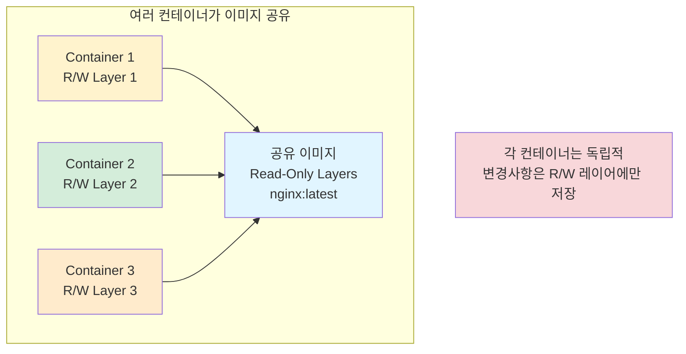
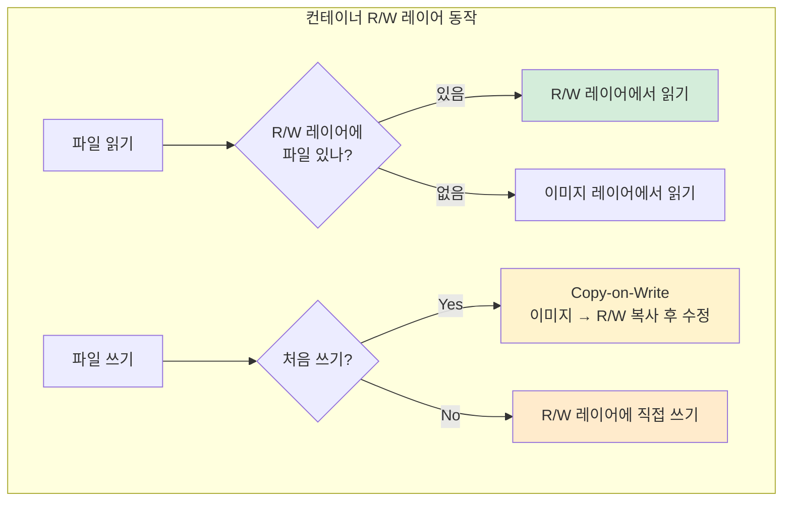
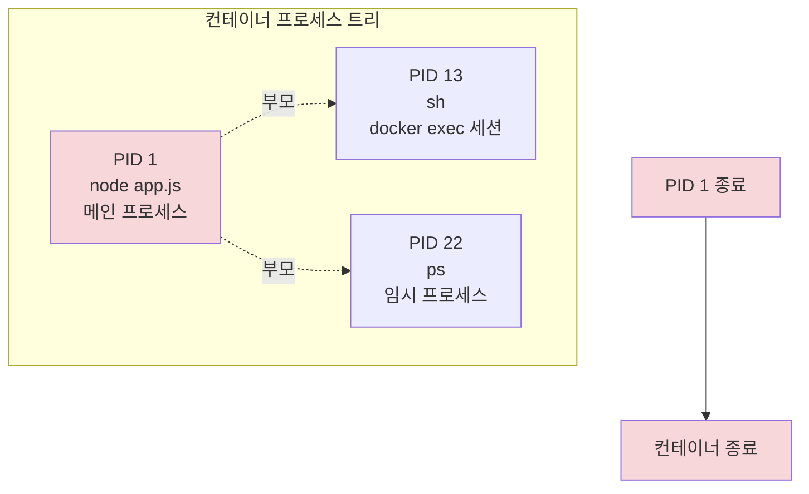
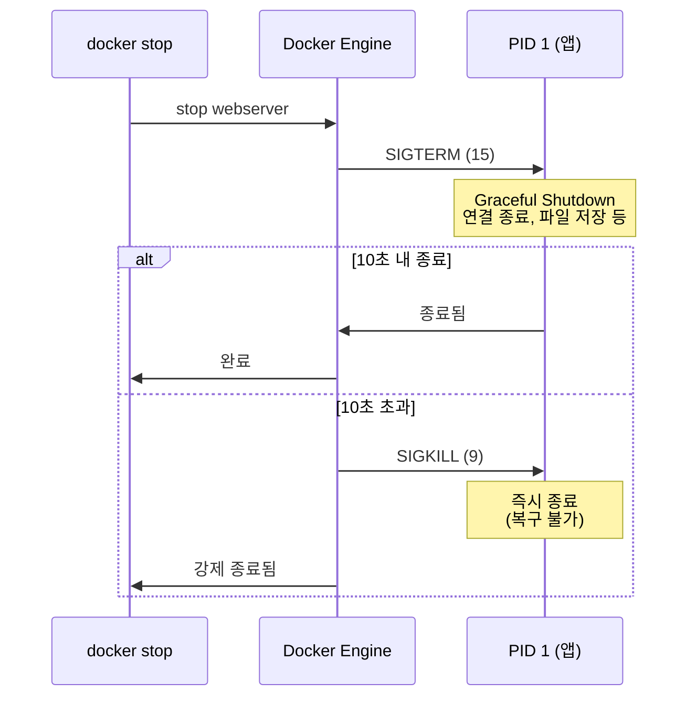
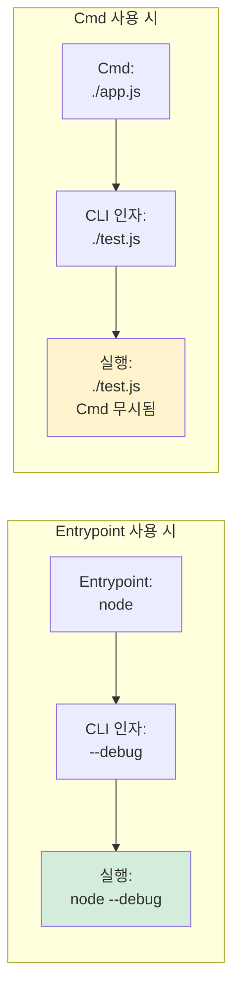
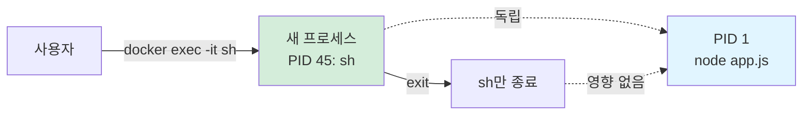
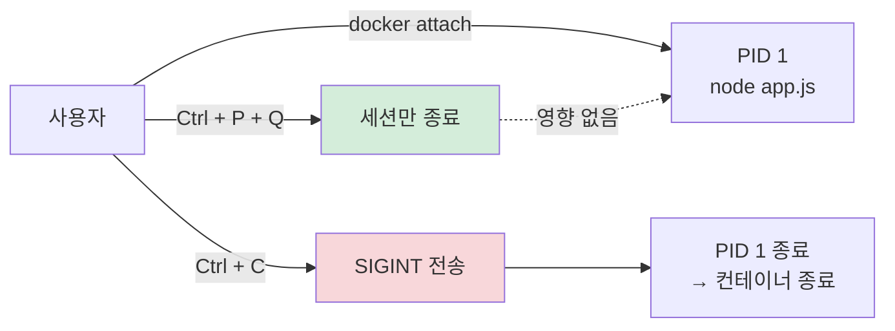
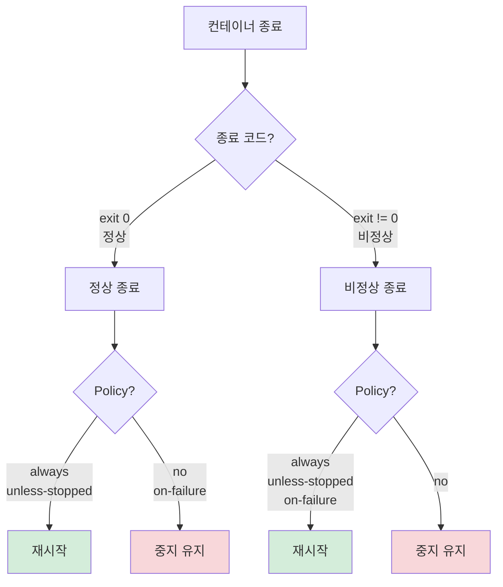
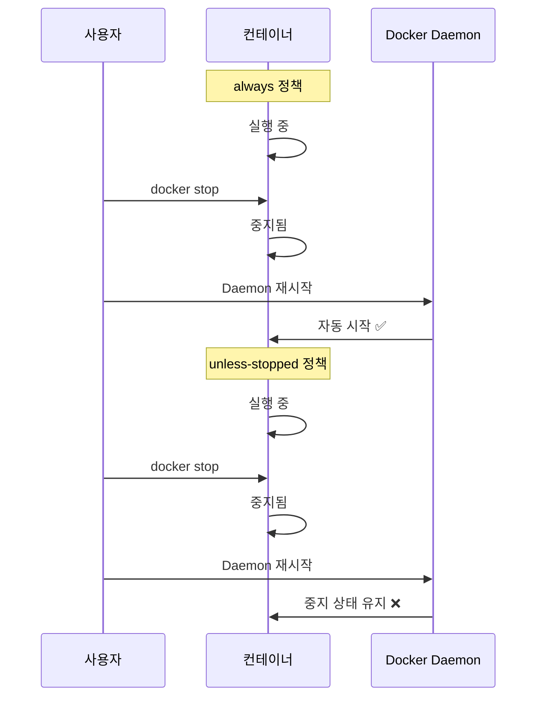
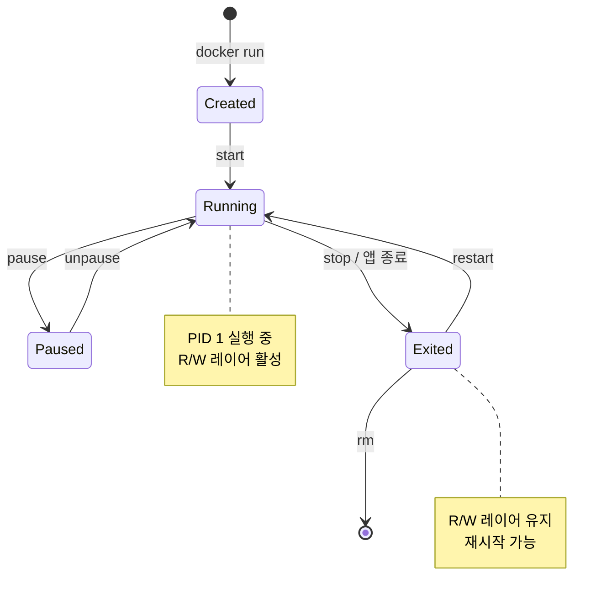

# Ch05. Container Lifecycle

> 📌 **핵심 요약**
> 컨테이너는 이미지의 런타임 인스턴스로, 각자 Thin R/W 레이어를 가진다. PID 1(메인 프로세스)이 종료되면 컨테이너도 종료되며, docker stop은 SIGTERM 후 10초 대기하고 SIGKILL을 보낸다. Restart Policy로 자가 복구를 설정하고, Docker Debug로 Slim 이미지를 디버깅할 수 있다.

## 🎯 학습 목표
1. PID 1의 역할과 시그널 처리 전략을 설명할 수 있다
2. 컨테이너 R/W 레이어와 이미지 레이어의 관계를 이해할 수 있다
3. Entrypoint와 Cmd의 차이점을 구분할 수 있다
4. docker exec와 docker attach의 차이를 설명할 수 있다
5. Restart Policy 4가지를 비교하고 적절히 선택할 수 있다
6. Docker Debug로 Slim 이미지를 디버깅할 수 있다

---

## 1. 컨테이너와 이미지의 관계

### 1.1 이미지 → 여러 컨테이너

하나의 이미지에서 **여러 컨테이너를 생성**할 수 있으며, 각 컨테이너는 독립적인 R/W 레이어를 가진다.



**왜 R/W 레이어를 분리하는가?** 이미지는 읽기 전용이므로 컨테이너가 변경할 수 없다. 각 컨테이너는 자신만의 Thin R/W 레이어에 변경사항을 기록하고, 이미지는 모든 컨테이너가 안전하게 공유한다.

### 1.2 R/W 레이어 동작



**Copy-on-Write가 필요한 이유는?** 이미지 레이어는 읽기 전용이므로 수정 불가하다. 파일을 처음 수정할 때 R/W 레이어로 복사한 후 변경하여, 이미지는 그대로 유지된다.

### 1.3 라이프사이클과 R/W 레이어

| 이벤트 | R/W 레이어 상태 | 변경사항 |
|--------|----------------|----------|
| **docker run** | 생성됨 | 새로운 Thin 레이어 |
| **실행 중 변경** | 누적됨 | 파일 생성/수정/삭제 |
| **docker stop** | 유지됨 | 변경사항 보존 |
| **docker restart** | 복원됨 | 중지 전 상태로 재시작 |
| **docker rm** | 삭제됨 | **변경사항 영구 손실** |

```bash
# R/W 레이어 변경 예시
$ docker run -it --name test ubuntu bash
root@container:/# echo "data" > /tmp/test.txt   # R/W 레이어에 기록
root@container:/# exit

$ docker start -i test
root@container:/# cat /tmp/test.txt
data    # 중지 후 재시작해도 파일 유지

$ docker rm -f test    # 컨테이너 삭제
$ docker run -it --name test ubuntu bash
root@container:/# cat /tmp/test.txt
cat: /tmp/test.txt: No such file or directory   # 새 R/W 레이어
```

---

## 2. PID 1과 프로세스 관리

### 2.1 PID 1의 역할

컨테이너에서 **PID 1은 메인 프로세스**이며, 이 프로세스가 종료되면 컨테이너도 종료된다.



**왜 PID 1이 중요한가?** Linux에서 PID 1은 특수한 역할을 가진다. 컨테이너는 단일 프로세스 실행용으로 설계되었고, PID 1이 종료되면 더 이상 실행할 프로세스가 없으므로 컨테이너도 종료된다.

### 2.2 시그널 처리

```bash
# docker stop 실행 시 시그널 순서
$ docker stop webserver

# 내부 동작:
# 1. PID 1에 SIGTERM 전송 (정상 종료 요청)
# 2. 10초 대기 (Graceful Shutdown)
# 3. 여전히 실행 중이면 SIGKILL 전송 (강제 종료)
```



**SIGTERM 처리가 중요한 이유는?** 애플리케이션이 SIGTERM을 올바르게 처리하면:
1. 진행 중인 요청 완료
2. 데이터베이스 연결 정리
3. 임시 파일 삭제
4. 로그 플러시

SIGKILL은 즉시 종료하므로 데이터 손실 가능성이 있다.

### 2.3 PID 1 확인

```bash
# 컨테이너 접속하여 프로세스 확인
$ docker exec -it webserver sh
/src # ps
PID   USER     TIME  COMMAND
  1   root      0:00 node ./app.js    ← PID 1 = 메인 앱
 13   root      0:00 sh               ← docker exec 세션
 22   root      0:00 ps
```

---

## 3. Entrypoint vs Cmd

### 3.1 차이점

컨테이너 시작 명령을 지정하는 두 가지 방법이다.

| 특성 | Entrypoint | Cmd |
|------|------------|-----|
| **위치** | 이미지 메타데이터 | 이미지 메타데이터 |
| **CLI 오버라이드** | ❌ 불가 (--entrypoint로만 가능) | ✅ 가능 |
| **CLI 인자 처리** | 인자로 추가됨 | 완전히 대체됨 |
| **용도** | 고정 실행 파일 | 기본 인자/명령 |

### 3.2 동작 방식



### 3.3 실제 예시

```dockerfile
# Dockerfile 예시 1: Entrypoint + Cmd
FROM node:20-alpine
ENTRYPOINT ["node"]
CMD ["./app.js"]

# 실행 결과:
# docker run myapp              → node ./app.js
# docker run myapp ./test.js    → node ./test.js (Cmd 대체)
# docker run myapp --inspect    → node --inspect (Cmd 대체)
```

```dockerfile
# Dockerfile 예시 2: Cmd만 사용
FROM ubuntu:24.04
CMD ["bash"]

# 실행 결과:
# docker run myapp              → bash
# docker run myapp sleep 60     → sleep 60 (Cmd 대체)
```

### 3.4 확인 방법

```bash
# Entrypoint/Cmd 확인
$ docker inspect nginx:latest | grep -A 3 Entrypoint
"Entrypoint": [
    "/docker-entrypoint.sh"
],
"Cmd": [
    "nginx",
    "-g",
    "daemon off;"
]

# 실제 실행: /docker-entrypoint.sh nginx -g daemon off;
```

---

## 4. 컨테이너 접속 방법

### 4.1 docker exec vs docker attach

| 명령어 | 대상 프로세스 | 종료 시 컨테이너 | 용도 |
|--------|--------------|----------------|------|
| **docker exec** | 새 프로세스 시작 | 영향 없음 | 디버깅, 관리 작업 |
| **docker attach** | PID 1에 연결 | 종료됨 (PID 1 종료) | 로그 확인, 대화형 앱 |

### 4.2 docker exec (권장)

```bash
# 대화형 세션 (sh 셸 시작)
$ docker exec -it webserver sh
/src # ls -l
/src # cat app.js
/src # exit    # 셸만 종료, 컨테이너는 계속 실행

# 원격 명령 실행 (출력만 확인)
$ docker exec webserver ps
PID   USER     TIME  COMMAND
  1   root      0:00 node ./app.js
 45   root      0:00 ps
```



### 4.3 docker attach (주의 필요)

```bash
# PID 1에 직접 연결
$ docker attach webserver
[앱의 STDOUT 출력 확인]

# Ctrl + C → PID 1 종료 → 컨테이너 종료
# Ctrl + P + Q → 세션만 종료, 컨테이너 계속 실행
```



**docker exec를 권장하는 이유는?** attach는 PID 1에 직접 연결되어 실수로 컨테이너를 종료할 위험이 있다. exec는 독립적인 프로세스를 시작하므로 안전하다.

---

## 5. Restart Policy (자가 복구)

### 5.1 정책 비교

```bash
# Restart Policy 지정
$ docker run --restart <policy> <image>
```

| 정책 | 비정상 종료 | 정상 종료 | docker stop 후 | Daemon 재시작 |
|------|------------|----------|---------------|--------------|
| **no** | ❌ | ❌ | ❌ | ❌ |
| **on-failure** | ✅ | ❌ | ❌ | ✅ |
| **always** | ✅ | ✅ | ❌ | ✅ |
| **unless-stopped** | ✅ | ✅ | ❌ | ❌ |



### 5.2 always vs unless-stopped



**unless-stopped의 사용 시나리오는?** 개발 환경에서 작업 종료 시 명시적으로 중지한 컨테이너는 서버 재부팅 후에도 자동 시작되지 않기를 원할 때 사용한다.

### 5.3 실제 사용 예시

```bash
# always 정책으로 시작
$ docker run --name neversaydie -it --restart always alpine sh
/# exit    # 강제 종료

# 자동 재시작 확인
$ docker ps
CONTAINER ID   IMAGE    COMMAND   STATUS          NAMES
1933623830bb   alpine   "sh"      Up 2 seconds    neversaydie

# RestartCount 확인
$ docker inspect neversaydie | grep RestartCount
"RestartCount": 3,    # 3번 재시작됨

# on-failure에 최대 재시작 횟수 지정
$ docker run --restart on-failure:5 myapp
# 비정상 종료 시 최대 5번만 재시작
```

### 5.4 Docker Compose에서 사용

```yaml
services:
  web:
    image: nginx
    restart: unless-stopped    # 정책 지정

  db:
    image: postgres
    restart: always
```

---

## 6. Docker Debug (Slim 이미지 디버깅)

### 6.1 문제 상황

Slim 이미지는 **Shell, 디버깅 도구가 없어** 접속이 불가능하다.

```bash
# Slim 이미지에서 exec 실패
$ docker exec -it myapp sh
OCI runtime exec failed: exec: "sh": executable file not found

$ docker exec -it myapp bash
OCI runtime exec failed: exec: "bash": executable file not found

# 컨테이너 내부에 도구 없음
$ docker exec myapp ping google.com
exec: "ping": executable file not found
```

### 6.2 Docker Debug 동작 방식

```mermaid
graph TB
    subgraph "Docker Debug 세션"
        Toolbox[/nix/toolbox<br/>임시 마운트<br/>vim, curl, ping 등] -.세션 종료 시 제거.-> Container
        Container[컨테이너<br/>또는 이미지]
    end

    User[사용자] -->|docker debug| Toolbox
    Toolbox --> Commands[디버깅 명령 실행<br/>원본은 수정 안됨]

    style Toolbox fill:#d4edda
    style Container fill:#e1f5ff
    style Commands fill:#fff3cd
```

**Docker Debug의 이점:**
1. **비침투적**: 원본 이미지/컨테이너를 수정하지 않음
2. **임시성**: 디버깅 도구는 세션 종료 시 자동 제거
3. **풍부한 도구**: vim, curl, ping, nslookup 등 제공

### 6.3 사용 예시

```bash
# Docker Debug 시작 (Docker Desktop Pro+ 필요)
$ docker debug myapp

docker > ping google.com
PING google.com (142.250.185.206) 56(84) bytes of data.
64 bytes from google.com: icmp_seq=1 ttl=63 time=10 ms

docker > vim /app/config.json
# Vim 에디터 열림

docker > nslookup api.example.com
Server:   192.168.65.7
Name:     api.example.com
Address:  10.0.1.50

# 추가 도구 설치 (search.nixos.org에서)
docker > install bind
docker > install tcpdump
docker > tcpdump -i eth0

# Entrypoint 확인
docker > entrypoint --print
node ./app.js
```

### 6.4 실행 중 vs 중지된 컨테이너

| 대상 | 변경사항 | 재시작 후 |
|------|---------|----------|
| **실행 중 컨테이너** | 즉시 반영됨 | 유지됨 (R/W 레이어) |
| **이미지/중지 컨테이너** | Sandbox에만 반영 | 삭제됨 |

```bash
# 실행 중 컨테이너 디버깅
$ docker debug running-app
docker > echo "debug=true" >> /app/.env    # 즉시 반영, 재시작 후에도 유지

# 이미지 디버깅
$ docker debug nginx:alpine
docker > echo "test" > /tmp/test.txt    # Sandbox에만 반영
docker > exit
$ docker run nginx:alpine cat /tmp/test.txt
cat: /tmp/test.txt: No such file or directory    # 삭제됨
```

---

## 7. 생명주기 관리

### 7.1 상태 전이 다이어그램



### 7.2 명령어 정리

```bash
# 생명주기 관리
$ docker run -d --name web nginx           # 생성 + 시작
$ docker ps                                # 실행 중 컨테이너
$ docker ps -a                             # 모든 컨테이너

$ docker stop web                          # 정상 종료 (SIGTERM → SIGKILL)
$ docker kill web                          # 강제 종료 (즉시 SIGKILL)
$ docker restart web                       # 재시작 (stop → start)

$ docker pause web                         # 일시정지 (freeze)
$ docker unpause web                       # 재개

$ docker rm web                            # 삭제 (중지 필요)
$ docker rm -f web                         # 강제 삭제 (실행 중이어도)

# 정리
$ docker container prune                   # 중지된 컨테이너 모두 삭제
$ docker rm $(docker ps -aq) -f            # 모든 컨테이너 강제 삭제
```

### 7.3 상태 확인

```bash
# 상세 정보
$ docker inspect web
{
    "State": {
        "Status": "running",
        "Running": true,
        "Paused": false,
        "Restarting": false,
        "OOMKilled": false,
        "Dead": false,
        "Pid": 12345,
        "ExitCode": 0,
        "StartedAt": "2024-02-13T10:30:00Z",
        "FinishedAt": "0001-01-01T00:00:00Z"
    },
    "RestartCount": 0
}
```

---

## 8. 정리

### 8.1 핵심 포인트

| 주제 | 핵심 내용 |
|------|----------|
| **이미지 vs 컨테이너** | Build Time vs Run Time<br/>Read-Only vs R/W Layer |
| **PID 1** | 메인 프로세스, 종료 시 컨테이너도 종료<br/>SIGTERM → SIGKILL (10초 대기) |
| **Entrypoint vs Cmd** | 고정 명령 vs 기본 명령<br/>CLI 인자 추가 vs 대체 |
| **exec vs attach** | 새 프로세스 vs PID 1 연결<br/>안전 vs 위험 |
| **Restart Policy** | no, on-failure, always, unless-stopped<br/>자가 복구 전략 |
| **Docker Debug** | Slim 이미지 디버깅<br/>임시 도구 마운트 |

### 8.2 명령어 요약

```bash
# 생명주기
docker run, stop, start, restart, rm, pause, unpause

# 접속
docker exec -it <container> sh         # 안전한 방법 (권장)
docker attach <container>              # PID 1 연결 (주의)

# 디버깅
docker logs <container>                # 로그 확인
docker inspect <container>             # 상세 정보
docker debug <container>               # Slim 이미지 디버깅

# 정리
docker container prune                 # 중지된 컨테이너 삭제
docker rm $(docker ps -aq) -f          # 모든 컨테이너 강제 삭제
```

### 8.3 다음 챕터 연결

Ch06에서는 **Dockerfile로 이미지 빌드**를 다룬다. FROM, RUN, COPY, ENTRYPOINT, CMD 등 Dockerfile 명령어를 학습하고, 멀티 스테이지 빌드로 이미지 크기를 최적화하는 방법을 익힌다.

---

## 💡 면접 대비 질문

**Q1: PID 1이 종료되면 컨테이너도 종료되는 이유는?**

```
A:
컨테이너는 단일 프로세스 실행을 위해 설계됨:
1. PID 1 = 컨테이너의 메인 앱 프로세스
2. PID 1이 종료 → 더 이상 실행할 프로세스 없음
3. 컨테이너 종료 → R/W 레이어 유지 (rm 전까지)

docker exec로 실행한 프로세스는 PID 1의 자식이므로,
PID 1이 종료되면 자식 프로세스도 함께 종료됨.
```

**Q2: docker stop의 시그널 처리 과정은?**

```
A:
1. SIGTERM (15) 전송
   - Graceful Shutdown 요청
   - 애플리케이션이 정리 작업 수행 (연결 종료, 파일 저장)

2. 10초 대기
   - 앱이 정상 종료될 시간 제공

3. SIGKILL (9) 전송
   - 여전히 실행 중이면 강제 종료
   - 복구 불가능, 데이터 손실 가능

애플리케이션은 SIGTERM을 올바르게 처리해야 함:
- Node.js: process.on('SIGTERM', () => server.close())
- Python: signal.signal(signal.SIGTERM, handler)
```

**Q3: Restart Policy 4가지의 차이는?**

| 정책 | 사용 시나리오 | 예시 |
|------|--------------|------|
| **no** | 수동 관리 필요 | 개발 환경 테스트 |
| **on-failure** | 비정상 종료만 복구 | 크래시 복구가 필요한 앱 |
| **always** | 항상 실행 유지 | 프로덕션 서비스 |
| **unless-stopped** | 명시적 중지 존중 | 개발 환경 서비스 |

```
always vs unless-stopped 차이:
- docker stop 후 Daemon 재시작
  - always: 자동 시작 ✅
  - unless-stopped: 중지 유지 ❌
```

**Q4: docker exec와 docker attach의 차이는?**

| 구분 | docker exec | docker attach |
|------|-------------|---------------|
| **프로세스** | 새 프로세스 시작 | PID 1에 연결 |
| **종료** | exit → 컨테이너 계속 실행 | Ctrl+C → 컨테이너 종료 |
| **용도** | 디버깅, 관리 작업 | 로그 확인, 대화형 앱 |
| **안전성** | ✅ 안전 | ⚠️ 주의 필요 |

```
안전하게 detach하는 방법:
- docker attach: Ctrl + P + Q
- docker exec: exit (새 프로세스만 종료)
```

---

## ✅ 체크리스트

- [ ] 이미지 = Read-Only, 컨테이너 = R/W Layer
- [ ] 각 컨테이너는 독립적인 R/W 레이어 보유
- [ ] PID 1 종료 → 컨테이너 종료
- [ ] docker stop = SIGTERM → 10초 대기 → SIGKILL
- [ ] Entrypoint = 고정 명령, Cmd = 대체 가능
- [ ] docker exec가 docker attach보다 안전
- [ ] Restart Policy: no, on-failure, always, unless-stopped
- [ ] Docker Debug로 Slim 이미지 디버깅 가능
- [ ] docker rm 시 R/W 레이어 삭제됨

---

## 🔗 참고 자료

- [Docker Run Reference](https://docs.docker.com/engine/reference/run/)
- [Docker Debug](https://docs.docker.com/desktop/debug/)
- [Restart Policies](https://docs.docker.com/config/containers/start-containers-automatically/)
- [Signal Handling](https://docs.docker.com/engine/reference/commandline/stop/)
