# Ch06. Containerizing Applications

> 📌 **핵심 요약**
> 프로덕션 수준의 컨테이너 이미지를 만들려면 Dockerfile을 올바르게 설계하고, Multi-stage 빌드로 크기를 최소화하며, Build Cache를 활용해 빌드 시간을 단축해야 한다. 컨테이너화는 단순히 "돌아가게" 만드는 것이 아니라, 작고 빠르고 안전한 프로덕션 이미지를 만드는 과정이다.

## 🎯 학습 목표
1. Dockerfile 작성 원칙과 각 지침의 역할 이해
2. docker init으로 Dockerfile 자동 생성 및 커스터마이징
3. docker build로 이미지를 빌드하고 레이어 구조 분석
4. Multi-stage 빌드로 프로덕션 이미지 최적화
5. Build Cache 메커니즘을 이해하고 활용 전략 수립
6. Buildx와 BuildKit을 사용한 Multi-architecture 이미지 빌드

---

## 1. 컨테이너화 프로세스

### 1.1 5단계 워크플로우

컨테이너화는 애플리케이션을 이미지로 패키징하고 컨테이너로 실행하는 과정이다. 왜 5단계로 나누어 진행할까? 각 단계는 명확한 책임을 가지며, 실패 시 어느 단계에서 문제가 발생했는지 빠르게 파악할 수 있기 때문이다.

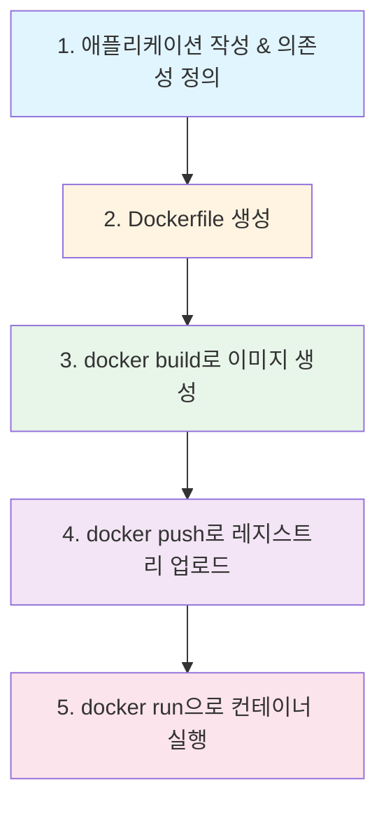

| 단계 | 작업 | 출력물 | 실패 시 확인 사항 |
|------|------|--------|------------------|
| **1. 앱 작성** | 소스 코드, package.json 등 준비 | 소스 파일 | 의존성 목록 정확성 |
| **2. Dockerfile** | 빌드 지침 작성 | Dockerfile | 문법 오류, 경로 확인 |
| **3. Build** | 이미지 생성 | OCI 이미지 | 빌드 로그, 레이어 크기 |
| **4. Push** | 레지스트리 업로드 (선택) | 원격 이미지 | 인증, 태그 형식 |
| **5. Run** | 컨테이너 실행 | 실행 중인 컨테이너 | 포트, 환경변수, 로그 |

### 1.2 왜 Dockerfile이 필요한가?

Dockerfile은 이미지 빌드를 **재현 가능**하고 **문서화**하기 위한 선언적 파일이다. "내 로컬에서는 되는데"를 방지하고, 팀원 누구나 동일한 이미지를 빌드할 수 있게 한다.

**Dockerfile 없이 수동 빌드 시 문제점:**
- 어떤 패키지를 설치했는지 기억 안 남 (재현 불가)
- 여러 서버에 배포 시 일관성 보장 안 됨
- 버전 관리 불가 (Git에 추적할 수 없음)

---

## 2. 단일 컨테이너 앱 빌드

### 2.1 docker init으로 Dockerfile 자동 생성

docker init은 프로젝트 구조를 분석해 최적의 Dockerfile을 자동 생성한다. 왜 자동 생성을 사용할까? 보안 모범 사례(비root 사용자, 최소 이미지 등)가 기본으로 적용되며, 빌드 캐시 최적화 패턴이 포함되어 있기 때문이다.

```bash
$ docker init
Welcome to the Docker Init CLI!

? What application platform does your project use? Node
? What version of Node do you want to use? 23.3.0
? Which package manager do you want to use? npm
? What command do you want to use to start the app? node app.js
? What port does your server listen on? 8080

CREATED: .dockerignore
CREATED: Dockerfile
CREATED: compose.yaml
CREATED: README.Docker.md
```

**자동 생성되는 파일들:**
| 파일 | 역할 | 왜 필요한가? |
|------|------|-------------|
| **Dockerfile** | 이미지 빌드 지침 | 이미지 생성의 레시피 |
| **.dockerignore** | 빌드 컨텍스트 제외 파일 | 빌드 속도 향상, 비밀 정보 보호 |
| **compose.yaml** | 멀티 컨테이너 정의 | 로컬 개발 환경 구성 |
| **README.Docker.md** | 사용 가이드 | 팀원 온보딩 문서 |

### 2.2 Dockerfile 분석

```dockerfile
# 1. Base 이미지 지정 (ARG로 버전 변수화)
ARG NODE_VERSION=20.8.0
FROM node:${NODE_VERSION}-alpine

# 2. Node.js 프로덕션 모드 설정
ENV NODE_ENV production

# 3. 작업 디렉토리 설정
WORKDIR /usr/src/app

# 4. 의존성 설치 (바인드 마운트 & 캐시 활용)
RUN --mount=type=bind,source=package.json,target=package.json \
    --mount=type=bind,source=package-lock.json,target=package-lock.json \
    --mount=type=cache,target=/root/.npm \
    npm ci --omit=dev

# 5. 비root 사용자로 실행
USER node

# 6. 소스 코드 복사
COPY . .

# 7. 포트 문서화
EXPOSE 8080

# 8. 시작 명령
CMD node app.js
```

#### 각 지침의 역할과 이유

**FROM node:alpine을 사용하는 이유:**
- `alpine` 변형은 Ubuntu 기반 이미지(~900MB)보다 훨씬 작음(~150MB)
- 공격 표면(Attack Surface)이 작아 보안상 유리
- 프로덕션 환경에서 불필요한 디버그 도구 제외

**RUN --mount 플래그의 의미:**
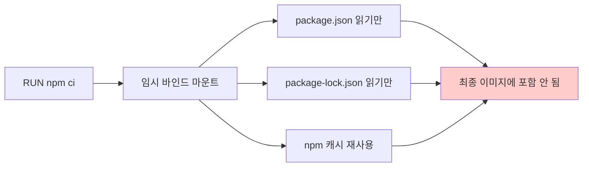

- `type=bind`: 파일을 복사하지 않고 읽기만 (레이어 크기 절약)
- `type=cache`: npm 캐시를 빌드 간 재사용 (다운로드 시간 단축)
- `npm ci --omit=dev`: 프로덕션 의존성만 설치 (devDependencies 제외)

**USER node를 사용하는 이유:**
- root 사용자로 실행 시 컨테이너 탈출 시 호스트 침해 위험
- 비root 사용자는 파일 시스템 쓰기 권한이 제한되어 보안 강화
- Kubernetes 등에서 SecurityContext로 root 실행 차단 가능

### 2.3 Dockerfile 지침 분류

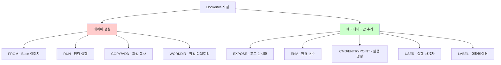

**왜 일부 지침은 레이어를 생성하지 않는가?**
- 메타데이터 지침은 실제 파일 시스템 변경이 없기 때문
- 이미지 메타데이터(JSON)에만 기록되어 크기 증가 없음
- 레이어 수가 적을수록 이미지 Pull/Push 속도 향상

### 2.4 이미지 빌드 및 레이어 구조

```bash
$ docker build -t ddd-book:ch8.node .

[+] Building 16.2s (12/12) FINISHED
 => [internal] load build definition from Dockerfile           0.0s
 => [stage-0 1/4] FROM docker.io/library/node:20.8.0-alpine    3s
 => [stage-0 2/4] WORKDIR /usr/src/app                         0.2s
 => [stage-0 3/4] RUN --mount=type=bind...npm ci --omit=dev    1.1s
 => [stage-0 4/4] COPY . .                                     0.1s
 => exporting to image                                         0.2s
```

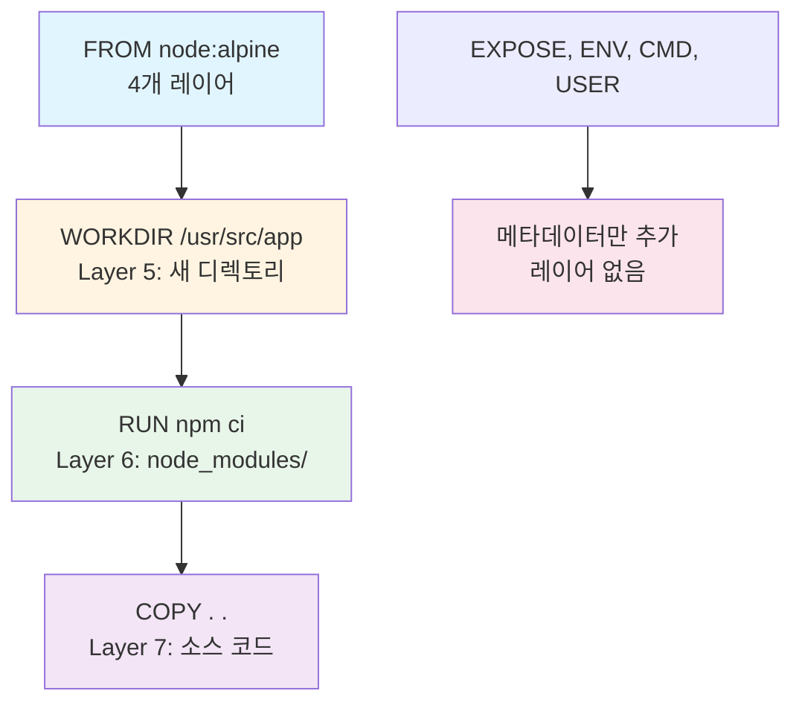

**레이어 확인 명령어:**
```bash
$ docker history ddd-book:ch8.node
IMAGE          CREATED BY                          SIZE
24dd040fa06b   CMD node app.js                     0B        # 메타데이터
<missing>      EXPOSE map[8080/tcp:{}]             0B        # 메타데이터
<missing>      COPY . .                            1.23MB    # 소스 코드
<missing>      USER node                           0B        # 메타데이터
<missing>      RUN npm ci --omit=dev               15.4MB    # node_modules
<missing>      WORKDIR /usr/src/app                0B        # 디렉토리만
<missing>      ENV NODE_ENV=production             0B        # 메타데이터
```

### 2.5 이미지 Push 및 태그 규칙

```bash
# Docker Hub 로그인
$ docker login

# Docker ID를 포함한 태그 추가
$ docker tag ddd-book:ch8.node nigelpoulton/ddd-book:ch8.node

# Push
$ docker push nigelpoulton/ddd-book:ch8.node
```

**태그 형식 분석:**
```
nigelpoulton/ddd-book:ch8.node
├──────────┤├────────┤├───────┤
Docker ID   Repository  Tag

→ Push 대상: docker.io/nigelpoulton/ddd-book:ch8.node
```

**왜 Docker ID가 필요한가?**
- Docker Hub의 네임스페이스 분리 (다른 사용자와 repo 이름 충돌 방지)
- Docker ID 없으면 `docker.io/library/` (공식 이미지 전용) 경로로 시도 → 권한 거부

---

## 3. Multi-stage 빌드

### 3.1 왜 Multi-stage인가?

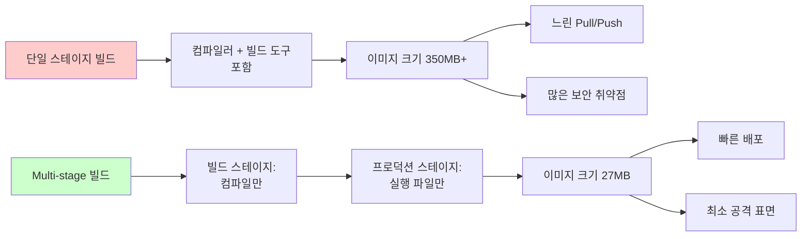

**Big is Bad! 큰 이미지의 문제점:**
1. **느림**: 350MB 이미지는 Pull에 수십 초~분 소요 (배포 지연)
2. **보안**: 더 많은 패키지 = 더 많은 CVE 취약점
3. **비용**: 레지스트리 저장 비용, 네트워크 대역폭 비용 증가

### 3.2 Multi-stage 빌드 개념

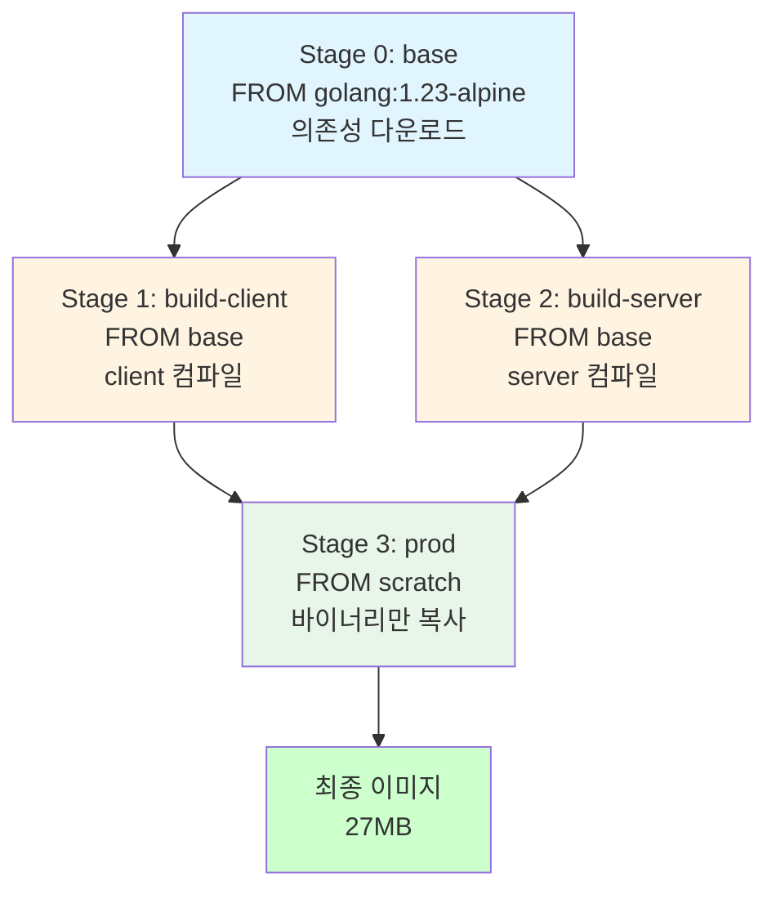

**왜 Stage 1과 2가 병렬 실행되는가?**
- 두 스테이지 모두 `FROM base`로 시작 (동일한 부모)
- 서로 의존성 없음 → BuildKit이 자동으로 병렬 실행
- 빌드 시간 단축 (순차 실행 대비 ~50% 감소)

### 3.3 Multi-stage Dockerfile 작성

```dockerfile
# Stage 0: base - 빌드 환경 준비
FROM golang:1.23.4-alpine AS base
WORKDIR /src
COPY go.mod go.sum .
RUN go mod download
COPY . .

# Stage 1: build-client - 클라이언트 컴파일
FROM base AS build-client
RUN go build -o /bin/client ./cmd/client

# Stage 2: build-server - 서버 컴파일
FROM base AS build-server
RUN go build -o /bin/server ./cmd/server

# Stage 3: prod - 최종 프로덕션 이미지
FROM scratch AS prod
COPY --from=build-client /bin/client /bin/
COPY --from=build-server /bin/server /bin/
ENTRYPOINT [ "/bin/server" ]
```

**각 스테이지의 역할:**

| 스테이지 | FROM | 역할 | 최종 이미지 포함 여부 |
|----------|------|------|----------------------|
| **base** | `golang:alpine` | 의존성 다운로드, 소스 준비 | ❌ |
| **build-client** | `base` | 클라이언트 바이너리 컴파일 | ❌ |
| **build-server** | `base` | 서버 바이너리 컴파일 | ❌ |
| **prod** | `scratch` | 실행 파일만 복사 | ✅ |

**FROM scratch란?**
- Docker의 특수 키워드, 완전히 빈 이미지
- 파일 시스템이 전혀 없음 (OS도 없음)
- Go와 같은 정적 링크 바이너리만 실행 가능
- 최소 크기(~0MB 베이스), 최대 보안

### 3.4 Build Target으로 개별 이미지 생성

```dockerfile
# 클라이언트 전용 프로덕션 스테이지
FROM scratch AS prod-client
COPY --from=build-client /bin/client /bin/
ENTRYPOINT [ "/bin/client" ]

# 서버 전용 프로덕션 스테이지
FROM scratch AS prod-server
COPY --from=build-server /bin/server /bin/
ENTRYPOINT [ "/bin/server" ]
```

```bash
# 각 타겟별로 개별 빌드
$ docker build -t multi:client --target prod-client .
$ docker build -t multi:server --target prod-server .

# 결과 비교
$ docker images
REPOSITORY     TAG       SIZE
multi          full      26.7MB   # client + server
multi          server    11.7MB   # server만
multi          client    11.9MB   # client만
```

**왜 개별 이미지로 분리하는가?**
- 마이크로서비스 아키텍처에서 각 서비스는 별도 컨테이너로 배포
- 클라이언트만 업데이트 시 서버 이미지는 재빌드 불필요
- Kubernetes Pod 단위로 독립 배포 가능

---

## 4. Buildx, BuildKit, Drivers

### 4.1 빌드 아키텍처

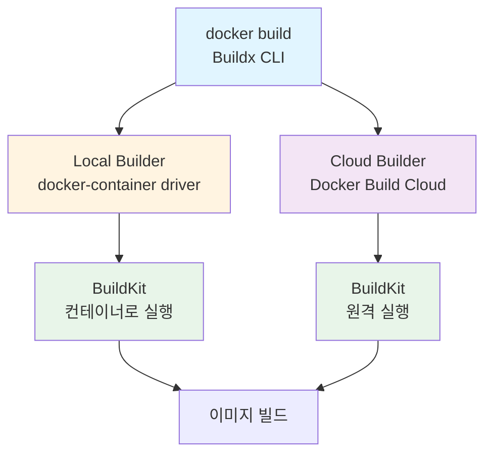

**용어 정리:**
| 용어 | 역할 | 예시 |
|------|------|------|
| **Buildx** | Docker의 빌드 클라이언트 (CLI 플러그인) | `docker buildx build` |
| **BuildKit** | 실제 빌드를 수행하는 서버 | 컨테이너 또는 원격 서비스 |
| **Driver** | BuildKit이 실행되는 환경 | docker-container, cloud, kubernetes |
| **Builder** | Driver + BuildKit 인스턴스 | `container`, `cloud-nigelpoulton` |

### 4.2 Driver 비교

```bash
# 현재 Builder 목록 확인
$ docker buildx ls
NAME/NODE                  DRIVER/ENDPOINT         PLATFORMS
builder *                  docker-container
  builder0                 desktop-linux           linux/arm64, linux/amd64, linux/riscv64...
cloud-nigelpoulton-ddd     cloud
  linux-arm64              cloud://...             linux/arm64*
  linux-amd64              cloud://...             linux/amd64*
```

| Driver | 실행 환경 | 장점 | 단점 | 사용 사례 |
|--------|----------|------|------|----------|
| **docker** | 기본 Docker 데몬 | 간단, 캐시 공유 | Multi-arch 제한 | 로컬 개발 |
| **docker-container** | 전용 BuildKit 컨테이너 | Multi-arch(QEMU), 격리 | 느림(에뮬레이션) | CI/CD |
| **cloud** | Docker Build Cloud | 빠름(네이티브 HW), 캐시 공유 | 유료 | 프로덕션 빌드 |

**왜 docker-container driver가 필요한가?**
- 기본 docker driver는 Multi-architecture 빌드 제한적
- 전용 BuildKit 컨테이너는 QEMU 에뮬레이터로 다른 아키텍처 지원
- 빌드 환경 격리로 충돌 방지

---

## 5. Multi-architecture 빌드

### 5.1 개념

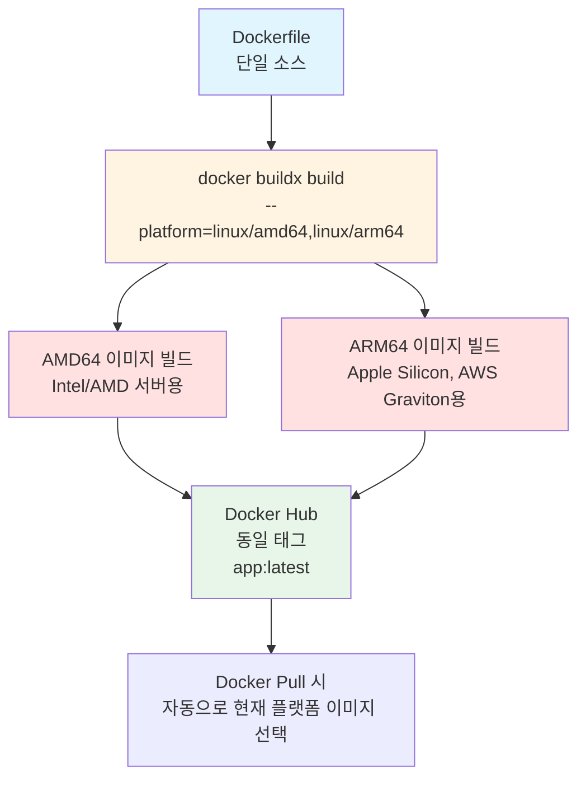

**왜 Multi-architecture 이미지가 필요한가?**
- 개발자는 Mac(ARM64), 운영 서버는 AWS EC2(AMD64)인 경우 흔함
- 단일 태그로 모든 플랫폼 지원 → 사용자 편의성 향상
- Kubernetes 멀티 노드 클러스터에서 ARM/AMD64 혼합 배포 가능

### 5.2 빌드 방법

```bash
# 로컬 Builder로 Multi-arch 빌드 (QEMU 에뮬레이션)
$ docker buildx build --builder=container \
  --platform=linux/amd64,linux/arm64 \
  -t nigelpoulton/ddd-book:ch8.1 --push .

[+] Building 79.3s (26/26) FINISHED
 => [linux/arm64 2/5] RUN apk add --update nodejs npm curl    19.0s  # 느림
 => [linux/amd64 2/5] RUN apk add --update nodejs npm curl    17.4s

# Docker Build Cloud로 빌드 (네이티브 하드웨어)
$ docker buildx build \
  --builder=cloud-nigelpoulton-ddd \
  --platform=linux/amd64,linux/arm64 \
  -t nigelpoulton/ddd-book:ch8.1 --push .
```

**QEMU vs 네이티브 하드웨어:**

| 방식 | 속도 | 안정성 | 비용 | 지원 아키텍처 |
|------|------|--------|------|--------------|
| **QEMU (로컬)** | 느림 (2~10배) | 불안정할 수 있음 | 무료 | 많음 (ARM, RISC-V 등) |
| **Build Cloud** | 빠름 (네이티브) | 안정적 | 유료 | AMD64, ARM64 |

**왜 --push가 필수인가?**
- Multi-arch 이미지는 Manifest List (여러 이미지의 인덱스) 형태
- 로컬 Docker 데몬은 Manifest List를 저장 불가
- 레지스트리만 Manifest List 지원 → --push 필수

---

## 6. Build Cache 활용

### 6.1 Cache 동작 원리

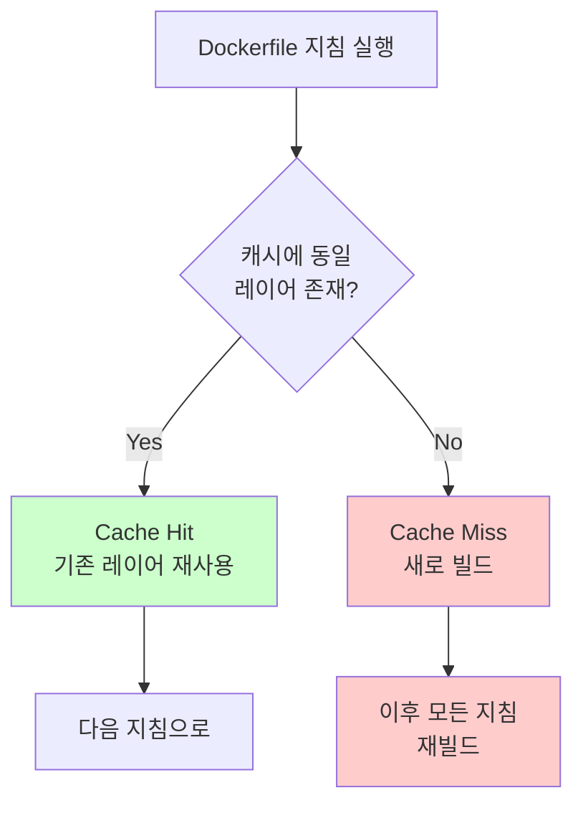

**Cache 무효화 예시:**
```dockerfile
FROM alpine           # ✅ Cache Hit
RUN apk add nodejs    # ✅ Cache Hit
COPY . /src           # ❌ Cache Miss (파일 변경)
WORKDIR /src          # ❌ 재빌드 (Cache 무효화됨)
RUN npm install       # ❌ 재빌드
```

**왜 COPY 이후가 모두 재빌드되는가?**
- Docker는 각 지침의 해시값으로 캐시 키 생성
- COPY의 해시 = 파일 내용 + 메타데이터
- 파일 변경 → 해시 변경 → 캐시 미스 → 이후 캐시 체인 끊김

### 6.2 Dockerfile 최적화 전략

```dockerfile
# ❌ 나쁜 예: 소스 변경 시 npm install도 재실행
FROM alpine
RUN apk add nodejs npm
COPY . /src              # 소스 변경 → Cache Miss
WORKDIR /src
RUN npm install          # 불필요하게 재실행 (의존성 안 바뀌었는데)

# ✅ 좋은 예: 의존성 파일만 먼저 복사
FROM alpine
RUN apk add nodejs npm
WORKDIR /src
COPY package*.json .     # 의존성 파일만 먼저
RUN npm install          # 의존성 변경 시만 재실행
COPY . .                 # 소스는 마지막에
```

**변경 빈도별 레이어 배치:**
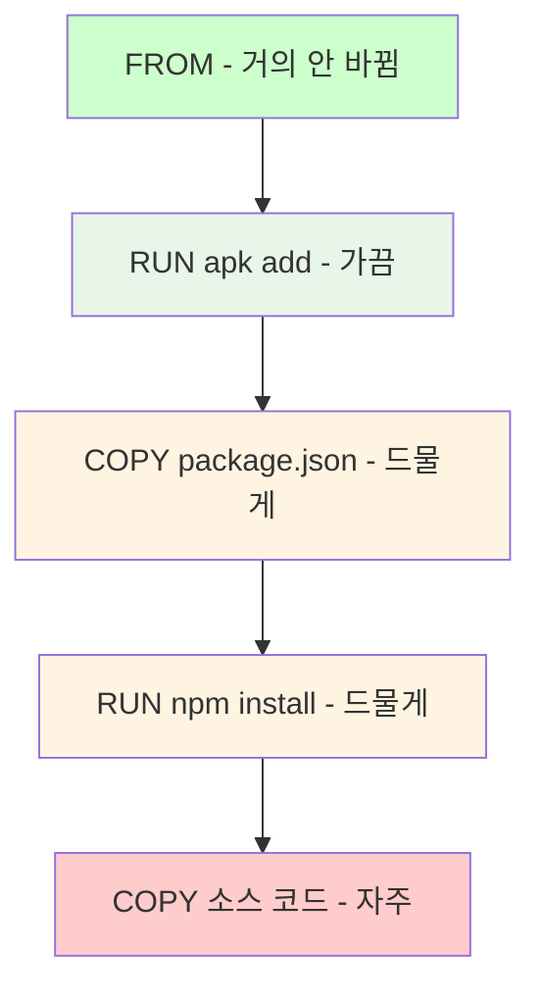

### 6.3 핵심 최적화 규칙

| 규칙 | 설명 | 예시 |
|------|------|------|
| **1. 변경 빈도 순 배치** | 적게 바뀌는 것 위로 | FROM → 패키지 설치 → 의존성 → 소스 |
| **2. 필수 패키지만** | 불필요한 설치 제거 | `apt-get install --no-install-recommends` |
| **3. 레이어 최소화** | 여러 RUN을 하나로 | `RUN apt update && apt install -y curl && rm -rf /var/lib/apt` |
| **4. Multi-stage 사용** | 빌드 도구 제외 | 컴파일 스테이지 → 실행 스테이지 |
| **5. .dockerignore** | 불필요한 파일 제외 | `node_modules`, `.git`, `*.log` |

**.dockerignore 예시:**
```
node_modules/
*.log
.git/
.env
README.md
tests/
```

**왜 .dockerignore가 중요한가?**
- Build Context 크기 감소 → 빌드 속도 향상
- 비밀 정보(.env) 이미지에 포함 방지
- COPY . . 시 불필요한 파일 제외

---

## 7. 주요 Dockerfile 지침 정리

### 7.1 레이어 생성 지침

| 지침 | 문법 | 용도 | 주의사항 |
|------|------|------|----------|
| **FROM** | `FROM node:alpine` | Base 이미지 지정 | alpine 변형 권장 |
| **RUN** | `RUN npm install` | 명령 실행 | 여러 명령은 && 로 연결 |
| **COPY** | `COPY . /app` | 파일 복사 | .dockerignore 활용 |
| **ADD** | `ADD app.tar.gz /app` | 파일 복사 + tar 해제 | COPY 권장 (명확성) |
| **WORKDIR** | `WORKDIR /app` | 작업 디렉토리 설정 | 절대 경로 사용 |

### 7.2 메타데이터 지침

| 지침 | 문법 | 용도 | 주의사항 |
|------|------|------|----------|
| **ENV** | `ENV NODE_ENV=production` | 환경 변수 설정 | 민감 정보는 ARG 사용 |
| **EXPOSE** | `EXPOSE 8080` | 포트 문서화 | 실제 바인딩 안 함 |
| **CMD** | `CMD ["node", "app.js"]` | 기본 실행 명령 | 런타임 시 덮어쓰기 가능 |
| **ENTRYPOINT** | `ENTRYPOINT ["node"]` | 고정 실행 명령 | CMD와 조합 가능 |
| **USER** | `USER node` | 실행 사용자 | 비root 권장 |
| **ARG** | `ARG VERSION=1.0` | 빌드 시 변수 | 런타임 시 사용 불가 |
| **LABEL** | `LABEL version="1.0"` | 메타데이터 | docker inspect로 확인 |

**CMD vs ENTRYPOINT:**
```dockerfile
# CMD만 사용 → 전체 덮어쓰기 가능
CMD ["node", "app.js"]
# docker run myapp python other.py  → python other.py 실행

# ENTRYPOINT + CMD 조합 → 파라미터만 덮어쓰기
ENTRYPOINT ["node"]
CMD ["app.js"]
# docker run myapp other.js  → node other.js 실행
```

---

## 8. 주요 명령어 정리

### 8.1 기본 빌드 명령어

| 명령어 | 설명 | 예시 |
|--------|------|------|
| `docker init` | Dockerfile 자동 생성 | `docker init` |
| `docker build -t <tag> .` | 이미지 빌드 | `docker build -t myapp:1.0 .` |
| `docker build -f <file>` | Dockerfile 지정 | `docker build -f Dockerfile.prod .` |
| `docker build --target <stage>` | 특정 스테이지만 빌드 | `docker build --target prod .` |
| `docker build --no-cache` | 캐시 무시 | `docker build --no-cache .` |
| `docker tag <src> <dst>` | 이미지 태그 추가 | `docker tag myapp:1.0 user/myapp:latest` |
| `docker push <image>` | 레지스트리에 Push | `docker push user/myapp:latest` |
| `docker history <image>` | 빌드 히스토리 확인 | `docker history myapp:1.0` |

### 8.2 Buildx 명령어

| 명령어 | 설명 | 예시 |
|--------|------|------|
| `docker buildx ls` | Builder 목록 확인 | `docker buildx ls` |
| `docker buildx create` | Builder 생성 | `docker buildx create --driver docker-container --name mybuilder` |
| `docker buildx use` | 기본 Builder 설정 | `docker buildx use mybuilder` |
| `docker buildx inspect` | Builder 상세 정보 | `docker buildx inspect mybuilder` |
| `docker buildx build --platform` | Multi-arch 빌드 | `docker buildx build --platform linux/amd64,linux/arm64 -t app:latest --push .` |

---

## 9. 정리

### 9.1 핵심 포인트

1. **Dockerfile은 선언적 빌드 레시피** - 재현 가능하고 버전 관리 가능
2. **Multi-stage 빌드로 크기 최소화** - 빌드 도구 제외, 실행 파일만 포함 (350MB → 27MB)
3. **Build Cache 활용** - 변경 빈도가 낮은 지침을 앞에 배치
4. **비root 사용자 실행** - 보안 강화 (USER node)
5. **alpine 변형 사용** - 작은 이미지 크기, 적은 공격 표면
6. **Multi-architecture 빌드** - 단일 Dockerfile로 AMD64/ARM64 지원

### 9.2 프로덕션 체크리스트

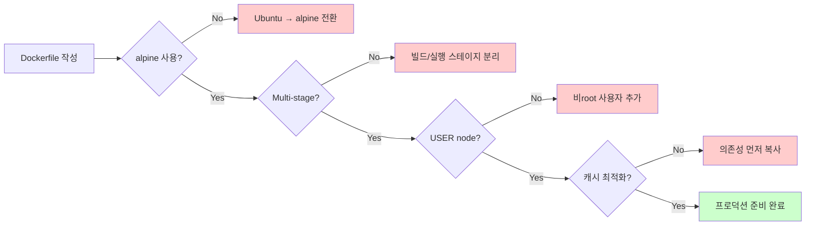

- [ ] alpine 또는 distroless 베이스 이미지 사용
- [ ] Multi-stage 빌드로 최종 이미지 최소화
- [ ] 비root 사용자로 실행 (USER 지시어)
- [ ] .dockerignore로 빌드 컨텍스트 최적화
- [ ] 의존성 파일 먼저 복사 → RUN install → 소스 복사 순서
- [ ] EXPOSE로 포트 문서화
- [ ] Multi-architecture 빌드 (AMD64 + ARM64)

### 9.3 다음 챕터 연결

Ch07에서는 여러 컨테이너를 **Docker Compose**로 선언적으로 관리하는 방법을 학습한다. 단일 컨테이너 최적화를 마쳤으니, 이제 웹 서버 + 데이터베이스 + 캐시로 구성된 멀티 컨테이너 애플리케이션을 YAML 파일 하나로 정의하고 배포해보자.

---

## 🔍 심화 학습

### 면접 대비 질문

**Q1: Dockerfile에서 레이어를 생성하는 지침과 생성하지 않는 지침의 차이는?**
> **A**: FROM, RUN, COPY, ADD, WORKDIR는 파일 시스템에 실제 변경을 가하므로 레이어를 생성한다. 반면 ENV, EXPOSE, CMD, ENTRYPOINT, USER, LABEL은 이미지 메타데이터(JSON)에만 기록되므로 레이어를 생성하지 않는다. 레이어 수가 적을수록 이미지 Pull/Push 속도가 빠르므로, 여러 RUN 명령을 && 로 연결해 단일 레이어로 만드는 것이 좋다.

**Q2: Multi-stage 빌드의 장점과 동작 원리는?**
> **A**: 빌드 도구와 컴파일러가 포함된 큰 빌드 이미지에서 컴파일 후, 실행 파일만 작은 프로덕션 이미지(scratch 또는 alpine)로 복사한다. 이렇게 하면 이미지 크기를 크게 줄일 수 있고(350MB → 27MB), 불필요한 패키지가 없어 보안 취약점도 줄어든다. 또한 의존성 없는 스테이지는 BuildKit이 자동으로 병렬 실행해 빌드 시간도 단축된다.

**Q3: Build Cache를 효과적으로 활용하는 전략은?**
> **A**: 변경 빈도가 낮은 지침을 Dockerfile 앞에 배치한다. 예를 들어 FROM → 패키지 설치 → 의존성 파일 복사 → RUN install → 소스 코드 복사 순서로 작성하면, 소스 코드만 변경 시 앞의 레이어들은 캐시에서 재사용된다. Cache Miss가 발생하면 이후 모든 지침이 재빌드되므로 순서가 매우 중요하다. 또한 .dockerignore로 불필요한 파일을 제외해 COPY 시 캐시 히트율을 높인다.

**Q4: QEMU 기반 Multi-arch 빌드와 Docker Build Cloud의 차이는?**
> **A**: QEMU는 로컬에서 다른 아키텍처를 에뮬레이션해 빌드한다. 무료지만 느리고(2~10배) 불안정할 수 있다. Docker Build Cloud는 실제 ARM64/AMD64 하드웨어에서 네이티브로 빌드하므로 빠르고 안정적이며, 팀원 간 빌드 캐시를 공유할 수 있다. 다만 유료 구독이 필요하다. 프로덕션 빌드는 Build Cloud, 로컬 테스트는 QEMU를 권장한다.

**Q5: alpine 이미지를 권장하는 이유는?**
> **A**: alpine은 Ubuntu 기반 이미지(~900MB)보다 훨씬 작으며(~150MB), 최소한의 패키지만 포함해 공격 표면(Attack Surface)이 작다. 또한 musl libc를 사용해 바이너리 크기도 작다. 프로덕션 환경에서는 불필요한 디버그 도구나 문서가 없어 보안상 유리하다. 다만 일부 패키지가 glibc 의존성이 있을 경우 호환성 문제가 있을 수 있으므로, 이 경우 distroless 이미지를 고려한다.

---

## ✅ 체크포인트

### Dockerfile 작성
- [ ] FROM으로 alpine 베이스 이미지 지정
- [ ] WORKDIR로 작업 디렉토리 설정
- [ ] COPY package.json → RUN install → COPY 소스 순서
- [ ] USER로 비root 사용자 지정
- [ ] EXPOSE로 포트 문서화
- [ ] CMD/ENTRYPOINT로 실행 명령 정의

### Multi-stage 빌드
- [ ] FROM ... AS stage-name으로 스테이지 명명
- [ ] COPY --from=stage-name으로 다른 스테이지에서 복사
- [ ] 빌드 스테이지 vs 프로덕션 스테이지 분리
- [ ] FROM scratch로 최소 프로덕션 이미지

### Build Cache 최적화
- [ ] 변경 빈도 낮은 지침 → 앞에 배치
- [ ] .dockerignore로 불필요한 파일 제외
- [ ] 여러 RUN 명령을 && 로 연결
- [ ] --mount=type=cache로 패키지 캐시 활용

### 빌드 및 배포
- [ ] docker build -t tag . 로 이미지 빌드
- [ ] docker history로 레이어 확인
- [ ] docker tag로 Docker ID 포함 태그 추가
- [ ] docker push로 레지스트리 업로드

### Multi-architecture
- [ ] docker buildx ls로 Builder 확인
- [ ] docker buildx create로 container driver 생성
- [ ] --platform=linux/amd64,linux/arm64로 Multi-arch 빌드
- [ ] --push로 레지스트리에 Manifest List 업로드

---

## 🔗 참고 자료

- [Dockerfile Reference](https://docs.docker.com/engine/reference/builder/)
- [Multi-stage Builds](https://docs.docker.com/build/building/multi-stage/)
- [Docker Buildx](https://docs.docker.com/buildx/working-with-buildx/)
- [Docker Build Cloud](https://docs.docker.com/build-cloud/)
- [Best practices for writing Dockerfiles](https://docs.docker.com/develop/develop-images/dockerfile_best-practices/)
