# Ch07. Multi-container Apps with Compose

> 📌 **핵심 요약**
> Docker Compose는 여러 컨테이너로 구성된 마이크로서비스 애플리케이션을 YAML 파일 하나로 선언적으로 정의하고, 단일 명령어로 배포/관리할 수 있게 해주는 도구다. 복잡한 스크립트나 긴 docker run 명령어 대신, 네트워크, 볼륨, 서비스 설정을 버전 관리 가능한 구성 파일로 관리할 수 있다.

## 🎯 학습 목표
1. Docker Compose의 탄생 배경과 존재 이유 이해
2. compose.yaml 파일 구조(services, networks, volumes) 파악
3. 서비스 정의 속성(build, image, ports, networks, volumes) 작성
4. docker compose 명령어로 앱 배포 및 관리
5. 프로젝트 네이밍 규칙과 리소스 라이프사이클 이해
6. 데이터 영속성과 서비스 간 통신 메커니즘 이해

---

## 1. Docker Compose란?

### 1.1 비유로 이해하기

Compose 파일은 **오케스트라 악보**와 같다. 지휘자(docker compose)가 악보(compose.yaml)를 읽고, 각 악기(컨테이너)들이 언제, 어떻게 연주할지 조율한다. 복잡한 교향곡(마이크로서비스 앱)도 하나의 악보로 완벽하게 연주할 수 있다.

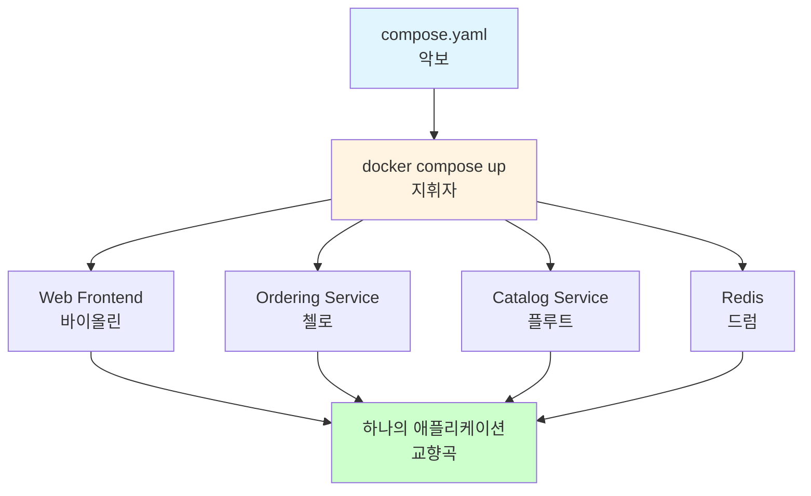

### 1.2 왜 Compose가 필요한가?

**Compose 없이 멀티 컨테이너 앱 실행:**
```bash
# 네트워크 생성
$ docker network create myapp-net

# 볼륨 생성
$ docker volume create myapp-vol

# Redis 컨테이너 실행
$ docker run -d --name redis \
  --network myapp-net \
  -v myapp-vol:/data \
  redis:alpine

# Web 컨테이너 실행
$ docker run -d --name web \
  --network myapp-net \
  -p 5001:8080 \
  -e REDIS_HOST=redis \
  myapp:latest
```

**Compose 사용:**
```bash
$ docker compose up --detach
```

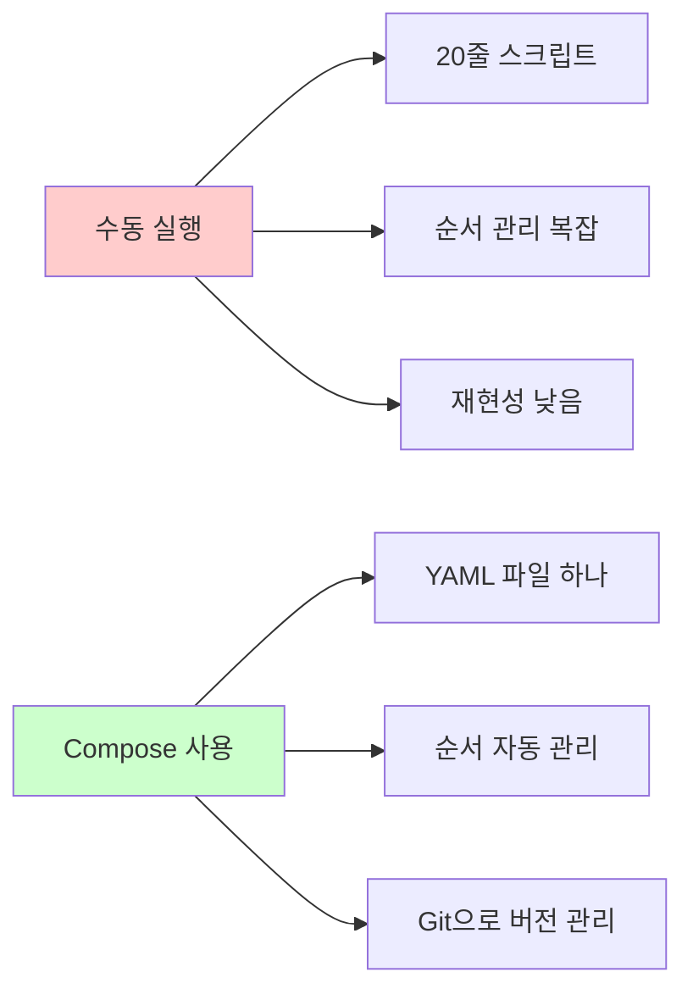

**Compose의 장점:**
1. **선언적 정의**: 원하는 상태를 선언 (어떻게가 아닌 무엇을)
2. **재현성**: 동일한 compose.yaml → 동일한 환경
3. **버전 관리**: Git에 포함해 팀원과 공유
4. **문서화**: 앱 아키텍처가 YAML로 명확히 표현됨
5. **단일 명령어**: up/down으로 전체 스택 제어

### 1.3 마이크로서비스 아키텍처 예시

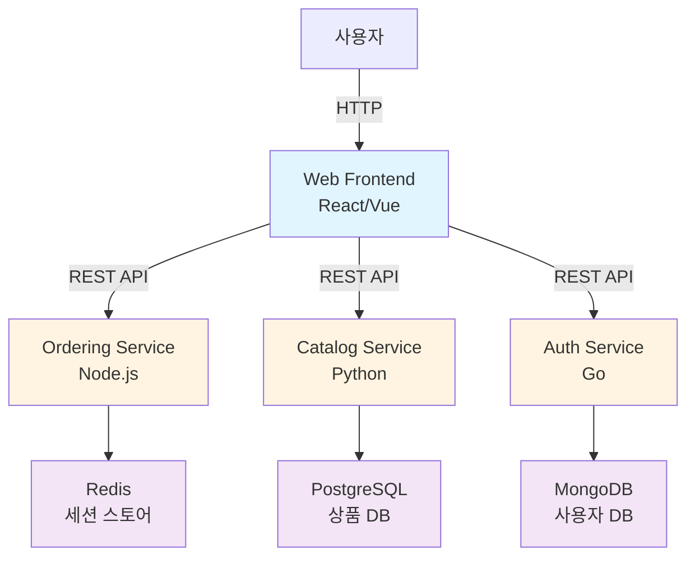

**이 구조를 docker run 명령어로?**
- 8개 컨테이너 × 평균 5줄 명령어 = 40줄 스크립트
- 네트워크, 볼륨 생성 추가 → 50줄+
- 순서 관리 (DB 먼저, 서비스 나중) → if문, sleep 추가

**Compose로?**
- compose.yaml 파일 하나 (50~100줄)
- `docker compose up` 한 줄

---

## 2. Compose 탄생 배경

### 2.1 역사

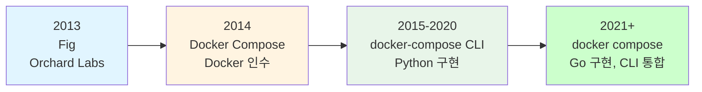

| 시기 | 이름 | 특징 | 실행 방법 |
|------|------|------|----------|
| **2013** | Fig | Orchard Labs 개발 (Python) | `fig up` |
| **2014** | Docker Compose | Docker가 Orchard 인수 | `docker-compose up` |
| **2021+** | docker compose | Go로 재작성, Docker CLI 통합 | `docker compose up` |

**왜 docker-compose에서 docker compose로?**
- 별도 Python 바이너리 설치 불필요 (Docker CLI에 내장)
- 더 빠른 성능 (Go 구현)
- 일관된 CLI 경험 (`docker build`, `docker compose` 등)

### 2.2 Compose Specification

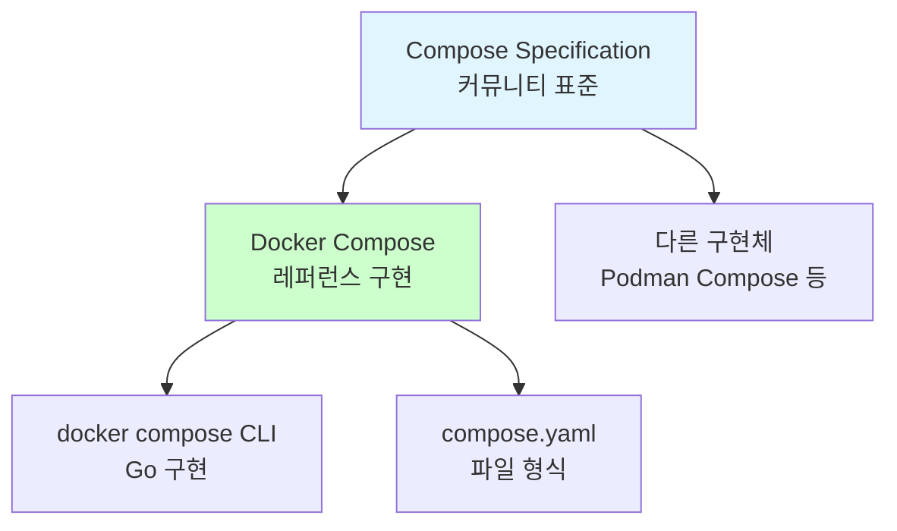

**Compose Specification이란?**
- Docker가 아닌 **커뮤니티**가 관리하는 오픈 스탠다드
- 파일 형식, 동작 정의 (구현체와 독립)
- Docker Compose는 이 스펙의 레퍼런스 구현

**왜 거버넌스 분리?**
- Docker 회사 종속성 제거 (벤더 락인 방지)
- Kubernetes, Podman 등 다른 도구도 Compose 파일 사용 가능
- 커뮤니티 주도 발전 가능

---

## 3. Compose 파일 구조

### 3.1 기본 구조

```yaml
services:      # 필수 - 마이크로서비스 정의
  web-fe:
    ...
  redis:
    ...

networks:      # 선택 - 커스텀 네트워크 정의
  counter-net:

volumes:       # 선택 - 커스텀 볼륨 정의
  counter-vol:
```

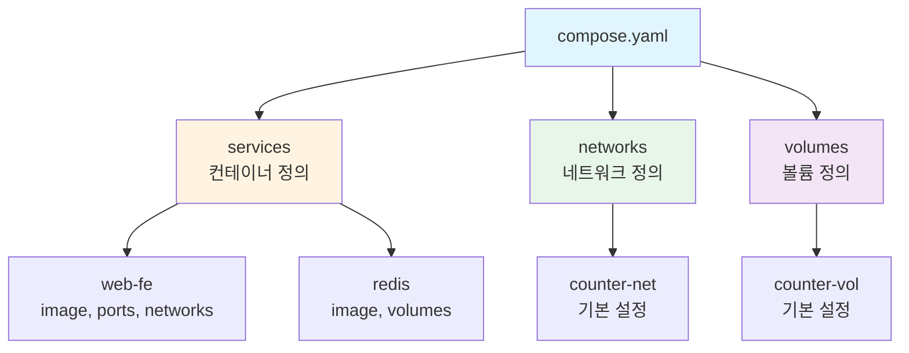

**왜 services가 필수인가?**
- 애플리케이션의 핵심은 실행되는 컨테이너(서비스)
- networks/volumes는 services 간 연결을 위한 보조 리소스
- services 없는 Compose 파일은 의미 없음

### 3.2 샘플 애플리케이션 아키텍처

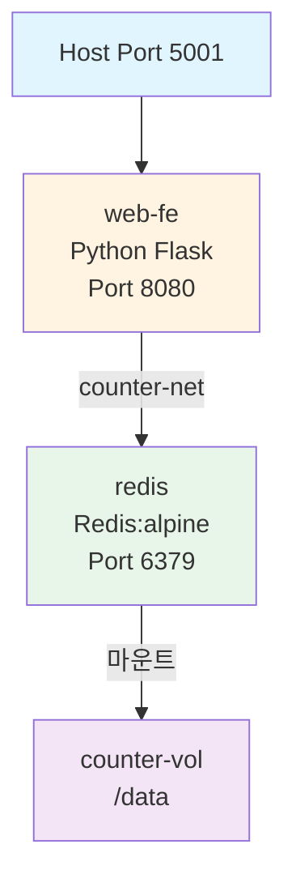

**아키텍처 설명:**
- 사용자는 http://localhost:5001 접속
- web-fe 컨테이너가 Flask 앱 실행 (내부 포트 8080)
- web-fe가 Redis에 카운터 값 저장/조회
- Redis 데이터는 counter-vol 볼륨에 영구 저장

### 3.3 완전한 Compose 파일 예시

```yaml
services:
  web-fe:
    deploy:
      replicas: 1                  # 컨테이너 복제본 수
    build: .                       # Dockerfile 위치
    command: python app/app.py    # 실행 명령
    ports:
      - target: 8080               # 컨테이너 내부 포트
        published: 5001            # 호스트 노출 포트
    networks:
      - counter-net                # 연결할 네트워크

  redis:
    image: "redis:alpine"          # Docker Hub 이미지
    deploy:
      replicas: 1
    networks:
      - counter-net
    volumes:
      - type: volume
        source: counter-vol        # 볼륨 이름
        target: /data              # 컨테이너 내 마운트 경로

networks:
  counter-net:                     # 네트워크 정의 (기본 설정)

volumes:
  counter-vol:                     # 볼륨 정의 (기본 설정)
```

### 3.4 서비스 정의 속성 상세

#### build vs image

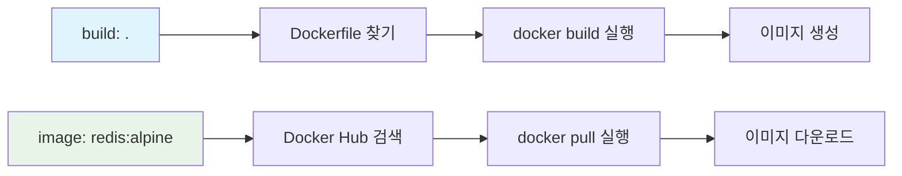

| 속성 | 언제 사용? | 예시 | 결과 |
|------|-----------|------|------|
| **build** | 커스텀 앱 (Dockerfile 있음) | `build: .` | 이미지 빌드 후 사용 |
| **image** | 공식 이미지 (DB, 캐시 등) | `image: redis:alpine` | Docker Hub에서 pull |

**build + image 조합:**
```yaml
services:
  web-fe:
    build: .
    image: myapp:latest    # 빌드된 이미지 이름 지정
```

#### ports 매핑

```yaml
ports:
  - target: 8080        # 컨테이너 내부 포트
    published: 5001     # 호스트 노출 포트
    protocol: tcp       # tcp 또는 udp (기본 tcp)

# 단축 형식
ports:
  - "5001:8080"
```

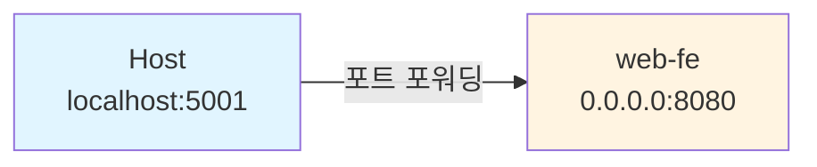

**왜 target과 published를 구분?**
- 컨테이너는 항상 동일한 포트 리스닝 (target: 8080)
- 호스트 포트는 환경별로 다를 수 있음 (dev: 5001, prod: 80)
- 명시적 구분으로 포트 충돌 방지

#### volumes 마운트

```yaml
volumes:
  - type: volume
    source: counter-vol    # volumes: 섹션에 정의된 이름
    target: /data          # 컨테이너 내 경로

# 단축 형식
volumes:
  - counter-vol:/data
```

**volume 타입:**
| 타입 | 설명 | 용도 | 예시 |
|------|------|------|------|
| **volume** | Docker가 관리하는 볼륨 | 데이터 영속성 | `counter-vol:/data` |
| **bind** | 호스트 디렉토리 마운트 | 개발 중 코드 변경 반영 | `./src:/app/src` |
| **tmpfs** | 메모리 마운트 | 임시 데이터 | `/tmp` |

---

## 4. 프로젝트 네이밍 규칙

### 4.1 프로젝트 이름 결정

Docker Compose는 **빌드 컨텍스트 디렉토리명**을 프로젝트 이름으로 사용한다.

```bash
$ pwd
/home/user/projects/multi-container

$ docker compose up --detach
                      ↓
            프로젝트명: multi-container
```

**프로젝트 이름 오버라이드:**
```bash
# -p 플래그로 명시적 지정
$ docker compose -p myproject up --detach

# 환경 변수 사용
$ COMPOSE_PROJECT_NAME=myproject docker compose up
```

### 4.2 리소스 네이밍 패턴

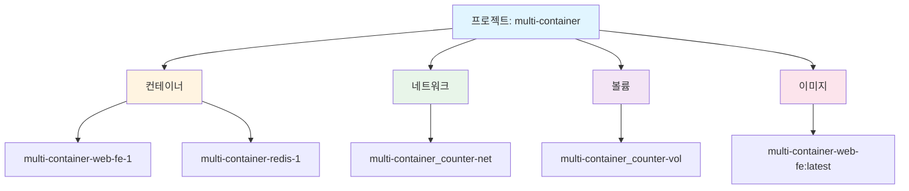

| 리소스 타입 | 정의된 이름 | 실제 생성 이름 | 패턴 |
|-------------|-------------|----------------|------|
| **컨테이너** | web-fe | `multi-container-web-fe-1` | `{프로젝트}-{서비스}-{복제본번호}` |
| **컨테이너** | redis | `multi-container-redis-1` | `{프로젝트}-{서비스}-{복제본번호}` |
| **네트워크** | counter-net | `multi-container_counter-net` | `{프로젝트}_{네트워크명}` |
| **볼륨** | counter-vol | `multi-container_counter-vol` | `{프로젝트}_{볼륨명}` |
| **이미지** | - | `multi-container-web-fe:latest` | `{프로젝트}-{서비스}:latest` |

**왜 프로젝트 이름을 접두사로?**
- 동일 호스트에서 여러 Compose 앱 실행 시 충돌 방지
- 어떤 프로젝트의 리소스인지 명확히 식별
- `docker compose down`으로 정확히 해당 프로젝트만 정리 가능

### 4.3 복제본(replicas) 개념

```yaml
services:
  web-fe:
    deploy:
      replicas: 3    # 동일한 서비스를 3개 실행
```

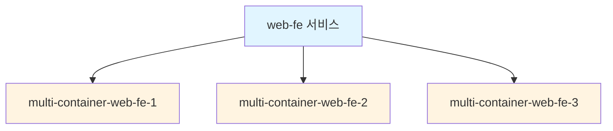

**왜 복제본?**
- 로드 밸런싱 (트래픽 분산)
- 고가용성 (한 컨테이너 죽어도 계속 서비스)
- 수평 확장 (성능 향상)

---

## 5. 앱 배포 (docker compose up)

### 5.1 배포 명령어

```bash
# 기본 배포 (백그라운드 실행)
$ docker compose up --detach

# 특정 파일 지정
$ docker compose -f custom-compose.yml up -d

# 특정 서비스만 실행
$ docker compose up redis --detach
```

### 5.2 배포 과정 상세

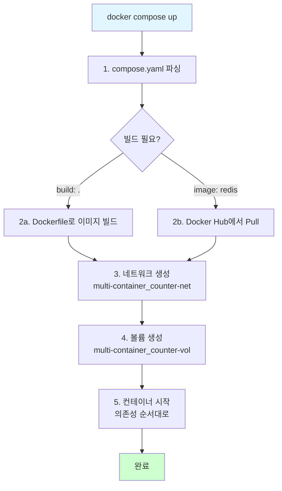

**실행 로그 예시:**
```bash
$ docker compose up --detach

[+] Building 3.2s (12/12) FINISHED
 => [web-fe internal] load build definition from Dockerfile
 => [web-fe] => exporting to image

[+] Running 4/4
 ✔ Network multi-container_counter-net    Created    0.1s
 ✔ Volume multi-container_counter-vol     Created    0.0s
 ✔ Container multi-container-redis-1      Started    0.2s
 ✔ Container multi-container-web-fe-1     Started    0.3s
```

### 5.3 의존성 관리 (depends_on)

```yaml
services:
  web-fe:
    depends_on:
      - redis    # redis가 먼저 시작되어야 함

  redis:
    image: redis:alpine
```

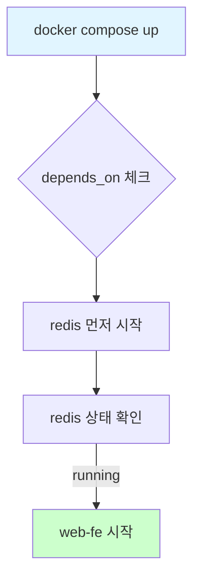

**주의사항:**
- `depends_on`은 **시작 순서**만 보장 (ready 상태는 보장 안 함)
- 예: Redis 컨테이너는 시작됐지만 Redis 서버 초기화 중일 수 있음
- 해결: 앱에서 재시도 로직 구현 또는 healthcheck 사용

---

## 6. 앱 관리 명령어

### 6.1 명령어 비교

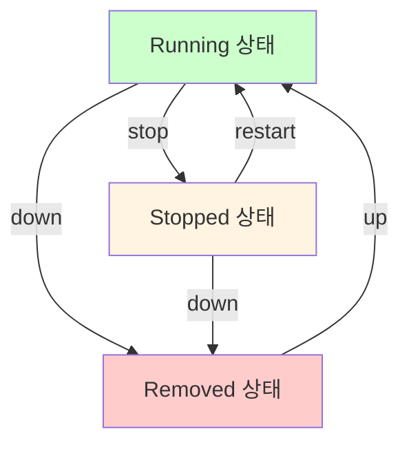

| 명령어 | 컨테이너 | 네트워크 | 볼륨 | 이미지 | 용도 |
|--------|----------|----------|------|--------|------|
| **stop** | 정지 (유지) | 유지 | 유지 | 유지 | 일시 중지 |
| **restart** | 재시작 | 유지 | 유지 | 유지 | 설정 변경 반영 |
| **down** | **삭제** | **삭제** | 유지 | 유지 | 앱 정리 |
| **down --volumes** | **삭제** | **삭제** | **삭제** | 유지 | 데이터까지 정리 |
| **down --volumes --rmi all** | **삭제** | **삭제** | **삭제** | **삭제** | 완전 정리 |

### 6.2 상태 확인 명령어

```bash
# 앱 상태 확인
$ docker compose ps
NAME                       SERVICE    STATUS        PORTS
multi-container-redis-1    redis      Up 33 sec     6379/tcp
multi-container-web-fe-1   web-fe     Up 33 sec     0.0.0.0:5001->8080/tcp

# 컨테이너 내부 프로세스
$ docker compose top
multi-container-redis-1
UID   PID     CMD
lxd   12023   redis-server *:6379

multi-container-web-fe-1
UID    PID     CMD
root   12024   python app/app.py

# 전체 Compose 앱 목록
$ docker compose ls
NAME               STATUS       CONFIG FILES
multi-container    running(2)   /path/to/compose.yaml

# 실시간 로그
$ docker compose logs -f web-fe
```

### 6.3 라이프사이클 관리

```bash
# 1. 앱 배포
$ docker compose up -d

# 2. 설정 변경 후 재빌드 & 재시작
$ docker compose up -d --build

# 3. 특정 서비스만 재시작
$ docker compose restart web-fe

# 4. 스케일 조정 (복제본 수 변경)
$ docker compose up -d --scale web-fe=3

# 5. 앱 정지 (컨테이너 유지)
$ docker compose stop

# 6. 앱 재시작
$ docker compose start

# 7. 앱 삭제 (볼륨 유지)
$ docker compose down

# 8. 완전 정리 (볼륨, 이미지까지 삭제)
$ docker compose down --volumes --rmi all
```

**down vs rm:**
```bash
# down: 컨테이너 + 네트워크 삭제 (한 번에)
$ docker compose down

# rm: 정지된 컨테이너만 삭제 (네트워크 유지)
$ docker compose stop
$ docker compose rm
```

---

## 7. 데이터 영속성

### 7.1 볼륨을 통한 데이터 보존

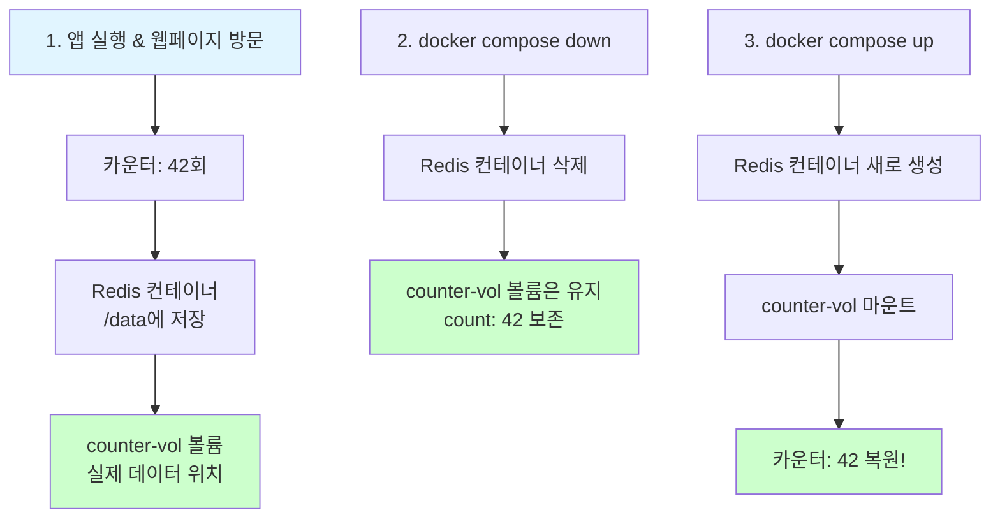

**왜 down 후에도 데이터가 유지되는가?**
- `docker compose down`은 기본적으로 볼륨을 삭제하지 않음
- 볼륨은 컨테이너와 독립적인 리소스
- 의도: 실수로 데이터 손실 방지

**볼륨 확인:**
```bash
# 볼륨 목록
$ docker volume ls
DRIVER    VOLUME NAME
local     multi-container_counter-vol

# 볼륨 상세 정보
$ docker volume inspect multi-container_counter-vol
[
    {
        "Name": "multi-container_counter-vol",
        "Mountpoint": "/var/lib/docker/volumes/multi-container_counter-vol/_data",
        ...
    }
]
```

### 7.2 데이터 백업 및 복원

```bash
# 볼륨 백업 (tar로 압축)
$ docker run --rm \
  -v multi-container_counter-vol:/data \
  -v $(pwd):/backup \
  alpine tar czf /backup/data-backup.tar.gz -C /data .

# 볼륨 복원
$ docker run --rm \
  -v multi-container_counter-vol:/data \
  -v $(pwd):/backup \
  alpine tar xzf /backup/data-backup.tar.gz -C /data
```

---

## 8. 서비스 간 통신

### 8.1 DNS 기반 통신

```python
# app.py 코드
cache = redis.Redis(host='redis', port=6379)
#                        ↑
#                   서비스 이름으로 통신
```

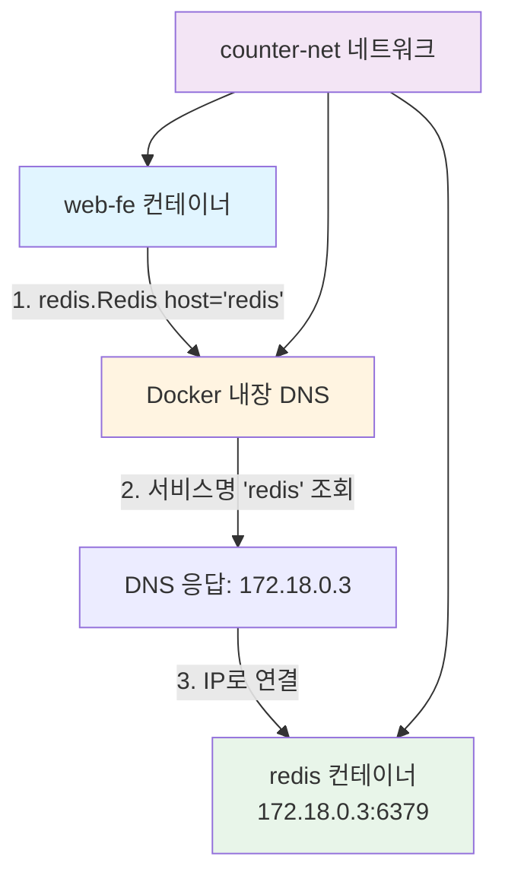

**왜 서비스 이름으로 통신 가능한가?**
- Docker의 내장 DNS 서버가 각 네트워크에 존재
- 같은 네트워크의 컨테이너는 서비스명을 DNS 레코드로 등록
- `redis` → 실제 IP 주소로 자동 해석

### 8.2 네트워크 격리

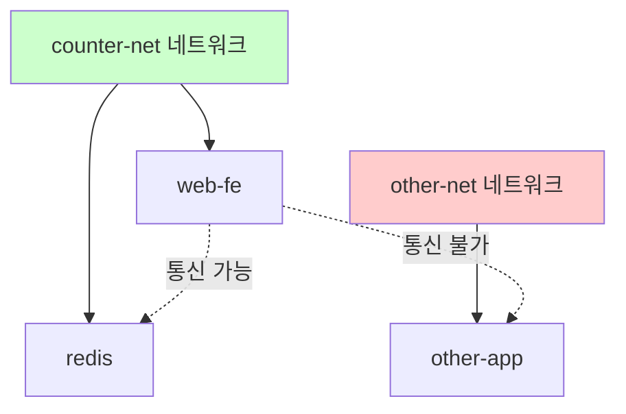

**같은 네트워크:**
- 서비스명으로 DNS 해석 가능
- 직접 TCP 연결 가능
- 네트워크 격리로 보안 강화

**다른 네트워크:**
- DNS 해석 불가
- 연결 불가
- 의도: 마이크로서비스 간 경계 명확화

### 8.3 외부 네트워크 사용

```yaml
networks:
  counter-net:
    external: true    # 기존 네트워크 사용 (생성하지 않음)
```

**언제 사용?**
- 여러 Compose 앱이 공유하는 네트워크
- 기존 Docker 네트워크에 연결
- 예: `docker network create shared-net` → 여러 앱에서 참조

---

## 9. 환경 변수 및 시크릿

### 9.1 환경 변수 주입

```yaml
services:
  web-fe:
    environment:
      - NODE_ENV=production
      - REDIS_HOST=redis
      - REDIS_PORT=6379

    # 또는 .env 파일 사용
    env_file:
      - .env
```

**.env 파일:**
```bash
NODE_ENV=production
REDIS_HOST=redis
REDIS_PORT=6379
```

**변수 우선순위:**
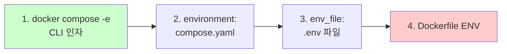

### 9.2 시크릿 관리 (Docker Swarm/Compose v2)

```yaml
secrets:
  db_password:
    file: ./secrets/db_password.txt

services:
  db:
    image: postgres
    secrets:
      - db_password    # /run/secrets/db_password로 마운트
```

**왜 시크릿을 환경 변수로 안 넘기는가?**
- 환경 변수는 `docker inspect`로 조회 가능 (보안 위험)
- 시크릿은 파일로 마운트 → 프로세스만 읽기 가능
- 로그나 히스토리에 남지 않음

---

## 10. 실전 패턴

### 10.1 개발 vs 프로덕션 설정 분리

```yaml
# docker-compose.yml (공통 설정)
services:
  web-fe:
    build: .
    networks:
      - app-net

# docker-compose.override.yml (개발 환경, 자동 로드)
services:
  web-fe:
    volumes:
      - ./src:/app/src    # 코드 변경 실시간 반영
    environment:
      - DEBUG=true

# docker-compose.prod.yml (프로덕션 환경)
services:
  web-fe:
    deploy:
      replicas: 3
    environment:
      - DEBUG=false
```

**사용:**
```bash
# 개발 환경 (자동으로 override 로드)
$ docker compose up

# 프로덕션 환경
$ docker compose -f docker-compose.yml -f docker-compose.prod.yml up
```

### 10.2 헬스체크 설정

```yaml
services:
  web-fe:
    healthcheck:
      test: ["CMD", "curl", "-f", "http://localhost:8080/health"]
      interval: 30s       # 30초마다 체크
      timeout: 10s        # 10초 내 응답 없으면 실패
      retries: 3          # 3번 연속 실패 시 unhealthy
      start_period: 40s   # 시작 후 40초 유예 기간
```

**헬스체크 상태:**


### 10.3 로깅 설정

```yaml
services:
  web-fe:
    logging:
      driver: "json-file"
      options:
        max-size: "10m"      # 로그 파일 최대 크기
        max-file: "3"        # 보관할 로그 파일 수
```

---

## 11. 정리

### 11.1 핵심 포인트

1. **Compose는 멀티 컨테이너 앱의 IaC** - 인프라를 코드로 정의
2. **services, networks, volumes 3대 블록** - 애플리케이션 전체 구조 표현
3. **프로젝트 단위 관리** - 디렉토리명 기반 네이밍, 독립적 라이프사이클
4. **데이터 영속성 기본 제공** - down 후에도 볼륨 유지
5. **DNS 기반 서비스 디스커버리** - 서비스명으로 통신
6. **선언적 정의 + 단일 명령어** - up/down으로 전체 스택 제어

### 11.2 Compose vs 수동 관리

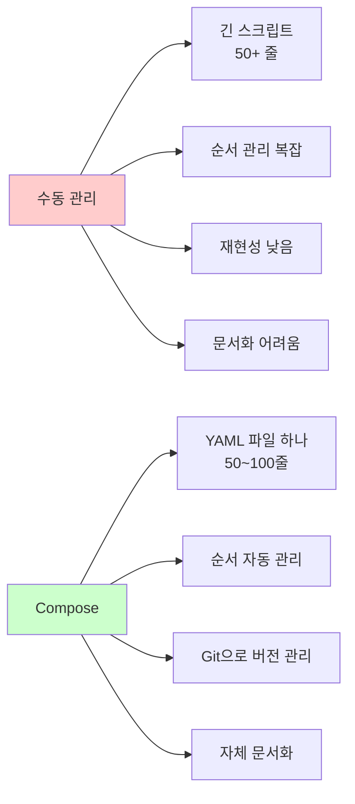

### 11.3 다음 단계

Compose는 **단일 호스트**에서 멀티 컨테이너 앱을 관리하는 도구다. 여러 서버에 걸친 클러스터 관리나 자동 스케일링이 필요하면 **Kubernetes** 또는 **Docker Swarm**을 사용한다.

```mermaid
graph TD
    A[컨테이너 오케스트레이션] --> B[단일 호스트<br/>Docker Compose]
    A --> C[멀티 호스트<br/>Kubernetes/Swarm]

    B --> D[개발 환경<br/>로컬 테스트]

    C --> E[프로덕션<br/>고가용성<br/>자동 스케일링]

    style B fill:#e1f5ff
    style C fill:#e8f5e9
```

---

## 🔍 심화 학습

### 면접 대비 질문

**Q1: docker compose stop과 docker compose down의 차이점은?**
> **A**: `stop`은 컨테이너를 정지만 하고 유지하여 `restart`로 빠르게 재시작 가능하다. `down`은 컨테이너와 네트워크를 삭제하지만, 볼륨과 이미지는 기본적으로 유지한다. 완전 정리하려면 `--volumes`와 `--rmi all` 플래그를 사용한다. 일시 중지는 stop, 앱 제거는 down을 사용한다.

**Q2: Compose 파일에서 build와 image의 차이는?**
> **A**: `build`는 Dockerfile을 기반으로 이미지를 직접 빌드하며, `image`는 이미 존재하는 이미지(Docker Hub 등)를 pull해서 사용한다. 커스텀 앱은 `build`, 공식 이미지(DB, 캐시 등)는 `image`를 사용하는 것이 일반적이다. 두 속성을 함께 사용하면 빌드된 이미지의 이름을 지정할 수 있다.

**Q3: Compose에서 서비스 간 통신은 어떻게 이루어지는가?**
> **A**: 같은 네트워크에 연결된 서비스들은 **서비스 이름**으로 서로를 참조할 수 있다. Docker의 내장 DNS 서버가 서비스명을 해당 컨테이너의 IP로 해석해준다. 예를 들어 `redis.Redis(host='redis')`처럼 서비스명 'redis'를 사용하면 Docker DNS가 자동으로 IP 주소로 변환한다.

**Q4: docker compose down 후에도 데이터가 보존되는 이유는?**
> **A**: `down` 명령은 기본적으로 볼륨을 삭제하지 않는다. 볼륨에 저장된 데이터(DB, 캐시 등)는 앱 재배포 시에도 유지되어 데이터 영속성을 보장한다. 이는 실수로 데이터를 손실하는 것을 방지하기 위한 안전장치다. 볼륨까지 삭제하려면 `--volumes` 플래그를 명시해야 한다.

**Q5: depends_on의 한계와 해결 방법은?**
> **A**: `depends_on`은 컨테이너 시작 순서만 보장할 뿐, 서비스가 실제로 준비(ready) 상태인지는 보장하지 않는다. 예를 들어 DB 컨테이너는 시작됐지만 초기화 중일 수 있다. 해결 방법은 1) 애플리케이션에 재시도 로직 구현, 2) healthcheck 조건 추가, 3) wait-for-it 같은 헬퍼 스크립트 사용이다.

**Q6: 프로젝트 네이밍 규칙을 왜 알아야 하는가?**
> **A**: Compose는 프로젝트명을 접두사로 모든 리소스(컨테이너, 네트워크, 볼륨)를 생성한다. 예를 들어 `multi-container` 디렉토리에서 실행하면 `multi-container-web-fe-1`, `multi-container_counter-net` 같은 이름이 생성된다. 이를 이해해야 `docker ps`, `docker volume ls`로 리소스를 정확히 식별하고, 다른 프로젝트와 충돌을 피할 수 있다.

---

## ✅ 체크포인트

### Compose 개념
- [ ] Compose의 탄생 배경과 역사 (Fig → docker-compose → docker compose)
- [ ] Compose Specification과 Docker 구현체의 관계
- [ ] 수동 관리 대비 Compose의 장점 (선언적, 재현성, 버전 관리)

### Compose 파일 작성
- [ ] services, networks, volumes 3대 블록 이해
- [ ] build vs image 차이 및 사용 시점
- [ ] ports: target vs published
- [ ] volumes: source vs target, type 종류
- [ ] deploy.replicas로 스케일 조정
- [ ] depends_on으로 시작 순서 제어

### 프로젝트 관리
- [ ] 프로젝트 네이밍 규칙 (디렉토리명 기반)
- [ ] 리소스 네이밍 패턴 ({프로젝트}-{서비스}-{번호})
- [ ] -p 플래그로 프로젝트명 오버라이드

### 명령어 활용
- [ ] docker compose up -d: 앱 배포
- [ ] docker compose ps: 상태 확인
- [ ] docker compose logs -f: 로그 확인
- [ ] docker compose top: 프로세스 확인
- [ ] docker compose stop: 정지 (컨테이너 유지)
- [ ] docker compose restart: 재시작
- [ ] docker compose down: 삭제 (볼륨 유지)
- [ ] docker compose down --volumes: 볼륨까지 삭제

### 데이터 관리
- [ ] 볼륨을 통한 데이터 영속성
- [ ] down 후에도 볼륨 유지 메커니즘
- [ ] 볼륨 백업 및 복원 방법

### 서비스 통신
- [ ] DNS 기반 서비스 디스커버리
- [ ] 네트워크 격리 개념
- [ ] external 네트워크 사용

### 실전 패턴
- [ ] 환경 변수 주입 (environment, env_file)
- [ ] 개발/프로덕션 설정 분리 (override, -f)
- [ ] healthcheck 설정
- [ ] 로깅 설정

---

## 🔗 참고 자료

- [Docker Compose 공식 문서](https://docs.docker.com/compose/)
- [Compose Specification](https://compose-spec.io/)
- [Compose 파일 레퍼런스](https://docs.docker.com/compose/compose-file/)
- [Docker Compose GitHub](https://github.com/docker/compose)
- 도서: *Docker Deep Dive* - Nigel Poulton, Chapter 9
