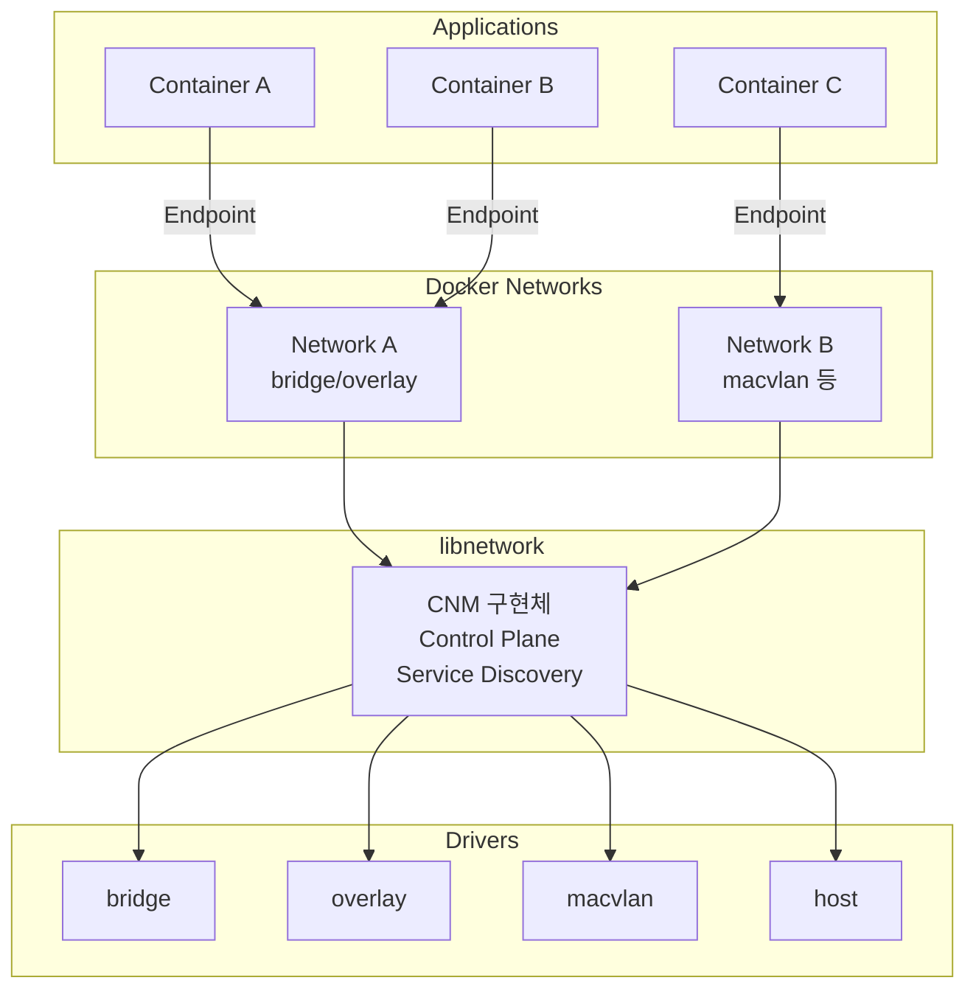
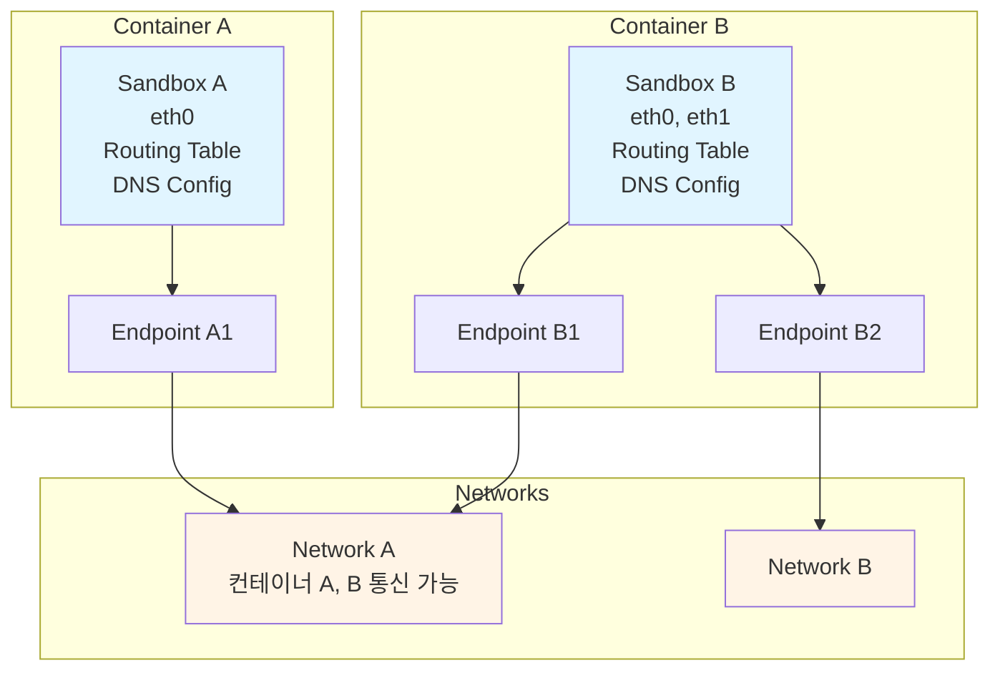
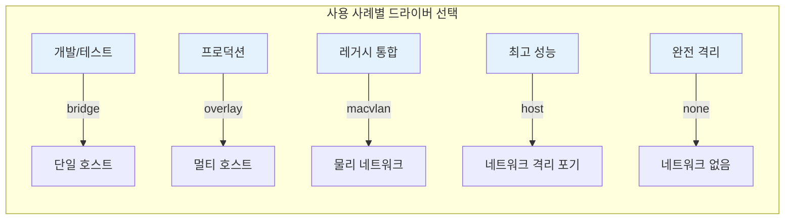
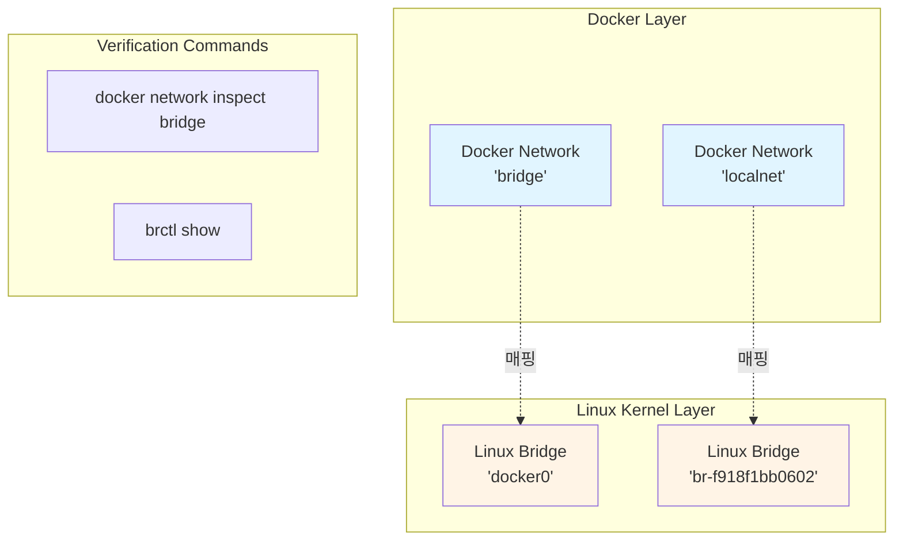
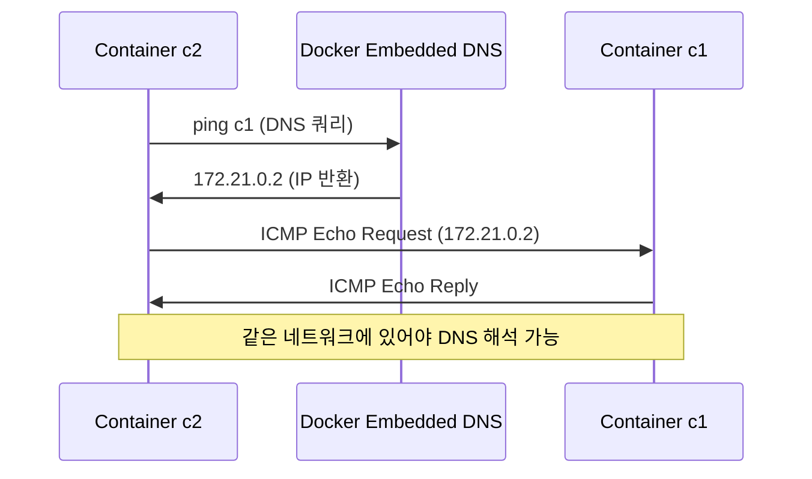
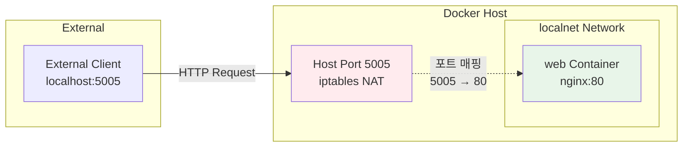
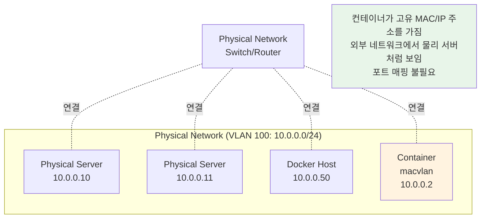
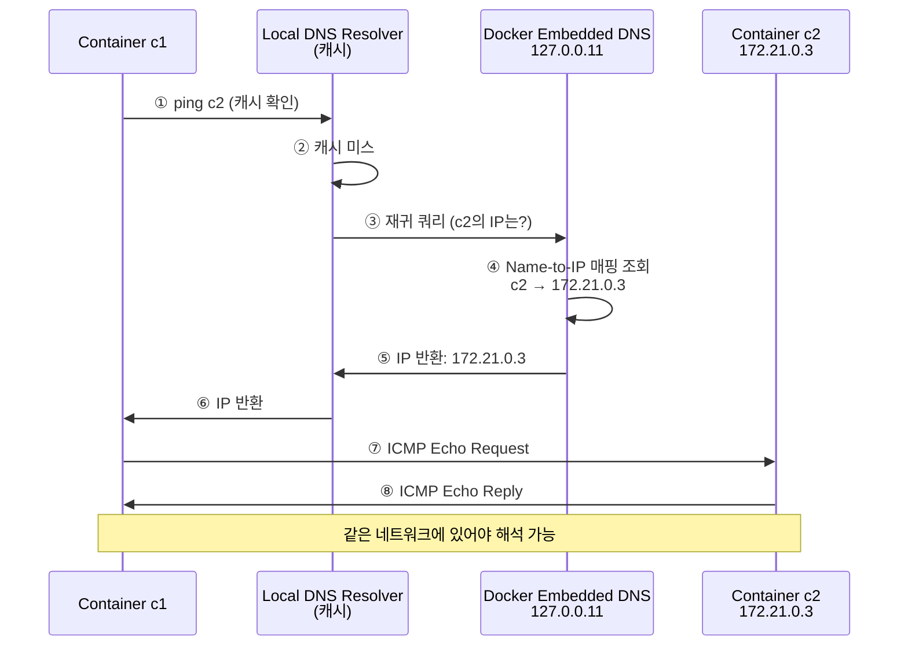
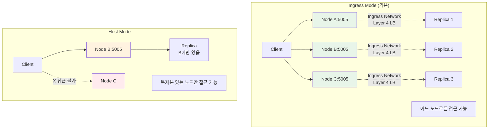
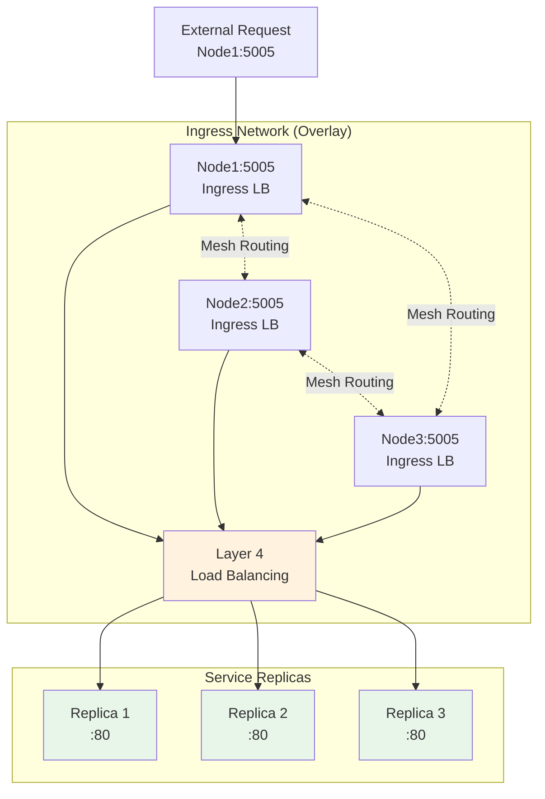

# Ch08. Docker Networking

> 📌 **핵심 요약**
> Docker 네트워킹은 **Container Network Model(CNM)** 설계를 기반으로 하며, **libnetwork**가 구현하고 **드라이버**가 실제 네트워크 토폴로지를 생성한다. 기본 **bridge** 네트워크부터 멀티 호스트 **overlay**, 기존 물리 네트워크 연결 **MACVLAN**까지 다양한 네트워킹 요구사항을 해결한다. **서비스 디스커버리**와 **DNS 기반 이름 해석**이 내장되어 있어 컨테이너 간 통신이 간편하다.

## 🎯 학습 목표
1. Container Network Model(CNM)의 세 가지 핵심 구성 요소 이해
2. libnetwork와 드라이버의 역할 구분 파악
3. bridge, overlay, macvlan, host, none 드라이버 비교 및 활용
4. 커스텀 bridge 네트워크 생성 및 DNS 기반 통신 테스트
5. 포트 매핑을 통한 외부 접근 설정 및 한계 이해
6. 서비스 디스커버리와 Swarm Ingress 로드밸런싱 원리 파악

---

## 1. Docker 네트워킹 아키텍처

### 1.1 전체 구조

Docker 네트워킹은 **계층적 구조**를 가진다. 왜 계층을 나누는가? 각 계층이 명확한 책임을 가지면 **확장성**과 **유연성**이 증가하기 때문이다. 상위 계층(CNM)은 네트워크 관리 API를 정의하고, 중간 계층(libnetwork)은 제어 플레인을 담당하며, 하위 계층(드라이버)은 실제 네트워크 토폴로지를 구현한다.



### 1.2 비유로 이해하기

Docker 네트워크는 **아파트 단지의 내부 도로망**과 같다. 각 컨테이너(집)는 자체 주소(IP)를 가지며, 같은 네트워크(단지)에 있는 컨테이너끼리 이름으로 찾아갈 수 있다. 외부와 통신하려면 정문(포트 매핑)을 통해야 한다.

---

## 2. Container Network Model (CNM)

### 2.1 세 가지 핵심 구성 요소

CNM은 Docker 네트워킹의 **설계 명세**다. 왜 표준화된 모델이 필요한가? 다양한 드라이버가 일관된 방식으로 동작하게 하여 **상호 운용성**을 보장하기 때문이다.

| 구성 요소 | 설명 | 비유 | 개수 |
|-----------|------|------|------|
| **Sandbox** | 컨테이너의 격리된 네트워크 스택<br/>(인터페이스, 라우팅 테이블, DNS) | 집의 내부 배선 | 컨테이너당 1개 |
| **Endpoint** | 가상 네트워크 인터페이스<br/>Sandbox를 Network에 연결 | 집의 현관문 | 1개 Endpoint → 1개 Network만 연결 |
| **Network** | 가상 스위치(802.1d 브리지)<br/>Endpoint들을 그룹화/격리 | 아파트 단지 내부 도로 | 여러 Endpoint 수용 |



**핵심 원칙**:
- 1개 Endpoint는 정확히 1개 Network에만 연결
- 1개 컨테이너는 여러 Endpoint를 가질 수 있음 (Multi-homing)
- Container B는 Network A와 B 모두에 연결되어 트래픽 라우팅 가능

### 2.2 CNM과 Linux 네트워크 네임스페이스

Sandbox는 실제로 Linux **Network Namespace**로 구현된다. 왜 네임스페이스를 사용하는가? 각 컨테이너가 독립된 네트워크 스택을 가지면서도 호스트 커널의 단일 네트워크 서브시스템을 공유할 수 있기 때문이다.

---

## 3. libnetwork와 드라이버 역할 분리

### 3.1 Control Plane vs Data Plane

Docker 네트워킹은 **관리 영역**과 **실행 영역**을 분리한다. 왜 분리하는가? 네트워크 정책과 실제 구현을 독립적으로 발전시킬 수 있기 때문이다.

| 구성 요소 | 역할 | 담당 영역 | 구체적 기능 |
|-----------|------|-----------|-------------|
| **libnetwork** | CNM 구현체 | Control Plane | • 네트워크 생성/삭제 API<br/>• 서비스 디스커버리<br/>• 로드밸런싱<br/>• 네트워크 정보 관리 |
| **Drivers** | 네트워크 토폴로지 구현 | Data Plane | • 실제 네트워크 생성<br/>• 패킷 전달/격리<br/>• 플랫폼별 최적화 |

### 3.2 기본 제공 드라이버 비교

Docker는 다양한 시나리오를 위해 **5가지 네이티브 드라이버**를 제공한다. 각 드라이버는 특정 사용 사례에 최적화되어 있다.

| 드라이버 | 범위 | 용도 | 특징 | 권장 사용 시나리오 |
|----------|------|------|------|-------------------|
| **bridge** | 단일 호스트 | 로컬 네트워크 | 기본 드라이버<br/>NAT 기반 | 개발/테스트<br/>로컬 컨테이너 통신 |
| **overlay** | 멀티 호스트 | Swarm 네트워크 | VXLAN 터널<br/>암호화 지원 | 프로덕션 MSA<br/>클러스터 환경 |
| **macvlan** | 단일/멀티 호스트 | 기존 네트워크 연결 | 고유 MAC/IP<br/>프로미스큐어스 필요 | 레거시 통합<br/>물리 네트워크 직접 연결 |
| **host** | 단일 호스트 | 호스트 네트워크 공유 | 격리 없음<br/>최고 성능 | 성능 최우선<br/>단일 컨테이너 |
| **none** | N/A | 네트워크 비활성화 | 완전 격리 | 보안 우선<br/>오프라인 처리 |



---

## 4. 단일 호스트 Bridge 네트워크

### 4.1 기본 bridge 네트워크

Docker를 설치하면 **기본 bridge 네트워크**가 자동 생성된다. 왜 기본 네트워크가 필요한가? 사용자가 네트워크를 지정하지 않아도 컨테이너가 즉시 동작할 수 있게 하기 위함이다.

```bash
# 기본 네트워크 확인
docker network ls
# NETWORK ID     NAME      DRIVER    SCOPE
# c7464dce29ce   bridge    bridge    local    ← 기본 네트워크
# c65ab18d0580   host      host      local
# 42a783df0fbe   none      null      local

# bridge 네트워크 상세 정보
docker network inspect bridge
```

**inspect 출력 주요 필드**:
- `Subnet`: 컨테이너에 할당할 IP 범위 (기본: 172.17.0.0/16)
- `Gateway`: 호스트 측 게이트웨이 IP (기본: 172.17.0.1)
- `Driver`: bridge (Linux bridge 사용)

### 4.2 Docker Network와 Linux Bridge 매핑

Docker의 논리적 네트워크는 실제로 Linux 커널의 **브리지 디바이스**로 구현된다. 왜 브리지를 사용하는가? L2 스위치 기능을 소프트웨어로 구현하여 컨테이너 간 직접 통신을 가능하게 하기 때문이다.



```bash
# Docker 네트워크 → Linux 브리지 매핑 확인
docker network inspect bridge | grep bridge.name
# "com.docker.network.bridge.name": "docker0"

# Linux 브리지 목록 확인
brctl show
# bridge name        bridge id             interfaces
# docker0            8000.0242aff9eb4f     veth833aaf9
# br-f918f1bb0602    8000.0242372a886b     veth1234567
```

### 4.3 커스텀 Bridge 네트워크 생성

**기본 bridge**와 **커스텀 bridge**의 가장 큰 차이는 **DNS 해석 지원 여부**다. 왜 기본 네트워크는 DNS를 지원하지 않는가? 하위 호환성 유지를 위해 레거시 동작을 보존했기 때문이다.

```bash
# 커스텀 bridge 네트워크 생성
docker network create -d bridge localnet
# f918f1bb0602373bf949615d99cb2bbbef14ede935fbb2ff8e83c74f10e4b986

# 서브넷/게이트웨이 명시적 지정
docker network create -d bridge \
  --subnet=10.0.0.0/16 \
  --gateway=10.0.0.1 \
  mynet

# 네트워크에 컨테이너 연결
docker run -d --name c1 --network localnet alpine sleep 1d

# IP 할당 확인
docker network inspect localnet --format '{{json .Containers}}' | jq
```

### 4.4 DNS 기반 이름 해석 테스트

커스텀 네트워크의 **내장 DNS 서버**는 컨테이너 이름을 자동으로 IP로 해석한다. 왜 이것이 중요한가? 하드코딩된 IP 대신 이름으로 통신하면 **유연성**이 증가하기 때문이다.

```bash
# 같은 네트워크에 c2 생성
docker run -it --name c2 --network localnet alpine sh

# c1을 이름으로 ping
ping c1
# PING c1 (172.21.0.2): 56 data bytes
# 64 bytes from 172.21.0.2: seq=0 ttl=64 time=1.564 ms
```



**중요**: 기본 `bridge` 네트워크는 DNS 해석을 지원하지 않음. 커스텀 네트워크만 지원!

---

## 5. 포트 매핑을 통한 외부 접근

### 5.1 포트 매핑 동작 원리

컨테이너는 기본적으로 **격리된 네트워크**에 있다. 외부에서 접근하려면 호스트의 포트를 컨테이너 포트로 **매핑(포워딩)**해야 한다. 이는 **NAT(Network Address Translation)**를 통해 구현된다.



### 5.2 포트 매핑 명령어

```bash
# NGINX 컨테이너를 호스트 5005 포트에 매핑
docker run -d --name web \
  --network localnet \
  --publish 5005:80 \
  nginx

# 단축 형식
docker run -d --name web \
  --network localnet \
  -p 5005:80 \
  nginx

# 포트 매핑 확인
docker port web
# 80/tcp -> 0.0.0.0:5005
# 80/tcp -> [::]:5005

# 외부에서 접근 테스트
curl localhost:5005
```

**publish 플래그 형식**:
- `-p <host-port>:<container-port>`: 특정 호스트 포트 지정
- `-p <container-port>`: 호스트 포트 자동 할당 (ephemeral port)
- `-p <host-ip>:<host-port>:<container-port>`: 특정 인터페이스만 바인딩

### 5.3 포트 매핑의 한계

포트 매핑은 개발/테스트에는 적합하지만 **프로덕션 확장**에는 제약이 있다. 왜 한계가 있는가?

| 한계 | 설명 | 해결책 |
|------|------|--------|
| **포트 독점** | 호스트에서 해당 포트 독점 사용 | Swarm Ingress 모드<br/>로드밸런서 사용 |
| **확장성 제한** | 동일 포트로 여러 복제본 불가<br/>(포트 충돌) | Service Mesh<br/>Kubernetes Service |
| **수동 관리** | 포트 번호 수동 할당 필요 | 오케스트레이션 도구 |

---

## 6. MACVLAN: 기존 네트워크/VLAN 연결

### 6.1 MACVLAN 개념

MACVLAN은 컨테이너를 **물리 네트워크에 직접 연결**한다. 왜 이것이 필요한가? 레거시 시스템과 통합하거나 네트워크 장비가 컨테이너를 물리 서버처럼 인식해야 할 때 사용한다.



**핵심 특징**:
- 컨테이너가 **고유 MAC 주소** 보유
- 물리 네트워크에서 독립적인 **IP 주소** 할당
- 외부에서 **물리 서버처럼** 접근 가능
- **포트 매핑 불필요** (직접 통신)

### 6.2 MACVLAN 네트워크 생성

```bash
# MACVLAN 네트워크 생성 (VLAN 100 연결)
docker network create -d macvlan \
  --subnet=10.0.0.0/24 \
  --ip-range=10.0.0.0/25 \      # Docker가 할당할 IP 범위
  --gateway=10.0.0.1 \
  -o parent=eth0.100 \          # 부모 인터페이스 (VLAN 태깅)
  macvlan100

# MACVLAN 네트워크에 컨테이너 연결
docker run -d --name mactainer1 \
  --network macvlan100 \
  alpine sleep 1d

# 특정 IP 할당
docker run -d --name mactainer2 \
  --network macvlan100 \
  --ip=10.0.0.10 \
  alpine sleep 1d

# 네트워크 정보 확인
docker network inspect macvlan100
```

**parent 인터페이스 옵션**:
- `eth0`: 태그 없는 네트워크 (Access Mode)
- `eth0.100`: VLAN 100 태그 (Trunk Mode)

### 6.3 MACVLAN 주의사항

| 주의사항 | 설명 | 영향 |
|----------|------|------|
| **프로미스큐어스 모드** | 호스트 NIC가 모든 MAC 주소 수신 필요 | 일부 하드웨어/드라이버 미지원 |
| **퍼블릭 클라우드 제약** | 대부분의 클라우드에서 지원 안 함<br/>(AWS, Azure, GCP 등) | 온프레미스만 사용 가능 |
| **IP 범위 관리** | Docker 전용 IP 범위 예약 필요 | 네트워크 팀과 조율 |
| **브로드캐스트 트래픽** | 물리 네트워크에 브로드캐스트 전달 | 네트워크 부하 증가 가능 |

```bash
# 프로미스큐어스 모드 확인 (Linux)
ip link show eth0
# 2: eth0: <BROADCAST,MULTICAST,PROMISC,UP,LOWER_UP>
#           ^^^^^^^^^^^^^^^^^^^^^^^^ PROMISC 플래그 확인

# 프로미스큐어스 모드 활성화
sudo ip link set eth0 promisc on
```

---

## 7. 서비스 디스커버리

### 7.1 DNS 기반 이름 해석 흐름

Docker는 각 네트워크에 **내장 DNS 서버**(127.0.0.11)를 제공한다. 왜 자체 DNS를 사용하는가? 컨테이너 재시작 시 IP가 변경되어도 **이름 기반 통신**이 지속되게 하기 위함이다.



### 7.2 서비스 디스커버리 동작 조건

| 조건 | 설명 |
|------|------|
| **컨테이너 이름 지정** | `--name` 또는 `--net-alias` 플래그 사용 |
| **같은 네트워크** | 네트워크 스코프 내에서만 해석 가능<br/>(네트워크 A의 컨테이너는 네트워크 B 해석 불가) |
| **커스텀 네트워크** | 기본 bridge는 DNS 미지원<br/>사용자 생성 네트워크만 지원 |

```bash
# 네트워크 별칭으로 여러 컨테이너를 같은 이름으로 등록
docker run -d --name web1 \
  --network mynet \
  --net-alias=webserver \
  nginx

docker run -d --name web2 \
  --network mynet \
  --net-alias=webserver \
  nginx

# webserver로 요청 시 라운드 로빈 DNS 해석
docker run --rm --network mynet alpine nslookup webserver
# Name:   webserver
# Address: 172.18.0.2  ← web1
# Address: 172.18.0.3  ← web2
```

### 7.3 커스텀 DNS 설정

```bash
# 외부 DNS 서버와 검색 도메인 설정
docker run -it --name custom-dns \
  --dns=8.8.8.8 \                    # Google DNS
  --dns=1.1.1.1 \                    # Cloudflare DNS (추가)
  --dns-search=example.com \          # 검색 도메인
  alpine sh

# /etc/resolv.conf 확인
cat /etc/resolv.conf
# nameserver 127.0.0.11      ← Docker DNS (최우선)
# nameserver 8.8.8.8         ← 커스텀 DNS
# nameserver 1.1.1.1
# search example.com
```

---

## 8. Swarm Ingress 로드밸런싱

### 8.1 두 가지 퍼블리싱 모드

Docker Swarm은 서비스를 외부에 노출할 때 **두 가지 모드**를 제공한다. 왜 두 가지가 필요한가? 사용 사례에 따라 **가용성**과 **성능** 중 선택하기 위함이다.

| 모드 | 접근 가능 노드 | 로드밸런싱 | 설정 방법 | 사용 사례 |
|------|----------------|-----------|-----------|----------|
| **Ingress** (기본) | 모든 Swarm 노드 | Layer 4 자동 | `-p 5005:80` | 고가용성 필요<br/>외부 LB 없음 |
| **Host** | 복제본 실행 노드만 | 없음 (외부 LB 사용) | `--publish mode=host,...` | 성능 최우선<br/>외부 LB 있음 |



### 8.2 Ingress 모드 트래픽 흐름

Ingress 모드는 **Swarm 전체에 걸친 L4 로드밸런서**를 제공한다. 클라이언트는 **어느 노드**로 요청을 보내도 자동으로 적절한 복제본으로 라우팅된다.

```bash
# Swarm 서비스 생성 (ingress 모드)
docker service create -d --name svc1 \
  --publish published=5005,target=80 \
  --replicas 3 \
  nginx

# 짧은 형식
docker service create -d --name svc1 \
  -p 5005:80 \
  --replicas 3 \
  nginx
```



**Ingress 모드 동작 단계**:
1. 외부 요청이 **임의의 Swarm 노드**에 도착
2. 해당 노드의 **Ingress Network**로 진입
3. **IPVS(IP Virtual Server)** 기반 L4 로드밸런싱
4. 적절한 복제본으로 **라우팅** (다른 노드에 있어도 가능)
5. 응답 역방향 경로로 전달

### 8.3 Host 모드

```bash
# Host 모드 퍼블리싱
docker service create -d --name svc2 \
  --publish mode=host,published=5006,target=80 \
  --replicas 3 \
  nginx

# 확인
docker service inspect svc2 --format '{{json .Endpoint.Ports}}' | jq
# [
#   {
#     "Protocol": "tcp",
#     "TargetPort": 80,
#     "PublishedPort": 5006,
#     "PublishMode": "host"
#   }
# ]
```

**Host 모드의 특징**:
- 포트 매핑이 **복제본이 있는 노드**에만 적용
- **외부 로드밸런서**가 필요 (HAProxy, NGINX, AWS ELB 등)
- **성능 우선** (Ingress 오버헤드 없음)

---

## 9. 네트워크 트러블슈팅

### 9.1 Docker 데몬 로그 확인

| 환경 | 로그 위치/명령어 |
|------|------------------|
| systemd (대부분 Linux) | `journalctl -u docker.service` |
| Ubuntu (upstart) | `/var/log/upstart/docker.log` |
| RHEL | `/var/log/messages` |
| Debian | `/var/log/daemon.log` |
| macOS | `~/Library/Containers/com.docker.docker/Data/log/` |
| Windows | Windows Event Viewer |

```bash
# systemd 환경에서 실시간 로그
journalctl -u docker.service -f

# 최근 100줄
journalctl -u docker.service -n 100

# 특정 시간대
journalctl -u docker.service --since "2024-01-15 14:00" --until "2024-01-15 15:00"
```

### 9.2 디버그 모드 설정

```json
// /etc/docker/daemon.json
{
  "debug": true,
  "log-level": "debug"   // debug, info, warn, error, fatal
}
```

```bash
# 설정 적용 (재시작)
sudo systemctl restart docker

# 디버그 로그 확인
journalctl -u docker.service | grep -i network
```

### 9.3 컨테이너 네트워크 진단

```bash
# 컨테이너 네트워크 설정 확인
docker inspect <container-name> --format '{{json .NetworkSettings}}' | jq

# 특정 네트워크의 IP만 추출
docker inspect <container-name> \
  --format '{{range .NetworkSettings.Networks}}{{.IPAddress}}{{end}}'

# 컨테이너 로그
docker logs <container-name>

# 실시간 로그
docker logs -f <container-name>

# Swarm 서비스 로그 (모든 복제본)
docker service logs <service-name>

# 컨테이너 내부에서 네트워크 진단
docker exec -it <container-name> sh
# apk add --no-cache iputils bind-tools tcpdump  # Alpine
# apt-get update && apt-get install -y iputils-ping dnsutils tcpdump  # Debian/Ubuntu
# ping <target>
# nslookup <hostname>
# traceroute <target>
# tcpdump -i eth0
```

### 9.4 네트워크 연결성 테스트

```bash
# 컨테이너 간 통신 테스트
docker run --rm --network mynet alpine ping -c 3 <target-container-name>

# 외부 네트워크 접근 테스트
docker run --rm alpine ping -c 3 8.8.8.8

# DNS 해석 테스트
docker run --rm --network mynet alpine nslookup <container-name>

# 포트 접근 테스트
docker run --rm --network mynet alpine telnet <container-name> <port>
# 또는
docker run --rm --network mynet alpine nc -zv <container-name> <port>
```

---

## 10. 정리

### 10.1 핵심 포인트

Docker 네트워킹은 **계층적 아키텍처**를 통해 유연성과 확장성을 제공한다:

1. **CNM 설계**: Sandbox, Endpoint, Network 3요소로 네트워크 추상화
2. **libnetwork 구현**: Control Plane에서 관리 API와 서비스 디스커버리 제공
3. **드라이버 다양성**: bridge(로컬), overlay(멀티 호스트), macvlan(물리 통합), host(성능), none(격리)
4. **DNS 기반 통신**: 커스텀 네트워크에서 컨테이너 이름으로 통신 가능
5. **Swarm 통합**: Ingress 모드로 전체 클러스터 L4 로드밸런싱

### 10.2 실무 권장사항

| 상황 | 권장 드라이버/방법 | 이유 |
|------|-------------------|------|
| 로컬 개발 | 커스텀 bridge | DNS 해석 지원 |
| 프로덕션 MSA | overlay | 멀티 호스트 통신 + 암호화 |
| 레거시 통합 | macvlan | 물리 네트워크 직접 연결 |
| 성능 우선 | host 모드 | 네트워크 오버헤드 최소화 |
| 서비스 노출 | Swarm Ingress | 고가용성 + 자동 LB |

### 10.3 다음 챕터 연결

Ch09에서는 **Overlay 네트워킹**을 심화 학습한다:
- VXLAN 터널링 원리
- Swarm 기반 overlay 네트워크 구축
- Control plane 암호화와 data plane 암호화
- VTEP(VXLAN Tunnel Endpoint) 동작 방식

---

## ✅ 체크리스트

### CNM 이해
- [ ] Sandbox, Endpoint, Network 역할 설명 가능
- [ ] libnetwork와 드라이버의 Control/Data Plane 분리 이해
- [ ] 5가지 기본 드라이버 종류와 용도 파악

### Bridge 네트워크
- [ ] `docker network create -d bridge <name>`: 네트워크 생성
- [ ] `docker network inspect <name>`: 네트워크 정보 확인
- [ ] `--network` 플래그로 컨테이너 연결
- [ ] DNS 기반 이름 해석 테스트 (커스텀 네트워크만)
- [ ] Linux `brctl show`로 커널 브리지 확인

### 포트 매핑
- [ ] `--publish <host-port>:<container-port>`: 포트 매핑
- [ ] `docker port <container>`: 매핑 확인
- [ ] 포트 매핑의 한계 인식 (독점, 확장성 제한)

### MACVLAN
- [ ] MACVLAN 네트워크 생성 (`-o parent=eth0.100`)
- [ ] `--ip-range`로 Docker 전용 IP 범위 지정
- [ ] 프로미스큐어스 모드 요구사항 이해
- [ ] 퍼블릭 클라우드 제약 인식

### 서비스 디스커버리
- [ ] Docker 내장 DNS 서버 동작 원리 (127.0.0.11)
- [ ] `--dns`와 `--dns-search` 플래그 활용
- [ ] 네트워크 스코프 개념 (같은 네트워크만 해석)
- [ ] `--net-alias`로 라운드 로빈 DNS 구성

### Swarm 네트워킹
- [ ] Ingress vs Host 모드 차이 이해
- [ ] Ingress 모드의 L4 로드밸런싱 흐름
- [ ] `docker service create -p <port>:<port>` 명령어

### 트러블슈팅
- [ ] Docker 데몬 로그 위치 파악 (systemd: journalctl)
- [ ] 디버그 모드 설정 (`daemon.json`)
- [ ] `docker logs`로 컨테이너 로그 확인
- [ ] `docker inspect`로 네트워크 설정 확인
- [ ] 컨테이너 내부 네트워크 도구 사용 (ping, nslookup, traceroute)

---

## 🔗 참고 자료

- [Docker Network 공식 문서](https://docs.docker.com/network/)
- [Container Network Model (CNM)](https://github.com/moby/libnetwork/blob/master/docs/design.md)
- [libnetwork GitHub](https://github.com/moby/libnetwork)
- [Docker Networking Deep Dive](https://www.youtube.com/watch?v=b3XDl0YsVsg)
- 도서: *Docker Deep Dive* - Nigel Poulton, Chapter 13
